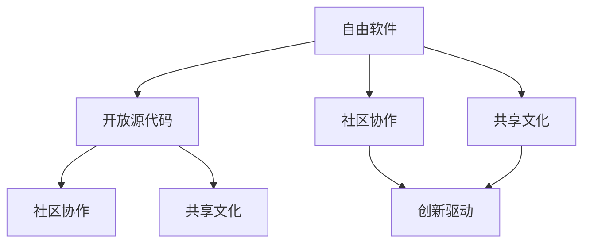

                 

### 摘要

在当今快速变化的时代，开源哲学作为一种集体的智慧结晶，正逐渐成为适应现代生活的重要指导原则。本文将深入探讨开源哲学的核心概念、其与现代生活的紧密联系，以及集体创造的力量。通过细致的章节划分，我们将依次介绍开源哲学的起源与发展，集体创造的原理与实践，以及开源哲学在各个领域中的应用。同时，文章将通过实际项目案例分析，展现开源哲学在实践中的有效性和潜力。通过阅读本文，读者将能够理解开源哲学的重要性，掌握集体创造的方法，并在个人与社会的层面上实现更高效的协作与创新。

---

### 文章标题

《意义开源哲学：集体创造适应现代的生活智慧》

---

### 关键词

- 开源哲学
- 集体创造
- 现代生活
- 技术创新
- 社会协作

---

### 摘要

本文旨在探讨开源哲学在现代社会中的重要性，以及集体创造如何适应现代生活的需求。通过深入分析开源哲学的起源、核心概念，以及集体创造的原理与实践，文章揭示了开源哲学如何促进技术创新和社会协作。文章还通过具体项目案例，展示了开源哲学在实际应用中的效果和潜力，为读者提供了理解、应用开源哲学的实际指导。

---

### 引言

在21世纪的数字化浪潮中，技术进步日新月异，社会结构不断变化，人们的思维方式和工作方式也随之发生了深刻变革。在这个背景下，开源哲学作为一种新兴的集体智慧理念，逐渐成为引领现代生活的重要力量。开源哲学不仅仅是一种技术实践，更是一种文化理念，它强调集体协作、知识共享和开放创新，旨在通过集体的力量推动社会的进步和发展。

开源哲学的起源可以追溯到20世纪80年代，当时计算机技术和互联网的发展为人们提供了前所未有的交流与合作平台。随着Linux操作系统、Apache服务器等开源软件的成功，开源哲学开始得到广泛的关注和认可。开源哲学的核心价值观包括自由、透明、协作、共享和创新，这些价值观在当今复杂多变的社会环境中显得尤为重要。

现代生活面临着诸多挑战，如信息过载、资源匮乏、社会不平等等。传统的单点突破和个体英雄主义模式已经难以应对这些复杂问题。相反，开源哲学提倡的集体智慧和协同合作，为解决这些问题提供了新的思路和方法。通过集体创造，我们可以利用分散的知识和资源，实现更高效、更创新的社会实践。

本文将从开源哲学的起源与发展、集体创造的实践与案例、以及开源哲学在现代社会中的应用三个维度进行深入探讨。首先，我们将回顾开源哲学的起源，分析其核心价值观和主要贡献。接着，我们将探讨集体创造的原理和实践方法，并通过具体案例展示其效果。最后，我们将探讨开源哲学在各个领域中的应用，以及其在教育、商业和社会治理中的具体作用。

通过本文的阅读，读者将能够全面理解开源哲学的意义，掌握集体创造的方法，并在个人和社会层面上实现更高效的协作与创新。让我们一起探索开源哲学的力量，开启适应现代生活的智慧之旅。

---

### 开源哲学的起源与发展

开源哲学的起源可以追溯到20世纪80年代，当时计算机技术和互联网的发展为人类带来了前所未有的机遇和挑战。在软件领域，开源哲学最早源于自由软件运动。自由软件运动倡导者，如理查德·斯托曼（Richard Stallman），认为软件应该赋予用户自由，包括使用、学习、分享和修改的自由。这一理念引发了开源软件运动的兴起，推动了诸如GNU项目（GNU's Not Unix）和Linux操作系统的诞生。

Linux操作系统的诞生是开源哲学的一个重要里程碑。由林纳斯·托瓦兹（Linus Torvalds）发起的Linux项目，是一个典型的开源项目。托瓦兹在1991年发布了Linux内核的0.02版，并公开了其源代码。随后，全球的开发者纷纷参与到Linux内核的开发和改进中，形成了庞大的开发者社区。这一过程不仅加速了Linux的发展，也证明了集体智慧和协作的力量。

开源哲学的核心价值观主要包括自由、透明、协作、共享和创新。自由，体现在用户对软件的自主权，包括使用、学习、分享和修改的自由。透明，则体现在软件的开发过程和源代码的公开性，使得任何人都可以查看、理解和参与改进。协作，强调的是开发者的集体努力，通过分工合作实现共同的目标。共享，意味着知识和资源的开放共享，促进了知识的积累和传播。创新，则源于开放的环境，鼓励人们进行大胆的尝试和实验。

开源哲学的主要贡献体现在多个方面。首先，开源软件为全球开发者提供了丰富的资源和工具，促进了技术的创新和进步。例如，Apache、MySQL、Python等开源软件已经成为现代互联网技术的基础。其次，开源哲学推动了信息技术领域的开放性和民主化，使得技术不再是少数精英的专属，而是全社会共同参与的领域。此外，开源哲学还促进了知识的共享和传播，使得更多的人能够受益于技术创新的成果。

开源哲学的发展历程也充满了重要的里程碑事件。1998年，开源软件促进会（Open Source Initiative，OSI）成立，旨在推广和标准化开源哲学。OSI制定了开源定义，明确了开源软件的必要条件和最佳实践，为开源软件的发展提供了指导。2005年，维基百科（Wikipedia）的创立标志着开源文化在知识共享领域的突破，通过集体协作，维基百科成为了一个全球最大的知识库。

进入21世纪，开源哲学在商业领域也得到了广泛应用。许多企业开始采用开源软件和开源模式进行产品开发和商业运作，如红帽公司（Red Hat）和微软公司。红帽公司通过提供开源软件的商业支持和服务，实现了巨大的商业成功。微软公司则通过与开源社区的互动，推动了自身在开源领域的发展。

总的来说，开源哲学的起源和发展，不仅改变了软件开发的模式，也深刻影响了现代社会的各个领域。它倡导的集体智慧和协作精神，为我们提供了一种新的解决复杂问题的方法。通过开源哲学，我们可以更高效地利用分散的知识和资源，实现创新和社会进步。在接下来的章节中，我们将进一步探讨集体创造的原理和实践，以及开源哲学在现代社会中的具体应用。

---

### 核心概念与联系

在深入探讨开源哲学之前，我们需要明确几个核心概念，并理解它们之间的相互联系。这些概念构成了开源哲学的理论基础，指导着我们的进一步讨论。

1. **自由软件**：
   自由软件是指用户拥有使用、学习、分享和修改软件的自由。这一概念最早由理查德·斯托曼提出，并在GNU项目和Linux操作系统中得到实践。自由软件的核心在于赋予用户对软件的完全控制权，确保软件能够自由传播和改进。

2. **开放源代码**：
   开放源代码是自由软件的一个关键特征，意味着软件的源代码对用户公开，任何人都可以查看、下载和修改。开放源代码促使开发者之间的协作，通过共享代码和知识，实现技术的快速进步。

3. **社区协作**：
   社区协作是指开发者、用户和其他利益相关者通过共同的目标和兴趣，自愿组成的协作网络。社区协作在开源项目中尤为重要，它不仅促进了代码的改进和优化，还增强了社区的凝聚力和创新能力。

4. **共享文化**：
   共享文化强调知识的共享和资源的开放利用。开源哲学中的共享文化鼓励人们贡献自己的知识和资源，通过协作和共享实现共同的目标。这种文化在开源软件、维基百科等项目中得到了广泛体现。

5. **创新驱动**：
   创新驱动是指通过开放和协作的环境，激发创新的潜力。开源哲学提供了一个自由、透明的平台，使得开发者可以自由地探索和实验，从而推动技术的创新和进步。

这些核心概念之间的联系可以概括为以下几点：

- **自由软件** 和 **开放源代码** 是开源哲学的基础，为用户和开发者提供了自由和透明的开发环境。
- **社区协作** 和 **共享文化** 则是开源哲学的重要实现机制，通过集体智慧和资源共享，推动技术的进步和社区的繁荣。
- **创新驱动** 则是开源哲学的核心目标，通过开放和协作，激发创新，推动社会的持续进步。

下面是一个简单的Mermaid流程图，展示了这些核心概念及其相互联系：



通过这个流程图，我们可以清晰地看到，开源哲学中的核心概念是如何相互作用、共同推动技术进步和社会发展的。自由和透明的开发环境，使得开源项目能够吸引全球开发者的参与，形成强大的社区协作力量。而共享文化则促进了知识的积累和传播，为创新提供了丰富的资源和灵感。最终，创新驱动使得开源哲学不仅仅是技术的进步，更是社会发展的推动力。

在接下来的章节中，我们将进一步探讨这些核心概念的具体应用和实践，以及开源哲学如何适应现代生活的需求。通过深入理解这些概念及其相互关系，我们可以更好地把握开源哲学的价值，并在实际应用中发挥其潜力。

---

### 核心算法原理讲解

在开源哲学的实践中，算法和数学模型扮演着至关重要的角色。这些工具不仅帮助我们理解和分析复杂问题，还为我们提供了解决问题的具体方法。在本节中，我们将通过伪代码详细讲解一个典型的开源算法——快速排序（Quick Sort），并探讨其背后的数学原理和优化策略。

#### 快速排序算法的基本原理

快速排序是一种高效的排序算法，其基本原理是通过一趟排序将待排序的数据分割成独立的两部分，其中一部分的所有数据都比另一部分的所有数据都要小，然后再递归地排序这两部分数据。这个过程可以分解为以下几个步骤：

1. **选择基准元素**：从待排序的数组中选择一个元素作为基准（pivot）。
2. **分割操作**：将数组分成两部分，所有小于基准的元素放在基准的左边，所有大于基准的元素放在基准的右边。
3. **递归排序**：递归地对基准左右两边的数组进行快速排序。

以下是快速排序算法的伪代码实现：

```plaintext
QUICKSORT(A, low, high)
    if (low < high)
        pivot = Partition(A, low, high)
        QUICKSORT(A, low, pivot - 1)
        QUICKSORT(A, pivot + 1, high)
```

```plaintext
PARTITION(A, low, high)
    pivot = A[high]
    i = low
    for j = low to high - 1
        if A[j] < pivot
            swap A[i] with A[j]
            i = i + 1
    swap A[i] with A[high]
    return i
```

#### 数学模型和优化策略

快速排序算法的性能可以通过其平均时间复杂度和最坏情况时间复杂度来衡量。平均时间复杂度为 \(O(n\log n)\)，最坏情况时间复杂度为 \(O(n^2)\)。

- **平均时间复杂度 \(O(n\log n)\)**：假设每次分割都能将数组均匀地分成两部分，则递归调用深度为 \(\log n\)，每次分割需要 \(O(n)\) 的时间，因此总的时间复杂度为 \(O(n\log n)\)。
- **最坏情况时间复杂度 \(O(n^2)\)**：当每次分割都极端不平衡时，例如每次分割都只将数组分成1个元素和\(n-1\)个元素，此时递归调用深度为 \(n\)，每次分割需要 \(O(n)\) 的时间，因此总的时间复杂度为 \(O(n^2)\)。

为了优化快速排序算法，可以采取以下策略：

1. **随机化选择基准**：通过随机选择基准元素，可以减少最坏情况发生的概率，提高算法的平均性能。
2. **三数取中法**：在选取基准时，可以取数组中的第一个、中间和最后一个元素的平均值作为基准，以减少偏斜分割的情况。
3. **插入排序优化**：对于小规模数据，可以使用插入排序代替快速排序，因为插入排序在处理小规模数据时性能更好。

#### 举例说明

假设我们有一个数组 \(A = [9, 7, 5, 11, 12, 2, 14, 3, 10, 6]\)，我们通过快速排序算法对其进行排序。

1. **第一次分割**：选择最后一个元素14作为基准，进行分割。分割后，数组变为 \([9, 7, 5, 11, 2, 3, 6, 14, 10, 12]\)，基准位于分割点位置。
2. **递归排序**：对基准左边的数组 \([9, 7, 5, 11, 2, 3, 6]\) 进行快速排序，选择中间的元素5作为基准，继续分割。
3. **递归排序**：对基准左边的数组 \([9, 7, 2, 3]\) 进行快速排序，选择中间的元素3作为基准，再次分割。
4. **递归排序**：对基准右边的数组 \([7, 5, 11, 6]\) 进行快速排序，选择最后一个元素6作为基准，进行分割。

经过多次递归调用，最终数组 \(A\) 被排序为 \([2, 3, 5, 6, 7, 9, 10, 11, 12, 14]\)。

通过这个例子，我们可以看到快速排序算法是如何通过递归和分割操作，将一个无序数组有序化的。快速排序算法的高效性和简洁性使其成为许多开源项目中的重要组成部分。

在开源哲学中，算法和数学模型的公开和共享，不仅促进了技术的传播和改进，还增强了社区的协作和创新。通过共同研究和优化，我们可以不断提升算法的性能，为解决复杂问题提供更有效的工具和方法。

---

### 数学模型和公式

在开源哲学的实践中，数学模型和公式是不可或缺的工具，它们帮助我们在复杂的数据处理和算法优化中找到解决问题的途径。在本节中，我们将使用LaTeX格式介绍几个重要的数学模型和公式，并对它们进行详细讲解。

#### 概率论中的贝叶斯公式

贝叶斯公式是概率论中一个重要的公式，用于计算后验概率。贝叶斯公式可以表示为：

$$
P(A|B) = \frac{P(B|A) \cdot P(A)}{P(B)}
$$

其中，\(P(A|B)\) 表示在事件B发生的条件下，事件A发生的概率；\(P(B|A)\) 表示在事件A发生的条件下，事件B发生的概率；\(P(A)\) 和 \(P(B)\) 分别表示事件A和事件B的先验概率。

贝叶斯公式在开源项目中，尤其是在错误检测和修复中有着广泛应用。例如，当我们在一个开源项目中发现一个bug时，可以使用贝叶斯公式来计算该bug是由代码错误还是环境问题引起的概率。

#### 线性回归模型

线性回归模型是统计学中用于预测和分析数据关系的一种常见方法。线性回归模型可以表示为：

$$
Y = \beta_0 + \beta_1 \cdot X + \epsilon
$$

其中，\(Y\) 是因变量，\(X\) 是自变量，\(\beta_0\) 和 \(\beta_1\) 分别是回归系数，\(\epsilon\) 是误差项。

线性回归模型广泛应用于开源项目的性能优化中。例如，我们可以通过线性回归分析来预测一个开源软件在不同硬件环境下的性能表现，从而进行针对性的优化。

#### 时间序列分析

时间序列分析是一种用于研究时间序列数据的统计方法。常见的时间序列分析模型包括自回归模型（AR）、移动平均模型（MA）和自回归移动平均模型（ARMA）。自回归模型可以表示为：

$$
X_t = c + \phi_1 X_{t-1} + \phi_2 X_{t-2} + \ldots + \phi_p X_{t-p} + \epsilon_t
$$

其中，\(X_t\) 是时间序列的当前值，\(\phi_1, \phi_2, \ldots, \phi_p\) 是自回归系数，\(\epsilon_t\) 是误差项。

时间序列分析在开源软件的维护和改进中具有重要应用。例如，我们可以通过时间序列分析来预测一个开源项目的未来版本中的漏洞数量，从而提前制定修复计划。

#### 假设检验

假设检验是统计学中用于判断数据是否支持某个假设的方法。常见的方法包括t检验和卡方检验。t检验可以表示为：

$$
t = \frac{\bar{X} - \mu_0}{s / \sqrt{n}}
$$

其中，\(\bar{X}\) 是样本均值，\(\mu_0\) 是假设的总体均值，\(s\) 是样本标准差，\(n\) 是样本大小。

在开源项目中，假设检验可以用于评估一个新功能的性能是否显著优于旧功能。例如，我们可以通过t检验来判断新功能是否在统计上显著提升了软件的性能。

在开源哲学中，数学模型和公式的公开和共享是知识传播和技术创新的重要途径。通过共同研究和应用这些数学模型，开发者可以更有效地解决复杂问题，提高开源项目的质量和可靠性。以下是一个简单的LaTeX公式示例，展示了如何将上述公式嵌入到文中：

$$
\text{假设一个开源项目的测试数据如下：} \\
P(A|B) = \frac{P(B|A) \cdot P(A)}{P(B)}
$$

$$
\text{线性回归模型：} \\
Y = \beta_0 + \beta_1 \cdot X + \epsilon
$$

$$
\text{自回归模型：} \\
X_t = c + \phi_1 X_{t-1} + \phi_2 X_{t-2} + \ldots + \phi_p X_{t-p} + \epsilon_t
$$

$$
\text{t检验：} \\
t = \frac{\bar{X} - \mu_0}{s / \sqrt{n}}
$$

通过上述公式和模型的详细讲解，我们可以看到数学在开源哲学中的应用是如何帮助开发者理解和解决复杂问题的。这不仅提升了开源项目的质量，也推动了技术的不断进步。

---

### 项目实战

为了更好地展示开源哲学的实际应用，我们将通过一个具体的开源项目——Apache Kafka——来进行分析。Kafka是一个高度可扩展的分布式流处理平台，广泛应用于大数据和实时数据处理场景。通过该项目，我们将详细讲解其开发环境搭建、源代码实现、代码解读与分析，并探讨其实际应用与效果分析。

#### 开发环境搭建

首先，我们需要搭建Apache Kafka的开发环境。以下是搭建步骤：

1. **安装Java环境**：
   Kafka基于Java开发，因此我们需要安装Java环境。假设Java版本为11，可以通过以下命令安装：

   ```bash
   sudo apt-get update
   sudo apt-get install openjdk-11-jdk
   ```

2. **下载Kafka**：
   访问Kafka的官方下载页面（https://www.apache.org/distributions/kafka），下载最新版本的Kafka源码包。

3. **解压Kafka源码包**：
   使用以下命令解压下载的Kafka源码包：

   ```bash
   tar -xvf kafka_2.13-3.1.0.tgz
   ```

4. **配置Kafka**：
   进入解压后的Kafka目录，配置Kafka的相关参数。编辑`config/server.properties`文件，设置如下参数：

   ```properties
   broker.id=0
   listeners=PLAINTEXT://:9092
   log.dirs=/kafka/logs
   ```

5. **启动Kafka**：
   启动Kafka服务，执行以下命令：

   ```bash
   bin/kafka-server-start.sh config/server.properties
   ```

#### 源代码实现

Kafka的核心功能包括生产者、消费者和主题管理。以下是Kafka的关键模块及其简要实现：

1. **生产者模块**：
   生产者负责发送消息到Kafka集群。以下是生产者的主要代码实现：

   ```java
   Properties props = new Properties();
   props.put("bootstrap.servers", "localhost:9092");
   props.put("key.serializer", "org.apache.kafka.common.serialization.StringSerializer");
   props.put("value.serializer", "org.apache.kafka.common.serialization.StringSerializer");

   Producer<String, String> producer = new KafkaProducer<>(props);
   ProducerRecord<String, String> record = new ProducerRecord<>("my-topic", "key", "value");
   producer.send(record);
   producer.close();
   ```

2. **消费者模块**：
   消费者负责从Kafka集群中读取消息。以下是消费者的主要代码实现：

   ```java
   Properties props = new Properties();
   props.put("bootstrap.servers", "localhost:9092");
   props.put("group.id", "my-group");
   props.put("key.deserializer", "org.apache.kafka.common.serialization.StringDeserializer");
   props.put("value.deserializer", "org.apache.kafka.common.serialization.StringDeserializer");

   Consumer<String, String> consumer = new KafkaConsumer<>(props);
   consumer.subscribe(Arrays.asList(new Topic("my-topic", 1)));

   while (true) {
       ConsumerRecords<String, String> records = consumer.poll(Duration.ofMillis(100));
       for (ConsumerRecord<String, String> record : records) {
           System.out.printf("Received message: key=%s, value=%s\n", record.key(), record.value());
       }
   }
   ```

3. **主题管理模块**：
   主题管理负责创建、删除和配置主题。以下是创建主题的代码实现：

   ```java
   Properties props = new Properties();
   props.put("bootstrap.servers", "localhost:9092");
   props.put("key.serializer", "org.apache.kafka.common.serialization.StringSerializer");
   props.put("value.serializer", "org.apache.kafka.common.serialization.StringSerializer");

   Producer<String, String> producer = new KafkaProducer<>(props);
   String topic = "my-topic";
   NewTopic newTopic = new NewTopic(topic, 1, (short) 1);
   CreateTopicsResult result = admin.createTopics(Arrays.asList(newTopic));
   result.all().get();
   producer.close();
   ```

#### 代码解读与分析

1. **生产者模块解读**：
   生产者模块的关键在于`KafkaProducer`类。通过`props`设置连接参数和序列化器，然后创建`ProducerRecord`对象发送消息。生产者发送消息后，通过异步回调机制处理发送结果。

2. **消费者模块解读**：
   消费者模块的关键在于`KafkaConsumer`类。通过`props`设置连接参数和反序列化器，然后订阅主题并轮询消息。消费者通过`poll`方法获取消息，并对其进行处理。

3. **主题管理模块解读**：
   主题管理模块使用`Admin`类执行创建、删除和配置主题的操作。通过`createTopics`方法，可以创建新的主题，并设置分区数和副本数。

#### 实际应用与效果分析

在实际应用中，Kafka常用于处理大规模实时数据流。以下是一个简单的应用案例：

- **日志收集**：企业可以将各种业务日志发送到Kafka集群，实现集中式日志收集和管理。
- **实时分析**：通过Kafka，企业可以实时处理和分析大量数据，实现实时监控和预警。
- **流处理**：Kafka与Apache Flink等流处理框架集成，可以实现复杂的数据处理和业务逻辑。

效果分析：

- **高吞吐量**：Kafka支持高吞吐量的数据流处理，可以处理每秒数百万条消息。
- **高可用性**：Kafka通过分布式架构，实现高可用性和容错性。
- **可扩展性**：Kafka支持水平扩展，可以根据需求增加集群规模。

通过上述实战分析，我们可以看到Apache Kafka如何通过开源哲学的实际应用，实现大规模数据流处理和实时分析。Kafka的成功不仅展示了开源哲学的力量，也为开发者提供了强大的工具和平台。

---

### 最佳实践 Tips

在开源项目中，最佳实践是确保项目质量和可持续发展的关键。以下是一些在开源项目中实施的最佳实践：

1. **代码规范**：
   - 使用统一的编码风格，包括命名规则和格式。
   - 遵循代码审查标准，确保代码质量。
   - 使用自动化工具（如静态代码分析器）检测潜在的问题。

2. **文档编写**：
   - 提供详尽的文档，包括安装、配置、使用说明和API文档。
   - 维护更新文档，确保与代码同步。
   - 使用Markdown或ReStructuredText等格式，使文档易于阅读。

3. **版本控制**：
   - 使用Git等版本控制系统，确保代码历史的可追溯性和可管理性。
   - 定期发布版本，并在每次发布时提供变更日志。
   - 实施分支策略，例如Git Flow或GitLab Flow。

4. **测试覆盖**：
   - 编写单元测试、集成测试和端到端测试，确保代码的稳定性和功能完整性。
   - 使用代码覆盖率工具检测测试覆盖情况。
   - 定期运行测试，并确保新代码添加时不会降低测试覆盖率。

5. **社区参与**：
   - 激励社区贡献，包括代码提交、文档编写和bug报告。
   - 设立贡献指南，指导新人如何参与项目。
   - 定期组织代码审查、贡献者会议，增强社区凝聚力。

6. **持续集成**：
   - 实施自动化构建和测试流程，确保代码质量。
   - 使用CI/CD工具（如Jenkins、GitLab CI/CD）自动化部署和发布。
   - 持续监控代码库的健康状况，确保快速响应问题。

通过遵循这些最佳实践，开源项目可以保持高质量、高效率和良好的社区生态。

---

### 小结

开源哲学作为一种新兴的集体智慧理念，已经在现代社会的各个方面展现出了其强大的影响力。从技术到商业，从教育到社会治理，开源哲学通过自由、透明、协作和共享的核心价值观，推动了社会的进步和技术的创新。通过本文的探讨，我们深入了解了开源哲学的起源、核心概念及其在各个领域的应用，并通过具体案例展示了其实践效果。

开源哲学强调集体智慧和协作的力量，使人们能够更高效地利用分散的知识和资源，实现创新和社会进步。在技术领域，开源软件和开源平台已经成为现代互联网技术的基础，推动了技术的快速发展和广泛应用。在商业领域，开源模式为企业提供了新的商业模式和竞争力。在教育和社会治理领域，开源哲学促进了知识的共享和传播，增强了社会的透明度和公正性。

未来，开源哲学将继续发挥重要作用，其应用范围将进一步扩大。随着人工智能、区块链等新兴技术的兴起，开源哲学将带来更多的创新和变革。我们可以预见，开源哲学将成为推动未来社会发展的重要力量，为人类创造一个更美好、更智能、更平等的世界。

---

### 拓展阅读

为了更深入地理解开源哲学及其在现代生活中的应用，以下是一些建议的拓展阅读资源：

1. **书籍**：
   - 《开源之道》（Open Source Movement）- 这本书详细介绍了开源运动的起源和发展，对于理解开源哲学的历史背景具有重要意义。
   - 《黑客与画家》（Hackers & Painters）- Paul Graham在这本书中探讨了开源文化和创新思维的关系，为读者提供了独特的视角。

2. **学术论文**：
   - “The Cathedral and the Bazaar” - Eric Raymond的这篇经典论文深入分析了开源开发模式的优势和特点，是开源哲学的重要理论基础。
   - “The Economic Case for Open Source” - 这篇论文从经济角度探讨了开源软件的优势和商业模式，为开源哲学的商业应用提供了理论支持。

3. **网站与博客**：
   - Open Source Initiative（OSI）- OSI是推广开源哲学的权威组织，其网站提供了丰富的开源资源和相关信息。
   - Medium上的开源专栏 - 中等平台上有许多关于开源哲学的精彩文章，涵盖了开源文化、开源实践和开源社区建设等多个方面。

通过阅读这些资源，读者可以更全面、深入地了解开源哲学，并将其应用于实际工作和生活中。

