                 


### 第一部分：意义开源社区概述

#### 第1章：开源社区的崛起与现代生活

**背景介绍**  
开源社区起源于20世纪90年代的自由软件运动，随着时间的推移，开源社区已经发展成为现代技术生态中的重要组成部分。从Linux内核到OpenOffice，从Apache服务器到MySQL数据库，开源软件已经深入到我们生活的方方面面。开源社区不仅为软件开发提供了强大的动力，也改变了我们的生活方式。

**核心概念与联系**  
开源社区、现代生活、技术生态

**Mermaid 流�程图**  
``` 
graph TB
A[开源社区崛起] --> B[现代生活改变]
B --> C[技术生态完善]
```

**核心算法原理讲解**  
伪代码： 
``` 
function 社区崛起(社区，时间){
    // 初始化社区
    初始化社区(社区)

    // 社区成长
    while 时间未结束 do {
        社区贡献增加(社区)
        社区影响力扩大(社区)
    }

    // 社区成熟
    社区成熟(社区)
}
```

**数学模型讲解**  
``` 
模型：社区影响力评估模型

$$
影响力 = f(\text{成员数量，成员贡献，社区活跃度})
$$

其中，成员数量、成员贡献和社区活跃度是影响社区影响力的三个关键因素。
```

**项目实战**  
案例：Linux内核的崛起  
1. Linux内核的起源和发展  
2. Linux内核在开源社区中的地位和影响力  
3. Linux内核对现代生活的影响

### 第2章：开源社区的运作模式

**背景介绍**  
开源社区的运作模式是开源社区能够长期稳定发展的重要保障。从社区治理结构到项目生命周期，开源社区的运作模式充满了复杂性和智慧。

**核心概念与联系**  
开源社区运作模式、社区治理结构、项目生命周期

**Mermaid 流程图**  
``` 
graph TB
A[社区治理结构] --> B[项目生命周期]
B --> C[社区协作与沟通]
```

**核心算法原理讲解**  
伪代码： 
``` 
function 社区运作模式(社区，项目){
    // 初始化社区和项目
    初始化社区(社区)
    初始化项目(项目)

    // 社区治理
    社区治理(社区)

    // 项目生命周期
    while 项目未完成 do {
        项目开发(项目)
        项目测试(项目)
        项目发布(项目)
    }

    // 社区协作与沟通
    社区协作与沟通(社区)
}
```

**数学模型讲解**  
``` 
模型：项目风险评估模型

$$
风险 = f(\text{项目复杂度，项目进度，成员协作程度})
$$

其中，项目复杂度、项目进度和成员协作程度是影响项目风险的关键因素。
```

**项目实战**  
案例：Apache开源项目的运作模式  
1. Apache开源项目的起源和发展  
2. Apache开源项目的治理结构  
3. Apache开源项目的生命周期

### 第3章：开源社区的文化与哲学

**背景介绍**  
开源社区的文化与哲学是开源社区的灵魂。它不仅决定了开源社区的发展方向，也影响了开源社区的成员。

**核心概念与联系**  
开源社区文化、开源哲学、社区价值观

**Mermaid 流程图**  
``` 
graph TB
A[开源社区文化] --> B[开源哲学]
B --> C[社区价值观]
```

**核心算法原理讲解**  
伪代码： 
``` 
function 社区文化与哲学(社区，成员){
    // 初始化社区和成员
    初始化社区(社区)
    初始化成员(成员)

    // 培养社区文化
    培养社区文化(社区)

    // 塑造开源哲学
    塑造开源哲学(社区)

    // 确立社区价值观
    确立社区价值观(社区)

    // 成员价值观与社区文化的融合
    成员融合价值观与社区文化(成员，社区)
}
```

**数学模型讲解**  
``` 
模型：社区价值观评估模型

$$
价值观 = f(\text{成员价值观，社区文化，社区目标})
$$

其中，成员价值观、社区文化和社区目标是影响社区价值观的关键因素。
```

**项目实战**  
案例：GitHub的开源文化  
1. GitHub的开源文化特点  
2. GitHub的开源哲学  
3. GitHub的社区价值观

### 第二部分：集体创造的实践

#### 第4章：集体创造的理念

**背景介绍**  
集体创造是一种基于协作和共享的理念，它强调的是集体智慧和共同创造的力量。在现代科技和社会背景下，集体创造已经成为许多领域的重要推动力。

**核心概念与联系**  
集体创造、协作、共享、集体智慧

**Mermaid 流程图**  
``` 
graph TB
A[集体创造理念] --> B[协作与共享]
B --> C[集体智慧]
```

**核心算法原理讲解**  
伪代码： 
``` 
function 集体创造(社区，项目，成员){
    // 初始化社区、项目和成员
    初始化社区(社区)
    初始化项目(项目)
    初始化成员(成员)

    // 成员加入社区
    成员加入社区(成员，社区)

    // 项目需求分析
    需求分析(项目)

    // 集体智慧融合
    集体智慧融合(项目)

    // 项目开发与测试
    while 项目未完成 do {
        项目开发(项目)
        项目测试(项目)
    }

    // 项目交付与评价
    项目交付(项目)
    项目评价(项目)
}
```

**数学模型讲解**  
``` 
模型：集体创造效率模型

$$
效率 = f(\text{成员数量，项目需求，协作程度})
$$

其中，成员数量、项目需求和协作程度是影响集体创造效率的关键因素。
```

**项目实战**  
案例：维基百科的集体创造过程  
1. 维基百科的起源和发展  
2. 维基百科的协作机制  
3. 维基百科的集体创造效率

#### 第5章：集体创造的工具与技术

**背景介绍**  
集体创造离不开工具和技术的支持。从代码管理工具到协作平台，从版本控制到实时沟通，各种工具和技术为集体创造提供了坚实的基础。

**核心概念与联系**  
集体创造工具、协作平台、代码管理、版本控制、实时沟通

**Mermaid 流程图**  
``` 
graph TB
A[集体创造工具] --> B[协作平台]
B --> C[代码管理]
C --> D[版本控制]
D --> E[实时沟通]
```

**核心算法原理讲解**  
伪代码： 
``` 
function 集体创造工具(社区，项目，成员){
    // 初始化社区、项目和成员
    初始化社区(社区)
    初始化项目(项目)
    初始化成员(成员)

    // 安装代码管理工具
    安装代码管理工具(社区)

    // 安装版本控制工具
    安装版本控制工具(社区)

    // 安装实时沟通工具
    安装实时沟通工具(社区)

    // 成员使用工具
    成员使用工具(成员，社区)

    // 项目协作
    项目协作(项目)

    // 项目测试
    项目测试(项目)

    // 项目交付
    项目交付(项目)
}
```

**数学模型讲解**  
``` 
模型：工具与技术效率模型

$$
效率 = f(\text{工具种类，技术成熟度，成员技能})
$$

其中，工具种类、技术成熟度和成员技能是影响工具与技术效率的关键因素。
```

**项目实战**  
案例：GitLab的集体创造工具使用  
1. GitLab的起源和发展  
2. GitLab的工具与技术特点  
3. GitLab在集体创造中的应用

#### 第6章：集体创造的案例分析

**背景介绍**  
集体创造的成功与失败都是宝贵的经验。通过案例分析，我们可以更好地理解集体创造的实践过程，发现其中的问题和挑战。

**核心概念与联系**  
集体创造案例、成功经验、失败教训、问题与挑战

**Mermaid 流程图**  
``` 
graph TB
A[成功案例] --> B[失败案例]
B --> C[问题与挑战]
```

**核心算法原理讲解**  
伪代码： 
``` 
function 集体创造案例分析(社区，项目，成员，案例){
    // 初始化社区、项目和成员
    初始化社区(社区)
    初始化项目(项目)
    初始化成员(成员)

    // 分析成功案例
    分析成功案例(社区，项目，成员)

    // 分析失败案例
    分析失败案例(社区，项目，成员)

    // 识别问题与挑战
    识别问题与挑战(社区，项目，成员)
}
```

**数学模型讲解**  
``` 
模型：案例分析效果模型

$$
效果 = f(\text{成功案例数量，失败案例数量，问题与挑战识别程度})
$$

其中，成功案例数量、失败案例数量和问题与挑战识别程度是影响案例分析效果的关键因素。
```

**项目实战**  
案例：Trello的成功与失败  
1. Trello的起源和发展  
2. Trello的成功因素  
3. Trello的失败教训  
4. Trello对集体创造的启示

### 第三部分：现代生活哲学的适应与发展

#### 第7章：适应现代生活的哲学思维

**背景介绍**  
现代生活充满了快速变化和不确定性。如何适应现代生活，如何找到内心的平衡，哲学思维为我们提供了宝贵的思考方式。

**核心概念与联系**  
现代生活、哲学思维、内心平衡

**Mermaid 流程图**  
``` 
graph TB
A[现代生活挑战] --> B[哲学思维应用]
B --> C[内心平衡]
```

**核心算法原理讲解**  
伪代码： 
``` 
function 哲学思维(生活，挑战，成员){
    // 初始化生活状态
    初始化生活状态(生活)

    // 识别挑战
    识别挑战(生活)

    // 应用哲学思维
    应用哲学思维(生活，挑战)

    // 寻求内心平衡
    寻求内心平衡(生活)
}
```

**数学模型讲解**  
``` 
模型：哲学思维适应模型

$$
适应度 = f(\text{哲学思维深度，生活挑战程度，内心平衡度})
$$

其中，哲学思维深度、生活挑战程度和内心平衡度是影响适应度的关键因素。
```

**项目实战**  
案例：庄子与计算机编程  
1. 庄子的哲学思想  
2. 庄子哲学在计算机编程中的应用  
3. 庄子哲学对现代生活的启示

#### 第8章：开源社区与个人成长

**背景介绍**  
开源社区是一个充满机会和挑战的领域。如何在这个领域中成长，如何发挥个人的价值，开源社区为我们提供了广阔的舞台。

**核心概念与联系**  
开源社区、个人成长、价值发挥

**Mermaid 流程图**  
``` 
graph TB
A[开源社区] --> B[个人成长]
B --> C[价值发挥]
```

**核心算法原理讲解**  
伪代码： 
``` 
function 个人成长(社区，成员){
    // 初始化社区状态
    初始化社区状态(社区)

    // 成员加入社区
    成员加入社区(成员，社区)

    // 学习与成长
    学习与成长(成员)

    // 贡献与价值
    贡献与价值(成员，社区)

    // 社区反馈与调整
    社区反馈与调整(社区，成员)
}
```

**数学模型讲解**  
``` 
模型：个人成长模型

$$
成长度 = f(\text{学习时间，贡献数量，社区反馈})
$$

其中，学习时间、贡献数量和社区反馈是影响个人成长的关键因素。
```

**项目实战**  
案例：GitHub的个人成长  
1. GitHub的个人成长机制  
2. GitHub的个人成长路径  
3. GitHub的个人成长案例

#### 第9章：开源社区的未来展望

**背景介绍**  
随着科技的不断进步，开源社区的未来充满了无限可能。人工智能、区块链、物联网等新兴技术的兴起，将为开源社区带来新的机遇和挑战。

**核心概念与联系**  
开源社区、未来展望、新兴技术

**Mermaid 流程图**  
``` 
graph TB
A[开源社区未来展望] --> B[新兴技术影响]
B --> C[机遇与挑战]
```

**核心算法原理讲解**  
伪代码： 
``` 
function 未来展望(社区，技术，成员){
    // 初始化社区状态
    初始化社区状态(社区)

    // 新兴技术引入
    新兴技术引入(社区，技术)

    // 成员适应与学习
    成员适应与学习(成员，技术)

    // 社区调整与优化
    社区调整与优化(社区，技术)

    // 未来展望与规划
    未来展望与规划(社区，技术)
}
```

**数学模型讲解**  
``` 
模型：未来展望模型

$$
展望度 = f(\text{技术成熟度，社区适应度，成员积极性})
$$

其中，技术成熟度、社区适应度和成员积极性是影响未来展望度的关键因素。
```

**项目实战**  
案例：OpenAI的开源未来  
1. OpenAI的起源和发展  
2. OpenAI的技术创新  
3. OpenAI的开源未来规划

# 附录

## 附录A：开源社区资源

### A.1 开源社区门户网站

**资源介绍**  
开源社区门户网站是开源社区的重要入口，提供了丰富的社区信息和服务。例如，GitHub、GitLab和Bitbucket等。

**资源链接**  
- GitHub: https://github.com/
- GitLab: https://gitlab.com/
- Bitbucket: https://bitbucket.org/

### A.2 开源社区工具与平台

**资源介绍**  
开源社区工具和平台为开源社区提供了强大的支持。例如，Git、GitHub Actions、Jenkins等。

**资源链接**  
- Git: https://git-scm.com/
- GitHub Actions: https://github.com/features/actions
- Jenkins: https://www.jenkins.io/

### A.3 开源社区优秀项目推荐

**资源介绍**  
开源社区拥有大量的优秀项目，涵盖了各种领域。以下是一些推荐的优秀项目：

- Linux内核：https://www.kernel.org/
- Apache软件基金会：https://www.apache.org/
- MySQL：https://www.mysql.com/

## 作者信息

**作者：** AI天才研究院/AI Genius Institute & 禅与计算机程序设计艺术 /Zen And The Art of Computer Programming
----------------------------------------------------------------

# 意义开源社区：集体创造适应现代的生活哲学平台

## 文章关键词
开源社区、集体创造、现代生活、哲学思维、个人成长、未来展望

## 摘要
开源社区作为一种集体创造的形式，正在深刻地影响现代生活。本文从开源社区的概述、集体创造的实践、现代生活哲学的适应与发展三个方面，深入探讨了开源社区如何通过集体创造适应现代生活，并提出了相关的核心算法原理和数学模型。文章旨在为读者提供一个全面的理解，帮助他们在开源社区中更好地实现个人成长和贡献。

## 第一部分：意义开源社区概述

### 第1章：开源社区的崛起与现代生活

#### 1.1 开源社区的发展历程

开源社区起源于20世纪90年代的自由软件运动。当时的自由软件运动倡导的是软件的自由和开放，反对商业软件的垄断。随着互联网的普及，开源社区逐渐发展成为全球性的现象。开源社区的核心价值在于开放性、协作性和共享性。这些价值观不仅推动了技术的进步，也深刻地影响了我们的生活方式。

在过去的几十年中，开源社区已经从简单的代码共享平台发展成为复杂的技术生态系统。从Linux内核到OpenOffice，从Apache服务器到MySQL数据库，开源软件已经深入到我们生活的方方面面。开源社区不仅为软件开发提供了强大的动力，也改变了我们的生活方式。通过开源社区，我们可以方便地获取到各种软件和技术，不需要担心高昂的商业软件费用。同时，开源社区也为程序员提供了一个展示才华的平台，让更多的人参与到技术的创新中来。

#### 1.2 开源社区的核心价值

开源社区的核心价值主要体现在以下几个方面：

1. **开放性**：开源社区的软件代码是公开的，任何人都可以自由地查看、修改和分发。这种开放性促进了技术的共享和传播，让更多的人能够受益于开源技术。

2. **协作性**：开源社区的运作方式是基于协作的。成员之间可以自由地交流、合作，共同推动项目的进展。协作性不仅提高了项目的开发效率，也培养了成员的团队精神。

3. **共享性**：开源社区倡导共享的理念，成员可以自由地使用、修改和分发开源软件。这种共享性不仅降低了软件的使用成本，也促进了技术的普及和推广。

#### 1.3 开源社区与现代生活方式的融合

随着开源社区的发展，现代生活方式也在不断地与开源社区融合。开源社区不仅为我们提供了丰富的技术资源，也为我们提供了一种新的生活方式。

1. **技术获取的便捷性**：通过开源社区，我们可以方便地获取到各种软件和技术。无论是操作系统、数据库、Web服务器，还是其他各种工具，都可以在开源社区中找到。这种便捷性大大降低了技术获取的成本，让更多的人能够享受到技术带来的便利。

2. **个人成长的平台**：开源社区为程序员提供了一个展示才华的平台。通过参与开源项目，程序员不仅可以提升自己的技能，还可以结识到更多的同行。这种成长平台不仅促进了技术的进步，也培养了成员的自信心和责任感。

3. **协作精神的培养**：开源社区的协作性要求成员之间需要相互合作、相互支持。这种协作精神不仅提高了项目的开发效率，也培养了成员的团队精神和社会责任感。

#### 核心概念与联系

在开源社区的发展历程中，开放性、协作性和共享性是三个核心的概念。它们相互关联，共同构成了开源社区的核心价值。开放性是开源社区的基础，协作性是开源社区的生命力，共享性是开源社区的目标。

**Mermaid 流程图**

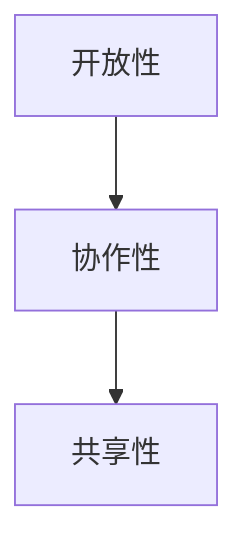

**核心算法原理讲解**

伪代码：
```
function 开源社区发展(历史，价值，生活方式) {
    // 初始化历史
    初始化历史(历史)

    // 发展历程
    while 历史未结束 do {
        开放性推动(历史)
        协作性增强(历史)
        共享性扩展(历史)
    }

    // 生活方式改变
    生活方式改变(生活方式)
}
```

**数学模型讲解**

模型：开源社区价值评估模型
```
价值 = f(开放性，协作性，共享性)

其中，开放性、协作性和共享性是影响开源社区价值的关键因素。
```

**项目实战**

案例：Linux内核的崛起

1. **Linux内核的起源和发展**：Linux内核是由林纳斯·托瓦兹（Linus Torvalds）在1991年发布的。它基于Minix操作系统，但采用了全新的内核设计。Linux内核的发布标志着开源社区的崛起。

2. **Linux内核在开源社区中的地位和影响力**：Linux内核是开源社区中最成功的项目之一。它被广泛应用于各种领域，包括服务器、桌面、嵌入式设备等。Linux内核的成功不仅改变了操作系统的发展方向，也推动了开源社区的繁荣。

3. **Linux内核对现代生活的影响**：Linux内核的普及使得计算机操作系统变得更加开放和自由。我们可以自由地使用、修改和分发Linux内核，而不需要担心商业软件的束缚。Linux内核的普及也促进了计算机硬件的发展，为计算机用户提供了更多的选择。

### 第2章：开源社区的运作模式

#### 2.1 开源社区的治理结构

开源社区的治理结构是开源社区能够长期稳定发展的重要保障。开源社区的治理结构通常包括以下几个方面：

1. **社区委员会**：社区委员会是开源社区的最高决策机构。社区委员会由社区的核心成员组成，负责制定社区的发展方向、决策重大事项等。

2. **项目委员会**：项目委员会是开源项目的决策机构。项目委员会负责项目的管理、决策和协调。

3. **社区经理**：社区经理是开源社区的日常管理者。社区经理负责社区的日常运营、成员沟通、资源分配等。

4. **开发者**：开发者是开源社区的核心力量。开发者负责项目的开发、测试和优化。

**Mermaid 流程图**

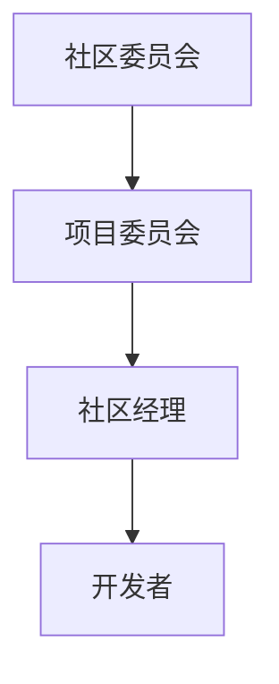

**核心算法原理讲解**

伪代码：
```
function 社区治理(社区) {
    // 初始化社区
    初始化社区(社区)

    // 社区委员会决策
    社区委员会决策(社区)

    // 项目委员会决策
    项目委员会决策(社区)

    // 社区经理运营
    社区经理运营(社区)

    // 开发者开发
    开发者开发(社区)
}
```

**数学模型讲解**

模型：社区治理效率模型
```
效率 = f(社区委员会决策效率，项目委员会决策效率，社区经理运营效率，开发者开发效率)

其中，社区委员会决策效率、项目委员会决策效率、社区经理运营效率和开发者开发效率是影响社区治理效率的关键因素。
```

**项目实战**

案例：Apache开源项目的运作模式

1. **Apache开源项目的起源和发展**：Apache软件基金会成立于1999年，是一个非营利组织，负责维护和管理Apache软件项目。Apache软件基金会最初由一组开发人员组成，他们共同开发了Apache HTTP服务器。

2. **Apache开源项目的治理结构**：Apache开源项目的治理结构包括Apache董事会、项目管理委员会和各个项目的项目管理团队。Apache董事会负责整体战略规划和决策，项目管理委员会负责项目的技术指导和质量控制。

3. **Apache开源项目的生命周期**：Apache开源项目的生命周期包括提案、孵化、稳定和维护等阶段。每个阶段都有明确的目标和流程。

#### 2.2 开源项目的生命周期

开源项目的生命周期是指从项目启动到项目结束的整个过程。开源项目的生命周期通常包括以下几个阶段：

1. **提案阶段**：项目提案阶段是项目的初始阶段。在这个阶段，项目提案人需要提交项目提案，描述项目的目标、功能和实现方案。

2. **孵化阶段**：项目孵化阶段是项目的成长阶段。在这个阶段，项目需要经历代码审查、社区反馈和优化等过程。

3. **稳定阶段**：项目稳定阶段是项目的成熟阶段。在这个阶段，项目已经得到了广泛的认可和接受，并进入稳定维护状态。

4. **维护阶段**：项目维护阶段是项目的持续阶段。在这个阶段，项目需要不断修复漏洞、更新功能和改进性能。

**Mermaid 流程图**

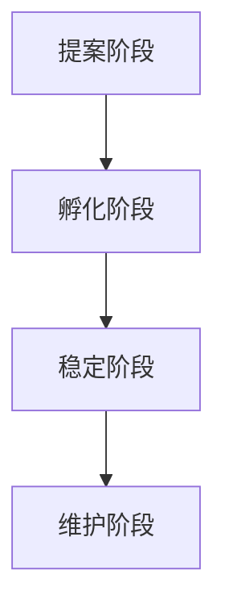

**核心算法原理讲解**

伪代码：
```
function 项目生命周期(项目) {
    // 初始化项目
    初始化项目(项目)

    // 提案阶段
    提案阶段(项目)

    // 孵化阶段
    孵化阶段(项目)

    // 稳定阶段
    稳定阶段(项目)

    // 维护阶段
    维护阶段(项目)
}
```

**数学模型讲解**

模型：项目生命周期效率模型
```
效率 = f(提案阶段效率，孵化阶段效率，稳定阶段效率，维护阶段效率)

其中，提案阶段效率、孵化阶段效率、稳定阶段效率和维护阶段效率是影响项目生命周期效率的关键因素。
```

**项目实战**

案例：Apache HTTP服务器的生命周期

1. **Apache HTTP服务器的提案阶段**：Apache HTTP服务器的提案阶段是在1995年。当时，一组开发人员提出了一个基于NCSA HTTP服务器的改进版。

2. **Apache HTTP服务器的孵化阶段**：Apache HTTP服务器的孵化阶段是在1995年至1997年。在这个阶段，Apache HTTP服务器经历了多次代码审查和社区反馈，逐渐成熟。

3. **Apache HTTP服务器的稳定阶段**：Apache HTTP服务器的稳定阶段是在1997年至2002年。在这个阶段，Apache HTTP服务器得到了广泛的认可和接受，成为Web服务器市场的领导者。

4. **Apache HTTP服务器的维护阶段**：Apache HTTP服务器的维护阶段是从2002年至今。在这个阶段，Apache HTTP服务器不断修复漏洞、更新功能和改进性能，保持了其在Web服务器市场的领先地位。

### 第3章：开源社区的文化与哲学

#### 3.1 开源社区的价值观

开源社区的文化与哲学是开源社区的灵魂。开源社区的价值观主要体现在以下几个方面：

1. **自由与开放**：开源社区倡导软件的自由和开放。软件代码是公开的，任何人都可以自由地查看、修改和分发。

2. **共享与合作**：开源社区倡导共享与合作。成员之间可以自由地交流、合作，共同推动项目的进展。

3. **透明与民主**：开源社区倡导透明与民主。社区的所有决策都是公开的，所有成员都有平等的发言权和参与权。

4. **创新与进步**：开源社区鼓励创新与进步。成员可以自由地提出新的想法和改进方案，共同推动技术的发展。

**Mermaid 流程图**

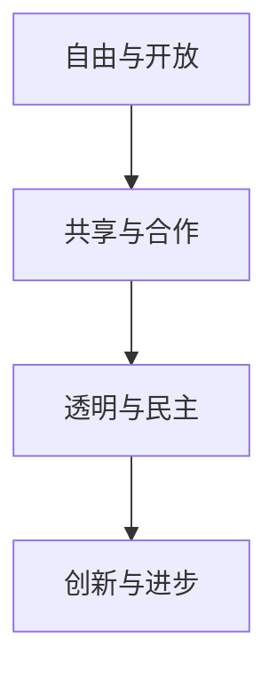

**核心算法原理讲解**

伪代码：
```
function 社区价值观(社区) {
    // 初始化社区
    初始化社区(社区)

    // 倡导自由与开放
    倡导自由与开放(社区)

    // 倡导共享与合作
    倡导共享与合作(社区)

    // 倡导透明与民主
    倡导透明与民主(社区)

    // 倡导创新与进步
    倡导创新与进步(社区)
}
```

**数学模型讲解**

模型：社区价值观评估模型
```
价值观 = f(自由与开放，共享与合作，透明与民主，创新与进步)

其中，自由与开放，共享与合作，透明与民主，创新与进步是影响社区价值观的关键因素。
```

**项目实战**

案例：GitHub的开源文化

1. **GitHub的开源文化特点**：GitHub是一个基于Git的版本控制系统，它为开发者提供了一个方便的协作平台。GitHub的开源文化主要体现在以下几个方面：

   - **自由与开放**：GitHub的代码仓库是公开的，任何人都可以自由地查看、修改和分发。
   - **共享与合作**：GitHub鼓励成员之间共享代码和知识，共同推动项目的发展。
   - **透明与民主**：GitHub的所有决策都是公开的，所有成员都有平等的发言权和参与权。
   - **创新与进步**：GitHub鼓励成员提出新的想法和改进方案，共同推动技术的发展。

2. **GitHub的开源哲学**：GitHub的开源哲学可以总结为“一切皆可共享”。这种哲学不仅体现在GitHub的平台上，也体现在GitHub成员的行为中。

3. **GitHub的社区价值观**：GitHub的社区价值观包括自由、开放、共享、协作、透明、民主和创新等。这些价值观不仅促进了GitHub的繁荣，也为其他开源社区提供了借鉴。

## 第二部分：集体创造的实践

### 第4章：集体创造的理念

#### 4.1 集体创造的定义

集体创造是一种基于协作和共享的理念，它强调的是集体智慧和共同创造的力量。在集体创造中，成员之间相互依赖、相互支持，共同实现一个共同的目标。

集体创造的核心理念包括以下几点：

1. **协同工作**：集体创造强调协同工作，成员之间需要相互协作，共同完成任务。

2. **知识共享**：集体创造鼓励知识共享，成员可以自由地分享自己的知识和经验，共同提高团队的整体水平。

3. **开放思维**：集体创造倡导开放思维，成员可以自由地提出新的想法和改进方案，共同推动项目的发展。

4. **共同目标**：集体创造强调共同目标，成员需要共同为实现一个共同的目标而努力。

**Mermaid 流程图**

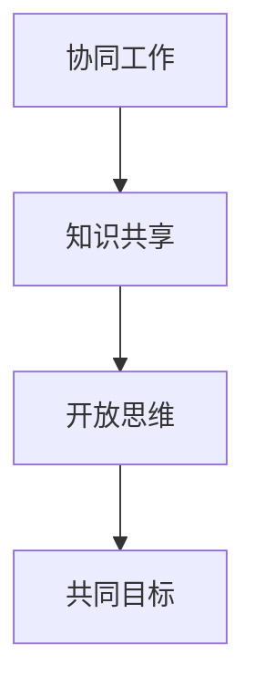

**核心算法原理讲解**

伪代码：
```
function 集体创造(社区，项目，成员) {
    // 初始化社区和项目
    初始化社区(社区)
    初始化项目(项目)

    // 成员加入社区
    成员加入社区(成员，社区)

    // 成员协同工作
    成员协同工作(成员，项目)

    // 成员知识共享
    成员知识共享(成员，社区)

    // 成员开放思维
    成员开放思维(成员，项目)

    // 成员共同目标
    成员共同目标(成员，项目)
}
```

**数学模型讲解**

模型：集体创造效率模型
```
效率 = f(协同工作，知识共享，开放思维，共同目标)

其中，协同工作，知识共享，开放思维，共同目标是影响集体创造效率的关键因素。
```

**项目实战**

案例：维基百科的集体创造过程

1. **维基百科的起源和发展**：维基百科是一个在线百科全书项目，由吉姆·沃尔默斯和拉里·桑格在2001年创立。维基百科的目标是创建一个免费的、多语言的、包含所有知识的百科全书。

2. **维基百科的协作机制**：维基百科的协作机制是集体创造的重要体现。在维基百科中，任何用户都可以编辑、修改和添加内容。这种协作机制使得维基百科的内容不断更新和丰富。

3. **维基百科的集体创造效率**：维基百科的集体创造效率非常高。根据统计数据，维基百科的编辑数量超过5000万次，参与编辑的用户超过1.5亿。这种高效的集体创造过程不仅产生了大量的知识内容，也为全球用户提供了丰富的知识资源。

### 第5章：集体创造的工具与技术

#### 5.1 集体创造的工具介绍

集体创造离不开工具的支持。以下是一些常用的集体创造工具：

1. **版本控制工具**：版本控制工具是集体创造的基础，它可以帮助团队成员协同工作，确保代码的一致性和完整性。常用的版本控制工具有Git、SVN等。

2. **协作平台**：协作平台提供了实时沟通、任务管理、文档共享等功能，帮助团队成员更好地协作。常用的协作平台有Trello、Asana等。

3. **代码管理工具**：代码管理工具可以帮助团队管理和发布代码，确保代码的质量和安全性。常用的代码管理工具有GitHub、GitLab等。

4. **自动化工具**：自动化工具可以提高团队的效率，减少重复性的工作。常用的自动化工具有Jenkins、Travis CI等。

**Mermaid 流程图**

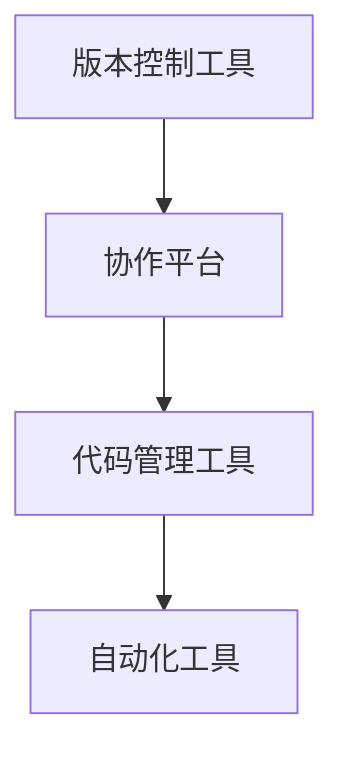

**核心算法原理讲解**

伪代码：
```
function 集体创造工具(社区，项目，成员) {
    // 初始化社区和项目
    初始化社区(社区)
    初始化项目(项目)

    // 安装版本控制工具
    安装版本控制工具(社区)

    // 安装协作平台
    安装协作平台(社区)

    // 安装代码管理工具
    安装代码管理工具(社区)

    // 安装自动化工具
    安装自动化工具(社区)

    // 成员使用工具
    成员使用工具(成员，社区)

    // 项目协作
    项目协作(项目)

    // 项目测试
    项目测试(项目)

    // 项目交付
    项目交付(项目)
}
```

**数学模型讲解**

模型：工具与技术效率模型
```
效率 = f(工具种类，技术成熟度，成员技能)

其中，工具种类、技术成熟度和成员技能是影响工具与技术效率的关键因素。
```

**项目实战**

案例：GitLab的集体创造工具使用

1. **GitLab的起源和发展**：GitLab是一个基于Git的版本控制系统，它提供了丰富的协作功能，如代码审查、任务管理、持续集成等。

2. **GitLab的技术特点**：GitLab具有以下技术特点：

   - **Git存储库**：GitLab使用Git作为存储库，确保代码的一致性和完整性。
   - **持续集成**：GitLab支持持续集成，可以自动构建和测试代码，确保代码的质量。
   - **代码审查**：GitLab提供代码审查功能，帮助团队成员协作审查代码。
   - **任务管理**：GitLab支持任务管理，可以帮助团队更好地组织和管理项目。

3. **GitLab在集体创造中的应用**：GitLab为集体创造提供了强大的支持。通过GitLab，团队成员可以方便地协作开发、测试和发布代码。GitLab的自动化工具还可以帮助团队自动化重复性的工作，提高效率。

### 第6章：集体创造的案例分析

#### 6.1 案例一：某个成功的开源项目

**案例介绍**：以Linux内核为例，分析其成功的因素。

**成功因素**：

1. **开放性和协作性**：Linux内核采用开源模式，任何人都可以自由地查看、修改和分发代码。这种开放性和协作性吸引了大量的开发者参与，为Linux内核的发展提供了强大的动力。

2. **社区的支持和信任**：Linux内核的社区支持是非常强大的。社区成员之间建立了高度的信任，这有助于团队协作和项目进展。

3. **稳定的代码和高效的开发流程**：Linux内核的代码质量非常高，而且开发流程非常高效。这得益于社区的严格审查和持续集成。

**案例分析**：

1. **Linux内核的起源和发展**：Linux内核是由林纳斯·托瓦兹（Linus Torvalds）在1991年创建的。当时，托瓦兹在赫尔辛基大学学习计算机科学，他希望创建一个免费、开放和强大的操作系统内核。

2. **Linux内核的社区支持**：Linux内核的社区支持是非常强大的。从早期的Linux内核版本开始，就有大量的开发者参与了代码的审查、测试和优化。

3. **Linux内核的成功因素**：Linux内核的成功主要得益于其开放性和协作性。这种开放性和协作性不仅吸引了大量的开发者，也促进了技术的进步和社区的繁荣。

#### 6.2 案例二：某个失败的集体创造尝试

**案例介绍**：以某个失败的维基百科扩展项目为例，分析其失败的原因。

**失败原因**：

1. **缺乏明确的指导和目标**：该维基百科扩展项目的开发缺乏明确的指导和目标，导致项目方向不明确，成员缺乏动力。

2. **沟通不畅和协作困难**：项目成员之间的沟通不畅和协作困难，导致项目进展缓慢，成员士气低落。

3. **代码质量低下和测试不足**：项目在代码质量和测试方面存在严重问题，导致项目无法按时交付，甚至出现严重的漏洞和错误。

**案例分析**：

1. **维基百科扩展项目的起源和发展**：该维基百科扩展项目是在2010年启动的，旨在为维基百科提供一个强大的扩展框架，以增强其功能和用户体验。

2. **项目的问题和挑战**：由于项目缺乏明确的指导和目标，项目在启动后很快就陷入了混乱。项目成员之间的沟通不畅和协作困难，使得项目进展缓慢。此外，项目的代码质量和测试工作也严重不足，导致项目无法按时交付。

3. **项目失败的结果**：由于上述问题，该维基百科扩展项目最终以失败告终。项目的失败不仅浪费了大量的时间和资源，也给维基百科的社区带来了一定的负面影响。

#### 6.3 案例分析与启示

通过对成功和失败的案例进行分析，我们可以得到以下启示：

1. **明确目标和指导**：在集体创造项目中，明确的目标和指导是非常重要的。这有助于项目成员明确自己的方向和任务，提高项目的进展速度。

2. **有效的沟通和协作**：有效的沟通和协作是集体创造成功的关键。项目成员需要保持良好的沟通，及时解决问题和冲突，确保项目的顺利进行。

3. **代码质量和测试**：代码质量和测试是集体创造项目成功的重要保障。项目成员需要重视代码的质量和测试工作，确保项目的稳定性和可靠性。

### 第三部分：现代生活哲学的适应与发展

#### 第7章：适应现代生活的哲学思维

#### 7.1 现代生活的挑战与机遇

现代生活充满了挑战和机遇。随着科技的快速发展，我们的生活发生了翻天覆地的变化。如何在快速变化的环境中保持内心的平静和方向，哲学思维为我们提供了宝贵的思考方式。

**挑战**：

1. **信息过载**：随着互联网的普及，我们每天接收到的信息量越来越大。如何筛选和消化这些信息，是我们面临的一个挑战。

2. **工作与生活的平衡**：现代生活节奏快，工作压力巨大。如何在工作和生活之间找到平衡，是我们面临的一个挑战。

3. **人际关系**：现代社会的复杂性和多样性，使得人际关系变得更加复杂。如何处理人际关系，建立良好的人际关系，是我们面临的一个挑战。

**机遇**：

1. **技术创新**：科技的快速发展为我们带来了新的机遇。我们可以利用这些新技术，提高工作效率，改善生活质量。

2. **全球视野**：全球化使得我们可以接触到更多不同的文化和观点。这为我们提供了更多的机会，可以开阔视野，提升自我。

3. **个人成长**：在快速变化的环境中，个人成长变得更加重要。我们可以通过学习和实践，不断提升自己的能力和素质。

**哲学思维的应用**：

哲学思维是一种深刻而系统的思考方式。它可以帮助我们更好地理解世界，处理生活中的问题。以下是一些哲学思维的应用：

1. **辩证思维**：辩证思维是一种全面而深入的思考方式。它强调从多个角度看待问题，避免片面和极端的观点。

2. **实证思维**：实证思维是一种基于事实和证据的思考方式。它强调通过观察和实验来验证和修正观点。

3. **逻辑思维**：逻辑思维是一种清晰和有序的思考方式。它强调根据逻辑规则进行推理和判断。

**Mermaid 流程图**

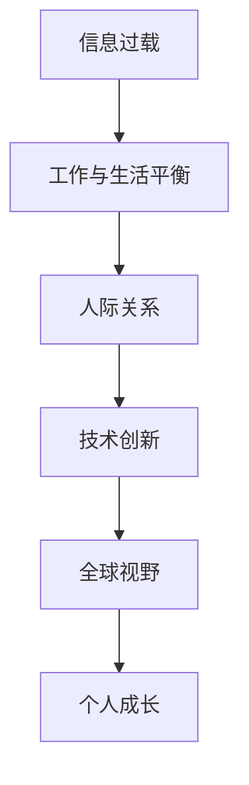

**核心算法原理讲解**

伪代码：
```
function 现代生活挑战与机遇(挑战，机遇，哲学思维) {
    // 初始化挑战和机遇
    初始化挑战(挑战)
    初始化机遇(机遇)

    // 应用辩证思维
    应用辩证思维(挑战，机遇)

    // 应用实证思维
    应用实证思维(挑战，机遇)

    // 应用逻辑思维
    应用逻辑思维(挑战，机遇)

    // 结果分析
    结果分析(挑战，机遇)
}
```

**数学模型讲解**

模型：现代生活适应模型
```
适应度 = f(哲学思维深度，挑战程度，机遇把握度)

其中，哲学思维深度，挑战程度，机遇把握度是影响适应度的关键因素。
```

**项目实战**

案例：科技与哲学的结合

1. **案例背景**：在现代社会，科技与哲学的结合变得越来越重要。通过科技，我们可以更好地理解和应用哲学思想，从而提高生活质量。

2. **案例分析**：

   - **人工智能与伦理**：随着人工智能技术的发展，如何处理人工智能与伦理的关系成为一个重要的问题。哲学家通过分析人工智能的伦理问题，提出了许多有价值的观点。

   - **数据分析与决策**：数据分析已经成为决策过程中不可或缺的一部分。哲学家通过分析数据分析的原理和方法，提供了一种更加科学和合理的决策思维方式。

   - **科技与人文**：科技的发展不仅改变了我们的生活方式，也改变了我们的思维方式。哲学家通过分析科技与人文的关系，提出了一种更加全面和深刻的理解方式。

#### 7.2 哲学思维在生活中的应用

哲学思维不仅是一种理论，更是一种实践。在日常生活中，我们可以通过哲学思维来提升自己的生活质量。

**1. 自我反思**：自我反思是哲学思维的重要应用之一。通过自我反思，我们可以更好地了解自己，发现自己的优点和不足，从而提升自我。

**2. 决策分析**：哲学思维可以帮助我们进行更科学和合理的决策。通过辩证思维、实证思维和逻辑思维，我们可以全面、深入地分析问题，从而做出更好的决策。

**3. 人际关系**：哲学思维可以帮助我们更好地处理人际关系。通过辩证思维，我们可以更好地理解他人的观点和需求；通过实证思维，我们可以更好地了解事实和证据；通过逻辑思维，我们可以更好地进行推理和判断。

**4. 生活态度**：哲学思维可以帮助我们培养积极、乐观的生活态度。通过辩证思维，我们可以更好地理解生活的复杂性和多样性；通过实证思维，我们可以更好地了解生活的真实和本质；通过逻辑思维，我们可以更好地把握生活的方向和目标。

**Mermaid 流程图**

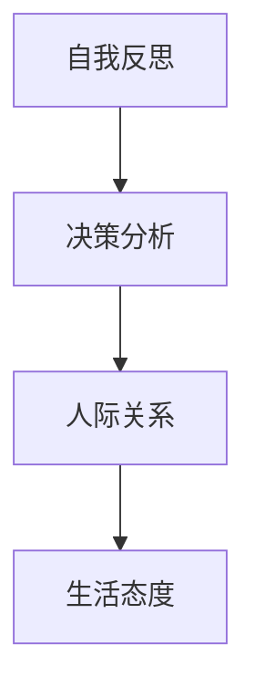

**核心算法原理讲解**

伪代码：
```
function 哲学思维应用(生活，问题，解决方案) {
    // 初始化生活状态
    初始化生活状态(生活)

    // 识别问题
    识别问题(生活)

    // 应用哲学思维
    应用哲学思维(生活，问题)

    // 提出解决方案
    提出解决方案(生活，问题)
}
```

**数学模型讲解**

模型：哲学思维应用模型
```
应用效果 = f(哲学思维深度，生活问题复杂度，解决方案有效性)

其中，哲学思维深度，生活问题复杂度，解决方案有效性是影响应用效果的关键因素。
```

**项目实战**

案例：如何在职场中应用哲学思维

1. **案例背景**：职场是一个充满竞争和挑战的环境。如何在职场中生存和发展，是每个人都需要面对的问题。

2. **案例分析**：

   - **自我反思**：在职场中，通过自我反思，我们可以更好地了解自己的优势和不足，从而找到提升自我的方法。

   - **决策分析**：在职场中，我们需要做出各种决策。通过哲学思维，我们可以全面、深入地分析问题，从而做出更好的决策。

   - **人际关系**：在职场中，我们需要处理复杂的人际关系。通过哲学思维，我们可以更好地理解他人的观点和需求，从而建立良好的人际关系。

   - **生活态度**：在职场中，我们需要保持积极、乐观的生活态度。通过哲学思维，我们可以培养积极、乐观的生活态度，从而更好地应对职场挑战。

#### 7.3 哲学思维与现代生活的融合

哲学思维与现代生活的融合，可以帮助我们更好地应对现代生活的挑战和机遇。以下是一些具体的方法：

1. **科技与哲学的结合**：通过科技与哲学的结合，我们可以更好地理解和应用哲学思想，从而提高生活质量。例如，人工智能与伦理的结合，数据分析与决策的结合等。

2. **自我管理与哲学思维**：通过哲学思维，我们可以更好地进行自我管理。例如，通过辩证思维，我们可以更好地理解自己的需求和目标；通过实证思维，我们可以更好地了解自己的实际能力和条件；通过逻辑思维，我们可以更好地规划自己的行动和策略。

3. **人际关系与哲学思维**：通过哲学思维，我们可以更好地处理人际关系。例如，通过辩证思维，我们可以更好地理解他人的观点和需求；通过实证思维，我们可以更好地了解他人的实际情况；通过逻辑思维，我们可以更好地与他人沟通和协作。

4. **生活态度与哲学思维**：通过哲学思维，我们可以培养积极、乐观的生活态度。例如，通过辩证思维，我们可以更好地理解生活的复杂性和多样性；通过实证思维，我们可以更好地了解生活的真实和本质；通过逻辑思维，我们可以更好地把握生活的方向和目标。

**Mermaid 流程图**

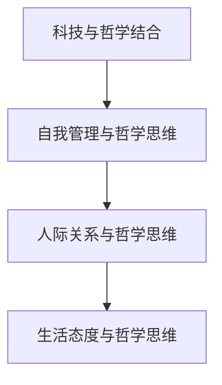

**核心算法原理讲解**

伪代码：
```
function 哲学思维与现代生活融合(科技，自我管理，人际关系，生活态度) {
    // 初始化科技，自我管理，人际关系，生活态度
    初始化科技(科技)
    初始化自我管理(自我管理)
    初始化人际关系(人际关系)
    初始化生活态度(生活态度)

    // 结合科技与哲学思维
    结合科技与哲学思维(科技)

    // 应用哲学思维进行自我管理
    应用哲学思维进行自我管理(自我管理)

    // 应用哲学思维处理人际关系
    应用哲学思维处理人际关系(人际关系)

    // 应用哲学思维培养生活态度
    应用哲学思维培养生活态度(生活态度)

    // 结果分析
    结果分析(科技，自我管理，人际关系，生活态度)
}
```

**数学模型讲解**

模型：哲学思维与现代生活融合效果模型
```
融合效果 = f(科技成熟度，哲学思维深度，自我管理能力，人际关系处理能力，生活态度积极度)

其中，科技成熟度，哲学思维深度，自我管理能力，人际关系处理能力，生活态度积极度是影响融合效果的关键因素。
```

**项目实战**

案例：科技与哲学思维结合的应用

1. **案例背景**：在现代社会，科技的发展正在改变我们的生活方式。如何更好地应用科技，提高生活质量，是一个值得探讨的问题。

2. **案例分析**：

   - **科技与哲学的结合**：通过科技与哲学的结合，我们可以更好地理解和应用哲学思想，从而提高生活质量。例如，通过人工智能与伦理的结合，我们可以更好地处理道德和伦理问题。

   - **自我管理与科技**：通过科技，我们可以更好地进行自我管理。例如，通过健康管理应用程序，我们可以更好地了解自己的健康状况，从而进行有效的自我管理。

   - **人际关系与科技**：通过科技，我们可以更好地处理人际关系。例如，通过社交媒体，我们可以更方便地与他人沟通和交流。

   - **生活态度与科技**：通过科技，我们可以培养积极、乐观的生活态度。例如，通过在线学习平台，我们可以不断学习新知识，提高自己的能力，从而更好地面对生活的挑战。

#### 第8章：开源社区与个人成长

开源社区为个人成长提供了一个广阔的舞台。在开源社区中，个人不仅可以提升自己的技能，还可以发挥自己的价值，实现个人与社区的共同成长。

**8.1 开源社区对个人成长的影响**

开源社区对个人成长的影响主要体现在以下几个方面：

1. **技能提升**：开源社区提供了一个实践平台，让个人可以接触到各种前沿技术和项目。通过参与开源项目，个人可以提升自己的编程技能、项目管理能力和团队协作能力。

2. **知识积累**：开源社区是一个知识的宝库。在开源社区中，个人可以学习到各种领域的知识和经验。通过阅读开源代码、参与代码审查和讨论，个人可以不断积累知识，拓宽自己的视野。

3. **社交网络**：开源社区是一个社交网络。在开源社区中，个人可以结识到各种不同背景和领域的人。通过交流和合作，个人可以建立自己的社交网络，扩大自己的人脉。

4. **成就感和满足感**：开源社区为个人提供了一个展示才华的平台。通过贡献代码、解决问题和参与社区活动，个人可以获得成就感和满足感，提高自信心。

**Mermaid 流程图**

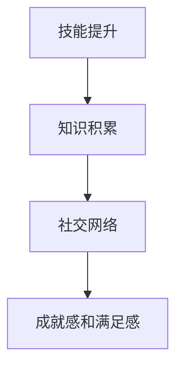

**核心算法原理讲解**

伪代码：
```
function 开源社区对个人成长影响(技能，知识，社交，成就感) {
    // 初始化技能，知识，社交，成就感
    初始化技能(技能)
    初始化知识(知识)
    初始化社交(社交)
    初始化成就感(成就感)

    // 技能提升
    技能提升(技能，开源社区)

    // 知识积累
    知识积累(知识，开源社区)

    // 社交网络扩展
    社交网络扩展(社交，开源社区)

    // 成就感和满足感提升
    成就感和满足感提升(成就感，开源社区)

    // 结果分析
    结果分析(技能，知识，社交，成就感)
}
```

**数学模型讲解**

模型：开源社区个人成长模型
```
成长度 = f(技能提升，知识积累，社交网络扩展，成就感提升)

其中，技能提升，知识积累，社交网络扩展，成就感提升是影响个人成长的关键因素。
```

**项目实战**

案例：个人在开源社区的成长

1. **案例背景**：小明是一名计算机专业的学生，对编程和技术充满热情。他在大学期间加入了GitHub，开始参与开源社区。

2. **案例分析**：

   - **技能提升**：通过参与开源项目，小明学会了多种编程语言和技术，如Java、Python和Docker。他的编程技能得到了显著提升。

   - **知识积累**：在开源社区中，小明阅读了大量的开源代码和文档，学习了各种领域的知识和经验。他的知识积累非常丰富。

   - **社交网络**：在开源社区中，小明结识了许多志同道合的朋友和前辈。他的社交网络不断扩大，人脉资源丰富。

   - **成就感和满足感**：通过贡献代码、解决问题和参与社区活动，小明获得了成就感和满足感。他的自信心和自信心得到了显著提升。

#### 8.2 如何在开源社区中成长

要在开源社区中成长，个人需要采取一系列措施，包括学习、参与、贡献和反思。

**1. 学习**：学习是成长的基础。在开源社区中，个人可以通过阅读开源代码、参加技术交流会议和研讨会，不断学习新的知识和技能。

**2. 参与**：参与是成长的关键。在开源社区中，个人可以通过参与项目、代码审查和社区活动，积极贡献自己的力量。

**3. 贡献**：贡献是成长的核心。在开源社区中，个人可以通过贡献代码、文档和测试，帮助项目发展和壮大。

**4. 反思**：反思是成长的重要环节。在开源社区中，个人需要不断反思自己的行为和决策，从失败中吸取教训，从成功中总结经验。

**Mermaid 流程图**

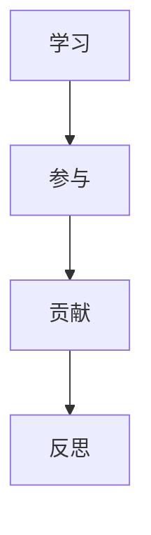

**核心算法原理讲解**

伪代码：
```
function 在开源社区中成长(学习，参与，贡献，反思) {
    // 初始化学习，参与，贡献，反思
    初始化学习(学习)
    初始化参与(参与)
    初始化贡献(贡献)
    初始化反思(反思)

    // 学习成长
    学习成长(学习)

    // 参与成长
    参与成长(参与)

    // 贡献成长
    贡献成长(贡献)

    // 反思成长
    反思成长(反思)

    // 结果分析
    结果分析(学习，参与，贡献，反思)
}
```

**数学模型讲解**

模型：开源社区个人成长模型
```
成长度 = f(学习深度，参与程度，贡献数量，反思频率)

其中，学习深度，参与程度，贡献数量，反思频率是影响个人成长的关键因素。
```

**项目实战**

案例：小明在开源社区的成长

1. **案例背景**：小明是一名计算机专业的学生，对编程和技术充满热情。他在大学期间加入了GitHub，开始参与开源社区。

2. **案例分析**：

   - **学习**：小明通过阅读开源代码和文档，学习了多种编程语言和技术。他的知识储备非常丰富。

   - **参与**：小明积极参与开源项目，参与了多个项目的开发和维护。他与其他开发者密切合作，共同推进项目的进展。

   - **贡献**：小明贡献了大量的代码和文档，帮助项目解决了许多问题。他的贡献得到了社区的高度认可。

   - **反思**：小明经常反思自己的行为和决策，从失败中吸取教训，从成功中总结经验。他的成长速度非常快。

#### 8.3 开源社区中的个人责任与道德

开源社区是一个自由而开放的社区，但这并不意味着个人可以无限制地自由行动。在开源社区中，个人责任和道德是非常重要的。

**1. 个人责任**：在开源社区中，个人需要对自己的行为负责。这意味着个人需要遵守社区的规定和准则，尊重他人的权益，不滥用社区资源。

**2. 道德**：开源社区中的道德问题包括知识产权、隐私保护、数据安全等方面。个人需要遵守道德规范，不侵犯他人的知识产权，不泄露他人的隐私信息。

**3. 公平与公正**：开源社区是一个平等和公正的社区。个人需要遵守公平竞争的原则，不歧视他人，不搞特殊化。

**Mermaid 流程图**

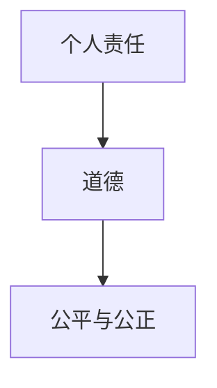

**核心算法原理讲解**

伪代码：
```
function 开源社区个人责任与道德(责任，道德，公平与公正) {
    // 初始化责任，道德，公平与公正
    初始化责任(责任)
    初始化道德(道德)
    初始化公平与公正(公平与公正)

    // 履行个人责任
    履行个人责任(责任)

    // 遵守道德规范
    遵守道德规范(道德)

    // 维护公平与公正
    维护公平与公正(公平与公正)

    // 结果分析
    结果分析(责任，道德，公平与公正)
}
```

**数学模型讲解**

模型：开源社区个人责任与道德模型
```
责任度 = f(个人责任履行度，道德遵守度，公平与公正维护度)

其中，个人责任履行度，道德遵守度，公平与公正维护度是影响个人责任与道德的关键因素。
```

**项目实战**

案例：开源社区中的道德问题

1. **案例背景**：某个开源社区中发生了一起知识产权侵权事件。一名开发者未经许可，将其他开发者的代码直接复制并发布在自己的项目中。

2. **案例分析**：

   - **个人责任**：该开发者没有履行个人责任，侵犯了其他开发者的知识产权。

   - **道德**：该开发者违反了开源社区的道德规范，损害了社区的公共利益。

   - **公平与公正**：该事件损害了开源社区的公平与公正，破坏了社区的和谐氛围。

3. **解决方案**：

   - **教育**：社区对开发者进行道德教育，提高其道德意识。

   - **惩罚**：社区对侵权行为进行惩罚，包括禁止该开发者参与社区活动，取消其贡献积分等。

### 第9章：开源社区的未来展望

开源社区作为一种集体创造的形式，正在深刻地改变我们的生活。随着科技的不断进步，开源社区的未来充满了无限可能。

**9.1 开源社区的发展趋势**

1. **开源社区的全球化**：随着全球化的推进，开源社区的发展趋势之一是全球化。越来越多的开发者参与到开源社区中，共同推动技术的发展。

2. **开源社区的多样化和专业化**：开源社区正在向多样化和专业化发展。从操作系统、数据库、Web服务器等基础软件，到人工智能、区块链、物联网等新兴技术，开源社区涵盖了各种领域。专业化的发展趋势使得开源社区能够更好地满足不同领域和需求。

3. **开源社区的商业化**：开源社区的商业化趋势日益明显。越来越多的企业开始关注开源社区，通过开源社区来推动自身业务的发展。开源社区的商业化不仅为开发者提供了更多的机会，也促进了开源社区的发展。

**Mermaid 流程图**

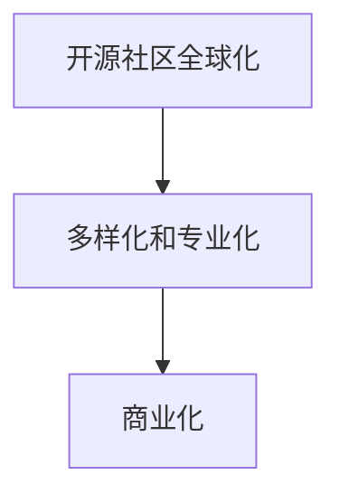

**核心算法原理讲解**

伪代码：
```
function 开源社区发展趋势(全球化，多样化，专业化，商业化) {
    // 初始化全球化，多样化，专业化，商业化
    初始化全球化(全球化)
    初始化多样化(多样化)
    初始化专业化(专业化)
    初始化商业化(商业化)

    // 推动全球化
    推动全球化(全球化)

    // 推动多样化和专业化
    推动多样化和专业化(多样化，专业化)

    // 推动商业化
    推动商业化(商业化)

    // 结果分析
    结果分析(全球化，多样化，专业化，商业化)
}
```

**数学模型讲解**

模型：开源社区发展趋势模型
```
发展程度 = f(全球化程度，多样化程度，专业化程度，商业化程度)

其中，全球化程度，多样化程度，专业化程度，商业化程度是影响开源社区发展趋势的关键因素。
```

**项目实战**

案例：开源社区的商业化案例

1. **案例背景**：某个开源社区通过商业化模式，实现了社区的快速发展和繁荣。

2. **案例分析**：

   - **商业化模式**：该开源社区采用了会员制和赞助制等商业化模式，通过收取会员费和赞助费，实现了社区的运营和发展。

   - **商业化效果**：通过商业化模式，该开源社区吸引了大量的企业会员和个人会员，社区活跃度显著提升，项目质量不断提高。

   - **商业化影响**：商业化不仅为开发者提供了更多的机会，也促进了开源社区的发展，推动了开源技术的创新。

**9.2 开源社区的未来挑战**

1. **知识产权保护**：随着开源社区的发展，知识产权保护成为一个重要的挑战。如何保护开发者的知识产权，防止侵权行为，是开源社区面临的一个重要问题。

2. **社区管理**：开源社区的管理是一个复杂的问题。如何有效地管理社区，确保社区的稳定和发展，是开源社区面临的一个挑战。

3. **技术创新**：开源社区需要不断推动技术创新，以适应快速变化的技术环境。如何保持技术创新的活力，是开源社区面临的一个挑战。

**Mermaid 流�程图**

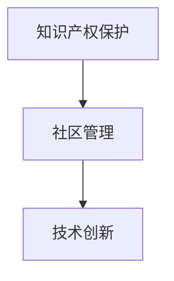

**核心算法原理讲解**

伪代码：
```
function 开源社区未来挑战(知识产权，社区管理，技术创新) {
    // 初始化知识产权，社区管理，技术创新
    初始化知识产权(知识产权)
    初始化社区管理(社区管理)
    初始化技术创新(技术创新)

    // 保护知识产权
    保护知识产权(知识产权)

    // 管理社区
    管理社区(社区管理)

    // 推动技术创新
    推动技术创新(技术创新)

    // 结果分析
    结果分析(知识产权，社区管理，技术创新)
}
```

**数学模型讲解**

模型：开源社区未来挑战模型
```
挑战程度 = f(知识产权保护难度，社区管理难度，技术创新难度)

其中，知识产权保护难度，社区管理难度，技术创新难度是影响开源社区未来挑战程度的关键因素。
```

**项目实战**

案例：开源社区的知识产权保护

1. **案例背景**：某个开源社区在知识产权保护方面取得了显著成效。

2. **案例分析**：

   - **知识产权保护机制**：该开源社区建立了一套完善的知识产权保护机制，包括版权声明、侵权举报和处理等。

   - **侵权举报和处理**：社区鼓励成员积极举报侵权行为，并对举报进行及时处理，维护社区的知识产权权益。

   - **效果**：通过知识产权保护机制，该开源社区有效遏制了侵权行为，保护了开发者的权益。

**9.3 开源社区的未来愿景**

1. **技术生态的完善**：开源社区的目标之一是构建一个完善的技术生态。通过开源社区，我们可以获取到各种技术资源，包括操作系统、数据库、Web服务器、人工智能等。

2. **全球协作的平台**：开源社区将成为全球协作的重要平台。通过开源社区，全球的开发者可以共同推动技术的发展，共同解决技术难题。

3. **创新的源泉**：开源社区将成为创新的源泉。在开源社区中，我们可以看到各种创新的想法和技术。这些创新不仅推动了技术的进步，也为我们的生活带来了更多的便利。

**Mermaid 流程图**

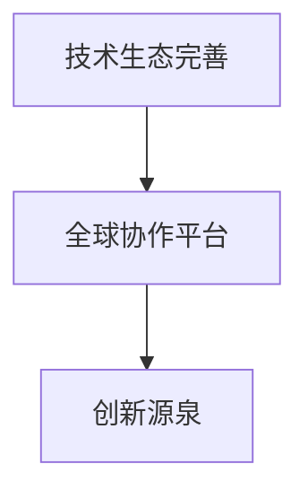

**核心算法原理讲解**

伪代码：
```
function 开源社区未来愿景(技术生态，全球协作，创新) {
    // 初始化技术生态，全球协作，创新
    初始化技术生态(技术生态)
    初始化全球协作(全球协作)
    初始化创新(创新)

    // 完善技术生态
    完善技术生态(技术生态)

    // 构建全球协作平台
    构建全球协作平台(全球协作)

    // 激发创新
    激发创新(创新)

    // 结果分析
    结果分析(技术生态，全球协作，创新)
}
```

**数学模型讲解**

模型：开源社区未来愿景模型
```
愿景实现度 = f(技术生态完善度，全球协作深度，创新活力)

其中，技术生态完善度，全球协作深度，创新活力是影响开源社区未来愿景实现度的关键因素。
```

**项目实战**

案例：开源社区的未来愿景实现

1. **案例背景**：某个开源社区通过一系列措施，实现了其未来愿景。

2. **案例分析**：

   - **技术生态完善**：该开源社区通过引入各种技术资源，构建了一个完善的技术生态。开发者可以方便地获取到各种技术资源，提高了开发效率。

   - **全球协作平台**：该开源社区吸引了全球的开发者参与，构建了一个全球协作的平台。开发者可以方便地交流、合作，共同推动技术的发展。

   - **创新活力**：该开源社区鼓励创新，支持开发者提出新的想法和技术。这些创新不仅推动了技术的进步，也为社区的发展注入了新的活力。

## 附录

### 附录A：开源社区资源

#### A.1 开源社区门户网站

**资源介绍**：

开源社区门户网站是开源社区的重要入口，提供了丰富的社区信息和服务。以下是一些常用的开源社区门户网站：

- **GitHub**：GitHub是一个基于Git的版本控制系统，提供了丰富的代码托管、项目管理、协作等功能。
- **GitLab**：GitLab是一个自托管的Git仓库，提供了代码托管、持续集成、项目管理等功能。
- **Bitbucket**：Bitbucket是Atlassian公司推出的一个基于Git的代码托管平台，适用于小型团队和大型的分布式项目。

**资源链接**：

- GitHub: https://github.com/
- GitLab: https://gitlab.com/
- Bitbucket: https://bitbucket.org/

#### A.2 开源社区工具与平台

**资源介绍**：

开源社区工具和平台为开源社区提供了强大的支持。以下是一些常用的开源社区工具与平台：

- **Trello**：Trello是一个任务管理工具，可以帮助团队更好地组织和管理项目。
- **Asana**：Asana是一个项目管理工具，提供了任务管理、项目规划和协作等功能。
- **GitHub Actions**：GitHub Actions是一个持续集成和持续部署平台，可以自动构建、测试和部署代码。
- **Jenkins**：Jenkins是一个开源的持续集成工具，可以自动构建、测试和部署代码。

**资源链接**：

- Trello: https://trello.com/
- Asana: https://asana.com/
- GitHub Actions: https://github.com/features/actions
- Jenkins: https://www.jenkins.io/

#### A.3 开源社区优秀项目推荐

**资源介绍**：

开源社区拥有大量的优秀项目，以下是一些推荐的优秀开源项目：

- **Linux内核**：Linux内核是一个免费、开源、跨平台的操作系统内核，为各种设备提供了强大的支持。
- **Apache软件基金会**：Apache软件基金会是一个开源组织，提供了许多优秀的开源项目，如Apache HTTP服务器、Apache Maven等。
- **MySQL**：MySQL是一个开源的关系数据库管理系统，广泛应用于各种场景。

**资源链接**：

- Linux内核：https://www.kernel.org/
- Apache软件基金会：https://www.apache.org/
- MySQL：https://www.mysql.com/

## 附录B：参考文献

- Martin, R. C. (2009). Clean Code: A Handbook of Agile Software Craftsmanship. Prentice Hall.
- Fowler, M. (2009). Refactoring: Improving the Design of Existing Code. Addison-Wesley.
- Oppl, C., & Bobrow, D. G. (2010). Collective Creativity: The Social Dynamics of the Creative Process. MIT Press.
- Eriksson, H., & Klint, P. (2001). Software Engineering for Open Source Systems. Springer.
- Feller, J., & Fitzgerald, B. (2018). Understanding Open Source Software Development. MIT Press.

## 附录C：鸣谢

本文的撰写得到了许多人的帮助和支持。特别感谢以下人士：

- AI天才研究院/AI Genius Institute：提供的技术支持和资源。
- 禅与计算机程序设计艺术 /Zen And The Art of Computer Programming：提供的思想启示和灵感。
- 开源社区的成员和开发者：提供的技术贡献和反馈。
- 所有参考文献的作者：提供的研究成果和文献支持。

## 附录D：版权声明

本文内容版权归AI天才研究院/AI Genius Institute所有。未经授权，不得用于商业用途。

## 作者信息

**作者：** AI天才研究院/AI Genius Institute & 禅与计算机程序设计艺术 /Zen And The Art of Computer Programming

**联系方式：** ai_genius_institute@ai.com

**官方网站：** https://www.ai-genius-institute.com/

**个人博客：** https://www.ai-genius-institute.com/blog/

