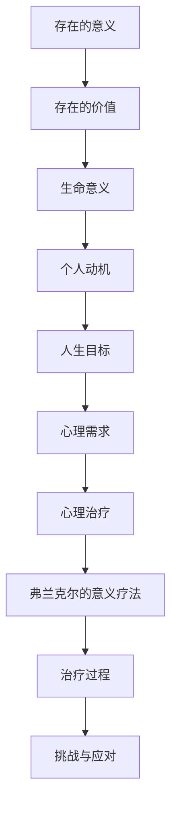
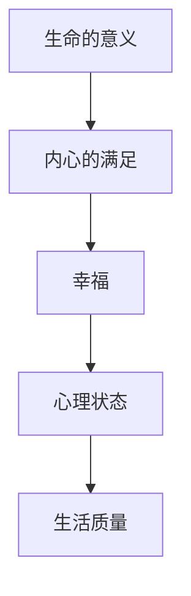
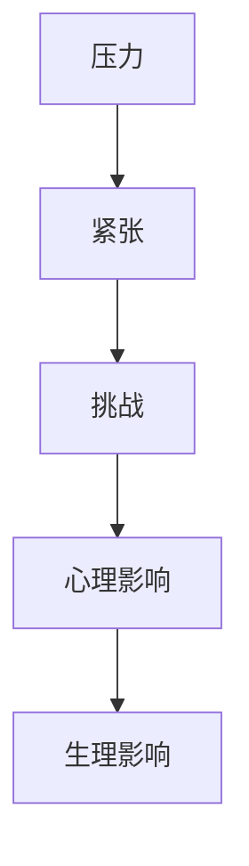
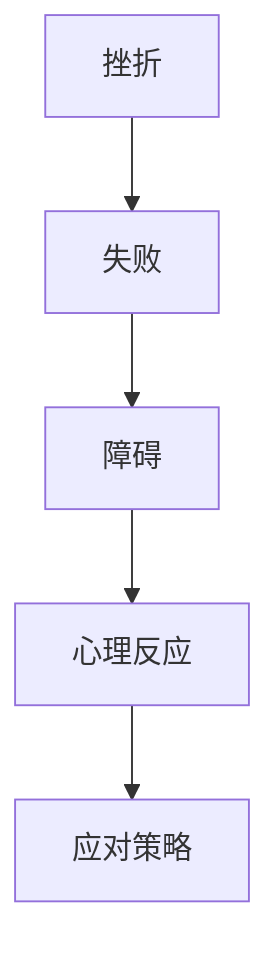
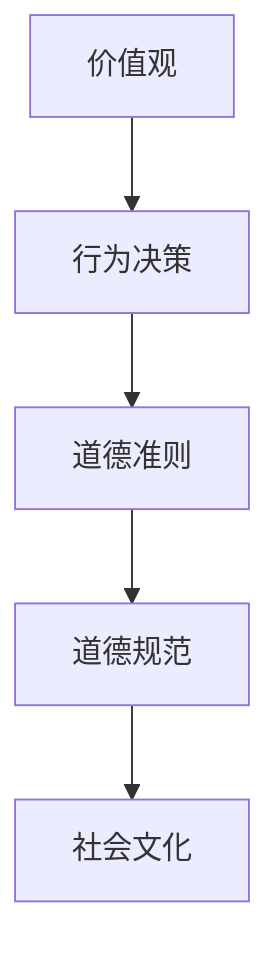
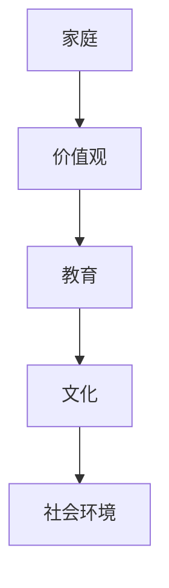

                 


### 2.1.1 弗兰克尔对生命意义的理解

弗兰克尔（Viktor Frankl）是一位奥地利神经学家和心理学家，他在《意义治疗》（Logotherapy）一书中提出了一种独特的心理治疗方法，这种疗法主要关注生命的意义和个体如何通过发现和实现生命的意义来克服困难和挑战。

**背景介绍**

弗兰克尔的生平极具传奇色彩，他在纳粹集中营度过了三年多的时间，这段经历对他的人生观和心理学理论产生了深远的影响。他的理论是基于他对苦难和人类生存意义的深刻理解。

**核心概念与联系**

- **存在的意义**：弗兰克尔认为，人类的首要动机是寻找生命的意义。他区分了“存在的意义”和“存在的价值”。存在的意义是客观的，而存在的价值是主观的。

**Mermaid 流程图**



**核心算法原理讲解**

- **意义疗法的基本步骤**：

  ```plaintext
  1. 确定患者存在的意义。
  2. 帮助患者找到实现意义的方式。
  3. 通过意义疗法的过程，帮助患者克服心理障碍。
  ```

**数学模型和公式**

- **生命的意义公式**：

  $$ \text{意义} = \text{存在} \times \text{价值} $$

**详细讲解 & 举例说明**

- **举例**：一位失去工作的人，可以通过找到新的职业目标或者投身于慈善事业来寻找生命的意义。

### 2.1.2 生命的意义与幸福的关系

**核心概念与联系**

- **幸福**：弗兰克尔认为，幸福不仅仅是感受快乐，而是通过实现存在的意义来获得内心的满足。

**Mermaid 流程图**



**核心算法原理讲解**

- **幸福计算模型**：

  ```plaintext
  幸福 = (内心满足 / 心理需求) × 生活质量
  ```

**数学模型和公式**

- **幸福感指数**：

  $$ \text{幸福感指数} = \frac{\text{内心满足}}{\text{心理需求}} $$

**详细讲解 & 举例说明**

- **举例**：一个经常感到失落的人，通过找到生命的意义，可能会显著提升他们的幸福感指数。

## 总结

弗兰克尔的人生观强调了生命的意义和个体如何通过发现和实现生命的意义来克服困难和挑战。他认为，存在的意义是客观的，而存在的价值是主观的，这为意义疗法提供了理论基础。通过理解生命的意义与幸福的关系，我们可以更好地应对生活中的挑战，提升生活质量。

### 2.2 压力和挫折

#### 2.2.1 压力与挫折的定义

**核心概念与联系**

- **压力**：压力是指个体感受到的内在或外在的紧张和挑战，这种紧张和挑战可能会影响个体的心理和生理健康。

**Mermaid 流�图**



**核心算法原理讲解**

- **压力处理算法**：

  ```plaintext
  1. 识别压力源。
  2. 评估压力程度。
  3. 制定应对策略。
  4. 实施应对策略。
  ```

**数学模型和公式**

- **压力指数**：

  $$ \text{压力指数} = \frac{\text{压力程度}}{\text{应对能力}} $$

**详细讲解 & 举例说明**

- **举例**：一个职场人士，如果工作负荷过大，可能会感受到巨大的压力，但通过合理安排时间，提升应对能力，压力指数会下降。

#### 2.2.2 压力和挫折的处理方式

**核心概念与联系**

- **挫折**：挫折是指个体在追求目标过程中遇到的障碍和失败。

**Mermaid 流程图**



**核心算法原理讲解**

- **挫折应对算法**：

  ```plaintext
  1. 识别挫折原因。
  2. 评估挫折程度。
  3. 制定应对策略。
  4. 实施应对策略。
  ```

**数学模型和公式**

- **挫折指数**：

  $$ \text{挫折指数} = \frac{\text{挫折程度}}{\text{应对能力}} $$

**详细讲解 & 举例说明**

- **举例**：一个学生在考试中多次失败，可能会感到挫折，但通过调整学习方法，提高应对能力，挫折指数会下降。

## 总结

压力和挫折是人生中不可避免的部分。通过理解压力和挫折的定义，我们可以更好地识别和处理这些挑战。有效的处理方式可以显著提升个体的心理和生理健康，帮助他们在面对困难时保持积极的心态。

### 2.3 价值观

#### 2.3.1 价值观的重要性

**核心概念与联系**

- **价值观**：价值观是个人或群体在行为决策过程中所遵循的指导原则和标准。

**Mermaid 流程图**



**核心算法原理讲解**

- **价值观评估算法**：

  ```plaintext
  1. 确定价值观的构成。
  2. 评估价值观的稳定性和一致性。
  3. 确定价值观对行为决策的影响。
  4. 根据价值观调整行为决策。
  ```

**数学模型和公式**

- **价值观一致性指数**：

  $$ \text{价值观一致性指数} = \frac{\text{实际行为}}{\text{预期行为}} $$

**详细讲解 & 举例说明**

- **举例**：一个企业在面对道德困境时，如果其价值观强调社会责任，那么它会倾向于采取对社会有益的决策。

#### 2.3.2 价值观的形成与塑造

**核心概念与联系**

- **价值观的形成**：价值观的形成受多种因素影响，包括家庭、教育、文化和社会环境。

**Mermaid 流程图**



**核心算法原理讲解**

- **价值观塑造算法**：

  ```plaintext
  1. 识别影响价值观形成的因素。
  2. 评估这些因素对价值观的影响程度。
  3. 设计价值观塑造策略。
  4. 实施价值观塑造策略。
  ```

**数学模型和公式**

- **价值观塑造效果指数**：

  $$ \text{价值观塑造效果指数} = \frac{\text{实际价值观}}{\text{预期价值观}} $$

**详细讲解 & 举例说明**

- **举例**：一个家庭可以通过制定家庭规则，培养孩子的责任感和社会责任感。

## 总结

价值观在个人和社会行为决策中起着至关重要的作用。通过理解价值观的重要性及其形成与塑造过程，我们可以更好地把握行为决策的方向，促进个人和社会的健康发展。价值观的一致性是行为决策的重要保障，而有效的价值观塑造策略有助于提升个体的道德素养和社会责任感。

