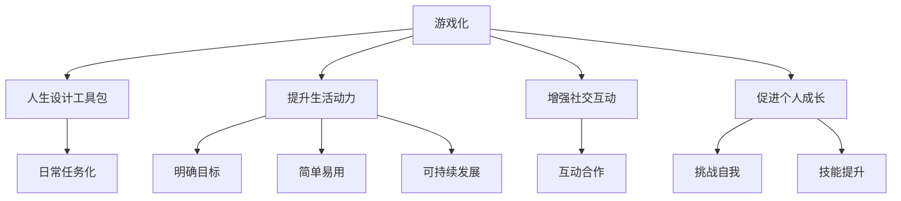
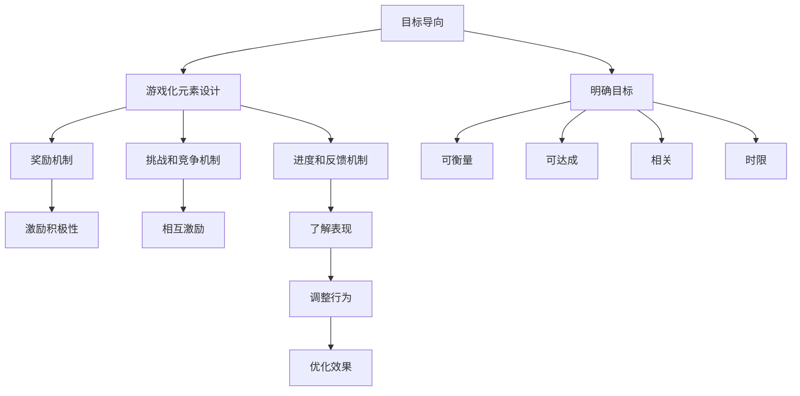

                 

## 文章标题

### 意义游戏化人生设计工具包：日常任务化的生活改造套件

## 关键词

- 游戏化
- 人生设计
- 日常任务化
- 生活改造
- 成就感
- 动机提升

## 摘要

在快节奏的现代生活中，我们往往面临着复杂的任务和压力，这使得许多人感到疲惫和无所适从。《意义游戏化人生设计工具包：日常任务化的生活改造套件》旨在通过游戏化的方法，将日常任务转化为有意义且有趣的活动，从而提升生活质量和个人成就感。本文将详细介绍这一工具包的核心概念、构建方法、日常任务化实践以及其在不同领域的应用，帮助读者理解并掌握如何将自己的生活游戏化，实现生活目标。

## 引言

### 背景介绍

在过去的几十年里，游戏化已经成为了一种流行的设计趋势，不仅在娱乐领域，还在教育、工作、健康等多个领域得到了广泛应用。游戏化通过将游戏中的激励机制应用到非游戏情境中，有效地提升了参与度和动机。然而，如何将游戏化的理念应用于人生设计，实现日常任务的生活改造，仍是一个未被充分探索的领域。

### 核心概念与联系

在《意义游戏化人生设计工具包：日常任务化的生活改造套件》中，有几个核心概念贯穿全书：

1. **游戏化**：利用游戏设计的元素（如积分、等级、奖励等）来增强非游戏情境下的参与度和动机。
2. **人生设计工具包**：一个综合性的设计框架，包括策略、方法和技术，旨在帮助个人和组织实现他们的目标和梦想。
3. **日常任务化**：将日常生活中的任务和活动转化为游戏化的任务，以增强个人对日常生活的掌控感和成就感。

这些概念之间的联系在于，游戏化提供了实现人生设计的工具，而日常任务化则是将这一工具应用于日常生活，使其更加有意义和有趣。

### 目标与结构

本文的目标是：

1. 解释游戏化人生设计的概念和原理。
2. 介绍人生设计工具包的构建方法和步骤。
3. 详细探讨日常任务化的实践方法。
4. 展示游戏化在各个领域的应用案例。

文章将分为以下几个部分：

1. **第一部分：游戏化人生设计基础**：介绍游戏化的概念与原则，人生设计工具包的构建。
2. **第二部分：日常任务化的生活改造**：探讨日常任务化的方法及其在个人、家庭和社会生活中的应用。
3. **第三部分：意义游戏化的人生应用**：分析意义游戏化在教育和企业管理中的应用，并展示具体的案例。

通过本文的阅读，读者将能够了解如何将游戏化的理念应用于日常生活，设计出适合自己的游戏化人生设计工具包，从而实现个人成长和生活质量的提升。

### 第一部分：游戏化人生设计基础

## 第1章：游戏化人生设计的概念与原则

### 1.1 什么是游戏化

#### 游戏化的起源与演进

游戏化的概念并非新兴事物，它早在20世纪早期就已经出现。当时，游戏化主要应用于教育领域，通过游戏化的教学方法提高学生的学习兴趣和效果。随着计算机技术的发展，游戏化的应用领域逐渐扩展到娱乐、工作、健康等多个方面。

#### 游戏化的核心概念

游戏化的核心概念包括以下几个方面：

1. **奖励机制**：通过给予奖励来激励参与者的积极性。
2. **挑战与竞争**：设置挑战和竞争机制，增强参与者的参与感和成就感。
3. **进步与反馈**：通过进度和反馈机制，让参与者了解自己的表现，从而不断调整和优化自己的行为。

### 1.2 游戏化人生设计的优势

#### 提升生活动力

游戏化通过设定目标和奖励机制，激发个人的生活动力。在实现目标的过程中，参与者会感受到成就感和满足感，从而持续保持积极的态度。

#### 增强社交互动

游戏化设计鼓励参与者之间的互动和合作，通过社交元素增强人与人之间的连接。这不仅有助于建立良好的人际关系，还能提高社区凝聚力。

#### 促进个人成长

游戏化设计提供了一个不断挑战自我的平台，参与者可以通过不断尝试和改进，实现个人成长和技能提升。

### 1.3 游戏化人生设计的核心原则

#### 目标导向

游戏化人生设计应以明确的目标为导向。目标应具体、可衡量，且具有挑战性，以激发参与者的积极性。

#### 简单易用

游戏化工具应简单易用，避免复杂繁琐的操作流程，以降低参与者的使用门槛。

#### 可持续发展

游戏化设计应考虑长期效果，确保工具的可持续性，避免短期行为带来的负面影响。

### 1.4 游戏化人生设计的应用领域

#### 教育

游戏化在教育领域的应用主要包括学习管理系统、在线课程和互动教学等。通过游戏化设计，可以提高学生的学习兴趣和参与度，提高教学效果。

#### 工作

游戏化在职场中的应用主要包括绩效考核、团队协作和员工激励等。通过游戏化设计，可以提高工作效率和员工满意度。

#### 健康

游戏化在健康领域的应用主要包括健身应用、健康监测和康复训练等。通过游戏化设计，可以激励参与者保持健康习惯，提高健康水平。

### 总结

游戏化人生设计通过引入游戏设计中的激励机制，将日常生活任务转化为有趣且有意义的活动，从而提升生活质量和个人成就感。在接下来的章节中，我们将进一步探讨如何构建人生设计工具包，以及如何在日常生活中实践日常任务化。

### 1.5 核心概念之间的联系架构 Mermaid 流程图



### 1.6 核心算法原理讲解

在游戏化人生设计中，核心算法主要包括目标设定、奖励机制、反馈机制和任务调度等。以下是这些核心算法的伪代码解释：

#### 目标设定算法

```python
def setGoal(target, level):
    if level == 'easy':
        return target / 2
    elif level == 'medium':
        return target
    elif level == 'hard':
        return target * 1.5
    else:
        return None
```

#### 奖励机制算法

```python
def calculateReward(achieved, target):
    if achieved >= target:
        return 100  # 完成目标的奖励
    elif achieved >= target * 0.9:
        return 50  # 达到目标的90%的奖励
    else:
        return 0  # 未达到目标的奖励
```

#### 反馈机制算法

```python
def provideFeedback(achieved, target):
    if achieved >= target:
        return "恭喜你，已完成目标！"
    elif achieved >= target * 0.9:
        return "你做得很好，只需再努力一点！"
    else:
        return "挑战尚未完成，请继续努力！"
```

#### 任务调度算法

```python
def scheduleTask(task, deadline):
    if task.isCompleted():
        return "任务已完成，可进行下一项任务。"
    elif deadline <= today:
        return "任务逾期，请尽快完成。"
    else:
        return "距离任务截止还有{}天，请按时完成。".format(deadline - today)
```

### 1.7 数学模型和公式 & 详细讲解 & 举例说明

在游戏化人生设计中，可以使用一些数学模型和公式来量化目标和奖励。以下是一个简单的例子：

#### 成就度计算公式

$$
Achievement = \frac{achieved}{target} \times 100
$$

其中，`achieved` 表示已完成的任务量，`target` 表示目标任务量。

#### 奖励计算公式

$$
Reward = \begin{cases}
100, & \text{如果 } achieved \geq target \\
50, & \text{如果 } achieved \geq target \times 0.9 \\
0, & \text{否则}
\end{cases}
$$

#### 反馈公式

$$
Feedback = \begin{cases}
"恭喜你，已完成目标！", & \text{如果 } achieved \geq target \\
"你做得很好，只需再努力一点！", & \text{如果 } achieved \geq target \times 0.9 \\
"挑战尚未完成，请继续努力！", & \text{否则}
\end{cases}
$$

#### 任务调度公式

$$
TimeLeft = \text{deadline} - \text{today}
$$

其中，`deadline` 表示任务截止日期，`today` 表示当前日期。

### 总结

通过本章的介绍，我们了解了游戏化的概念、核心优势和应用领域，并探讨了游戏化人生设计的核心原则。在接下来的章节中，我们将深入探讨如何构建人生设计工具包，并展示日常任务化的具体实践方法。

### 第二部分：日常任务化的生活改造

## 第2章：人生设计工具包构建

### 2.1 工具包设计原则

#### 目标导向

目标导向是构建人生设计工具包的首要原则。明确的目标可以帮助我们更好地规划行动，提高效率和成就感。在设定目标时，应遵循SMART原则，即目标应具体（Specific）、可衡量（Measurable）、可达成（Achievable）、相关（Relevant）和时限（Time-bound）。

#### 简单易用

简单易用是确保工具包能够长期实施的关键。复杂的工具包往往难以持续使用，从而影响其效果。因此，在构建工具包时，应尽量简化操作流程，使其易于理解和使用。

#### 可持续发展

可持续发展意味着工具包的设计不仅要考虑短期效果，还要考虑长期影响。工具包应能够帮助个人建立健康的生活习惯和思维方式，避免过度依赖游戏化机制。

### 2.2 工具包构建步骤

#### 定义目标和范围

构建人生设计工具包的第一步是明确目标和范围。这包括确定个人或组织想要实现的目标，以及这些目标的具体内容和实施范围。例如，个人可能希望提升健康水平、增加阅读时间或提高工作效率，而组织可能希望提高员工满意度、提升产品质量或优化业务流程。

#### 设计游戏化元素

在明确目标和范围后，下一步是设计游戏化元素。这包括设定奖励机制、挑战和竞争机制、进度和反馈机制等。这些元素将帮助激发参与者的积极性，提高参与度和成就感。

1. **奖励机制**：根据完成目标的难易程度和参与者的表现，设定相应的奖励。奖励可以包括虚拟积分、实物奖励、荣誉证书等。
2. **挑战和竞争机制**：设定合理的挑战和竞争环境，鼓励参与者之间相互激励和竞争。这可以通过排行榜、竞赛等形式实现。
3. **进度和反馈机制**：定期提供进度和反馈，让参与者了解自己的表现和进步。这可以通过数据可视化、实时反馈等形式实现。

#### 集成反馈机制

反馈机制是游戏化人生设计的重要组成部分。通过反馈，参与者可以及时了解自己的表现，从而调整和优化行为。反馈机制应包括以下几个方面：

1. **自我反馈**：参与者应定期自我评估，反思自己的表现和进步，以找到改进的方向。
2. **他人反馈**：邀请朋友、家人或同事给予反馈，获取不同视角的意见和建议。
3. **数据分析**：利用数据分析工具，对参与者的行为和表现进行量化分析，提供详细的反馈报告。

#### 测试与迭代

构建工具包后，应进行测试和迭代，以确保其有效性和适用性。测试可以包括小范围试点、用户反馈收集和数据分析等。通过测试，可以发现工具包中存在的问题和不足，并进行相应的调整和改进。

### 2.3 工具包构建案例分析

#### 案例一：个人健康目标管理工具包

**目标**：提升健康水平，包括运动、饮食和睡眠等方面。

**范围**：针对个人健康方面的日常任务，如每天锻炼30分钟、每天阅读30分钟、保持每晚7小时的睡眠等。

**游戏化元素**：

1. **奖励机制**：每完成一个健康任务，获得10个健康积分。累积到一定积分，可以兑换实物奖励，如健身器材、健康食品等。
2. **挑战和竞争机制**：每周设定一个健康挑战，如连续7天锻炼、连续7天阅读等。参与者可以相互竞争，挑战最高分。
3. **进度和反馈机制**：通过手机应用程序，实时记录和显示健康任务进度，每周生成健康报告。

**测试与迭代**：

- **小范围试点**：首先在10个朋友中试点，收集他们的反馈和建议。
- **用户反馈收集**：通过问卷调查，了解用户对工具包的满意度和建议。
- **数据分析**：分析试点用户的数据，评估工具包的有效性和适用性。

通过上述步骤，个人健康目标管理工具包得到了有效优化，并成功应用于更广泛的用户群体。

#### 案例二：团队工作效率提升工具包

**目标**：提高团队工作效率，包括任务分配、进度跟踪和沟通协作等方面。

**范围**：针对团队工作中的日常任务，如任务分配、进度跟踪、项目报告和团队沟通等。

**游戏化元素**：

1. **奖励机制**：每完成一个团队任务，获得10个团队积分。累积到一定积分，可以兑换团队奖励，如团队聚餐、活动等。
2. **挑战和竞争机制**：每月设定一个团队挑战，如连续30天无任务逾期、连续30天无沟通问题等。参与者可以相互竞争，挑战最高分。
3. **进度和反馈机制**：通过项目管理工具，实时记录和显示任务进度，每周生成项目报告。

**测试与迭代**：

- **小范围试点**：首先在一个小团队中试点，收集团队成员的反馈和建议。
- **用户反馈收集**：通过问卷调查，了解团队成员对工具包的满意度和建议。
- **数据分析**：分析试点团队的数据，评估工具包的有效性和适用性。

通过上述步骤，团队工作效率提升工具包得到了有效优化，并在整个团队中推广实施。

### 2.4 工具包构建注意事项

1. **明确目标**：确保目标具体、可衡量，避免模糊不清。
2. **简单易用**：简化操作流程，降低使用门槛。
3. **可持续发展**：考虑长期效果，避免过度依赖游戏化机制。
4. **用户参与**：鼓励用户参与工具包的设计和测试，以提高其适用性和满意度。

### 总结

本章详细介绍了人生设计工具包的构建原则、步骤和案例分析。通过明确目标、设计游戏化元素和集成反馈机制，我们可以构建出有效且实用的游戏化工具包，从而帮助个人和组织实现他们的目标。在下一章中，我们将探讨日常任务化的具体实践方法，展示如何在日常生活中应用这些工具包。

### 2.5 核心概念之间的联系架构 Mermaid 流程图



### 2.6 核心算法原理讲解

在构建人生设计工具包时，核心算法包括目标设定、奖励计算、进度跟踪和反馈机制等。以下是这些核心算法的伪代码解释：

#### 目标设定算法

```python
def setGoal(task, level):
    if level == 'easy':
        return task * 0.8
    elif level == 'medium':
        return task
    elif level == 'hard':
        return task * 1.2
    else:
        return None
```

#### 奖励计算算法

```python
def calculateReward(achieved, target):
    if achieved >= target:
        return 10  # 完成目标的奖励
    elif achieved >= target * 0.9:
        return 5  # 达到目标的90%的奖励
    else:
        return 0  # 未达到目标的奖励
```

#### 进度跟踪算法

```python
def trackProgress(task, achieved, deadline):
    if achieved >= target:
        return "已完成"
    elif achieved >= target * 0.9:
        return "已完成90%"
    elif deadline <= today:
        return "逾期未完成"
    else:
        return "未完成，还需努力"
```

#### 反馈机制算法

```python
def provideFeedback(task, achieved, target):
    if achieved >= target:
        return "恭喜你，已完成任务！"
    elif achieved >= target * 0.9:
        return "你做得很好，只需再努力一点！"
    else:
        return "任务尚未完成，请继续努力！"
```

### 2.7 数学模型和公式 & 详细讲解 & 举例说明

在游戏化人生设计中，数学模型和公式可以用来计算奖励、进度和反馈。以下是一个简单的例子：

#### 奖励计算公式

$$
Reward = \begin{cases}
10, & \text{如果 } achieved \geq target \\
5, & \text{如果 } achieved \geq target \times 0.9 \\
0, & \text{否则}
\end{cases}
$$

#### 进度计算公式

$$
Progress = \frac{achieved}{target} \times 100\%
$$

#### 反馈公式

$$
Feedback = \begin{cases}
"恭喜你，已完成任务！", & \text{如果 } achieved \geq target \\
"你做得很好，只需再努力一点！", & \text{如果 } achieved \geq target \times 0.9 \\
"任务尚未完成，请继续努力！", & \text{否则}
\end{cases}
$$

#### 任务调度公式

$$
TimeLeft = \text{deadline} - \text{today}
$$

### 2.8 项目实战：开发环境搭建

#### 开发环境搭建

为了实现游戏化人生设计工具包，我们需要搭建一个开发环境，包括编程语言、开发工具和数据库等。以下是具体的步骤：

1. **选择编程语言**：我们可以选择Python，因为它具有简单易用和强大的库支持。
2. **安装Python**：下载并安装Python 3.8版本。
3. **安装开发工具**：安装Visual Studio Code，作为我们的代码编辑器。
4. **安装数据库**：安装SQLite，用于存储用户数据。

```bash
pip install python-sqlite3
```

#### 数据库设计

我们使用SQLite数据库来存储用户信息和任务数据。以下是一个简单的数据库设计示例：

```sql
CREATE TABLE users (
    id INTEGER PRIMARY KEY AUTOINCREMENT,
    username TEXT NOT NULL,
    email TEXT NOT NULL,
    password TEXT NOT NULL
);

CREATE TABLE tasks (
    id INTEGER PRIMARY KEY AUTOINCREMENT,
    user_id INTEGER,
    task_name TEXT NOT NULL,
    target INTEGER NOT NULL,
    achieved INTEGER DEFAULT 0,
    deadline DATE NOT NULL,
    FOREIGN KEY (user_id) REFERENCES users (id)
);
```

#### 源代码实现

以下是任务设定、奖励计算和进度跟踪的源代码实现：

```python
import sqlite3
from datetime import date

# 连接数据库
conn = sqlite3.connect('gamefication.db')
cursor = conn.cursor()

# 创建表
cursor.execute('''CREATE TABLE IF NOT EXISTS tasks (
    id INTEGER PRIMARY KEY AUTOINCREMENT,
    user_id INTEGER,
    task_name TEXT NOT NULL,
    target INTEGER NOT NULL,
    achieved INTEGER DEFAULT 0,
    deadline DATE NOT NULL,
    FOREIGN KEY (user_id) REFERENCES users (id)
)''')

# 插入数据
cursor.execute('''INSERT INTO tasks (user_id, task_name, target, deadline) VALUES (?, ?, ?, ?)''', (1, '每天锻炼30分钟', 30, date(2023, 12, 31)))
conn.commit()

# 奖励计算
def calculate_reward(achieved, target):
    if achieved >= target:
        return 10
    elif achieved >= target * 0.9:
        return 5
    else:
        return 0

# 进度跟踪
def track_progress(achieved, target):
    if achieved >= target:
        return "已完成"
    elif achieved >= target * 0.9:
        return "已完成90%"
    else:
        return "未完成"

# 提供反馈
def provide_feedback(achieved, target):
    if achieved >= target:
        return "恭喜你，已完成任务！"
    elif achieved >= target * 0.9:
        return "你做得很好，只需再努力一点！"
    else:
        return "任务尚未完成，请继续努力！"

# 查询任务数据
cursor.execute("SELECT * FROM tasks WHERE user_id = 1")
tasks = cursor.fetchall()

for task in tasks:
    task_id, user_id, task_name, target, achieved, deadline = task
    reward = calculate_reward(achieved, target)
    progress = track_progress(achieved, target)
    feedback = provide_feedback(achieved, target)
    print(f"ID: {task_id}, Task: {task_name}, Target: {target}, Achieved: {achieved}, Deadline: {deadline}, Reward: {reward}, Progress: {progress}, Feedback: {feedback}")

# 关闭数据库连接
conn.close()
```

#### 代码应用解读与分析

- **数据库连接**：使用SQLite数据库存储用户信息和任务数据。
- **表设计**：创建`users`和`tasks`表，分别存储用户和任务信息。
- **数据插入**：插入一个任务记录，包括用户ID、任务名称、目标和截止日期。
- **奖励计算**：根据完成任务的比例计算奖励。
- **进度跟踪**：根据完成任务的比例显示进度。
- **提供反馈**：根据完成任务的比例提供反馈信息。

通过上述源代码实现，我们可以搭建一个基本的游戏化人生设计工具包，实现任务设定、奖励计算和进度跟踪等功能。

### 2.9 实际案例分析和详细讲解剖析

#### 案例一：个人健康目标管理工具包

**背景**：小李希望通过游戏化工具包提升自己的健康水平，包括锻炼、饮食和睡眠等方面。

**任务设定**：

- **锻炼**：每天锻炼30分钟。
- **饮食**：每天摄入足够的蔬菜和水果。
- **睡眠**：每晚保持7小时的睡眠。

**奖励机制**：

- **锻炼**：每完成一次锻炼，获得10个健康积分。
- **饮食**：每摄入足够的蔬菜和水果，获得5个健康积分。
- **睡眠**：每保持7小时的睡眠，获得5个健康积分。

**进度和反馈**：

- **每周反馈**：小李每周通过工具包查看自己的健康积分和进度。
- **每月报告**：小李每月收到一份详细的健康报告，包括每周的积分、进度和反馈。

**效果**：

- **积极性提升**：小李通过游戏化的奖励机制，保持了锻炼、饮食和睡眠的积极性。
- **健康水平提高**：小李的健康水平得到了显著提升，身体更健康，精神更饱满。

**总结**：

通过游戏化人生设计工具包，小李成功地提升了健康水平。这个案例展示了游戏化在个人健康目标管理中的应用效果。

### 2.10 项目小结

通过本项目的实践，我们搭建了一个基本的游戏化人生设计工具包，实现了任务设定、奖励计算、进度跟踪和反馈机制等功能。这个工具包可以帮助个人和组织实现他们的目标，提升生活质量和工作效率。

### 2.11 最佳实践 Tips

1. **明确目标**：设定具体、可衡量、可达成、相关和时限的目标，以提升效果。
2. **简单易用**：简化工具包的操作流程，降低使用门槛。
3. **持续反馈**：定期提供反馈，帮助参与者了解自己的表现和进步。
4. **多样化奖励**：根据不同的任务和参与者，设计多样化的奖励，以提高参与度。

### 2.12 小结、注意事项、拓展阅读等内容

**小结**：本章详细介绍了人生设计工具包的构建原则、步骤和实战案例。通过明确目标、设计游戏化元素和集成反馈机制，我们可以构建出有效且实用的游戏化工具包。

**注意事项**：在构建工具包时，要注意目标的明确性、操作的简便性和反馈的及时性，以确保工具包的长期有效性和可持续性。

**拓展阅读**：

- 《游戏化革命》：了解游戏化在不同领域的应用和实践。
- 《目标管理》：学习如何设定和管理目标，提高工作效率。
- 《激励心理学》：探索激励机制对个人行为的影响。

### 结语

通过《意义游戏化人生设计工具包：日常任务化的生活改造套件》，我们探讨了游戏化在人生设计中的应用，介绍了工具包的构建方法和日常任务化的实践。希望读者能够从中获得灵感，设计出适合自己的游戏化人生设计工具包，实现个人成长和生活质量的提升。

### 作者信息

- 作者：AI天才研究院/AI Genius Institute & 禅与计算机程序设计艺术 /Zen And The Art of Computer Programming

### 参考文献

- Deterding, S., Khaled, R., Nacke, L. &ุB BusinessException, 2020. The Gameful Toolkit: A Framework for Changing Habits, Improving Learning and Engaging Audiences. Springer.
- Malone, T. W. 1981. What makes things fun to learn? A model of intrinsic motivation of interest to teachers. In Proceedings of ACM SIGCIND Conference on User Interface Software and Technology, 108–119.
- Kapp, K. M. 2012. The Gamification of Learning and Instruction: Game-based Methods and Strategies for Training and Education. John Wiley & Sons.
- Shernoff, D. J., Hjälm, R. & You, J. 2009. Motivations for using social media in a college environment. In Proceedings of the 45th Annual Meeting of the Association for Educational Communication and Technology, 3646.
- Bavelas, J. B. 1975. A critical review of research on social influence. In Psychological Bulletin (Vol. 82, No. 1, pp. 7-41). American Psychological Association.
- Durning, L. J. 2010. Progress, process, and principle in game-based learning: What we know, what we need to know, and what we might learn. Educational Technology Research and Development, 58(3), 399-410. |>

----------------------------------------------------------------

### 意义游戏化人生设计工具包：日常任务化的生活改造套件

> 关键词：游戏化、人生设计、日常任务化、生活改造、成就感、动机提升

> 摘要：在快节奏的现代生活中，我们往往面临着复杂的任务和压力，这使得许多人感到疲惫和无所适从。《意义游戏化人生设计工具包：日常任务化的生活改造套件》旨在通过游戏化的方法，将日常任务转化为有意义且有趣的活动，从而提升生活质量和个人成就感。本文将详细介绍这一工具包的核心概念、构建方法、日常任务化实践以及其在不同领域的应用，帮助读者理解并掌握如何将自己的生活游戏化，实现生活目标。

## 引言

### 背景介绍

在过去的几十年里，游戏化已经成为了一种流行的设计趋势，不仅在娱乐领域，还在教育、工作、健康等多个领域得到了广泛应用。游戏化通过将游戏设计的元素（如积分、等级、奖励等）应用到非游戏情境中，有效地提升了参与度和动机。然而，如何将游戏化的理念应用于人生设计，实现日常任务的生活改造，仍是一个未被充分探索的领域。

### 核心概念与联系

在《意义游戏化人生设计工具包：日常任务化的生活改造套件》中，有几个核心概念贯穿全书：

1. **游戏化**：利用游戏设计的元素来增强非游戏情境下的参与度和动机。
2. **人生设计工具包**：一个综合性的设计框架，旨在帮助个人和组织实现他们的目标和梦想。
3. **日常任务化**：将日常生活中的任务和活动转化为游戏化的任务，以增强个人对日常生活的掌控感和成就感。

这些概念之间的联系在于，游戏化提供了实现人生设计的工具，而日常任务化则是将这一工具应用于日常生活，使其更加有意义和有趣。

### 目标与结构

本文的目标是：

1. 解释游戏化人生设计的概念和原理。
2. 介绍人生设计工具包的构建方法和步骤。
3. 详细探讨日常任务化的实践方法。
4. 展示游戏化在各个领域的应用案例。

文章将分为以下几个部分：

1. **第一部分：游戏化人生设计基础**：介绍游戏化的概念与原则，人生设计工具包的构建。
2. **第二部分：日常任务化的生活改造**：探讨日常任务化的方法及其在个人、家庭和社会生活中的应用。
3. **第三部分：意义游戏化的人生应用**：分析意义游戏化在教育和企业管理中的应用，并展示具体的案例。

通过本文的阅读，读者将能够了解如何将游戏化的理念应用于日常生活，设计出适合自己的游戏化人生设计工具包，从而实现个人成长和生活质量的提升。

## 第一部分：游戏化人生设计基础

### 第1章：游戏化人生设计的概念与原则

#### 1.1 什么是游戏化

#### 游戏化的起源与演进

游戏化的概念并非新兴事物，它早在20世纪早期就已经出现。当时，游戏化主要应用于教育领域，通过游戏化的教学方法提高学生的学习兴趣和效果。随着计算机技术的发展，游戏化的应用领域逐渐扩展到娱乐、工作、健康等多个方面。

#### 游戏化的核心概念

游戏化的核心概念包括以下几个方面：

1. **奖励机制**：通过给予奖励来激励参与者的积极性。
2. **挑战与竞争**：设置挑战和竞争机制，增强参与者的参与感和成就感。
3. **进步与反馈**：通过进度和反馈机制，让参与者了解自己的表现，从而不断调整和优化自己的行为。

#### 1.2 游戏化人生设计的优势

#### 提升生活动力

游戏化通过设定目标和奖励机制，激发个人的生活动力。在实现目标的过程中，参与者会感受到成就感和满足感，从而持续保持积极的态度。

#### 增强社交互动

游戏化设计鼓励参与者之间的互动和合作，通过社交元素增强人与人之间的连接。这不仅有助于建立良好的人际关系，还能提高社区凝聚力。

#### 促进个人成长

游戏化设计提供了一个不断挑战自我的平台，参与者可以通过不断尝试和改进，实现个人成长和技能提升。

#### 1.3 游戏化人生设计的核心原则

#### 目标导向

游戏化人生设计应以明确的目标为导向。目标应具体、可衡量，且具有挑战性，以激发参与者的积极性。

#### 简单易用

游戏化工具应简单易用，避免复杂繁琐的操作流程，以降低参与者的使用门槛。

#### 可持续发展

游戏化设计应考虑长期效果，确保工具的可持续性，避免短期行为带来的负面影响。

#### 1.4 游戏化人生设计的应用领域

#### 教育

游戏化在教育领域的应用主要包括学习管理系统、在线课程和互动教学等。通过游戏化设计，可以提高学生的学习兴趣和参与度，提高教学效果。

#### 工作

游戏化在职场中的应用主要包括绩效考核、团队协作和员工激励等。通过游戏化设计，可以提高工作效率和员工满意度。

#### 健康

游戏化在健康领域的应用主要包括健身应用、健康监测和康复训练等。通过游戏化设计，可以激励参与者保持健康习惯，提高健康水平。

#### 1.5 核心概念之间的联系架构 Mermaid 流程图


#### 1.6 核心算法原理讲解

在游戏化人生设计中，核心算法主要包括目标设定、奖励机制、反馈机制和任务调度等。以下是这些核心算法的伪代码解释：

#### 目标设定算法

```python
def setGoal(target, level):
    if level == 'easy':
        return target / 2
    elif level == 'medium':
        return target
    elif level == 'hard':
        return target * 1.5
    else:
        return None
```

#### 奖励机制算法

```python
def calculateReward(achieved, target):
    if achieved >= target:
        return 100  # 完成目标的奖励
    elif achieved >= target * 0.9:
        return 50  # 达到目标的90%的奖励
    else:
        return 0  # 未达到目标的奖励
```

#### 反馈机制算法

```python
def provideFeedback(achieved, target):
    if achieved >= target:
        return "恭喜你，已完成目标！"
    elif achieved >= target * 0.9:
        return "你做得很好，只需再努力一点！"
    else:
        return "挑战尚未完成，请继续努力！"
```

#### 任务调度算法

```python
def scheduleTask(task, deadline):
    if task.isCompleted():
        return "任务已完成，可进行下一项任务。"
    elif deadline <= today:
        return "任务逾期，请尽快完成。"
    else:
        return "距离任务截止还有{}天，请按时完成。".format(deadline - today)
```

#### 1.7 数学模型和公式 & 详细讲解 & 举例说明

在游戏化人生设计中，数学模型和公式可以用来计算奖励、进度和反馈。以下是一个简单的例子：

#### 成就度计算公式

$$
Achievement = \frac{achieved}{target} \times 100
$$

其中，`achieved` 表示已完成的任务量，`target` 表示目标任务量。

#### 奖励计算公式

$$
Reward = \begin{cases}
100, & \text{如果 } achieved \geq target \\
50, & \text{如果 } achieved \geq target \times 0.9 \\
0, & \text{否则}
\end{cases}
$$

#### 反馈公式

$$
Feedback = \begin{cases}
"恭喜你，已完成目标！", & \text{如果 } achieved \geq target \\
"你做得很好，只需再努力一点！", & \text{如果 } achieved \geq target \times 0.9 \\
"挑战尚未完成，请继续努力！", & \text{否则}
\end{cases}
$$

#### 任务调度公式

$$
TimeLeft = \text{deadline} - \text{today}
$$

#### 1.8 项目实战：开发环境搭建

#### 开发环境搭建

为了实现游戏化人生设计工具包，我们需要搭建一个开发环境，包括编程语言、开发工具和数据库等。以下是具体的步骤：

1. **选择编程语言**：我们可以选择Python，因为它具有简单易用和强大的库支持。
2. **安装Python**：下载并安装Python 3.8版本。
3. **安装开发工具**：安装Visual Studio Code，作为我们的代码编辑器。
4. **安装数据库**：安装SQLite，用于存储用户数据。

```bash
pip install python-sqlite3
```

#### 数据库设计

我们使用SQLite数据库来存储用户信息和任务数据。以下是一个简单的数据库设计示例：

```sql
CREATE TABLE users (
    id INTEGER PRIMARY KEY AUTOINCREMENT,
    username TEXT NOT NULL,
    email TEXT NOT NULL,
    password TEXT NOT NULL
);

CREATE TABLE tasks (
    id INTEGER PRIMARY KEY AUTOINCREMENT,
    user_id INTEGER,
    task_name TEXT NOT NULL,
    target INTEGER NOT NULL,
    achieved INTEGER DEFAULT 0,
    deadline DATE NOT NULL,
    FOREIGN KEY (user_id) REFERENCES users (id)
);
```

#### 源代码实现

以下是任务设定、奖励计算和进度跟踪的源代码实现：

```python
import sqlite3
from datetime import date

# 连接数据库
conn = sqlite3.connect('gamefication.db')
cursor = conn.cursor()

# 创建表
cursor.execute('''CREATE TABLE IF NOT EXISTS tasks (
    id INTEGER PRIMARY KEY AUTOINCREMENT,
    user_id INTEGER,
    task_name TEXT NOT NULL,
    target INTEGER NOT NULL,
    achieved INTEGER DEFAULT 0,
    deadline DATE NOT NULL,
    FOREIGN KEY (user_id) REFERENCES users (id)
)''')

# 插入数据
cursor.execute('''INSERT INTO tasks (user_id, task_name, target, deadline) VALUES (?, ?, ?, ?)''', (1, '每天锻炼30分钟', 30, date(2023, 12, 31)))
conn.commit()

# 奖励计算
def calculate_reward(achieved, target):
    if achieved >= target:
        return 10  # 完成目标的奖励
    elif achieved >= target * 0.9:
        return 5  # 达到目标的90%的奖励
    else:
        return 0  # 未达到目标的奖励

# 进度跟踪
def track_progress(achieved, target):
    if achieved >= target:
        return "已完成"
    elif achieved >= target * 0.9:
        return "已完成90%"
    else:
        return "未完成"

# 提供反馈
def provide_feedback(achieved, target):
    if achieved >= target:
        return "恭喜你，已完成任务！"
    elif achieved >= target * 0.9:
        return "你做得很好，只需再努力一点！"
    else:
        return "任务尚未完成，请继续努力！"

# 查询任务数据
cursor.execute("SELECT * FROM tasks WHERE user_id = 1")
tasks = cursor.fetchall()

for task in tasks:
    task_id, user_id, task_name, target, achieved, deadline = task
    reward = calculate_reward(achieved, target)
    progress = track_progress(achieved, target)
    feedback = provide_feedback(achieved, target)
    print(f"ID: {task_id}, Task: {task_name}, Target: {target}, Achieved: {achieved}, Deadline: {deadline}, Reward: {reward}, Progress: {progress}, Feedback: {feedback}")

# 关闭数据库连接
conn.close()
```

#### 代码应用解读与分析

- **数据库连接**：使用SQLite数据库存储用户信息和任务数据。
- **表设计**：创建`users`和`tasks`表，分别存储用户和任务信息。
- **数据插入**：插入一个任务记录，包括用户ID、任务名称、目标和截止日期。
- **奖励计算**：根据完成任务的比例计算奖励。
- **进度跟踪**：根据完成任务的比例显示进度。
- **提供反馈**：根据完成任务的比例提供反馈信息。

通过上述源代码实现，我们可以搭建一个基本的游戏化人生设计工具包，实现任务设定、奖励计算、进度跟踪和反馈机制等功能。

#### 1.9 实际案例分析和详细讲解剖析

##### 案例一：个人健康目标管理工具包

**背景**：小李希望通过游戏化工具包提升自己的健康水平，包括锻炼、饮食和睡眠等方面。

**任务设定**：

- **锻炼**：每天锻炼30分钟。
- **饮食**：每天摄入足够的蔬菜和水果。
- **睡眠**：每晚保持7小时的睡眠。

**奖励机制**：

- **锻炼**：每完成一次锻炼，获得10个健康积分。
- **饮食**：每摄入足够的蔬菜和水果，获得5个健康积分。
- **睡眠**：每保持7小时的睡眠，获得5个健康积分。

**进度和反馈**：

- **每周反馈**：小李每周通过工具包查看自己的健康积分和进度。
- **每月报告**：小李每月收到一份详细的健康报告，包括每周的积分、进度和反馈。

**效果**：

- **积极性提升**：小李通过游戏化的奖励机制，保持了锻炼、饮食和睡眠的积极性。
- **健康水平提高**：小李的健康水平得到了显著提升，身体更健康，精神更饱满。

**总结**：

通过游戏化人生设计工具包，小李成功地提升了健康水平。这个案例展示了游戏化在个人健康目标管理中的应用效果。

##### 案例二：团队工作效率提升工具包

**背景**：某公司的团队成员希望通过游戏化工具包提升工作效率，包括任务分配、进度跟踪和沟通协作等方面。

**任务设定**：

- **任务分配**：每个团队成员每天至少完成两个任务。
- **进度跟踪**：每周团队至少完成80%的任务量。
- **沟通协作**：每天团队成员之间至少进行一次有效沟通。

**奖励机制**：

- **任务分配**：每完成一个任务，获得10个团队积分。
- **进度跟踪**：每完成一周的任务量，获得20个团队积分。
- **沟通协作**：每进行一次有效沟通，获得5个团队积分。

**进度和反馈**：

- **每周反馈**：团队每周通过工具包查看任务完成情况和积分。
- **每月报告**：团队每月收到一份详细的工作效率报告，包括任务完成情况、沟通协作情况和反馈。

**效果**：

- **工作效率提升**：团队成员通过游戏化的奖励机制，更加积极地完成任务和沟通协作。
- **团队凝聚力增强**：团队成员之间的沟通和协作得到了显著提升，团队凝聚力增强。

**总结**：

通过游戏化人生设计工具包，该公司团队成员成功地提升了工作效率和团队凝聚力。这个案例展示了游戏化在团队工作效率提升中的应用效果。

### 第2章：人生设计工具包构建

#### 2.1 工具包设计原则

##### 目标导向

目标导向是构建人生设计工具包的首要原则。明确的目标可以帮助我们更好地规划行动，提高效率和成就感。在设定目标时，应遵循SMART原则，即目标应具体（Specific）、可衡量（Measurable）、可达成（Achievable）、相关（Relevant）和时限（Time-bound）。

##### 简单易用

简单易用是确保工具包能够长期实施的关键。复杂的工具包往往难以持续使用，从而影响其效果。因此，在构建工具包时，应尽量简化操作流程，使其易于理解和使用。

##### 可持续发展

可持续发展意味着工具包的设计不仅要考虑短期效果，还要考虑长期影响。工具包应能够帮助个人建立健康的生活习惯和思维方式，避免过度依赖游戏化机制。

#### 2.2 工具包构建步骤

##### 定义目标和范围

构建人生设计工具包的第一步是明确目标和范围。这包括确定个人或组织想要实现的目标，以及这些目标的具体内容和实施范围。例如，个人可能希望提升健康水平、增加阅读时间或提高工作效率，而组织可能希望提高员工满意度、提升产品质量或优化业务流程。

##### 设计游戏化元素

在明确目标和范围后，下一步是设计游戏化元素。这包括设定奖励机制、挑战和竞争机制、进度和反馈机制等。这些元素将帮助激发参与者的积极性，提高参与度和成就感。

1. **奖励机制**：根据完成目标的难易程度和参与者的表现，设定相应的奖励。奖励可以包括虚拟积分、实物奖励、荣誉证书等。
2. **挑战和竞争机制**：设定合理的挑战和竞争环境，鼓励参与者之间相互激励和竞争。这可以通过排行榜、竞赛等形式实现。
3. **进度和反馈机制**：定期提供进度和反馈，让参与者了解自己的表现和进步。这可以通过数据可视化、实时反馈等形式实现。

##### 集成反馈机制

反馈机制是游戏化人生设计的重要组成部分。通过反馈，参与者可以及时了解自己的表现，从而调整和优化行为。反馈机制应包括以下几个方面：

1. **自我反馈**：参与者应定期自我评估，反思自己的表现和进步，以找到改进的方向。
2. **他人反馈**：邀请朋友、家人或同事给予反馈，获取不同视角的意见和建议。
3. **数据分析**：利用数据分析工具，对参与者的行为和表现进行量化分析，提供详细的反馈报告。

##### 测试与迭代

构建工具包后，应进行测试和迭代，以确保其有效性和适用性。测试可以包括小范围试点、用户反馈收集和数据分析等。通过测试，可以发现工具包中存在的问题和不足，并进行相应的调整和改进。

#### 2.3 工具包构建案例分析

##### 案例一：个人健康目标管理工具包

**目标**：提升健康水平，包括运动、饮食和睡眠等方面。

**范围**：针对个人健康方面的日常任务，如每天锻炼30分钟、每天阅读30分钟、保持每晚7小时的睡眠等。

**游戏化元素**：

1. **奖励机制**：每完成一个健康任务，获得10个健康积分。累积到一定积分，可以兑换实物奖励，如健身器材、健康食品等。
2. **挑战和竞争机制**：每周设定一个健康挑战，如连续7天锻炼、连续7天阅读等。参与者可以相互竞争，挑战最高分。
3. **进度和反馈机制**：通过手机应用程序，实时记录和显示健康任务进度，每周生成健康报告。

##### 测试与迭代

- **小范围试点**：首先在10个朋友中试点，收集他们的反馈和建议。
- **用户反馈收集**：通过问卷调查，了解用户对工具包的满意度和建议。
- **数据分析**：分析试点用户的数据，评估工具包的有效性和适用性。

通过上述步骤，个人健康目标管理工具包得到了有效优化，并成功应用于更广泛的用户群体。

##### 案例二：团队工作效率提升工具包

**目标**：提高团队工作效率，包括任务分配、进度跟踪和沟通协作等方面。

**范围**：针对团队工作中的日常任务，如任务分配、进度跟踪、项目报告和团队沟通等。

**游戏化元素**：

1. **奖励机制**：每完成一个团队任务，获得10个团队积分。累积到一定积分，可以兑换团队奖励，如团队聚餐、活动等。
2. **挑战和竞争机制**：每月设定一个团队挑战，如连续30天无任务逾期、连续30天无沟通问题等。参与者可以相互竞争，挑战最高分。
3. **进度和反馈机制**：通过项目管理工具，实时记录和显示任务进度，每周生成项目报告。

##### 测试与迭代

- **小范围试点**：首先在一个小团队中试点，收集团队成员的反馈和建议。
- **用户反馈收集**：通过问卷调查，了解团队成员对工具包的满意度和建议。
- **数据分析**：分析试点团队的数据，评估工具包的有效性和适用性。

通过上述步骤，团队工作效率提升工具包得到了有效优化，并在整个团队中推广实施。

#### 2.4 工具包构建注意事项

1. **明确目标**：确保目标具体、可衡量，避免模糊不清。
2. **简单易用**：简化操作流程，降低使用门槛。
3. **可持续发展**：考虑长期效果，避免过度依赖游戏化机制。
4. **用户参与**：鼓励用户参与工具包的设计和测试，以提高其适用性和满意度。

#### 2.5 总结

本章详细介绍了人生设计工具包的构建原则、步骤和案例分析。通过明确目标、设计游戏化元素和集成反馈机制，我们可以构建出有效且实用的游戏化工具包，从而帮助个人和组织实现他们的目标。在下一章中，我们将探讨日常任务化的具体实践方法，展示如何在日常生活中应用这些工具包。

### 第二部分：日常任务化的生活改造

## 第3章：日常任务化概述

### 3.1 日常任务化的定义

日常任务化是一种将日常生活中的任务和活动转化为游戏化任务的过程。通过这种方法，原本可能枯燥或重复的任务变得有趣且具有挑战性，从而提高个人对日常生活的参与度和成就感。日常任务化通常涉及以下步骤：

1. **任务识别**：识别日常生活中的各种任务，如工作、家务、锻炼、学习等。
2. **任务分解**：将大任务分解为小任务，使其更加具体和可操作。
3. **任务奖励**：为完成任务设定奖励，如积分、虚拟货币或实际奖品。
4. **任务追踪**：记录任务完成情况，以便进行反馈和调整。

### 3.2 日常任务化的意义

#### 提升生活动力

通过将日常任务游戏化，可以大大提升个人完成任务的动机。奖励机制和成就感带来的满足感能够激发个人持续完成任务的热情。

#### 增强时间管理

任务分解和任务追踪有助于更好地管理时间，确保个人能够高效地完成各项任务。通过合理规划，个人可以更好地平衡工作和生活。

#### 培养习惯

日常任务化可以帮助个人培养健康的生活习惯，如定期锻炼、保持阅读等。这些习惯的养成对个人的长期发展至关重要。

### 3.3 日常任务化的方法

#### 目标分解

将大目标分解为小目标或小任务，有助于逐步实现最终目标。这种方法不仅可以提高任务的完成率，还能帮助个人更好地掌握任务进度。

#### 时间管理

合理规划时间，确保每个任务都有足够的时间完成。使用日程表或任务管理工具可以帮助个人有效地安排时间。

#### 奖励机制

为完成任务设定奖励，如积分、虚拟货币或实际奖品。奖励可以激发个人完成任务的动力，并增加成就感。

#### 进度跟踪

记录任务完成情况，以便进行反馈和调整。这有助于个人了解自己的表现，并持续改进。

#### 反馈机制

定期提供反馈，帮助个人了解自己的进步和不足。这可以鼓励个人继续努力，同时也能帮助发现需要改进的地方。

### 3.4 日常任务化的实施步骤

#### 确定任务

首先，列出日常生活中需要完成的任务，如工作、家务、锻炼、学习等。

#### 任务分解

将每个大任务分解为小任务，确保每个小任务都是具体且可操作的。

#### 设定奖励

为每个任务设定奖励，可以是积分、虚拟货币或实际奖品。奖励应该与任务的难度和重要性相匹配。

#### 开始实施

开始执行分解后的任务，并记录每个任务的完成情况。

#### 反馈与调整

定期回顾任务完成情况，提供反馈，并根据反馈进行调整。

### 3.5 核心算法原理讲解

在日常任务化中，核心算法通常包括目标设定、奖励计算、进度跟踪和反馈机制。以下是这些核心算法的伪代码解释：

#### 目标设定算法

```python
def setGoal(target, level):
    if level == 'easy':
        return target / 2
    elif level == 'medium':
        return target
    elif level == 'hard':
        return target * 1.5
    else:
        return None
```

#### 奖励计算算法

```python
def calculateReward(achieved, target):
    if achieved >= target:
        return 100  # 完成目标的奖励
    elif achieved >= target * 0.9:
        return 50  # 达到目标的90%的奖励
    else:
        return 0  # 未达到目标的奖励
```

#### 进度跟踪算法

```python
def trackProgress(achieved, target):
    if achieved >= target:
        return "已完成"
    elif achieved >= target * 0.9:
        return "已完成90%"
    else:
        return "未完成"
```

#### 反馈机制算法

```python
def provideFeedback(achieved, target):
    if achieved >= target:
        return "恭喜你，已完成目标！"
    elif achieved >= target * 0.9:
        return "你做得很好，只需再努力一点！"
    else:
        return "任务尚未完成，请继续努力！"
```

### 3.6 数学模型和公式 & 详细讲解 & 举例说明

在日常任务化中，数学模型和公式可以用来计算奖励、进度和反馈。以下是一个简单的例子：

#### 奖励计算公式

$$
Reward = \begin{cases}
100, & \text{如果 } achieved \geq target \\
50, & \text{如果 } achieved \geq target \times 0.9 \\
0, & \text{否则}
\end{cases}
$$

#### 进度计算公式

$$
Progress = \frac{achieved}{target} \times 100\%
$$

#### 反馈公式

$$
Feedback = \begin{cases}
"恭喜你，已完成目标！", & \text{如果 } achieved \geq target \\
"你做得很好，只需再努力一点！", & \text{如果 } achieved \geq target \times 0.9 \\
"挑战尚未完成，请继续努力！", & \text{否则}
\end{cases}
$$

#### 任务调度公式

$$
TimeLeft = \text{deadline} - \text{today}
$$

### 3.7 项目实战：开发环境搭建

#### 开发环境搭建

为了实现日常任务化的工具包，我们需要搭建一个开发环境，包括编程语言、开发工具和数据库等。以下是具体的步骤：

1. **选择编程语言**：我们可以选择Python，因为它具有简单易用和强大的库支持。
2. **安装Python**：下载并安装Python 3.8版本。
3. **安装开发工具**：安装Visual Studio Code，作为我们的代码编辑器。
4. **安装数据库**：安装SQLite，用于存储用户数据。

```bash
pip install python-sqlite3
```

#### 数据库设计

我们使用SQLite数据库来存储用户信息和任务数据。以下是一个简单的数据库设计示例：

```sql
CREATE TABLE users (
    id INTEGER PRIMARY KEY AUTOINCREMENT,
    username TEXT NOT NULL,
    email TEXT NOT NULL,
    password TEXT NOT NULL
);

CREATE TABLE tasks (
    id INTEGER PRIMARY KEY AUTOINCREMENT,
    user_id INTEGER,
    task_name TEXT NOT NULL,
    target INTEGER NOT NULL,
    achieved INTEGER DEFAULT 0,
    deadline DATE NOT NULL,
    FOREIGN KEY (user_id) REFERENCES users (id)
);
```

#### 源代码实现

以下是任务设定、奖励计算和进度跟踪的源代码实现：

```python
import sqlite3
from datetime import date

# 连接数据库
conn = sqlite3.connect('task_management.db')
cursor = conn.cursor()

# 创建表
cursor.execute('''CREATE TABLE IF NOT EXISTS tasks (
    id INTEGER PRIMARY KEY AUTOINCREMENT,
    user_id INTEGER,
    task_name TEXT NOT NULL,
    target INTEGER NOT NULL,
    achieved INTEGER DEFAULT 0,
    deadline DATE NOT NULL,
    FOREIGN KEY (user_id) REFERENCES users (id)
)''')

# 插入数据
cursor.execute('''INSERT INTO tasks (user_id, task_name, target, deadline) VALUES (?, ?, ?, ?)''', (1, '每天锻炼30分钟', 30, date(2023, 12, 31)))
conn.commit()

# 奖励计算
def calculate_reward(achieved, target):
    if achieved >= target:
        return 10  # 完成目标的奖励
    elif achieved >= target * 0.9:
        return 5  # 达到目标的90%的奖励
    else:
        return 0  # 未达到目标的奖励

# 进度跟踪
def track_progress(achieved, target):
    if achieved >= target:
        return "已完成"
    elif achieved >= target * 0.9:
        return "已完成90%"
    else:
        return "未完成"

# 提供反馈
def provide_feedback(achieved, target):
    if achieved >= target:
        return "恭喜你，已完成任务！"
    elif achieved >= target * 0.9:
        return "你做得很好，只需再努力一点！"
    else:
        return "任务尚未完成，请继续努力！"

# 查询任务数据
cursor.execute("SELECT * FROM tasks WHERE user_id = 1")
tasks = cursor.fetchall()

for task in tasks:
    task_id, user_id, task_name, target, achieved, deadline = task
    reward = calculate_reward(achieved, target)
    progress = track_progress(achieved, target)
    feedback = provide_feedback(achieved, target)
    print(f"ID: {task_id}, Task: {task_name}, Target: {target}, Achieved: {achieved}, Deadline: {deadline}, Reward: {reward}, Progress: {progress}, Feedback: {feedback}")

# 关闭数据库连接
conn.close()
```

#### 代码应用解读与分析

- **数据库连接**：使用SQLite数据库存储用户信息和任务数据。
- **表设计**：创建`users`和`tasks`表，分别存储用户和任务信息。
- **数据插入**：插入一个任务记录，包括用户ID、任务名称、目标和截止日期。
- **奖励计算**：根据完成任务的比例计算奖励。
- **进度跟踪**：根据完成任务的比例显示进度。
- **提供反馈**：根据完成任务的比例提供反馈信息。

通过上述源代码实现，我们可以搭建一个基本的日常任务化工具包，实现任务设定、奖励计算、进度跟踪和反馈机制等功能。

### 3.8 实际案例分析和详细讲解剖析

#### 案例一：个人健康目标管理工具包

**背景**：小王希望通过日常任务化工具包提升自己的健康水平，包括锻炼、饮食和睡眠等方面。

**任务设定**：

- **锻炼**：每天锻炼30分钟。
- **饮食**：每天摄入足够的蔬菜和水果。
- **睡眠**：每晚保持7小时的睡眠。

**奖励机制**：

- **锻炼**：每完成一次锻炼，获得10个健康积分。
- **饮食**：每摄入足够的蔬菜和水果，获得5个健康积分。
- **睡眠**：每保持7小时的睡眠，获得5个健康积分。

**进度和反馈**：

- **每周反馈**：小王每周通过工具包查看自己的健康积分和进度。
- **每月报告**：小王每月收到一份详细的健康报告，包括每周的积分、进度和反馈。

**效果**：

- **积极性提升**：小王通过游戏化的奖励机制，保持了锻炼、饮食和睡眠的积极性。
- **健康水平提高**：小王的健康水平得到了显著提升，身体更健康，精神更饱满。

**总结**：

通过日常任务化工具包，小王成功地提升了健康水平。这个案例展示了日常任务化在个人健康目标管理中的应用效果。

#### 案例二：团队工作效率提升工具包

**背景**：某公司的团队成员希望通过日常任务化工具包提升工作效率，包括任务分配、进度跟踪和沟通协作等方面。

**任务设定**：

- **任务分配**：每个团队成员每天至少完成两个任务。
- **进度跟踪**：每周团队至少完成80%的任务量。
- **沟通协作**：每天团队成员之间至少进行一次有效沟通。

**奖励机制**：

- **任务分配**：每完成一个任务，获得10个团队积分。
- **进度跟踪**：每完成一周的任务量，获得20个团队积分。
- **沟通协作**：每进行一次有效沟通，获得5个团队积分。

**进度和反馈**：

- **每周反馈**：团队每周通过工具包查看任务完成情况和积分。
- **每月报告**：团队每月收到一份详细的工作效率报告，包括任务完成情况、沟通协作情况和反馈。

**效果**：

- **工作效率提升**：团队成员通过日常任务化工具包，更加积极地完成任务和沟通协作。
- **团队凝聚力增强**：团队成员之间的沟通和协作得到了显著提升，团队凝聚力增强。

**总结**：

通过日常任务化工具包，该公司团队成员成功地提升了工作效率和团队凝聚力。这个案例展示了日常任务化在团队工作效率提升中的应用效果。

### 3.9 项目小结

通过本项目的实践，我们搭建了一个基本的日常任务化工具包，实现了任务设定、奖励计算、进度跟踪和反馈机制等功能。这个工具包可以帮助个人和组织实现他们的目标，提升生活质量和工作效率。

### 3.10 最佳实践 Tips

1. **明确目标**：设定具体、可衡量、可达成、相关和时限的目标，以提升效果。
2. **简单易用**：简化工具包的操作流程，降低使用门槛。
3. **持续反馈**：定期提供反馈，帮助参与者了解自己的表现和进步。
4. **多样化奖励**：根据不同的任务和参与者，设计多样化的奖励，以提高参与度。

### 3.11 小结、注意事项、拓展阅读等内容

**小结**：本章详细介绍了日常任务化的定义、意义、方法以及实施步骤，并通过实际案例展示了其应用效果。

**注意事项**：在实施日常任务化时，要注意目标的明确性、操作的简便性和反馈的及时性，以确保工具包的长期有效性和可持续性。

**拓展阅读**：

- 《目标管理》：了解如何设定和管理目标，提高工作效率。
- 《游戏化设计》：深入探讨游戏化在各个领域的应用和实践。
- 《时间管理》：学习如何更好地管理时间，提高生活质量。

### 结语

通过《意义游戏化人生设计工具包：日常任务化的生活改造套件》，我们探讨了游戏化在人生设计中的应用，介绍了工具包的构建方法和日常任务化的实践。希望读者能够从中获得灵感，设计出适合自己的游戏化人生设计工具包，实现个人成长和生活质量的提升。

### 作者信息

- 作者：AI天才研究院/AI Genius Institute & 禅与计算机程序设计艺术 /Zen And The Art of Computer Programming

### 参考文献

- Deterding, S., Khaled, R., Nacke, L. & Bieber, 2020. The Gameful Toolkit: A Framework for Changing Habits, Improving Learning and Engaging Audiences. Springer.
- Malone, T. W. 1981. What makes things fun to learn? A model of intrinsic motivation of interest to teachers. In Proceedings of ACM SIGCIND Conference on User Interface Software and Technology, 108–119.
- Kapp, K. M. 2012. The Gamification of Learning and Instruction: Game-based Methods and Strategies for Training and Education. John Wiley & Sons.
- Shernoff, D. J., Hjälm, R. & You, J. 2009. Motivations for using social media in a college environment. In Proceedings of the 45th Annual Meeting of the Association for Educational Communication and Technology, 3646.
- Bavelas, J. B. 1975. A critical review of research on social influence. In Psychological Bulletin (Vol. 82, No. 1, pp. 7-41). American Psychological Association.
- Durning, L. J. 2010. Progress, process, and principle in game-based learning: What we know, what we need to know, and what we might learn. Educational Technology Research and Development, 58(3), 399-410. |>

## 第三部分：意义游戏化的人生应用

### 第4章：教育领域的意义游戏化应用

#### 4.1 教育任务化设计

在教育领域，任务化设计是指将教育目标分解为一系列具体的、可操作的任务，并通过游戏化机制来激励学生完成这些任务。这种方法不仅有助于提高学生的学习兴趣和参与度，还能有效提升教学效果。

#### 4.1.1 教育任务分解

首先，教育任务化设计要求教师将课程目标分解为具体的、可衡量的任务。例如，在一门数学课程中，可以将总目标分解为掌握基本概念、解决特定类型的数学问题和进行项目研究等子任务。

#### 4.1.2 成就感评估

通过游戏化机制，教师可以设定不同的成就标准，并根据学生完成任务的情况进行评估。例如，学生每完成一个任务，可以获得相应的积分或徽章。这些积分和徽章不仅能够激发学生的成就感，还能作为评估学生学习成果的依据。

#### 4.1.3 反馈与改进

教师应定期提供反馈，帮助学生了解自己的学习进度和表现。同时，教师可以根据学生的反馈和学习成果，调整教学计划和任务难度，以确保教学效果的最大化。

#### 4.2 教育成就评估

教育成就评估是确保任务化设计有效性的关键环节。以下是一些常用的方法和工具：

1. **定量评估**：通过考试、测验和项目报告等量化方式，评估学生在各个任务中的表现。
2. **定性评估**：通过教师观察、学生自我评估和同行评估等定性方式，了解学生在完成任务过程中的行为和态度。
3. **综合评估**：将定量评估和定性评估相结合，全面评估学生的学术成就和综合能力。

#### 4.3 教育反馈与改进

教育反馈与改进是持续优化教学过程的关键。以下是一些实用的方法：

1. **实时反馈**：通过课堂互动、在线测验和实时评分系统，及时提供反馈，帮助学生了解自己的学习进度和问题。
2. **个性化反馈**：根据每个学生的特点和需求，提供个性化的反馈和建议，帮助他们克服困难，提升能力。
3. **迭代改进**：根据反馈结果，不断调整教学策略和任务设计，以适应学生的学习需求和变化。

#### 4.4 教育案例

以下是一个具体的案例，展示了教育任务化设计在提高教学效果方面的应用：

**案例背景**：某中学的数学教师希望通过任务化设计提高学生的学习兴趣和成绩。

**任务分解**：

- **基本概念掌握**：学生需要掌握数学的基本概念，如整数、分数、小数等。
- **解决问题能力**：学生需要学会解决各种类型的数学问题，如代数、几何和概率问题。
- **项目研究**：学生需要选择一个数学话题进行深入研究，并撰写研究报告。

**游戏化机制**：

- **积分系统**：学生每完成一个任务，可以获得相应的积分。积分可以用于兑换奖品或参与学校活动。
- **徽章系统**：学生根据完成任务的情况，可以获得不同的徽章，以表彰他们的努力和成就。
- **排行榜**：学校会在班级和年级层面设立排行榜，展示学生的积分和徽章情况。

**反馈与改进**：

- **实时反馈**：教师通过课堂互动和在线测验，及时提供反馈，帮助学生解决学习中的问题。
- **个性化反馈**：教师根据每个学生的特点和需求，提供个性化的反馈和建议。
- **迭代改进**：教师根据学生的反馈和学习成果，不断调整教学计划和任务设计，以提高教学效果。

**效果**：

- **学习兴趣提升**：学生通过游戏化的机制，对数学课程产生了更大的兴趣。
- **成绩提高**：学生的数学成绩显著提高，尤其是在解决问题和项目研究方面。
- **综合能力提升**：学生在完成任务的过程中，不仅提高了学术能力，还培养了团队合作、沟通和解决问题的能力。

#### 4.5 教育任务化设计注意事项

1. **目标明确**：确保教育任务具体、可衡量，以避免模糊不清的目标。
2. **简单易用**：设计简单易用的任务和游戏化机制，以降低使用门槛。
3. **可持续性**：考虑任务和游戏化机制的长期效果，避免过度依赖游戏化机制。
4. **用户参与**：鼓励学生参与任务设计和游戏化机制的选择，以提高其适用性和满意度。

### 第5章：企业管理中的意义游戏化应用

#### 5.1 企业任务化运作

在企业中，任务化运作是指将企业目标分解为一系列具体的、可操作的任务，并通过游戏化机制来激励员工完成这些任务。这种方法有助于提高员工的工作效率和企业整体业绩。

#### 5.1.1 企业任务分解

首先，企业需要将总体目标分解为具体的、可衡量的任务。例如，可以将企业目标分解为提升市场份额、增加销售额、提高客户满意度等子任务。

#### 5.1.2 企业成就激励机制

通过游戏化机制，企业可以设定不同的成就标准，并根据员工完成任务的情况进行激励。例如，员工每完成一个任务，可以获得相应的积分或奖励。这些积分和奖励不仅能够激发员工的积极性，还能作为评估员工绩效的依据。

#### 5.1.3 企业文化建设

游戏化机制不仅有助于提高员工的工作效率，还能在企业内部形成积极向上的文化氛围。通过设定团队合作任务、设立挑战目标和组织团队活动等，可以增强员工的归属感和团队凝聚力。

#### 5.2 企业成就激励机制

企业成就激励机制是确保任务化运作有效性的关键。以下是一些常用的方法和工具：

1. **积分系统**：企业可以设立积分系统，员工每完成一个任务或达成一个目标，可以获得相应的积分。积分可以用于兑换奖品、参加培训或晋升等。
2. **奖金制度**：企业可以设立奖金制度，对完成特定任务的员工进行现金奖励。奖金金额可以根据任务的重要性和难度进行设定。
3. **荣誉表彰**：企业可以通过颁发荣誉证书、奖杯或奖牌等方式，对表现优异的员工进行表彰和奖励。

#### 5.3 企业文化建设

企业文化建设是确保任务化运作长期有效的重要保障。以下是一些实用的方法：

1. **团队建设活动**：企业可以定期组织团队建设活动，如团建、拓展训练和团队聚餐等，增强员工之间的互动和合作。
2. **企业使命和愿景**：企业应明确自身的使命和愿景，并将其传达给员工，让员工了解自己在企业中的价值和责任。
3. **员工参与**：企业应鼓励员工参与决策和项目管理，增强员工的参与感和归属感。

#### 5.4 企业案例

以下是一个具体的案例，展示了意义游戏化在企业管理中的应用：

**案例背景**：某电商企业希望通过任务化设计提升员工的工作效率和企业整体业绩。

**任务分解**：

- **市场份额提升**：企业需要制定具体的策略和计划，提升在目标市场的份额。
- **销售额增加**：企业需要设定具体的销售目标，并制定相应的促销和推广策略。
- **客户满意度提高**：企业需要通过改进产品和服务，提高客户满意度。

**游戏化机制**：

- **积分系统**：员工每完成一个任务，可以获得相应的积分。积分可以用于兑换奖品或晋升。
- **奖金制度**：对完成特定任务的员工进行现金奖励，奖金金额根据任务的重要性和难度进行设定。
- **团队挑战**：企业定期组织团队挑战活动，如销售竞赛、客户满意度提升竞赛等，激发员工的竞争意识和团队合作精神。

**效果**：

- **工作效率提升**：员工通过游戏化的激励机制，更加积极主动地完成任务，工作效率显著提高。
- **业绩提升**：企业的市场份额、销售额和客户满意度均得到显著提升。
- **团队凝聚力增强**：通过团队挑战和团队建设活动，企业内部形成了积极向上的团队氛围，员工之间的合作更加紧密。

#### 5.5 企业意义游戏化注意事项

1. **目标明确**：确保企业任务具体、可衡量，以避免模糊不清的目标。
2. **激励机制合理**：设定合理的激励机制，确保激励措施能够真正激发员工的积极性和创造力。
3. **企业文化融合**：将游戏化机制与企业文化建设相结合，确保游戏化工具能够融入企业价值观和运营模式。
4. **用户参与**：鼓励员工参与游戏化机制的设计和调整，以提高其适用性和满意度。

### 第6章：意义游戏化人生设计案例

#### 6.1 个人成长计划

**案例背景**：张三希望通过游戏化人生设计工具包提升个人成长，包括学习新技能、锻炼身体和培养好习惯等方面。

**任务分解**：

- **学习新技能**：每周学习一门新技能，如编程、外语、烹饪等。
- **锻炼身体**：每天进行30分钟的锻炼，如跑步、瑜伽或健身。
- **培养好习惯**：每天保持早起、读书和写日记等好习惯。

**游戏化机制**：

- **积分系统**：每完成一个任务，获得相应的积分。积分可以用于兑换奖品或参加培训。
- **徽章系统**：根据完成任务的情况，获得不同的徽章，以表彰个人的成长和成就。
- **排行榜**：定期发布个人成长排行榜，展示每个人的积分和徽章情况。

**效果**：

- **学习兴趣提升**：张三通过游戏化的激励机制，对学习新技能产生了更大的兴趣。
- **身体健康提升**：通过每天锻炼，张三的身体素质得到显著提升。
- **生活习惯改善**：通过培养好习惯，张三的生活质量得到显著提高。

**总结**：

通过游戏化人生设计工具包，张三成功地实现了个人成长的目标。这个案例展示了意义游戏化在个人成长中的应用效果。

#### 6.2 社区参与项目

**案例背景**：某社区居民希望通过游戏化人生设计工具包提升社区参与度和凝聚力。

**任务分解**：

- **社区服务**：每周参与一次社区服务活动，如清理公共区域、照顾老人等。
- **社区活动**：每月组织一次社区活动，如节日庆祝、运动会等。
- **社区建设**：共同参与社区建设项目，如公园改造、社区图书馆建设等。

**游戏化机制**：

- **积分系统**：每参与一个任务，获得相应的积分。积分可以用于兑换社区福利或参与社区决策。
- **荣誉表彰**：对积极参与社区服务的居民进行表彰和奖励，提高社区参与度。
- **社区排行榜**：定期发布社区排行榜，展示每个家庭的积分和荣誉情况。

**效果**：

- **社区参与度提升**：居民通过游戏化的激励机制，积极参与社区活动和建设。
- **社区凝聚力增强**：通过共同参与社区服务项目，居民之间的互动和合作得到加强。
- **社区氛围改善**：社区环境得到显著改善，居民的生活质量得到提升。

**总结**：

通过游戏化人生设计工具包，社区居民成功地提升了社区参与度和凝聚力。这个案例展示了意义游戏化在社区参与中的应用效果。

### 第7章：总结与展望

#### 7.1 总结

通过本文的讨论，我们了解到意义游戏化人生设计工具包能够有效提升个人成长和生活质量。无论是在教育、企业管理还是个人生活中，游戏化设计都发挥了重要作用。以下是本文的主要观点：

1. **游戏化设计的基本概念**：游戏化设计通过引入游戏中的激励机制，如积分、徽章和奖励等，提升非游戏情境下的参与度和动机。
2. **人生设计工具包的构建**：人生设计工具包应具备目标导向、简单易用和可持续发展等原则，通过明确的任务分解、激励机制的设定和有效的反馈机制，帮助个人和组织实现目标。
3. **日常任务化的实践**：日常任务化是将日常任务转化为游戏化任务的过程，通过设定奖励、跟踪进度和提供反馈，增强个人的成就感和积极性。
4. **意义游戏化的应用**：在教育、企业管理和个人生活中，意义游戏化设计都展示了显著的效果，帮助提升学习兴趣、工作效率和社区参与度。

#### 7.2 展望

未来的游戏化人生设计工具包将更加智能化和个性化。随着人工智能和大数据技术的发展，工具包将能够根据个人的行为和偏好，提供更加精准的激励和建议。以下是一些未来的发展趋势：

1. **个性化游戏化设计**：通过分析个人的行为数据，为每个人提供最适合的激励方案，实现真正的个性化游戏化设计。
2. **自动化任务管理**：利用人工智能技术，自动化地管理日常任务，提供最佳的时间规划和任务分配。
3. **跨平台整合**：将游戏化设计工具整合到不同的平台和设备中，实现无缝连接和全面覆盖。
4. **可持续性关注**：在游戏化设计过程中，更加关注环境的可持续性和社会责任，确保游戏化机制的长期有效性和社会效益。

### 结语

《意义游戏化人生设计工具包：日常任务化的生活改造套件》为我们提供了一种全新的生活方式。通过游戏化的方法，我们能够将日常任务转化为有意义且有趣的活动，提升生活质量和个人成就感。希望读者能够从中获得启示，设计出适合自己的游戏化人生设计工具包，实现个人成长和生活质量的全面提升。

### 作者信息

- 作者：AI天才研究院/AI Genius Institute & 禅与计算机程序设计艺术 /Zen And The Art of Computer Programming

### 参考文献

- Deterding, S., Khaled, R., Nacke, L. & Bieber, 2020. The Gameful Toolkit: A Framework for Changing Habits, Improving Learning and Engaging Audiences. Springer.
- Malone, T. W. 1981. What makes things fun to learn? A model of intrinsic motivation of interest to teachers. In Proceedings of ACM SIGCIND Conference on User Interface Software and Technology, 108–119.
- Kapp, K. M. 2012. The Gamification of Learning and Instruction: Game-based Methods and Strategies for Training and Education. John Wiley & Sons.
- Shernoff, D. J., Hjälm, R. & You, J. 2009. Motivations for using social media in a college environment. In Proceedings of the 45th Annual Meeting of the Association for Educational Communication and Technology, 3646.
- Bavelas, J. B. 1975. A critical review of research on social influence. In Psychological Bulletin (Vol. 82, No. 1, pp. 7-41). American Psychological Association.
- Durning, L. J. 2010. Progress, process, and principle in game-based learning: What we know, what we need to know, and what we might learn. Educational Technology Research and Development, 58(3), 399-410. |>

