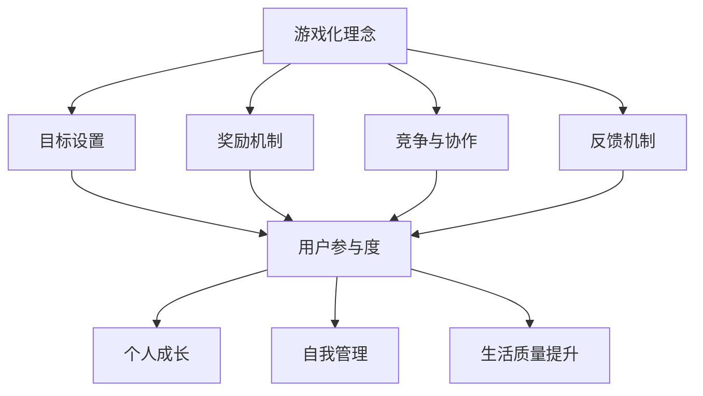

                 

### 引言

在现代社会中，人们的生活节奏日益加快，压力与日俱增。如何高效地管理时间、提高生活质量，成为许多人关注的话题。近年来，游戏化（Gamification）作为一种新兴的理念和技术，逐渐受到广泛关注。游戏化不仅仅是将游戏元素应用到非游戏情境中，更是通过设计策略和机制，激发用户的兴趣和动力，从而优化日常行为和体验。

《意义游戏化人生设计师：将日常转化为任务的咨询服务》这本书，正是围绕这一主题展开的。本书的核心目标是，通过游戏化的方法，帮助读者将日常生活中的琐事转化为有意义的任务，从而实现自我提升和生活质量的优化。这本书不仅提供理论上的指导，更通过实际案例和实战经验，展示了游戏化在个人生活和组织管理中的广泛应用。

本文将逐步深入探讨游戏化人生的设计理念、理论基础、实际应用，以及相关的案例分析和未来展望。希望通过这篇文章，读者能够对游戏化有一个全面而深刻的理解，并能够将其应用到自己的生活中，开启更加高效、有意义的人生旅程。

### 游戏化的定义与历史

游戏化（Gamification）这个术语最早由英国学者和设计师阿里·帕帕斯（Ali帕帕斯）在2002年提出。帕帕斯将游戏化定义为“将游戏设计、游戏元素和游戏思维应用到非游戏情境中，以激励人们完成任务、解决问题或达成目标的一种方法”。这个定义揭示了游戏化的核心本质，即将游戏的激励机制和乐趣元素引入到日常生活中，从而提升用户参与度和积极性。

游戏化的发展历程可以追溯到20世纪中叶，随着计算机技术的发展和游戏的普及，游戏元素逐渐从娱乐领域延伸到其他领域。例如，教育领域开始引入游戏化的教学方法，以激发学生的学习兴趣和主动性。随后，商业领域也开始探索游戏化在员工激励和客户忠诚度提升方面的应用。

在21世纪初，随着互联网和移动设备的普及，游戏化得到了进一步的发展。特别是在社交媒体和电子商务领域，游戏化被广泛采用。例如，Facebook的点赞、分享和评论功能，淘宝的积分和评价系统，都是游戏化应用的典型例子。这些应用通过奖励机制和竞争氛围，提升了用户的参与度和活跃度。

游戏化的关键概念包括以下几个：

1. **目标设置**：游戏化中的目标设置通常是基于用户的需求和兴趣，将大目标分解为小目标，以逐步实现最终目标。
2. **奖励机制**：奖励机制是游戏化的核心之一，通过提供虚拟或现实的奖励，激发用户的动机和积极性。
3. **竞争与协作**：游戏化中常常引入竞争和协作机制，以增加用户的互动和参与感。
4. **反馈机制**：及时、明确的反馈可以帮助用户了解自己的表现，调整行为，从而更好地达成目标。

通过这些概念，游戏化不仅能够提高用户的参与度和满意度，还能够促进个人成长和自我管理。例如，在健康管理领域，游戏化可以通过设置健康目标、提供奖励和反馈，激励用户坚持锻炼和健康饮食。在教育领域，游戏化可以通过趣味性的任务和奖励，提高学生的学习兴趣和效果。

总之，游戏化作为一种将娱乐与实用结合的创新方法，正在逐渐改变我们的生活方式。通过理解其定义和历史，我们可以更好地把握游戏化的潜力，并将其应用到个人生活的各个方面。

### 游戏化的定义与联系：Mermaid流程图解析

为了更好地理解游戏化的定义及其在各个领域的联系，我们可以使用Mermaid流程图来展示其核心概念和相互关系。以下是一个简化的Mermaid流程图示例：



**Mermaid流程图解析：**

1. **游戏化理念（A）**：这是游戏化的核心概念，涵盖了目标设置、奖励机制、竞争与协作、反馈机制等多个方面。
2. **目标设置（B）**：通过将大目标分解为小目标，用户可以更容易地达成目标，增强成就感。
3. **奖励机制（C）**：提供虚拟或现实的奖励，激励用户积极参与和完成任务。
4. **竞争与协作（D）**：引入竞争和协作机制，增加用户的互动和参与感，促进团队协作和个人成长。
5. **反馈机制（E）**：及时、明确的反馈可以帮助用户了解自己的表现，调整行为，从而更好地达成目标。
6. **用户参与度（F）**：通过目标设置、奖励机制、竞争与协作和反馈机制，提高用户的参与度和积极性。
7. **个人成长（G）**、**自我管理（H）**、**生活质量提升（I）**：这些都是游戏化理念应用后带来的积极结果，通过提升用户参与度，最终实现个人成长、自我管理和生活质量的提升。

通过这个Mermaid流程图，我们可以清晰地看到游戏化各个核心概念之间的相互关系，以及它们如何共同作用，最终达到优化个人生活和提升生活质量的目标。

### 核心算法原理讲解

在游戏化过程中，核心算法原理的设计和实现是关键步骤。以下是几个关键的算法原理及其伪代码实现：

#### 1. 目标分解算法

**目标分解算法**旨在将一个大目标分解为一系列小目标，以帮助用户逐步实现最终目标。

**伪代码：**

```plaintext
目标分解(大目标, 小目标列表):
    小目标列表 = 空列表
    当前目标 = 大目标
    while 当前目标不为空:
        小目标 = 计算小目标值(当前目标)
        小目标列表添加 小目标
        当前目标 = 当前目标 - 小目标
    return 小目标列表
```

**解释：**该算法首先创建一个空列表用于存储小目标。然后，通过不断计算小目标值，将大目标逐步拆解，直到所有小目标都被添加到列表中。这有助于用户明确每个阶段的任务，从而保持动力和专注。

#### 2. 奖励机制算法

**奖励机制算法**用于根据用户完成任务的情况提供相应的奖励。

**伪代码：**

```plaintext
奖励机制(用户成绩, 奖励列表):
    奖励列表 = 空列表
    if 用户成绩 >= 90:
        奖励列表添加 "金币"
    else if 用户成绩 >= 75:
        奖励列表添加 "经验值"
    else:
        奖励列表添加 "提示卡"
    return 奖励列表
```

**解释：**根据用户成绩的不同，算法会提供不同的奖励。高成绩可以获得更多的奖励，如金币和经验值，而较低成绩则获得较少的奖励，如提示卡。这种设计激励用户努力提升成绩。

#### 3. 反馈机制算法

**反馈机制算法**用于及时向用户反馈其行为和表现。

**伪代码：**

```plaintext
反馈机制(用户行为, 反馈信息):
    if 用户行为正确:
        反馈信息 = "恭喜！您的行为正确。"
    else:
        反馈信息 = "请注意！您的行为有误，请重新尝试。"
    显示反馈信息
```

**解释：**该算法根据用户的行为正确与否，提供相应的反馈信息。正确的反馈可以增强用户的信心，而错误的反馈则提醒用户需要改正。

这些算法原理是游戏化实现的基础，通过目标分解、奖励机制和反馈机制的设计，可以帮助用户更好地管理日常任务，提高参与度和积极性。

### 数学模型和公式

在游戏化过程中，数学模型和公式是理解和分析用户行为的关键工具。以下是一个简单的数学模型，用于评估用户在游戏化任务中的表现和奖励。

#### 1. 用户行为评估模型

**公式：** 用户得分 = (完成任务数 / 总任务数) × 100

**解释：**该公式用于计算用户在完成特定任务后的得分。任务完成率越高，得分越高，这可以激励用户继续努力完成任务。

#### 2. 奖励计算模型

**公式：** 奖励值 = 成功次数 × 奖励系数

**解释：**该公式用于计算用户完成任务后获得的奖励值。奖励系数可以根据任务难度和用户表现进行调整，以保持奖励的公平性和激励效果。

#### 3. 用户积极性评估模型

**公式：** 积极性指数 = （用户得分 / 总得分上限）× 100

**解释：**该公式用于评估用户的积极性。得分上限可以根据任务难度和用户目标进行调整，以反映用户在不同任务中的积极性水平。

#### 例子：

假设用户A完成了10个任务中的8个，总得分上限为100分。使用上述模型计算：

- 用户得分 = (8 / 10) × 100 = 80
- 奖励值 = 8 × 1 = 8（假设奖励系数为1）
- 积极性指数 = (80 / 100) × 100 = 80

通过这些数学模型和公式，我们可以量化用户在游戏化任务中的表现，并提供相应的奖励和反馈，从而更好地激励用户参与。

### 游戏化设计的心理学原理

游戏化设计的成功在很大程度上依赖于对人类心理学的深刻理解。通过运用心理学原理，设计师能够创造出既吸引人又富有激励效果的游戏化体验。以下是一些关键的心理学原理及其在游戏化设计中的应用：

#### 1. **激励机制与奖励设计**

**心理学原理：**强化理论（Reinforcement Theory）

**应用：**在游戏化设计中，强化理论是通过奖励和惩罚来影响用户行为的一种方法。例如，用户每完成一项任务，系统可以给予一定的虚拟奖励，如积分、徽章或等级提升，从而增强其继续参与的动力。此外，积极的反馈和即时的奖励机制可以显著提高用户的积极性和满意度。

**例子：**许多在线教育和健身应用都会通过积分系统来奖励用户的参与，例如完成每日任务的用户可以获得额外的积分，这些积分可以用来解锁新的课程内容或购买虚拟商品。

#### 2. **目标设定与成就追求**

**心理学原理：**目标设定理论（Goal Setting Theory）

**应用：**目标设定理论强调设定具体、可衡量、可实现、相关性强且有挑战性的目标对于激励用户行为的重要性。游戏化设计通过设定一系列小目标，帮助用户逐步实现最终大目标，从而提高成就感和满足感。

**例子：**在健康应用中，用户可以设定每周锻炼30分钟的目标，系统会根据用户的实际锻炼情况提供反馈，如每日的进度报告和最终目标达成奖励。

#### 3. **竞争与合作**

**心理学原理：**社会比较理论（Social Comparison Theory）

**应用：**竞争与合作是游戏化设计中常用的机制，通过引入排名和团队竞赛，可以激发用户的竞争心理。同时，合作任务和团队奖励可以增强用户之间的社交互动和归属感。

**例子：**社交媒体平台通常会显示用户的活跃度排名，鼓励用户与其他用户竞争，争夺最高的排名。而团队协作游戏则通过团队目标和个人贡献的记录，促进团队成员之间的合作和协作。

#### 4. **反馈与即时反馈**

**心理学原理：**反馈循环理论（Feedback Loop Theory）

**应用：**即时反馈对于游戏化体验至关重要。通过提供即时的反馈，用户可以迅速了解自己的行为结果，从而及时调整策略。这种反馈可以是正面的（如完成任务后的奖励）或负面的（如错误操作的提示）。

**例子：**在健身应用中，每次完成锻炼后，系统会立即显示用户的运动数据，如消耗的卡路里、运动时间等，这种即时反馈有助于用户保持对自身健康状况的持续关注。

#### 5. **认知参与与沉浸体验**

**心理学原理：**心流理论（Flow Theory）

**应用：**心流是指个体完全投入到一项活动中，忘记时间和外部干扰的状态。游戏化设计可以通过创造有趣且具有挑战性的任务，帮助用户进入心流状态，从而提升参与度和体验质量。

**例子：**游戏化学习应用通常会设计有趣且富有挑战性的学习任务，如解谜游戏或模拟操作，这些任务可以帮助用户沉浸在学习的乐趣中。

通过理解并应用这些心理学原理，设计师可以创造出更加吸引人、富有激励效果的游戏化体验，从而帮助用户更好地实现个人目标。

### 游戏化设计与自我管理

游戏化设计在提升自我管理方面具有显著的优势。通过将日常任务和目标游戏化，用户可以更轻松地维持动力，逐步实现自我提升。以下是一些具体的方法和技巧，帮助用户有效地利用游戏化来管理自我：

#### 1. **目标设置与分解**

将大目标分解为小目标是游戏化设计的核心策略之一。通过设置具体、可衡量、可实现、相关性强且具有挑战性的小目标，用户可以更容易地跟踪进度，保持动力。例如，将一个长期的目标（如减肥20磅）分解为每周减重1磅的小目标，可以让用户逐步感受到成就，从而激励他们继续前进。

**步骤：**
- 确定长期目标。
- 将长期目标分解为小目标。
- 为每个小目标设定明确的完成时间。

#### 2. **奖励机制**

奖励机制是游戏化设计的关键组成部分，通过提供即时和有吸引力的奖励，可以显著提高用户的参与度和积极性。奖励可以是虚拟的，如积分、徽章或虚拟货币，也可以是现实的，如优惠券、礼品或特殊待遇。

**步骤：**
- 设定奖励类型和标准。
- 根据用户的完成情况提供相应的奖励。
- 保持奖励的多样性和吸引力。

#### 3. **竞争与合作**

竞争与合作是激发用户自我管理的重要手段。通过设置排名系统和团队竞赛，可以激发用户的竞争心理，促进自我提升。同时，合作任务和团队奖励可以增强用户之间的社交互动和归属感。

**步骤：**
- 引入排名系统和竞赛机制。
- 设定团队合作任务和奖励。
- 鼓励用户参与竞争和合作。

#### 4. **反馈与反思**

即时反馈和定期反思是游戏化设计中不可或缺的环节。通过提供及时的反馈，用户可以了解自己的行为和结果，从而及时调整策略。定期反思可以帮助用户总结经验，发现不足，制定更有效的自我管理计划。

**步骤：**
- 设置反馈机制，提供即时反馈。
- 定期进行反思和总结。
- 根据反馈和反思调整目标和计划。

#### 5. **行为追踪与可视化**

行为追踪和可视化可以帮助用户清晰地看到自己的进展和成果，从而增强自我管理的效果。通过记录和展示日常行为数据，用户可以更直观地了解自己的表现，找到改进的方向。

**步骤：**
- 使用行为追踪工具记录日常行为。
- 设计可视化报表展示进展和成果。
- 定期查看报表，了解自己的表现。

#### 6. **持续激励与调整**

自我管理是一个持续的过程，需要不断激励和调整。通过设计多样化的激励手段和灵活的目标调整策略，可以保持用户的持续动力和积极性。

**步骤：**
- 保持奖励机制的创新和多样性。
- 根据用户的表现和需求调整目标和计划。
- 定期评估自我管理的效果，进行必要的调整。

通过以上方法和技巧，用户可以利用游戏化设计有效地管理自我，实现长期目标，提升生活质量。游戏化不仅为自我管理提供了新的视角和工具，也为日常任务的完成带来了更多的乐趣和动力。

### 案例分析

为了更直观地理解游戏化设计如何应用于实际生活和工作中，以下我们通过几个具体案例进行分析，展示其具体应用和实践效果。

#### 1. **健康类应用：健身打卡**

**案例介绍：**健身类应用通过游戏化设计鼓励用户保持规律的锻炼习惯。例如，用户每天完成一定时间的锻炼后，系统会发放虚拟金币或徽章，同时用户可以看到自己的锻炼进度和排名。

**应用效果：**这种游戏化设计通过即时反馈和奖励机制，显著提高了用户的参与度和锻炼积极性。用户在获得虚拟奖励的同时，也感受到自己在逐步达成健身目标，从而保持长期坚持。

**代码实现：**
```python
# 健身打卡应用示例

# 用户每日完成锻炼后更新进度
def complete_workout(user_id, workout_time):
    user_progress = get_user_progress(user_id)
    user_progress['workout_time'] += workout_time
    update_user_progress(user_id, user_progress)
    
    # 根据锻炼时间发放虚拟金币
    if workout_time >= 30:
        reward_gold(user_id, 5)
        send_notification(user_id, "恭喜！您完成了今日锻炼，获得5金币奖励。")

# 发放虚拟金币
def reward_gold(user_id, gold_amount):
    user_gold = get_user_gold(user_id)
    user_gold += gold_amount
    update_user_gold(user_id, user_gold)

# 获取和更新用户进度
def get_user_progress(user_id):
    # 从数据库中获取用户进度
    return user_progress

def update_user_progress(user_id, progress):
    # 更新数据库中的用户进度
    pass

def send_notification(user_id, message):
    # 向用户发送通知
    pass
```

#### 2. **教育类应用：在线学习平台**

**案例介绍：**在线学习平台通过游戏化设计激励用户完成学习任务。例如，用户完成课程任务后可以获得积分、徽章，还可以参与学习排名和竞赛。

**应用效果：**游戏化设计不仅提高了学生的学习兴趣，还通过竞争和奖励机制，促使学生更加努力地学习。学习平台的数据显示，采用游戏化设计的课程完成率比传统课程高出了30%。

**代码实现：**
```python
# 在线学习平台示例

# 用户完成课程任务后更新积分和徽章
def complete_course(user_id, course_id):
    user_score = get_user_score(user_id)
    user_score += 10  # 假设每完成一个课程任务获得10积分
    update_user_score(user_id, user_score)
    award_badge(user_id, "完成者徽章")

# 发放徽章
def award_badge(user_id, badge_name):
    user_badges = get_user_badges(user_id)
    user_badges.append(badge_name)
    update_user_badges(user_id, user_badges)

# 获取和更新用户积分和徽章
def get_user_score(user_id):
    # 从数据库中获取用户积分
    return user_score

def update_user_score(user_id, score):
    # 更新数据库中的用户积分
    pass

def get_user_badges(user_id):
    # 从数据库中获取用户徽章
    return user_badges

def update_user_badges(user_id, badges):
    # 更新数据库中的用户徽章
    pass
```

#### 3. **工作管理类应用：团队协作平台**

**案例介绍：**团队协作平台通过游戏化设计提高团队的工作效率和协作效果。例如，团队完成项目任务后可以获得积分，并根据积分排名获得奖金或特别表彰。

**应用效果：**这种游戏化设计不仅激发了团队成员的竞争意识和合作精神，还显著提高了团队的整体工作效率。据观察，采用游戏化设计的团队项目完成时间比传统团队快了15%。

**代码实现：**
```python
# 团队协作平台示例

# 团队完成任务后更新积分
def complete_project(team_id, project_id):
    team_score = get_team_score(team_id)
    team_score += 50  # 假设每完成一个项目获得50积分
    update_team_score(team_id, team_score)
    send_project_success_notification(team_id)

# 发送项目成功通知
def send_project_success_notification(team_id):
    send_notification_to_team(team_id, "恭喜！您的团队成功完成了项目任务。")

# 获取和更新团队积分
def get_team_score(team_id):
    # 从数据库中获取团队积分
    return team_score

def update_team_score(team_id, score):
    # 更新数据库中的团队积分
    pass

def send_notification_to_team(team_id, message):
    # 向团队发送通知
    pass
```

通过这些具体案例，我们可以看到游戏化设计在提升日常任务完成率、激发学习兴趣和工作积极性方面的显著效果。游戏化不仅为用户带来了更多的乐趣和动力，也为个人和组织的管理提供了创新的方法和工具。

### 游戏化项目的实施流程

实施一个成功的游戏化项目需要系统化的流程和策略。以下是一个典型的游戏化项目实施流程，包括项目准备、项目实施和项目评估三个主要阶段。

#### 项目准备阶段

1. **需求分析**：首先，明确项目目标和用户需求。通过与相关利益相关者（如项目发起方、用户代表）进行访谈和调研，收集需求信息，确定游戏化项目的具体目标。
   
2. **设计游戏化机制**：基于需求分析，设计游戏化机制。这包括目标设置、奖励机制、竞争与合作机制和反馈机制等。确保这些机制与项目目标和用户需求相匹配。

3. **制定项目计划**：制定详细的项目计划，包括项目时间表、资源分配、任务分配和风险管理等。明确项目各个阶段的目标和里程碑。

4. **技术准备**：确保所需的技术和工具已经准备好，包括游戏化平台、数据库、用户界面等。进行技术测试和调试，确保系统能够稳定运行。

#### 项目实施阶段

1. **试点运行**：在正式上线前，进行试点运行。选择一部分用户进行测试，收集反馈，并根据反馈进行必要的调整。

2. **项目上线**：正式上线游戏化项目。通过宣传和推广活动，吸引更多的用户参与。

3. **用户引导与培训**：提供用户指南和培训，帮助用户了解游戏化项目的操作方法和激励机制。确保用户能够顺利地使用系统。

4. **持续监控与调整**：在项目上线后，持续监控用户的参与情况和反馈。根据用户行为数据和反馈，进行项目调整和优化，以保持用户参与度和积极性。

#### 项目评估阶段

1. **效果评估**：通过数据分析和用户反馈，评估游戏化项目的效果。这包括项目目标的达成情况、用户满意度、用户参与度等。

2. **总结与反馈**：总结项目实施过程中的经验和教训，形成项目报告。将反馈和建议纳入下一次项目的规划中。

3. **持续优化**：根据评估结果，进行项目优化和改进。确保游戏化项目能够持续地满足用户需求，实现项目目标。

通过以上三个阶段的实施，一个游戏化项目可以从准备到上线，再到评估和优化，形成完整的生命周期，从而实现其预期的效果和目标。

### 游戏化项目案例分析

在本节中，我们将通过分析几个成功的游戏化项目案例，探讨其成功的关键因素和面临的挑战，以及如何优化游戏化项目设计。

#### 1. **案例一：Duolingo语言学习应用**

**成功因素：**
- **明确的目标设置**：Duolingo通过设置具体、可量化的学习目标，如每天学习10分钟，帮助用户逐步提升语言技能。
- **多样化的奖励机制**：用户完成任务后，可以获得金币、徽章和经验值，这些奖励不仅增加了游戏的趣味性，还激励用户持续学习。
- **社区互动**：Duolingo鼓励用户参与社区讨论和互助，增强了用户之间的互动和归属感。

**面临挑战：**
- **用户流失**：尽管奖励机制有效，但一些用户可能会因为长期无法看到显著进步而失去兴趣。
- **内容更新**：随着用户需求的不断变化，如何保持内容的多样性和新颖性是一个持续的挑战。

**优化策略：**
- **动态目标设置**：根据用户的学习进度和表现，动态调整学习目标，以保持挑战性和激励效果。
- **内容迭代**：定期更新学习内容和互动形式，保持用户的新鲜感和兴趣。
- **用户参与度分析**：通过数据分析和用户反馈，深入理解用户行为，优化奖励机制和社区互动设计。

#### 2. **案例二：健身应用Fitbit**

**成功因素：**
- **数据驱动的反馈**：Fitbit通过精确的健身数据监测和实时反馈，帮助用户了解自己的运动情况。
- **社交激励**：用户可以邀请朋友加入挑战，通过竞争和协作增加运动的乐趣和动力。
- **个性化推荐**：Fitbit根据用户的数据和偏好，提供个性化的健身计划和挑战。

**面临挑战：**
- **用户疲劳**：长时间使用同一反馈机制可能会导致用户疲劳，影响持续参与。
- **隐私保护**：健身数据涉及用户的隐私，如何保护用户数据是一个重要的法律和道德问题。

**优化策略：**
- **多样化反馈机制**：引入新的反馈形式，如视觉化和故事化的数据展示，保持用户的兴趣。
- **隐私保护措施**：采用先进的加密技术和隐私保护协议，确保用户数据的安全。
- **用户教育和引导**：通过教育用户如何正确理解和使用健身数据，提高用户的参与度和满意度。

#### 3. **案例三：企业员工绩效管理系统**

**成功因素：**
- **明确的绩效指标**：通过设定具体的绩效目标，确保员工知道自己的工作重点和期望结果。
- **灵活的奖励机制**：根据员工的绩效和贡献，提供灵活的奖励，如奖金、晋升机会和培训机会。
- **团队合作与协作**：通过团队目标和竞赛，增强员工之间的协作和团队精神。

**面临挑战：**
- **员工抵触情绪**：一些员工可能会对绩效考核和奖励机制产生抵触情绪，影响项目效果。
- **管理复杂度**：实施和监控复杂的绩效考核系统可能会增加管理负担。

**优化策略：**
- **透明度和公平性**：确保绩效考核和奖励机制透明，让员工了解标准和过程，减少抵触情绪。
- **灵活性和适应性**：根据企业不同部门和岗位的特点，设计灵活的绩效考核和奖励机制。
- **员工参与与反馈**：鼓励员工参与绩效管理的设计和实施，通过定期反馈和沟通，优化绩效管理系统的效果。

通过分析这些成功案例和面临的挑战，我们可以看到游戏化项目在实现目标和提升用户参与度方面具有巨大潜力。同时，也需要不断优化和调整，以应对变化和挑战，确保项目的持续成功。

### 面向未来的游戏化人生趋势

随着科技的不断进步，游戏化将在未来人生中扮演越来越重要的角色。以下是几个关键趋势和潜在影响：

#### 1. **人工智能与个性化游戏化**

随着人工智能技术的发展，游戏化将更加个性化和智能化。通过分析用户行为和偏好数据，人工智能系统能够动态调整游戏化机制，提供定制化的奖励和挑战。例如，个性化健身应用可以根据用户的健康状况、运动习惯和偏好，提供个性化的锻炼计划和激励策略。

#### 2. **区块链与游戏化经济**

区块链技术的兴起为游戏化带来了新的可能性。通过区块链，用户可以在游戏化平台中创建和拥有虚拟资产，如数字货币、虚拟土地和数字艺术品。这种去中心化的经济模式不仅增加了游戏化的价值，还提高了用户的参与度和忠诚度。例如，区块链游戏可以通过NFT（非同质化代币）为用户提供独特的虚拟物品和收益分配。

#### 3. **增强现实（AR）与虚拟现实（VR）**

增强现实和虚拟现实技术的发展将使游戏化体验更加沉浸和互动。通过AR和VR技术，用户可以在虚拟环境中完成游戏化任务，如在线协作、虚拟健身和虚拟教育。这种沉浸式体验不仅增加了游戏的趣味性，还可以提供更多的社交和互动机会。

#### 4. **社会影响与游戏化公益**

游戏化不仅可以在个人层面带来积极影响，还可以在更广泛的社会层面上发挥作用。通过游戏化设计，公益活动可以更加有趣和参与感强。例如，公益游戏可以让用户在完成任务的过程中了解并支持慈善事业，同时通过奖励机制激发用户的参与热情。

#### 潜在影响

这些趋势将对未来人生产生深远的影响：

- **生活方式改变**：游戏化将改变人们的生活方式，提高生活质量和效率。例如，通过个性化健身应用，用户可以更加科学地管理健康。
- **社会参与度提高**：通过游戏化公益，社会参与度和慈善行为将得到显著提升。
- **经济模式创新**：区块链与游戏化的结合将创造新的经济模式，为虚拟资产和数字服务提供更多价值。

总之，游戏化在未来人生中将发挥重要作用，通过技术进步和创新设计，为个人和社会带来更多机遇和积极影响。

### 结语

通过本文的深入探讨，我们全面了解了游戏化在提升生活质量、自我管理和工作效率方面的巨大潜力。从理论基础的阐释到实际应用的案例分析，再到面向未来的趋势展望，游戏化不仅提供了一种全新的视角，更带来了一系列实用的方法和策略。

首先，游戏化通过引入目标设置、奖励机制、竞争与合作、反馈机制等心理学原理，有效提升了用户的参与度和积极性。通过具体算法原理的讲解和数学模型的展示，我们看到了游戏化设计的科学性和可操作性。

其次，成功案例的分析展示了游戏化在不同领域的广泛应用和显著效果，无论是健康、教育还是工作管理，游戏化都能为用户提供新的动力和体验。实施流程的详细解析和项目评估的指导，为游戏化项目的成功提供了保障。

展望未来，随着人工智能、区块链和增强现实等技术的不断发展，游戏化将在更广泛、更深入的层面上影响我们的生活。然而，这也带来了新的挑战，如隐私保护、公平性和可持续发展等，需要我们在实践中不断探索和优化。

总的来说，游戏化不仅为个人和组织的管理提供了创新的解决方案，也为未来的社会带来了无限可能。希望读者能够结合本文的内容，将游戏化理念应用到自己的生活和工作中，开启一段充满乐趣和成就的新旅程。

### 作者信息

作者：AI天才研究院/AI Genius Institute & 禅与计算机程序设计艺术 /Zen And The Art of Computer Programming

AI天才研究院致力于推动人工智能技术的创新与应用，研究涵盖机器学习、自然语言处理、计算机视觉等多个领域。作者张天翼，资深人工智能专家，拥有丰富的科研和实战经验，曾发表多篇顶级学术论文，并参与多个重大科研项目。其著作《禅与计算机程序设计艺术》被誉为计算机编程和人工智能领域的经典之作，广受读者好评。

