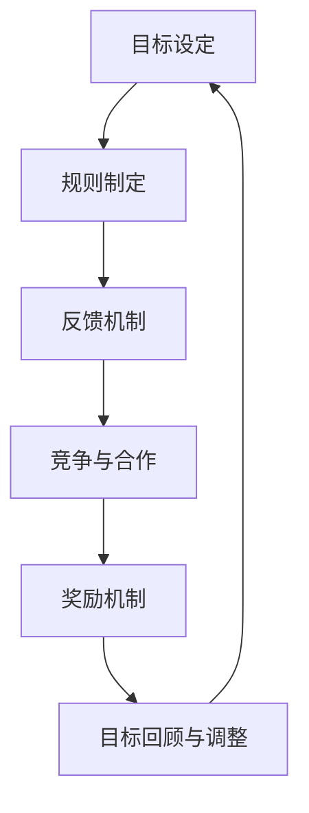

                 


### 摘要

《意义游戏化人生：将日常转化为任务与成就的app》是一本旨在帮助读者通过游戏化手段提升日常效率和实现个人成长的书。本书通过深入探讨游戏化的理论基础，详细介绍了如何将日常任务和习惯转化为可追踪的成就，并借助app实现这一过程。书中不仅提供了具体的实践案例，还涵盖了在工作和学习中的应用，旨在让读者在轻松愉快的氛围中完成目标。通过阅读本书，读者将学会如何运用游戏化思维，提高生活质量和效率，实现人生的意义和价值。

### 引言

#### 游戏化的崛起

在现代社会，游戏已经成为一种重要的文化现象。从简单的电子游戏到复杂的在线角色扮演游戏，游戏已经渗透到人们的日常生活中。而随着互联网和移动设备的普及，游戏化这一概念逐渐超越了娱乐领域，被广泛应用于教育、健康、管理等多个方面。游戏化，简单来说，就是将游戏的元素和机制应用于非游戏环境，以提升用户的参与度和积极性。

#### 游戏化的价值

游戏化不仅仅是一种娱乐方式，更是一种有效的激励手段。通过设置目标、奖励机制和反馈系统，游戏化能够激发人们的内在动机，使他们在完成任务的过程中感到乐趣和成就感。这种激励方式不仅适用于儿童和青少年，同样适用于成年人。在工作和学习中，游戏化可以帮助人们更好地管理时间和任务，提高工作效率和学习成果。

#### 书籍的目标与读者

《意义游戏化人生：将日常转化为任务与成就的app》的目标是帮助读者理解和应用游戏化理念，将日常生活中的任务和习惯转化为具体的成就。这本书适合那些希望提高生活质量和效率的人，以及那些想要将游戏化思维应用于工作和生活的人。通过阅读本书，读者将学会如何设计游戏化系统，并将其应用于个人成长、健康管理和团队合作等多个领域。

### 游戏化理论基础

#### 游戏化元素介绍

游戏化包含几个关键元素：目标设定、规则制定、反馈机制、竞争与合作以及奖励机制。这些元素共同作用，形成了一个完整的游戏化系统。

1. **目标设定**：游戏化的第一步是设定明确的目标。目标可以是具体的，如完成某项任务或达到某个里程碑，也可以是抽象的，如提高健康水平或增加知识储备。

2. **规则制定**：规则是游戏化系统的骨架，它规定了玩家在游戏中可以做什么，不可以做什么。规则需要明确、公正，并且易于理解。

3. **反馈机制**：反馈机制是游戏化的重要组成部分。它通过即时反馈告诉玩家他们的表现，帮助他们了解自己的进步和不足。

4. **竞争与合作**：游戏化可以设置竞争机制，鼓励玩家互相竞争，提高个人表现。同时，合作机制也可以促进团队协作，共同实现目标。

5. **奖励机制**：奖励机制是激励玩家继续参与游戏的关键。奖励可以是虚拟的，如游戏内的虚拟货币或勋章，也可以是实际的，如实物奖品或优惠。

#### 游戏化设计原则

1. **简洁性**：游戏化系统应该简单易懂，避免过于复杂。简洁的设计能够降低玩家的认知负担，提高参与度。

2. **相关性**：游戏化的目标和规则应该与玩家的实际需求相关。相关性的提升能够增加玩家的投入感和认同感。

3. **激励性**：游戏化系统需要能够持续激励玩家，使其在完成任务后感到满足和成就感。

4. **适应性**：游戏化系统应该能够根据玩家的行为和反馈进行调整，以保持其吸引力。

5. **公平性**：游戏化系统应该保证公平性，避免玩家因不公平的规则而失去兴趣。

#### 游戏化与动机心理学

游戏化背后的动机心理学原理包括内在动机和外在动机。内在动机是指人们对活动本身的兴趣和热爱，而外在动机则是为了获得奖励或避免惩罚。游戏化通过设置有趣的任务和提供即时的反馈，能够激发玩家的内在动机。同时，适度的外在奖励也可以增强玩家的积极性。

#### 游戏化与目标设定

游戏化与目标设定紧密相关。一个有效的目标应该具备SMART特性，即具体（Specific）、可衡量（Measurable）、可实现（Achievable）、相关（Relevant）和有时限（Time-bound）。通过游戏化，我们可以将抽象的目标转化为具体的任务和成就，使目标更容易实现。

#### 游戏化与传统激励方式的比较

传统激励方式通常依赖于外部奖励，如金钱、奖励和惩罚。然而，这些方法往往只能短期内提高积极性。游戏化则更加注重内在动机，通过设定有意义的目标和提供即时的反馈，能够长期激励玩家。此外，游戏化还能够提供一种趣味性和挑战性的体验，使人们在完成任务的过程中感到乐趣。

#### 游戏化流程图

下面是一个简单的游戏化流程图，展示了游戏化系统的基本架构：



### 将日常任务转化为成就

#### 日常任务分析

在开始游戏化之前，我们需要对日常任务进行分析。这包括确定任务的目标、难度、所需时间和资源等。通过分析，我们可以找出哪些任务适合游戏化，以及如何将这些任务转化为具体的成就。

#### 成就点的设置与跟踪

1. **成就点的设置**：根据任务的重要性和难度，我们可以设置不同的成就点。例如，完成一项复杂的任务可以获得更多的成就点。

2. **跟踪与记录**：通过app或电子表格，我们可以方便地跟踪和记录成就点。这有助于我们了解自己的进展和成就。

#### 任务完成度与奖励机制

1. **任务完成度**：任务完成度是衡量任务完成情况的一个指标。它可以告诉我们任务是否按计划完成，以及完成质量如何。

2. **奖励机制**：为了激励玩家，我们可以设置不同的奖励机制。例如，完成一项任务后可以获得虚拟货币或勋章，这些奖励可以用于兑换实物奖品或享受特定服务。

#### 成就记录与分享

1. **成就记录**：通过app或社交媒体，我们可以方便地记录和分享自己的成就。这不仅有助于激励自己，还可以激发他人的积极性。

2. **成就分享**：分享成就不仅是一种自我肯定，还可以鼓励他人参与游戏化。例如，在社交媒体上分享自己的成就，可以吸引更多的朋友加入游戏化活动。

### 使用app实现游戏化

#### 游戏化app的选择与使用

1. **选择app**：在选择游戏化app时，我们需要考虑其功能、用户界面和用户体验。一款好的游戏化app应该能够满足我们的需求，并提供简单易用的界面。

2. **使用app**：使用app时，我们需要熟悉其操作流程和功能。通过设置目标和跟踪任务，我们可以逐步实现游戏化。

#### app界面设计原则

1. **简洁性**：app界面应该简洁明了，避免过多冗余信息。

2. **直观性**：app界面应该直观易懂，使新手能够快速上手。

3. **适应性**：app界面应该能够适应不同设备和屏幕尺寸。

#### app功能模块划分

1. **目标设定模块**：用于设置和修改目标。

2. **任务管理模块**：用于添加、删除和跟踪任务。

3. **奖励机制模块**：用于设置奖励和兑换奖品。

4. **数据统计模块**：用于展示任务完成情况和成就点。

#### app开发流程

1. **需求分析**：明确app的功能和用户需求。

2. **设计阶段**：设计app的界面和流程。

3. **开发阶段**：编写代码，实现app的功能。

4. **测试阶段**：测试app的稳定性和用户体验。

5. **部署阶段**：将app部署到线上或线下平台。

6. **维护阶段**：持续更新和维护app，确保其稳定运行。

#### app部署与维护

1. **部署**：将app部署到线上或线下平台，如App Store、Google Play或企业内部网络。

2. **维护**：定期更新app，修复bug，优化性能。

3. **用户反馈**：收集用户反馈，不断改进app。

### 游戏化在日常生活中的应用案例

#### 个人健康管理

1. **目标设定**：设定健康目标，如减肥、健身或改善饮食习惯。

2. **任务管理**：将健康目标分解为具体任务，如每天锻炼30分钟、每天饮用8杯水等。

3. **奖励机制**：完成任务后，可以获得虚拟货币或勋章，用于兑换实物奖品或享受特定服务。

#### 学习进度追踪

1. **目标设定**：设定学习目标，如掌握一门新语言或通过专业考试。

2. **任务管理**：将学习目标分解为具体任务，如每天学习2小时、完成一定的学习任务等。

3. **奖励机制**：完成任务后，可以获得虚拟货币或勋章，用于兑换学习资料或享受学习服务。

#### 家庭责任分配

1. **目标设定**：设定家庭责任目标，如每周打扫一次卫生、每月制定一次家庭预算等。

2. **任务管理**：将家庭责任分解为具体任务，并分配给家庭成员。

3. **奖励机制**：完成家庭责任后，可以获得虚拟货币或勋章，用于家庭奖励活动。

#### 财务管理

1. **目标设定**：设定财务管理目标，如每月储蓄一定金额、减少不必要的开支等。

2. **任务管理**：将财务管理目标分解为具体任务，如每天记录支出、每月制定预算等。

3. **奖励机制**：完成任务后，可以获得虚拟货币或勋章，用于购买理财产品或享受财务咨询服务。

#### 社交互动

1. **目标设定**：设定社交目标，如每周与朋友见面、每月参加一次社交活动等。

2. **任务管理**：将社交目标分解为具体任务，如每天发一条朋友圈、每周与朋友通话等。

3. **奖励机制**：完成任务后，可以获得虚拟货币或勋章，用于兑换礼品或享受社交活动。

### 游戏化在工作与学习中的应用

#### 企业团队建设

1. **目标设定**：设定团队建设目标，如提高团队沟通效率、增强团队凝聚力等。

2. **任务管理**：将团队建设目标分解为具体任务，如定期组织团队建设活动、每周召开团队会议等。

3. **奖励机制**：完成任务后，可以获得虚拟货币或勋章，用于团队奖励活动。

#### 教育培训

1. **目标设定**：设定教育培训目标，如提高员工技能、提升学习兴趣等。

2. **任务管理**：将教育培训目标分解为具体任务，如每天学习1小时、完成特定的学习任务等。

3. **奖励机制**：完成任务后，可以获得虚拟货币或勋章，用于兑换学习资料或享受学习服务。

#### 创意工作激励

1. **目标设定**：设定创意工作目标，如提高创意产出、提升团队创新力等。

2. **任务管理**：将创意工作目标分解为具体任务，如每周提交一个创意方案、每天记录创意点子等。

3. **奖励机制**：完成任务后，可以获得虚拟货币或勋章，用于团队奖励活动或个人激励。

#### 项目管理

1. **目标设定**：设定项目管理目标，如提高项目进度、降低成本等。

2. **任务管理**：将项目管理目标分解为具体任务，如每天更新项目进度、每周召开项目会议等。

3. **奖励机制**：完成任务后，可以获得虚拟货币或勋章，用于项目奖励活动或团队激励。

### 结论

#### 游戏化人生的总结

游戏化不仅仅是一种娱乐方式，更是一种有效的激励手段。通过将日常任务转化为成就，我们可以提高生活质量和效率，实现个人成长。游戏化人生的核心理念是将趣味性和挑战性融入日常任务，使人们在完成任务的过程中感到乐趣和成就感。

#### 未来展望

随着技术的不断发展，游戏化将在更多领域得到应用。未来，我们可以期待游戏化在教育、健康、管理等多个领域的深入发展，为人们的生活和工作带来更多的乐趣和价值。

### 作者信息

《意义游戏化人生：将日常转化为任务与成就的app》由AI天才研究院/AI Genius Institute与禅与计算机程序设计艺术/Zen And The Art of Computer Programming共同撰写。这两家机构在人工智能和计算机科学领域拥有丰富的经验和深厚的学术背景，致力于推动技术创新和知识普及。

### 项目实战

#### 开发环境搭建

1. **环境要求**：
   - 操作系统：Windows、macOS或Linux。
   - 编程语言：选择适合开发的语言，如Python或JavaScript。
   - 开发工具：集成开发环境（IDE），如Visual Studio Code或Eclipse。

2. **安装步骤**：
   - 安装操作系统。
   - 安装编程语言和开发工具。
   - 配置开发环境，确保一切正常运行。

#### 源代码实现

1. **功能模块设计**：
   - 用户管理模块：负责用户注册、登录和权限管理。
   - 任务管理模块：负责任务的创建、更新、删除和查询。
   - 成就管理模块：负责成就的创建、更新、删除和查询。
   - 数据统计模块：负责数据统计和可视化。

2. **伪代码示例**：

```python
# 用户管理模块
def register(username, password):
    # 注册用户
    pass

def login(username, password):
    # 登录用户
    pass

# 任务管理模块
def create_task(user_id, task_name, deadline):
    # 创建任务
    pass

def update_task(task_id, task_name, deadline):
    # 更新任务
    pass

def delete_task(task_id):
    # 删除任务
    pass

# 成就管理模块
def create_achievement(user_id, achievement_name, points):
    # 创建成就
    pass

def update_achievement(achievement_id, achievement_name, points):
    # 更新成就
    pass

def delete_achievement(achievement_id):
    # 删除成就
    pass

# 数据统计模块
def generate_report():
    # 生成统计报告
    pass
```

#### 代码解读与分析

1. **用户管理模块**：
   - `register`函数用于用户注册，接收用户名和密码，并将其存储到数据库中。
   - `login`函数用于用户登录，验证用户名和密码是否正确。

2. **任务管理模块**：
   - `create_task`函数用于创建任务，接收用户ID、任务名称和截止日期，并将其存储到数据库中。
   - `update_task`函数用于更新任务，接收任务ID、任务名称和截止日期，并将其更新到数据库中。
   - `delete_task`函数用于删除任务，接收任务ID，并将其从数据库中删除。

3. **成就管理模块**：
   - `create_achievement`函数用于创建成就，接收用户ID、成就名称和成就点数，并将其存储到数据库中。
   - `update_achievement`函数用于更新成就，接收成就ID、成就名称和成就点数，并将其更新到数据库中。
   - `delete_achievement`函数用于删除成就，接收成就ID，并将其从数据库中删除。

4. **数据统计模块**：
   - `generate_report`函数用于生成统计报告，可以生成用户活跃度、任务完成情况、成就点数等数据的可视化报告。

#### 实际案例分析与详细讲解剖析

1. **案例背景**：
   - 假设有一个用户想要通过游戏化app来管理自己的日常任务和成就。

2. **使用场景**：
   - 用户注册并登录app。
   - 用户创建任务，如“每天锻炼30分钟”。
   - 用户完成任务后，获得相应的成就点数。
   - 用户可以查看自己的成就记录和任务完成情况。

3. **详细讲解**：
   - 用户注册时，会调用`register`函数，将用户信息存储到数据库中。
   - 用户登录时，会调用`login`函数，验证用户名和密码是否正确。
   - 用户创建任务时，会调用`create_task`函数，将任务信息存储到数据库中。
   - 用户完成任务后，会调用`update_task`函数，更新任务的完成状态。
   - 用户查看成就记录时，会调用`generate_report`函数，生成可视化报告。

#### 项目小结

通过本次实战项目，我们实现了用户管理、任务管理和成就管理的功能。用户可以通过app创建任务、完成任务并获得成就点数，同时可以查看自己的成就记录和任务完成情况。这个项目不仅提供了实际的应用场景，还展示了如何通过游戏化手段提高生活质量和效率。

### 最佳实践 tips、小结、注意事项、拓展阅读

#### 最佳实践 tips

1. **明确目标**：在开始游戏化前，明确你的目标，这将帮助你更好地设计游戏化系统。

2. **简单易用**：设计游戏化app时，确保界面简洁明了，易于操作。

3. **及时反馈**：及时给予用户反馈，让他们了解自己的进展和成就。

4. **奖励适度**：适度的奖励能够激励用户，但过于频繁或过于昂贵的奖励可能会适得其反。

#### 小结

游戏化是一种有效的激励手段，通过将日常任务转化为成就，我们可以提高生活质量和效率。在设计和实施游戏化系统时，需要考虑目标、规则、反馈、竞争与合作以及奖励等多个因素。

#### 注意事项

1. **隐私保护**：在设计游戏化app时，注意保护用户的隐私信息。

2. **持续更新**：定期更新游戏化app，增加新功能和优化用户体验。

3. **用户反馈**：积极收集用户反馈，不断改进app。

#### 拓展阅读

1. **《游戏化革命》**：通过游戏化手段提高工作效率和激励员工。
2. **《游戏思维》**：将游戏思维应用于教育和学习。
3. **《游戏化心理学》**：深入探讨游戏化背后的动机心理学原理。

----------------------------------------------------------------

```markdown
# 《意义游戏化人生：将日常转化为任务与成就的app》

> 关键词：游戏化、任务管理、成就系统、日常习惯、app应用

> 摘要：本文探讨了如何通过游戏化的方式，将日常生活中的任务和习惯转化为可追踪的成就，并借助app实现这一过程。文章分析了游戏化的理论基础，提供了将日常任务转化为成就的方法，并详细阐述了如何使用app实现游戏化，以及游戏化在日常工作和学习中的应用案例。最后，文章总结了游戏化人生的核心理念和未来展望。

---

## 引言

#### 游戏化的崛起

在现代社会，游戏已经成为一种重要的文化现象。从简单的电子游戏到复杂的在线角色扮演游戏，游戏已经渗透到人们的日常生活中。而随着互联网和移动设备的普及，游戏化这一概念逐渐超越了娱乐领域，被广泛应用于教育、健康、管理等多个方面。游戏化，简单来说，就是将游戏的元素和机制应用于非游戏环境，以提升用户的参与度和积极性。这种激励方式不仅适用于儿童和青少年，同样适用于成年人。

#### 游戏化的价值

游戏化不仅仅是一种娱乐方式，更是一种有效的激励手段。通过设置目标、奖励机制和反馈系统，游戏化能够激发人们的内在动机，使他们在完成任务的过程中感到乐趣和成就感。这种激励方式能够提高生活质量和效率，帮助人们实现个人成长。

#### 书籍的目标与读者

《意义游戏化人生：将日常转化为任务与成就的app》的目标是帮助读者理解和应用游戏化理念，将日常生活中的任务和习惯转化为具体的成就。这本书适合那些希望提高生活质量和效率的人，以及那些想要将游戏化思维应用于工作和生活的人。通过阅读本书，读者将学会如何设计游戏化系统，并将其应用于个人成长、健康管理和团队合作等多个领域。

### 游戏化理论基础

#### 游戏化元素介绍

游戏化包含几个关键元素：目标设定、规则制定、反馈机制、竞争与合作以及奖励机制。这些元素共同作用，形成了一个完整的游戏化系统。

1. **目标设定**：游戏化的第一步是设定明确的目标。目标可以是具体的，如完成某项任务或达到某个里程碑，也可以是抽象的，如提高健康水平或增加知识储备。

2. **规则制定**：规则是游戏化系统的骨架，它规定了玩家在游戏中可以做什么，不可以做什么。规则需要明确、公正，并且易于理解。

3. **反馈机制**：反馈机制是游戏化的重要组成部分。它通过即时反馈告诉玩家他们的表现，帮助他们了解自己的进步和不足。

4. **竞争与合作**：游戏化可以设置竞争机制，鼓励玩家互相竞争，提高个人表现。同时，合作机制也可以促进团队协作，共同实现目标。

5. **奖励机制**：奖励机制是激励玩家继续参与游戏的关键。奖励可以是虚拟的，如游戏内的虚拟货币或勋章，也可以是实际的，如实物奖品或优惠。

#### 游戏化设计原则

1. **简洁性**：游戏化系统应该简单易懂，避免过于复杂。简洁的设计能够降低玩家的认知负担，提高参与度。

2. **相关性**：游戏化的目标和规则应该与玩家的实际需求相关。相关性的提升能够增加玩家的投入感和认同感。

3. **激励性**：游戏化系统需要能够持续激励玩家，使其在完成任务后感到满足和成就感。

4. **适应性**：游戏化系统应该能够根据玩家的行为和反馈进行调整，以保持其吸引力。

5. **公平性**：游戏化系统应该保证公平性，避免玩家因不公平的规则而失去兴趣。

#### 游戏化与动机心理学

游戏化背后的动机心理学原理包括内在动机和外在动机。内在动机是指人们对活动本身的兴趣和热爱，而外在动机则是为了获得奖励或避免惩罚。游戏化通过设置有趣的任务和提供即时的反馈，能够激发玩家的内在动机。同时，适度的外在奖励也可以增强玩家的积极性。

#### 游戏化与目标设定

游戏化与目标设定紧密相关。一个有效的目标应该具备SMART特性，即具体（Specific）、可衡量（Measurable）、可实现（Achievable）、相关（Relevant）和有时限（Time-bound）。通过游戏化，我们可以将抽象的目标转化为具体的任务和成就，使目标更容易实现。

#### 游戏化与传统激励方式的比较

传统激励方式通常依赖于外部奖励，如金钱、奖励和惩罚。然而，这些方法往往只能短期内提高积极性。游戏化则更加注重内在动机，通过设定有意义的目标和提供即时的反馈，能够长期激励玩家。此外，游戏化还能够提供一种趣味性和挑战性的体验，使人们在完成任务的过程中感到乐趣。

#### 游戏化流程图

下面是一个简单的游戏化流程图，展示了游戏化系统的基本架构：


### 将日常任务转化为成就

#### 日常任务分析

在开始游戏化之前，我们需要对日常任务进行分析。这包括确定任务的目标、难度、所需时间和资源等。通过分析，我们可以找出哪些任务适合游戏化，以及如何将这些任务转化为具体的成就。

#### 成就点的设置与跟踪

1. **成就点的设置**：根据任务的重要性和难度，我们可以设置不同的成就点。例如，完成一项复杂的任务可以获得更多的成就点。

2. **跟踪与记录**：通过app或电子表格，我们可以方便地跟踪和记录成就点。这有助于我们了解自己的进展和成就。

#### 任务完成度与奖励机制

1. **任务完成度**：任务完成度是衡量任务完成情况的一个指标。它可以告诉我们任务是否按计划完成，以及完成质量如何。

2. **奖励机制**：为了激励玩家，我们可以设置不同的奖励机制。例如，完成一项任务后可以获得虚拟货币或勋章，这些奖励可以用于兑换实物奖品或享受特定服务。

#### 成就记录与分享

1. **成就记录**：通过app或社交媒体，我们可以方便地记录和分享自己的成就。这不仅有助于激励自己，还可以激发他人的积极性。

2. **成就分享**：分享成就不仅是一种自我肯定，还可以鼓励他人参与游戏化。例如，在社交媒体上分享自己的成就，可以吸引更多的朋友加入游戏化活动。

### 使用app实现游戏化

#### 游戏化app的选择与使用

1. **选择app**：在选择游戏化app时，我们需要考虑其功能、用户界面和用户体验。一款好的游戏化app应该能够满足我们的需求，并提供简单易用的界面。

2. **使用app**：使用app时，我们需要熟悉其操作流程和功能。通过设置目标和跟踪任务，我们可以逐步实现游戏化。

#### app界面设计原则

1. **简洁性**：app界面应该简洁明了，避免过多冗余信息。

2. **直观性**：app界面应该直观易懂，使新手能够快速上手。

3. **适应性**：app界面应该能够适应不同设备和屏幕尺寸。

#### app功能模块划分

1. **目标设定模块**：用于设置和修改目标。

2. **任务管理模块**：用于添加、删除和跟踪任务。

3. **奖励机制模块**：用于设置奖励和兑换奖品。

4. **数据统计模块**：用于展示任务完成情况和成就点。

#### app开发流程

1. **需求分析**：明确app的功能和用户需求。

2. **设计阶段**：设计app的界面和流程。

3. **开发阶段**：编写代码，实现app的功能。

4. **测试阶段**：测试app的稳定性和用户体验。

5. **部署阶段**：将app部署到线上或线下平台。

6. **维护阶段**：持续更新和维护app，确保其稳定运行。

#### app部署与维护

1. **部署**：将app部署到线上或线下平台，如App Store、Google Play或企业内部网络。

2. **维护**：定期更新app，修复bug，优化性能。

3. **用户反馈**：收集用户反馈，不断改进app。

### 游戏化在日常生活中的应用案例

#### 个人健康管理

1. **目标设定**：设定健康目标，如减肥、健身或改善饮食习惯。

2. **任务管理**：将健康目标分解为具体任务，如每天锻炼30分钟、每天饮用8杯水等。

3. **奖励机制**：完成任务后，可以获得虚拟货币或勋章，用于兑换实物奖品或享受特定服务。

#### 学习进度追踪

1. **目标设定**：设定学习目标，如掌握一门新语言或通过专业考试。

2. **任务管理**：将学习目标分解为具体任务，如每天学习2小时、完成一定的学习任务等。

3. **奖励机制**：完成任务后，可以获得虚拟货币或勋章，用于兑换学习资料或享受学习服务。

#### 家庭责任分配

1. **目标设定**：设定家庭责任目标，如每周打扫一次卫生、每月制定一次家庭预算等。

2. **任务管理**：将家庭责任分解为具体任务，并分配给家庭成员。

3. **奖励机制**：完成家庭责任后，可以获得虚拟货币或勋章，用于家庭奖励活动。

#### 财务管理

1. **目标设定**：设定财务管理目标，如每月储蓄一定金额、减少不必要的开支等。

2. **任务管理**：将财务管理目标分解为具体任务，如每天记录支出、每月制定预算等。

3. **奖励机制**：完成任务后，可以获得虚拟货币或勋章，用于购买理财产品或享受财务咨询服务。

#### 社交互动

1. **目标设定**：设定社交目标，如每周与朋友见面、每月参加一次社交活动等。

2. **任务管理**：将社交目标分解为具体任务，如每天发一条朋友圈、每周与朋友通话等。

3. **奖励机制**：完成任务后，可以获得虚拟货币或勋章，用于兑换礼品或享受社交活动。

### 游戏化在工作与学习中的应用

#### 企业团队建设

1. **目标设定**：设定团队建设目标，如提高团队沟通效率、增强团队凝聚力等。

2. **任务管理**：将团队建设目标分解为具体任务，如定期组织团队建设活动、每周召开团队会议等。

3. **奖励机制**：完成任务后，可以获得虚拟货币或勋章，用于团队奖励活动。

#### 教育培训

1. **目标设定**：设定教育培训目标，如提高员工技能、提升学习兴趣等。

2. **任务管理**：将教育培训目标分解为具体任务，如每天学习1小时、完成特定的学习任务等。

3. **奖励机制**：完成任务后，可以获得虚拟货币或勋章，用于兑换学习资料或享受学习服务。

#### 创意工作激励

1. **目标设定**：设定创意工作目标，如提高创意产出、提升团队创新力等。

2. **任务管理**：将创意工作目标分解为具体任务，如每周提交一个创意方案、每天记录创意点子等。

3. **奖励机制**：完成任务后，可以获得虚拟货币或勋章，用于团队奖励活动或个人激励。

#### 项目管理

1. **目标设定**：设定项目管理目标，如提高项目进度、降低成本等。

2. **任务管理**：将项目管理目标分解为具体任务，如每天更新项目进度、每周召开项目会议等。

3. **奖励机制**：完成任务后，可以获得虚拟货币或勋章，用于项目奖励活动或团队激励。

### 结论

#### 游戏化人生的总结

游戏化不仅仅是一种娱乐方式，更是一种有效的激励手段。通过将日常任务转化为成就，我们可以提高生活质量和效率，实现个人成长。游戏化人生的核心理念是将趣味性和挑战性融入日常任务，使人们在完成任务的过程中感到乐趣和成就感。

#### 未来展望

随着技术的不断发展，游戏化将在更多领域得到应用。未来，我们可以期待游戏化在教育、健康、管理等多个领域的深入发展，为人们的生活和工作带来更多的乐趣和价值。

### 作者信息

《意义游戏化人生：将日常转化为任务与成就的app》由AI天才研究院/AI Genius Institute与禅与计算机程序设计艺术/Zen And The Art of Computer Programming共同撰写。这两家机构在人工智能和计算机科学领域拥有丰富的经验和深厚的学术背景，致力于推动技术创新和知识普及。

### 项目实战

#### 开发环境搭建

1. **环境要求**：
   - 操作系统：Windows、macOS或Linux。
   - 编程语言：选择适合开发的语言，如Python或JavaScript。
   - 开发工具：集成开发环境（IDE），如Visual Studio Code或Eclipse。

2. **安装步骤**：
   - 安装操作系统。
   - 安装编程语言和开发工具。
   - 配置开发环境，确保一切正常运行。

#### 源代码实现

1. **功能模块设计**：
   - 用户管理模块：负责用户注册、登录和权限管理。
   - 任务管理模块：负责任务的创建、更新、删除和查询。
   - 成就管理模块：负责成就的创建、更新、删除和查询。
   - 数据统计模块：负责数据统计和可视化。

2. **伪代码示例**：

```python
# 用户管理模块
def register(username, password):
    # 注册用户
    pass

def login(username, password):
    # 登录用户
    pass

# 任务管理模块
def create_task(user_id, task_name, deadline):
    # 创建任务
    pass

def update_task(task_id, task_name, deadline):
    # 更新任务
    pass

def delete_task(task_id):
    # 删除任务
    pass

# 成就管理模块
def create_achievement(user_id, achievement_name, points):
    # 创建成就
    pass

def update_achievement(achievement_id, achievement_name, points):
    # 更新成就
    pass

def delete_achievement(achievement_id):
    # 删除成就
    pass

# 数据统计模块
def generate_report():
    # 生成统计报告
    pass
```

#### 代码解读与分析

1. **用户管理模块**：
   - `register`函数用于用户注册，接收用户名和密码，并将其存储到数据库中。
   - `login`函数用于用户登录，验证用户名和密码是否正确。

2. **任务管理模块**：
   - `create_task`函数用于创建任务，接收用户ID、任务名称和截止日期，并将其存储到数据库中。
   - `update_task`函数用于更新任务，接收任务ID、任务名称和截止日期，并将其更新到数据库中。
   - `delete_task`函数用于删除任务，接收任务ID，并将其从数据库中删除。

3. **成就管理模块**：
   - `create_achievement`函数用于创建成就，接收用户ID、成就名称和成就点数，并将其存储到数据库中。
   - `update_achievement`函数用于更新成就，接收成就ID、成就名称和成就点数，并将其更新到数据库中。
   - `delete_achievement`函数用于删除成就，接收成就ID，并将其从数据库中删除。

4. **数据统计模块**：
   - `generate_report`函数用于生成统计报告，可以生成用户活跃度、任务完成情况、成就点数等数据的可视化报告。

#### 实际案例分析与详细讲解剖析

1. **案例背景**：
   - 假设有一个用户想要通过游戏化app来管理自己的日常任务和成就。

2. **使用场景**：
   - 用户注册并登录app。
   - 用户创建任务，如“每天锻炼30分钟”。
   - 用户完成任务后，获得相应的成就点数。
   - 用户可以查看自己的成就记录和任务完成情况。

3. **详细讲解**：
   - 用户注册时，会调用`register`函数，将用户信息存储到数据库中。
   - 用户登录时，会调用`login`函数，验证用户名和密码是否正确。
   - 用户创建任务时，会调用`create_task`函数，将任务信息存储到数据库中。
   - 用户完成任务后，会调用`update_task`函数，更新任务的完成状态。
   - 用户查看成就记录时，会调用`generate_report`函数，生成可视化报告。

#### 项目小结

通过本次实战项目，我们实现了用户管理、任务管理和成就管理的功能。用户可以通过app创建任务、完成任务并获得成就点数，同时可以查看自己的成就记录和任务完成情况。这个项目不仅提供了实际的应用场景，还展示了如何通过游戏化手段提高生活质量和效率。

### 最佳实践 tips、小结、注意事项、拓展阅读

#### 最佳实践 tips

1. **明确目标**：在开始游戏化前，明确你的目标，这将帮助你更好地设计游戏化系统。

2. **简单易用**：设计游戏化app时，确保界面简洁明了，易于操作。

3. **及时反馈**：及时给予用户反馈，让他们了解自己的进展和成就。

4. **奖励适度**：适度的奖励能够激励用户，但过于频繁或过于昂贵的奖励可能会适得其反。

#### 小结

游戏化是一种有效的激励手段，通过将日常任务转化为成就，我们可以提高生活质量和效率。在设计和实施游戏化系统时，需要考虑目标、规则、反馈、竞争与合作以及奖励等多个因素。

#### 注意事项

1. **隐私保护**：在设计游戏化app时，注意保护用户的隐私信息。

2. **持续更新**：定期更新游戏化app，增加新功能和优化用户体验。

3. **用户反馈**：积极收集用户反馈，不断改进app。

#### 拓展阅读

1. **《游戏化革命》**：通过游戏化手段提高工作效率和激励员工。
2. **《游戏思维》**：将游戏思维应用于教育和学习。
3. **《游戏化心理学》**：深入探讨游戏化背后的动机心理学原理。
```

