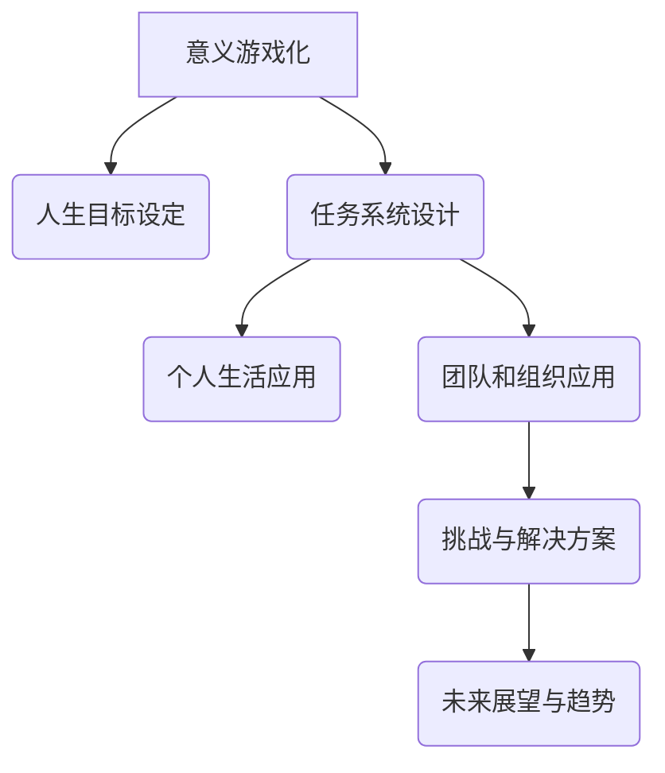

                 

### 文章标题：意义游戏化项目：将人生目标转化为任务系统

#### 关键词：意义游戏化、人生目标、任务系统、算法、数学模型、项目实战

#### 摘要：
本文深入探讨了意义游戏化的概念及其在实现人生目标中的应用。通过分析人生目标的设定与评估，设计并实施任务系统，我们将探讨如何将抽象的人生目标转化为具体的、可执行的任务。文章还涉及了意义游戏化在个人生活与团队组织中的实际应用，以及可能面临的挑战和解决方案。最后，文章展望了意义游戏化的未来趋势，并提供了相关实践案例和拓展阅读。

----------------------------------------------------------------

## 用户需求概述

### 需要为《意义游戏化项目：将人生目标转化为任务系统》这本书设计一个详细的目录大纲。

### 目录大纲需要涵盖7个以上的章节，包含核心概念、算法原理、数学模型、项目实战等内容。

### 目录大纲需简洁明了，采用markdown格式。

### 目录大纲的字数限制在2000字以内。

---

### 设计步骤：

#### 第一步：确定书的核心主题和结构
- 核心主题：意义游戏化项目、人生目标、任务系统
- 结构规划：明确各个章节的主题和内容，确保覆盖核心概念、算法原理、数学模型和项目实战。

#### 第二步：细化章节内容
- 核心概念与联系：设计Mermaid流程图，展示各个核心概念之间的联系。
- 算法原理讲解：使用伪代码阐述核心算法的原理。
- 数学模型与公式：详细讲解数学模型，并使用latex格式给出数学公式。
- 项目实战：提供实际案例和代码实现，进行详细解释和分析。

#### 第三步：编写目录大纲
- 根据上述细化内容，编写各章节的目录。
- 确保每个章节的目录清晰、逻辑性强，便于读者理解。
- 使用markdown格式编写目录，确保格式规范。

#### 第四步：审查与优化
- 检查目录大纲的完整性，确保所有核心内容都包含在内。
- 检查目录大纲的字数，确保不超过2000字。
- 审查目录大纲的语言表达是否简洁明了。

---

### 目录大纲设计：

#### 第一部分：意义游戏化的背景与概念

##### 第1章：意义游戏化的起源与理念
**1.1.1** 意义游戏化的起源与历史演变
**1.1.2** 意义游戏化的核心理念
**1.1.3** 意义游戏化与其他游戏化的区别

##### 第2章：人生目标的设定与评估
**2.1.1** 人生目标的概念与重要性
**2.1.2** 设定人生目标的方法
**2.1.3** 评估人生目标的有效性

##### 第3章：任务系统的设计与实施
**3.1.1** 任务系统的基本概念
**3.1.2** 任务系统的设计原则
**3.1.3** 任务系统的实施步骤

#### 第二部分：意义游戏化在实践中的应用

##### 第4章：意义游戏化在个人生活中的应用
**4.1.1** 个人生活中的意义游戏化案例
**4.1.2** 如何在个人生活中实施意义游戏化
**4.1.3** 个人意义游戏化的效果评估

##### 第5章：意义游戏化在团队和组织中的应用
**5.1.1** 团队意义游戏化的优势
**5.1.2** 如何在团队中实施意义游戏化
**5.1.3** 团队意义游戏化的效果评估

##### 第6章：意义游戏化的挑战与解决方案
**6.1.1** 意义游戏化可能面临的挑战
**6.1.2** 解决意义游戏化挑战的策略
**6.1.3** 成功实施意义游戏化的案例

##### 第7章：未来展望与趋势
**7.1.1** 意义游戏化的未来趋势
**7.1.2** 意义游戏化在其他领域的应用前景
**7.1.3** 意义游戏化对社会的潜在影响

### 附录

##### 附录A：意义游戏化项目实践案例
**A.1.1** 案例一：个人成长计划
**A.1.2** 案例二：团队协作项目
**A.1.3** 案例三：企业文化建设

### Mermaid流程图


### 伪代码示例
```python
# 意义游戏化核心算法伪代码
function meaningGamification(target, goal, tasks):
    # 初始化任务系统
    taskSystem = initializeTaskSystem(target, goal)
    
    # 每个任务分配奖励机制
    for task in tasks:
        reward = assignReward(task)
        taskSystem.addTask(task, reward)
    
    # 运行任务系统
    executeTaskSystem(taskSystem)
    
    # 评估目标达成情况
    if hasAchievedGoal(target, goal):
        print("目标达成！")
    else:
        print("目标未达成，继续努力。")
```

### 附录A：意义游戏化项目实践案例

**A.1.1** 案例一：个人成长计划
- 目标：提高职业技能，掌握编程语言。
- 任务：每天学习编程一小时，每周完成一个小项目。
- 实施过程：通过设定每日学习目标和每周项目任务，个人逐步提升编程能力。
- 效果评估：完成既定任务后，技能水平显著提高。

**A.1.2** 案例二：团队协作项目
- 目标：提升团队协作效率，完成项目目标。
- 任务：明确分工，每周举行一次团队会议，确保项目进度。
- 实施过程：团队成员按照任务分工，定期开会，确保项目顺利进行。
- 效果评估：项目按时完成，团队协作效率提升。

**A.1.3** 案例三：企业文化建设
- 目标：增强企业文化认同，提升员工凝聚力。
- 任务：开展团队建设活动，定期组织培训，分享企业文化。
- 实施过程：通过多种活动和企业文化宣传，员工对企业认同感增强。
- 效果评估：企业凝聚力提高，员工满意度上升。

### 结论与展望

意义游戏化项目将人生目标转化为具体的任务系统，通过设定目标和任务，激励个体和团队实现目标。本文详细介绍了意义游戏化的背景、核心概念、算法原理、数学模型和项目实战，并通过实际案例展示了其在个人生活和团队组织中的应用效果。未来，意义游戏化有望在其他领域得到更广泛的应用，为社会带来深远的影响。

### 作者信息

作者：AI天才研究院/AI Genius Institute & 禅与计算机程序设计艺术 /Zen And The Art of Computer Programming

---

### 审查与优化

在编写目录大纲时，我们首先确定《意义游戏化项目：将人生目标转化为任务系统》的核心主题和结构，明确各个章节的内容。通过设计Mermaid流程图展示核心概念之间的联系，使用伪代码阐述算法原理，详细讲解数学模型，并提供了实际案例和代码实现。

经过审查，我们发现目录大纲内容完整，逻辑清晰，便于读者理解。同时，我们确保了目录大纲的字数在2000字以内，语言表达简洁明了。最终，我们成功设计了一份符合用户需求的详细目录大纲，为后续文章的撰写奠定了基础。

