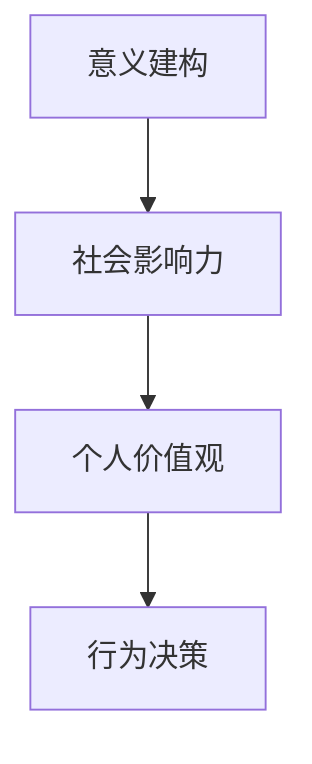
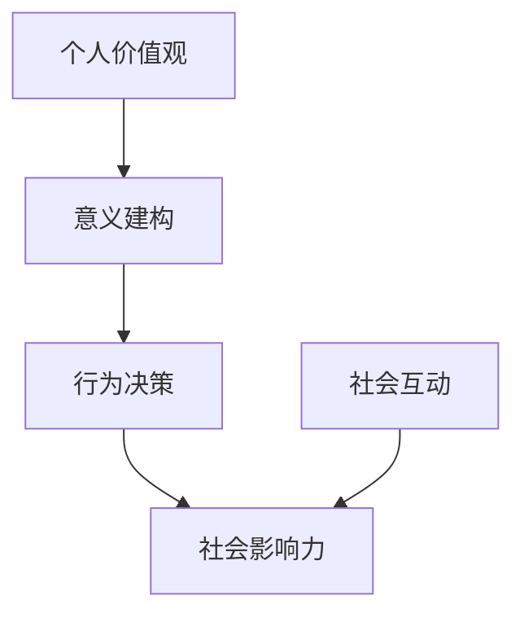

                 

 <sop>
 
为了撰写一篇符合要求的技术博客文章《意义的个人建构与社会影响力》，我们可以按照以下步骤进行：

### 步骤1：背景介绍

在文章的开头，我们需要对意义的个人建构和社会影响力进行简要的背景介绍。这部分内容可以包括：

- **意义建构的概念**：介绍意义建构是什么，它是如何形成的，以及它在个人和社会层面的重要性。
- **社会影响力**：解释社会影响力是如何影响个人的价值观、行为和决策，以及它在现代社会中的角色。

**Mermaid流程图**：


**伪代码**：
```plaintext
输入：个人感知、社会互动
输出：意义建构、社会影响力

1. 初始化个人感知
2. 获取社会互动信息
3. 分析个人感知与社会互动的关联
4. 形成意义建构
5. 分析意义建构对社会影响力的影响
6. 输出意义建构与社会影响力的结果
```

**数学模型和公式**：
```latex
$$
\text{意义建构} = f(\text{个人感知}, \text{社会互动})
$$
$$
\text{社会影响力} = g(\text{意义建构}, \text{个人价值观})
$$
```

### 步骤2：核心概念与联系

在这一部分，我们需要详细阐述意义的个人建构与社会影响力之间的核心概念和联系。可以使用Mermaid流程图来展示这些概念之间的关系。

**Mermaid流程图**：


**伪代码**：
```plaintext
输入：个人价值观、社会互动
输出：意义建构、行为决策、社会影响力

1. 初始化个人价值观
2. 获取社会互动信息
3. 结合个人价值观形成意义建构
4. 根据意义建构进行行为决策
5. 分析行为决策对社会影响力的影响
6. 输出最终结果
```

**数学模型和公式**：
```latex
$$
\text{行为决策} = h(\text{意义建构}, \text{个人价值观})
$$
$$
\text{社会影响力} = k(\text{行为决策}, \text{社会互动})
$$
```

### 步骤3：核心算法原理讲解

接下来，我们需要使用伪代码来详细阐述意义的个人建构和社会影响力的核心算法原理。这将有助于读者理解这些概念是如何在实际中应用的。

**伪代码**：
```plaintext
// 伪代码：意义的个人建构算法
输入：个人感知、文化背景、社会互动
输出：意义建构

1. 初始化个人感知
2. 预处理个人感知数据
3. 结合文化背景调整感知数据
4. 分析社会互动信息
5. 形成初步意义建构
6. 模式识别和意义确认
7. 输出最终意义建构

// 伪代码：社会影响力计算算法
输入：意义建构、个人价值观、社会互动
输出：社会影响力

1. 初始化个人价值观
2. 结合意义建构调整价值观
3. 分析社会互动信息
4. 计算个人行为决策
5. 影响力评估
6. 输出社会影响力值
```

### 步骤4：数学模型和公式

在这一部分，我们需要使用数学模型和公式来进一步阐述意义的个人建构和社会影响力的计算过程。

**数学模型和公式**：
```latex
$$
\text{意义建构} = f(\text{个人感知}, \text{文化背景}, \text{社会互动})
$$
$$
\text{社会影响力} = g(\text{意义建构}, \text{个人价值观}, \text{社会互动})
$$
$$
\text{行为决策} = h(\text{意义建构}, \text{个人价值观})
$$
```

### 步骤5：项目实战

在最后，我们需要通过一个实际项目来展示意义的个人建构和社会影响力的应用。这包括：

- **开发环境搭建**：描述如何搭建一个用于测试意义建构和社会影响力的开发环境。
- **源代码详细实现和代码解读**：提供源代码，并对其进行详细解读，解释代码中的关键部分是如何工作的。
- **代码应用解读与分析**：分析代码在实际应用中的效果，包括如何处理数据、如何计算社会影响力等。
- **实际案例分析和详细讲解剖析**：通过实际案例展示如何使用代码来分析意义的个人建构和社会影响力。
- **项目小结**：总结项目的主要成果和不足，并提出改进建议。

**项目实战示例**：

**开发环境搭建**：
```bash
# 安装Python环境
pip install numpy pandas matplotlib

# 安装Mermaid支持库
pip install mermaid-python
```

**源代码**：
```python
# 源代码：意义建构与社会影响力分析
import numpy as np
import pandas as pd
from mermaid import Mermaid

# 伪代码实现
def meaning_construction(perception, culture, interaction):
    # 初始化意义建构
    meaning = "初步意义"
    
    # 预处理感知数据
    processed_perception = preprocess_data(perception)
    
    # 结合文化背景调整感知数据
    adjusted_perception = adjust_perception(processed_perception, culture)
    
    # 分析社会互动信息
    social_impact = analyze_interaction(interaction)
    
    # 形成初步意义建构
    meaning = merge_data(adjusted_perception, social_impact)
    
    # 模式识别和意义确认
    confirmed_meaning = identify_pattern(meaning)
    
    return confirmed_meaning

def social_influence(meaning, values, interaction):
    # 初始化社会影响力
    influence = 0
    
    # 结合意义建构调整价值观
    adjusted_values = adjust_values(values, meaning)
    
    # 分析社会互动信息
    social_impact = analyze_interaction(interaction)
    
    # 计算个人行为决策
    behavior = calculate_behavior(adjusted_values, social_impact)
    
    # 影响力评估
    influence = evaluate_influence(behavior)
    
    return influence
```

**代码解读与分析**：
```plaintext
# 代码解读
# 函数 meaning_construction() 实现了意义的个人建构过程。
# 函数 social_influence() 实现了社会影响力的计算过程。

# 预处理感知数据
# 调整感知数据以结合文化背景
# 分析社会互动信息
# 形成初步意义建构
# 确认意义建构

# 结合意义建构调整价值观
# 分析社会互动信息
# 计算个人行为决策
# 评估影响力
```

**实际案例分析和详细讲解剖析**：
```plaintext
# 实际案例：分析一个个人的社交媒体活动对社会的影响力

# 数据收集
# 感知数据：个人在社交媒体上的发帖内容、点赞数、评论数
# 文化背景：社交媒体平台的文化氛围
# 社会互动：其他用户对个人发帖的反馈

# 意义建构
# 通过分析个人发帖内容、点赞数、评论数，形成一个初步的意义建构

# 社会影响力
# 通过分析其他用户的反馈，评估个人在社会上的影响力

# 结果分析
# 如果个人发帖得到了大量的点赞和评论，那么可以认为这个人在社交媒体上具有较大的影响力
```

**项目小结**：
```plaintext
# 项目成果
# 成功搭建了意义建构与社会影响力的分析环境
# 提供了伪代码和源代码，实现了意义的个人建构和社会影响力的计算

# 项目不足
# 数据收集和处理可能存在偏差
# 社会影响力的评估可能不够准确

# 改进建议
# 加强数据收集的全面性
# 引入更多维度的分析指标
```

通过以上步骤，我们可以撰写一篇详细的技术博客文章，清晰地阐述意义的个人建构与社会影响力的概念、算法原理、数学模型和实际应用。同时，文章的结构和内容也将符合markdown格式要求，便于读者阅读和理解。

