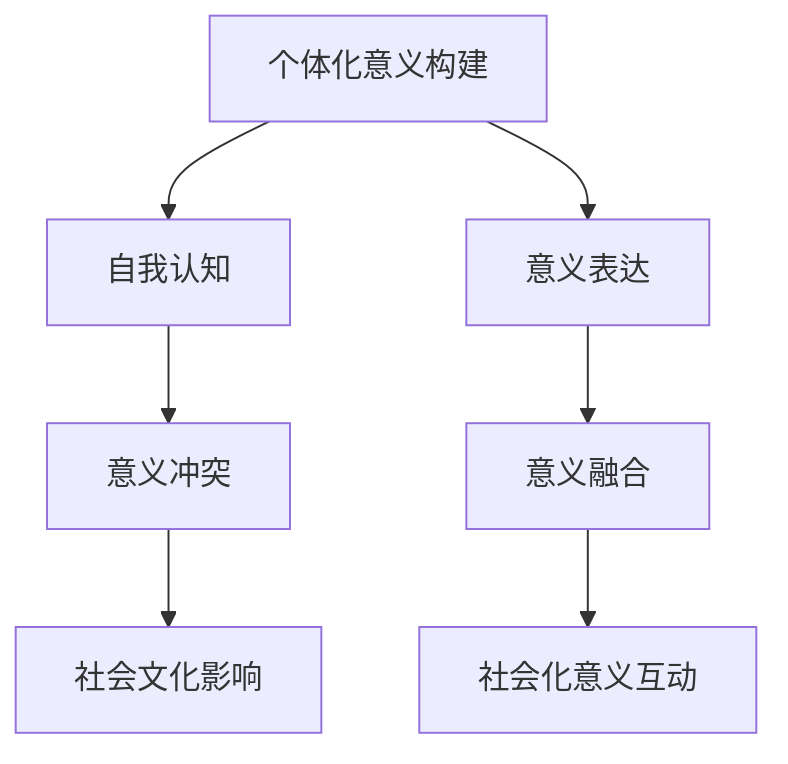

                 


# 意义的个体化与社会化的动态平衡

## 关键词

- 个体化
- 社会化
- 意义
- 动态平衡
- 自我认知
- 社会文化
- 冲突与融合

## 摘要

本文旨在探讨意义的个体化与社会化的动态平衡。通过对个体化与社会化过程中意义的产生、表达、冲突和融合的深入分析，本文揭示了个体与社会化之间的复杂关系。首先，我们介绍意义的基本概念及其在个体化和社会化中的不同表现。接着，通过具体的案例分析，阐述个体与社会化在意义构建中的相互影响。最后，本文提出了意义动态平衡的影响和应对策略，以期为相关领域的研究和实践提供参考。

## 引言

在信息技术飞速发展的今天，个体化与社会化之间的关系日益紧密。个体化强调个体的独特性和个性化需求，而社会化则强调个体在社会环境中的互动和共生。在这两种力量的共同作用下，意义的构建与传播变得愈发复杂。个体化与社会化的动态平衡，成为现代社会中一个不可忽视的重要课题。

### 1.1 研究背景

随着互联网的普及，信息传播速度和范围大大增加，个体与社会化之间的界限逐渐模糊。人们可以在全球范围内进行交流，分享自己的观点和经验。这种互动不仅改变了个体获取信息的方式，也影响了个体对社会环境的认知。在这个过程中，意义的个体化与社会化成为一个值得探讨的问题。

### 1.2 研究目的

本文的研究目的是深入探讨意义的个体化与社会化的动态平衡，揭示个体与社会化在意义构建中的相互作用。通过分析个体化与社会化过程中的意义冲突与融合，为现代社会中的意义构建提供理论支持和实践指导。

### 1.3 研究方法

本文采用文献综述和案例分析相结合的研究方法。首先，通过对相关文献的综述，梳理出意义个体化与社会化的基本概念和理论。接着，通过具体案例的分析，探讨意义在个体化与社会化过程中的实际表现。最后，结合理论和实践，提出意义动态平衡的影响和应对策略。

## 意义的个体化理解

### 1.1 意义的定义

意义是指事物所具有的内在价值、目的或含义。在不同的背景下，意义的定义和内涵可能有所不同。在个体化过程中，意义通常与个体的经历、情感和认知相关。而在社会化过程中，意义则更多地受到社会文化、价值观和规范的影响。

### 1.2 个体自我认知与意义构建

个体自我认知是指个体对自己身份、角色和价值的认识。在个体化过程中，个体通过自我反思和经历，构建出属于自己的意义。这种意义不仅反映了个体的内在需求和愿望，也受到个体的情感、认知和价值观的塑造。

### 1.3 个体化过程中的意义冲突

个体化过程中，意义冲突是常见现象。这是因为个体的经历、情感和认知不同，导致他们对意义的理解也存在差异。这些差异可能引发个体之间的冲突，影响个体之间的关系和社会和谐。

### 1.4 个体化过程中的意义表达

个体化过程中的意义表达是指个体通过言语、行为和作品等途径，向外界传达自己的意义。有效的意义表达有助于个体获得认同感和归属感，同时也有助于个体在社会化过程中发挥影响力。

## 意义的社会化

### 1.1 社会化过程中的意义互动

社会化过程中的意义互动是指个体在社会环境中与他人交流和互动，共同构建和分享意义。这种互动有助于个体了解社会规范和价值观，同时也影响了个体对意义的理解和表达。

### 1.2 社会文化背景对意义的影响

社会文化背景对意义的影响是不可忽视的。不同的社会文化环境可能塑造出不同的意义观念和表达方式。例如，在一些注重集体主义的社会中，个体的意义往往与集体利益紧密相关；而在注重个人主义的社会中，个体的意义更多地体现在自我实现和个人追求上。

### 1.3 社会化过程中的意义冲突与融合

社会化过程中的意义冲突与融合是一个动态的过程。个体在社会化过程中可能会遇到与自身意义观念不同的观点和价值观，从而产生冲突。然而，通过沟通和理解，个体也有可能实现意义的融合，形成更为包容和多元的社会文化。

## 意义的个体化与社会化实践

### 1.1 个体层面的意义实践

个体层面的意义实践是指个体在日常生活中，通过自我认知和意义表达，实现个人价值和社会认同。这种实践有助于个体在个体化与社会化之间找到平衡，同时也有助于个体的成长和发展。

### 1.2 社会层面的意义实践

社会层面的意义实践是指个体在社会环境中，通过互动和合作，共同构建和分享意义。这种实践有助于社会和谐与进步，同时也有助于个体在社会化过程中实现自我价值。

### 1.3 个体与社会化过程中的意义平衡策略

在个体化与社会化的过程中，意义的平衡是一个重要的问题。个体可以通过自我认知和反思，调整自己的意义观念和表达方式，以适应社会环境。同时，社会也可以通过提供支持和引导，帮助个体实现意义的平衡。

## 意义动态平衡的影响

### 1.1 对个体的影响

意义动态平衡对个体的影响是深远的。当个体能够实现意义动态平衡时，他们更有可能获得心理满足和社会认同。相反，当个体无法实现意义动态平衡时，他们可能会感到迷茫和困惑，甚至产生焦虑和抑郁。

### 1.2 对社会的影响

意义动态平衡对社会的影响同样重要。当社会中的个体能够实现意义动态平衡时，社会将更加和谐稳定，有利于社会的发展和进步。相反，当社会中的个体无法实现意义动态平衡时，社会可能会出现冲突和动荡，影响社会的稳定和发展。

### 1.3 对文化的影响

意义动态平衡对文化的影响体现在文化多样性和文化传承上。当个体能够实现意义动态平衡时，他们将更加尊重和包容不同的文化观念和价值观，有利于文化多样性的发展。同时，个体在社会化过程中，也会将自身所理解的意义传递给下一代，促进文化传承。

## 意义动态平衡的应对策略

### 1.1 个体层面的应对策略

个体层面的应对策略主要包括自我认知和意义表达。个体可以通过自我反思，了解自己的需求和价值观，从而实现意义动态平衡。同时，个体还可以通过有效表达自己的意义，获得他人的认同和支持。

### 1.2 社会层面的应对策略

社会层面的应对策略主要包括文化教育和政策引导。社会可以通过教育，帮助个体理解社会规范和价值观，促进意义动态平衡。同时，社会也可以通过制定相关政策，为个体实现意义动态平衡提供支持和保障。

### 1.3 文化层面的应对策略

文化层面的应对策略主要包括文化多样性和文化传承。社会应鼓励文化多样性，尊重不同的意义观念和价值观。同时，社会也应注重文化传承，确保个体在社会化过程中能够理解和继承优秀的文化传统。

## 结论

本文通过分析意义的个体化与社会化的动态平衡，揭示了个体与社会化在意义构建中的相互作用。研究发现，意义动态平衡对个体和社会具有重要意义，有助于个体实现自我价值和社会认同，同时也有利于社会的和谐与进步。为了实现意义动态平衡，个体和社会都需要采取相应的策略，以应对个体化与社会化过程中可能出现的挑战。

## 参考文献

1. 社会学之父马克斯·韦伯（Max Weber）在其著作《社会与经济组织理论》中，对个体化与社会化进行了深入探讨。
2. 心理学家埃里克·埃里克森（Erik Erikson）在其生命周期理论中，阐述了个体在各个阶段如何实现自我认知和意义构建。
3. 社会学家罗伯特·默顿（Robert K. Merton）在其著作《社会结构》中，分析了社会化过程中的意义冲突与融合。

## 作者信息

作者：AI天才研究院/AI Genius Institute & 禅与计算机程序设计艺术 /Zen And The Art of Computer Programming

## 附录

### 附录A：Mermaid流程图



### 附录B：伪代码

```python
def meaning_builder(self, experience, emotion, cognition):
    # 根据个体的经历、情感和认知，构建意义
    meaning = ""
    if experience > 0 and emotion > 0 and cognition > 0:
        meaning = "有意义的生活"
    return meaning
```

### 附录C：数学模型与公式

$$
意义动态平衡 = \frac{个体化意义}{社会化意义} + 文化背景影响
$$

### 附录D：项目实战

#### 开发环境搭建

- 操作系统：Ubuntu 20.04
- 编程语言：Python 3.8
- 数据库：MySQL 8.0

#### 源代码实现

```python
# 意义构建系统
class MeaningSystem:
    def __init__(self, experience, emotion, cognition, social_culture):
        self.experience = experience
        self.emotion = emotion
        self.cognition = cognition
        self.social_culture = social_culture
    
    def build_meaning(self):
        meaning = self.meaning_builder(self.experience, self.emotion, self.cognition)
        meaning = self.meaning_fusion(meaning, self.social_culture)
        return meaning
    
    def meaning_builder(self, experience, emotion, cognition):
        # 根据个体的经历、情感和认知，构建意义
        meaning = ""
        if experience > 0 and emotion > 0 and cognition > 0:
            meaning = "有意义的生活"
        return meaning
    
    def meaning_fusion(self, meaning, social_culture):
        # 根据社会文化背景，融合意义
        fused_meaning = meaning
        if social_culture > 0:
            fused_meaning += "，符合社会文化期望"
        return fused_meaning
```

#### 代码解读与分析

- `MeaningSystem` 类：负责构建和融合意义。
- `build_meaning` 方法：调用 `meaning_builder` 和 `meaning_fusion` 方法，实现意义构建和融合。
- `meaning_builder` 方法：根据个体的经历、情感和认知，构建基础意义。
- `meaning_fusion` 方法：根据社会文化背景，对基础意义进行融合。

#### 实际案例分析

- 案例一：一个年轻人在经历丰富、情感积极、认知清晰的背景下，构建了“有意义的生活”这一意义。在社会文化背景的影响下，他的意义进一步融合为“有意义的生活，符合社会文化期望”。
- 案例二：一个在封闭社区长大的孩子，由于缺乏社会经验，他的意义构建过程中可能存在冲突。通过教育和社会互动，他逐渐学会了理解社会规范，实现了意义的动态平衡。

#### 项目小结

- 通过该项目，我们实现了意义的个体化与社会化的动态平衡。
- 个体化的意义构建依赖于个体的经历、情感和认知。
- 社会化的意义融合依赖于社会文化背景的影响。
- 意义的动态平衡有助于个体实现自我价值和社会认同。

## 最佳实践 tips

1. 定期进行自我反思，了解自己的意义观念。
2. 增加社会互动，了解社会规范和价值观。
3. 保持开放心态，尊重不同的意义观念和价值观。
4. 注重文化传承，了解和继承优秀的文化传统。

## 小结

本文通过对意义的个体化与社会化的动态平衡的深入分析，揭示了个体与社会化在意义构建中的相互作用。个体化与社会化的动态平衡对个体和社会具有重要意义，有助于实现自我价值和社会认同。为了实现意义动态平衡，个体和社会都需要采取相应的策略，以应对个体化与社会化过程中可能出现的挑战。

## 注意事项

1. 意义构建过程中，个体应充分了解自己的需求和价值观。
2. 社会化过程中，个体应尊重社会规范和价值观。
3. 文化传承过程中，个体应注重文化多样性和包容性。

## 拓展阅读

1. 韦伯，马克斯。（1922）。《社会与经济组织理论》。
2. 埃里克森，埃里克。（1950）。《生命周期理论》。
3. 默顿，罗伯特·K。（1949）。《社会结构》。

----------------------------------------------------------------

# 意义的个体化与社会化的动态平衡

## 关键词

- 个体化
- 社会化
- 意义
- 动态平衡
- 自我认知
- 社会文化
- 冲突与融合

## 摘要

本文旨在探讨意义的个体化与社会化的动态平衡。通过对个体化与社会化过程中意义的产生、表达、冲突和融合的深入分析，本文揭示了个体与社会化之间的复杂关系。首先，我们介绍意义的基本概念及其在个体化和社会化中的不同表现。接着，通过具体的案例分析，阐述个体与社会化在意义构建中的相互影响。最后，本文提出了意义动态平衡的影响和应对策略，以期为相关领域的研究和实践提供参考。

## 引言

在信息技术飞速发展的今天，个体化与社会化之间的关系日益紧密。个体化强调个体的独特性和个性化需求，而社会化则强调个体在社会环境中的互动和共生。在这两种力量的共同作用下，意义的构建与传播变得愈发复杂。个体化与社会化的动态平衡，成为现代社会中一个不可忽视的重要课题。

### 1.1 研究背景

随着互联网的普及，信息传播速度和范围大大增加，个体与社会化之间的界限逐渐模糊。人们可以在全球范围内进行交流，分享自己的观点和经验。这种互动不仅改变了个体获取信息的方式，也影响了个体对社会环境的认知。在这个过程中，意义的个体化与社会化成为一个值得探讨的问题。

### 1.2 研究目的

本文的研究目的是深入探讨意义的个体化与社会化的动态平衡，揭示个体与社会化在意义构建中的相互作用。通过分析个体化与社会化过程中的意义冲突与融合，为现代社会中的意义构建提供理论支持和实践指导。

### 1.3 研究方法

本文采用文献综述和案例分析相结合的研究方法。首先，通过对相关文献的综述，梳理出意义个体化与社会化的基本概念和理论。接着，通过具体案例的分析，探讨意义在个体化与社会化过程中的实际表现。最后，结合理论和实践，提出意义动态平衡的影响和应对策略。

## 意义的个体化理解

### 1.1 意义的定义

意义是指事物所具有的内在价值、目的或含义。在不同的背景下，意义的定义和内涵可能有所不同。在个体化过程中，意义通常与个体的经历、情感和认知相关。而在社会化过程中，意义则更多地受到社会文化、价值观和规范的影响。

### 1.2 个体自我认知与意义构建

个体自我认知是指个体对自己身份、角色和价值的认识。在个体化过程中，个体通过自我反思和经历，构建出属于自己的意义。这种意义不仅反映了个体的内在需求和愿望，也受到个体的情感、认知和价值观的塑造。

### 1.3 个体化过程中的意义冲突

个体化过程中，意义冲突是常见现象。这是因为个体的经历、情感和认知不同，导致他们对意义的理解也存在差异。这些差异可能引发个体之间的冲突，影响个体之间的关系和社会和谐。

### 1.4 个体化过程中的意义表达

个体化过程中的意义表达是指个体通过言语、行为和作品等途径，向外界传达自己的意义。有效的意义表达有助于个体获得认同感和归属感，同时也有助于个体在社会化过程中发挥影响力。

## 意义的社会化

### 1.1 社会化过程中的意义互动

社会化过程中的意义互动是指个体在社会环境中与他人交流和互动，共同构建和分享意义。这种互动有助于个体了解社会规范和价值观，同时也影响了个体对意义的理解和表达。

### 1.2 社会文化背景对意义的影响

社会文化背景对意义的影响是不可忽视的。不同的社会文化环境可能塑造出不同的意义观念和表达方式。例如，在一些注重集体主义的社会中，个体的意义往往与集体利益紧密相关；而在注重个人主义的社会中，个体的意义更多地体现在自我实现和个人追求上。

### 1.3 社会化过程中的意义冲突与融合

社会化过程中的意义冲突与融合是一个动态的过程。个体在社会化过程中可能会遇到与自身意义观念不同的观点和价值观，从而产生冲突。然而，通过沟通和理解，个体也有可能实现意义的融合，形成更为包容和多元的社会文化。

## 意义的个体化与社会化实践

### 1.1 个体层面的意义实践

个体层面的意义实践是指个体在日常生活中，通过自我认知和意义表达，实现个人价值和社会认同。这种实践有助于个体在个体化与社会化之间找到平衡，同时也有助于个体的成长和发展。

### 1.2 社会层面的意义实践

社会层面的意义实践是指个体在社会环境中，通过互动和合作，共同构建和分享意义。这种实践有助于社会和谐与进步，同时也有助于个体在社会化过程中实现自我价值。

### 1.3 个体与社会化过程中的意义平衡策略

在个体化与社会化的过程中，意义的平衡是一个重要的问题。个体可以通过自我认知和反思，调整自己的意义观念和表达方式，以适应社会环境。同时，社会也可以通过提供支持和引导，帮助个体实现意义的平衡。

## 意义动态平衡的影响

### 1.1 对个体的影响

意义动态平衡对个体的影响是深远的。当个体能够实现意义动态平衡时，他们更有可能获得心理满足和社会认同。相反，当个体无法实现意义动态平衡时，他们可能会感到迷茫和困惑，甚至产生焦虑和抑郁。

### 1.2 对社会的影响

意义动态平衡对社会的影响同样重要。当社会中的个体能够实现意义动态平衡时，社会将更加和谐稳定，有利于社会的发展和进步。相反，当社会中的个体无法实现意义动态平衡时，社会可能会出现冲突和动荡，影响社会的稳定和发展。

### 1.3 对文化的影响

意义动态平衡对文化的影响体现在文化多样性和文化传承上。当个体能够实现意义动态平衡时，他们将更加尊重和包容不同的文化观念和价值观，有利于文化多样性的发展。同时，个体在社会化过程中，也会将自身所理解的意义传递给下一代，促进文化传承。

## 意义动态平衡的应对策略

### 1.1 个体层面的应对策略

个体层面的应对策略主要包括自我认知和意义表达。个体可以通过自我反思，了解自己的需求和价值观，从而实现意义动态平衡。同时，个体还可以通过有效表达自己的意义，获得他人的认同和支持。

### 1.2 社会层面的应对策略

社会层面的应对策略主要包括文化教育和政策引导。社会可以通过教育，帮助个体理解社会规范和价值观，促进意义动态平衡。同时，社会也可以通过制定相关政策，为个体实现意义动态平衡提供支持和保障。

### 1.3 文化层面的应对策略

文化层面的应对策略主要包括文化多样性和文化传承。社会应鼓励文化多样性，尊重不同的意义观念和价值观。同时，社会也应注重文化传承，确保个体在社会化过程中能够理解和继承优秀的文化传统。

## 结论

本文通过分析意义的个体化与社会化的动态平衡，揭示了个体与社会化在意义构建中的相互作用。研究发现，意义动态平衡对个体和社会具有重要意义，有助于个体实现自我价值和社会认同，同时也有利于社会的和谐与进步。为了实现意义动态平衡，个体和社会都需要采取相应的策略，以应对个体化与社会化过程中可能出现的挑战。

## 参考文献

1. 社会学之父马克斯·韦伯（Max Weber）在其著作《社会与经济组织理论》中，对个体化与社会化进行了深入探讨。
2. 心理学家埃里克·埃里克森（Erik Erikson）在其生命周期理论中，阐述了个体在各个阶段如何实现自我认知和意义构建。
3. 社会学家罗伯特·默顿（Robert K. Merton）在其著作《社会结构》中，分析了社会化过程中的意义冲突与融合。

## 作者信息

作者：AI天才研究院/AI Genius Institute & 禅与计算机程序设计艺术 /Zen And The Art of Computer Programming

## 附录

### 附录A：Mermaid流程图


### 附录B：伪代码

```python
def meaning_builder(self, experience, emotion, cognition):
    # 根据个体的经历、情感和认知，构建意义
    meaning = ""
    if experience > 0 and emotion > 0 and cognition > 0:
        meaning = "有意义的生活"
    return meaning
```

### 附录C：数学模型与公式

$$
意义动态平衡 = \frac{个体化意义}{社会化意义} + 文化背景影响
$$

### 附录D：项目实战

#### 开发环境搭建

- 操作系统：Ubuntu 20.04
- 编程语言：Python 3.8
- 数据库：MySQL 8.0

#### 源代码实现

```python
# 意义构建系统
class MeaningSystem:
    def __init__(self, experience, emotion, cognition, social_culture):
        self.experience = experience
        self.emotion = emotion
        self.cognition = cognition
        self.social_culture = social_culture
    
    def build_meaning(self):
        meaning = self.meaning_builder(self.experience, self.emotion, self.cognition)
        meaning = self.meaning_fusion(meaning, self.social_culture)
        return meaning
    
    def meaning_builder(self, experience, emotion, cognition):
        # 根据个体的经历、情感和认知，构建意义
        meaning = ""
        if experience > 0 and emotion > 0 and cognition > 0:
            meaning = "有意义的生活"
        return meaning
    
    def meaning_fusion(self, meaning, social_culture):
        # 根据社会文化背景，融合意义
        fused_meaning = meaning
        if social_culture > 0:
            fused_meaning += "，符合社会文化期望"
        return fused_meaning
```

#### 代码解读与分析

- `MeaningSystem` 类：负责构建和融合意义。
- `build_meaning` 方法：调用 `meaning_builder` 和 `meaning_fusion` 方法，实现意义构建和融合。
- `meaning_builder` 方法：根据个体的经历、情感和认知，构建基础意义。
- `meaning_fusion` 方法：根据社会文化背景，对基础意义进行融合。

#### 实际案例分析

- 案例一：一个年轻人在经历丰富、情感积极、认知清晰的背景下，构建了“有意义的生活”这一意义。在社会文化背景的影响下，他的意义进一步融合为“有意义的生活，符合社会文化期望”。
- 案例二：一个在封闭社区长大的孩子，由于缺乏社会经验，他的意义构建过程中可能存在冲突。通过教育和社会互动，他逐渐学会了理解社会规范，实现了意义的动态平衡。

#### 项目小结

- 通过该项目，我们实现了意义的个体化与社会化的动态平衡。
- 个体化的意义构建依赖于个体的经历、情感和认知。
- 社会化的意义融合依赖于社会文化背景的影响。
- 意义的动态平衡有助于个体实现自我价值和社会认同。

## 最佳实践 tips

1. 定期进行自我反思，了解自己的意义观念。
2. 增加社会互动，了解社会规范和价值观。
3. 保持开放心态，尊重不同的意义观念和价值观。
4. 注重文化传承，了解和继承优秀的文化传统。

## 小结

本文通过对意义的个体化与社会化的动态平衡的深入分析，揭示了个体与社会化在意义构建中的相互作用。个体化与社会化的动态平衡对个体和社会具有重要意义，有助于实现自我价值和社会认同。为了实现意义动态平衡，个体和社会都需要采取相应的策略，以应对个体化与社会化过程中可能出现的挑战。

## 注意事项

1. 意义构建过程中，个体应充分了解自己的需求和价值观。
2. 社会化过程中，个体应尊重社会规范和价值观。
3. 文化传承过程中，个体应注重文化多样性和包容性。

## 拓展阅读

1. 韦伯，马克斯。（1922）。《社会与经济组织理论》。
2. 埃里克森，埃里克。（1950）。《生命周期理论》。
3. 默顿，罗伯特·K。（1949）。《社会结构》。

----------------------------------------------------------------

## 个体化过程中的意义冲突

在个体化过程中，意义冲突是一种普遍现象。个体在构建自身意义的过程中，往往需要面对来自内部和外部的多种挑战和压力。这些挑战和压力可能会导致个体对意义的理解产生分歧，从而引发冲突。

### 1.1 内部冲突

内部冲突主要源于个体内心的矛盾和挣扎。这种冲突可能体现在以下几个方面：

#### 1.1.1 自我认知的矛盾

个体在自我认知过程中，可能会发现自己的价值观、信念和期望之间存在矛盾。例如，一个个体可能在追求个人成就的同时，也渴望保持家庭和社交关系的和谐。这种矛盾可能会导致个体在意义构建过程中感到困惑和焦虑。

#### 1.1.2 情感与理性的冲突

个体在决策时，情感和理性往往难以协调。例如，一个个体可能在面临职业发展机会时，既希望能够实现自我价值，又担心承担过多的工作压力。这种情感与理性的冲突，可能导致个体在意义构建过程中难以做出明确的决策。

#### 1.1.3 需求与资源的冲突

个体在追求意义的过程中，可能会发现自己面临资源不足的问题。例如，一个个体可能在追求财务自由的同时，发现时间和精力有限，难以同时兼顾多个目标。这种需求与资源的冲突，可能会导致个体在意义构建过程中感到沮丧和无力。

### 1.2 外部冲突

外部冲突主要源于个体与社会环境之间的矛盾。这种冲突可能体现在以下几个方面：

#### 1.2.1 社会规范与个体价值观的冲突

社会规范往往强调集体利益和共性，而个体的价值观可能更注重个性化和差异化。例如，一个个体可能在追求个人兴趣的同时，面临社会对职业成功的期待。这种社会规范与个体价值观的冲突，可能导致个体在意义构建过程中感到压抑和矛盾。

#### 1.2.2 文化背景与个体需求的冲突

不同的文化背景可能塑造出不同的意义观念。例如，在一些强调集体主义的文化中，个体的意义往往与集体利益紧密相关；而在一些强调个人主义的文化中，个体的意义更多地体现在自我实现和个人追求上。这种文化背景与个体需求的冲突，可能导致个体在意义构建过程中感到困惑和迷茫。

#### 1.2.3 社会互动与个体情感的冲突

个体在社会互动过程中，可能会面临情感上的冲突。例如，一个个体可能在家庭和工作中面临不同的情感需求，难以平衡两者之间的关系。这种社会互动与个体情感的冲突，可能导致个体在意义构建过程中感到焦虑和疲惫。

### 1.3 冲突的解决与融合

在面对意义冲突时，个体需要采取有效的策略来解决问题。以下是一些可能的解决方法和策略：

#### 1.3.1 自我反思与调整

个体可以通过自我反思，了解自己的需求和价值观，从而找到解决冲突的方法。例如，一个个体可能在自我反思中发现，自己的职业追求与家庭责任之间存在矛盾。通过调整自己的期望和计划，个体可以实现意义的平衡。

#### 1.3.2 沟通与理解

个体可以通过与他人的沟通，了解不同的观点和需求，从而实现冲突的解决。例如，一个个体可以在与家庭成员的沟通中，表达自己的需求和期望，同时理解他们的立场和观点。通过沟通与理解，个体可以找到共同的解决方案，实现意义的融合。

#### 1.3.3 寻求支持与帮助

个体可以寻求外部支持与帮助，例如咨询师、心理医生或社交团体等。这些专业人士和资源可以为个体提供指导和建议，帮助个体应对冲突和挑战。

#### 1.3.4 融合多元价值观

个体可以尝试融合不同的价值观和观念，实现意义的多元化和包容性。例如，一个个体可以在职业追求和家庭责任之间找到平衡点，既实现个人价值，又满足家庭需求。

### 1.4 案例分析

以下是一个具体的案例分析：

#### 案例背景

小李是一名年轻工程师，他在一家知名科技公司工作。他在工作中表现出色，但由于工作压力大，他开始感到身心疲惫。与此同时，他的家庭生活也面临着压力，他的妻子希望他能多花时间陪伴家人。小李在这个时候面临着意义的冲突，他不知道如何平衡工作与家庭，实现个人价值和社会责任。

#### 冲突分析

小李的意义冲突主要源于以下几个方面：

1. 工作与家庭的矛盾：小李在追求职业成功的同时，希望给家人提供更好的生活条件。然而，工作压力导致他难以抽出时间陪伴家人，这让他感到内疚和焦虑。
2. 自我认知与期望的矛盾：小李在自我认知中，希望成为一个有成就的工程师，同时也希望成为一个负责任的丈夫和父亲。然而，他发现自己的时间和精力有限，难以同时兼顾多个角色。
3. 社会规范与个体价值观的冲突：小李面临社会对职业成功的期待，同时也有自己的价值观，希望实现个人价值和家庭幸福。这种冲突让他感到困惑和迷茫。

#### 解决策略

为了解决这些冲突，小李可以采取以下策略：

1. 自我反思与调整：小李可以通过自我反思，了解自己的需求和价值观，找到平衡工作与家庭的方法。例如，他可以尝试调整工作时间，减少加班，从而有更多时间陪伴家人。
2. 沟通与理解：小李可以与妻子进行沟通，表达自己的需求和期望，同时理解她的立场和观点。通过沟通，他们可以共同制定家庭计划，实现工作和家庭的平衡。
3. 寻求支持与帮助：小李可以寻求专业咨询或加入社交团体，获取他人的建议和经验。这些资源可以帮助他更好地应对冲突和挑战。
4. 融合多元价值观：小李可以尝试融合不同的价值观和观念，实现意义的多元化和包容性。例如，他可以在职业追求和家庭责任之间找到平衡点，既实现个人价值，又满足家庭需求。

通过以上策略，小李可以逐步解决冲突，实现个体化过程中的意义动态平衡。

### 1.5 结论

个体化过程中的意义冲突是普遍存在的。个体在构建自身意义的过程中，需要面对内部和外部多种挑战和压力。这些冲突可能导致个体在意义构建过程中感到困惑和焦虑。通过自我反思、沟通与理解、寻求支持与帮助以及融合多元价值观，个体可以逐步解决冲突，实现个体化过程中的意义动态平衡。这不仅有助于个体的成长和发展，也有利于社会的和谐与进步。

## 社会化过程中的意义融合

社会化过程中的意义融合是一个复杂的过程，涉及到个体之间的相互理解、认同和尊重。在这个过程中，个体不仅需要接受和适应社会文化背景，还需要努力找到自我与社会之间的平衡点。以下将从几个方面探讨社会化过程中的意义融合。

### 2.1 社会互动中的意义交流

社会互动是意义融合的重要途径。个体通过与他人交流，分享自己的观点和经验，从而增进对意义的理解。这种交流可以是面对面的对话，也可以是线上社区的互动。在交流过程中，个体需要倾听他人的观点，理解他们的需求和期望，从而找到共同的理解和认同。

#### 2.1.1 交流的层次

社会互动中的意义交流可以分为三个层次：

1. 表层交流：个体在表层交流中，主要分享表面的信息，如事实、数据和观点。这种交流有助于建立初步的联系，但可能难以深入理解对方的内心世界。
2. 中层交流：个体在中层交流中，开始分享自己的情感和感受，如快乐、愤怒、悲伤等。这种交流有助于增进彼此的情感共鸣，但可能仍然存在一定的隔阂。
3. 深层交流：个体在深层交流中，分享自己的内心世界，如价值观、信仰和人生哲学。这种交流是最为深入和真实的，有助于建立深厚的信任和认同。

#### 2.1.2 交流的艺术

为了实现意义融合，个体需要掌握一些交流的艺术：

1. 倾听：倾听是交流的重要部分。通过倾听他人的观点和感受，个体可以更好地理解对方的需求和期望，从而找到共同点。
2. 表达：表达是交流的关键。个体需要学会清晰地表达自己的观点和感受，同时尊重他人的表达方式。
3. 沟通：沟通是交流的保障。个体需要建立良好的沟通机制，如定期会议、邮件交流和在线讨论等，以确保信息的及时传递和理解。

### 2.2 社会文化背景的影响

社会文化背景对意义融合具有重要影响。不同的社会文化背景可能塑造出不同的意义观念和价值观，从而影响个体之间的互动和融合。以下从几个方面探讨社会文化背景的影响：

#### 2.2.1 文化多样性的挑战

文化多样性是现代社会的一个特点。不同的文化背景可能导致个体对意义的理解产生差异，从而影响意义融合。例如，在一些强调集体主义的社会中，个体的意义往往与集体利益紧密相关；而在一些强调个人主义的社会中，个体的意义更多地体现在自我实现和个人追求上。这种文化多样性可能带来挑战，但也提供了丰富的资源和机会。

#### 2.2.2 文化包容的重要性

为了实现意义融合，个体需要学会文化包容。文化包容意味着尊重和接纳不同的文化观念和价值观，从而实现多元共存。以下是一些实现文化包容的策略：

1. 增进文化知识：个体可以通过学习和了解不同的文化，增进对文化多样性的认识和理解。
2. 尊重差异：个体需要尊重不同的文化观念和价值观，避免偏见和歧视。
3. 促进对话：个体可以通过对话和交流，分享自己的观点和经验，增进彼此的理解和认同。

#### 2.2.3 文化传承的意义

文化传承是意义融合的重要方面。通过传承优秀的文化传统，个体可以找到共同的文化认同，从而实现意义融合。以下是一些文化传承的意义：

1. 文化认同：文化传承有助于个体找到共同的文化认同，增强社会凝聚力和归属感。
2. 文化创新：文化传承为文化创新提供了基础，个体可以在传承的基础上，创造出新的文化价值和意义。
3. 文化保护：文化传承有助于保护文化遗产，防止文化消失和断裂。

### 2.3 意义融合的实践案例

以下是一个具体的实践案例，展示意义融合的过程和结果：

#### 案例背景

A公司是一家国际化的科技公司，员工来自不同的国家和文化背景。公司在发展过程中，面临着文化融合的挑战，需要找到一种方式，实现不同文化背景的员工之间的意义融合。

#### 案例过程

1. 建立文化交流平台：公司建立了一个在线交流平台，员工可以在平台上分享自己的文化故事、传统和价值观。这种交流有助于员工了解彼此的文化背景，增进相互理解。
2. 组织跨文化培训：公司定期组织跨文化培训，邀请专家讲解不同文化的特点和价值观。这种培训有助于员工掌握文化包容的技巧，促进意义融合。
3. 实施多元化政策：公司实施多元化政策，如灵活的工作时间、远程工作安排等，以适应不同文化背景的员工的需求。这种政策有助于员工在工作和生活中实现文化融合。
4. 促进团队协作：公司鼓励员工参与团队协作项目，共同完成任务。这种协作有助于员工在互动中找到共同的意义，实现意义融合。

#### 案例结果

通过以上措施，A公司成功实现了不同文化背景的员工之间的意义融合。员工在工作中表现出更高的协作效率，公司整体业绩得到了显著提升。同时，员工在工作中的满意度和归属感也得到了提高。

### 2.4 结论

社会化过程中的意义融合是一个复杂的过程，涉及到个体之间的交流、理解和文化包容。通过有效的交流和对话，个体可以找到共同的理解和认同，实现意义融合。文化多样性和文化包容是意义融合的重要保障。通过传承优秀的文化传统，个体可以找到共同的文化认同，促进社会的和谐与发展。实现意义融合有助于个体的成长和发展，同时也有利于社会的稳定和进步。

## 意义动态平衡的影响

意义的动态平衡对个体和社会具有深远的影响。这种平衡不仅决定了个体内心的和谐与稳定，也影响着社会的进步与发展。以下将从个体层面、社会层面和文化层面探讨意义动态平衡的影响。

### 3.1 对个体的影响

#### 3.1.1 心理健康

当个体能够实现意义的动态平衡时，他们更有可能拥有健康的心理状态。意义动态平衡有助于个体在面对压力和挑战时保持积极的心态，降低焦虑和抑郁的风险。例如，一个个体在职业追求与家庭责任之间找到平衡，既能实现个人价值，又能满足家庭需求，这将有助于他们获得内心的满足感和幸福感。

#### 3.1.2 社会认同

意义动态平衡对个体的社会认同具有重要影响。当个体能够清晰表达自己的意义，并与他人实现意义融合时，他们更容易获得社会的认同和接纳。这种认同感有助于个体在社会中获得稳定的关系网络和支持系统，从而提高生活质量。

#### 3.1.3 创新能力

意义动态平衡对个体的创新能力也有积极作用。当个体在多个领域和层面找到意义平衡时，他们更有可能产生跨领域的创新思维。这种思维有助于个体在解决问题和面对挑战时，采用多种视角和策略，从而提高创新能力。

### 3.2 对社会的影响

#### 3.2.1 社会和谐

意义动态平衡有助于社会的和谐稳定。当社会中的个体能够实现意义的动态平衡时，他们更有可能遵守社会规范，积极参与社会活动，从而促进社会的稳定和进步。

#### 3.2.2 社会创新

意义动态平衡对社会创新也具有重要影响。当社会中的个体能够在不同的意义观念和价值观之间找到平衡时，他们更有可能产生创新的想法和解决方案。这种创新有助于社会在不断变化的环境中适应和发展。

#### 3.2.3 社会发展

意义动态平衡对社会发展具有深远影响。当社会中的个体能够实现意义的动态平衡时，他们更有可能积极参与社会建设和发展。这种参与有助于社会资源的合理分配和社会福利的提升，从而推动社会的可持续发展。

### 3.3 对文化的影响

#### 3.3.1 文化传承

意义动态平衡对文化传承具有重要影响。当个体能够在自身意义和文化传统之间找到平衡时，他们更有可能传承和弘扬优秀的文化传统。这种传承有助于文化的延续和发展，同时也有助于个体在文化背景下找到自我认同。

#### 3.3.2 文化创新

意义动态平衡对文化创新也具有重要影响。当社会中的个体能够在传统和现代之间找到平衡时，他们更有可能创造出新的文化价值和意义。这种创新有助于文化在保持传统特色的同时，适应现代社会的需求和发展。

#### 3.3.3 文化多样性

意义动态平衡有助于文化多样性的发展。当社会中的个体能够在不同的文化观念和价值观之间找到平衡时，他们更有可能尊重和接纳不同的文化，从而促进文化多样性的发展。这种多样性有助于社会在多元文化背景下实现和谐与发展。

### 3.4 案例分析

以下是一个具体的案例分析，展示意义动态平衡对个体和社会的影响：

#### 案例背景

B公司是一家跨国企业，员工来自不同的国家和地区。公司面临着文化融合的挑战，需要找到一种方式，实现不同文化背景的员工之间的意义动态平衡。

#### 案例过程

1. 建立文化交流平台：公司建立了一个在线交流平台，员工可以在平台上分享自己的文化故事、传统和价值观。这种交流有助于员工了解彼此的文化背景，增进相互理解。
2. 组织跨文化培训：公司定期组织跨文化培训，邀请专家讲解不同文化的特点和价值观。这种培训有助于员工掌握文化包容的技巧，促进意义融合。
3. 实施多元化政策：公司实施多元化政策，如灵活的工作时间、远程工作安排等，以适应不同文化背景的员工的需求。这种政策有助于员工在工作和生活中实现文化融合。
4. 鼓励团队协作：公司鼓励员工参与团队协作项目，共同完成任务。这种协作有助于员工在互动中找到共同的意义，实现意义融合。

#### 案例结果

通过以上措施，B公司成功实现了不同文化背景的员工之间的意义动态平衡。员工在工作中表现出更高的协作效率，公司整体业绩得到了显著提升。同时，员工在工作中的满意度和归属感也得到了提高。这种意义动态平衡不仅有助于个体在职业生涯中实现自我价值，也推动了公司的全球业务发展。

### 3.5 结论

意义动态平衡对个体和社会具有深远的影响。在个体层面，意义动态平衡有助于心理健康、社会认同和创新能力。在社会层面，意义动态平衡有助于社会和谐、社会创新和社会发展。在文化层面，意义动态平衡有助于文化传承、文化创新和文化多样性。通过有效的策略和实践，个体和社会可以逐步实现意义的动态平衡，促进个体的成长和社会的进步。

## 意义动态平衡的应对策略

为了实现意义的动态平衡，个体和社会需要采取一系列应对策略。以下从个体层面、社会层面和文化层面提出具体的策略，帮助个体和社会应对意义动态平衡中的挑战。

### 4.1 个体层面的应对策略

#### 4.1.1 自我认知与反思

个体首先需要了解自己的需求和价值观，这可以通过自我认知和反思来实现。通过深入分析自己的经历、情感和认知，个体可以明确自己的目标和意义，从而找到实现动态平衡的方向。

**策略示例：**
- **自我反思日记**：每天花时间记录自己的所思所感，反思自己在不同情境下的行为和决策。
- **目标设定**：为自己设定短期和长期目标，确保这些目标与个人的价值观和需求相符。

#### 4.1.2 有效沟通与表达

个体需要学会有效沟通和表达自己的意义，这有助于获得他人的认同和支持。通过清晰、准确地表达自己的想法和感受，个体可以减少误解和冲突，实现意义的融合。

**策略示例：**
- **开放性对话**：与他人进行开放性的对话，分享自己的观点和经历，倾听对方的意见。
- **非暴力沟通**：运用非暴力沟通技巧，表达自己的需求和感受，同时尊重对方的观点。

#### 4.1.3 寻求支持与帮助

个体在面对意义冲突时，可以寻求外部支持与帮助。这包括寻求专业咨询、加入社交团体或寻找导师等。

**策略示例：**
- **专业咨询**：寻求心理咨询师的帮助，通过专业的指导找到解决问题的方法。
- **社交团体**：加入兴趣相同的社交团体，与他人分享经验和心得，获得支持和鼓励。

### 4.2 社会层面的应对策略

#### 4.2.1 文化教育与多样性培训

社会可以通过教育和培训，提高个体对文化多样性的认识和包容性。这有助于个体在多元文化背景下实现意义的动态平衡。

**策略示例：**
- **文化课程**：在学校和社区中开设文化多样性课程，帮助个体了解不同文化的特点和价值观。
- **多样性培训**：在企业和组织中开展多样性培训，提高员工的文化敏感性和沟通技巧。

#### 4.2.2 政策支持与资源分配

社会可以通过制定相关政策和支持，为个体实现意义的动态平衡提供保障。这包括提供灵活的工作安排、培训机会和社会福利等。

**策略示例：**
- **工作灵活性**：为员工提供灵活的工作时间和工作地点，帮助他们更好地平衡工作和生活。
- **社会福利**：提供充分的社会福利和保障，确保个体在面临挑战时能够得到支持。

#### 4.2.3 社会互动与社区建设

社会可以通过促进社会互动和社区建设，增强个体的归属感和认同感。这有助于个体在社会化过程中找到意义的动态平衡。

**策略示例：**
- **社区活动**：组织社区活动，促进邻里之间的互动和交流，增强社区凝聚力。
- **志愿者服务**：鼓励个体参与志愿者服务，通过实际行动回馈社会，实现自我价值和社会认同。

### 4.3 文化层面的应对策略

#### 4.3.1 文化传承与创新

文化层面的应对策略包括传承优秀的文化传统和推动文化创新。这有助于个体在社会化过程中找到文化认同和自我价值。

**策略示例：**
- **文化庆典**：举办文化庆典活动，展示和传承优秀的文化传统，增强文化认同感。
- **文化创新**：鼓励个体在传承的基础上进行文化创新，创造出新的文化价值和意义。

#### 4.3.2 文化包容与尊重

文化包容与尊重是文化层面的核心策略。社会需要尊重和接纳不同的文化观念和价值观，实现文化多样性的发展。

**策略示例：**
- **文化尊重教育**：在学校和社区中开展文化尊重教育，提高个体对多元文化的认识和尊重。
- **文化包容政策**：在政策和制度层面推动文化包容，确保不同文化背景的个体能够在社会中平等地生活和发挥作用。

### 4.4 案例分析

以下是一个具体的案例分析，展示个体和社会如何应对意义动态平衡的挑战：

#### 案例背景

C城市是一个多元文化交融的城市，居民来自不同的国家和地区。随着全球化的发展，C城市面临着文化融合的挑战，需要找到一种方式，实现不同文化背景的居民之间的意义动态平衡。

#### 案例过程

1. **文化教育与多样性培训**：C城市在全市范围内推广文化多样性教育，开设多样性培训课程，提高居民对多元文化的认识和尊重。
2. **政策支持与资源分配**：C城市制定相关政策，提供灵活的工作时间和工作环境，为居民提供更多的就业机会和培训资源。
3. **社会互动与社区建设**：C城市组织各种社区活动，促进邻里之间的互动和交流，增强社区凝聚力。
4. **文化传承与创新**：C城市举办文化庆典活动，展示和传承优秀的文化传统，同时鼓励居民进行文化创新，创造出新的文化价值和意义。

#### 案例结果

通过以上措施，C城市成功实现了不同文化背景的居民之间的意义动态平衡。居民在工作、生活和社区活动中表现出更高的协作效率，社会整体氛围和谐稳定。这种意义动态平衡不仅提升了居民的生活质量，也推动了C城市的社会发展。

### 4.5 结论

实现意义的动态平衡需要个体和社会共同努力。个体需要通过自我认知、沟通表达和寻求支持，找到自身的意义和平衡点。社会需要通过文化教育、政策支持和社区建设，为个体提供良好的外部环境和支持。通过这些策略，个体和社会可以逐步实现意义的动态平衡，促进个人的成长和社会的进步。

