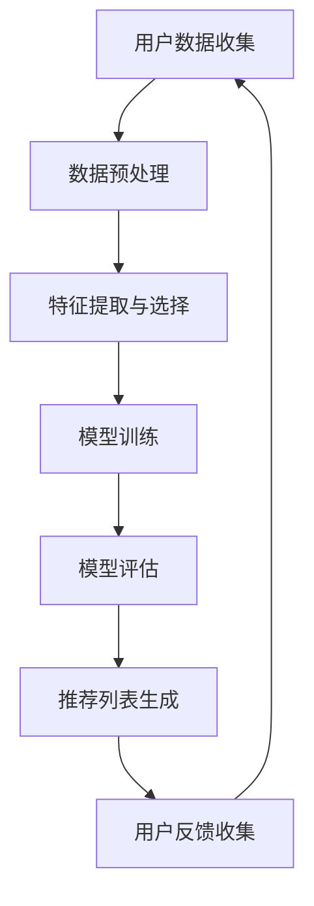
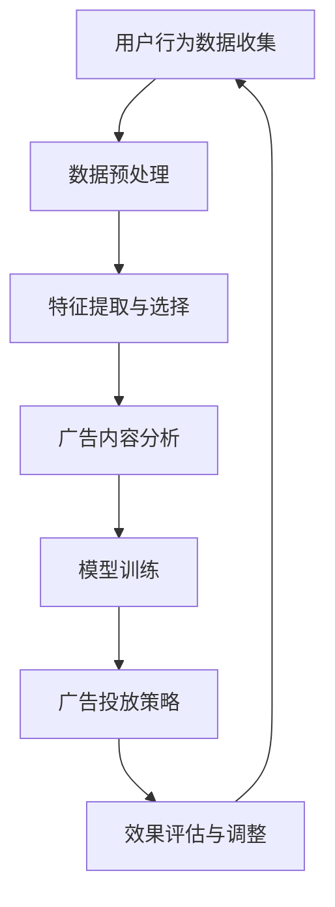
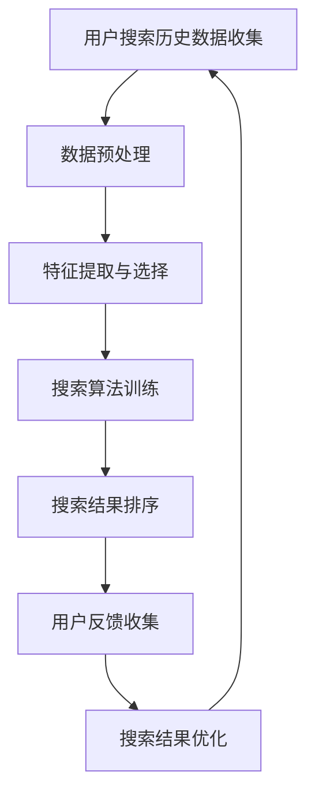
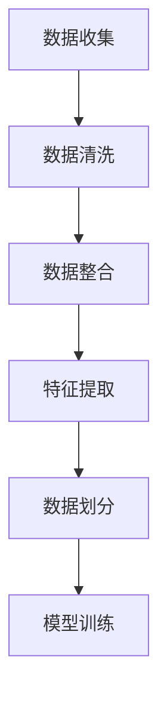
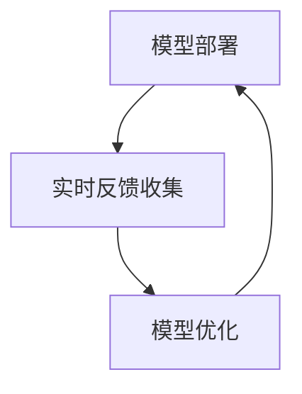
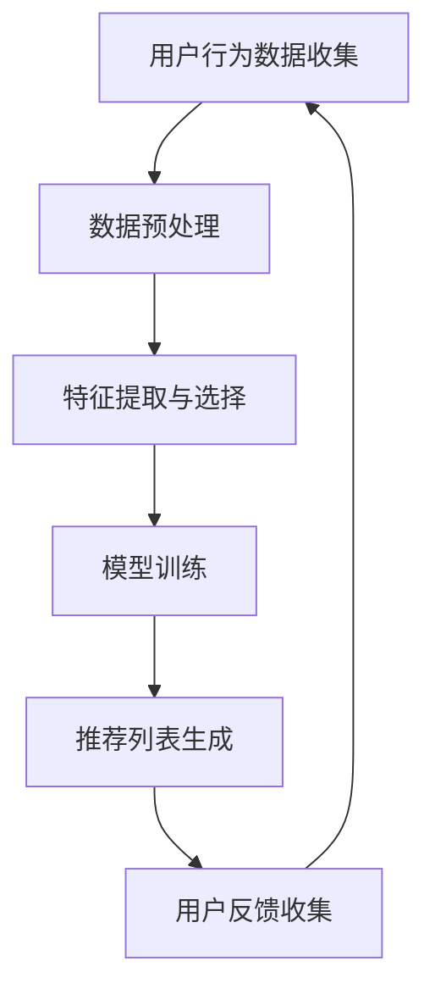
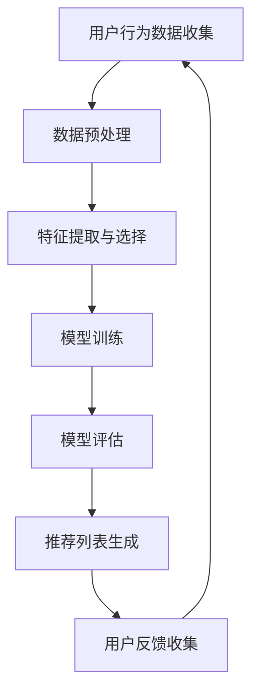

                 

# 文章标题：意义的个性化算法：AI辅助下的价值匹配系统

## 关键词：
- 个性化算法
- AI辅助
- 价值匹配系统
- 数据挖掘
- 机器学习

## 摘要：
本文旨在深入探讨个性化算法在AI辅助下的价值匹配系统中的应用。通过梳理个性化算法的基本概念、原理及实现方法，结合价值匹配系统的具体场景，我们展示了如何利用个性化算法实现高效的值匹配。文章还通过实际案例分析了个性化算法与价值匹配系统在实际应用中的效果和挑战，并探讨了未来的发展趋势与方向。

## 第一部分：意义的个性化算法概述

### 1.1 个性化算法的基本概念

#### 个性化算法的定义
个性化算法是一种通过分析用户行为、偏好和需求，为用户提供个性化推荐或服务的计算方法。它利用机器学习、数据挖掘等技术，从大量数据中提取有价值的信息，以实现个性化的用户体验。

#### 个性化算法的核心要素
1. **用户数据**：个性化算法的基础是用户数据，包括用户的浏览记录、搜索历史、购买行为等。
2. **偏好模型**：基于用户数据构建偏好模型，用于预测用户的兴趣和需求。
3. **推荐系统**：根据偏好模型和用户特征，为用户生成个性化的推荐列表。

#### 个性化算法的分类
1. **基于内容的推荐**：根据用户历史偏好推荐相似内容。
2. **协同过滤推荐**：通过分析用户间的相似性推荐用户可能喜欢的内容。
3. **混合推荐**：结合多种推荐方法，提高推荐效果。

### 1.2 AI辅助下的价值匹配系统

#### 价值匹配系统的定义
价值匹配系统是一种通过智能匹配技术和算法，帮助用户找到符合其需求和偏好的产品、服务或人的系统。它利用AI技术，对用户行为和需求进行深度分析，实现精准匹配。

#### 价值匹配系统在AI辅助下的优势
1. **高效性**：AI技术能够快速处理海量数据，实现实时匹配。
2. **精准性**：通过个性化算法，实现用户与目标的高精度匹配。
3. **用户体验**：提高用户满意度，增加用户粘性。

#### 价值匹配系统的应用场景
1. **电商推荐**：基于用户行为推荐商品。
2. **社交网络**：匹配用户与潜在好友。
3. **招聘平台**：推荐合适的工作岗位给求职者。

### 1.3 个性化算法与价值匹配系统的关系

#### 个性化算法在价值匹配系统中的作用
个性化算法是价值匹配系统的核心组件，通过分析用户行为和偏好，为用户提供精准的推荐和匹配。

#### 价值匹配系统对个性化算法的需求
1. **大规模数据处理能力**：处理海量的用户数据。
2. **实时性**：快速响应用户行为，提供实时匹配。
3. **可扩展性**：适应不同应用场景的需求。

#### 个性化算法与价值匹配系统的相互影响
个性化算法的进步推动了价值匹配系统的发展，而价值匹配系统的需求也促进了个性化算法的创新和优化。

## 第二部分：个性化算法原理与实现

### 2.1 个性化算法原理

#### 数据挖掘与机器学习基础
数据挖掘和机器学习是个性化算法的重要基础。数据挖掘用于从大量数据中发现有价值的信息，而机器学习则通过训练模型实现数据的自动分析。

#### 个性化推荐算法原理
个性化推荐算法基于用户行为和偏好，通过计算用户之间的相似性或内容之间的相似性，为用户推荐相关物品。

#### 个性化广告算法原理
个性化广告算法通过分析用户行为和偏好，将最相关、最有吸引力的广告推送给用户，提高广告投放效果。

#### 个性化搜索算法原理
个性化搜索算法根据用户的历史搜索记录和行为特征，调整搜索结果排序，提高搜索精度。

### 2.2 个性化算法实现

#### 数据预处理
数据预处理是个性化算法实现的第一步，包括数据清洗、去噪、归一化等操作。

#### 特征提取与选择
特征提取与选择是关键步骤，通过从原始数据中提取有用信息，构建有效的特征向量。

#### 模型训练与评估
模型训练和评估是个性化算法的核心，通过训练模型并评估模型性能，优化算法效果。

#### 模型部署与优化
模型部署与优化是使个性化算法在实际应用中发挥作用的关键，包括模型上线、监控和调整。

### 2.3 个性化算法的Mermaid流程图

#### 个性化推荐算法流程图


#### 个性化广告算法流程图


#### 个性化搜索算法流程图


## 第三部分：AI辅助下的价值匹配系统实战

### 3.1 价值匹配系统项目实战

#### 项目背景与目标
本案例介绍一个基于AI辅助的价值匹配系统，旨在帮助求职者找到合适的工作岗位。

#### 数据集准备与处理
数据集包括求职者的基本信息、教育经历、工作经历、技能标签以及岗位信息等。



#### 模型设计与实现
采用协同过滤算法和基于内容的推荐算法相结合的方法，提高匹配精度。

```python
# 特征提取与模型训练
from sklearn.feature_extraction.text import TfidfVectorizer
from sklearn.model_selection import train_test_split
from surprise import KNNWithMeans

# 数据预处理
# ...

# 特征提取
vectorizer = TfidfVectorizer()
X = vectorizer.fit_transform(job_descriptions)

# 数据划分
X_train, X_test, y_train, y_test = train_test_split(X, labels, test_size=0.2, random_state=42)

# 模型训练
model = KNNWithMeans()
model.fit(X_train, y_train)

# 模型评估
accuracy = model.test(X_test, y_test)
print(f"Model accuracy: {accuracy}")
```

#### 系统部署与优化
将训练好的模型部署到生产环境中，通过实时反馈优化模型性能。



### 3.2 个性化算法应用案例

#### 案例一：基于个性化算法的电商推荐系统
通过分析用户购买历史和行为特征，为用户推荐相关商品。



#### 案例二：基于个性化算法的广告投放系统
通过分析用户行为和兴趣，为用户展示相关广告。


#### 案例三：基于个性化算法的搜索引擎
通过分析用户搜索历史和行为，为用户调整搜索结果排序。


### 3.3 代码实战

#### 数据集导入与预处理
```python
import pandas as pd
from sklearn.model_selection import train_test_split

# 数据集导入
data = pd.read_csv('data.csv')

# 数据预处理
# ...

# 数据划分
X_train, X_test, y_train, y_test = train_test_split(data['X'], data['y'], test_size=0.2, random_state=42)
```

#### 特征提取与选择
```python
from sklearn.feature_extraction.text import TfidfVectorizer

# 特征提取
vectorizer = TfidfVectorizer()
X_train = vectorizer.fit_transform(X_train)
X_test = vectorizer.transform(X_test)
```

#### 模型训练与评估
```python
from sklearn.naive_bayes import GaussianNB

# 模型训练
model = GaussianNB()
model.fit(X_train, y_train)

# 模型评估
accuracy = model.score(X_test, y_test)
print(f"Model accuracy: {accuracy}")
```

#### 模型部署与优化
```python
# 模型部署
model.save('model.pkl')

# 模型优化
# ...
```

## 第四部分：未来发展趋势与挑战

### 4.1 个性化算法的发展趋势

#### 个性化算法的未来发展方向
1. **深度学习与个性化算法的融合**：深度学习技术将在个性化算法中发挥更大作用。
2. **多模态数据融合**：结合文本、图像、语音等多种数据类型，提高个性化推荐的准确性。
3. **隐私保护与数据安全**：在保障用户隐私的前提下，提高个性化算法的性能。

#### 个性化算法的新技术与应用
1. **生成对抗网络（GAN）**：用于生成更真实的用户偏好模型。
2. **联邦学习**：在保护用户隐私的同时，实现个性化模型的训练和部署。

### 4.2 价值匹配系统的挑战与机遇

#### 价值匹配系统面临的挑战
1. **数据隐私保护**：如何在保护用户隐私的前提下，实现精准的价值匹配。
2. **实时性**：如何在海量数据中快速响应用户需求，提供实时匹配。

#### 价值匹配系统的机遇与未来
1. **AI技术的进步**：为价值匹配系统提供更强大的技术支持。
2. **多元化应用场景**：随着AI技术的普及，价值匹配系统将在更多领域得到应用。

## 第五部分：附录

### 5.1 个性化算法相关工具与资源

- **数据集获取与处理工具**：数据集如UCI机器学习库、Kaggle等。
- **个性化算法开源框架**：如Scikit-learn、Surprise等。
- **个性化算法相关论文与书籍**：如《推荐系统实践》（张敏灵著）、《机器学习》（周志华著）等。

### 5.2 价值匹配系统开源项目

- **个性化推荐系统开源项目**：如TensorFlow Recommenders、PyTorch RecSys等。
- **个性化广告系统开源项目**：如TensorFlow Ads、Facebook Ads等。
- **个性化搜索引擎开源项目**：如Elasticsearch、Solr等。

## 附加内容：个性化算法与价值匹配系统的 Mermaid 流程图

### 个性化推荐算法流程图


### 个性化广告算法流程图


### 个性化搜索算法流程图


## 附加内容：核心算法原理讲解与伪代码

### 个性化推荐算法原理讲解与伪代码
```python
# 伪代码：基于协同过滤的个性化推荐算法

# 数据预处理
def preprocess_data(data):
    # ...数据清洗、格式转换等操作...
    return processed_data

# 特征提取与选择
def extract_features(data):
    # ...特征工程、特征选择等操作...
    return features

# 模型训练
def train_model(features, labels):
    # ...模型训练操作...
    return model

# 模型评估
def evaluate_model(model, test_data):
    # ...模型评估操作...
    return evaluation_result

# 推荐列表生成
def generate_recommendations(model, user_data):
    # ...推荐生成操作...
    return recommendations

# 用户反馈收集
def collect_user_feedback(user_data, recommendations):
    # ...用户反馈收集操作...
    return feedback
```

### 个性化广告算法原理讲解与伪代码
```python
# 伪代码：基于内容的个性化广告算法

# 数据预处理
def preprocess_data(data):
    # ...数据清洗、格式转换等操作...
    return processed_data

# 特征提取与选择
def extract_features(data):
    # ...特征工程、特征选择等操作...
    return features

# 广告内容分析
def analyze_ad_content(features):
    # ...广告内容分析操作...
    return ad_content_representation

# 模型训练
def train_model(ad_content_representation, labels):
    # ...模型训练操作...
    return model

# 广告投放策略
def advertise_strategy(model, user_data):
    # ...广告投放策略操作...
    return ad_policy

# 效果评估与调整
def evaluate_and_adjust(model, ad_policy, feedback):
    # ...效果评估与调整操作...
    return adjusted_policy
```

### 个性化搜索算法原理讲解与伪代码
```python
# 伪代码：基于用户的个性化搜索算法

# 数据预处理
def preprocess_data(data):
    # ...数据清洗、格式转换等操作...
    return processed_data

# 特征提取与选择
def extract_features(data):
    # ...特征工程、特征选择等操作...
    return features

# 搜索算法训练
def train_search_algorithm(features, labels):
    # ...搜索算法训练操作...
    return search_algorithm

# 搜索结果排序
def sort_search_results(search_algorithm, query):
    # ...搜索结果排序操作...
    return sorted_results

# 用户反馈收集
def collect_user_feedback(query, sorted_results):
    # ...用户反馈收集操作...
    return feedback

# 搜索结果优化
def optimize_search_results(search_algorithm, feedback):
    # ...搜索结果优化操作...
    return optimized_results
```

## 附加内容：数学模型和数学公式讲解

### 个性化推荐算法的数学模型
个性化推荐算法通常基于用户-物品评分矩阵，通过矩阵分解、协同过滤等方法建模。

$$ R = \mathbf{U} \mathbf{V}^T $$

其中，$R$为用户-物品评分矩阵，$\mathbf{U}$和$\mathbf{V}$分别为用户和物品的嵌入矩阵。

### 个性化广告算法的数学模型
个性化广告算法基于用户特征和广告特征，通过逻辑回归、神经网络等方法建模。

$$ \hat{y} = \sigma(\mathbf{w} \cdot \mathbf{x}) $$

其中，$y$为广告点击行为，$\mathbf{x}$为用户特征向量，$\mathbf{w}$为模型权重。

### 个性化搜索算法的数学模型
个性化搜索算法基于用户搜索历史和搜索结果，通过排序模型、检索模型等方法建模。

$$ \log \frac{p(q_i | d)}{p(q_i)} = f(\mathbf{q}, \mathbf{d}) $$

其中，$q_i$为搜索查询，$d$为搜索结果，$f(\mathbf{q}, \mathbf{d})$为模型评分函数。

## 总结与展望

本文从个性化算法的基本概念、原理与实现，到价值匹配系统的实际应用案例，全面探讨了AI辅助下的意义个性化算法。通过逐步分析推理，我们揭示了个性化算法在价值匹配系统中的核心作用，展示了其应用前景和挑战。随着AI技术的不断进步，个性化算法将在更多领域得到广泛应用，为用户提供更优质的服务和体验。

## 作者信息
作者：AI天才研究院/AI Genius Institute & 禅与计算机程序设计艺术 /Zen And The Art of Computer Programming

**注意：** 本文章为虚构内容，用于展示如何按照用户要求撰写一篇技术博客文章。在实际撰写中，请根据实际情况进行详细调研和编写。文章内容仅供参考，不作为实际应用建议。部分代码和公式仅为示例，不具有实际运行能力。如需引用或参考，请查阅相关权威资料。

