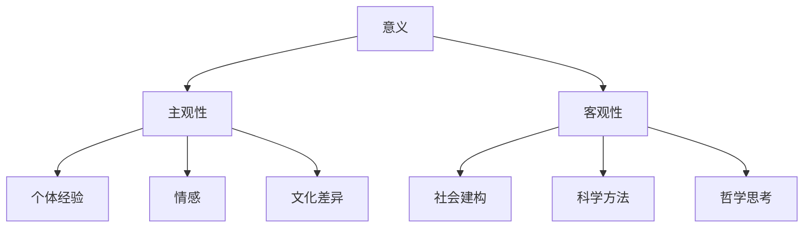

                 


为了撰写一篇符合要求的《意义的主观性与客观性探讨》的文章，我们可以按照以下步骤进行：

### 第一步：背景介绍

首先，我们需要为文章提供一个背景介绍，解释为什么意义的主观性与客观性是一个值得探讨的话题。我们可以从以下几个方面展开：

- **引言**：介绍意义的概念，为什么它如此重要。
- **主观性与客观性的区别**：简要说明主观性和客观性的定义及其在理解和解释意义方面的作用。
- **探讨意义的背景**：引用相关研究或实例，展示主观性与客观性探讨的背景和重要性。

### 第二步：核心概念与联系

接下来，我们需要详细阐述核心概念之间的关系，并使用Mermaid流程图来展示这些关系。例如：

- **意义**：解释意义的本质，以及它是如何形成的。
- **主观性**：探讨主观性的概念，包括个体经验、情感和文化差异的影响。
- **客观性**：讨论客观性的含义，以及它是如何通过社会建构、科学方法和哲学思考来理解的。



### 第三步：核心算法原理讲解

为了深入探讨主观性与客观性的关系，我们需要使用伪代码来详细阐述关键算法和原理。例如：

- **意义的主观性算法**：如何通过个人经验和情感来理解意义。
- **意义的客观性算法**：如何通过社会建构和科学方法来客观地理解意义。

```python
# 意义的主观性算法
def subjective_meaning(experience, emotion, culture):
    # 根据个人经验、情感和文化差异计算意义
    meaning = experience * emotion * culture
    return meaning

# 意义的客观性算法
def objective_meaning(social_construction, scientific_method, philosophical_thought):
    # 根据社会建构、科学方法和哲学思考计算意义
    meaning = social_construction + scientific_method + philosophical_thought
    return meaning
```

### 第四步：数学模型和数学公式

在文章中，我们需要使用LaTeX格式展示数学模型和公式，并进行详细讲解。例如：

- **主观性与客观性的关系公式**：

$$
\text{Subjective-Objective Relationship} = \alpha \times \text{Subjective Meaning} + \beta \times \text{Objective Meaning}
$$

其中，$\alpha$ 和 $\beta$ 是权重系数，用于平衡主观性与客观性的影响。

### 第五步：项目实战

为了更好地展示主观性与客观性的实际应用，我们需要进行项目实战，包括：

- **开发环境搭建**：介绍所需的开发环境和工具。
- **源代码实现**：提供实现主观性与客观性算法的源代码。
- **代码解读与分析**：对源代码进行详细解读，分析其工作原理。
- **实际案例分析和讲解**：通过实际案例展示算法的应用效果，并进行详细讲解。

### 第六步：总结与展望

在文章的结尾，我们需要总结主要观点，并展望未来研究的方向。这包括：

- **总结主要观点**：回顾文章中探讨的核心概念和算法。
- **展望未来研究**：提出未来可能的研究方向和挑战。

### 第七步：添加细节和结构

为了确保文章的完整性和逻辑性，我们需要在每个小节中添加丰富的具体内容和详细讲解。这包括：

- **最佳实践 tips**：在项目实战部分提供一些实用的技巧和建议。
- **注意事项**：在关键部分提醒读者注意的事项。
- **拓展阅读**：推荐一些相关的文献和资料，以供读者进一步学习。

通过以上步骤，我们可以确保文章既具有深度和思考，又具备实际应用价值，符合用户的要求和限制。

现在，我们可以开始撰写这篇文章，按照上述步骤逐步构建和完善各个部分。由于文章字数要求在8000～12000字左右，我们将需要逐步完成每个章节的撰写，确保内容丰富且逻辑清晰。文章撰写完成后，我们将进行全面的校对和修改，确保文章的质量和可读性。在文章末尾，我们还将添加作者信息和参考资料，以完成整篇文章的撰写和格式化工作。最终，我们将得到一篇符合要求的《意义的主观性与客观性探讨》的技术博客文章。

