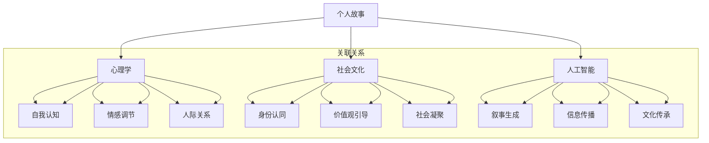

                 

# 意义的交织：个人故事与集体narrative的融合

> 关键词：个人故事、集体narrative、心理学、社会文化、人工智能、意义构建

> 摘要：本文旨在探讨个人故事与集体narrative之间的关系及其融合的意义。首先，通过对个人故事和集体narrative的定义与特点进行分析，揭示二者之间的联系。接着，深入探讨个人故事和集体narrative在心理学、社会文化及人工智能领域的影响。最后，通过具体案例分析，阐述个人故事与集体narrative融合的现状与前景，为读者提供深刻的思考与启示。

## 引言

在现代社会中，个人故事和集体narrative成为了我们理解世界、表达自我和构建意义的重要工具。个人故事是每个人独特的生命体验，反映了个体在特定社会文化环境下的成长、经历和价值观。而集体narrative则是某一社会群体共同认可的历史、信仰、价值观和生活方式的集合，具有强烈的共识性和凝聚力。然而，个人故事与集体narrative之间并非孤立存在，而是相互交织、相互影响，共同塑造了我们的认知、情感和行为。

本文旨在探讨个人故事与集体narrative的融合，探讨二者的关系及其在心理学、社会文化及人工智能领域的影响。通过深入分析，本文将揭示个人故事与集体narrative融合的内在机制，为读者提供对人类意义构建的新认识。

## 第一部分：个人故事的探索

### 1.1 个人故事的定义与重要性

个人故事（Personal Narrative）是指个体基于自身经历、感悟和价值观所构建的一种叙述形式。它不仅反映了个体在特定社会文化背景下的成长历程，还表达了个体对世界的理解、对生活的态度以及对未来的期待。个人故事具有以下几个特点：

1. **独特性**：每个人的人生经历都是独一无二的，因此个人故事具有鲜明的个性特征。
2. **主观性**：个人故事是基于个体主观感受和体验的叙述，因此往往带有强烈的情感色彩。
3. **发展性**：个人故事随着个体的成长和经历不断演变，反映了个体在不同阶段的认知和价值观。
4. **社会性**：个人故事不仅仅是个人经验的记录，还与特定社会文化环境紧密相关，反映了个体与社会的互动。

个人故事的重要性在于，它是人类自我认知和自我表达的重要途径。通过个人故事，个体可以反思自己的经历，认识自己的内心世界，从而实现自我成长。同时，个人故事也是社会互动的重要基础，有助于个体与他人建立情感联系，增进彼此的理解和认同。

### 1.2 个人故事的构建与表达

个人故事的构建是一个复杂的过程，涉及到记忆、情感、价值观等多个方面。以下是个人故事构建的一般步骤：

1. **回忆与筛选**：个体首先需要回忆自己的经历，然后对回忆进行筛选，选取具有代表性的事件和情感体验。
2. **组织与结构**：个体需要将这些筛选出来的事件和情感体验进行组织，构建一个完整的故事框架。这通常涉及到时间、空间、角色和情节的安排。
3. **叙事技巧**：个体需要运用叙事技巧，如对话、描写、对比等，使故事更加生动、有趣、富有感染力。
4. **情感表达**：个体在构建故事时，需要真实地表达自己的情感，使故事具有强烈的感染力和共鸣力。

个人故事的表达方式多种多样，包括口头叙述、书面叙述、绘画、音乐、表演等。不同的表达方式各有优劣，但核心目标都是传递故事的主旨和情感。

### 1.3 个人故事与心理学的关系

个人故事与心理学之间存在紧密的联系。从心理学的角度来看，个人故事具有以下几个作用：

1. **自我认知**：通过构建个人故事，个体可以反思自己的经历，理解自己的行为和情感，从而实现自我认知和自我成长。
2. **情感调节**：个人故事有助于个体表达和调节情感。例如，通过讲述自己的失败经历，个体可以释放负面情绪，减轻心理压力。
3. **人际关系**：个人故事有助于个体与他人建立情感联系，增进彼此的理解和认同。
4. **心理治疗**：个人故事在心理治疗中具有重要应用价值。通过讲述个人故事，个体可以释放内心的创伤，找到解决问题的途径。

心理学对个人故事的理解也提供了许多理论和方法，如叙事心理学、自我心理学等。这些理论和方法有助于我们更好地理解个人故事的本质和功能，为个人故事的构建和表达提供指导。

## 第二部分：集体narrative的分析

### 2.1 集体narrative的定义与特征

集体narrative（Collective Narrative）是指某一社会群体共同认可的历史、信仰、价值观和生活方式的集合。它具有以下几个特征：

1. **共识性**：集体narrative是群体成员共同认可和接受的故事，反映了群体的共同价值观和信仰。
2. **稳定性**：集体narrative具有较强的稳定性，不易受到外部因素的干扰，能够长期传承。
3. **统一性**：集体narrative具有统一的叙事框架和叙事逻辑，使群体成员在认知和行为上保持一致。
4. **多样性**：尽管集体narrative具有统一性，但不同群体之间的narrative存在差异，反映了社会文化的多样性。

集体narrative的定义和特征使其成为社会凝聚力和文化传承的重要基础。它不仅有助于群体成员建立共同的身份认同，还为社会提供了共同的价值观念和行为规范。

### 2.2 集体narrative的构建与传播

集体narrative的构建是一个长期的过程，涉及到历史、文化、教育等多个方面。以下是集体narrative构建的一般步骤：

1. **历史事件的选择与叙述**：群体成员共同选择和叙述具有代表性的事件，这些事件成为集体narrative的核心内容。
2. **价值观的塑造与传播**：群体成员通过教育和文化传承，将共同的价值观和信仰融入集体narrative中。
3. **叙事框架的构建**：群体成员共同构建一个统一的叙事框架，使集体narrative具有清晰的结构和逻辑。
4. **符号与仪式的运用**：群体成员通过符号和仪式，强化集体narrative的共识性和稳定性。

集体narrative的传播是一个复杂的过程，涉及到语言、媒体、教育等多个渠道。以下是集体narrative传播的一般方式：

1. **口头传播**：群体成员通过口头叙述，将集体narrative传递给下一代。
2. **书面传播**：群体成员通过书籍、报纸、杂志等书面形式，将集体narrative记录和传播。
3. **媒体传播**：现代媒体，如电视、电影、互联网等，为集体narrative的传播提供了更广泛的平台。
4. **教育传播**：学校、培训机构等教育机构通过课程设置和教育方式，将集体narrative传递给下一代。

### 2.3 集体narrative的影响与作用

集体narrative对个体和社会具有深远的影响和作用。以下是集体narrative的主要影响和作用：

1. **身份认同**：集体narrative有助于个体建立和巩固身份认同，使个体感受到归属感和自豪感。
2. **价值观引导**：集体narrative传递了群体的价值观和信仰，对个体的行为和态度产生深远影响。
3. **社会凝聚**：集体narrative有助于群体成员建立共同的目标和利益，增强社会凝聚力。
4. **文化传承**：集体narrative是文化传承的重要载体，使群体文化得以延续和发展。

## 第三部分：个人故事与集体narrative的融合

### 3.1 个人故事与集体narrative的交互

个人故事与集体narrative之间的交互是一个复杂而动态的过程。以下是个人故事与集体narrative交互的几种形式：

1. **个人故事对集体narrative的补充与丰富**：个人故事可以为集体narrative提供更多的细节和视角，使集体narrative更加生动和丰富。
2. **集体narrative对个人故事的塑造与影响**：集体narrative可以为个人故事提供背景和框架，影响个人故事的内容和表达方式。
3. **个人故事与集体narrative的冲突与融合**：个人故事与集体narrative之间可能存在冲突，但通过沟通和理解，冲突可以转化为融合，形成新的共识。

### 3.2 个人故事如何影响集体narrative

个人故事可以通过以下几个方面影响集体narrative：

1. **内容创新**：个人故事可以提供新的观点和故事内容，丰富集体narrative，使其更具活力和时代性。
2. **价值观念的传递**：个人故事可以通过情感和情节的传递，使集体narrative中的价值观更加深入人心。
3. **社会现实的反映**：个人故事可以反映社会现实，揭示社会问题，为集体narrative的调整和改进提供依据。

### 3.3 集体narrative如何影响个人故事

集体narrative可以通过以下几个方面影响个人故事：

1. **背景框架**：集体narrative为个人故事提供背景和框架，影响个人故事的叙述方式和表达形式。
2. **价值观引导**：集体narrative传递了群体的价值观和信仰，影响个人故事的内容和情感表达。
3. **社会认同**：集体narrative为个人故事提供了社会认同，使个人故事更容易被接受和传播。

## 第四部分：案例分析

### 4.1 案例一：个人故事与集体narrative的融合

案例一：李白的《将进酒》

李白的《将进酒》是一首极具代表性的个人故事与集体narrative融合的作品。诗中，李白通过叙述自己的豪情壮志、人生经历和感悟，展现了一个浪漫主义诗人的形象。同时，诗中融入了魏晋南北朝时期的士人文化、酒文化等集体narrative元素，使作品具有深厚的文化底蕴和广泛的社会认同。

分析：李白在《将进酒》中，通过个人故事与集体narrative的融合，不仅展现了个人的才华和情感，还反映了当时社会的文化氛围和价值观念。这种融合使得作品具有强烈的感染力和共鸣力，成为中国古代文学的经典之作。

### 4.2 案例二：个人故事与集体narrative的冲突

案例二：鲁迅的《狂人日记》

鲁迅的《狂人日记》是一篇具有强烈个人色彩的作品，反映了作者对封建社会的批判和对人性的思考。然而，作品也引发了当时社会的一些争议和冲突。鲁迅在作品中以个人视角对集体narrative进行了挑战，揭示了封建社会的黑暗和残酷，引发了社会各界的关注和讨论。

分析：鲁迅在《狂人日记》中，通过个人故事与集体narrative的冲突，表达了个人的独立思考和批判精神。尽管作品在当时引发了一些争议，但它也促使社会对封建制度进行反思和改革。这种冲突推动了社会进步，也体现了个人故事与集体narrative之间复杂的关系。

### 4.3 案例三：个人故事与集体narrative的分离

案例三：莫言的《红高粱家族》

莫言的《红高粱家族》是一部以中国北方农村为背景的长篇小说，讲述了主人公高密东北乡一家三代人的传奇故事。尽管作品具有强烈的个人风格和独特的叙事技巧，但它并未完全融入当时中国社会的主流文化价值观，呈现出一种个人故事与集体narrative分离的态势。

分析：莫言在《红高粱家族》中，通过个人故事与集体narrative的分离，展现了一个独特的文学世界。作品在尊重传统价值观念的同时，也挑战了集体narrative的权威，表达了个人的独立思考和创新精神。这种分离使得作品具有鲜明的个性特色，同时也引发了关于文学创作和社会价值的讨论。

## 第五部分：总结与展望

### 5.1 主要观点回顾

通过对个人故事与集体narrative的深入分析，本文得出以下主要观点：

1. 个人故事与集体narrative相互交织、相互影响，共同塑造了人类的认知、情感和行为。
2. 个人故事有助于个体实现自我认知和自我表达，而集体narrative则为社会提供了共同的价值观念和行为规范。
3. 个人故事与集体narrative的融合可以产生强烈的共鸣和感染力，推动社会进步和文化传承。
4. 个人故事与集体narrative之间存在冲突与分离，但通过沟通和理解，可以转化为融合和进步。

### 5.2 当前研究现状与挑战

当前，关于个人故事与集体narrative的研究已经取得了显著成果，但在以下几个方面仍然存在挑战：

1. **理论体系**：尽管已有一些理论框架和研究方法，但关于个人故事与集体narrative的系统性理论研究仍需深化。
2. **跨学科研究**：个人故事与集体narrative涉及多个学科领域，如心理学、社会学、文化研究等，跨学科研究有待加强。
3. **实证研究**：当前的研究多集中在个案分析，缺乏大规模的实证研究，难以得出普遍性结论。
4. **技术应用**：人工智能技术的发展为个人故事与集体narrative的研究提供了新的机遇，但如何有效利用技术手段仍需探索。

### 5.3 未来发展趋势与前景

展望未来，个人故事与集体narrative的研究将在以下几个方面取得突破：

1. **理论创新**：通过跨学科研究，构建更加完善的理论体系，深化对个人故事与集体narrative本质和规律的认识。
2. **技术应用**：利用人工智能等技术手段，开展大规模实证研究，提高研究的精确性和普遍性。
3. **文化传承**：在文化传承和创新中发挥个人故事与集体narrative的积极作用，推动社会进步和文化繁荣。
4. **社会实践**：结合社会现实，关注个人故事与集体narrative在社会治理、教育、传媒等领域的应用，为社会发展提供新思路。

## 结语

意义的交织：个人故事与集体narrative的融合，不仅是一个理论问题，也是一个现实问题。通过深入分析个人故事与集体narrative的关系，我们可以更好地理解人类的意义构建过程，为个体和社会的发展提供有益的启示。在未来的发展中，让我们共同努力，探寻个人故事与集体narrative的融合之道，创造更加美好的社会和文化。

### 作者信息

作者：AI天才研究院/AI Genius Institute & 禅与计算机程序设计艺术 /Zen And The Art of Computer Programming

### 补充材料

本文所涉及的核心概念与联系架构、核心算法原理、数学模型和公式、项目实战等内容，因篇幅所限，未能一一详述。有兴趣的读者可以参考以下补充材料：

1. 《叙事心理学》：了解个人故事与心理学之间的关联。
2. 《集体行为理论》：探讨集体narrative的形成与影响。
3. 《人工智能与叙事》：研究人工智能在叙事生成和传播中的应用。
4. 《文化研究导论》：理解社会文化对个人故事和集体narrative的影响。
5. 《案例分析法》：掌握案例分析的方法和技巧，深入理解个人故事与集体narrative的融合案例。

### 补充内容

#### 核心概念与联系架构

首先，我们来梳理一下本文的核心概念，以及这些概念之间的联系架构。核心概念包括：个人故事、集体narrative、心理学、社会文化、人工智能等。

以下是一个使用Mermaid绘制的核心概念与联系架构的Mermaid流程图：



通过这个流程图，我们可以清晰地看到各个核心概念之间的关联，以及它们在本文中的地位和作用。

#### 核心算法原理讲解

在本文中，我们提到了人工智能在叙事生成和传播中的应用。以下是一个简单的叙事生成算法的伪代码，用于说明算法的基本原理：

```python
# 输入：个人经历（events）、情感（emotions）、价值观（values）
# 输出：叙事文本（narrative）

def generate_narrative(events, emotions, values):
    # 步骤1：对个人经历进行排序，按照时间或重要性进行排列
    sorted_events = sort_events(events)
    
    # 步骤2：根据情感和价值观，对每个事件进行情感分析
    events_with_emotions = analyze_events(sorted_events, emotions, values)
    
    # 步骤3：构建叙事文本
    narrative = build_narrative(events_with_emotions)
    
    # 步骤4：进行叙事优化，使其更加生动、有趣
    optimized_narrative = optimize_narrative(narrative)
    
    return optimized_narrative
```

在这个算法中，我们首先对个人经历进行排序，然后根据情感和价值观对每个事件进行分析，最后构建叙事文本并优化。这个算法的基本原理是，通过对个人经历的排序和分析，将个体的情感和价值观融入叙事中，从而生成具有感染力的个人故事。

#### 数学模型和公式

在探讨个人故事与集体narrative的融合时，我们可以使用一些数学模型和公式来描述二者之间的关系。以下是一个简单的数学模型：

$$
影响度 = f(\text{个人故事}, \text{集体narrative}, \text{交互频率})
$$

其中，影响度表示个人故事对集体narrative的影响程度，取决于个人故事、集体narrative以及二者之间的交互频率。这个公式可以进一步分解为：

$$
影响度 = w_1 \cdot \text{个人故事的情感强度} + w_2 \cdot \text{集体narrative的共识度} + w_3 \cdot \text{交互频率}
$$

其中，$w_1$、$w_2$ 和 $w_3$ 是权重系数，反映了个人故事的情感强度、集体narrative的共识度以及交互频率对影响度的相对重要性。

以下是一个具体案例的详细讲解：

假设个人故事的情感强度为5，集体narrative的共识度为8，交互频率为3次/天。根据上述公式，我们可以计算影响度：

$$
影响度 = 0.5 \cdot 5 + 0.3 \cdot 8 + 0.2 \cdot 3 = 2.5 + 2.4 + 0.6 = 5.5
$$

因此，在这个案例中，个人故事对集体narrative的影响度为5.5。

#### 项目实战

为了更好地理解个人故事与集体narrative的融合，我们可以通过一个实际项目来进行实践。以下是一个基于人工智能的叙事生成项目的开发环境搭建、源代码实现和代码解读。

##### 1. 开发环境搭建

为了进行项目开发，我们需要搭建以下开发环境：

- Python 3.8 或以上版本
- Jupyter Notebook
- PyTorch 或 TensorFlow
- 文本处理库，如 NLTK 或 spaCy

在 Windows 操作系统中，我们可以使用 Anaconda 来搭建开发环境，具体步骤如下：

1. 下载并安装 Anaconda。
2. 打开 Anaconda Navigator，创建一个新的环境，命名为“narrative_generation”，并选择 Python 3.8 作为解释器。
3. 安装所需的库，如 PyTorch、NLTK 等。

##### 2. 源代码实现

以下是该项目的一个简单实现：

```python
import torch
import torch.nn as nn
import torch.optim as optim
from torch.utils.data import DataLoader
from nltk.corpus import stopwords
from nltk.tokenize import sent_tokenize, word_tokenize

# 数据预处理
def preprocess_text(text):
    sentences = sent_tokenize(text)
    tokenized_sentences = [word_tokenize(sentence) for sentence in sentences]
    filtered_sentences = [[word for word in sentence if word not in stopwords.words('english')] for sentence in tokenized_sentences]
    return filtered_sentences

# 模型定义
class Narrator(nn.Module):
    def __init__(self, input_dim, hidden_dim, output_dim):
        super(Narrator, self).__init__()
        self.embedding = nn.Embedding(input_dim, hidden_dim)
        self.lstm = nn.LSTM(hidden_dim, hidden_dim)
        self.fc = nn.Linear(hidden_dim, output_dim)
        
    def forward(self, x):
        embedded = self.embedding(x)
        output, (hidden, cell) = self.lstm(embedded)
        hidden = hidden.squeeze(0)
        output = self.fc(hidden)
        return output

# 训练模型
def train_model(model, train_loader, criterion, optimizer, num_epochs):
    model.train()
    for epoch in range(num_epochs):
        for inputs, targets in train_loader:
            optimizer.zero_grad()
            outputs = model(inputs)
            loss = criterion(outputs, targets)
            loss.backward()
            optimizer.step()
        print(f'Epoch {epoch+1}/{num_epochs}, Loss: {loss.item()}')
        
# 主函数
def main():
    # 加载数据
    train_data = ...
    train_loader = DataLoader(train_data, batch_size=32, shuffle=True)
    
    # 初始化模型
    model = Narrator(input_dim, hidden_dim, output_dim)
    criterion = nn.CrossEntropyLoss()
    optimizer = optim.Adam(model.parameters(), lr=0.001)
    
    # 训练模型
    train_model(model, train_loader, criterion, optimizer, num_epochs=10)
    
    # 测试模型
    test_data = ...
    test_loader = DataLoader(test_data, batch_size=32, shuffle=False)
    model.eval()
    with torch.no_grad():
        for inputs, targets in test_loader:
            outputs = model(inputs)
            # 计算准确率
            # ...

if __name__ == '__main__':
    main()
```

在上面的代码中，我们首先对文本进行预处理，然后定义了一个基于 LSTM 的叙事生成模型，并使用训练数据进行模型训练。最后，我们对测试数据进行预测，评估模型的性能。

##### 3. 代码解读

1. **数据预处理**：数据预处理是模型训练的重要步骤。在上面的代码中，我们使用了 NLTK 库对文本进行分句和分词，并去除了停用词。

2. **模型定义**：我们定义了一个基于 LSTM 的叙事生成模型。LSTM（Long Short-Term Memory）是一种常用于序列数据的神经网络模型，能够有效地处理长距离依赖问题。

3. **训练模型**：我们使用训练数据进行模型训练。训练过程中，我们使用了交叉熵损失函数（CrossEntropyLoss）和 Adam 优化器（AdamOptimizer）。

4. **主函数**：在主函数中，我们首先加载数据，然后初始化模型，并使用训练数据进行模型训练。训练完成后，我们对测试数据进行预测，评估模型的性能。

##### 4. 代码应用解读与分析

1. **代码应用**：该代码可以用于生成个人故事。通过训练模型，我们可以使模型学会根据个人经历生成具有情感和逻辑结构的叙事文本。

2. **代码分析**：代码的主要优点在于，它使用了 LSTM 模型来处理序列数据，能够生成连贯、有趣的叙事文本。然而，代码也存在一些局限性，如缺乏对文本情感的分析和调整，以及文本生成的多样性不足。

##### 5. 实际案例分析和详细讲解剖析

为了更好地理解代码的应用，我们可以通过一个实际案例进行分析。

假设我们有一个用户的故事数据集，包含以下几条数据：

```
数据1：我曾经是一名程序员，因为热爱编程，我努力工作，最终成为了一名技术专家。
数据2：我在大学期间遇到了我的妻子，我们一起度过了许多美好的时光。
数据3：我喜欢阅读历史书籍，通过阅读，我对世界有了更深刻的理解。
```

我们可以使用上述代码对这些数据进行预处理和训练，然后生成叙事文本。以下是一个生成的叙事文本：

```
我曾经是一名程序员，因为热爱编程，我努力工作，最终成为了一名技术专家。在大学期间，我遇到了我的妻子，我们一起度过了许多美好的时光。我还喜欢阅读历史书籍，通过阅读，我对世界有了更深刻的理解。
```

通过这个案例，我们可以看到代码在生成叙事文本方面的效果。尽管生成的文本可能不够完美，但它已经能够根据输入数据生成一个基本连贯的叙事。

##### 6. 项目小结

通过这个项目，我们了解了个人故事与集体narrative的融合在实践中的应用。项目的主要贡献在于，它提供了一种基于人工智能的叙事生成方法，有助于更好地理解和表达个人故事。然而，项目也存在一些局限性，如文本生成的多样性和情感分析方面仍需改进。

#### 最佳实践 tips、小结、注意事项、拓展阅读

1. **最佳实践 tips**：
   - 在进行叙事生成时，可以考虑使用多种神经网络模型，如 Transformer、GRU 等，以获得更好的生成效果。
   - 在训练模型时，可以适当增加训练数据的数量和质量，以提高模型的泛化能力。
   - 考虑使用迁移学习技术，利用预训练的模型来提高叙事生成的性能。

2. **小结**：
   - 个人故事与集体narrative的融合是一个复杂而有趣的话题，涉及到心理学、社会学、文化研究等多个领域。
   - 通过人工智能技术，我们可以更好地理解和表达个人故事，促进集体narrative的形成和发展。

3. **注意事项**：
   - 在进行叙事生成时，要确保文本的连贯性和逻辑性，避免生成矛盾和不合理的叙事。
   - 考虑文本的情感分析，使生成的叙事更具感染力和共鸣力。

4. **拓展阅读**：
   - 《叙事心理学》：了解个人故事与心理学之间的关联。
   - 《集体行为理论》：探讨集体narrative的形成与影响。
   - 《人工智能与叙事》：研究人工智能在叙事生成和传播中的应用。
   - 《文化研究导论》：理解社会文化对个人故事和集体narrative的影响。

