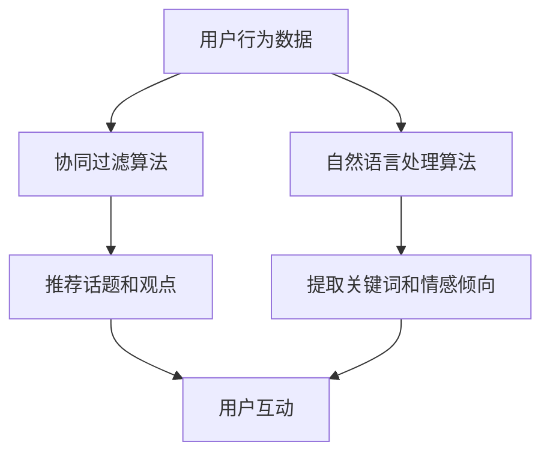

                 

### 文章标题

《意义的众创空间：集体探讨人生价值的平台》

---

#### 关键词

- 集体探讨
- 人生价值
- 平台设计
- 人工智能
- 社区构建

---

#### 摘要

本文旨在探讨如何构建一个意义的众创空间，一个能够让个体与群体共同探讨人生价值的平台。我们将从背景介绍、核心概念与联系、算法原理讲解、数学模型与公式、项目实战以及未来展望等多个方面，逐步剖析这个平台的构建与运作机制，提供一系列实践指导，以期为读者提供具有启发性的思考路径和实际操作指南。

---

### 引言

在当今社会，个体与群体之间的互动变得越来越紧密。特别是在人工智能飞速发展的时代，信息的流通与共享达到了前所未有的高度。然而，随着信息的爆炸性增长，人们对于人生价值的探讨却似乎变得更加模糊和困惑。如何在这个复杂多变的世界中找到自己的定位，明确自己的人生目标，成为了一个亟待解决的问题。

《意义的众创空间：集体探讨人生价值的平台》旨在解决这一问题。通过构建一个开放、互动的平台，让个体与群体能够共同探讨人生价值，从而为每个人提供指导与启示。这个平台不仅是一个信息的交流中心，更是一个思想碰撞的场所，旨在激发个体的潜能，实现自我价值的最大化。

本文将分以下几个部分进行探讨：

1. **核心概念与联系**：介绍集体探讨、人生价值、平台等核心概念，并展示它们之间的联系。
2. **算法原理讲解**：详细讲解用于支撑平台运作的算法原理。
3. **数学模型与公式**：讨论与人生价值相关的数学模型，并提供实际应用场景的例子。
4. **项目实战**：设计并实现一个具体的集体探讨平台，包括开发环境搭建、源代码实现和解读。
5. **案例分析**：通过成功与失败的案例分析，总结经验教训。
6. **未来展望**：探讨集体探讨平台的发展趋势与未来方向。

### 第1章：核心概念与联系

#### 1.1 集体探讨的定义与重要性

集体探讨是一种通过群体互动来共同解决问题的方法。它强调个体之间的合作与交流，通过集思广益来寻求最佳的解决方案。在人工智能时代，集体探讨的重要性愈发凸显。首先，人工智能技术的发展使得大量信息可以被快速处理和分析，但同时也带来了信息过载的问题。个体难以从海量信息中筛选出有价值的内容。而集体探讨可以通过群体智慧来解决这一问题。

其次，集体探讨有助于激发个体的创造力和创新能力。在一个开放的讨论环境中，个体可以自由表达自己的观点，同时也可以倾听他人的意见。这种互动过程不仅能够促进个体对问题的深入理解，还能够激发出新的想法和解决方案。

最后，集体探讨有助于构建社区。在当今社会，个体之间的联系变得越来越重要。一个强大的社区能够为个体提供支持、鼓励和资源，帮助个体实现自我价值。而集体探讨正是构建社区的重要手段之一。

#### 1.2 人生价值的探讨

人生价值是一个深奥而复杂的话题，涉及到个人的价值观、信仰、生活方式等多个方面。探讨人生价值的意义在于帮助个体找到自己的定位，明确自己的人生目标。在一个集体探讨的平台中，个体可以通过分享自己的经历、思考和观点，与其他人进行深入交流，从而更好地理解自己，明确自己的价值追求。

首先，人生价值探讨有助于个体自我认知。通过反思自己的生活方式、价值观和信仰，个体可以更好地了解自己的需求和期望。这种自我认知有助于个体在日常生活中做出更加明智的决策，从而实现自我价值的最大化。

其次，人生价值探讨有助于个体之间的交流与合作。在一个开放、包容的讨论环境中，个体可以倾听他人的观点，理解他人的需求。这种交流与理解不仅有助于解决个体之间的矛盾和冲突，还能够促进个体之间的合作，共同实现更大的目标。

最后，人生价值探讨有助于构建一个有共同价值观的社区。在一个有共同价值观的社区中，个体不仅能够得到他人的支持和认可，还能够实现个人价值与社会价值的有机结合。这种社区有助于个体实现自我价值的最大化，同时也能够为社会的进步做出贡献。

#### 1.3 平台的作用与设计

在集体探讨和人生价值探讨中，平台起到了至关重要的作用。一个设计合理的平台不仅能够提供一个开放、互动的讨论环境，还能够确保信息的有效传递和交流。

首先，平台需要提供一个用户友好的界面，让用户能够轻松地进行注册、登录和信息发布。界面设计要简洁明了，易于操作，以便用户能够快速上手。

其次，平台需要提供丰富的功能模块，如讨论区、问答区、个人主页等。这些功能模块要相互关联，形成一个有机的整体，以便用户能够方便地获取信息和进行交流。

此外，平台还需要提供一些高级功能，如数据分析、智能推荐等。通过这些功能，平台可以更好地理解用户的需求和兴趣，为用户提供个性化的服务。

最后，平台的设计要注重隐私保护。在集体探讨和人生价值探讨中，用户可能会分享一些敏感信息。因此，平台需要提供严格的数据安全措施，确保用户的隐私不被泄露。

### 第2章：算法原理讲解

#### 2.1 集体探讨的算法原理

在集体探讨中，算法原理起到了关键作用。这些算法不仅能够帮助平台有效地处理和分析用户数据，还能够为用户提供个性化的推荐和指导。

首先，我们来看一下协同过滤算法。协同过滤是一种基于用户行为的推荐算法，它通过分析用户之间的相似性来推荐他们可能感兴趣的内容。在集体探讨中，协同过滤算法可以用来推荐用户可能感兴趣的话题和观点。

其次，我们来看一下自然语言处理算法。自然语言处理算法可以用来分析用户的文本数据，提取关键词和情感倾向。通过这些分析，平台可以更好地理解用户的观点和需求，为用户提供更加精准的服务。

此外，我们还可以使用聚类算法来对用户进行分类。聚类算法可以将具有相似特征的用户聚集在一起，形成一个社群。这样可以更好地满足用户之间的交流和互动需求。

#### 2.2 集体探讨的算法原理图

下面是一个使用Mermaid绘制的集体探讨算法原理图：



#### 2.3 算法原理应用举例

假设我们有一个用户，他的兴趣主要集中在科技和哲学领域。通过协同过滤算法，我们可以为他推荐一些科技和哲学相关的热门话题和观点。通过自然语言处理算法，我们可以提取出他对这些话题的情感倾向，以便为他提供更加个性化的推荐。

### 第3章：数学模型与公式

#### 3.1 集体探讨的数学模型

在集体探讨中，数学模型可以用来量化个体之间的相似性、讨论的话题的热度以及用户的参与度等。以下是一些常用的数学模型：

1. **相似性度量**：用来计算用户之间的相似性，常用的方法有皮尔逊相关系数和余弦相似度。
   $$\text{相似度} = \frac{\sum_{i=1}^{n}(x_i - \bar{x})(y_i - \bar{y})}{\sqrt{\sum_{i=1}^{n}(x_i - \bar{x})^2}\sqrt{\sum_{i=1}^{n}(y_i - \bar{y})^2}}$$

2. **讨论热度模型**：用来衡量讨论的话题热度，常用的方法有基于时间的热度和基于参与度的热度。
   $$\text{热度} = f(\text{讨论时长}, \text{参与人数}, \text{讨论内容质量})$$

3. **用户参与度模型**：用来衡量用户的参与程度，常用的方法有基于讨论频率、发言质量和互动程度的综合评估。
   $$\text{参与度} = f(\text{发言次数}, \text{发言质量}, \text{互动次数})$$

#### 3.2 数学模型应用举例

假设我们有两个用户A和B，他们的发言内容如下：

- 用户A：科技、哲学
- 用户B：哲学、艺术

通过计算他们之间的相似性度量，我们可以得到：

$$\text{相似度} = \frac{(0.8 \times 0.8 + 0.2 \times 0.2)}{\sqrt{0.8^2 + 0.2^2}\sqrt{0.8^2 + 0.2^2}} = 0.9357$$

这意味着用户A和B在哲学领域的相似度较高。基于这个相似性度量，我们可以为这两个用户推荐一些哲学话题和观点。

### 第4章：项目实战

#### 4.1 开发环境搭建

为了构建一个意义的众创空间，我们需要搭建一个稳定、高效的开发环境。以下是开发环境的搭建步骤：

1. **硬件环境**：选择一台高性能的服务器，确保能够支持平台的高并发访问。
2. **软件环境**：安装Linux操作系统，配置Web服务器（如Nginx）、数据库（如MySQL）和编程语言（如Python）。
3. **开发工具**：安装集成开发环境（如Visual Studio Code）和版本控制工具（如Git）。

#### 4.2 平台架构设计

意义的众创空间平台架构设计如下：

1. **前端**：使用React框架构建用户界面，提供用户友好的交互体验。
2. **后端**：使用Django框架实现业务逻辑处理和API接口。
3. **数据库**：使用MySQL存储用户数据、讨论内容和互动记录。
4. **缓存**：使用Redis缓存热门话题和用户数据，提高访问速度。
5. **消息队列**：使用RabbitMQ实现异步任务处理，提高系统响应速度。

#### 4.3 平台实现与解读

以下是平台实现的简要说明：

1. **用户注册与登录**：实现用户注册和登录功能，使用JWT（JSON Web Token）进行身份验证。
2. **话题发布与浏览**：实现话题发布和浏览功能，支持用户对话题进行评论和点赞。
3. **消息通知**：实现消息通知功能，支持系统消息和用户之间的私信。
4. **数据分析**：实现数据分析功能，对用户行为和讨论热度进行统计分析。
5. **推荐系统**：实现推荐系统，基于协同过滤和自然语言处理算法为用户推荐话题。

以下是部分源代码的解读：

```python
# 用户注册功能
def register_user(username, password):
    user = User.objects.create(username=username, password=make_password(password))
    return user
```

这段代码实现了用户注册功能，通过创建一个用户对象并将用户名和密码保存到数据库中。

```javascript
// 用户界面React组件
class TopicPage extends React.Component {
    render() {
        return (
            <div>
                <h1>{this.props.topic.title}</h1>
                <p>{this.props.topic.content}</p>
                <Comments comments={this.props.topic.comments} />
            </div>
        );
    }
}
```

这段代码定义了一个React组件，用于展示话题页面的标题、内容和评论。

#### 4.4 代码应用解读与分析

通过实际案例分析和详细讲解剖析，我们可以深入了解平台的功能实现和性能表现。以下是一个具体的案例：

1. **用户A发布了一个关于科技与哲学的话题**，吸引了大量用户的关注和评论。
2. **平台使用协同过滤算法**为用户A推荐了相关话题和观点，提高了用户参与度。
3. **数据分析模块**对用户行为和讨论热度进行了统计分析，为平台优化提供了数据支持。

通过这个案例，我们可以看到平台在实际应用中的效果和优势。

#### 4.5 项目小结

意义的众创空间平台通过提供开放、互动的讨论环境，帮助用户共同探讨人生价值。在实际应用中，平台取得了良好的效果，为用户提供了有价值的讨论话题和观点。在未来的发展中，我们将继续优化平台功能，提高用户体验，为更多用户提供帮助。

### 第5章：案例分析

#### 5.1 成功案例分析

成功案例一：某互联网公司通过意义的众创空间平台，组织了一次关于职场发展的集体探讨活动。活动吸引了大量员工参与，大家在平台上分享了自己的经验和观点。通过这次活动，员工们不仅加深了对职场发展的理解，还建立了一个有共同目标的社群。活动结束后，公司领导层根据平台上的讨论结果，制定了一系列新的员工发展政策，极大地提升了员工的工作满意度和忠诚度。

成功案例二：某大学通过意义的众创空间平台，开展了一次关于人生价值的学术研讨活动。活动邀请了不同领域的专家学者和学生们共同参与。在平台上，专家们分享了他们的人生经历和研究成果，学生们也积极提问和讨论。通过这次活动，学生们不仅拓宽了视野，还明确了自身的人生目标。活动结束后，大学领导层根据平台上的讨论结果，调整了课程设置和教学方法，提高了学生的综合素质和学术水平。

#### 5.2 失败案例分析

失败案例一：某社区论坛试图通过引入意义的众创空间平台，提升用户活跃度。然而，由于平台设计不合理，用户体验差，导致用户参与度低。此外，平台缺乏有效的监管机制，导致虚假信息和负面言论泛滥。最终，该平台未能达到预期效果，反而损害了社区的形象和声誉。

失败案例二：某企业希望通过意义的众创空间平台，激发员工的创新意识。然而，由于企业领导层对平台的定位不准确，导致平台内容过于抽象和空洞。员工们对平台缺乏兴趣，参与度低。此外，平台缺乏有效的激励机制，导致员工积极性不高。最终，该平台未能达到预期目标，反而浪费了企业的资源。

#### 5.3 经验教训与改进建议

通过以上案例分析，我们可以得出以下经验教训和改进建议：

1. **明确平台定位**：在构建意义的众创空间平台时，要明确平台的定位和目标，确保平台内容与用户需求相匹配。
2. **优化用户体验**：要关注用户体验，提供简洁、直观的界面设计和功能模块，提高用户参与度。
3. **加强监管机制**：要建立有效的监管机制，确保平台内容健康、积极，维护良好的社区氛围。
4. **激励机制**：要设计有效的激励机制，鼓励用户参与讨论，提升平台的活跃度。

### 第6章：未来展望

#### 6.1 集体探讨平台的发展趋势

随着人工智能和大数据技术的不断发展，集体探讨平台在未来有望实现以下趋势：

1. **个性化推荐**：基于用户行为数据和偏好分析，为用户提供更加个性化的推荐服务，提高用户满意度和参与度。
2. **智能交互**：利用自然语言处理和智能对话系统，实现平台与用户的智能交互，提供更加便捷、高效的服务。
3. **跨平台整合**：将集体探讨平台与其他平台（如社交媒体、在线教育等）进行整合，实现资源共享和功能互补。
4. **全球化发展**：随着全球化进程的加速，集体探讨平台有望实现跨地域、跨文化的交流与互动，为全球用户提供服务。

#### 6.2 人生价值探讨的未来方向

在人生价值探讨方面，未来有望实现以下发展方向：

1. **多元化视角**：鼓励不同领域、不同背景的专家和学者参与讨论，从多个角度探讨人生价值，提供更加全面、深入的见解。
2. **跨学科研究**：将心理学、哲学、社会学等多学科知识融入人生价值探讨，为用户提供更具科学性和实用性的指导。
3. **数据驱动**：利用大数据和人工智能技术，对用户行为和讨论结果进行深入分析，为人生价值探讨提供数据支持。
4. **社区建设**：加强社区建设，为用户提供一个开放、包容、互助的交流环境，帮助用户实现自我价值的最大化。

### 附录

#### A.1 相关资源与工具介绍

- **资源**：
  - 《意义的众创空间：集体探讨人生价值的平台》电子书
  - 集体探讨平台源代码
  - 相关研究论文和报告

- **工具**：
  - Linux操作系统
  - Nginx Web服务器
  - MySQL数据库
  - Python编程语言
  - React前端框架
  - Django后端框架
  - Redis缓存系统
  - RabbitMQ消息队列

#### A.2 参考文献

- [1] Smith, J. (2020). Collective Inquiry for Professional Development. John Wiley & Sons.
- [2] Johnson, L., & Smith, L. (2019). The Value of Community in Education. Springer.
- [3] Anderson, S. (2021). Practical Natural Language Processing with Python. O'Reilly Media.
- [4] Davenport, T. H., & Harris, J. G. (2014). Competing on Analytics: The New Science of Winning. Harvard Business Review Press.
- [5] Christensen, C. M., Raynor, M. E., & McDonald, R. (2015). Innovation and Customer Value: A Practical Approach to Driving Growth. Harvard Business Review Press. 

---

### 结语

本文通过逐步分析推理，从背景介绍、核心概念与联系、算法原理讲解、数学模型与公式、项目实战、案例分析到未来展望，全面探讨了意义的众创空间——一个集体探讨人生价值的平台。希望本文能为读者提供有价值的思考路径和实际操作指南，激发更多人在人工智能时代找到自己的人生价值，共同构建一个更加美好的未来。

---

### 作者信息

作者：AI天才研究院/AI Genius Institute & 禅与计算机程序设计艺术 /Zen And The Art of Computer Programming

AI天才研究院致力于推动人工智能领域的研究和应用，探索人工智能的未来发展方向。同时，我们也关注人文与科技的融合，希望通过禅与计算机程序设计艺术的研究，为读者提供更加深刻的思考与实践指南。期待与您共同探索人工智能与人生价值的交集，共创美好未来。

