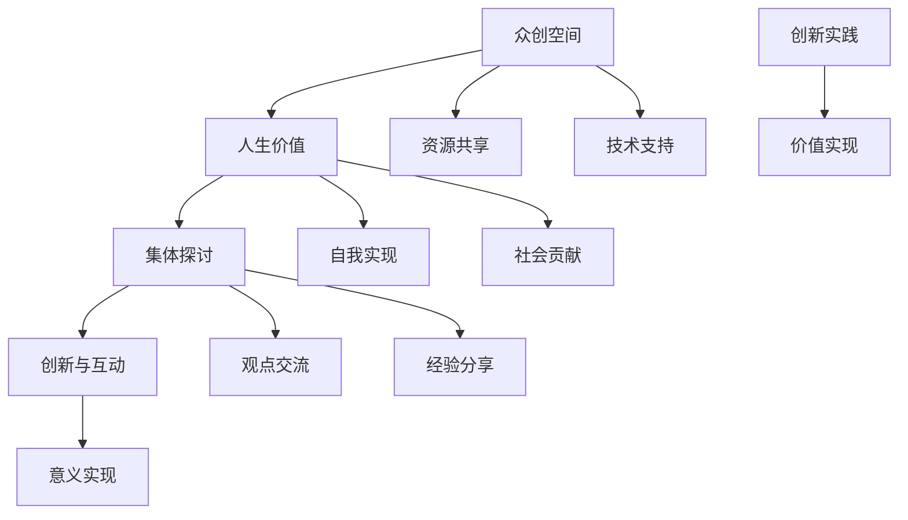

                 

### 文章标题：意义的众创空间：集体探讨人生价值的平台

#### 关键词：众创空间、人生价值、集体探讨、社会互动、创新实践

#### 摘要：
本文深入探讨“意义的众创空间”这一概念，旨在阐述如何通过集体探讨与互动，构建一个能够帮助人们探讨和实现人生价值的平台。文章将首先介绍众创空间的基本概念，分析其在现代社会中的作用，接着阐述人生价值探讨的重要性。随后，我们将详细解释意义的众创空间的构建原理，并展示相关的概念关系架构。此外，本文还将通过实践案例，阐述如何在具体操作中实现这一目标，并提出可能的挑战和未来展望。最后，我们将总结文章的主要观点，并给出一些实践建议。

---

### 引言

在当今快速变化的社会中，个体如何寻找并实现自己的人生价值成为了一个重要议题。众创空间作为现代社会的一种新型社群空间，正日益成为人们探索、分享和创新的重要场所。然而，如何将众创空间与人生价值的探讨有机结合，构建一个具有深远意义的平台，仍是一个亟待解决的问题。

本文旨在探讨这一议题，通过分析众创空间的基本概念和功能，结合人生价值探讨的背景和重要性，提出“意义的众创空间”这一概念。我们将从理论基础、实践案例、创新与挑战以及未来展望等多个方面，详细探讨如何构建这样一个平台，以促进集体探讨和实现人生价值。

---

### 核心概念与联系

#### 1.1 研究背景与意义

随着全球化和社会多元化的不断加深，个体在追求人生价值的过程中面临着越来越多的挑战。一方面，传统的社会结构和价值观正在逐渐发生变化，个体需要更加自主地探索和实现自己的人生目标。另一方面，现代社会的高度竞争和信息过载，使得个体常常感到孤独和迷茫，难以找到真正的价值和意义。

在这样的背景下，众创空间作为一种新型社群空间，提供了一个人与人之间互动、交流、分享和创新的平台。众创空间不仅为个体提供了一个放松和探索的环境，更重要的是，它能够通过集体互动，激发个体的创造力和潜力，帮助个体更好地理解和实现自己的人生价值。

#### 1.2 核心概念解析

为了更好地理解“意义的众创空间”这一概念，我们需要明确以下几个核心概念：

1. **众创空间**：众创空间是指为个体提供创意、创新和创业支持的空间，通常包括物理空间、虚拟空间和社群空间等多个层次。众创空间不仅提供基础设施和资源支持，更重要的是提供一个开放、共享、互动的平台，鼓励个体之间的交流和合作。

2. **人生价值**：人生价值是指个体在生命过程中追求的目标、意义和成就。人生价值因人而异，但通常包括自我实现、社会贡献、人际关系、身心健康等多个方面。探讨人生价值有助于个体明确自己的目标，提升生活的质量和幸福感。

3. **集体探讨**：集体探讨是指个体在一个共同的目标或主题下，通过交流和互动，共同探讨和分享自己的观点、经验和感悟。集体探讨有助于个体从不同的角度和视野理解问题，激发创造力，促进自我成长。

#### 1.3 概念关系图

为了更直观地展示这几个核心概念之间的关系，我们可以使用Mermaid流程图来构建概念关系图，如下所示：

这个概念关系图展示了众创空间、人生价值和集体探讨之间的相互关系。通过众创空间提供的资源共享和技术支持，个体可以更好地进行集体探讨，从而实现自己的人生价值。

---

### 理论基础

#### 2.1 社会学视角

从社会学的角度来看，众创空间是现代社会结构变革的产物。社会学家认为，现代社会的一个显著特征是高度的专业化和分工，这导致了个体之间的依赖和互动更加紧密。众创空间作为一种新型社群空间，正是为了满足这种互动需求而设计的。通过众创空间，个体可以跨越专业和地域的限制，与他人进行交流和合作，从而实现资源的共享和创新的碰撞。

此外，社会学中的“社会互动理论”也为我们理解众创空间的功能提供了重要的理论支持。社会互动理论认为，个体之间的互动是建立社会关系和社会认同的基础。在众创空间中，个体通过参与各种活动，如项目讨论、知识分享、创意碰撞等，与不同背景和领域的人进行互动，从而拓展自己的视野，增强社会认同感。

#### 2.2 心理学视角

从心理学的角度来看，众创空间对于个体心理健康的促进作用不可忽视。心理学家认为，个体在追求人生价值的过程中，常常会面临各种挑战和困惑。众创空间提供了一个安全、开放、包容的环境，个体可以在其中表达自己的观点和情感，获得他人的支持和理解。这种集体互动有助于个体缓解压力，增强自信心，提升幸福感。

此外，心理学中的“社会支持理论”也为我们理解众创空间的作用提供了重要的理论依据。社会支持理论认为，个体在面临压力和挑战时，需要来自他人和社会的支持。众创空间通过提供各种形式的社交互动和支持，为个体提供了一个获取社会支持的重要渠道，从而有助于个体更好地应对生活中的困难和挑战。

#### 2.3 哲学视角

从哲学的角度来看，众创空间与人生价值的探讨有着深厚的哲学渊源。哲学家们长期以来一直在探讨人的本质、人生的意义和价值。众创空间作为一种现代社群空间，正是为了回应这些哲学问题而设计的。通过众创空间，个体可以与不同背景和经验的人进行交流和互动，共同探讨人生的意义和价值，从而实现自我认知和自我实现。

此外，哲学中的“存在主义”为我们理解众创空间的作用提供了重要的理论支持。存在主义认为，人生的意义是由个体自己赋予的，每个人都需要通过自己的选择和行动来寻找和实现人生的意义。众创空间提供了一个开放、包容、自由的平台，个体可以在其中自主探索和实现自己的人生价值。

---

### 实践案例

#### 3.1 成功众创空间案例研究

为了更好地理解如何构建一个成功的“意义的众创空间”，我们可以参考一些成功的实践案例。

**案例一：硅谷的创业孵化器**

硅谷的创业孵化器如Y Combinator、Techstars等，是全球知名的创业孵化平台。这些孵化器不仅提供资金和资源支持，更重要的是，它们提供了一个开放的社区，让创业者可以与其他创业者进行交流和合作。这种集体探讨和互动，极大地激发了创业者的创新思维和创业精神，许多知名的科技公司如Dropbox、Airbnb等，都源自这些孵化器。

**案例二：中国的创业咖啡馆**

中国的创业咖啡馆如车库咖啡、3W咖啡等，是国内知名的创业社群空间。这些咖啡馆不仅提供免费的Wi-Fi和咖啡，更重要的是，它们组织各种创业活动和讲座，为创业者提供知识和资源支持。创业者可以在这些活动中与同行交流，分享经验和心得，从而提升自己的创业能力和成功率。

**案例三：非营利组织的社群空间**

一些非营利组织如无国界医生、世界自然基金会等，也在全球范围内建立了社群空间。这些社群空间不仅为志愿者提供了一个交流和合作的平台，更重要的是，它们通过组织各种公益活动，让志愿者能够参与到社会问题的解决中，从而实现个人价值和人生意义。

#### 3.2 构建众创空间的策略

基于上述实践案例，我们可以总结出一些构建“意义的众创空间”的策略：

1. **提供资源共享**：众创空间需要提供各种形式的资源共享，如办公空间、设备、资金等，以降低个体的创业门槛。

2. **组织集体活动**：众创空间需要定期组织各种集体活动，如讲座、研讨会、工作坊等，以促进个体之间的交流和互动。

3. **提供技术支持**：众创空间需要提供各种形式的技术支持，如软件开发、市场营销、法律咨询等，以帮助个体更好地实现自己的人生价值。

4. **营造开放氛围**：众创空间需要营造一个开放、包容、自由的氛围，让个体能够自由地表达自己的观点和想法，从而激发创新思维。

5. **关注社会责任**：众创空间需要关注社会责任，通过组织各种公益活动，让个体能够参与到社会问题的解决中，从而实现个人价值和人生意义。

---

### 创新与挑战

#### 4.1 面临的挑战

在构建“意义的众创空间”的过程中，我们可能会面临以下挑战：

1. **资源不足**：众创空间需要大量的资源和资金支持，包括办公空间、设备、技术支持等。在某些地区，这些资源的获取可能存在困难。

2. **管理困难**：众创空间需要高效的管理团队来协调各种资源，管理各种活动，以及维护社群的秩序。管理困难可能导致众创空间的运营效率低下。

3. **文化差异**：众创空间通常是一个多元文化的社群，不同文化背景的个体可能存在沟通障碍，影响集体探讨和合作的效率。

4. **安全风险**：众创空间需要确保个体的人身和财产安全，尤其是在开放的环境下，安全风险可能更高。

#### 4.2 创新实践

为了克服上述挑战，我们可以尝试以下创新实践：

1. **共享经济模式**：借鉴共享经济的理念，通过共享办公空间、设备和资源，降低运营成本，提高资源利用率。

2. **数字化管理**：利用数字化工具，如CRM系统、项目管理软件等，提高管理效率和准确性。

3. **跨文化交流**：通过组织跨文化交流活动，增进不同文化背景个体之间的了解和沟通，促进社群的融合。

4. **安全预警系统**：建立安全预警系统，如监控设备、安保人员等，确保众创空间的安全。

---

### 未来展望

#### 5.1 发展趋势

随着社会的发展和技术的进步，众创空间正逐渐成为人们生活和工作中不可或缺的一部分。未来，我们预计众创空间将呈现以下发展趋势：

1. **数字化与智能化**：众创空间将越来越多地采用数字化和智能化技术，如物联网、人工智能等，以提高运营效率和服务质量。

2. **全球一体化**：随着全球化进程的加深，众创空间将不再局限于某个地区，而是形成一个全球一体化的网络，促进全球范围内的创新和合作。

3. **社会责任化**：众创空间将更加关注社会责任，通过组织各种公益活动，让个体能够参与到社会问题的解决中，实现个人价值和人生意义。

#### 5.2 影响与启示

“意义的众创空间”作为一种新型的社群空间，将对我们的生活和工作产生深远的影响。以下是一些启示：

1. **重新定义工作与生活**：众创空间提供了一个灵活、自由的工作环境，让我们能够更好地平衡工作与生活，实现个人价值和幸福。

2. **促进创新与创业**：众创空间为个体提供了丰富的资源和支持，激发了创新思维和创业精神，推动了社会的进步和发展。

3. **提升社交能力**：众创空间提供了一个开放的社交平台，让我们能够结识不同背景和领域的人，提升自己的社交能力和人际交往能力。

---

### 总结

本文通过分析“意义的众创空间”这一概念，探讨了如何通过集体探讨和互动，构建一个能够帮助人们探讨和实现人生价值的平台。我们首先介绍了众创空间的基本概念和功能，分析了其在现代社会中的作用，并阐述了人生价值探讨的重要性。接着，我们通过理论基础、实践案例、创新与挑战以及未来展望等多个方面，详细探讨了如何构建这样一个平台。

通过本文的探讨，我们希望读者能够认识到众创空间在实现人生价值中的作用，并激发他们在实际操作中尝试构建“意义的众创空间”。我们相信，通过集体探讨和互动，个体不仅能够更好地实现自己的人生价值，还能够为社会的进步和发展做出贡献。

### 作者信息

作者：AI天才研究院/AI Genius Institute & 禅与计算机程序设计艺术 /Zen And The Art of Computer Programming

---

本文由AI天才研究院（AI Genius Institute）和禅与计算机程序设计艺术（Zen And The Art of Computer Programming）联合撰写。我们致力于推动人工智能和计算机编程领域的创新与发展，通过深入的研究和探索，为读者提供高质量的技术博客文章和专业知识。希望本文能够对您在探索人生价值和构建意义众创空间的过程中有所启发。如果您对本文有任何疑问或建议，欢迎随时联系我们。

