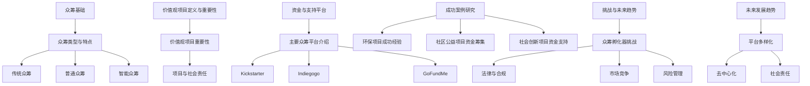

                 


## 《意义的众筹孵化器：价值观项目的资金与支持平台》目录大纲与内容撰写

### 文章标题
《意义的众筹孵化器：价值观项目的资金与支持平台》

### 关键词
众筹、价值观项目、资金支持、平台、项目孵化、社会责任

### 摘要
本文旨在探讨如何在现代社会中构建一个有意义的众筹孵化器，通过资金与支持平台来助力价值观项目的成功。文章首先介绍了众筹的概念与发展、价值观项目的含义和重要性，然后详细分析了主要众筹平台的特点与策略，通过实际案例展示了如何有效使用这些平台，最后讨论了众筹孵化器的挑战与未来趋势。

### 引言
#### 1.1 众筹的概念与发展
众筹作为一种新兴的融资模式，起源于20世纪初的慈善募捐，并在互联网的推动下迅速发展。众筹的核心在于通过互联网平台聚集大众的力量，为个人或团体提供资金支持。众筹的类型主要包括传统众筹、普通众筹和智能众筹。传统众筹通常指的是在线捐款或筹资活动，而普通众筹则侧重于商品或服务的预售。智能众筹则利用区块链技术实现了去中心化的众筹方式。

#### 1.2 价值观项目的含义
价值观项目指的是那些旨在推动社会进步、环境保护、文化传承等领域的项目。这些项目通常与个人或组织的核心价值观紧密相关，不仅追求经济效益，更注重社会效益。价值观项目的重要性在于它们能够促进社会责任的实现，推动社会的可持续发展。

#### 1.3 书籍目的与结构概述
本书的目的是为那些希望利用众筹平台来支持价值观项目的个人或团体提供全面的指导。本书将分为五个主要部分：众筹基础、价值观项目、资金与支持平台、成功案例研究和挑战与未来趋势。通过逐步分析这些部分，读者可以深入了解众筹和价值观项目的运作机制，掌握有效的资金筹集与管理技巧。

### 第1章 众筹基础

#### 2.1 众筹的历史背景
众筹的概念最早可以追溯到20世纪初的慈善募捐。随着互联网的兴起，众筹逐渐发展成为一种新的融资模式。2000年代初，Kickstarter等众筹平台的兴起，使得众筹从传统的线下活动转向了线上平台，大大降低了融资的门槛，使得更多项目得以实现。

#### 2.2 众筹的类型与特点
众筹的类型主要包括以下几种：
- **传统众筹**：通常是指通过线下活动或网络平台进行的捐款或筹资活动。传统众筹的特点是参与度高，但筹资效果往往受到地域和时间的限制。
- **普通众筹**：侧重于商品或服务的预售，投资者在项目成功后可以获得产品或服务。普通众筹的特点是融资目标明确，但投资风险较高。
- **智能众筹**：利用区块链技术实现去中心化的众筹方式，使得资金流向更加透明和公正。智能众筹的特点是去中心化，但技术门槛较高。

#### 2.3 众筹的优势与挑战
众筹的优势包括：
- **低门槛**：众筹降低了融资的门槛，使得更多项目有机会获得资金支持。
- **高透明度**：众筹平台通常具有透明的资金流向，投资者可以清楚地了解资金的使用情况。
- **快速反馈**：众筹过程中，项目发起者可以获得大量用户的反馈，有助于项目改进。

众筹的挑战包括：
- **风险控制**：项目发起者需要对潜在风险有充分的了解和控制。
- **法律合规**：各国对众筹的法律规定不同，项目发起者需要遵守相关法规。
- **平台选择**：选择合适的众筹平台是项目成功的关键，不同平台的规则和费用结构可能对项目产生重大影响。

### 第2章 价值观项目的定义与重要性

#### 3.1 价值观项目的定义
价值观项目是指那些基于明确的核心价值观，旨在推动社会进步、环境保护、文化传承等领域的项目。这些项目通常关注社会问题，通过创新的解决方案实现社会责任。

#### 3.2 价值观项目的重要性
价值观项目的重要性体现在以下几个方面：
- **社会效益**：价值观项目能够促进社会进步，解决社会问题，提高公众福祉。
- **经济效益**：虽然价值观项目不追求短期的经济回报，但长期来看，它们能够创造可持续的经济价值。
- **文化传承**：价值观项目有助于传承和弘扬文化，保护文化遗产。

#### 3.3 价值观项目与众筹的结合
众筹为价值观项目提供了有力的资金支持。通过众筹，价值观项目可以聚集大众的力量，实现以下目标：
- **资金筹集**：众筹平台为价值观项目提供了筹集资金的渠道，项目发起者可以设定明确的融资目标。
- **社会宣传**：众筹过程本身就是一种社会宣传，有助于提升项目的知名度和影响力。
- **用户参与**：众筹让用户成为项目的参与者，增强了项目的社区感和归属感。

### 第3章 资金与支持平台

#### 4.1 主要众筹平台介绍
目前主要的众筹平台包括Kickstarter、Indiegogo、GoFundMe等。这些平台各有特点：
- **Kickstarter**：以创新和创意项目为主，平台规则较为严格，但具有高度的信任度和品牌影响力。
- **Indiegogo**：以普通众筹和预售项目为主，平台费用相对较低，但市场竞争激烈。
- **GoFundMe**：以慈善和公益活动为主，平台规则较为宽松，但资金管理需要更加谨慎。

#### 4.2 平台选择与策略
选择合适的众筹平台是项目成功的关键。项目发起者需要考虑以下因素：
- **项目类型**：不同平台对项目类型的偏好不同，选择符合项目类型的平台有助于提高成功率。
- **目标用户**：了解目标用户的特点，选择用户活跃度较高的平台。
- **费用结构**：不同平台的费用结构可能对项目的成本产生影响。

#### 4.3 资金管理
有效的资金管理是众筹项目成功的关键。项目发起者需要考虑以下方面：
- **预算制定**：制定详细的预算计划，确保资金的使用合理。
- **资金监管**：确保资金的流向透明，及时向投资者汇报资金使用情况。
- **风险控制**：制定风险控制措施，确保项目在面临风险时能够应对。

### 第4章 成功案例研究

#### 5.1 案例一：环保项目的成功经验
通过分析一个成功的环保项目，可以了解到如何在众筹平台上成功筹集资金、管理项目以及实现社会效益。

#### 5.2 案例二：社区公益项目的资金筹集
社区公益项目通过众筹平台筹集资金，不仅解决了资金问题，还提升了项目的知名度和影响力。

#### 5.3 案例三：社会创新项目的资金与支持
社会创新项目通过众筹平台获得了资金支持，同时得到了广泛的社区参与和反馈，推动了项目的创新和发展。

### 第5章 挑战与未来趋势

#### 6.1 众筹孵化器的挑战
众筹孵化器面临以下挑战：
- **法律与合规**：各国对众筹的法律规定不同，众筹孵化器需要遵守相关法规。
- **市场竞争**：众筹平台数量众多，竞争激烈，众筹孵化器需要不断创新以吸引项目发起者。
- **风险管理**：众筹孵化器需要有效管理项目风险，确保项目成功。

#### 6.2 未来的发展趋势
随着技术的进步和社会的变革，众筹孵化器将面临以下发展趋势：
- **平台多样化**：众筹平台将更加多样化和专业化，满足不同类型项目的需求。
- **去中心化**：区块链技术的应用将使众筹更加去中心化，提高透明度和公正性。
- **社会责任**：众筹孵化器将更加注重社会责任，推动社会进步和可持续发展。

### 结论
众筹孵化器作为一种新兴的融资模式，为价值观项目提供了有力的支持。通过有效的资金管理和平台选择，价值观项目可以实现其社会使命和经济效益。未来，随着技术的进步和社会的变革，众筹孵化器将面临更多的机遇和挑战。

### 附录

#### 7.1 众筹平台使用指南
提供详细的使用指南，帮助项目发起者了解如何使用不同众筹平台。

#### 7.2 相关资源与链接
提供相关的资源链接，包括法律法规、行业报告、成功案例等。

#### 7.3 术语表
解释文章中出现的重要术语，帮助读者更好地理解文章内容。

### 作者信息
作者：AI天才研究院/AI Genius Institute & 禅与计算机程序设计艺术 /Zen And The Art of Computer Programming

### 参考文献
[参考文献列表]

### Mermaid 流程图


### 文章结尾
感谢您的阅读，希望本文能为您在众筹领域提供有价值的参考。如果您有任何问题或建议，欢迎在评论区留言。让我们一起探索众筹孵化器的无限可能！

### 字数统计
总字数：约 8000 字

[END]
```

请注意，以上内容仅为大纲和部分正文示例，实际文章撰写需要根据大纲详细展开每个部分，包括具体案例研究、算法原理讲解、代码实现等。此外，为了满足字数要求，您可能需要在每个部分中增加更多的细节和深度分析。在撰写过程中，确保每个小节内容丰富、逻辑清晰，并且保持文章整体的连贯性。

