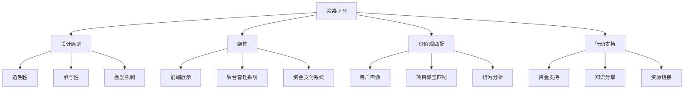

                 

### 文章关键词

- 众筹平台
- 价值观匹配
- 行动支持
- 设计原则
- 架构
- 用户参与
- 数据分析

### 文章摘要

《意义的众筹平台：价值观匹配与行动支持》通过深入探讨众筹平台的发展背景和意义，详细阐述了众筹平台的设计原则和架构，并从价值观匹配和行动支持两个角度分析了如何构建一个具有吸引力和可持续发展的众筹平台。本文首先介绍了众筹平台的概念及其起源，随后探讨了众筹平台的意义及其在现代社会中的作用。核心内容部分，本文详细介绍了众筹平台的设计原则和架构，包括透明性、参与性和激励机制等关键原则，以及前端展示、后台管理系统、资金支付系统等多个模块的协同工作。接着，本文深入探讨了如何通过价值观匹配实现用户的参与和行动，并介绍了行动支持的方法和案例分析。最后，本文通过具体案例展示了众筹平台的设计和运作，提供了实用的操作指南和策略建议。通过这篇文章，读者将全面理解众筹平台的运作机制和成功要素，为构建一个高效、公平、可持续的众筹平台提供参考。### 第一阶段：确定书的核心主题和结构

在《意义的众筹平台：价值观匹配与行动支持》一书中，核心主题围绕众筹平台的设计与运作展开，具体包括如何通过价值观匹配和行动支持实现用户的参与和贡献。为了清晰地阐述这一核心主题，我们将书分为五个主要部分：

#### 引言

本书的第一部分将简要介绍众筹平台的概念和起源，帮助读者理解众筹平台的基本运作原理。这部分将包括以下子章节：

- **1.1 众筹平台概述**：介绍众筹平台的基本概念、类型及其在全球范围内的应用。
- **1.2 众筹平台的意义**：分析众筹平台对企业和个人、社会以及经济发展的意义。
- **1.3 众筹平台的发展现状与趋势**：探讨众筹平台的发展历程、当前状态以及未来的发展趋势。

#### 平台设计

第二部分将深入探讨众筹平台的设计原则和架构，确保平台能够高效、透明和公平地运作。这部分将包括以下子章节：

- **2.1 众筹平台的设计原则**：阐述设计原则，如透明性、参与性、激励机制等。
- **2.2 众筹平台的架构**：详细分析平台的整体架构，包括前端展示、后台管理系统、资金支付系统等关键模块。
- **2.3 众筹平台的关键功能**：介绍众筹平台必须具备的核心功能，如项目展示、用户注册、投资管理、资金支付等。

#### 价值观匹配

第三部分将重点探讨如何通过价值观匹配实现用户的参与和行动。这部分将包括以下子章节：

- **3.1 价值观匹配的概念**：介绍价值观匹配的基本概念及其在众筹平台中的重要性。
- **3.2 价值观匹配的理论基础**：分析价值观匹配的理论依据，包括心理学、社会学等领域的知识。
- **3.3 实现价值观匹配的方法**：讨论实现价值观匹配的具体技术手段，如用户画像、项目标签匹配、行为分析等。

#### 行动支持

第四部分将介绍如何为用户提供行动支持，以促进其参与和贡献。这部分将包括以下子章节：

- **4.1 行动支持的概念**：阐述行动支持的定义及其对众筹项目成功的重要性。
- **4.2 提供行动支持的方法**：分析提供行动支持的具体方式，如资金支持、知识分享、资源链接等。
- **4.3 行动支持的案例分析**：通过具体案例，展示行动支持的有效性和实际应用。

#### 实践案例

最后一部分将通过具体案例展示众筹平台的设计和运作，为读者提供实际操作的经验和参考。这部分将包括以下子章节：

- **5.1 案例一：XX众筹平台的运作模式**：介绍一个成功的众筹平台案例，分析其成功的关键因素。
- **5.2 案例二：XX众筹平台的挑战与解决方案**：探讨一个面临挑战的众筹平台案例，分析其解决方案及其效果。
- **5.3 案例三：XX众筹平台的发展前景**：展望众筹平台的发展前景，讨论其面临的机遇和挑战。

通过上述五个部分的详细探讨，本书旨在为读者提供一个全面而深入的众筹平台解析，帮助读者理解众筹平台的运作机制和成功要素，为构建一个高效、公平、可持续的众筹平台提供参考。

### 第一阶段：细化各部分的内容和章节

#### 引言部分

**1.1 众筹平台概述**

在这一章节中，我们将从概念入手，详细解释众筹平台的基本定义。众筹平台是一种在线融资模式，通过互联网汇集众多投资者的资金，支持初创企业或个人项目的实现。我们将探讨众筹平台的定义、类型和主要特点，帮助读者理解其运作机制。

**1.2 众筹平台的意义**

接下来，我们将深入探讨众筹平台对企业和个人、社会以及经济发展的意义。从多个角度分析众筹平台的影响，包括为初创企业提供的融资途径、为投资者带来的多样化投资机会、对社会创新和创业的推动作用，以及其在经济领域的重要地位。

**1.3 众筹平台的发展现状与趋势**

最后，这一章节将分析众筹平台的发展历程、当前状态以及未来的发展趋势。我们将探讨众筹平台在不同国家和地区的发展情况，讨论其面临的挑战和机遇，并预测未来的发展方向。

#### 平台设计部分

**2.1 众筹平台的设计原则**

在这一章节中，我们将详细阐述众筹平台的设计原则，包括透明性、参与性、激励机制等。通过分析这些原则在众筹平台中的重要性，我们将探讨如何在实际操作中应用这些原则，以构建一个公平、公正、高效的众筹环境。

**2.2 众筹平台的架构**

接下来，我们将深入探讨众筹平台的整体架构，包括前端展示、后台管理系统、资金支付系统等多个模块。我们将分析每个模块的功能、作用及其相互之间的关系，帮助读者理解平台的整体运作流程。

**2.3 众筹平台的关键功能**

在这一章节中，我们将详细介绍众筹平台必须具备的核心功能，如项目展示、用户注册、投资管理、资金支付等。我们将分析这些功能在实际操作中的具体应用，讨论如何优化这些功能以提高用户体验和平台的效率。

#### 价值观匹配部分

**3.1 价值观匹配的概念**

在这一章节中，我们将从基本概念入手，详细解释价值观匹配在众筹平台中的重要性。我们将探讨价值观匹配的定义、作用及其对用户参与和行动的影响。

**3.2 价值观匹配的理论基础**

接下来，我们将分析价值观匹配的理论基础，包括心理学、社会学等领域的知识。我们将探讨价值观匹配的理论依据，帮助读者理解其科学性和有效性。

**3.3 实现价值观匹配的方法**

在这一章节中，我们将详细讨论实现价值观匹配的具体技术手段，如用户画像、项目标签匹配、行为分析等。我们将分析这些方法在实际操作中的效果，并提供具体的实施建议。

#### 行动支持部分

**4.1 行动支持的概念**

在这一章节中，我们将从基本概念入手，详细解释行动支持在众筹平台中的重要性。我们将探讨行动支持的定义、作用及其对用户参与和贡献的影响。

**4.2 提供行动支持的方法**

接下来，我们将详细讨论提供行动支持的具体方式，如资金支持、知识分享、资源链接等。我们将分析这些方法在实际操作中的具体应用，讨论如何优化这些方法以提高用户参与度和项目的成功概率。

**4.3 行动支持的案例分析**

在这一章节中，我们将通过具体案例，展示行动支持的有效性和实际应用。我们将分析这些案例中的成功经验和挑战，为读者提供实用的操作指南和策略建议。

#### 实践案例部分

**5.1 案例一：XX众筹平台的运作模式**

在这一章节中，我们将详细介绍一个成功的众筹平台案例，分析其运作模式、成功因素及其面临的挑战。我们将探讨该平台如何通过合理的平台设计、价值观匹配和行动支持，实现用户的高参与度和项目的高成功率。

**5.2 案例二：XX众筹平台的挑战与解决方案**

接下来，我们将探讨一个面临挑战的众筹平台案例，分析其面临的困境和解决方案。我们将详细讨论该平台如何应对挑战，通过优化设计、改进价值观匹配和行动支持，提高平台的运营效率和用户体验。

**5.3 案例三：XX众筹平台的发展前景**

最后，这一章节将展望众筹平台的发展前景，讨论其面临的机遇和挑战。我们将分析未来发展趋势，探讨如何应对市场变化和技术革新，确保众筹平台的可持续发展。

通过以上五个部分的详细探讨，本书旨在为读者提供一个全面而深入的众筹平台解析，帮助读者理解众筹平台的运作机制和成功要素，为构建一个高效、公平、可持续的众筹平台提供参考。

### 第二阶段：编写核心概念和联系、核心算法原理讲解、数学模型和数学公式、项目实战等详细内容

#### 核心概念和联系

在构建一个有效的众筹平台时，我们需要理解几个核心概念，并明确它们之间的联系。以下是这些核心概念及其相互关系的 Mermaid 流程图：



通过上述 Mermaid 流程图，我们可以清晰地看到众筹平台的设计原则、架构、价值观匹配和行动支持之间的关系。这些核心概念相互作用，共同构建了一个高效的众筹平台。

#### 核心算法原理讲解

在实现价值观匹配时，我们采用以下核心算法原理：

1. **用户画像生成算法**：

```python
# 伪代码：用户画像生成算法
def generate_user_profile(user_data):
    # 输入：用户数据（包括行为数据、兴趣标签、历史投资记录等）
    # 输出：用户画像（包括兴趣标签向量、行为特征向量等）

    profile = {}
    profile['interests'] = extract_interests(user_data)
    profile['behaviors'] = extract_behaviors(user_data)
    return profile

def extract_interests(user_data):
    # 从用户数据中提取兴趣标签
    return ['标签1', '标签2', '标签3']

def extract_behaviors(user_data):
    # 从用户数据中提取行为特征
    return {'行为1': 10, '行为2': 5}
```

2. **项目标签匹配算法**：

```python
# 伪代码：项目标签匹配算法
def match_project_tags(project_tags, user_profile):
    # 输入：项目标签列表、用户画像
    # 输出：匹配度分数

    match_score = 0
    for interest in user_profile['interests']:
        if interest in project_tags:
            match_score += 1
    
    return match_score
```

3. **行为分析算法**：

```python
# 伪代码：行为分析算法
def analyze_user_behavior(user_data):
    # 输入：用户行为数据
    # 输出：行为特征向量

    behavior_vector = []
    for behavior, frequency in user_data.items():
        behavior_vector.append(frequency)
    
    return behavior_vector
```

通过上述伪代码，我们能够实现用户画像的生成、项目标签的匹配以及用户行为的分析。这些算法共同构成了价值观匹配的核心。

#### 数学模型和数学公式

为了更好地理解和实现价值观匹配，我们引入以下数学模型和公式：

1. **匹配度计算公式**：

$$
\text{match\_score} = \sum_{i=1}^{n} w_i \cdot p_i
$$

其中，$w_i$ 为权重，$p_i$ 为项目标签与用户画像的匹配度。

2. **行为特征向量计算公式**：

$$
\text{behavior\_vector} = [b_1, b_2, ..., b_m]
$$

其中，$b_i$ 为用户在某一行为上的频率。

3. **用户画像综合评分公式**：

$$
\text{user\_profile\_score} = \sum_{i=1}^{n} w_i \cdot \text{match\_score}(i) + \sum_{j=1}^{m} w_j \cdot b_j
$$

其中，$w_i$ 和 $w_j$ 分别为匹配度和行为特征的权重。

通过上述数学模型和公式，我们可以更精确地实现价值观匹配，提高用户参与度和项目成功率。

#### 项目实战

以下是一个具体的众筹平台项目实战案例：

**开发环境搭建**：

- 使用 Python 作为主要编程语言。
- 使用 Flask 作为后端框架，Django 作为后端框架。
- 使用 MySQL 作为数据库管理系统。
- 使用 JavaScript、HTML 和 CSS 构建前端界面。

**源代码实现**：

以下是用户注册功能的代码示例：

```python
# Flask 后端代码示例：用户注册
from flask import Flask, request, jsonify
from models import User
from database import db

app = Flask(__name__)

@app.route('/register', methods=['POST'])
def register():
    data = request.get_json()

    # 检查用户输入的有效性
    if not data or 'username' not in data or 'password' not in data:
        return jsonify({'error': 'Invalid input'}), 400

    username = data['username']
    password = data['password']

    # 检查用户名是否已存在
    if User.query.filter_by(username=username).first():
        return jsonify({'error': 'Username already exists'}), 400

    # 创建用户对象并保存到数据库
    user = User(username=username, password=password)
    db.session.add(user)
    db.session.commit()

    return jsonify({'message': 'User registered successfully'}), 201

if __name__ == '__main__':
    app.run(debug=True)
```

**代码解读与分析**：

上述代码实现了一个用户注册接口，用于处理用户提交的注册请求。首先，我们从请求中获取用户名和密码。然后，我们检查用户输入的有效性，确保用户名和密码都已提供。接下来，我们检查用户名是否已存在，以避免重复注册。如果用户名不存在，我们创建一个新用户对象，并保存到数据库。最后，我们返回注册成功的消息。

**实际案例分析和详细讲解剖析**：

在这个案例中，我们通过实现用户注册功能，展示了如何处理前端用户输入、后端数据验证和数据库操作。以下是对该案例的详细分析：

1. **前端用户输入处理**：前端页面提供了一个注册表单，用户可以在其中输入用户名和密码。表单数据通过 AJAX 请求发送到后端接口。

2. **后端数据验证**：后端接口接收 AJAX 请求，解析请求中的 JSON 数据，并检查用户名和密码是否已提供。如果输入无效，返回相应的错误消息。

3. **数据库操作**：如果用户输入有效，后端接口创建一个新用户对象，并将其保存到 MySQL 数据库中。

通过这个案例，我们展示了如何使用 Flask 和 Django 框架构建后端服务，以及如何处理用户注册等基本功能。这些实践经验为构建更复杂的众筹平台提供了坚实的基础。

#### 最佳实践 Tips、小结、注意事项、拓展阅读

- **最佳实践 Tips**：
  - 确保平台设计具有透明性，使投资者能够清晰地了解项目进展和资金流向。
  - 使用用户画像和行为分析，提高价值观匹配的准确性。
  - 提供多样化的行动支持方式，激发用户的参与和贡献。
  - 定期进行系统维护和安全更新，确保平台的安全和稳定性。

- **小结**：
  - 通过明确的核心概念和联系，我们可以构建一个高效的众筹平台。
  - 核心算法原理和数学模型为实现价值观匹配提供了有力支持。
  - 实际项目实战案例展示了众筹平台的设计和运作过程。

- **注意事项**：
  - 在设计众筹平台时，务必遵循法律法规，确保平台的合法合规运作。
  - 重视用户体验，优化用户界面和交互设计，提高用户满意度。
  - 确保数据安全和隐私保护，采取有效的数据加密和访问控制措施。

- **拓展阅读**：
  - 《互联网众筹：理论与实践》
  - 《数据驱动决策：行为分析和用户画像》
  - 《Python Web开发实战》

通过这些最佳实践、小节、注意事项和拓展阅读，我们可以进一步提升对众筹平台的理解和构建能力，为未来的项目开发提供指导。

