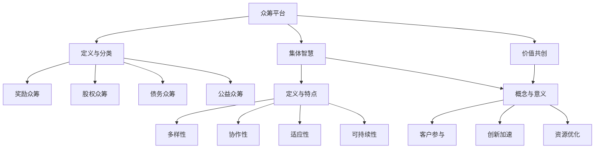
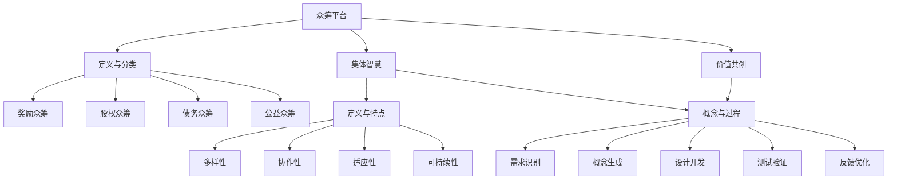

                 

### 引言

《意义的众筹平台：集体智慧时代的价值共创》这本书的目标是深入探讨众筹平台如何通过集体智慧和价值共创实现社会和经济的双重效益。在这个数字化时代，众筹平台已经成为一种新型的融资和创业模式，它通过互联网连接了无数的资金需求者和投资者，促进了资源的有效配置和创意的实现。随着集体智慧的应用越来越广泛，这本书旨在揭示如何将集体智慧和价值共创这一新兴概念应用到众筹平台中，以提升其效率和可持续性。

本书的主要读者对象包括创业者和投资者、金融科技从业者、学术界研究人员以及对创新融资模式感兴趣的一般读者。通过这本书，读者将了解众筹平台的基础知识、集体智慧的理论和实践、以及如何通过价值共创实现更有效的众筹活动。书中还包含多个实际案例，通过这些案例的分析，读者可以学习到成功和失败的经验教训。

本书的背景可以追溯到互联网技术的迅猛发展和金融创新的不断推进。众筹平台的兴起为小企业和个人提供了前所未有的融资渠道，同时也为投资者带来了更多的投资机会。然而，如何有效利用集体智慧和实现价值共创，一直是学术界和业界探讨的热点话题。这本书正是为了填补这一领域的知识空白，提供系统、全面的理论和实践指导。

在接下来的章节中，我们将首先介绍众筹平台的基本概念，包括其历史、定义和分类。接着，我们将深入探讨集体智慧的理论基础和特点，以及它如何影响众筹平台的运作。随后，我们将讨论价值共创的概念、过程和实现方式，并分析集体智慧在众筹平台中的应用。通过案例分析，我们将展示理论和实践的结合，探讨成功和失败的原因。最后，我们将总结全书的主要内容，并对众筹平台的发展趋势进行展望。

### 核心概念

#### 4. 众筹平台的概念与分类

**4.1 众筹平台的定义**

众筹平台，通常指的是通过互联网媒介，集合众多小额投资者的资金，以支持创意项目、初创企业或个人创新活动的在线融资平台。这种模式的核心在于利用网络的力量，将分散的资金集中起来，从而实现融资目标。

众筹平台的发展可以追溯到20世纪末，最早的众筹平台如Kickstarter和Indiegogo成立于2009年左右。这些平台的出现，打破了传统融资方式的局限，使得资金需求者能够直接接触到潜在的投资者，而无需通过中介机构。

**4.2 众筹平台的分类**

根据融资目标和方式的不同，众筹平台可以分为以下几种类型：

1. **奖励众筹（Rewards Crowdfunding）**：这是最普遍的众筹模式，投资者通过支持项目获得回报，如产品、服务或特权。Kickstarter和Indiegogo就是典型的奖励众筹平台。

2. **股权众筹（Equity Crowdfunding）**：投资者通过众筹平台购买初创企业的股权，成为股东。这种模式适用于想要获得资金和投资者的初创公司。

3. **债务众筹（Debt Crowdfunding）**：投资者通过众筹平台提供债务融资，如贷款或债券，企业偿还债务本息。这种模式类似于传统的借贷，但通过众筹平台实现。

4. **公益众筹（Charity Crowdfunding）**：资金主要用于慈善和非营利项目，如灾难救济、环保活动等。

**4.3 集体智慧的定义**

集体智慧（Collective Intelligence），指的是由多个个体组成的群体，通过协作和互动，共同解决问题或创造知识的过程。它强调的是群体成员之间的信息共享、协同工作和决策制定。

**4.4 集体智慧的特点**

- **多样性**：集体智慧依赖于多样化的观点和知识，个体之间的差异能够促进创新和问题解决。
- **协作性**：集体智慧需要群体成员之间的合作和协调，个体需要为共同的目标努力。
- **适应性**：集体智慧能够快速适应环境变化，通过不断的反馈和调整，提高整体效率。
- **可持续性**：集体智慧能够长期维持，依赖于成员之间的信任和持续的互动。

**4.5 价值共创的概念**

价值共创（Value Co-creation）指的是多个利益相关者（如消费者、企业、供应商等）共同创造和分享价值的过程。它强调的是利益相关者在产品或服务开发、使用和维护中的协作。

**4.6 价值共创的意义**

- **客户参与**：通过价值共创，客户能够参与到产品或服务的开发过程中，提高其满意度和忠诚度。
- **创新加速**：价值共创能够加速创新，通过多方的合作，可以更快地开发和推广新产品或服务。
- **资源优化**：通过共享资源和知识，企业能够更有效地利用资源，降低成本。

### 核心概念之间的关系架构

为了更清晰地展示这些核心概念之间的关系，我们可以使用Mermaid流程图来表示。以下是一个简化的Mermaid流程图示例：

这个流程图展示了众筹平台、集体智慧和价值共创这三个核心概念及其子概念之间的关系，帮助读者更直观地理解它们之间的相互作用和影响。

#### 5. 集体智慧的理论基础与特点

**5.1 集体智慧的定义**

集体智慧（Collective Intelligence）是一种通过个体间的协作和互动，共同解决问题或创造知识的复杂系统。其核心在于多个个体通过共享信息、协同工作和共同决策，形成一个能够实现更高水平认知和效率的群体。

**5.2 集体智慧的理论基础**

集体智慧的理论基础可以追溯到多个学科领域，包括社会科学、认知科学、计算机科学和系统科学等。以下是一些重要的理论基础：

- **社会网络理论**：强调个体之间的连接和互动如何影响整个群体的行为和性能。
- **复杂性科学**：探讨复杂系统中的自组织现象，如何通过个体之间的相互作用产生集体行为。
- **分布式智能**：研究个体如何通过协作实现比单个个体更为复杂的任务。
- **机器学习和人工智能**：利用算法和技术来模拟和增强集体智慧。

**5.3 集体智慧的特点**

1. **多样性**：集体智慧依赖于个体之间的多样性和差异性。多样化的观点和知识可以促进创新和问题解决，避免群体思维和偏见。
   
2. **协作性**：集体智慧强调个体之间的协作和互动。有效的沟通和协作机制是集体智慧形成的关键。
   
3. **适应性**：集体智慧能够快速适应环境变化。通过不断的反馈和调整，集体智慧可以优化其行为和策略。
   
4. **可持续性**：集体智慧能够长期维持，依赖于成员之间的信任和持续的互动。

**5.4 集体智慧的作用**

1. **问题解决**：集体智慧通过共享信息和协同工作，可以更有效地解决复杂问题，尤其是那些无法通过单一个体解决的问题。

2. **决策制定**：集体智慧可以提供更全面和多样化的决策选项，减少个体决策的偏见和错误。

3. **创新促进**：集体智慧通过多样化的观点和协作，可以加速创新过程，促进新想法的产生和实施。

4. **资源优化**：集体智慧可以通过共享资源和知识，提高整体效率和生产力，减少浪费。

#### 6. 价值共创的概念

**6.1 价值共创的定义**

价值共创（Value Co-creation）是指多个利益相关者（如消费者、企业、供应商等）共同创造和分享价值的过程。它强调的是利益相关者在产品或服务开发、使用和维护中的协作，通过这种协作，各方能够共同实现价值最大化。

**6.2 价值共创的过程**

价值共创的过程可以概括为以下几个阶段：

1. **需求识别**：通过市场研究和消费者反馈，识别和明确价值共创的目标和需求。
   
2. **概念生成**：利益相关者共同探讨和生成产品或服务的概念，提出新的想法和解决方案。
   
3. **设计开发**：在利益相关者的参与下，进行产品或服务的设计和开发，不断迭代和优化。
   
4. **测试验证**：通过实际使用和测试，验证产品或服务的性能和用户满意度。
   
5. **反馈优化**：根据用户反馈，进一步优化产品或服务，实现持续的改进。

**6.3 价值共创的意义**

1. **客户参与**：通过价值共创，客户能够参与到产品或服务的开发过程中，提高其满意度和忠诚度。
   
2. **创新加速**：价值共创能够加速创新，通过多方的合作，可以更快地开发和推广新产品或服务。
   
3. **资源优化**：通过共享资源和知识，企业能够更有效地利用资源，降低成本。

### 核心概念之间的关系架构

为了更直观地展示这些核心概念之间的关系，我们可以使用Mermaid流程图来表示。以下是一个简化的Mermaid流程图示例：

这个流程图展示了众筹平台、集体智慧和价值共创这三个核心概念及其子概念之间的关系，帮助读者更直观地理解它们之间的相互作用和影响。

#### 7. 众筹平台的运作流程

众筹平台的运作流程是确保项目成功融资的关键环节，涉及多个参与者的互动和协作。以下是众筹平台运作流程的详细解析：

**7.1 参与者的角色**

在众筹平台中，主要的参与者包括：

- **项目发起人**：项目的主要推动者和资金需求者。他们需要制定项目计划、设定目标，并编写项目介绍和回报计划。
- **投资者（支持者）**：对项目感兴趣并愿意出资的个体或机构。他们通过平台捐款，以换取项目回报或其他奖励。
- **平台运营团队**：负责平台的日常运营、项目审核、资金管理和技术支持等。他们是确保众筹过程顺利进行的中枢。
- **第三方服务机构**：如法律顾问、审计机构等，为项目发起人和投资者提供专业服务，确保交易的合法性和透明度。

**7.2 项目评估与筛选**

项目评估和筛选是众筹平台的核心环节之一。以下步骤通常包括：

1. **初步审核**：平台运营团队对项目的可行性和合法性进行初步审核，确保项目内容符合平台规定。
2. **详细评估**：通过第三方服务机构进行更深入的法律、财务和市场评估。这一环节可能包括项目团队的背景调查、项目计划的可行性分析和财务预测等。
3. **项目展示**：通过平台向投资者展示经过审核和评估的项目，同时提供详细的项目介绍、回报计划和时间表。

**7.3 资金筹集**

资金筹集阶段是众筹平台的核心。以下步骤通常包括：

1. **公开宣传**：项目发起人通过平台宣传其项目，吸引投资者关注和参与。这通常包括社交媒体推广、项目页面优化和合作伙伴关系等。
2. **投资者参与**：投资者通过平台了解项目详情，并决定是否投资。投资者可以选择不同额度的投资，以获得相应的回报。
3. **资金锁定**：在众筹目标达成后，平台会锁定筹集到的资金，并将其暂时保存，以备后续支付。

**7.4 资金支付**

资金支付阶段是确保资金安全的重要环节。以下步骤通常包括：

1. **项目完成**：项目发起人需要在约定时间内完成项目，并将回报寄送给投资者。
2. **资金释放**：在项目完成并通过平台审核后，平台会将筹集到的资金释放给项目发起人。
3. **资金退还**：如果项目未能在规定时间内完成，平台会按照事先约定的规则退还投资者的资金。

**7.5 风险与挑战**

众筹平台在运作过程中面临多种风险和挑战，以下是一些常见的问题：

1. **项目质量风险**：项目发起人可能无法按时完成项目或项目质量不达标，影响投资者的利益。
2. **资金风险**：众筹过程中可能出现资金筹集不足或资金被挪用的问题。
3. **法律和合规风险**：众筹平台和项目发起人可能面临法律和合规方面的挑战，如违反金融法规或消费者权益保护法等。
4. **市场风险**：市场环境的变化可能影响项目的成功和投资者的收益。

为了应对这些风险和挑战，众筹平台需要建立完善的风险管理和合规机制，包括项目审核标准、资金管理流程、用户保护和法律咨询等。

通过上述运作流程的详细解析，我们可以看到众筹平台如何通过多个参与者的协作，实现项目的成功融资和实施。这不仅需要有效的平台运营和项目管理，还需要对潜在风险有清晰的认识和应对策略。

#### 8. 集体智慧在众筹平台中的应用

**8.1 集体智慧在项目评估中的应用**

集体智慧在众筹平台的项目评估中发挥了重要作用。通过集合多个投资者的观点和经验，可以更全面和准确地评估项目的风险和潜力。具体应用包括：

1. **投资者筛选**：在项目发布前，众筹平台可以借助集体智慧对投资者进行筛选，识别出有经验和信誉的投资者。这可以通过建立投资者评级系统和推荐机制实现。
2. **项目反馈**：项目发布后，投资者可以实时提供反馈，包括对项目的可行性、创新性和市场前景的评价。这些反馈可以汇总并用于后续的项目评估。
3. **风险评估**：通过分析投资者的反馈和历史数据，平台可以构建风险评估模型，预测项目的成功概率和潜在风险。这种模型可以基于机器学习和数据分析技术，以提高评估的准确性和效率。

**8.2 集体智慧在项目推广中的应用**

集体智慧在项目的推广中也具有重要意义。以下是一些具体的应用方式：

1. **社交媒体营销**：投资者在社交媒体上分享项目信息，通过口碑传播吸引更多潜在投资者。这种基于信任的传播方式可以显著提升项目的知名度。
2. **投资者社区**：众筹平台可以建立投资者社区，鼓励投资者之间的交流和合作。这不仅可以增加投资者的参与度，还可以通过集体智慧提升项目的推广效果。
3. **众筹竞赛**：平台可以举办众筹竞赛，鼓励投资者和项目发起人共同参与，通过集体智慧选出最佳项目，同时提升平台的整体声誉。

**8.3 集体智慧在价值共创中的作用**

集体智慧在价值共创中发挥了核心作用，通过以下方式实现：

1. **需求识别**：通过集体智慧，平台可以收集和分析大量用户需求，帮助项目发起人更好地理解市场需求，从而开发出更符合用户期望的产品或服务。
2. **创新加速**：集体智慧能够加速创新过程，通过多个投资者的共同参与和协作，可以更快地生成和验证新想法，降低创新成本和风险。
3. **资源优化**：集体智慧通过共享资源和知识，可以实现资源的最优配置，减少浪费，提高整体效率。

**案例研究：Kickstarter与集体智慧的应用**

Kickstarter是一个成功的众筹平台，其成功部分归功于对集体智慧的充分利用。以下是一个案例研究：

1. **项目评估**：Kickstarter通过社区的反馈和数据分析，对项目进行初步筛选和评估。社区成员的投票和评论为平台提供了宝贵的参考信息，提高了项目评估的准确性。
2. **项目推广**：Kickstarter鼓励项目发起人和投资者通过社交媒体和社区进行推广，利用集体智慧的力量扩大项目的影响力。许多成功项目都得益于投资者的广泛传播。
3. **价值共创**：Kickstarter通过建立一个开放、透明的平台，促进了项目发起人和投资者之间的互动和合作。许多项目在成功融资后，通过与投资者的持续交流，不断优化和改进，实现了价值共创。

通过上述案例，我们可以看到集体智慧在众筹平台中的广泛应用和重要性。它不仅提高了项目评估和推广的效率，还推动了价值共创，为众筹平台的成功运作提供了强有力的支持。

#### 9. 价值共创的具体方式

**9.1 项目发起人与支持者之间的互动**

在众筹平台中，项目发起人与支持者之间的互动是价值共创的核心。以下是一些关键互动方式：

1. **项目介绍和反馈**：项目发起人通过详细的项目介绍、视频演示和FAQ（常见问题解答）与支持者沟通，解释项目的背景、目标和预期成果。同时，支持者可以通过评论、提问和投票等方式提供反馈，帮助发起人优化项目。
2. **实时互动**：许多众筹平台提供实时聊天或社区功能，支持者可以在平台上直接与发起人交流，讨论项目细节和进度。这种互动方式不仅可以增强信任，还可以帮助发起人及时调整项目策略。
3. **奖励计划**：项目发起人通常会设计不同的奖励计划，以激励支持者的参与。这些奖励可以是产品、服务、签名版或特别活动等。通过这种形式，支持者在享受回报的同时，也参与到项目的创造过程中。

**9.2 众筹平台与其他合作伙伴的合作**

众筹平台通过与各类合作伙伴的合作，可以进一步拓展价值共创的范围。以下是一些常见合作方式：

1. **营销合作**：众筹平台可以与营销公司、公关公司或社交媒体平台合作，通过多元化的营销手段提高项目曝光率。这种合作可以包括联合推广活动、品牌代言或广告投放等。
2. **法律和财务顾问**：众筹平台可以与律师事务所、会计师事务所等专业机构合作，为项目发起人和投资者提供法律和财务咨询服务。这种合作有助于确保项目的合法性和透明度，降低风险。
3. **技术创新**：众筹平台可以与技术公司或研发机构合作，引入新的技术和工具，提升平台的服务质量和用户体验。例如，使用区块链技术增强资金的安全性，或使用人工智能分析投资者行为和项目风险。

**9.3 成功与失败的案例对比分析**

通过对比分析成功和失败的众筹项目，我们可以更深入地理解价值共创的实现方式。

**成功案例**：

1. **Case A**：一个智能家居设备的众筹项目，通过详细的项目介绍、互动社区和用户反馈，成功吸引了大量投资者。项目发起人与支持者之间的紧密互动和持续的优化，使项目在短时间内完成了目标，并在后续开发中不断改进，最终实现了产品的成功上市。

**失败案例**：

1. **Case B**：一个虚拟现实头显的众筹项目，由于项目介绍不详细、缺乏市场调研，以及项目进展缓慢，导致投资者失去信心。最终，项目未能完成，资金损失严重。

**分析**：

成功案例的成功在于以下几个方面：

- **透明和互动**：项目发起人通过详细的介绍和持续的互动，建立了与支持者的信任关系。
- **灵活调整**：项目发起人根据支持者的反馈和市场需求，及时调整项目计划，提高了项目的适应性和成功率。
- **市场调研**：在项目启动前进行了充分的市场调研，确保项目具有可行性和市场潜力。

失败案例的失败主要在于以下几个方面：

- **沟通不畅**：项目发起人与支持者之间的沟通不足，导致投资者对项目进展和回报计划不清楚。
- **计划不周**：项目缺乏详细的市场调研和可行性分析，导致项目在实施过程中遇到诸多困难。
- **缺乏灵活性**：项目发起人未能根据实际情况调整计划，导致项目进展缓慢，最终失败。

通过这些案例的对比分析，我们可以得出以下结论：

- **互动与透明**：项目发起人与支持者之间的互动和透明度是价值共创的关键。
- **市场调研和计划**：充分的市场调研和周密的计划是项目成功的基础。
- **灵活调整**：根据实际情况及时调整项目策略，是应对不确定性的有效手段。

#### 10. 成功案例解析

**10.1 案例一：某知名众筹平台的成功案例**

某知名众筹平台（平台名称：PledgeMe）在其运营过程中，通过充分利用集体智慧和价值共创，取得了显著的成就。以下是该平台的一个成功案例：

**项目背景**：

项目名称：太阳能充电宝
项目发起人：一家新西兰初创公司
融资目标：10万新西兰元
项目描述：开发一种便携式太阳能充电宝，旨在为户外活动爱好者提供便捷的电力解决方案。

**过程描述**：

1. **项目筹备**：项目发起人进行了详细的市场调研，确定了项目的可行性和市场需求。他们编写了详细的项目介绍，包括产品功能、技术细节和预期收益。

2. **平台发布**：项目在PledgeMe平台上线，发起人通过平台宣传项目，吸引了大量投资者的关注。项目页面包含了详细的视频介绍、回报计划和进度更新。

3. **投资者参与**：投资者通过平台捐款，支持项目的发展。平台提供了多种投资选项，包括普通投资和股权投资，以满足不同投资者的需求。

4. **互动与反馈**：项目发起人与支持者之间保持了密切的互动。通过实时聊天和社区讨论，发起人不断收集投资者的意见和建议，优化项目设计和回报计划。

5. **资金筹集**：在一个月内，项目成功筹集了超过20万新西兰元，远远超出预期目标。这得益于集体智慧和价值共创的应用，投资者对项目的信任和热情。

6. **项目执行**：项目发起人根据筹集到的资金，加快了研发和生产进度。他们与供应商和制造商紧密合作，确保产品质量和交付时间。

7. **产品发布**：太阳能充电宝在预定时间内成功上市，并通过众筹平台进行销售。产品获得了市场的高度评价，用户反馈积极。

**成功原因**：

1. **透明和互动**：项目发起人通过平台保持了与支持者的透明沟通，及时更新项目进展，建立了信任关系。

2. **市场调研**：项目发起人在项目筹备阶段进行了充分的市场调研，确保项目具有可行性和市场需求。

3. **灵活调整**：根据投资者的反馈和市场需求，项目发起人及时调整了项目设计和回报计划，提高了项目的适应性和成功率。

4. **集体智慧**：平台充分利用了集体智慧，通过投资者的参与和反馈，优化了项目设计和运营策略。

**10.2 案例二：其他成功众筹项目的分析**

除了上述案例，还有一些其他成功的众筹项目，以下是它们的共同特点：

1. **高质量项目**：这些项目在筹备阶段就进行了详细的市场调研和技术验证，确保项目具有高可行性和创新性。

2. **透明沟通**：项目发起人通过平台与支持者保持了透明和及时的沟通，建立了信任关系。

3. **互动社区**：平台提供了互动社区，支持者可以分享意见和反馈，促进了项目的优化和改进。

4. **灵活调整**：项目发起人根据投资者的反馈和市场变化，灵活调整项目计划和回报方案。

5. **优质回报**：项目提供了丰富和有吸引力的回报方案，激励了投资者的参与和支持。

通过这些成功案例的分析，我们可以看到集体智慧和价值共创在众筹平台中的重要作用。它们不仅提高了项目的成功概率，还促进了投资者的参与和信任，实现了社会和经济的双重效益。

### 11. 失败案例与教训

**11.1 失败原因分析**

尽管众筹平台提供了创新的融资方式，但并不是所有项目都能成功。以下是一些常见的失败原因：

1. **项目质量不高**：一些项目在筹备阶段缺乏充分的市场调研和技术验证，导致项目本身不具备可行性或市场吸引力。

2. **沟通不畅**：项目发起人与支持者之间的沟通不足，导致投资者对项目进展和回报计划不清楚，从而失去信心。

3. **计划不周**：项目缺乏详细的市场调研和可行性分析，导致在实施过程中遇到诸多困难。

4. **灵活性不足**：项目发起人未能根据实际情况调整计划，导致项目进展缓慢，最终失败。

5. **法律和合规问题**：一些项目在法律和合规方面存在问题，如未获得必要的许可或违反金融法规，导致项目无法继续。

**11.2 教训与反思**

从失败案例中，我们可以吸取以下教训：

1. **充分调研**：在项目筹备阶段，进行充分的市场调研和技术验证，确保项目具有可行性和市场潜力。

2. **透明沟通**：与支持者保持透明和及时的沟通，及时更新项目进展，建立信任关系。

3. **灵活调整**：根据实际情况和市场变化，灵活调整项目计划和回报方案。

4. **合规操作**：确保项目在法律和合规方面没有任何问题，遵守相关金融法规和消费者权益保护法。

5. **优质回报**：设计有吸引力的回报方案，激励投资者的参与和支持。

通过反思失败案例，我们可以更好地理解如何避免失败，确保众筹项目的成功。

### 结论

《意义的众筹平台：集体智慧时代的价值共创》这本书深入探讨了众筹平台在集体智慧和价值共创背景下的运作机制和发展趋势。我们首先介绍了众筹平台的基本概念和分类，详细分析了集体智慧的理论基础和特点，以及价值共创的概念和过程。接着，我们探讨了众筹平台的运作流程，集体智慧在项目评估和推广中的应用，以及价值共创的具体实现方式。通过成功和失败案例的分析，我们总结了众筹平台的成功经验和教训。

展望未来，众筹平台将继续发展，利用人工智能和大数据技术提升项目评估和推广效率。同时，众筹平台需要更加注重透明度和合规性，确保投资者的权益。此外，价值共创将更加深入人心，通过多方的协作和共享，实现更高的社会和经济价值。总之，众筹平台在集体智慧时代的价值共创中，将继续发挥重要作用，推动社会和经济的进步。

### 拓展阅读

为了深入了解众筹平台、集体智慧和价值共创，以下是一些推荐的拓展阅读资源：

1. **书籍**：
   - 《众筹革命：如何通过众筹平台成功融资》（《The Crowdfunding Revolution: How to Raise Cash for Your Business Through Internet Fundraising Platforms》）作者：John Philips。
   - 《集体智慧：社会智能如何改变我们的世界》（《Collective Intelligence: Creating a Prosperous World at Scale》）作者：Peter H. Diamandis 和 Steven Kotler。

2. **学术论文**：
   - “Crowdfunding Platforms and Collective Wisdom: A Theoretical Framework”作者：AnnaLee Saxenian。
   - “Value Co-creation in Crowdfunding: A Multilevel Perspective”作者：Floriane Sallier 和 Didier Bonnet。

3. **行业报告**：
   - “2023年全球众筹市场报告”（《2023 Global Crowdfunding Market Report》）作者：Massolution。

4. **在线课程**：
   - Coursera上的“Crowdfunding and Entrepreneurship”课程，提供关于众筹平台运营和创业融资的深入讲解。

通过这些资源，读者可以进一步了解众筹平台的发展趋势、集体智慧和价值共创的理论基础和实践应用，为未来的研究和实践提供有价值的参考。

