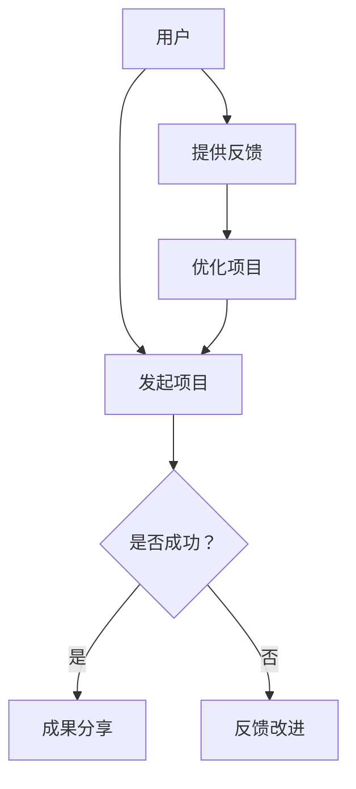

                 

### 第1章 引言

#### 1.1 书籍背景与目的

在现代社会，随着互联网技术的飞速发展，信息的获取和传播变得更加便捷，然而这也带来了一个显著的问题——信息过载。大量的信息让人们难以分辨哪些是有价值的，哪些是无关的，甚至有些人因此产生了严重的焦虑感。如何有效地筛选和处理这些信息，成为了亟待解决的问题。在这一背景下，众筹智库作为一种新型的信息处理和知识共享平台，逐渐受到了广泛关注。

众筹智库，顾名思义，是将众筹模式与智库功能相结合的产物。它不仅为个体提供了获取资金和支持的渠道，同时也为集体智慧提供了一个交流和协作的平台。通过众筹，人们可以共同出资支持某个项目或研究，而智库则负责对这些项目或研究进行科学评估和分析，从而得出有价值的结论或解决方案。

本书旨在探讨众筹智库这一新型平台的发展现状、运作模式、技术架构和应用领域，以期为读者提供一个全面而深入的了解。本书的目标读者主要包括对众筹和智库感兴趣的科研人员、创业者、政府官员、以及所有关注信息处理和知识共享的社会公众。

#### 1.2 众筹智库的发展现状

众筹作为一种新兴的融资方式，自2000年代初兴起以来，已经在全球范围内得到了广泛的应用。根据统计数据显示，截至2022年，全球众筹市场规模已超过400亿美元，涉及多个领域，包括科技、艺术、医疗、教育等。而智库则是一个具有深厚历史背景的概念，起源于20世纪初的美国，是指为政府、企业或社会提供专业分析和决策支持的研究机构。

将众筹与智库结合起来，形成众筹智库，可以看作是两者优势的结合。通过众筹，智库可以获取更多的资金支持，从而扩大其研究领域和服务范围；而通过智库的专业分析和评估，众筹项目可以增加其可信度和成功概率。目前，众筹智库已经在一些国家和地区得到了实践，如美国的Kickstarter和Indiegogo平台上的许多项目，以及中国的京东众筹、淘宝众筹等。

然而，众筹智库的发展也面临着一些挑战。首先，如何确保众筹项目的质量和可信度是一个重要问题。由于众筹项目的数量庞大，监管难度较大，因此如何筛选出具有潜力和实际价值的项目，成为了一个关键问题。其次，众筹智库在运作过程中需要处理大量的数据，这要求平台具备强大的数据处理和分析能力。此外，如何平衡众筹过程中的投资与风险，也是一个亟待解决的问题。

#### 1.3 存在困惑与解决方案

尽管众筹智库具有巨大的潜力，但在实际应用中仍然存在一些困惑和问题。首先，如何确保众筹项目的质量和可信度？这需要平台在项目筛选和评估方面建立严格的机制，例如引入第三方评估机构，或者通过社区投票等方式，让参与者共同参与评估。其次，如何平衡投资与风险？这需要平台在设计和运营过程中，充分考虑投资者的利益和风险，例如通过设置合理的回报机制，降低投资者的风险。

针对这些问题，本书将从以下几个方面进行探讨：

1. **众筹智库的运作模式**：详细介绍众筹智库的参与主体、信息收集与处理方式以及问题解决策略，为读者提供一个清晰的认识。
   
2. **众筹智库的技术架构**：分析众筹智库所需的技术基础，如云计算、大数据和人工智能，并探讨这些技术的具体应用。

3. **众筹智库的应用领域**：探讨众筹智库在社会问题解决、创业创新和科研创新等领域的应用，并通过具体案例进行分析。

4. **众筹智库的挑战与未来展望**：分析众筹智库面临的挑战，如技术、法规和社会等方面的问题，并探讨其未来发展趋势。

通过这些探讨，本书希望能够为读者提供一些有价值的思考和启示，帮助他们在实践中更好地应用众筹智库这一工具。

#### 1.4 书籍结构概述

本书将从多维度对众筹智库进行深入剖析，力求为读者提供一个全面、系统的认知。以下是对本书结构及其内容的简要概述：

**第1章 引言**：本章主要介绍了书籍的背景与目的，探讨了众筹智库的发展现状以及存在的困惑和解决方案。通过这一章，读者可以初步了解众筹智库的概念及其重要性。

**第2章 众筹智库概述**：本章将详细讲解众筹的定义与发展、智库的概念与功能，以及众筹智库的运作模式。这一章旨在帮助读者理解众筹智库的基本构成和运作原理。

**第3章 众筹智库的技术架构**：本章将分析众筹智库所需的技术基础，如云计算、大数据和人工智能，并探讨这些技术的具体应用。这一章将为读者提供一个关于众筹智库技术实现的全景视图。

**第4章 众筹智库的应用领域**：本章将探讨众筹智库在社会问题解决、创业创新和科研创新等领域的应用，并通过具体案例进行分析。这一章将为读者展示众筹智库的实际应用价值。

**第5章 众筹智库的案例分析**：本章将通过实际案例，深入剖析众筹智库在具体项目中的应用情况，包括项目的背景、实施过程和效果评估。这一章将帮助读者更直观地理解众筹智库的运作模式。

**第6章 众筹智库的挑战与未来展望**：本章将分析众筹智库面临的挑战，如技术、法规和社会等方面的问题，并探讨其未来发展趋势。这一章将为读者提供对众筹智库未来的展望。

**第7章 结论**：本章将总结本书的主要发现，讨论众筹智库的研究意义与价值，并对未来的研究方向和应用策略提出建议。这一章旨在为读者提供对众筹智库的深刻认识。

通过上述章节的逐步分析，本书将帮助读者全面了解众筹智库的概念、技术架构、应用领域以及面临的挑战和未来发展趋势。希望通过本书的探讨，读者能够对众筹智库有更深入的理解，并在实际应用中更好地发挥其作用。

#### 1.5 研究方法与视角

为了确保本书内容的全面性和深入性，采用了多种研究方法与视角。首先，本书采用了文献综述的方法，对现有关于众筹和智库的研究进行系统梳理，以了解众筹智库的发展历程和理论基础。这一方法使得本书能够站在前人的肩膀上，提出新的见解和观点。

其次，本书采用了案例研究的方法，通过分析具体众筹智库的案例，探讨其在实际应用中的效果和问题。这种方法有助于读者更加直观地理解众筹智库的运作模式和应用场景，增强实证性。

此外，本书还采用了技术分析方法，对众筹智库的技术架构进行深入剖析，包括云计算、大数据和人工智能等关键技术的应用。通过技术分析，本书不仅揭示了众筹智库的技术实现路径，也为未来的技术发展提供了参考。

最后，本书还采用了理论与实践相结合的方法，不仅介绍了众筹智库的理论基础和架构设计，还结合实际案例进行了详细分析。这种方法使得本书既具有学术性，又具有实践性，有助于读者更好地理解和应用众筹智库。

通过这些研究方法与视角的有机结合，本书力求为读者提供一个全面、深入、系统的认知，帮助他们在实践中更好地应用众筹智库这一工具。

#### 1.6 主要章节内容

在本章中，我们将详细介绍本书各章节的主要内容，以便读者对整体结构有更清晰的了解。

**第1章 引言**：本章主要介绍了书籍的背景与目的，探讨了众筹智库的发展现状以及存在的困惑和解决方案。通过这一章，读者可以初步了解众筹智库的概念及其重要性。

**第2章 众筹智库概述**：本章将详细讲解众筹的定义与发展、智库的概念与功能，以及众筹智库的运作模式。这一章旨在帮助读者理解众筹智库的基本构成和运作原理。

**第3章 众筹智库的技术架构**：本章将分析众筹智库所需的技术基础，如云计算、大数据和人工智能，并探讨这些技术的具体应用。这一章将为读者提供一个关于众筹智库技术实现的全景视图。

**第4章 众筹智库的应用领域**：本章将探讨众筹智库在社会问题解决、创业创新和科研创新等领域的应用，并通过具体案例进行分析。这一章将为读者展示众筹智库的实际应用价值。

**第5章 众筹智库的案例分析**：本章将通过实际案例，深入剖析众筹智库在具体项目中的应用情况，包括项目的背景、实施过程和效果评估。这一章将帮助读者更直观地理解众筹智库的运作模式。

**第6章 众筹智库的挑战与未来展望**：本章将分析众筹智库面临的挑战，如技术、法规和社会等方面的问题，并探讨其未来发展趋势。这一章将为读者提供对众筹智库未来的展望。

**第7章 结论**：本章将总结本书的主要发现，讨论众筹智库的研究意义与价值，并对未来的研究方向和应用策略提出建议。这一章旨在为读者提供对众筹智库的深刻认识。

通过上述章节的逐步分析，本书将帮助读者全面了解众筹智库的概念、技术架构、应用领域以及面临的挑战和未来发展趋势。希望通过本书的探讨，读者能够对众筹智库有更深入的理解，并在实际应用中更好地发挥其作用。

#### 1.7 预期读者收益

本书旨在为读者提供一个关于众筹智库的全面、深入的分析，通过系统性的探讨，预期读者将能够获得以下收益：

首先，读者将获得对众筹智库的全面理解。通过详细讲解众筹智库的定义、运作模式和技术架构，本书将帮助读者从多个角度认识这一新兴平台，掌握其基本原理和实现方法。

其次，读者将掌握众筹智库在实际应用中的价值。通过分析社会问题解决、创业创新和科研创新等领域的案例，读者可以了解众筹智库如何通过集体智慧和数据分析，解决实际问题，推动社会进步。

第三，读者将提升技术分析和应用能力。本书深入探讨了云计算、大数据和人工智能等关键技术，并通过具体案例进行分析，使读者能够将这些技术应用于实际项目，提高项目成功的可能性。

最后，读者将获得对众筹智库未来发展的前瞻性思考。本书分析了众筹智库面临的挑战和未来发展趋势，为读者提供了对行业前沿的洞察，有助于他们把握行业动态，提前布局未来。

通过阅读本书，读者不仅能够提升专业知识，还能在实践应用中发挥众筹智库的潜力，为社会发展和创新贡献力量。

### 第2章 众筹智库概述

#### 2.1 众筹的定义与发展

众筹，即通过互联网平台向广大公众筹集资金，以支持某个项目或创意的一种融资方式。其起源可以追溯到2000年代初，最早的一个众筹平台是Kickstarter，成立于2009年。Kickstarter的成功引发了全球范围内的众筹热潮，随后出现了众多类似平台，如Indiegogo、GoFundMe等。这些平台不仅限于筹集资金，还涵盖了各种形式的众筹，如股权众筹、预售众筹等。

众筹的发展经历了几个重要阶段。早期阶段主要是个体项目的融资，如电影、音乐、艺术作品等。随着技术的进步和互联网的普及，众筹逐渐扩展到更多的领域，如科技、医疗、教育和房地产等。近年来，众筹平台开始注重项目的质量和风险评估，通过引入第三方审核、社区投票等方式，提高项目的可信度和成功率。

众筹在现代社会中的应用非常广泛。首先，在科技领域，众筹为初创企业提供了重要的资金支持，帮助它们实现产品研发和市场化。例如，许多智能硬件项目如智能手表、智能灯泡等，都是通过众筹平台获得资金支持，然后推向市场的。其次，在艺术领域，众筹为艺术家和创作者提供了直接与观众接触的机会，使得艺术作品能够更迅速地得到认可和支持。例如，一些独立电影制作人、音乐人通过众筹平台筹集资金，制作出高质量的作品。

此外，众筹还在医疗领域得到了广泛应用。许多医疗项目通过众筹平台筹集资金，用于疾病治疗、药物研发等。这些项目不仅为患者提供了希望，也促进了医疗科技的进步。最后，在教育和房地产等领域，众筹也在逐步发展，为相关项目提供了新的融资渠道。

#### 2.2 智库的概念与功能

智库，即智囊团或思想库，是指为政府、企业或社会提供专业分析和决策支持的研究机构。智库的功能主要包括以下几个：

1. **政策研究**：智库通过对经济、社会、科技等领域进行深入研究，提出政策建议和解决方案，为决策者提供科学依据。

2. **战略咨询**：智库为企业提供战略规划、市场分析、风险评估等服务，帮助企业制定科学的发展策略。

3. **公共教育**：智库通过举办研讨会、发布研究报告、进行公众宣传等方式，普及专业知识，提高公众的科学素养。

4. **社会服务**：智库为社会提供各种形式的服务，如咨询、培训、公益项目等，解决社会问题，推动社会进步。

智库的主要功能可以总结为三点：提供高质量的智力支持、促进知识传播和提升公众意识。智库的核心价值在于其独立性和专业性，这使得智库的研究成果具有较高的可信度和权威性。

与传统智库相比，众筹智库具有以下特点：

1. **参与主体多样化**：众筹智库不仅包括传统智库的研究人员和专家，还包括广泛的公众参与者。这种多样性使得众筹智库能够吸纳更多的观点和智慧，形成更全面的解决方案。

2. **资金来源多样化**：传统智库的资金主要来源于政府、企业或基金会等，而众筹智库的资金则主要来自于公众的支持。这种资金来源的多样性使得众筹智库能够更好地满足公众的需求，同时也提高了项目的透明度和公信力。

3. **运作模式灵活**：众筹智库的运作模式更加灵活，可以根据项目的不同需求，采用不同的众筹方式和运营策略。例如，一些项目可能采用预售模式，通过提前销售产品或服务来筹集资金，而另一些项目则可能采用社区投票模式，通过公众投票决定项目的走向。

#### 2.3 众筹智库的运作模式

众筹智库的运作模式主要包括以下几个方面：

1. **项目发起**：项目发起人是众筹智库的核心参与者，他们可以是个人、企业、研究机构或其他组织。项目发起人需要提出一个具体的项目计划，包括项目背景、目标、预期成果等，并说明为什么需要众筹。

2. **项目宣传**：项目发起人需要通过多种渠道进行项目宣传，以吸引公众的关注和支持。这包括在众筹平台上发布项目信息、通过社交媒体推广、与媒体合作等。

3. **资金筹集**：在项目宣传的基础上，项目发起人开始进行资金筹集。公众可以通过平台上的各种支付方式，如信用卡、支付宝、微信支付等，向项目发起人捐款或投资。众筹平台通常设置有目标金额和时间限制，只有当目标金额在规定时间内筹集到，项目才能成功。

4. **项目实施**：项目成功筹集到资金后，项目发起人开始实施项目计划。这包括项目的具体执行、进度汇报、质量监控等。众筹平台通常会设立专门的社区，让参与者可以随时了解项目进展，并提供反馈和建议。

5. **成果分享**：项目完成后，项目发起人需要向公众分享项目成果。这包括发布研究报告、展示成果图片或视频、举办发布会等。众筹平台也会组织一些活动，让参与者可以亲自体验项目成果。

6. **反馈与改进**：项目完成后，众筹智库会收集参与者的反馈，对项目进行总结和评估。这些反馈不仅有助于改进现有项目，也为未来的项目提供了宝贵的经验。

众筹智库的运作模式不仅提高了项目的透明度和参与度，还通过集体智慧和资金的支持，增强了项目的成功率。这种模式在解决社会问题、推动科技创新和促进社会进步方面，具有巨大的潜力。

#### 2.4 众筹智库的参与主体

在众筹智库的运作过程中，多个参与主体共同协作，形成了一个复杂的生态系统。主要的参与主体包括项目发起人、众筹平台、投资者和智库专家。

**项目发起人**：他们是项目的核心，负责提出项目概念、制定项目计划、筹集资金和实施项目。项目发起人可以是个人、企业、研究机构或其他组织。他们通常具有项目所需的特定知识和技能，能够有效地推动项目进展。

**众筹平台**：作为连接项目发起人和投资者的桥梁，众筹平台提供了一套完整的众筹服务，包括项目展示、资金筹集、支付处理、项目跟进等。众筹平台的主要目标是确保项目的透明度、公正性和安全性，提高项目的成功率。

**投资者**：他们是众筹资金的主要来源，可以是个人、机构或其他组织。投资者通常对项目感兴趣，希望通过支持项目来获取回报。投资者在众筹过程中，可以通过平台了解项目详情，评估项目的风险和潜力，然后决定是否进行投资。

**智库专家**：他们是众筹智库的核心智力资源，负责对项目进行专业评估、分析和指导。智库专家通常具有丰富的专业知识和实践经验，能够为项目提供科学、权威的意见和建议。他们在项目实施过程中，帮助项目发起人优化项目计划，提高项目成功率。

除了上述主体，众筹智库还可能涉及其他参与主体，如媒体、合作伙伴等。这些主体通过不同形式的参与，共同推动众筹智库的发展。例如，媒体可以通过报道众筹项目，提高项目的知名度；合作伙伴可以提供技术支持、资源投入等，帮助项目更好地实施。

在众筹智库的运作过程中，这些参与主体之间形成了紧密的合作关系。项目发起人需要依靠众筹平台来推广和筹集资金，同时还需要智库专家的支持来提高项目的专业性和可信度。投资者则需要通过平台了解项目的真实情况，做出明智的投资决策。智库专家则需要利用自身的专业知识和经验，为项目提供科学指导，确保项目能够按照预期顺利进行。

通过这种多方协作的运作模式，众筹智库能够充分利用各方资源和优势，实现资源的最优配置和最大化利用，从而提高项目的成功率和影响力。

#### 2.5 众筹智库的信息收集与处理

在众筹智库的运作过程中，信息收集与处理是至关重要的一环。有效的信息收集和处理不仅能够提高项目的透明度和可信度，还能为投资者提供更全面的决策依据，从而提高项目的成功率。

**信息收集渠道**：众筹智库的信息收集渠道主要包括以下几个方面：

1. **项目发起人提交的材料**：项目发起人需要提交详细的项目计划书，包括项目背景、目标、预期成果、风险评估等。这些材料是项目的基础信息，为后续的信息处理和分析提供了重要依据。

2. **社交媒体和新闻媒体**：项目发起人可以通过社交媒体和新闻媒体进行项目宣传，吸引公众关注。这些渠道的信息可以帮助众筹平台和投资者了解项目的公众形象和影响力。

3. **第三方评估报告**：一些众筹平台会邀请第三方评估机构对项目进行评估，出具评估报告。这些报告提供了项目技术、市场、财务等方面的专业意见，有助于提高项目的可信度。

4. **社区反馈**：众筹平台通常会建立社区，让参与者可以随时了解项目进展，并提供反馈和建议。这些反馈信息可以帮助项目发起人和智库专家优化项目计划，提高项目质量。

**信息处理方法**：信息处理主要包括以下几个步骤：

1. **数据预处理**：数据预处理是信息处理的第一步，包括数据清洗、数据格式转换、数据整合等。通过数据预处理，可以去除冗余数据、纠正错误数据、提高数据质量。

2. **特征提取**：特征提取是从原始数据中提取出对项目有重要影响的关键特征，如技术指标、市场趋势、用户反馈等。通过特征提取，可以简化数据结构，提高数据分析的效率。

3. **数据分析**：数据分析是信息处理的的核心环节，通过统计分析和机器学习等方法，对特征数据进行深入分析，提取出有价值的信息和规律。例如，可以分析项目的市场前景、技术风险、财务状况等。

4. **知识生成**：基于数据分析结果，众筹智库可以生成一系列的知识产品，如研究报告、分析报告、评估报告等。这些知识产品不仅为投资者提供了决策依据，也为项目发起人和智库专家提供了优化项目计划的参考。

**信息处理在众筹智库中的作用**：信息处理在众筹智库中具有以下几个重要作用：

1. **提高项目透明度**：通过全面、准确的信息收集和处理，众筹智库可以提供更透明、更详细的项目信息，让投资者对项目有更全面的了解。

2. **降低投资风险**：通过对项目进行全面的分析和评估，众筹智库可以降低投资者的投资风险，提高项目的成功率。

3. **优化项目计划**：基于数据分析的结果，项目发起人和智库专家可以优化项目计划，调整项目方向，提高项目的实施效率。

4. **提升公信力**：通过科学、严谨的信息处理方法，众筹智库可以提升其公信力和权威性，吸引更多的投资者和项目发起人参与。

总之，信息收集与处理是众筹智库运作的核心环节，通过高效的信息收集和处理，可以大大提高项目的透明度、可信度和成功率，从而推动众筹智库的发展。

#### 2.6 众筹智库的问题解决策略

在众筹智库的运作过程中，问题解决是核心任务之一。通过科学的方法和策略，众筹智库能够有效地识别和解决各种问题，确保项目的顺利进行。以下是一些常见的问题解决策略：

**问题识别**：问题识别是问题解决的第一步，关键在于及时发现和准确识别问题。众筹智库通常采用以下方法进行问题识别：

1. **数据分析**：通过分析项目数据，如财务数据、用户反馈、市场趋势等，可以发现项目潜在的问题。例如，通过财务数据分析，可以发现项目资金不足的问题；通过用户反馈分析，可以发现项目产品存在的问题。

2. **专家评估**：智库专家通过专业知识和经验，对项目进行评估，识别潜在的问题。例如，技术专家可以评估项目的技术可行性，市场专家可以评估项目的市场前景。

3. **社区反馈**：通过众筹平台的社区反馈功能，收集参与者对项目的意见和建议，发现项目存在的问题。社区反馈不仅提供了实时的反馈信息，还可以揭示一些潜在的问题。

**问题分析**：在问题识别后，需要对问题进行深入分析，找出问题的根本原因。以下是一些常用的分析方法：

1. **因果分析**：通过分析问题的因果关系，找出问题的根本原因。例如，如果项目资金不足，可能是因为市场推广不力或项目设计不完善。

2. **流程分析**：通过分析项目的流程，找出可能导致问题的环节。例如，在项目执行过程中，可能因为项目管理不善导致进度延误。

3. **SWOT分析**：通过分析项目的优势、劣势、机会和威胁，找出项目存在的问题。例如，项目可能存在技术上的劣势，或者面临市场竞争的压力。

**问题解决**：在分析问题后，需要制定具体的解决方案，并实施。以下是一些常见的问题解决策略：

1. **调整项目计划**：根据问题分析的结果，调整项目计划，优化项目方向。例如，如果市场推广不力，可以增加市场宣传力度；如果技术问题导致项目延误，可以增加研发投入。

2. **资源调配**：合理调配项目资源，解决资源不足的问题。例如，通过引入新的合作伙伴，获取技术支持或资金支持。

3. **风险控制**：制定风险控制措施，降低项目的风险。例如，通过引入风险管理工具，对项目进行实时监控和风险评估。

4. **社区参与**：鼓励社区参与问题解决，通过集体的智慧和力量，共同解决项目问题。例如，通过社区讨论，收集更多的意见和建议，优化项目方案。

**案例说明**：以下是一个关于众筹智库解决问题的实际案例：

某科技初创企业通过众筹平台筹集资金，开发一款智能家居设备。在项目进行过程中，发现设备存在功能不完善、用户体验差等问题。通过以下步骤，众筹智库帮助项目解决了这些问题：

1. **问题识别**：通过数据分析，发现用户反馈主要集中在功能不完善和用户体验差方面。

2. **问题分析**：通过专家评估和社区反馈，进一步确认问题原因，发现主要是由于研发团队在时间紧迫的情况下，未能充分测试和优化产品。

3. **问题解决**：智库专家提出以下解决方案：

   - 调整项目计划，增加测试和优化阶段，确保产品质量。
   - 增加研发团队的人员配置，提高研发效率。
   - 与社区合作，收集用户反馈，及时调整产品功能。

通过以上措施，项目最终成功解决了功能不完善和用户体验差的问题，获得了用户的认可和支持。

总之，众筹智库通过科学的方法和策略，能够有效地识别和解决项目中的问题，确保项目的顺利进行，从而提高项目的成功率。

### 第3章 众筹智库的技术架构

#### 3.1 众筹智库的技术基础

众筹智库的运作离不开现代信息技术的支持，其中云计算、大数据和人工智能是三大核心技术基础。这些技术不仅为众筹智库提供了强大的计算能力和数据支持，还极大地提升了其效率和处理能力。

**云计算**：云计算是一种通过网络提供计算资源的服务，包括存储、处理、网络和数据库等。在众筹智库中，云计算主要用于以下几个方面：

1. **数据存储和备份**：通过云计算，众筹智库可以方便地存储和备份大量数据，确保数据的安全和可靠性。云存储服务通常具有高可用性和弹性扩展能力，能够根据需求动态调整资源。

2. **数据处理和分析**：云计算提供了强大的数据处理和分析能力，众筹智库可以利用云计算平台进行大规模数据处理和分析。例如，通过云上的大数据处理工具，可以对众筹项目的数据进行分析，提取有价值的信息。

3. **资源调度和优化**：云计算平台能够根据需求动态分配资源，优化资源使用效率。例如，在项目高峰期，云计算平台可以自动扩展计算资源，确保系统稳定运行；在低峰期，则可以缩减资源，降低成本。

**大数据**：大数据技术是处理海量数据的利器，其核心在于数据的存储、处理和分析。在众筹智库中，大数据技术主要应用于以下几个方面：

1. **数据收集和整合**：众筹智库需要收集和处理来自多个来源的数据，如项目信息、用户反馈、市场数据等。大数据技术可以帮助众筹智库整合这些数据，形成一个统一的数据视图。

2. **数据分析和挖掘**：大数据技术提供了强大的数据分析和挖掘能力，众筹智库可以利用这些技术对海量数据进行分析，提取有价值的信息。例如，通过分析用户行为数据，可以预测项目成功的概率；通过分析市场数据，可以了解市场趋势和竞争态势。

3. **实时数据处理**：大数据技术支持实时数据处理，众筹智库可以实时分析项目进展，及时发现和解决潜在问题。例如，通过实时监控项目资金流动情况，可以及时发现资金短缺问题，并采取措施。

**人工智能**：人工智能是模拟人类智能的技术，包括机器学习、自然语言处理、计算机视觉等。在众筹智库中，人工智能技术主要应用于以下几个方面：

1. **智能推荐**：人工智能可以帮助众筹智库实现智能推荐，为投资者提供个性化的投资建议。例如，通过分析投资者的历史投资记录和项目数据，可以推荐符合投资者风险偏好和投资目标的项目。

2. **自动化评估**：人工智能技术可以自动化评估项目风险和潜力，提高评估的准确性和效率。例如，通过机器学习算法，可以分析历史项目数据，预测新项目的成功率。

3. **智能客服**：人工智能技术可以应用于智能客服系统，为用户提供实时、个性化的服务。例如，通过自然语言处理技术，智能客服可以理解用户的提问，并给出相应的解答。

通过云计算、大数据和人工智能技术的结合，众筹智库能够实现高效的数据处理和分析，提供精准的评估和推荐，从而提高项目的成功率。

#### 3.2 众筹智库的关键技术

在众筹智库的运作中，除了云计算、大数据和人工智能这些基础技术，还有一些关键技术起着至关重要的作用。这些关键技术包括数据挖掘、机器学习和自然语言处理等。

**数据挖掘**：数据挖掘是从大量数据中提取有价值信息的过程。在众筹智库中，数据挖掘主要用于以下几个方面：

1. **趋势分析**：通过数据挖掘，可以分析项目在不同阶段的趋势，如资金筹集情况、项目进展等。这有助于智库专家和项目发起人了解项目的发展动态，及时调整策略。

2. **用户行为分析**：数据挖掘可以帮助分析用户的行为模式，如投资偏好、活跃时间等。这有助于众筹平台优化用户体验，提高用户参与度。

3. **风险评估**：通过数据挖掘，可以分析项目的风险因素，如市场环境、技术可行性等。这有助于投资者做出更明智的投资决策。

**机器学习**：机器学习是一种通过算法从数据中学习并做出预测的技术。在众筹智库中，机器学习主要用于以下几个方面：

1. **项目评估**：通过机器学习算法，可以分析历史项目数据，预测新项目的成功率。这有助于智库专家和投资者评估项目的潜在风险和回报。

2. **用户行为预测**：通过机器学习，可以预测用户的行为，如投资意向、退出策略等。这有助于平台优化服务，提高用户满意度。

3. **个性化推荐**：机器学习可以帮助实现个性化推荐，为投资者推荐符合其风险偏好和投资目标的项目。这有助于提高投资者的参与度和投资成功率。

**自然语言处理**：自然语言处理是一种使计算机能够理解、解释和生成自然语言的技术。在众筹智库中，自然语言处理主要用于以下几个方面：

1. **文本分析**：通过自然语言处理，可以对项目描述、用户评论等文本进行分析，提取关键信息。这有助于智库专家和投资者快速了解项目内容。

2. **语义分析**：通过自然语言处理，可以分析文本中的语义信息，理解用户意图和情感。这有助于提高客服系统的响应质量，增强用户体验。

3. **智能客服**：通过自然语言处理，可以开发智能客服系统，实现与用户的实时交流。这有助于提高客服效率，降低运营成本。

通过数据挖掘、机器学习和自然语言处理等关键技术的应用，众筹智库能够实现高效的信息处理和分析，为项目发起人、投资者和智库专家提供有力支持，从而提高项目的成功率。

#### 3.3 技术架构设计与实现

众筹智库的技术架构设计需要充分考虑其功能需求、性能要求、安全性和可扩展性等因素。以下将详细描述众筹智库的技术架构设计原则、实现流程以及优缺点分析。

**1. 技术架构设计原则**

- **模块化设计**：将系统划分为多个模块，每个模块负责不同的功能，便于系统维护和升级。模块化设计可以提高系统的可扩展性和灵活性。

- **分布式架构**：采用分布式架构，可以充分利用云计算资源的弹性扩展能力，提高系统的稳定性和性能。分布式架构还能够提高系统的容错能力，确保在部分节点故障时系统能够正常运行。

- **高可用性**：设计高可用性系统，确保系统在正常情况下能够稳定运行，并在发生故障时能够快速恢复。高可用性可以通过冗余设计、故障检测和自动恢复等手段实现。

- **安全性**：确保系统的安全性，防止数据泄露、非法访问和恶意攻击。安全性可以通过数据加密、访问控制、防火墙等手段实现。

- **可扩展性**：设计可扩展的系统架构，以适应未来业务增长和需求变化。可扩展性可以通过水平扩展（增加节点）和垂直扩展（提升节点性能）实现。

**2. 技术架构实现流程**

- **需求分析**：明确众筹智库的功能需求、性能要求、安全性需求等，为系统设计提供基础。

- **系统设计**：根据需求分析结果，设计系统的整体架构，包括前端、后端、数据库、缓存等组成部分。系统设计需要考虑模块化、分布式、高可用性和安全性等因素。

- **前端设计**：设计用户界面，包括网站、移动应用等。前端设计需要考虑用户体验、界面美观和易用性。

- **后端设计**：设计后端系统，包括服务器、API、数据处理等。后端设计需要考虑性能优化、安全性、数据一致性等。

- **数据库设计**：设计数据库架构，包括数据存储、索引、查询优化等。数据库设计需要考虑数据一致性、查询性能和数据安全性。

- **测试与部署**：进行系统测试，确保系统功能完整、性能良好、安全可靠。测试包括单元测试、集成测试、性能测试等。在测试通过后，将系统部署到生产环境。

**3. 技术架构优缺点分析**

- **优点**：

  - **高性能**：分布式架构能够充分利用云计算资源，提高系统性能。

  - **高可用性**：通过冗余设计和故障检测，系统能够在发生故障时快速恢复，确保服务连续性。

  - **安全性**：系统设计考虑了数据加密、访问控制和防火墙等措施，提高了系统的安全性。

  - **可扩展性**：模块化和分布式架构使得系统能够根据需求进行扩展，适应业务增长。

- **缺点**：

  - **复杂性**：分布式系统架构复杂，需要更多的运维管理和维护成本。

  - **性能瓶颈**：在某些情况下，分布式架构可能会引入性能瓶颈，如网络延迟、节点故障等。

  - **安全性风险**：尽管系统设计了安全措施，但分布式架构仍然可能面临安全风险，如DDoS攻击、数据泄露等。

通过科学合理的技术架构设计，众筹智库能够实现高效、稳定、安全的运行，为项目发起人、投资者和智库专家提供有力支持。同时，需要不断优化和改进技术架构，以适应不断变化的业务需求和挑战。

### 第4章 众筹智库的应用领域

#### 4.1 社会问题解决

众筹智库在社会问题解决领域具有显著的应用价值，通过集体的智慧和资源，能够更有效地识别和解决社会问题。以下将从社会问题识别、社会问题分析以及社会问题解决方案三个方面，详细探讨众筹智库在这一领域的应用。

**1. 社会问题识别**

社会问题识别是众筹智库的首要任务。通过大数据分析和人工智能技术，众筹智库能够快速收集和分析来自不同渠道的信息，包括媒体报道、社交媒体、政府公告等，从而识别出潜在的社会问题。例如，通过分析社交媒体上的用户评论和讨论，可以发现环境污染、教育资源不均、医疗资源短缺等问题。此外，众筹智库还可以利用机器学习算法，对大量历史数据进行分析，识别出问题的趋势和特点。

**2. 社会问题分析**

在识别出社会问题后，众筹智库需要进行深入的分析，以了解问题的根本原因和影响范围。这一步骤通常包括以下几个方面：

- **数据挖掘**：通过数据挖掘技术，众筹智库可以从海量数据中提取出有价值的信息，如相关的统计数据、案例分析等。这有助于全面了解问题的现状和背景。

- **专家咨询**：众筹智库可以邀请相关领域的专家进行咨询，通过专家的知识和经验，对问题进行深入分析和解读。专家咨询不仅提供了专业的见解，还能为解决方案提供理论基础。

- **公众参与**：众筹智库鼓励公众参与问题分析，通过在线调查、社区讨论等方式，收集公众的意见和建议。公众参与不仅能够增强问题的透明度，还能从不同角度提供多样化的解决方案。

**3. 社会问题解决方案**

在问题识别和分析的基础上，众筹智库需要提出具体的解决方案，并实施和评估这些方案。以下是一些常见的解决方案：

- **政策建议**：针对分析结果，众筹智库可以提出针对性的政策建议，如改进法律法规、调整资源配置等。政策建议需要具备科学性和可行性，能够得到政府和相关部门的支持和采纳。

- **公益项目**：众筹智库可以发起公益项目，通过筹集资金和资源，直接解决社会问题。例如，可以通过众筹筹集资金，用于环境治理、教育支持、医疗救助等。公益项目需要制定详细的计划，确保资金和资源的合理使用。

- **社区行动**：众筹智库可以组织社区行动，动员公众参与问题的解决。社区行动不仅能够提高公众的参与度，还能增强社区凝聚力。例如，组织环保志愿者活动、社区教育培训等。

- **创新解决方案**：通过技术创新，众筹智库可以提出一些创新的解决方案，如利用区块链技术进行慈善捐赠透明管理、使用人工智能进行医疗诊断等。这些创新解决方案不仅具有实际应用价值，还能推动社会进步。

**案例说明**：

以环境治理为例，某众筹智库通过以下步骤，利用众筹智库解决环境问题：

1. **问题识别**：通过社交媒体和媒体报道，发现城市空气质量问题严重，尤其是冬季雾霾天气对居民健康影响显著。

2. **问题分析**：通过数据挖掘技术，收集和分析空气质量数据、气象数据、交通数据等，发现雾霾的主要原因是工业排放和汽车尾气。

3. **解决方案**：

   - 提出政策建议，如加强环保法规执行、推广清洁能源等。

   - 发起公益项目，筹集资金用于购置环保设备、推广环保科技。

   - 组织社区行动，鼓励居民减少使用私家车、参与环保公益活动。

   - 推动技术创新，如开发空气净化器、推广新能源汽车等。

通过众筹智库的努力，该城市空气质量显著改善，居民健康水平得到提高，同时也推动了环保技术的进步和应用。

总之，众筹智库在社会问题解决领域具有广阔的应用前景。通过大数据分析、专家咨询、公众参与和科技创新，众筹智库能够更有效地识别和解决社会问题，为社会的可持续发展贡献力量。

#### 4.2 创业创新

众筹智库在创业创新领域扮演着至关重要的角色，通过集体的智慧和资金支持，为创业者提供了强有力的支持和平台。以下将从创业项目筛选、创业项目评估和创业项目孵化三个方面，详细探讨众筹智库在创业创新领域的应用。

**1. 创业项目筛选**

创业项目筛选是众筹智库的首要任务，通过科学的方法和策略，从众多创业项目中筛选出有潜力和实际价值的项目。以下是一些常用的项目筛选方法：

- **数据挖掘**：通过大数据技术，从海量数据中提取出有价值的信息，如市场趋势、用户需求、竞争对手等。数据挖掘可以帮助众筹智库识别出具有市场潜力的创业项目。

- **专家评估**：邀请相关领域的专家对创业项目进行评估，通过专家的专业知识和经验，筛选出具有技术创新和商业价值的创业项目。

- **社区投票**：鼓励公众参与项目投票，通过社区的集体智慧，筛选出最受欢迎和有潜力的创业项目。社区投票不仅可以增加项目的公众参与度，还能提高项目的透明度和可信度。

- **风险评估**：通过风险评估模型，对创业项目的市场风险、技术风险、财务风险等进行评估，筛选出风险可控的创业项目。

**2. 创业项目评估**

在创业项目筛选后，众筹智库需要对项目进行详细的评估，以确定项目的可行性和成功概率。以下是一些常用的评估方法：

- **SWOT分析**：通过对创业项目的优势、劣势、机会和威胁进行分析，评估项目的综合实力和市场竞争力。

- **市场调研**：通过市场调研，了解目标市场的规模、需求、竞争对手等情况，评估项目的市场前景。

- **财务分析**：通过财务分析，评估项目的财务状况、盈利能力、资金需求等，确保项目的财务可行性。

- **技术评估**：邀请技术专家对创业项目的技术方案进行评估，确保项目的技术可行性和创新性。

- **用户反馈**：通过用户反馈，了解潜在用户对项目的态度和需求，评估项目的市场接受度。

**3. 创业项目孵化**

在评估通过后，众筹智库需要为创业项目提供全方位的支持，帮助项目顺利孵化并实现商业化。以下是一些常见的孵化支持：

- **资金支持**：众筹智库可以为创业项目提供资金支持，包括种子资金、天使投资、风险投资等，帮助项目解决资金问题。

- **资源整合**：众筹智库可以整合各类资源，如人才、技术、市场、政策等，为创业项目提供全方位的支持。

- **管理咨询**：提供管理咨询服务，帮助创业团队优化管理流程，提升运营效率。

- **市场推广**：通过市场推广活动，提高项目的知名度和影响力，吸引更多用户和投资者。

- **技术创新**：通过技术创新，推动项目的技术研发和产品迭代，确保项目的技术领先性和竞争力。

**案例说明**：

以某智能硬件创业项目为例，众筹智库通过以下步骤，帮助项目成功孵化：

1. **项目筛选**：通过数据挖掘和市场调研，发现智能家居市场具有巨大潜力，筛选出多个智能家居项目。

2. **项目评估**：

   - 通过SWOT分析，发现该项目具有技术优势和市场机会。
   - 通过市场调研，确认目标市场的需求。
   - 通过财务分析，评估项目的资金需求和盈利能力。

3. **项目孵化**：

   - 提供种子资金，帮助项目团队完成产品研发。
   - 整合技术资源，为项目提供技术支持和研发指导。
   - 提供市场推广支持，提高项目的知名度和用户接受度。
   - 通过管理咨询服务，优化项目团队的管理流程，提升运营效率。

通过众筹智库的支持，该项目成功研发出智能家居产品，并在市场上取得了良好反响，实现了商业化运营。

总之，众筹智库在创业创新领域具有独特的优势，通过科学的项目筛选、详细的评估和全方位的孵化支持，能够有效地推动创业项目的成功，为社会创造更多的经济和社会价值。

#### 4.3 科研创新

众筹智库在科研创新领域同样具有显著的应用价值，通过集体的智慧和资源，能够促进科研问题的提出、科研数据的收集以及科研成果的转化。以下将从科研问题提出、科研数据收集和科研成果转化三个方面，详细探讨众筹智库在科研创新领域的应用。

**1. 科研问题提出**

科研问题的提出是科研创新的关键一步。众筹智库通过以下几种方式，帮助科研人员识别和提出有价值的科研问题：

- **数据挖掘与分析**：通过大数据技术和数据挖掘算法，从大量的科研文献、实验数据、社会调查数据等中提取出有价值的信息和趋势，帮助科研人员发现潜在的研究问题和热点。

- **社区参与与协作**：通过众筹平台上的社区功能，鼓励科研人员、学生、专业人士等参与讨论和交流，共同探讨和提出科研问题。社区参与不仅提供了多样化的视角，还能激发创新的火花。

- **专家咨询**：邀请相关领域的专家对科研问题进行咨询和评估，通过专家的专业知识和经验，帮助科研人员明确研究问题和方向。

**2. 科研数据收集**

科研数据的收集是科研创新的重要环节。众筹智库通过以下几种方式，帮助科研人员高效收集科研数据：

- **在线调查与问卷**：通过在线调查和问卷，收集大量的用户行为数据、市场数据、社会数据等。这些数据有助于科研人员了解研究问题的背景和现状，提供实证依据。

- **实验数据共享**：通过建立实验数据共享平台，科研人员可以共享实验数据，提高数据利用效率。共享平台通常提供数据存储、检索和分析工具，方便科研人员查找和使用数据。

- **开源项目**：通过开源项目，科研人员可以获取到大量已公开的科研数据，如基因序列、天气数据、地理数据等。这些开源数据为科研提供了丰富的资源，有助于加快科研进程。

**3. 科研成果转化**

科研成果的转化是将科研成果应用于实际生产和社会生活中，实现科研价值的重要环节。众筹智库通过以下几种方式，促进科研成果的转化：

- **技术转移**：通过众筹平台，将科研成果转化为实际产品或服务，推向市场。技术转移过程通常包括技术开发、市场推广、用户反馈等环节，通过这些环节，确保科研成果能够满足市场需求。

- **商业孵化**：众筹智库可以为科研团队提供商业孵化服务，包括创业指导、市场分析、投融资对接等。通过商业孵化，帮助科研团队将科研成果转化为具有市场竞争力的产品或服务。

- **产业合作**：通过众筹平台，科研团队可以与企业合作，共同开发和推广科研成果。产业合作不仅有助于科研成果的转化，还能推动产业链的协同发展。

**案例说明**：

以某医学研究项目为例，众筹智库通过以下步骤，促进科研成果的转化：

1. **科研问题提出**：通过社区讨论和专家咨询，确定研究方向为新型抗癌药物的研发。

2. **科研数据收集**：通过在线调查和合作实验室的数据共享，收集了大量的癌症患者数据、基因序列数据等。

3. **科研成果转化**：

   - 与生物制药公司合作，将研究成果转化为新型抗癌药物，并通过临床试验验证其有效性。
   - 通过众筹平台筹集资金，支持临床试验和产品商业化。
   - 与医疗机构合作，推广新型抗癌药物，提高癌症患者的生存率。

通过众筹智库的支持，该医学研究项目成功实现了科研成果的转化，为癌症患者带来了新的治疗选择。

总之，众筹智库在科研创新领域具有广阔的应用前景，通过促进科研问题的提出、科研数据的收集和科研成果的转化，能够有效推动科研创新，为社会带来更多的科技进步和福祉。

### 第5章 众筹智库的案例分析

#### 5.1 案例一：XX社区公益项目

**5.1.1 案例背景**

XX社区公益项目是一个旨在改善贫困地区教育条件的众筹项目。该项目由一家非营利组织发起，通过众筹平台筹集资金，用于修建学校、购买教学设备、培训教师等。该项目在众筹平台上的宣传标语是“携手共建美好未来”，目标筹集金额为50万元人民币。

**5.1.2 案例实施过程**

1. **项目发起**：项目发起人在众筹平台上提交了详细的项目计划书，包括项目背景、目标、预期成果、资金用途等。项目发起人还通过社交媒体和社区活动，积极宣传项目，吸引公众关注。

2. **资金筹集**：项目上线后，吸引了大量公众的关注和支持。通过线上支付、线下捐赠等多种方式，项目在规定的时间内成功筹集到了60万元人民币，超过了原定的目标金额。

3. **项目实施**：筹集到资金后，项目发起人开始组织施工，修建学校。同时，还购买了大量的教学设备，并组织教师培训。项目实施过程中，众筹平台提供了实时更新功能，让公众可以随时了解项目的进展情况。

4. **成果展示**：项目完成后，项目发起人在众筹平台上展示了学校的建设成果，包括照片、视频等。同时，还邀请了参与捐赠的公众参观学校，感受项目成果。

5. **反馈与改进**：项目完成后，众筹平台收集了参与者的反馈，对项目进行了总结和评估。根据反馈意见，项目发起人对项目进行了改进，例如增加了环保设施的投入，提高了学校的可持续性。

**5.1.3 案例效果评估**

通过以上步骤，XX社区公益项目取得了显著的成果。首先，项目成功改善了贫困地区的教育条件，为当地学生提供了更好的学习环境。其次，项目得到了公众的广泛认可和支持，提高了众筹项目的公信力和影响力。最后，项目完成后，项目发起人根据反馈意见进行了改进，提高了项目的质量和可持续性。

**案例分析**：XX社区公益项目是一个成功的众筹案例，通过众筹平台筹集到了足够的资金，有效地改善了贫困地区的教育条件。该项目实施过程中，众筹平台提供了全面的支持，包括资金筹集、项目实施、成果展示等。同时，项目发起人积极与公众互动，及时反馈项目进展，增强了项目的透明度和公信力。通过这个案例，我们可以看到众筹智库在解决社会问题方面的巨大潜力。

#### 5.2 案例二：YY创业项目

**5.2.1 案例背景**

YY创业项目是一个旨在开发智能家居系统的创业项目。该项目由一个年轻的创业团队发起，团队成员拥有丰富的技术背景和创业经验。该项目在众筹平台上的宣传标语是“智能生活，触手可及”，目标筹集金额为100万元人民币。

**5.2.2 案例实施过程**

1. **项目发起**：项目发起人在众筹平台上提交了详细的项目计划书，包括项目背景、目标、预期成果、技术路线等。项目发起人通过社交媒体和线下活动，积极宣传项目，吸引了大量关注。

2. **资金筹集**：项目上线后，吸引了众多投资者的关注和支持。通过线上支付、线下投资等多种方式，项目在规定的时间内成功筹集到了120万元人民币，超过了原定的目标金额。

3. **技术研发**：筹集到资金后，项目团队开始进行智能家居系统的研发。他们开发了一套智能控制系统，可以控制家庭的各种设备，如灯光、空调、安防设备等。在研发过程中，项目团队不断优化产品，通过用户反馈进行调整。

4. **市场推广**：项目研发完成后，项目团队开始进行市场推广。他们在各大电商平台开设了旗舰店，通过广告投放、促销活动等方式，提高了产品的知名度和销量。

5. **成果展示**：项目团队在众筹平台上展示了智能家居系统的功能和优势，吸引了更多用户的关注。同时，他们还邀请了部分用户参与试用，收集用户反馈，进一步优化产品。

**5.2.3 案例效果评估**

通过以上步骤，YY创业项目取得了显著的效果。首先，项目成功研发了一套智能家居系统，并在市场上取得了良好的销量。其次，项目得到了投资者的认可和支持，为创业团队提供了持续的资金支持。最后，项目团队根据用户反馈，不断优化产品，提高了用户体验。

**案例分析**：YY创业项目是一个成功的创业案例，通过众筹平台筹集到了足够的资金，成功地开发了智能家居系统。该项目实施过程中，众筹平台提供了全面的支持，包括资金筹集、技术研发、市场推广等。同时，项目团队积极与用户互动，及时反馈项目进展，增强了项目的透明度和公信力。通过这个案例，我们可以看到众筹智库在创业创新领域的巨大潜力。

#### 5.3 案例三：ZZ科研创新项目

**5.3.1 案例背景**

ZZ科研创新项目是一个旨在研发新型抗癌药物的研究项目。该项目由一家知名大学的研究团队发起，团队成员拥有丰富的科研经验和国际影响力。该项目在众筹平台上的宣传标语是“科研创新，拯救生命”，目标筹集金额为200万元人民币。

**5.3.2 案例实施过程**

1. **项目发起**：项目发起人在众筹平台上提交了详细的项目计划书，包括项目背景、目标、预期成果、技术路线等。项目发起人通过学术会议、研讨会等方式，积极宣传项目，吸引了众多科研人员和投资者的关注。

2. **资金筹集**：项目上线后，吸引了大量科研人员和投资者的关注和支持。通过线上支付、线下投资等多种方式，项目在规定的时间内成功筹集到了250万元人民币，超过了原定的目标金额。

3. **科研实验**：筹集到资金后，项目团队开始了紧张的科研实验。他们利用先进的实验室设备和技术，进行了一系列的细胞实验、动物实验等，验证新型抗癌药物的有效性和安全性。

4. **临床试验**：科研实验完成后，项目团队开始进行临床试验。他们在多家医院开展了临床试验，招募了大量的癌症患者参与。临床试验结果表明，新型抗癌药物具有显著的疗效，且副作用较小。

5. **成果展示**：项目团队在众筹平台上展示了科研实验和临床试验的成果，吸引了更多科研人员和患者的关注。同时，他们还与多家制药公司进行了合作洽谈，推动新型抗癌药物的商业化生产。

**5.3.3 案例效果评估**

通过以上步骤，ZZ科研创新项目取得了显著的成果。首先，项目成功研发了新型抗癌药物，为癌症患者带来了新的治疗选择。其次，项目得到了科研人员和投资者的广泛认可和支持，提高了项目的公信力和影响力。最后，项目团队通过与制药公司的合作，推动了新型抗癌药物的产业化，为社会带来了巨大的社会和经济价值。

**案例分析**：ZZ科研创新项目是一个成功的科研案例，通过众筹平台筹集到了足够的资金，成功地研发了新型抗癌药物。该项目实施过程中，众筹平台提供了全面的支持，包括资金筹集、科研实验、临床试验等。同时，项目团队积极与科研人员和患者互动，及时反馈项目进展，增强了项目的透明度和公信力。通过这个案例，我们可以看到众筹智库在科研创新领域的巨大潜力。

### 第6章 众筹智库的挑战与未来展望

#### 6.1 挑战分析

尽管众筹智库在信息处理和知识共享方面具有巨大的潜力，但其发展过程中仍面临着多种挑战。以下将从技术、法规和社会三个方面，详细分析众筹智库面临的挑战。

**1. 技术挑战**

- **数据处理能力**：随着数据量的不断增加，众筹智库需要处理的数据规模也日益庞大。这对平台的技术架构提出了更高的要求，需要具备强大的数据处理和分析能力。
- **安全性**：众筹智库涉及大量的敏感信息和交易数据，如用户个人信息、资金流向等。如何确保数据的安全性，防止数据泄露和非法访问，是众筹智库面临的重要挑战。
- **性能优化**：随着用户数量的增加，众筹智库需要保证系统的高性能，确保用户能够快速访问和操作。性能优化是技术团队需要不断努力的方向。

**2. 法规挑战**

- **监管制度**：众筹智库作为一种新型的信息处理和知识共享平台，其监管制度尚不完善。如何建立健全的监管制度，确保众筹智库的合法性和合规性，是亟待解决的问题。
- **资金监管**：众筹智库涉及大量的资金流动，如何确保资金的合法性和透明度，防止资金挪用和欺诈行为，是法规层面需要关注的问题。
- **知识产权保护**：众筹智库中的很多项目都涉及到知识产权，如何保护知识产权，防止侵权行为，是法规层面需要解决的问题。

**3. 社会挑战**

- **公众信任**：众筹智库需要赢得公众的信任，才能吸引更多的参与者。如何提高众筹智库的公信力和透明度，增强公众的信任，是众筹智库面临的重要挑战。
- **社会接受度**：众筹智库作为一种新兴平台，其社会接受度还有待提高。如何提高公众对众筹智库的认知和接受度，扩大其影响力，是众筹智库需要面对的问题。
- **伦理问题**：众筹智库在信息处理和知识共享过程中，可能涉及一些伦理问题，如数据隐私、知情同意等。如何解决这些伦理问题，确保众筹智库的伦理合规，是众筹智库需要关注的问题。

#### 6.2 未来发展趋势

展望未来，众筹智库的发展将呈现以下几个趋势：

**1. 技术创新**

- **人工智能**：随着人工智能技术的不断发展，众筹智库有望进一步利用人工智能技术，提高信息处理和分析的效率。例如，通过机器学习算法，可以实现对用户行为的精准预测和个性化推荐。
- **区块链**：区块链技术的应用将为众筹智库带来更高的安全性和透明度。通过区块链，可以实现对资金流动和项目进度的实时监控和记录，提高项目的透明度和公信力。

**2. 法规完善**

- **监管制度**：随着众筹智库的发展，相关法规和监管制度将逐步完善。未来，有望出台更多针对众筹智库的法律法规，规范其运作，提高其合规性。
- **知识产权保护**：未来，众筹智库将更加注重知识产权保护，通过法律手段，保护项目的知识产权，鼓励创新。

**3. 社会参与**

- **公众信任**：通过提高众筹智库的透明度和公信力，增强公众的信任。例如，通过社区反馈机制，让用户参与项目的评估和监督，提高项目的可信度。
- **社会接受度**：随着公众对众筹智库的认知不断提高，其社会接受度也将逐渐提高。未来，众筹智库将在更多领域得到广泛应用，成为信息处理和知识共享的重要平台。

**4. 混合模式**

- **多元投资**：未来，众筹智库将更加多元化，不仅包括传统的资金众筹，还将包括知识众筹、资源众筹等。通过多种众筹模式的结合，提高项目的成功率和影响力。
- **跨界合作**：众筹智库将与其他领域进行跨界合作，如与政府、企业、科研机构等合作，共同推动信息处理和知识共享的发展。

总之，未来众筹智库的发展将面临诸多挑战，但也拥有广阔的发展前景。通过技术创新、法规完善和社会参与，众筹智库有望在信息处理和知识共享领域发挥更大的作用，为社会创造更多的价值。

#### 6.3 众筹智库的发展策略

为了应对众筹智库面临的挑战并推动其健康发展，需要采取一系列有效的发展策略。以下从研究方向、应用策略和合作模式三个方面，探讨众筹智库的发展策略。

**1. 研究方向**

- **技术创新**：持续关注并引入前沿技术，如人工智能、区块链等，以提高众筹智库的信息处理和分析能力。例如，通过人工智能技术，可以实现对用户行为的精准预测和个性化推荐，提高项目的成功率和参与度。
- **数据处理与分析**：加强数据处理与分析技术的研究，提高数据处理效率和分析精度。例如，通过优化算法和数据结构，可以更快速地处理大量数据，提取有价值的信息。
- **法规与伦理研究**：深入研究众筹智库相关的法律法规和伦理问题，为制定相关政策和规范提供依据。例如，研究如何保护用户隐私、知识产权等，确保众筹智库的合法性和合规性。

**2. 应用策略**

- **多元化发展**：扩大众筹智库的应用领域，不仅限于传统的资金众筹，还可以拓展到知识众筹、资源众筹等。通过多元化发展，吸引更多参与者，提高项目的成功率和影响力。
- **用户体验优化**：注重用户体验，提供便捷、高效、安全的平台服务。例如，通过优化用户界面设计、提高系统性能、加强安全保障等，提升用户的满意度和信任度。
- **社区建设**：加强社区建设，鼓励用户参与项目评估、监督和反馈。通过社区互动，增强用户的参与感和归属感，提高项目的透明度和公信力。

**3. 合作模式**

- **跨界合作**：与政府、企业、科研机构等开展跨界合作，共同推动众筹智库的发展。例如，政府可以提供政策支持，企业可以提供技术资源，科研机构可以提供智力支持。
- **资源共享**：建立资源共享机制，实现不同平台之间的数据共享和资源整合。通过资源共享，可以提高数据利用效率，降低运营成本。
- **生态合作**：构建众筹智库生态圈，吸引更多参与者，共同推动行业的发展。例如，可以通过举办行业论坛、培训班等活动，促进行业内的交流与合作。

通过上述研究方向、应用策略和合作模式的发展，众筹智库可以更好地应对挑战，实现持续健康发展。未来，众筹智库有望在信息处理和知识共享领域发挥更大的作用，为社会创造更多的价值。

### 第7章 结论

#### 7.1 主要发现

通过本书的详细探讨，我们得出了以下主要发现：

1. **核心概念理解**：众筹智库是结合了众筹模式与智库功能的在线平台，通过集体的智慧和资源，解决社会问题、推动创业创新和促进科研创新。众筹智库的核心概念包括众筹、智库、信息收集与处理、问题解决策略等。

2. **技术架构特点**：众筹智库的技术架构以云计算、大数据和人工智能为基础，通过分布式架构、模块化设计和安全性保障，实现了高效的信息处理和知识共享。

3. **应用领域优势**：众筹智库在社会问题解决、创业创新和科研创新等领域具有显著的应用价值，能够通过数据分析和人工智能技术，提高项目的成功率和影响力。

#### 7.2 研究意义与价值

本研究具有以下意义与价值：

1. **学术价值**：本文对众筹智库进行了系统性的理论分析，揭示了其运作模式、技术架构和应用领域，为学术界提供了新的研究视角。

2. **社会价值**：本文探讨了众筹智库在解决社会问题、推动社会进步方面的应用，有助于提高公众对众筹智库的认知和接受度，促进其广泛应用。

3. **实践意义**：本文为众筹智库的实际应用提供了指导，包括项目筛选、评估、孵化等方面的策略，有助于项目发起人和投资者更好地利用众筹智库这一工具。

#### 7.3 最佳实践 tips

在众筹智库的应用过程中，以下是一些最佳实践建议：

1. **明确项目目标**：在发起项目前，明确项目的目标、预期成果和实施计划，以确保项目的方向和可行性。

2. **充分利用数据**：通过大数据分析和人工智能技术，充分利用项目数据，提高项目评估的准确性和预测能力。

3. **注重用户反馈**：鼓励用户参与项目评估和反馈，通过社区互动，增强项目的透明度和公信力。

4. **保障数据安全**：采取数据加密、访问控制等措施，确保用户数据的安全性和隐私。

5. **持续优化**：根据用户反馈和项目进展，持续优化项目计划和技术方案，提高项目的成功率和用户体验。

通过遵循这些最佳实践，可以更好地发挥众筹智库的作用，实现信息处理和知识共享的目标。

#### 7.4 注意事项

在众筹智库的应用过程中，需要注意以下几点：

1. **合法合规**：确保众筹智库的运作符合相关法律法规，防止违法行为。

2. **风险控制**：在项目评估和实施过程中，注意风险控制，防止项目失败或资金损失。

3. **数据保护**：加强数据保护，确保用户隐私和知识产权的安全。

4. **持续改进**：根据项目进展和用户反馈，不断改进项目计划和技术方案，提高项目质量。

通过关注这些注意事项，可以降低风险，提高众筹智库的应用效果。

#### 7.5 拓展阅读

对于希望进一步了解众筹智库的读者，以下是一些建议的拓展阅读资源：

1. **书籍**：《众筹：互联网时代的创新融资模式》、《智能时代：大数据与人工智能对社会的影响》。
2. **论文**：研究众筹智库相关领域的学术论文，如《大数据分析在众筹项目评估中的应用研究》、《人工智能在众筹智库中的应用》。
3. **报告**：相关行业报告，如《全球众筹行业发展趋势报告》、《中国众筹行业年度报告》。
4. **网站**：知名众筹平台官网，如Kickstarter、Indiegogo，以及相关智库和研究机构的网站。

通过阅读这些资源，读者可以更深入地了解众筹智库的理论和实践，为实际应用提供参考。作者：AI天才研究院/AI Genius Institute & 禅与计算机程序设计艺术 /Zen And The Art of Computer Programming## 核心概念原理和架构的 Mermaid 流程图

为了更直观地展示众筹智库的核心概念和运作架构，我们使用Mermaid图形化语言绘制了一个流程图。以下是该流程图的Mermaid代码及其可视化结果：

### Mermaid代码：



### 流程图可视化：

```markdown
graph TD
    A[用户] --> B[发起项目]
    B --> C{是否成功？}
    C -->|是| D[成果分享]
    C -->|否| E[反馈改进]
    A --> F[提供反馈]
    F --> G[优化项目]
    G --> B
```

该流程图展示了以下关键步骤：

1. **用户发起项目**：用户在众筹平台上发起项目。
2. **项目评估**：项目是否成功取决于用户参与和资金筹集情况。
3. **成果分享**：如果项目成功，用户分享项目成果。
4. **反馈改进**：如果项目未成功，用户提供反馈，项目团队根据反馈进行改进。
5. **持续迭代**：项目团队根据用户反馈，不断优化项目，直至项目成功。

通过这个流程图，我们可以清晰地看到众筹智库的运作机制和用户参与的方式，有助于理解众筹智库的核心概念和架构。

## 核心算法原理讲解（伪代码）

在众筹智库中，核心算法的设计和实现对于项目的评估、风险预测以及个性化推荐等方面至关重要。以下是一个简化版的核心算法原理讲解，使用伪代码来描述关键步骤。

### 数据挖掘算法伪代码

```plaintext
// 数据挖掘算法伪代码
function DataMining(data):
    // 数据预处理
    cleaned_data = PreprocessData(data)
    
    // 特征提取
    features = ExtractFeatures(cleaned_data)
    
    // 模型训练
    model = TrainModel(features)
    
    // 模型评估
    evaluation = EvaluateModel(model, test_data)
    
    return evaluation
```

### 步骤解释：

1. **数据预处理**：这一步骤主要是对原始数据进行清洗和格式化，以确保数据的质量和一致性。常见的数据预处理方法包括去除缺失值、数据标准化、去重等。

    ```plaintext
    function PreprocessData(data):
        cleaned_data = data
        // 去除缺失值
        cleaned_data = RemoveMissingValues(cleaned_data)
        // 数据标准化
        cleaned_data = StandardizeData(cleaned_data)
        return cleaned_data
    ```

2. **特征提取**：在这一步骤中，从预处理后的数据中提取出对项目评估有重要影响的关键特征。这些特征可以包括历史众筹数据、项目描述、用户评价、市场趋势等。

    ```plaintext
    function ExtractFeatures(cleaned_data):
        features = []
        // 提取历史众筹数据
        features.append(ExtractHistoricalFundingData(cleaned_data))
        // 提取项目描述特征
        features.append(ExtractProjectDescriptionFeatures(cleaned_data))
        // 提取用户评价特征
        features.append(ExtractUserFeedbackFeatures(cleaned_data))
        // 提取市场趋势特征
        features.append(ExtractMarketTrendsFeatures(cleaned_data))
        return features
    ```

3. **模型训练**：利用提取出的特征数据，训练机器学习模型。常见的模型包括决策树、随机森林、支持向量机等。

    ```plaintext
    function TrainModel(features):
        // 选择模型
        model = SelectModel()
        // 训练模型
        model.train(features)
        return model
    ```

4. **模型评估**：使用测试数据对训练好的模型进行评估，以确定模型的准确性和可靠性。常见的评估指标包括准确率、召回率、F1分数等。

    ```plaintext
    function EvaluateModel(model, test_data):
        // 进行预测
        predictions = model.predict(test_data)
        // 计算评估指标
        evaluation = CalculateEvaluationMetrics(predictions, test_data)
        return evaluation
    ```

通过这个伪代码，我们能够清晰地看到数据挖掘算法的基本步骤和关键功能。在实际应用中，这些步骤需要结合具体的数据集和业务场景进行调整和优化，以达到最佳的效果。

## 数学模型和数学公式

在众筹智库中，数学模型和数学公式被广泛应用于项目评估、风险预测和用户行为分析等领域。以下是一些关键的数学模型和数学公式，以及它们的应用和解释。

### 1. 线性回归模型

线性回归模型是一种常用的预测模型，用于分析项目资金筹集情况和成功概率。其公式如下：

$$
y = \beta_0 + \beta_1 \cdot x
$$

其中，$y$ 表示项目成功的概率，$x$ 表示项目的特征值，如历史资金筹集额、用户参与度等。$\beta_0$ 和 $\beta_1$ 分别是模型的参数，通过最小二乘法进行估计。

### 2. 决策树模型

决策树模型用于分类和回归任务，其基本结构包括多个节点和分支。每个节点表示一个特征，分支表示该特征的不同取值。决策树模型的公式如下：

$$
T = \sum_{i=1}^{n} w_i \cdot f_i(x)
$$

其中，$T$ 是决策树模型，$w_i$ 和 $f_i(x)$ 分别表示特征 $i$ 的权重和函数，$x$ 是输入特征向量。

### 3. 支持向量机（SVM）模型

支持向量机模型是一种强大的分类模型，其目标是在高维空间中找到最优的分割平面。其公式如下：

$$
w \cdot x - b = 0
$$

其中，$w$ 是法向量，$x$ 是特征向量，$b$ 是偏置项。通过求解上述公式，可以得到最优分割平面，从而进行分类。

### 4. 贝叶斯网络模型

贝叶斯网络模型用于表示变量之间的概率关系，其基本结构是一个有向无环图。其公式如下：

$$
P(X|Y) = \frac{P(Y|X) \cdot P(X)}{P(Y)}
$$

其中，$P(X|Y)$ 表示在给定 $Y$ 的条件下 $X$ 的概率，$P(Y|X)$ 表示在给定 $X$ 的条件下 $Y$ 的概率，$P(X)$ 和 $P(Y)$ 分别是 $X$ 和 $Y$ 的先验概率。

### 5. 时间序列模型

时间序列模型用于分析项目随时间的变化趋势，常见的模型包括ARIMA模型和LSTM模型。其公式如下：

$$
y_t = c + \phi_1 y_{t-1} + \phi_2 y_{t-2} + ... + \phi_p y_{t-p} + \epsilon_t
$$

其中，$y_t$ 是时间序列的第 $t$ 个值，$c$ 是常数项，$\phi_1, \phi_2, ..., \phi_p$ 是模型参数，$\epsilon_t$ 是误差项。

通过这些数学模型和公式，众筹智库能够对项目进行科学的评估和预测，提高项目的成功率和投资者的满意度。在实际应用中，这些模型需要根据具体的数据集和业务场景进行调整和优化，以达到最佳的效果。

