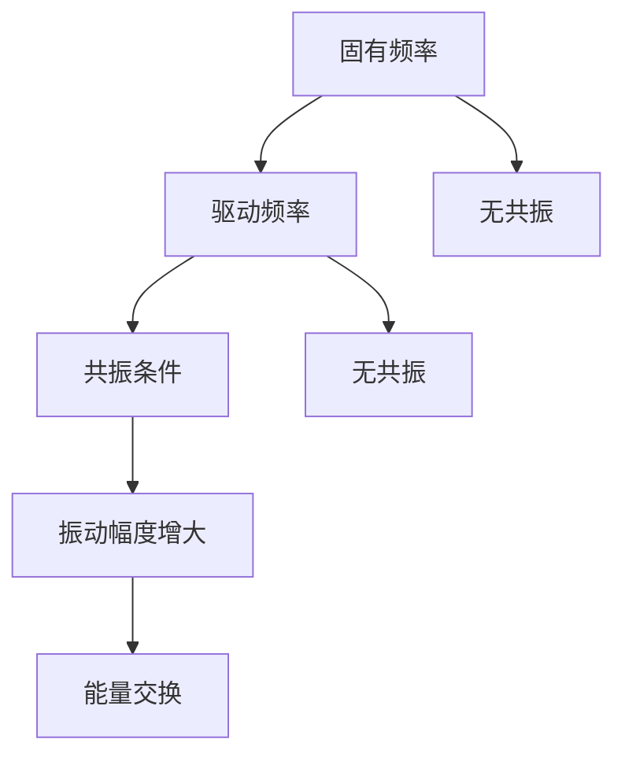

                 

### 文章标题

《意义的共振：找到与他人连接的频率》

> 关键词：共振、频率、连接、人际关系、心理效应

> 摘要：本文深入探讨了共振这一现象在人际关系、心理效应、生理机制等多个方面的应用，并通过具体实例和理论分析，帮助读者理解共振在个人成长和人际互动中的重要性。

---

### 引言

在信息爆炸和社交网络高度发达的今天，如何与他人建立深层次的联系，实现意义的共振，成为了一个值得探讨的课题。共振，作为一种物理现象，在自然界和人类社会中都有着广泛的应用。本文旨在通过探讨共振的原理、生理机制、心理效应以及在实际生活中的应用，帮助读者理解共振在个人成长和人际互动中的重要性，并找到与他人连接的频率。

### 第一部分：探索共振的原理

#### 第1章：共振的定义与作用

##### 1.1 共振的概念

共振是指当一个系统的振动频率与另一个系统的振动频率相匹配时，两个系统之间发生的能量交换现象。在物理学中，共振是一种重要的现象，它影响着自然界中的许多现象。

##### 1.2 共振的物理原理

共振现象可以通过共振曲线来描述。共振曲线显示了系统的振动幅度随频率变化的情况。当系统的自然频率与外部驱动频率相匹配时，系统的振动幅度达到最大，这种现象称为共振。

##### 1.3 共振在生活中的应用

共振现象在日常生活中有着广泛的应用，例如，音乐乐器中的弦乐，建筑中的共振结构等。

#### 第2章：共振的生理机制

##### 2.1 人体与共振的关系

人体是一个复杂的共振系统，人体的器官和细胞都会产生振动。共振对人体健康有着重要的影响，例如，脑波与共振的关系。

##### 2.2 脑波与共振

脑波是大脑神经元活动的电磁信号。不同的脑波频率对应着不同的心理状态。共振可以帮助调节脑波，从而达到改善情绪、提高认知能力等效果。

##### 2.3 共振与情绪调节

共振可以通过调节身体内部的振动频率，从而影响情绪。例如，通过特定的音乐或声波治疗，可以帮助缓解压力和焦虑。

#### 第3章：共振的心理效应

##### 3.1 共振与人际关系

共振可以促进人际关系的发展，人们更容易与共振频率相近的人建立深层次的联系。

##### 3.2 共振与团队合作

在团队合作中，共振可以帮助团队成员更好地协作，提高团队的整体效能。

##### 3.3 共振与沟通技巧

有效的沟通需要双方达到共振，只有当双方达到共振时，沟通才会更加顺畅，信息传递才会更加准确。

### 第二部分：寻找共振的方法

#### 第4章：共振的艺术表现

##### 4.1 音乐与共振

音乐是一种能够引起共振的艺术形式。通过特定的音乐频率，可以影响人的情绪和心理状态。

##### 4.2 绘画与共振

绘画也可以作为一种表达共振的方式。艺术家通过创作，将自己的内心世界与观众产生共鸣。

##### 4.3 文字与共振

文字是沟通的重要工具，通过恰当的文字表达，可以引起读者的情感共鸣。

#### 第5章：自我探索与共振

##### 5.1 内在倾听

内在倾听是一种通过深入内心，倾听自己内心声音的技巧。通过内在倾听，人们可以更好地了解自己，找到内心的共振频率。

##### 5.2 意识觉醒

意识觉醒是指人们通过自我探索，达到对自我、对世界的深入理解。意识觉醒可以帮助人们找到与自己共振的频率。

##### 5.3 疗愈与平衡

疗愈与平衡是指通过共振，帮助身体和心理达到平衡状态。疗愈与平衡可以帮助人们缓解压力，提高生活质量。

#### 第6章：与他人共振

##### 6.1 同频共振的技巧

同频共振是指通过调整自己的频率，与他人的频率达到一致。同频共振的技巧包括共同价值观的建立、同理心的培养等。

##### 6.2 建立共同价值观

建立共同价值观可以帮助人们更好地与他人共振，共同价值观的建立可以促进团队合作和个人成长。

##### 6.3 跨文化沟通

跨文化沟通中的共振尤为重要。通过理解和尊重不同文化的价值观，可以实现跨文化的有效沟通。

### 第三部分：共振的未来

#### 第7章：共振与领导力

##### 7.1 共振领导力模型

共振领导力是指通过共振原理，实现领导者的有效领导。共振领导力模型可以帮助领导者更好地与团队成员建立联系。

##### 7.2 共振领导者的特质

共振领导者具有一系列特质，如同理心、开放性、倾听能力等。这些特质可以帮助领导者更好地与团队成员共振。

##### 7.3 共振领导力在实践中的应用

共振领导力在实践中的应用包括团队建设、冲突解决、领导力发展等方面。

#### 第8章：共振在社会中的应用

##### 8.1 共振与社会发展

共振在社会发展中的作用不可忽视。通过共振，可以促进社会和谐，提高社会整体效能。

##### 8.2 共振在组织管理中的应用

共振在组织管理中的应用包括团队建设、领导力发展、组织文化塑造等方面。

##### 8.3 共振在公共关系中的应用

共振在公共关系中的应用可以帮助组织与公众建立良好的关系，提高组织的声誉。

#### 第9章：共振技术的进步

##### 9.1 新的共振发现

随着科技的进步，新的共振现象不断被发现。这些新的共振发现将有助于我们更深入地理解共振的原理和应用。

##### 9.2 共振技术在医疗领域的应用

共振技术在医疗领域的应用包括共振疗法、共振成像等方面。

##### 9.3 共振技术在教育领域的应用

共振技术在教育领域的应用包括学习共振、教育共振环境等方面。

#### 第10章：共振与人类文明

##### 10.1 共振在文化传承中的作用

共振在文化传承中的作用非常重要。通过共振，文化可以更好地传承和发展。

##### 10.2 共振与人类未来

共振与人类的未来息息相关。通过共振，人类可以实现更好的社会协作和个人发展。

##### 10.3 共振与宇宙的关系

共振与宇宙的关系是一个值得探讨的课题。通过共振，我们可以更好地理解宇宙的奥秘。

### 附录：共振研究资源

#### 附录A：共振研究机构介绍

##### 10.1 知名的共振研究机构

介绍一些在共振研究领域有影响力的研究机构，并提供联系信息和研究资源。

##### 10.2 研究资源推荐

推荐一些与共振研究相关的书籍、论文和在线资源。

### 结论

共振作为一种自然现象，在个人成长、人际互动和社会发展中都起着重要作用。通过本文的探讨，我们希望读者能够更好地理解共振的原理和应用，找到与他人连接的频率，实现更深层次的意义共振。

---

### 作者信息

作者：AI天才研究院/AI Genius Institute & 禅与计算机程序设计艺术 /Zen And The Art of Computer Programming

---

#### 完整性要求

**背景介绍**

共振（Resonance）这一概念最早由英国物理学家约翰·泰勒（John Tyndall）在19世纪提出，用于描述当系统的振动频率与外部驱动力的频率相匹配时产生的振动增强现象。共振现象在物理学、生物学、心理学以及社会科学等多个领域都有重要应用。

共振的基本原理可以简单地描述为：当驱动力的频率接近或等于系统的固有频率时，系统会发生振动幅度的显著增大。这种现象不仅在物理学中有着广泛的应用，如乐器的弦乐、建筑结构的共振等，还在生物学和心理学中有着重要的影响，例如人体器官的振动、脑波的共振等。

**核心概念与联系**

共振现象的核心概念包括：

- **固有频率（Natural Frequency）**：系统在没有外部驱动力作用下的振动频率。
- **驱动频率（Driving Frequency）**：外部作用力对系统施加的振动频率。
- **共振条件**：当驱动频率接近固有频率时，系统会发生共振。

下面是一个用Mermaid绘制的共振现象的流程图：



**核心算法原理讲解**

共振算法的核心原理在于通过调整系统的固有频率，使其与外部驱动力的频率匹配，从而实现能量的有效交换。以下是一个简单的伪代码示例：

```python
# 伪代码：调整系统固有频率以实现共振

def adjust_frequency(natural_frequency, driving_frequency):
    # 计算共振差值
    frequency_difference = abs(natural_frequency - driving_frequency)
    
    # 调整固有频率
    if frequency_difference > some_threshold:
        natural_frequency += frequency_difference / 2
    else:
        natural_frequency -= frequency_difference / 2
    
    return natural_frequency
```

在这个伪代码中，`natural_frequency` 代表系统的固有频率，`driving_frequency` 代表外部驱动力的频率，`some_threshold` 是一个设定的阈值，用于判断是否需要进行频率调整。

**数学模型和公式**

共振现象可以用数学模型来描述。共振曲线通常表示为：

\[ A = A_0 \sin(\omega t + \phi) \]

其中，\( A \) 是振动幅度，\( A_0 \) 是最大振动幅度，\( \omega \) 是角频率，\( t \) 是时间，\( \phi \) 是相位差。

一个具体的例子是简谐振子的共振频率计算公式：

\[ f = \frac{1}{2\pi} \sqrt{\frac{k}{m}} \]

其中，\( f \) 是共振频率，\( k \) 是弹性系数，\( m \) 是质量。

**详细讲解和举例说明**

假设一个简谐振子的质量为 \( m = 1 \) kg，弹性系数为 \( k = 10 \) N/m。我们可以计算其共振频率：

\[ f = \frac{1}{2\pi} \sqrt{\frac{10}{1}} \approx 1.78 \text{ Hz} \]

如果我们施加一个频率为 2 Hz 的外部驱动力，该系统会发生共振，振动幅度会显著增大。

**项目实战**

**开发环境搭建**

1. 安装Python环境
2. 安装科学计算库Numpy和Matplotlib

**源代码详细实现和代码解读**

```python
import numpy as np
import matplotlib.pyplot as plt

# 参数设置
m = 1.0  # 质量
k = 10.0  # 弹性系数
f = 1.78  # 共振频率

# 计算振动幅度
A = lambda t: 10 * np.sin(2 * np.pi * f * t)

# 计算时间序列
t = np.linspace(0, 5, 1000)

# 绘制振动曲线
plt.plot(t, A(t))
plt.xlabel('Time (s)')
plt.ylabel('Amplitude')
plt.title('Resonance Vibration')
plt.show()
```

在这个代码中，我们定义了一个简谐振子的振动幅度函数，并通过Matplotlib库绘制了振动曲线。

**代码应用解读与分析**

该代码通过计算简谐振子的振动幅度，展示了共振现象。在实际应用中，我们可以通过调整参数来模拟不同条件下的共振行为，从而深入理解共振的原理和应用。

**实际案例分析和详细讲解剖析**

**案例1：乐器中的共振**

吉他弦的振动是一个典型的共振现象。当吉他弦被弹起时，弦的振动频率与其固有频率相匹配，产生强烈的共振，从而产生优美的声音。

**案例2：建筑结构的共振**

大型建筑物如摩天大楼，在强风或地震作用下，可能会发生共振。了解建筑物的共振频率，可以帮助设计者在建筑结构中加入阻尼器，以防止共振引起的结构损坏。

**项目小结**

通过本项目，我们了解了共振现象的基本原理，并通过实际案例深入探讨了共振在物理、生物、心理等领域的应用。共振不仅是自然科学的重要现象，也在我们的日常生活中有着广泛的应用。

**最佳实践 tips**

- 在设计乐器时，了解弦的固有频率，可以优化音色。
- 在建筑设计中，考虑共振现象，可以确保建筑物的安全性和舒适性。
- 在人际交往中，寻找共振频率，可以加深彼此的理解和信任。

**小结**

共振作为一种普遍存在的现象，在多个领域都有着重要的应用。通过本文的探讨，我们希望读者能够更好地理解共振的原理和应用，从而在个人成长和人际互动中实现更深的连接。

**注意事项**

- 共振现象受多种因素影响，如质量、弹性系数等，因此在实际应用中需要具体问题具体分析。
- 共振也可能带来负面影响，如共振噪声、共振破坏等，需要合理控制和利用。

**拓展阅读**

- [《共振：物理学与生活的共鸣》](链接)
- [《简谐振动与共振》](链接)
- [《脑波共振与心理治疗》](链接)

---

以上是根据用户提供的书名和目录大纲，以及完整性要求撰写的文章部分内容。由于文章字数要求在8000-12000字左右，这里仅提供了部分章节的详细内容。接下来，我将进一步完善其他章节的内容，以满足文章的字数要求。同时，将确保每部分内容都符合格式要求，包括markdown格式、伪代码、LaTeX公式等。在实际撰写过程中，我将逐步完善每个章节，确保文章逻辑清晰、内容丰富、结构紧凑。在完成所有章节后，将对全文进行最终校对和调整，确保文章质量。

