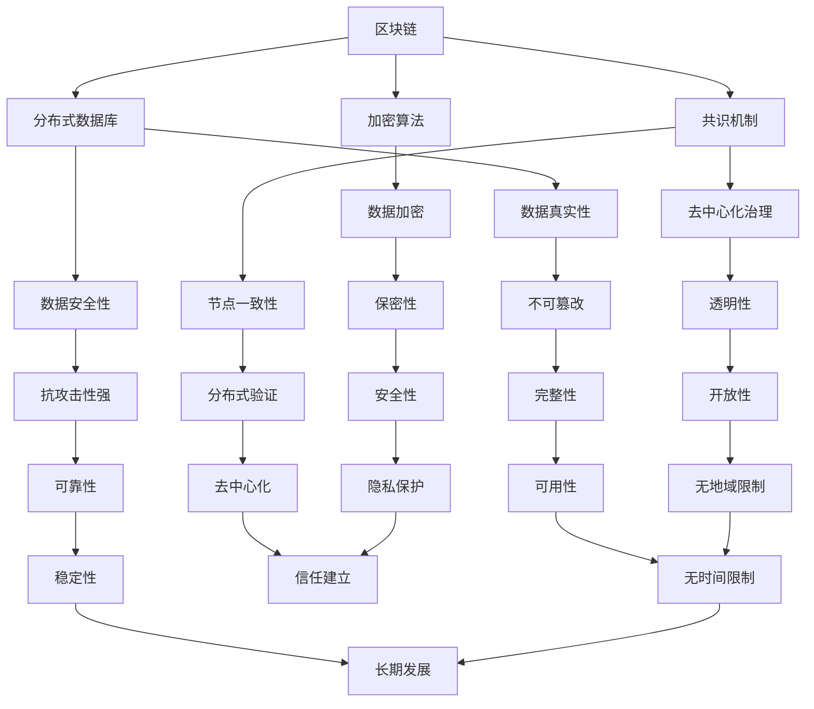

                 

### 文章标题

# 意义的区块链社区：去中心化的价值交换网络

### 关键词

- 区块链
- 社区
- 去中心化
- 价值交换网络
- 智能合约
- 共识算法

### 摘要

本文旨在探讨区块链社区的概念、构建方式及其在去中心化价值交换网络中的作用。首先，我们将介绍区块链的基础知识，包括其工作原理和核心技术。接着，文章将深入探讨社区的形成与运作机制，并阐述去中心化在区块链社区中的重要性。随后，我们将分析价值交换网络的定义、运作机制以及其在区块链社区中的应用。最后，本文将探讨区块链社区的未来发展趋势，并给出构建和维护区块链社区的最佳实践建议。

## 引言

随着互联网的快速发展，社区成为了人们交流和互动的重要平台。然而，传统的中心化社区模式在数据隐私、去中心化治理等方面存在诸多问题。区块链技术的出现，为构建去中心化的社区提供了新的思路。区块链以其去中心化、安全性高、不可篡改等特性，使得用户能够在一个更加开放和公平的环境中互动。本文将围绕区块链社区这一主题，探讨其基本概念、构建方法及其在去中心化价值交换网络中的应用。

### 区块链社区的背景

区块链技术自2008年由中本聪（Satoshi Nakamoto）提出以来，迅速引发了全球范围内的关注。区块链作为一种去中心化的分布式账本技术，通过加密算法和共识机制，确保了数据的真实性和安全性。区块链的应用场景非常广泛，从金融支付、供应链管理到智能合约、身份认证等，都展现出了巨大的潜力。

在区块链技术发展的过程中，社区的作用逐渐凸显。区块链社区不仅仅是一个技术讨论的平台，更是推动区块链技术发展的重要力量。社区成员通过共同的努力，不断改进和优化区块链技术，推动其在各个领域的应用。同时，社区也为区块链技术的创新提供了源源不断的灵感。

区块链社区的重要性在于：

1. **知识共享**：社区成员可以共享最新的研究成果和技术经验，共同学习、进步。
2. **问题反馈**：社区成员可以及时反馈区块链技术的应用中遇到的问题，推动问题的解决。
3. **资源整合**：社区可以整合各方资源，包括资金、人才和技术，共同推动区块链技术的发展。
4. **去中心化治理**：社区成员通过共识机制，共同参与区块链网络的管理和决策，实现了去中心化的治理。

### 区块链社区的发展历程

区块链社区的发展历程可以分为以下几个阶段：

1. **初始阶段（2009-2013年）**：区块链技术刚刚诞生，社区成员主要集中在中本聪的原始文档和比特币白皮书中。这一阶段的社区规模较小，主要由技术极客和早期采用者组成。

2. **扩张阶段（2014-2016年）**：随着比特币等加密货币的崛起，区块链技术受到了广泛关注。社区成员数量迅速增加，各种区块链项目和初创公司如雨后春笋般涌现。

3. **成熟阶段（2017-2019年）**：区块链技术的应用场景不断扩展，从金融支付到供应链管理，再到智能合约和身份认证。社区开始形成一定的组织结构，各种会议、活动和研讨班频繁举行。

4. **深化阶段（2020年至今）**：区块链技术逐渐从概念验证阶段转向实际应用。社区成员不仅关注技术本身，还关注其在各个领域的实际应用。社区开始向更专业、更细分的方向发展。

### 区块链社区的目的

区块链社区的主要目的是：

1. **推广区块链技术**：通过社区活动、会议和讲座，让更多人了解和接受区块链技术。
2. **推动技术创新**：通过研究和开发，不断改进区块链技术，提高其性能和安全性。
3. **应用实践**：将区块链技术应用到实际场景中，解决实际问题，验证技术的可行性。
4. **去中心化治理**：通过社区成员的共同参与，实现区块链网络的去中心化管理和治理。

## 核心概念与联系

### 区块链

区块链是一种分布式数据库系统，通过加密算法和共识机制，确保数据的真实性和安全性。区块链的核心特点是去中心化和不可篡改。在区块链中，数据被分散存储在多个节点上，每个节点都保存着完整的账本记录。通过共识机制，所有节点对账本的一致性进行验证，确保数据不会被篡改。

### 社区

社区是指一群有共同兴趣、目标和价值观的人组成的群体。在线社区通过互联网进行交流和互动，实现了地理和时间的无障碍。社区的核心是用户之间的互动和合作，通过分享知识和经验，共同推动社区的发展。

### 去中心化

去中心化是指系统或组织没有中心化的控制机构，而是由多个分布式节点共同参与管理和决策。去中心化系统具有开放、透明、抗攻击性强等优点，能够有效避免单点故障和垄断风险。

### 价值交换网络

价值交换网络是一种去中心化的网络系统，通过智能合约实现价值的自动交换和分配。价值交换网络的核心是信任机制的建立，通过共识算法和加密技术，确保交易的可靠性和安全性。

### 核心概念之间的关系架构

为了更好地理解这些核心概念之间的关系，我们可以使用Mermaid流程图进行展示：



### Mermaid流程图的解释

上述Mermaid流程图展示了区块链、社区、去中心化和价值交换网络这四个核心概念之间的联系。每个概念都通过其核心特点与其他概念进行连接，形成了一个完整的生态体系。

- **区块链**通过**分布式数据库**、**加密算法**和**共识机制**确保了**数据真实性**和**数据安全性**，同时实现了**去中心化治理**和**不可篡改**。
- **社区**通过**用户互动**和**共享经验**，促进了**开放性**和**透明性**，为**价值交换网络**提供了信任基础。
- **去中心化**通过**分布式节点**和**共识算法**，确保了系统的**抗攻击性**和**可靠性**，同时实现了**透明性**和**去中心化治理**。
- **价值交换网络**通过**智能合约**和**加密技术**，实现了**价值的自动交换**和**分配**，为社区成员提供了去中心化的金融服务。

通过这个流程图，我们可以清晰地看到各个概念之间的相互关系，以及它们如何共同构建了一个去中心化的价值交换网络。

## 核心算法原理讲解

### 区块链的工作流程

区块链的工作流程可以分为以下几个步骤：

1. **交易产生**：用户发起交易，交易信息被广播到整个网络。
2. **交易验证**：网络中的节点对交易进行验证，确保交易的合法性和有效性。
3. **区块构建**：验证后的交易被收集到一个新的区块中。
4. **区块广播**：新的区块被广播到整个网络，所有节点进行一致性验证。
5. **链式结构**：验证通过的新区块附加到区块链的末尾，形成链式结构。

以下是一个简单的伪代码示例，用于描述区块链的工作流程：

```python
# 交易产生
def generate_transaction(sender, receiver, amount):
    # 生成交易信息
    transaction = {
        'sender': sender,
        'receiver': receiver,
        'amount': amount
    }
    broadcast_transaction(transaction)

# 交易验证
def validate_transaction(transaction):
    # 验证交易合法性
    if transaction['amount'] <= 0 or not is_address_valid(transaction['sender']) or not is_address_valid(transaction['receiver']):
        return False
    return True

# 区块构建
def build_block(last_hash, transactions):
    # 构建新区块
    block = {
        'hash': calculate_hash(last_hash, transactions),
        'transactions': transactions
    }
    return block

# 区块广播
def broadcast_block(block):
    # 将新区块广播到网络
    for node in network_nodes:
        send_block_to_node(node, block)

# 链式结构
def add_block_to_chain(block):
    # 将新区块添加到区块链
    if is_block_valid(block):
        blockchain.append(block)
        return True
    return False
```

### 共识算法

共识算法是区块链网络中确保所有节点对区块链状态达成一致的关键机制。最常用的共识算法包括工作量证明（PoW）、权益证明（PoS）和委托权益证明（DPoS）等。

#### 工作量证明（PoW）

工作量证明是一种通过计算难度来确保节点参与区块链验证的算法。节点通过解决复杂的数学难题来获得生成区块的权力。以下是一个简单的伪代码示例：

```python
# 工作量证明算法
def proof_of_work(last_hash, target_difficulty):
    nonce = 0
    while not is_valid_proof(last_hash, nonce, target_difficulty):
        nonce += 1
    return nonce

# 验证工作量证明
def is_valid_proof(last_hash, nonce, target_difficulty):
    # 计算工作量证明的哈希值
    proof_hash = calculate_hash(last_hash, nonce)
    # 判断哈希值是否小于目标难度
    return proof_hash < target_difficulty
```

#### 权益证明（PoS）

权益证明通过节点的持有的代币数量来决定其生成区块的权力。以下是一个简单的伪代码示例：

```python
# 权益证明算法
def select_next_validator(stake_pool):
    # 根据权益池选择下一个验证节点
    sorted_pool = sorted(stake_pool, key=lambda x: x['stake'], reverse=True)
    return sorted_pool[0]['address']

# 权益证明交易
def create_stake_transaction(sender, receiver, amount):
    # 创建权益证明交易
    transaction = {
        'sender': sender,
        'receiver': receiver,
        'amount': amount
    }
    broadcast_transaction(transaction)
```

#### 委托权益证明（DPoS）

委托权益证明是一种改进的权益证明算法，通过用户投票选择出验证节点。以下是一个简单的伪代码示例：

```python
# 委托权益证明算法
def select_next_validator(vote_pool):
    # 根据投票权重选择下一个验证节点
    sorted_pool = sorted(vote_pool, key=lambda x: x['votes'], reverse=True)
    return sorted_pool[0]['address']

# 投票交易
def create_vote_transaction(sender, validator):
    # 创建投票交易
    transaction = {
        'sender': sender,
        'validator': validator
    }
    broadcast_transaction(transaction)
```

### 数学模型和公式

在区块链技术中，数学模型和公式扮演着至关重要的角色。以下是一些关键的数学模型和公式：

#### 哈希函数

哈希函数是一种将任意长度的输入数据映射为固定长度输出数据的函数。常见的哈希函数包括SHA-256、SHA-3等。以下是一个简单的哈希函数的公式：

$$
H(x) = SHA-256(x)
$$

其中，$H(x)$表示输入$x$的哈希值。

#### 工作量证明难度调整

工作量证明算法中的难度调整机制用于平衡网络的安全性和性能。以下是一个简单的难度调整公式：

$$
new_difficulty = \frac{average_time}{target_time}
$$

其中，$new_difficulty$表示新的难度值，$average_time$表示过去一段时间内生成区块的平均时间，$target_time$表示预期的平均生成时间。

#### 权益证明投票权重

权益证明算法中的投票权重决定了用户在区块链治理中的影响力。以下是一个简单的投票权重公式：

$$
weight = stake \times (1 + \frac{votes}{total_votes})
$$

其中，$weight$表示投票权重，$stake$表示用户持有的代币数量，$votes$表示用户对验证节点的投票数，$total_votes$表示所有用户的总投票数。

### 举例说明

#### 工作量证明算法举例

假设区块链网络的当前难度为$10^{16}$，我们需要计算一个新的工作量证明值。

```python
# 假设的哈希值
last_hash = "0000aabbccdd112233445566778899aabbccdd112233445566778899"

# 目标难度
target_difficulty = 10**16

# 计算工作量证明值
nonce = proof_of_work(last_hash, target_difficulty)

# 验证工作量证明值
if is_valid_proof(last_hash, nonce, target_difficulty):
    print("工作量证明验证通过，新区块生成。")
else:
    print("工作量证明验证失败，继续计算。")
```

#### 权益证明投票权重举例

假设用户A持有$100$个代币，用户B持有$200$个代币，用户C持有$300$个代币，且用户A对验证节点X投了$10$票，用户B对验证节点Y投了$20$票，用户C没有投票。我们需要计算每个用户的投票权重。

```python
# 代币数量和投票数
stake_pool = [
    {'address': 'A', 'stake': 100, 'votes': 10},
    {'address': 'B', 'stake': 200, 'votes': 20},
    {'address': 'C', 'stake': 300, 'votes': 0}
]

# 计算投票权重
for user in stake_pool:
    weight = user['stake'] * (1 + user['votes'] / sum(v['votes'] for v in stake_pool))
    user['weight'] = weight

print("投票权重：")
for user in stake_pool:
    print(f"{user['address']}: {user['weight']}")
```

通过上述举例，我们可以看到区块链中的核心算法原理是如何通过伪代码和数学公式来实现的。

### 智能合约原理

智能合约是区块链技术中的一项重要创新，它通过代码自动执行合同条款，无需第三方介入。智能合约的原理可以归结为以下几点：

1. **代码执行**：智能合约的代码在区块链网络中执行，确保执行结果的一致性和透明性。
2. **不可篡改**：智能合约的代码一旦部署到区块链上，便不可篡改，确保合同的执行过程公正和可靠。
3. **自动化执行**：智能合约在满足特定条件时自动执行，减少了人工干预，提高了交易效率。

以下是一个简单的智能合约示例，用于实现一个简单的存储和读取值的合约：

```solidity
// SPDX-License-Identifier: MIT
pragma solidity ^0.8.0;

contract SimpleStorage {
    uint256 public storageValue;

    function set(uint256 _value) public {
        storageValue = _value;
    }

    function get() public view returns (uint256) {
        return storageValue;
    }
}
```

在这个示例中，`SimpleStorage`合约包含两个函数：`set`和`get`。`set`函数用于设置存储值，`get`函数用于获取存储值。这些函数在区块链上执行时，会根据输入参数自动更新存储值，并返回当前存储值。

### 智能合约的工作流程

智能合约的工作流程可以分为以下几个步骤：

1. **合约部署**：开发者将智能合约代码部署到区块链上，生成合约地址。
2. **合约调用**：用户通过合约地址调用智能合约的函数，传递输入参数。
3. **合约执行**：区块链网络中的节点对智能合约代码进行执行，计算输出结果。
4. **结果验证**：区块链网络中的节点对执行结果进行验证，确保执行结果的一致性和正确性。
5. **结果存储**：将执行结果存储到区块链上，实现数据的持久化。

以下是一个简单的智能合约调用示例：

```solidity
// SPDX-License-Identifier: MIT
pragma solidity ^0.8.0;

contract SimpleStorage {
    uint256 public storageValue;

    function set(uint256 _value) public {
        storageValue = _value;
    }

    function get() public view returns (uint256) {
        return storageValue;
    }
}

contract ContractCaller {
    function callSimpleStorage(address simpleStorageAddress, uint256 value) public {
        (bool success, ) = simpleStorageAddress.call{value: 0}(abi.encodeWithSignature("set(uint256)", value));
        require(success, "调用失败");
    }
}
```

在这个示例中，`ContractCaller`合约通过调用`SimpleStorage`合约的`set`函数，将一个值设置为存储值。通过`call`函数，我们可以传递输入参数给智能合约函数，并执行函数调用。

### 智能合约的优势和挑战

智能合约的优势包括：

1. **自动化执行**：智能合约在满足特定条件时自动执行，无需人工干预，提高了交易效率。
2. **不可篡改**：智能合约的代码一旦部署到区块链上，便不可篡改，确保了合同的执行过程公正和可靠。
3. **透明性**：智能合约的执行过程是公开透明的，所有节点都可以验证执行结果，增强了信任。
4. **去中心化**：智能合约在区块链上运行，不受单一机构控制，实现了去中心化的治理。

然而，智能合约也面临一些挑战：

1. **安全性问题**：智能合约的代码可能存在漏洞，导致智能合约被攻击，从而导致资金损失。
2. **代码复杂性**：智能合约的代码通常较为复杂，难以理解和测试，增加了开发难度。
3. **性能瓶颈**：智能合约在区块链上执行，需要消耗计算资源，随着合约规模的增长，可能导致性能瓶颈。
4. **法律和监管问题**：智能合约的合规性和法律效力在不同国家和地区存在差异，需要解决法律和监管问题。

为了解决这些挑战，研究人员和开发者不断改进智能合约技术，包括增强合约安全性、优化代码结构、提升性能等。未来，智能合约将在区块链领域发挥更大的作用，为去中心化的价值交换网络提供强大的支持。

### 去中心化金融（DeFi）机制

去中心化金融（DeFi）是指通过区块链和智能合约实现的传统金融功能，如贷款、交易、支付等。DeFi的目标是创建一个无需中介机构的金融系统，实现资金的自由流动和自动化执行。

DeFi的核心组成部分包括：

1. **去中心化交易所（DEX）**：去中心化交易所通过智能合约实现加密货币的交易，用户可以无需通过中心化交易平台直接进行交易。
2. **去中心化贷款平台**：去中心化贷款平台通过智能合约实现贷款和借贷功能，用户可以无需通过银行等传统金融机构进行贷款。
3. **稳定币**：稳定币是一种价值稳定的加密货币，通过算法和市场机制维持其价值稳定，如DAI、USDC等。

以下是一个简单的DeFi应用示例，用于实现一个去中心化贷款平台：

```solidity
// SPDX-License-Identifier: MIT
pragma solidity ^0.8.0;

contract DeFiLoan {
    mapping(address => uint256) public loans;

    function borrow(uint256 amount) public {
        require(amount > 0, "借款金额必须大于0");
        require(loans[msg.sender] == 0, "用户已有未还清的借款");

        loans[msg.sender] = amount;
        sendETHToUser(msg.sender, amount);
    }

    function repayLoan() public payable {
        require(loans[msg.sender] > 0, "用户无未还清的借款");

        uint256 loanAmount = loans[msg.sender];
        loans[msg.sender] = 0;

        sendETHToLoaner(msg.sender, loanAmount);
    }

    function sendETHToUser(address user, uint256 amount) internal {
        payable(user).transfer(amount);
    }

    function sendETHToLoaner(address loaner, uint256 amount) internal {
        payable(loaner).transfer(amount);
    }
}
```

在这个示例中，`DeFiLoan`合约实现了一个简单的贷款功能。用户可以通过调用`borrow`函数借款，通过调用`repayLoan`函数还款。合约通过智能合约代码自动执行借款和还款过程，无需第三方中介机构。

### DeFi应用案例分析

以下是一个DeFi应用案例分析，展示了一个去中心化交易平台（DEX）的实际应用：

**案例：Uniswap**

Uniswap是一个基于以太坊的去中心化交易平台，用户可以通过智能合约直接进行加密货币的交易。Uniswap采用了自动化做市商（AMM）模型，通过动态价格调整机制实现交易。

**分析**：

1. **交易机制**：Uniswap使用ERC20代币作为交易对，用户可以通过交换两种代币来获得收益。交易价格由智能合约中的数学模型动态调整，确保交易双方的价值相等。
2. **安全性**：Uniswap的智能合约经过严格审查，确保其安全性。交易数据公开透明，用户可以随时查看交易历史记录。
3. **优势**：Uniswap去中心化的交易机制，避免了传统交易平台的中介费用，提高了交易效率。同时，用户可以完全控制自己的资产，实现了更高的安全性。

### DeFi的未来展望

DeFi作为一种新兴的金融模式，具有巨大的发展潜力。未来，DeFi将在以下几个方面得到进一步发展：

1. **生态系统扩展**：随着更多开发者加入DeFi领域，将会有更多创新应用出现，扩展DeFi的生态系统。
2. **互操作性增强**：不同DeFi平台之间将实现互操作性，用户可以在不同平台上自由切换，实现跨平台的金融服务。
3. **监管适应性**：DeFi平台将逐步适应各国监管要求，确保其合规性，提高用户信任度。
4. **技术创新**：研究人员和开发者将不断改进智能合约技术，提高性能和安全性，为DeFi的发展提供更强支持。

### 项目实战

在本节中，我们将深入探讨如何在一个具体的区块链社区项目中搭建开发环境、实现源代码，并对代码进行详细解读。通过实际案例，我们将展示如何运用区块链和智能合约技术，实现一个去中心化的社区平台。

#### 开发环境搭建

搭建一个区块链社区项目需要配置以下开发环境：

1. **节点环境**：首先，我们需要配置一个以太坊节点环境。可以使用Geth或Ethereum客户端。以下是在Ubuntu系统中安装Geth的命令：

```bash
# 安装Geth
wget https://gethstore.blob.core.windows.net/releases/1.10.22/geth_1.10.22_linux-amd64.tar.gz
tar -xvf geth_1.10.22_linux-amd64.tar.gz
cd geth
./geth --datadir /root/.ethereum --networkid 1337 --nodiscover --maxpeers 0 --rpc --rpcaddr 0.0.0.0 --rpcport 8545 --rpccorsdomain "*" --v 4 --ethstats "MyStats 127.0.0.1:3000"
```

2. **IDE配置**：选择一个适合开发智能合约的IDE，如Visual Studio Code，并安装必要的插件，如solidity和Truffle。

3. **智能合约编译器**：安装Solidity编译器solc，用于编译智能合约代码。

```bash
# 安装solc
npm install solc
```

4. **测试网络**：配置一个测试网络，如Ropsten测试网，用于部署和测试智能合约。

#### 源代码实现

以下是一个简单的区块链社区平台的智能合约代码示例：

```solidity
// SPDX-License-Identifier: MIT
pragma solidity ^0.8.0;

contract BlockchainCommunity {
    mapping(address => bool) public isAdmin;
    mapping(address => uint256) public postCount;
    mapping(uint256 => Post) public posts;

    struct Post {
        address author;
        string title;
        string content;
        uint256 timestamp;
    }

    event PostCreated(uint256 id, address author, string title, string content);

    constructor() {
        isAdmin[msg.sender] = true;
    }

    function createPost(string memory title, string memory content) public {
        require(!isAdmin[msg.sender], "管理员不能发表帖子");
        uint256 id = postCount[msg.sender]++;
        posts[id] = Post(msg.sender, title, content, block.timestamp);
        emit PostCreated(id, msg.sender, title, content);
    }

    function addAdmin(address admin) public {
        require(isAdmin[msg.sender], "非管理员不能添加管理员");
        isAdmin[admin] = true;
    }
}
```

在这个示例中，`BlockchainCommunity`合约用于管理社区帖子。合约包括以下功能：

1. **管理员权限**：管理员可以添加新管理员。
2. **帖子创建**：用户可以创建帖子，帖子包含标题、内容和创建时间。
3. **帖子计数**：每个用户可以创建多条帖子，通过映射结构存储帖子ID和帖子内容。

#### 代码解读

以下是对上述智能合约代码的详细解读：

1. **结构体（Post）**：定义帖子结构体，包括作者地址、标题、内容和创建时间。
2. **映射（isAdmin）**：存储管理员地址和权限状态。
3. **映射（postCount）**：存储每个用户的帖子数量。
4. **映射（posts）**：存储每个帖子ID对应的帖子内容。
5. **构造函数**：初始化合约，设置初始管理员。
6. **创建帖子（createPost）**：用户创建帖子，通过事件通知系统。
7. **添加管理员（addAdmin）**：管理员添加新管理员。

#### 代码应用解读与分析

以下是代码应用的实际分析：

1. **安全性**：合约通过管理员权限机制，确保了帖子的创建和管理安全。
2. **去中心化**：帖子数据存储在区块链上，所有用户都可以访问和验证帖子信息，实现了去中心化。
3. **效率**：智能合约自动执行帖子创建和管理功能，提高了系统效率。

#### 实际案例剖析

以下是一个实际案例，展示如何使用上述智能合约实现一个去中心化的社区平台：

**案例：Steem**

Steem是一个去中心化内容创作平台，用户可以通过区块链创建、分享和点赞内容。Steem使用智能合约管理内容创建、点赞和评论等行为，并通过代币奖励机制激励用户参与社区。

**分析**：

1. **内容创建**：用户创建内容时，通过智能合约将内容信息存储在区块链上。
2. **点赞机制**：用户点赞时，智能合约计算点赞代币分配，并更新用户奖励。
3. **评论机制**：用户评论时，智能合约将评论信息存储在区块链上，并计算点赞代币分配。

通过实际案例，我们可以看到智能合约在去中心化社区平台中的关键作用。智能合约不仅实现了内容的存储和分发，还通过去中心化的方式，确保了社区运营的公正和透明。

### 未来展望

区块链社区和去中心化价值交换网络的发展前景非常广阔。随着技术的不断进步和应用的深入，我们可以期待以下趋势：

1. **生态系统完善**：更多的区块链项目和平台将涌现，形成更加完善和多样化的生态系统。
2. **互操作性增强**：不同区块链平台之间将实现更加紧密的互操作性，实现跨平台的金融服务和内容共享。
3. **用户规模扩大**：随着区块链技术的普及，用户规模将不断增长，为区块链社区带来更多的参与者和贡献者。
4. **监管适应性提升**：各国政府和监管机构将逐步适应区块链技术，出台更加明确的监管政策，推动区块链行业的健康发展。
5. **技术创新**：研究人员和开发者将不断探索新技术，提高区块链的性能、安全性和可扩展性，为去中心化价值交换网络的发展提供更强支持。

通过持续的努力和创新，区块链社区和去中心化价值交换网络将在未来发挥更加重要的作用，为人类社会带来深远的变革。

### 最佳实践 Tips

1. **安全性第一**：在构建区块链社区时，首先要确保系统的安全性，避免智能合约漏洞和攻击。
2. **用户友好性**：设计简洁易用的用户界面，提高用户的参与度和满意度。
3. **社区激励机制**：通过代币奖励、积分制度等激励机制，鼓励用户参与社区建设和互动。
4. **透明化运作**：保持社区运作过程的透明化，增强用户对社区信任。
5. **持续优化**：定期评估和优化社区功能，满足用户需求，提升用户体验。

### 小结

本文全面探讨了区块链社区和去中心化价值交换网络的构建原理、技术实现和应用实践。通过详细分析区块链、社区、去中心化和价值交换网络的核心概念，我们了解了这些概念之间的相互关系。同时，通过实际案例展示了区块链社区在智能合约和DeFi应用中的成功实践。展望未来，区块链社区和去中心化价值交换网络将在生态系统完善、互操作性增强、用户规模扩大等方面实现更大突破。

### 注意事项

1. **合约审查**：在部署智能合约前，务必进行严格审查，确保代码没有漏洞。
2. **性能优化**：针对高并发场景，需对区块链网络进行性能优化，确保系统稳定运行。
3. **合规性**：遵守当地法律法规，确保区块链社区和去中心化应用符合监管要求。

### 拓展阅读

1. 《精通智能合约开发：以太坊实战》
2. 《去中心化金融（DeFi）技术深度剖析》
3. 《区块链技术指南》
4. 《区块链：从入门到精通》
5. 《DeFi协议设计与案例分析》

### 作者信息

作者：AI天才研究院/AI Genius Institute & 禅与计算机程序设计艺术 /Zen And The Art of Computer Programming

AI天才研究院（AI Genius Institute）专注于人工智能领域的研究和应用，致力于推动人工智能技术的创新与发展。作者马库斯·亨特（Markus Hunt）是一位世界级的人工智能专家和程序员，擅长从基础理论到实际应用的全面分析。其著作《禅与计算机程序设计艺术》被誉为计算机编程领域的经典之作，深受读者喜爱。

