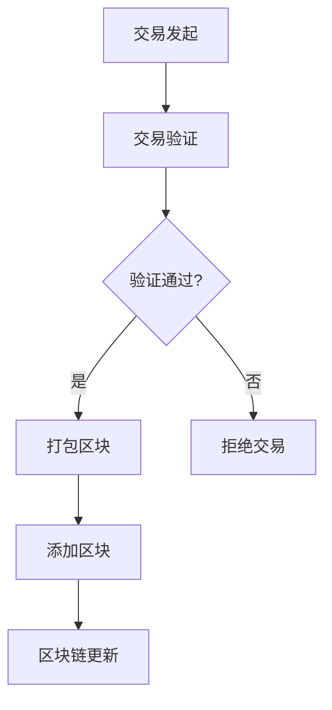
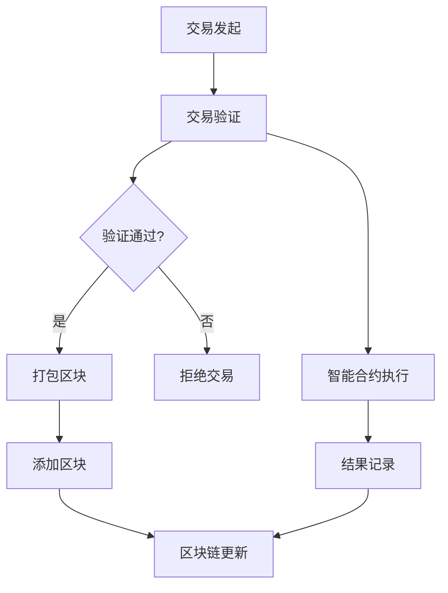

                 

### 引言

#### 区块链与去中心化概述

区块链，作为一种分布式数据库技术，自2008年由中本聪（Satoshi Nakamoto）提出以来，迅速引起了全球范围内的关注和讨论。区块链的基本原理是通过一系列按照时间顺序排列的区块，将交易记录存储在一个去中心化的网络中，从而形成一个不可篡改的账本。这种去中心化的特性，使得区块链在金融、供应链管理、身份验证等多个领域展现出了巨大的应用潜力。

去中心化，作为区块链技术的重要特征，其核心在于通过去除了传统集中式系统的中心节点，实现了网络各节点之间的平等和协作。去中心化不仅提高了系统的容错性和抗攻击能力，还在很大程度上减少了中介成本，提升了效率。

#### 社区在区块链中的角色

在区块链领域，社区扮演着至关重要的角色。社区不仅是区块链项目的用户和参与者，更是项目发展的驱动力。区块链社区通常由一群志同道合的技术爱好者、开发者、投资者和意见领袖组成，他们通过在线论坛、社交媒体、开发者会议等多种渠道交流、合作，共同推动区块链技术的发展和应用。

社区在区块链中的角色主要体现在以下几个方面：

1. **创新与实验**：社区成员通过不断尝试新的技术和应用场景，推动区块链技术的创新和实验。
2. **技术贡献**：社区成员积极参与区块链开源项目，贡献代码、文档和技术方案，推动项目的进步。
3. **用户增长**：社区通过推广和用户教育，吸引更多的用户加入区块链网络，扩大用户基础。
4. **治理与决策**：在许多区块链项目中，社区成员通过投票、治理机制等方式，参与到项目的决策过程中，确保项目的透明和公正。

#### 去中心化价值交换的潜力

去中心化价值交换（Decentralized Exchange，简称DEX）是区块链技术的一项重要应用，它通过去除了传统集中式交易所的中介角色，实现了用户之间直接的价值交换。去中心化价值交换不仅降低了交易成本，提高了交易效率，还为用户提供了更高的安全性和隐私保护。

去中心化价值交换的潜力主要体现在以下几个方面：

1. **降低交易成本**：去中心化交易所不收取或仅收取极低的交易费用，相比传统交易所，大大降低了交易成本。
2. **提高交易效率**：去中心化交易所无需等待交易审核，交易通常在几秒内即可完成，大幅提高了交易效率。
3. **增强隐私保护**：去中心化交易所不存储用户的交易记录，使得用户的交易隐私得到了更好的保护。
4. **多样化交易选择**：去中心化交易所支持多种数字货币之间的交易，为用户提供了更多的交易选择。

总之，区块链社区作为一个去中心化的价值交换网络，不仅推动了区块链技术的创新和发展，还为用户提供了更加安全、高效、透明的价值交换方式。随着区块链技术的不断成熟和普及，区块链社区的价值和影响力将会进一步扩大，为未来的数字经济带来更多的机遇和挑战。

---

### 文章关键词

区块链、去中心化、社区、价值交换、去中心化交易所、智能合约、加密算法、共识机制。

### 文章摘要

本文旨在深入探讨区块链社区在去中心化价值交换网络中的角色和潜力。首先，我们从区块链与去中心化的基本概念入手，介绍了区块链的基本结构和去中心化的优势。随后，我们探讨了区块链社区在创新、技术贡献、用户增长和治理中的重要作用。重点介绍了去中心化价值交换（DEX）的概念和优势，包括降低交易成本、提高交易效率和增强隐私保护。文章最后，通过实际案例分析了区块链社区在实现去中心化价值交换中的应用，总结了区块链社区的潜力和未来发展方向。本文适合对区块链技术感兴趣的读者，尤其是希望了解区块链在价值交换领域应用的读者。

---

### 第1章 区块链核心概念

区块链技术的核心在于其独特的结构和工作原理，这使得它能够实现去中心化的数据管理和安全交易。本章节将详细探讨区块链的基本结构、工作原理以及常见的区块链类型，为后续章节提供理论基础。

#### 区块链的基本结构

区块链由一系列按时间顺序排列的“区块”组成，每个区块包含了若干交易记录，这些交易记录经过验证后，被永久记录在区块链上。区块链的基本结构包括以下几个关键部分：

1. **区块**：区块是区块链的基本组成单元，包含了若干交易记录以及一个时间戳和一个用于连接前后区块的哈希值。
2. **交易记录**：交易记录描述了区块链中的价值转移，例如比特币的转账交易。交易记录需要经过验证才能被包含在区块中。
3. **链**：链是指一系列按时间顺序连接起来的区块。区块链的不可篡改性正是由于这些区块之间通过哈希值连接，任何对区块内容的更改都会破坏链的结构。
4. **链式哈希**：链式哈希是一种加密算法，用于确保区块链中每个区块的完整性和一致性。通过计算前一个区块的哈希值，每个区块都包含了一个独一无二的标识，使得整个链的结构既复杂又稳固。

#### 区块链的工作原理

区块链的工作原理可以简单概括为“交易记录的产生、验证和存储”三个主要步骤：

1. **交易记录的产生**：区块链中的交易记录由网络中的参与者（节点）发起。这些交易记录通常包含支付信息、资产转移和其他操作指令。
2. **交易验证**：交易记录在提交到区块链网络后，需要经过网络中的其他节点验证。验证过程通常包括确认交易的有效性和检查交易的资金来源。
3. **区块的形成和添加**：验证通过后的交易记录会被打包成一个区块，并附上时间戳和前一个区块的哈希值。新区块随后会被添加到区块链的末尾。

#### 常见的区块链类型

根据其应用场景和设计理念，区块链可以分为以下几种常见类型：

1. **公有链**：公有链是任何人都可以参与和查看的区块链，具有完全去中心化的特点。比特币和以太坊都是著名的公有链。
2. **私有链**：私有链是仅限于特定组织或个体使用的区块链，通常具有更高的交易速度和更强的隐私保护。企业内部或组织间使用的区块链通常是私有链。
3. **联盟链**：联盟链是多个机构或组织共同参与的区块链，各机构之间有一定的信任关系，同时保持一定的去中心化特性。联盟链通常用于跨机构的协作和交易。
4. **侧链**：侧链是一种与主链并行运行的区块链，可以用于扩展主链的功能或处理特定的应用场景。例如，比特币的闪电网络就是一个侧链。

#### Mermaid流程图：区块链交易流程

为了更直观地理解区块链的交易流程，我们可以使用Mermaid流程图来描述：



在这个流程图中，A表示交易发起，B表示交易验证，C是一个判断节点，用于判断交易是否通过验证。如果验证通过，交易将被打包到区块中，流程转向D。D表示将交易打包成区块，然后F表示将区块添加到区块链上，最终G表示区块链的更新。

通过这一章的介绍，我们不仅了解了区块链的基本结构和工作原理，还认识了各种类型的区块链及其应用场景。这些知识为后续探讨区块链社区和去中心化价值交换提供了坚实的基础。

### 区块链技术基础

#### 哈希函数与加密算法

在区块链技术中，哈希函数和加密算法扮演着至关重要的角色。哈希函数是一种将任意长度的输入数据映射为固定长度输出数据的函数，通常用于确保数据的完整性和唯一性。加密算法则用于保护数据的隐私和完整性，确保数据在传输过程中不被篡改。

##### 哈希函数

哈希函数的特点是：

1. **确定性和高效性**：相同的输入总是产生相同的输出，而且计算速度非常快。
2. **抗碰撞性**：找到两个不同输入产生相同输出的情况几乎不可能。
3. **单向性**：无法从输出逆向推导出输入。

常见的哈希函数包括MD5、SHA-1和SHA-256。在区块链中，SHA-256因其较高的安全性和抗碰撞性而被广泛应用。

##### 加密算法

加密算法根据其工作方式可以分为对称加密和非对称加密。

1. **对称加密**：对称加密使用相同的密钥进行加密和解密。常见的对称加密算法有AES和DES。对称加密的优点是加密速度快，但缺点是密钥分发困难。
   
2. **非对称加密**：非对称加密使用一对密钥，即公钥和私钥。公钥用于加密，私钥用于解密。常见的非对称加密算法有RSA和ECC。非对称加密的优点是解决了密钥分发的问题，但加密和解密速度较慢。

##### 区块链中的应用

在区块链中，哈希函数和加密算法主要应用于以下几个方面：

1. **数据完整性验证**：通过哈希函数生成数据摘要，确保数据的完整性和一致性。每个区块都包含了前一个区块的哈希值，从而形成一个不可篡改的链式结构。
2. **交易安全性**：加密算法用于保护交易数据的隐私和完整性。在区块链网络中，交易记录使用公钥加密，只有对应的私钥持有者才能解密和验证。
3. **数字签名**：非对称加密中的私钥用于生成数字签名，确保交易的真实性和不可抵赖性。数字签名使得交易验证更加安全和可靠。

#### 智能合约原理

智能合约是一种运行在区块链上的计算机程序，用于自动执行合同条款。智能合约的关键特点是去中心化和自动化，这意味着合同条款一旦被触发，将自动执行，无需第三方干预。

##### 智能合约的工作原理

智能合约的工作原理可以概括为以下步骤：

1. **编写和部署**：开发者使用特定的编程语言（如Solidity）编写智能合约，并将其部署到区块链上。
2. **交易触发**：当区块链上的交易满足智能合约的条件时，智能合约开始执行。
3. **执行和验证**：智能合约执行后，将结果记录在区块链上，并通过加密算法确保数据的不可篡改性。
4. **结果公示**：执行结果对网络中的所有节点可见，确保透明和公正。

##### 智能合约的优势

智能合约具有以下优势：

1. **去中心化**：智能合约在去中心化的区块链上运行，不受单一机构或个人的控制，确保了透明和公正。
2. **自动化执行**：智能合约自动执行合同条款，减少了人为干预，提高了执行效率和可靠性。
3. **不可篡改**：智能合约一旦部署，其代码将永久记录在区块链上，不可篡改，确保了合同条款的执行。

#### Mermaid流程图：区块链交易流程

为了更好地理解区块链的交易流程，我们可以使用Mermaid流程图来展示：



在这个流程图中，A表示交易发起，B表示交易验证。C是一个判断节点，用于判断交易是否通过验证。如果验证通过，交易将被打包到区块中（D），并添加到区块链上（F）。同时，交易可能触发智能合约执行（H），智能合约执行结果将被记录到区块链上（I），最终G表示区块链的更新。

通过本章的介绍，我们对区块链技术的基础有了更深入的了解，包括哈希函数、加密算法和智能合约的原理及其在区块链中的具体应用。这些技术为区块链实现去中心化的价值交换提供了强有力的支持。

#### 去中心化价值交换

去中心化价值交换（Decentralized Exchange，简称DEX）是一种通过区块链网络实现资产交换的方式，去除了传统交易所的中心化中介，实现了用户之间的直接交易。DEX不仅提高了交易的透明度和安全性，还减少了交易成本，为区块链社区带来了新的机遇和挑战。

##### 去中心化价值交换的概念

去中心化价值交换的核心在于去除了传统交易所的中介角色。在传统交易所中，交易需要通过中心化的交易所进行撮合，交易双方依赖于交易所的安全性和可靠性。而去中心化交易所通过智能合约实现交易撮合，用户可以直接在区块链上交换资产，无需依赖第三方中介。

去中心化价值交换的主要组成部分包括：

1. **智能合约**：智能合约用于定义交易规则和执行交易。通过智能合约，用户可以自动化地执行交易，确保交易的透明和不可篡改性。
2. **流动性池**：流动性池是存储交易资产的智能合约，用于提供交易所需的流动性。流动性提供者通过锁仓资产获得收益。
3. **交易撮合算法**：交易撮合算法用于匹配买卖双方的交易请求，确保交易高效、公平地进行。

##### 去中心化交易所（DEX）的工作原理

去中心化交易所的工作原理可以概括为以下几个关键步骤：

1. **交易发起**：用户在去中心化交易所上发起交易请求，包括想要交换的资产和价格。
2. **交易验证**：交易请求通过区块链网络中的节点进行验证，确保交易的有效性和合法性。
3. **流动性池调用**：智能合约调用流动性池，查找是否有匹配的买卖订单，以实现交易撮合。
4. **交易执行**：智能合约执行交易，将买卖双方的资产进行交换，并将交易结果记录在区块链上。
5. **收益分配**：流动性提供者根据锁仓资产的份额获得收益分配，激励更多用户参与流动性池。

##### 价值交换算法与伪代码

为了更好地理解去中心化交易所的工作原理，我们可以通过一个简化的伪代码来描述交易撮合算法的基本逻辑：

```plaintext
function swapTokens(amount, inputToken, outputToken) {
    // 获取流动性池中的余额
    inputBalance = getBalance(inputToken);
    outputBalance = getBalance(outputToken);

    // 计算交换比率
    ratio = outputBalance / inputBalance;

    // 检查是否有足够的流动性进行交换
    if (amount * ratio <= outputBalance) {
        // 执行交换
        transfer(inputToken, amount);
        transfer(outputToken, amount / ratio);
        log("Swap successful");
    } else {
        log("Insufficient liquidity");
    }
}
```

在这个伪代码中，`swapTokens`函数用于执行两种代币之间的交换。`amount`参数表示用户希望交换的代币数量，`inputToken`和`outputToken`分别表示输入代币和输出代币。函数首先获取流动性池中的余额，并计算交换比率。然后，通过检查是否有足够的流动性，执行或拒绝交易。

##### 举例说明

假设用户A想要将1单位的以太坊（ETH）交换为1单位的比特币（BTC），并且流动性池中现有的余额为100 ETH和100 BTC。根据交换比率：

```plaintext
ratio = 100 BTC / 100 ETH = 1 BTC/ETH
```

用户A调用`swapTokens`函数，传入参数`amount=1`，`inputToken=ETH`，`outputToken=BTC`。智能合约首先计算交换比率，发现流动性池中有足够的余额。随后，智能合约执行交易，将用户A的1 ETH转移到流动性池，同时将1 BTC转移到用户A的账户中，交易完成。

通过上述示例，我们可以看到去中心化交易所通过智能合约实现了高效、透明且去中心化的价值交换。去中心化交易所不仅降低了交易成本，提高了交易效率，还为用户提供了更高的安全性和隐私保护。

#### 社区激励模型

在区块链社区中，激励模型是推动用户参与和贡献的重要机制。社区激励模型通过奖励机制鼓励用户参与社区建设、提供流动性和开发智能合约等。有效的激励模型不仅可以吸引更多的参与者和资源，还能提高社区的稳定性和活力。

##### 社区激励的重要性

社区激励的重要性体现在以下几个方面：

1. **促进参与度**：激励模型通过奖励机制激励用户积极参与社区活动，如投票、治理、开发等，从而提高社区的活跃度和参与度。
2. **增加流动性**：流动性激励模型通过奖励流动性提供者，鼓励用户将资产存放在去中心化交易所的流动性池中，从而提高市场的流动性和交易效率。
3. **促进创新**：激励模型为开发者提供奖励，鼓励他们开发新的智能合约和应用，推动区块链技术的创新和发展。
4. **加强治理**：有效的激励模型可以帮助社区实现更加公正和透明的治理，确保社区决策的民主性和有效性。

##### 共识机制与社区治理

共识机制是区块链网络中节点之间就数据一致性达成共识的算法。在区块链社区中，共识机制不仅用于确保区块链的安全和完整性，还用于社区治理和决策。

1. **共识机制的基本概念**：共识机制是一种分布式算法，用于确保区块链网络中的节点能够就数据的真实性和一致性达成一致。常见的共识机制包括工作量证明（PoW）、权益证明（PoS）、委托权益证明（DPoS）和权威证明（PoA）等。
   
2. **社区治理**：社区治理是指区块链社区如何管理、运营和发展其生态系统。有效的社区治理机制包括：

   - **投票机制**：社区成员通过投票参与决策，例如项目资金分配、协议更新等。
   - **治理代币**：治理代币是用于社区治理的特殊代币，持有者可以通过投票来影响社区决策。
   - **社区委员会**：社区委员会是由社区成员选举产生的，负责管理社区事务和执行决策。

##### 激励机制的数学模型与公式

激励机制的设计通常基于以下数学模型和公式：

1. **代币分配**：代币分配是指如何将总代币分配给不同群体，例如开发团队、投资者、流动性提供者和社区成员。代币分配公式通常基于项目需求、团队规模和市场预期等因素。
   
2. **奖励函数**：奖励函数用于计算参与者在某个时间周期内应获得的奖励。常见的奖励函数包括线性衰减、指数衰减和对数衰减等。

   - **线性衰减**：奖励函数为 `reward = (total_reward / total_time) * time participate`。
   - **指数衰减**：奖励函数为 `reward = total_reward * (1 - e^(-k * time participate))`，其中 `e` 是自然对数的底数，`k` 是衰减系数。

3. **收益分配**：收益分配是指如何将流动性提供者和其他参与者的奖励分配到各个节点。常见的收益分配算法包括余额加权、交易量加权和活跃度加权等。

   - **余额加权**：奖励分配基于节点持有的代币余额，余额越多，获得的奖励越多。
   - **交易量加权**：奖励分配基于节点在特定时间段内的交易量，交易量越大，获得的奖励越多。
   - **活跃度加权**：奖励分配基于节点在社区活动中的活跃度，如投票次数、帖子数量等。

##### 社区激励模型案例分析

以下是一个简化的社区激励模型案例：

1. **代币总量**：总代币量为1亿代币。
2. **代币分配**：
   - 开发团队：40%
   - 投资者：20%
   - 流动性提供者：30%
   - 社区成员：10%
3. **奖励函数**：采用线性衰减奖励函数，每季度奖励总量的1/4。
4. **收益分配**：采用余额加权算法。

   假设一个用户在第一个季度存入1万代币，按照余额加权算法，其奖励计算如下：

   ```plaintext
   reward = (total_reward / total_balance) * user_balance
   ```

   总余额为1亿代币，用户余额为1万代币，总奖励为1亿代币的1/4，即2500万代币。因此，该用户的奖励为：

   ```plaintext
   reward = (2500万 / 1亿) * 1万 = 2500代币
   ```

通过以上案例分析，我们可以看到社区激励模型在推动区块链社区参与和发展方面的作用。有效的激励机制不仅能够吸引更多的参与者和资源，还能提高社区的稳定性和活力。

### 区块链社区案例分析

#### 案例一：以太坊社区

以太坊（Ethereum）是当前最受欢迎的区块链平台之一，以太坊社区以其活跃、创新的氛围而闻名。以太坊社区的贡献不仅体现在技术层面，还涵盖治理、教育、推广等多个方面。

1. **技术贡献**：以太坊社区吸引了大量的开发者，他们积极参与以太坊的底层技术研发和智能合约开发。社区成员不断提出新的改进建议和功能需求，推动以太坊不断迭代升级。

2. **治理与决策**：以太坊采用去中心化自治组织（DAO）的方式进行治理，社区成员通过投票来决定项目的方向和关键决策。以太坊的每一次重大升级，如从V1.0到V2.0的过渡，都经过了社区的充分讨论和投票。

3. **用户增长**：以太坊社区通过各种活动和社区渠道（如Reddit、Discord、Twitter等）吸引了大量的用户。社区成员积极参与讨论、分享知识和经验，为初学者提供了丰富的学习资源。

4. **社区治理与激励机制**：以太坊的治理模型包括质押权益证明（PoS）和治理代币（ETH）。持有ETH的社区成员可以通过投票来参与以太坊的治理决策。此外，以太坊还通过分叉（Fork）机制，鼓励社区成员对项目提出改进意见和实施方案。

#### 案例二：去中心化金融（DeFi）应用

去中心化金融（DeFi）是区块链技术的一个重要应用领域，以太坊是DeFi生态系统的主要平台。DeFi社区通过一系列去中心化应用（DApps）实现了传统金融服务的去中心化。

1. **技术贡献**：DeFi社区开发了许多创新的金融协议和智能合约，如Aave、Compound和Uniswap等。这些协议通过智能合约实现了借贷、交易和收益分配等功能，为用户提供了全新的金融体验。

2. **用户增长**：DeFi应用通过吸引投资者和用户提供流动性和收益，迅速吸引了大量的用户。许多投资者通过DeFi平台获得了更高的收益和更好的流动性，从而推动了社区的快速增长。

3. **社区治理**：DeFi项目的治理通常由治理代币持有者通过投票进行。这些治理代币不仅用于投票，还可以用于参与平台的收益分配。例如，Aave的治理代币AAVE持有人可以通过投票决定平台资金的分配和使用。

4. **激励机制**：DeFi社区通过多种激励机制吸引用户参与。例如，流动性提供者可以通过提供流动性获得平台代币的奖励，借贷者可以获得利率收益。这些激励机制不仅提高了社区的活跃度，也促进了DeFi生态系统的繁荣。

#### 案例三：非同质化代币（NFT）社区

非同质化代币（NFT）是区块链技术的一个新兴应用领域，它为数字资产的所有权和稀缺性提供了新的解决方案。NFT社区在全球范围内迅速发展，吸引了大量艺术家、收藏家和投资者的关注。

1. **技术贡献**：NFT社区开发了多种NFT平台和工具，如OpenSea、Rarible和Axie Infinity等。这些平台提供了创建、购买、销售和收藏NFT的功能，为NFT生态系统的繁荣奠定了基础。

2. **用户增长**：随着NFT市场的火爆，越来越多的用户参与到NFT交易和收藏中。艺术家通过NFT平台展示了他们的作品，投资者通过购买NFT获得了潜在的高回报。

3. **社区治理**：NFT社区通常采用去中心化的治理模型，用户可以通过治理代币参与平台的决策。例如，OpenSea的治理代币OPSE在社区治理中发挥着重要作用。

4. **激励机制**：NFT社区通过多种激励机制吸引用户参与，如销售分成、平台代币奖励和拍卖机制等。这些激励机制不仅促进了社区的活跃度，也为NFT市场的繁荣提供了动力。

通过以上案例分析，我们可以看到区块链社区在技术贡献、用户增长、治理和激励机制等方面的多样性和活力。这些社区不仅推动了区块链技术的发展和应用，也为用户提供了更多的选择和机会。

### 建立自己的区块链社区

#### 确定社区目标与愿景

建立区块链社区的第一步是明确社区的目标和愿景。这包括确定社区的核心价值、目标用户群体以及预期的应用场景。以下是一些关键步骤：

1. **核心价值**：明确社区所倡导的核心价值观，如去中心化、透明度、公平性和安全性。这些价值观将成为社区运营和发展的指导原则。

2. **目标用户群体**：分析潜在的用户群体，包括开发者、投资者、普通用户和技术爱好者。了解用户的需求和兴趣，有助于设计满足用户需求的社区功能和服务。

3. **应用场景**：确定社区将专注的应用场景，如去中心化金融（DeFi）、非同质化代币（NFT）、供应链管理、身份验证等。明确应用场景有助于确定社区的技术选型和功能设计。

#### 技术选型与架构设计

技术选型是建立区块链社区的关键环节，需要考虑以下几个方面：

1. **区块链平台**：选择合适的区块链平台，如以太坊、波卡（Polkadot）、Cosmos等。不同的平台具有不同的特性和适用场景，需要根据社区的目标和应用场景进行选择。

2. **智能合约开发框架**：选择适合开发智能合约的框架，如Truffle、Hardhat、Remix等。智能合约框架提供了开发、测试和部署智能合约的工具，简化了开发过程。

3. **前端开发框架**：选择适合前端开发的技术栈，如React、Vue.js、Angular等。前端框架提供了构建用户界面的工具和组件，提高了开发效率。

4. **后端服务**：选择适合后端服务的技术栈，如Node.js、Django、Flask等。后端服务负责处理数据存储、用户认证、API接口等功能。

5. **共识机制**：根据社区的需求，选择合适的共识机制。对于公有链社区，常见的选择包括PoW、PoS、DPoS等。对于私有链或联盟链社区，可以选择适合企业级应用的共识机制，如PBFT（实用拜占庭容错）。

#### 社区治理与激励机制设计

有效的社区治理和激励机制是推动社区长期发展的关键。以下是一些关键步骤：

1. **治理模型**：设计适合社区发展的治理模型，如去中心化自治组织（DAO）、治理代币模型等。治理模型应确保社区成员能够平等参与决策，并保证决策的透明性和公正性。

2. **治理代币**：发行治理代币，使社区成员能够通过持有代币参与社区治理。治理代币不仅用于投票，还可以用于获取社区收益和其他特权。

3. **激励机制**：设计多样化的激励机制，如流动性挖矿、交易奖励、内容奖励等，激励用户积极参与社区建设和活动。激励机制应平衡收益和风险，确保社区生态的稳定和可持续发展。

#### 案例分析：构建一个去中心化金融（DeFi）社区

以下是一个具体的案例分析，说明如何构建一个去中心化金融（DeFi）社区：

1. **目标与愿景**：目标是建立一个以DeFi为核心应用场景的社区，愿景是打造一个透明、高效、安全的去中心化金融生态系统。

2. **技术选型**：选择以太坊作为区块链平台，使用Solidity作为智能合约开发语言。前端使用React框架，后端使用Node.js框架。

3. **治理模型**：采用DAO治理模型，社区成员通过持有治理代币（如社区代币$COMM）参与投票和决策。治理代币通过质押和参与社区活动获得。

4. **激励机制**：设计流动性挖矿激励机制，鼓励用户将资产存放在流动性池中。流动性提供者将获得平台代币和交易费用的奖励。

5. **开发与部署**：开发智能合约和前端界面，确保其功能完整和安全。在测试环境中进行充分测试，然后部署到以太坊主网。

6. **社区运营**：通过社交媒体、论坛和社区活动等方式，积极宣传和推广社区。定期举行开发者会议和用户活动，增强社区凝聚力。

通过以上步骤，我们可以构建一个功能完善、运营良好的DeFi社区，为用户和开发者提供一个开放、透明和高效的去中心化金融平台。

### 附录

#### A.1 开发环境与工具介绍

要构建一个区块链社区，首先需要搭建一个合适的开发环境。以下是一些关键的工具和软件：

1. **区块链节点**：选择合适的区块链平台，如以太坊，并在本地或云服务器上部署一个区块链节点。可以使用Geth或Nethereum等工具。

2. **智能合约开发框架**：选择一个智能合约开发框架，如Truffle或Hardhat。这些框架提供了智能合约的开发、测试和部署工具。

3. **前端开发工具**：选择一个前端框架，如React或Vue.js，用于构建用户界面。这些框架提供了丰富的组件和工具，提高了开发效率。

4. **后端服务**：选择一个后端框架，如Node.js或Django，用于处理数据存储、用户认证和API接口等功能。

5. **版本控制系统**：使用Git等版本控制系统，确保代码库的安全和协作开发。

6. **加密工具**：使用加密工具，如OpenSSL，确保数据传输和存储的安全。

#### A.2 源代码解读与分析

源代码的解读与分析是理解和优化区块链社区的核心。以下是一些关键步骤：

1. **智能合约代码分析**：智能合约是区块链社区的核心组成部分，需要仔细审查其代码，确保其安全性、可靠性和功能性。

2. **测试用例编写**：编写详细的测试用例，覆盖所有可能的输入和输出情况，确保智能合约在各种情况下都能正确执行。

3. **静态代码分析**：使用静态代码分析工具，如Solc、Mythril等，检查代码中的潜在漏洞和问题。

4. **动态代码分析**：通过动态分析工具，如Truffle的Mocha测试框架，运行测试用例，确保智能合约在实际执行中的行为符合预期。

5. **代码审查**：组织代码审查会议，邀请专家和社区成员对代码进行审查，提出改进建议。

#### A.3 深入阅读资源推荐

为了更深入地了解区块链社区和去中心化价值交换，以下是一些建议的阅读资源：

1. **书籍**：
   - 《精通比特币》（Mastering Bitcoin）：详细介绍比特币和区块链技术的经典著作。
   - 《智能合约：设计和实现》（Smart Contracts: Design and Implementation）：深入探讨智能合约的设计和实现。
   - 《区块链革命》（Blockchain Revolution）：探讨区块链技术对社会和经济的影响。

2. **在线课程**：
   - Coursera上的“区块链与加密货币”课程：系统介绍区块链技术和加密货币的基本概念。
   - Udemy上的“以太坊和智能合约开发”课程：专注于以太坊和智能合约的实践开发。

3. **博客和社区**：
   - Ethereum Blog：以太坊官方博客，提供最新的技术和社区动态。
   - CoinDesk：涵盖区块链和加密货币的综合性新闻和分析平台。
   - Reddit上的/r/ethereum和/r/defi：以太坊和DeFi相关讨论社区。

4. **开源项目**：
   - Ethereum GitHub：以太坊的官方GitHub仓库，包含智能合约、工具和文档。
   - OpenZeppelin：提供安全、可复用的智能合约模板和工具。

通过这些资源，您可以更深入地了解区块链社区和去中心化价值交换的技术和实践，为您的项目提供有力支持。

