                 


### 1.1 区块链的基本概念

**关键词：** 区块链、分布式账本、去中心化

区块链是一种分布式账本技术，通过密码学和共识算法实现数据的不可篡改性和透明性。它由一系列按时间顺序排列的区块组成，每个区块包含一定数量的交易记录，并通过哈希函数与前一个区块连接，形成一条链式结构。区块链的去中心化特性使其能够打破传统的集中式系统，实现参与者之间的点对点交易，提高系统容错性和安全性。

#### 核心概念与联系

区块链的核心概念包括：

- **数据结构**：每个区块包含一个时间戳、多个交易记录和一个指向前一个区块哈希的哈希值。通过哈希函数，每个区块与前一个区块紧密相连，形成一个不可篡改的链式结构。

- **密码学**：区块链使用非对称加密算法来保护交易的安全，确保交易数据的隐私和完整性。例如，RSA加密算法和椭圆曲线加密算法。

- **共识算法**：共识算法用于确保网络中的所有节点对区块链的一致性达成共识。常见的共识算法有工作量证明（PoW）、权益证明（PoS）、委托权益证明（DPoS）和实用拜占庭容错（PBFT）等。

#### Mermaid 流程图

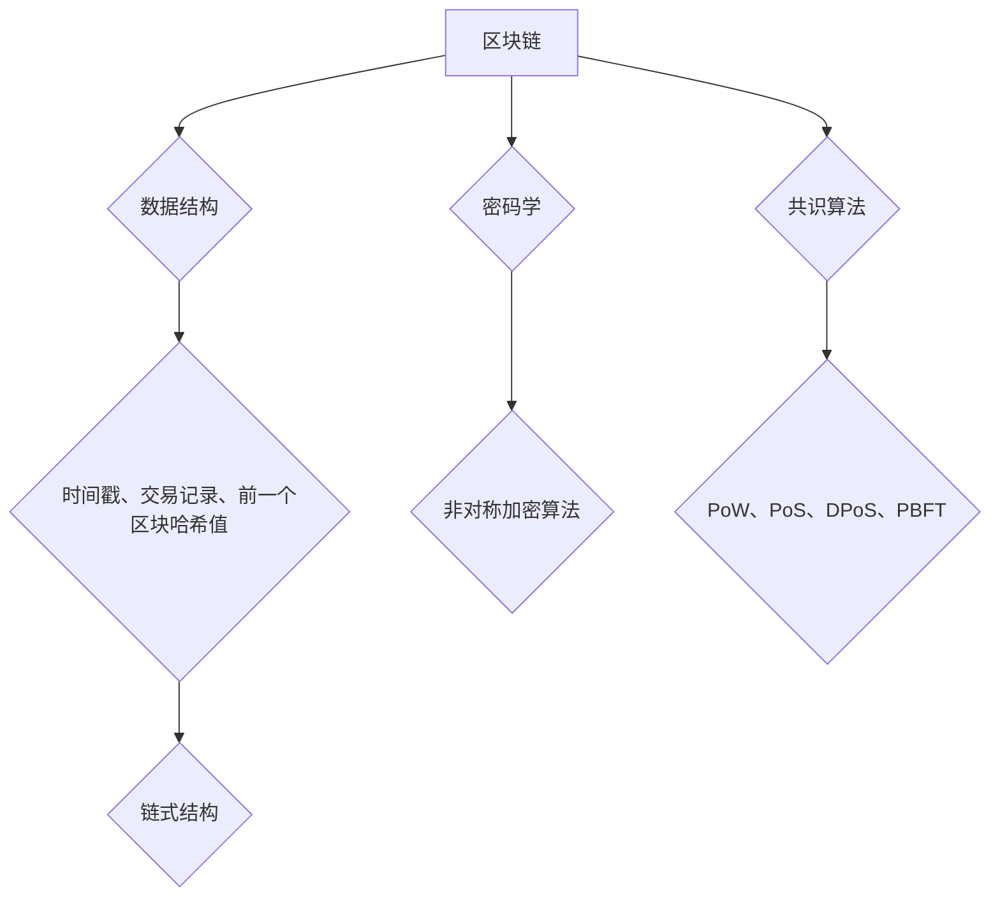

### 1.2 区块链的工作原理

**关键词：** 区块链、数据结构、共识算法、智能合约

区块链的工作原理可以从数据结构、共识算法和智能合约三个方面来解释。

#### 数据结构

区块链的数据结构由一系列按时间顺序排列的区块组成。每个区块包含以下内容：

- **时间戳**：区块生成的具体时间。
- **交易记录**：多个交易记录组成一个区块，每个交易记录包括交易双方的地址、交易金额和附加信息。
- **前一个区块哈希值**：通过哈希函数计算得到，用于将当前区块与前一区块连接，形成链式结构。

#### 共识算法

共识算法是区块链中的核心机制，用于确保网络中的所有节点对区块链的一致性达成共识。以下是几种常见的共识算法：

- **工作量证明（PoW）**：通过解决数学难题来证明节点的工作量，获得生成区块的权力。常见的PoW算法有SHA-256。
- **权益证明（PoS）**：根据节点持有的币龄（币的数量和时间）来决定生成区块的权力，持有币龄越长的节点越有可能生成区块。
- **委托权益证明（DPoS）**：通过投票选举出一定数量的节点作为代表，代表节点负责生成区块。
- **实用拜占庭容错（PBFT）**：在由一定数量节点组成的拜占庭错误环境中，通过预准备、提交和批准等步骤来确保区块链的一致性。

#### 智能合约

智能合约是一种自动执行合约条款的计算机程序，它在区块链上运行并执行。智能合约的编写通常使用特定的编程语言，如Solidity。智能合约的核心功能包括：

- **条件触发**：当满足特定条件时，智能合约会自动执行预定义的操作。
- **数据存储**：智能合约可以存储和检索数据，实现数据的持久化。
- **不可篡改**：由于区块链的不可篡改性，智能合约的执行结果是不可篡改的。

#### Mermaid 流程图

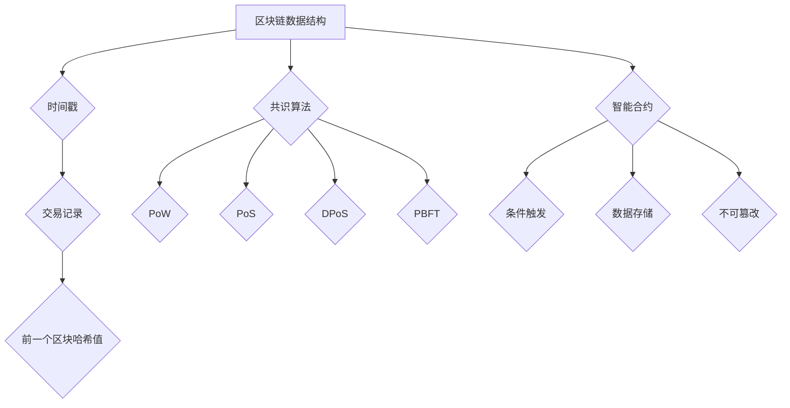

### 1.3 区块链的技术架构

**关键词：** 区块链、底层技术、中间层技术、应用层技术

区块链的技术架构可以分为三个层次：底层技术、中间层技术和应用层技术。每个层次都有其特定的功能和技术组件。

#### 底层技术

底层技术是区块链的基础，包括加密算法、P2P网络和哈希函数。

- **加密算法**：加密算法用于保护交易数据的安全和隐私。常见的加密算法有RSA、椭圆曲线加密（ECDSA）等。在区块链中，非对称加密算法用于签名和验证，确保交易的真实性和不可篡改性。
- **P2P网络**：P2P（Peer-to-Peer）网络是一种分布式网络结构，网络中的节点相互连接，直接进行数据交换。区块链利用P2P网络实现去中心化，提高网络的容错性和扩展性。
- **哈希函数**：哈希函数是将输入数据映射为固定长度的字符串的函数，如SHA-256。在区块链中，哈希函数用于计算区块的哈希值，确保数据的一致性和完整性。

#### 中间层技术

中间层技术是区块链的核心组成部分，包括共识机制、网络协议和交易验证。

- **共识机制**：共识机制是区块链中的关键机制，用于确保网络中的所有节点对区块链的一致性达成共识。常见的共识算法有PoW、PoS、DPoS和PBFT等。
- **网络协议**：网络协议是节点之间进行通信的规则和标准，如Gossip协议和Nakamoto共识协议。网络协议确保了区块链网络的高效运行和数据的可靠传输。
- **交易验证**：交易验证是指对区块链中的交易进行验证的过程，确保交易的有效性和合法性。交易验证包括交易输入的验证、余额检查和签名验证等。

#### 应用层技术

应用层技术是区块链技术在实际应用中的实现，包括去中心化应用（DApp）、分布式存储和数据隐私保护。

- **去中心化应用（DApp）**：DApp是运行在区块链上的应用，其核心特点是去中心化。DApp通过智能合约实现，能够实现透明、安全和不可篡改的数据处理。
- **分布式存储**：分布式存储是将数据存储在多个节点上的技术，提高数据的可靠性和可用性。常见的分布式存储技术有IPFS和Swarm等。
- **数据隐私保护**：数据隐私保护是保护区块链上数据隐私的技术，如零知识证明（ZKP）和同态加密（HE）等。这些技术能够确保数据在区块链上的隐私和安全性。

#### Mermaid 流程图

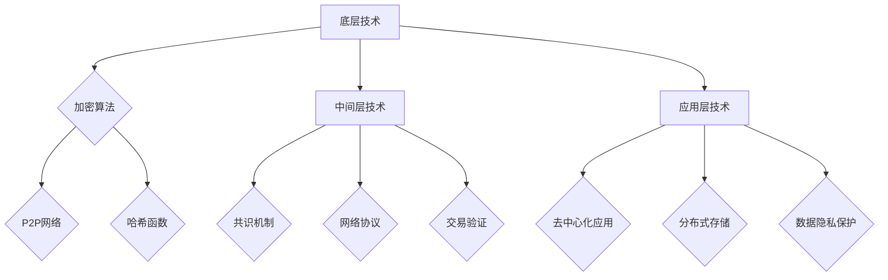

### 1.4 区块链的历史与发展

**关键词：** 区块链、比特币、Ethereum、发展阶段

区块链技术的发展可以分为以下几个阶段：

#### 起源

区块链的起源可以追溯到2008年，当时一个名为中本聪（Satoshi Nakamoto）的匿名人物发布了比特币白皮书《比特币：一种点对点的电子现金系统》。比特币作为第一个基于区块链技术的数字货币，开创了区块链技术的先河。

#### 第一阶段：比特币

比特币的出现标志着区块链技术的初步应用。比特币采用了工作量证明（PoW）作为共识算法，通过解决数学难题来确保网络的安全和一致性。比特币的成功引发了人们对区块链技术的关注和讨论。

#### 第二阶段：智能合约

2013年，Vitalik Buterin提出了Ethereum的概念，旨在创建一个支持智能合约的区块链平台。Ethereum的问世标志着区块链技术的进一步发展，智能合约的出现使得区块链不再仅仅是数字货币的载体，而成为一种可以执行复杂程序的分布式计算平台。

#### 第三阶段：应用与拓展

随着比特币和Ethereum等区块链平台的发展，越来越多的企业和研究机构开始探索区块链技术在各个领域的应用。例如，供应链管理、金融科技、互联网治理等领域。此外，新的区块链平台和共识算法也不断涌现，如EOS、Cardano和Tezos等。

#### 重要的区块链项目和发展阶段

- **比特币**：比特币作为第一个区块链项目，奠定了区块链技术的发展基础。其采用的工作量证明（PoW）共识算法对后续区块链项目产生了深远影响。
- **Ethereum**：Ethereum作为一个支持智能合约的平台，推动了区块链技术的应用拓展，使得区块链不再仅仅是数字货币的载体。
- **EOS**：EOS是一个高性能的区块链平台，旨在提供更快的交易速度和更低的交易成本。其采用的委托权益证明（DPoS）共识算法具有较高的扩展性和去中心化程度。
- **Cardano**：Cardano是一个基于科学原理构建的区块链平台，强调可持续性和可扩展性。其采用的权益证明（PoS）共识算法具有较低的能量消耗和较高的安全性。
- **Tezos**：Tezos是一个自我修正的区块链平台，其独特的治理机制允许社区参与平台的改进。其采用的拜占庭容错（PBFT）共识算法具有较高的安全性和去中心化程度。

通过以上几个阶段的演变，区块链技术逐渐成熟，并开始在各个领域发挥重要作用。随着技术的不断进步和应用场景的拓展，区块链技术有望在未来实现更广泛的应用。

## 第一部分：区块链基础知识

### 1.1 区块链的基本概念

区块链是一种分布式账本技术，它通过密码学和共识算法实现数据的不可篡改性和透明性。区块链的核心特点是去中心化，这意味着没有中央权威机构来控制网络，而是由网络中的所有参与者共同维护。这种去中心化的特性使得区块链在安全性、可靠性和去中心化方面具有显著优势。

#### 区块链的定义

区块链是由一系列按时间顺序排列的区块组成的链式数据结构。每个区块包含一定数量的交易记录，并通过哈希函数与前一个区块连接，形成一条不可篡改的链式结构。区块链的数据结构如下：

1. **区块**：区块是区块链的基本单位，每个区块包含以下信息：
   - **时间戳**：区块生成的时间戳。
   - **交易记录**：区块中包含一定数量的交易记录。
   - **前一个区块的哈希值**：通过哈希函数计算得到，用于将当前区块与前一区块连接。
2. **链式结构**：区块链是一个链式结构，每个区块通过其哈希值与前一个区块连接，形成一条不可篡改的链。

#### 区块链与分布式账本技术的关系

区块链是分布式账本技术的一种实现方式。分布式账本技术是指多个参与者共享一个分布式数据库，每个参与者都保存一份完整的账本副本。区块链作为分布式账本技术的一种，具有以下特点：

1. **去中心化**：区块链没有中央权威机构来控制网络，而是由网络中的所有参与者共同维护。
2. **不可篡改**：区块链的数据一旦被写入，就不可篡改，因为每个区块都通过哈希函数与前一区块连接，形成一条不可篡改的链。
3. **透明性**：区块链上的数据对所有参与者都是透明的，任何参与者都可以查看区块链上的交易记录。

#### 区块链的核心特点

区块链的核心特点包括去中心化、安全性和可信性。

1. **去中心化**：区块链的去中心化特性使其能够打破传统的集中式系统，实现参与者之间的点对点交易，提高系统容错性和安全性。
2. **安全性**：区块链采用密码学技术来保护交易的安全，确保交易数据的隐私和完整性。例如，非对称加密算法用于签名和验证，确保交易的真实性和不可篡改性。
3. **可信性**：区块链的不可篡改性和透明性使得参与者对区块链上的数据具有高度信任，不再需要依赖第三方中介机构进行验证和确认。

#### Mermaid 流程图

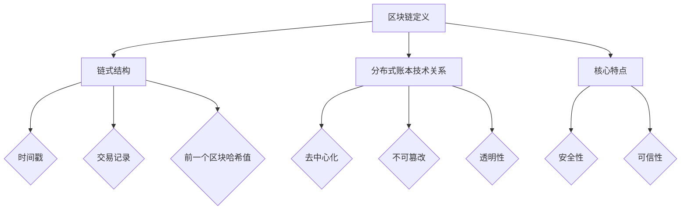

### 1.2 区块链的工作原理

区块链的工作原理可以从数据结构、共识算法和智能合约三个方面来解释。

#### 数据结构

区块链的数据结构由一系列按时间顺序排列的区块组成。每个区块包含以下内容：

- **时间戳**：区块生成的时间戳，用于记录区块生成的具体时间。
- **交易记录**：区块中包含一定数量的交易记录，每个交易记录都包含交易双方的地址、交易金额和附加信息。
- **前一个区块的哈希值**：通过哈希函数计算得到，用于将当前区块与前一区块连接，形成链式结构。

区块链的数据结构如下：

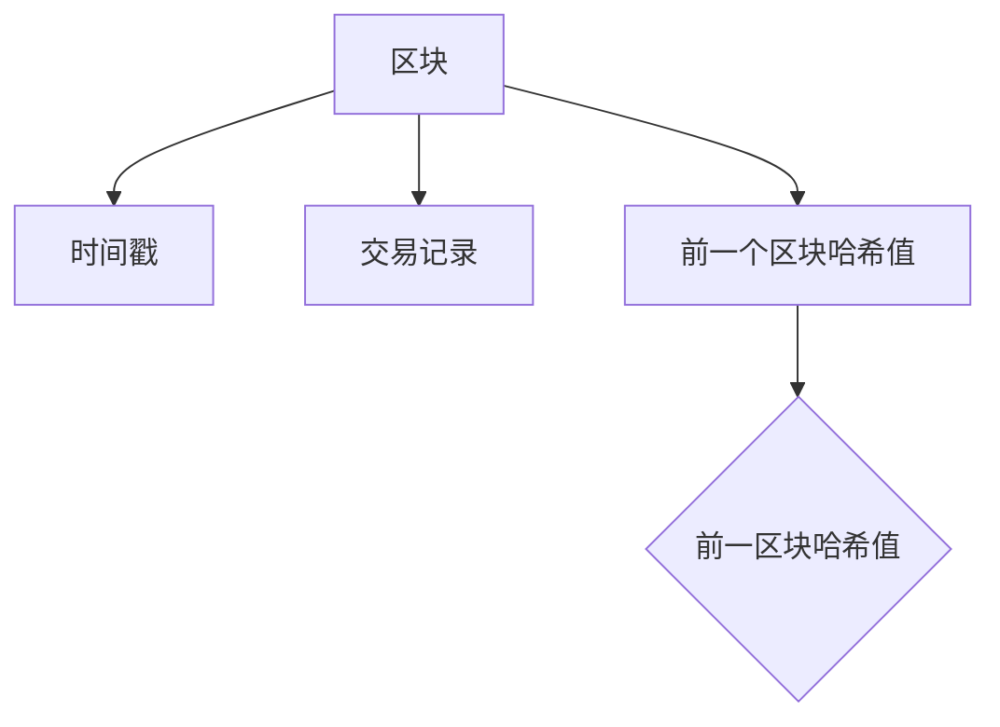

#### 共识算法

共识算法是区块链中的核心机制，用于确保网络中的所有节点对区块链的一致性达成共识。共识算法通过一系列的步骤来验证和确认交易，并将交易记录添加到区块链中。

以下是一个简单的共识算法流程：

1. **交易生成**：参与者向区块链网络发送交易请求。
2. **交易验证**：每个节点对交易进行验证，确保交易的有效性和合法性。
3. **区块生成**：验证通过的交易被添加到一个区块中，并由节点生成一个新的区块。
4. **区块验证**：其他节点对新生成的区块进行验证，确保区块中交易的有效性和区块本身的一致性。
5. **区块添加**：验证通过的区块被添加到区块链中，形成一个不可篡改的链。

以下是一个简单的 Mermaid 流程图：

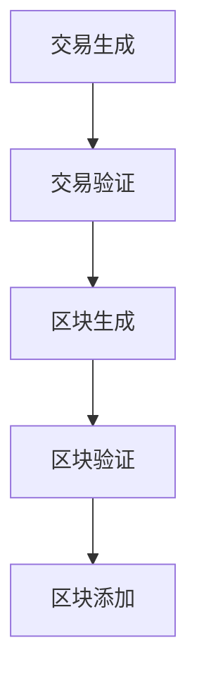

#### 智能合约

智能合约是一种自动执行合约条款的计算机程序，它在区块链上运行并执行。智能合约的编写通常使用特定的编程语言，如 Solidity。

智能合约的核心功能包括：

1. **条件触发**：当满足特定条件时，智能合约会自动执行预定义的操作。
2. **数据存储**：智能合约可以存储和检索数据，实现数据的持久化。
3. **不可篡改**：由于区块链的不可篡改性，智能合约的执行结果是不可篡改的。

以下是一个简单的智能合约示例：

```solidity
// SPDX-License-Identifier: MIT
pragma solidity ^0.8.0;

contract SimpleContract {
    address public owner;

    constructor() {
        owner = msg.sender;
    }

    function deposit() public payable {
        require(msg.value > 0, "Deposit must be greater than 0");
        // Store the deposit amount in a state variable
        uint256 depositAmount = msg.value;
        // Perform additional operations based on the deposit amount
        // ...
    }

    function withdraw() public {
        require(msg.sender == owner, "Only the owner can withdraw");
        // Transfer the stored deposit amount to the owner
        payable(owner).transfer(address(this).balance);
    }
}
```

#### Mermaid 流程图

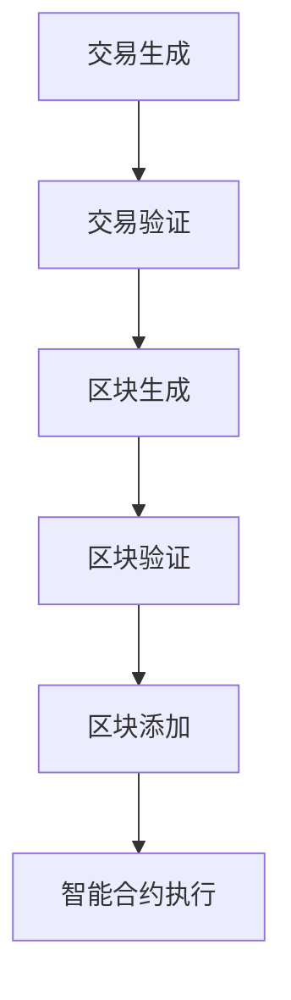

### 1.3 区块链的技术架构

区块链的技术架构可以分为三个层次：底层技术、中间层技术和应用层技术。每个层次都有其特定的功能和技术组件。

#### 底层技术

底层技术是区块链的基础，包括加密算法、P2P网络和哈希函数。

- **加密算法**：加密算法用于保护交易数据的安全和隐私。常见的加密算法有RSA、椭圆曲线加密（ECDSA）等。在区块链中，非对称加密算法用于签名和验证，确保交易的真实性和不可篡改性。

- **P2P网络**：P2P（Peer-to-Peer）网络是一种分布式网络结构，网络中的节点相互连接，直接进行数据交换。区块链利用P2P网络实现去中心化，提高网络的容错性和扩展性。

- **哈希函数**：哈希函数是将输入数据映射为固定长度的字符串的函数，如SHA-256。在区块链中，哈希函数用于计算区块的哈希值，确保数据的一致性和完整性。

#### 中间层技术

中间层技术是区块链的核心组成部分，包括共识机制、网络协议和交易验证。

- **共识机制**：共识机制是区块链中的关键机制，用于确保网络中的所有节点对区块链的一致性达成共识。常见的共识算法有PoW、PoS、DPoS和PBFT等。

- **网络协议**：网络协议是节点之间进行通信的规则和标准，如Gossip协议和Nakamoto共识协议。网络协议确保了区块链网络的高效运行和数据的可靠传输。

- **交易验证**：交易验证是指对区块链中的交易进行验证的过程，确保交易的有效性和合法性。交易验证包括交易输入的验证、余额检查和签名验证等。

#### 应用层技术

应用层技术是区块链技术在实际应用中的实现，包括去中心化应用（DApp）、分布式存储和数据隐私保护。

- **去中心化应用（DApp）**：DApp是运行在区块链上的应用，其核心特点是去中心化。DApp通过智能合约实现，能够实现透明、安全和不可篡改的数据处理。

- **分布式存储**：分布式存储是将数据存储在多个节点上的技术，提高数据的可靠性和可用性。常见的分布式存储技术有IPFS和Swarm等。

- **数据隐私保护**：数据隐私保护是保护区块链上数据隐私的技术，如零知识证明（ZKP）和同态加密（HE）等。这些技术能够确保数据在区块链上的隐私和安全性。

#### Mermaid 流程图

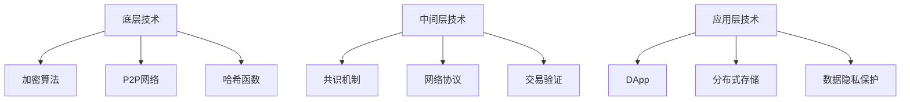

### 1.4 区块链的历史与发展

区块链技术的发展可以分为以下几个阶段：

#### 第一阶段：起源

区块链的起源可以追溯到2008年，当时一个名为中本聪（Satoshi Nakamoto）的匿名人物发布了比特币白皮书《比特币：一种点对点的电子现金系统》。比特币作为第一个基于区块链技术的数字货币，开创了区块链技术的先河。

#### 第二阶段：比特币

比特币的出现标志着区块链技术的初步应用。比特币采用了工作量证明（PoW）作为共识算法，通过解决数学难题来确保网络的安全和一致性。比特币的成功引发了人们对区块链技术的关注和讨论。

#### 第三阶段：智能合约

2013年，Vitalik Buterin提出了Ethereum的概念，旨在创建一个支持智能合约的区块链平台。Ethereum的问世标志着区块链技术的进一步发展，智能合约的出现使得区块链不再仅仅是数字货币的载体，而成为一种可以执行复杂程序的分布式计算平台。

#### 第四阶段：应用与拓展

随着比特币和Ethereum等区块链平台的发展，越来越多的企业和研究机构开始探索区块链技术在各个领域的应用。例如，供应链管理、金融科技、互联网治理等领域。此外，新的区块链平台和共识算法也不断涌现，如EOS、Cardano和Tezos等。

#### 重要的区块链项目和发展阶段

- **比特币**：比特币作为第一个区块链项目，奠定了区块链技术的发展基础。其采用的工作量证明（PoW）共识算法对后续区块链项目产生了深远影响。

- **Ethereum**：Ethereum作为一个支持智能合约的平台，推动了区块链技术的应用拓展，使得区块链不再仅仅是数字货币的载体。

- **EOS**：EOS是一个高性能的区块链平台，旨在提供更快的交易速度和更低的交易成本。其采用的委托权益证明（DPoS）共识算法具有较高的扩展性和去中心化程度。

- **Cardano**：Cardano是一个基于科学原理构建的区块链平台，强调可持续性和可扩展性。其采用的权益证明（PoS）共识算法具有较低的能量消耗和较高的安全性。

- **Tezos**：Tezos是一个自我修正的区块链平台，其独特的治理机制允许社区参与平台的改进。其采用的拜占庭容错（PBFT）共识算法具有较高的安全性和去中心化程度。

通过以上几个阶段的演变，区块链技术逐渐成熟，并开始在各个领域发挥重要作用。随着技术的不断进步和应用场景的拓展，区块链技术有望在未来实现更广泛的应用。

## 第二部分：区块链核心算法

### 2.1 拜占庭将军问题

**关键词：** 拜占庭将军问题、分布式一致性算法、共识算法

拜占庭将军问题（Byzantine Generals Problem，BGP）是一个经典的分布式系统问题，描述了在一个分布式系统中，一些节点可能出现敌对行为（称为“拜占庭节点”），导致整个系统无法达成一致。该问题得名于拜占庭帝国的将军们，他们需要共同决定是否发动攻击，但部分将军可能出于自私或误导的目的发送虚假消息。

#### 拜占庭将军问题的提出

拜占庭将军问题的提出旨在研究分布式系统中的一致性问题。假设一支拜占庭帝国的军队由多名将军组成，每个将军都需要与其他将军共同决定是否发动攻击。为了确保决策的一致性，将军们需要通过通信网络相互交流信息。然而，由于部分将军可能存在敌意或误导行为，整个系统需要找到一种机制，确保最终决策的正确性。

#### 解决方案：分布式一致性算法

拜占庭将军问题的解决方案是分布式一致性算法，这类算法旨在确保即使在部分节点出现敌对行为的情况下，整个系统仍能达成一致。以下是一些常见的分布式一致性算法：

1. **Paxos算法**：Paxos算法是一种分布式一致性算法，用于在一个分布式系统中选出一个领导者并达成一致。Paxos算法的核心思想是将复杂的一致性问题分解为多个简单的步骤，从而提高算法的可靠性和效率。
2. **Raft算法**：Raft算法是另一种分布式一致性算法，旨在提高Paxos算法的可理解性和实现复杂性。Raft算法通过明确领导者角色和日志复制机制，简化了一致性算法的实现过程。
3. **实用拜占庭容错（PBFT）**：实用拜占庭容错算法是一种在拜占庭错误环境中实现分布式一致性的算法。PBFT通过预准备、提交和批准等步骤，确保系统在敌对节点存在的情况下仍能达成一致。

#### Mermaid 流程图

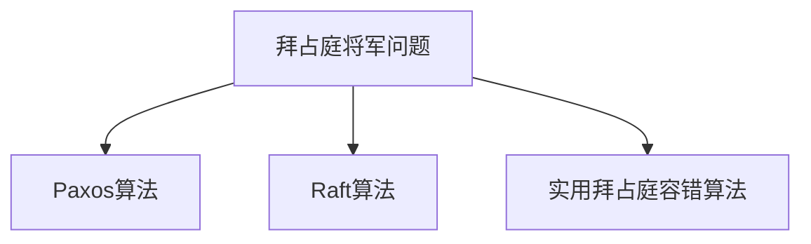

### 2.2 共识算法

**关键词：** 共识算法、工作量证明（PoW）、权益证明（PoS）、委托权益证明（DPoS）、实用拜占庭容错（PBFT）

共识算法是区块链中的核心机制，用于确保网络中的所有节点对区块链的一致性达成共识。共识算法通过一系列的步骤来验证和确认交易，并将交易记录添加到区块链中。以下是几种常见的共识算法：

#### 工作量证明（Proof of Work，PoW）

工作量证明算法是最早的共识算法，由中本聪在比特币中提出。PoW算法通过解决数学难题来证明节点的工作量，获得生成区块的权力。以下是PoW算法的基本步骤：

1. **挖矿**：节点（矿工）接收网络中的交易，并将这些交易打包成一个区块。
2. **计算哈希值**：矿工尝试对区块进行哈希运算，直到生成的哈希值小于预设的目标值。
3. **广播区块**：矿工将生成的区块广播到网络中的其他节点。
4. **验证区块**：其他节点验证区块的有效性，包括交易验证和哈希值验证。
5. **添加区块**：验证通过的区块被添加到区块链中。

#### 权益证明（Proof of Stake，PoS）

权益证明算法是一种替代PoW的共识算法，通过节点的权益（通常是其持有的币龄）来决定生成区块的权力。以下是PoS算法的基本步骤：

1. **权益计算**：节点根据其持有的币龄（币的数量和时间）计算权益值。
2. **随机选取**：系统随机选择具有较高权益值的节点作为区块生成者。
3. **生成区块**：区块生成者将接收到的交易打包成一个区块，并添加到区块链中。
4. **验证区块**：其他节点验证区块的有效性，包括交易验证和权益值验证。

#### 委托权益证明（Delegated Proof of Stake，DPoS）

委托权益证明算法是对PoS算法的一种改进，通过选举出一定数量的代表节点来生成区块。以下是DPoS算法的基本步骤：

1. **选举代表节点**：节点通过投票选举出一定数量的代表节点。
2. **随机选取**：系统根据某种算法（如轮换机制）随机选取代表节点作为区块生成者。
3. **生成区块**：代表节点将接收到的交易打包成一个区块，并添加到区块链中。
4. **验证区块**：其他节点验证区块的有效性，包括交易验证和代表节点权益值验证。

#### 实用拜占庭容错（Practical Byzantine Fault Tolerance，PBFT）

实用拜占庭容错算法是一种在拜占庭错误环境中实现分布式一致性的算法。PBFT通过预准备、提交和批准等步骤，确保系统在敌对节点存在的情况下仍能达成一致。以下是PBFT算法的基本步骤：

1. **预准备阶段**：节点发送预准备消息，表明其支持某个提案。
2. **提交阶段**：节点发送提交消息，将提案提交给其他节点。
3. **批准阶段**：节点对提案进行批准，确保提案在大多数节点上得到确认。
4. **执行阶段**：一旦提案被批准，系统执行提案。

#### Mermaid 流程图

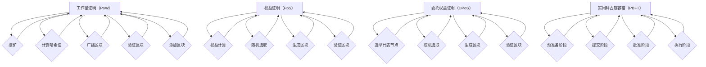

### 2.3 智能合约

**关键词：** 智能合约、智能合约语言、Solidity、条件触发、数据存储

智能合约是一种自动执行合约条款的计算机程序，它在区块链上运行并执行。智能合约的出现使得区块链不再仅仅是数字货币的载体，而成为一种可以执行复杂程序的分布式计算平台。智能合约的编写通常使用特定的编程语言，如Solidity。

#### 智能合约的定义

智能合约是一种自动执行合约条款的计算机程序，它在区块链上运行并执行。智能合约通过编程语言编写，定义了合约的条款和条件，并在满足特定条件时自动执行。智能合约的核心功能包括：

1. **条件触发**：当满足特定条件时，智能合约会自动执行预定义的操作。条件可以是时间、金额或其他任何逻辑表达式。
2. **数据存储**：智能合约可以存储和检索数据，实现数据的持久化。数据通常存储在区块链上，确保数据的不可篡改性和透明性。
3. **不可篡改**：由于区块链的不可篡改性，智能合约的执行结果是不可篡改的。这意味着一旦智能合约执行，其结果将永久存储在区块链上。

#### 编写智能合约的原理

编写智能合约的原理包括以下几个步骤：

1. **选择智能合约语言**：常见的智能合约语言包括Solidity、Vyper和Scilla等。Solidity是最常用的智能合约语言，它具有丰富的语法和功能。
2. **定义合约结构**：智能合约的结构包括合约名称、版本号、作者信息等。合约结构还定义了合约的访问权限，如公开、私有和内部访问。
3. **编写合约逻辑**：合约逻辑定义了合约的条款和条件，以及条件触发和数据存储等功能。常见的逻辑操作包括条件判断、循环、函数调用等。
4. **编译和部署**：将编写的智能合约编译为字节码，并部署到区块链上。部署过程中，需要选择合适的区块链平台和合约地址。

#### 智能合约的开发框架

智能合约的开发框架通常包括以下步骤：

1. **环境搭建**：安装区块链客户端（如Ethereum客户端）和智能合约开发工具（如Truffle、Hardhat等）。
2. **编写智能合约**：使用Solidity或其他智能合约语言编写合约代码，并保存为`.sol`文件。
3. **编译和测试**：使用编译器将智能合约编译为字节码，并使用测试框架（如Mocha、Chai等）编写和运行合约测试用例。
4. **部署和运行**：将编译后的智能合约部署到区块链上，并使用区块链客户端进行操作和测试。

#### Mermaid 流程图

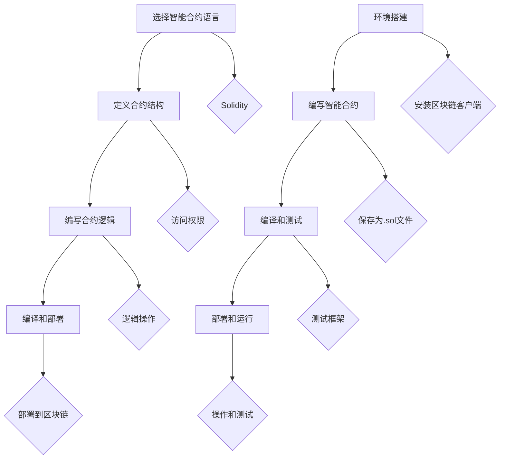

### 3.1 货币系统

**关键词：** 数字货币、比特币、区块链、去中心化货币、货币政策

货币系统是经济体系的核心组成部分，用于实现商品和服务的交换。传统的货币系统通常依赖于中央银行和金融机构进行管理，这种集中式系统存在一些局限性，如信任问题、透明性问题等。区块链技术的出现为货币系统带来了新的可能性，特别是数字货币的概念。

#### 数字货币的概念

数字货币是一种使用区块链技术实现的货币形式，它通过去中心化的方式实现货币的发行、交易和管理。数字货币的主要特点包括：

1. **去中心化**：数字货币不依赖于任何中央机构，而是由网络中的所有参与者共同维护。这种去中心化的特性提高了货币系统的安全性、透明性和去中心化程度。
2. **匿名性**：数字货币的交易通常是匿名的，用户可以使用虚拟钱包进行交易，而不需要披露真实身份。这种匿名性提高了用户的隐私保护。
3. **不可篡改性**：由于区块链的不可篡改性，数字货币的交易记录一旦被写入区块链，就不可篡改。这种特性确保了货币系统的透明性和可信性。

#### 区块链在数字货币中的应用

区块链在数字货币中的应用主要体现在以下几个方面：

1. **发行**：数字货币的发行通常通过区块链技术实现，确保货币的发行过程透明、去中心化。例如，比特币的发行过程是通过挖矿实现的。
2. **交易**：数字货币的交易通过区块链上的智能合约实现，确保交易的自动化、透明和不可篡改。例如，比特币的交易是通过区块链上的智能合约自动执行的。
3. **管理**：数字货币的管理通过区块链技术实现，确保货币的发行、流通和回收过程透明、可追溯。例如，比特币的货币供应量和管理是通过区块链上的智能合约自动执行的。
4. **货币政策**：数字货币的货币政策通过区块链技术实现，确保货币政策的制定和执行透明、去中心化。例如，比特币的货币政策是通过区块链上的共识算法自动执行的。

#### 比特币的交易流程

比特币作为一种数字货币，其交易流程如下：

1. **生成地址**：用户生成一个比特币地址，用于接收和发送比特币。
2. **发起交易**：用户通过比特币钱包发起交易，指定接收地址、交易金额和附加信息。
3. **交易验证**：比特币网络中的节点对交易进行验证，确保交易的有效性和合法性。
4. **打包成区块**：验证通过的交易被打包成一个区块，并附加到区块链上。
5. **区块链确认**：新区块被添加到区块链后，交易即被确认。一般情况下，经过一定数量的区块确认后，交易被认为是最终完成的。

#### Mermaid 流程图

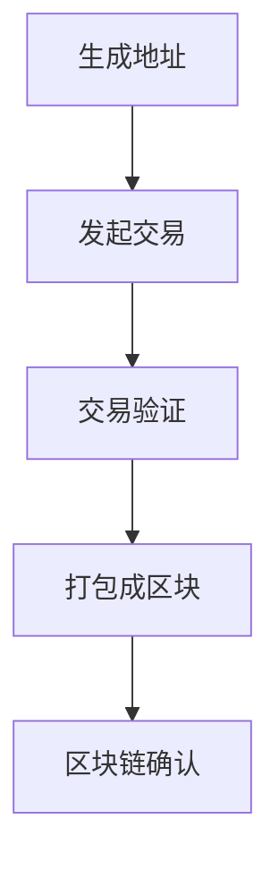

### 3.2 供应链管理

**关键词：** 区块链、供应链管理、可追溯性、透明性、智能合约

供应链管理是企业管理中至关重要的一个环节，涉及到从原材料采购到产品交付的整个过程。传统的供应链管理通常依赖于纸笔记录、电子表格或其他第三方系统，这导致了一系列问题，如数据不一致、信息滞后、无法保证数据的完整性和透明性等。区块链技术的引入为供应链管理带来了新的解决方案，通过去中心化、不可篡改和透明的特性，提高了供应链的可追溯性和透明性。

#### 区块链在供应链管理中的应用

区块链在供应链管理中的应用主要体现在以下几个方面：

1. **数据记录和存储**：区块链提供了一个分布式、不可篡改的数据库，供应链中的各个环节可以将关键信息记录在区块链上，如采购订单、生产记录、运输信息等。这些信息一旦被写入区块链，就不可篡改，保证了数据的完整性和真实性。
2. **数据共享和透明性**：区块链的去中心化特性使得供应链中的各个环节可以实时共享数据，而无需依赖于第三方。这种透明性提高了供应链的透明度，有助于各环节之间的协作和信任建立。
3. **智能合约**：智能合约是区块链上的计算机程序，可以自动执行合同条款。在供应链管理中，智能合约可以用于自动化订单执行、支付处理和违约处理等，减少了人为干预和操作风险。

#### 供应链的可追溯性和透明性

区块链技术为供应链的可追溯性和透明性提供了强有力的支持：

1. **可追溯性**：通过区块链，每个商品从生产到交付的整个过程都可以被追踪。每个环节的数据都被记录在区块链上，形成一个完整的供应链历史记录。这种可追溯性有助于追溯问题的根源，提高供应链的效率和质量。
2. **透明性**：区块链上的数据对所有参与者都是可见的，供应链的各个环节都可以实时查询和验证数据。这种透明性提高了供应链的信任度，减少了信息不对称和不确定性。

#### 智能合约在供应链中的应用案例

智能合约在供应链管理中有着广泛的应用，以下是一个简单的应用案例：

1. **订单执行**：当一个采购订单被创建时，智能合约可以自动验证订单的合法性，并触发后续的生产和物流流程。
2. **支付处理**：在供应链的各个环节中，智能合约可以自动执行支付流程，确保支付及时且准确。例如，当一个产品被成功交付后，智能合约可以自动将款项支付给供应商。
3. **违约处理**：当供应链中的某个环节出现违约时，智能合约可以自动执行违约条款，如罚款、终止合同等。

#### Mermaid 流程图

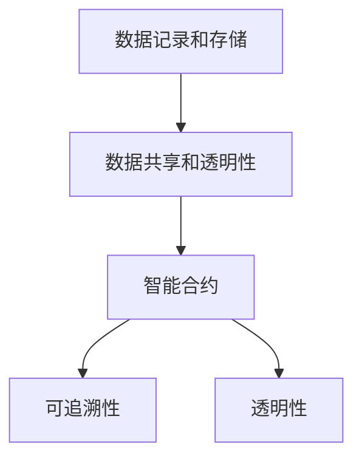

### 3.3 金融科技

**关键词：** 区块链、金融科技、去中心化金融（DeFi）、智能合约、金融服务

金融科技（FinTech）是指利用新技术（如区块链、人工智能、云计算等）来创新金融服务和产品。区块链技术的引入为金融科技带来了新的可能性，特别是去中心化金融（DeFi）的概念。DeFi是一种基于区块链的金融服务，旨在通过去中心化的方式提供传统金融服务的功能，如借贷、交易、支付等。

#### 去中心化金融（DeFi）的概念

去中心化金融（DeFi）是指利用区块链技术实现金融服务去中心化的概念。DeFi的核心特点是：

1. **去中心化**：DeFi不依赖于传统的金融机构，而是通过智能合约和区块链网络提供金融服务。这种去中心化的特性提高了金融服务的透明性、可靠性和去中心化程度。
2. **透明性**：DeFi的所有交易和操作都在区块链上公开透明，所有参与者都可以查看和验证。这种透明性提高了金融服务的可信度，减少了信息不对称。
3. **自动化**：DeFi中的金融服务是通过智能合约自动执行的，减少了人为干预和操作风险。智能合约确保了金融服务的自动化、高效和可预测性。

#### 区块链在金融科技中的应用

区块链在金融科技中的应用主要体现在以下几个方面：

1. **支付和交易**：区块链技术可以用于实现安全的支付和交易，降低了交易成本和风险。例如，比特币和以太坊等区块链平台提供了去中心化的支付解决方案。
2. **身份验证和反欺诈**：区块链技术可以用于身份验证和反欺诈，通过不可篡改的记录确保用户的真实性和安全性。例如，智能合约可以用于验证用户身份，防止欺诈行为。
3. **智能合约**：智能合约是区块链上的计算机程序，可以用于实现自动化金融服务。智能合约确保了金融服务的自动化、高效和可信性。例如，DeFi平台使用智能合约提供借贷、交易和支付服务。

#### DeFi的应用场景

DeFi的应用场景非常广泛，以下是一些常见的应用场景：

1. **借贷**：DeFi平台可以提供去中心化的借贷服务，用户可以借出或借入加密货币，通过智能合约自动执行借贷过程。这种借贷方式无需依赖传统金融机构，降低了借贷成本。
2. **交易**：DeFi平台可以提供去中心化的交易服务，用户可以在线上交易市场进行买卖，通过智能合约自动执行交易。这种交易方式无需依赖传统交易所，提高了交易的透明性和效率。
3. **支付**：DeFi平台可以提供去中心化的支付服务，用户可以通过智能合约进行跨境支付，降低了支付成本和风险。这种支付方式无需依赖传统支付系统，提高了支付的便捷性和安全性。

#### Mermaid 流程图

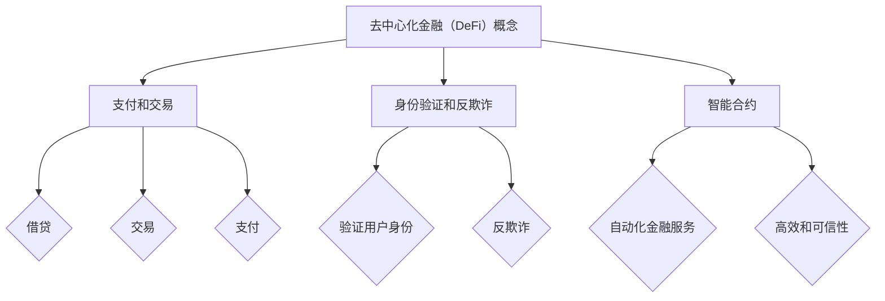

### 3.4 互联网治理

**关键词：** 区块链、互联网治理、数据隐私保护、去中心化身份验证、网络安全

互联网治理是指对互联网的管理、监督、协调和规范，以确保互联网的稳定、安全和可持续发展。传统的互联网治理通常依赖于中央权威机构，但这种方式存在一些问题，如数据隐私保护不足、网络安全风险高、信息不对称等。区块链技术的引入为互联网治理带来了新的可能性，通过去中心化、不可篡改和透明的特性，提高了互联网治理的效率和安全性。

#### 区块链在互联网治理中的作用

区块链在互联网治理中的作用主要体现在以下几个方面：

1. **数据隐私保护**：区块链技术可以用于实现数据隐私保护，通过加密技术和分布式存储技术确保用户数据的隐私和安全。例如，零知识证明（ZKP）和同态加密（HE）等技术可以用于保护用户隐私。
2. **去中心化身份验证**：区块链技术可以用于实现去中心化身份验证，用户可以在区块链上创建和验证自己的身份，而不需要依赖第三方身份认证机构。这种去中心化的身份验证方式提高了身份验证的效率和可信度。
3. **网络安全**：区块链技术可以用于提高网络安全，通过加密技术和分布式存储技术确保网络数据的安全和完整性。例如，区块链可以用于防止DDoS攻击、数据篡改等安全威胁。

#### 数据隐私保护与去中心化身份验证

区块链在数据隐私保护和去中心化身份验证中的应用如下：

1. **数据隐私保护**：
   - **零知识证明（ZKP）**：零知识证明是一种密码学技术，允许证明某个陈述是真实的，而不需要透露具体信息。在区块链上，ZKP可以用于保护用户隐私，例如，在交易过程中，用户可以证明拥有足够的余额，而不需要公开具体的余额数值。
   - **同态加密（HE）**：同态加密是一种加密技术，允许在加密的数据上进行计算，而不需要解密。在区块链上，HE可以用于确保数据的隐私和安全，例如，在智能合约执行过程中，数据可以加密处理，确保数据隐私。

2. **去中心化身份验证**：
   - **数字身份**：区块链可以用于创建和管理数字身份，用户可以在区块链上创建和验证自己的数字身份，而不需要依赖第三方机构。例如，Ethereum上的ERC-725标准定义了一种自 sovereign identity协议，允许用户创建和管理自己的数字身份。
   - **多因素认证**：区块链可以与多因素认证技术结合，实现更安全的身份验证。例如，用户可以使用区块链上的智能合约实现多因素认证，结合密码、生物特征和设备指纹等多种认证方式。

#### Mermaid 流程图

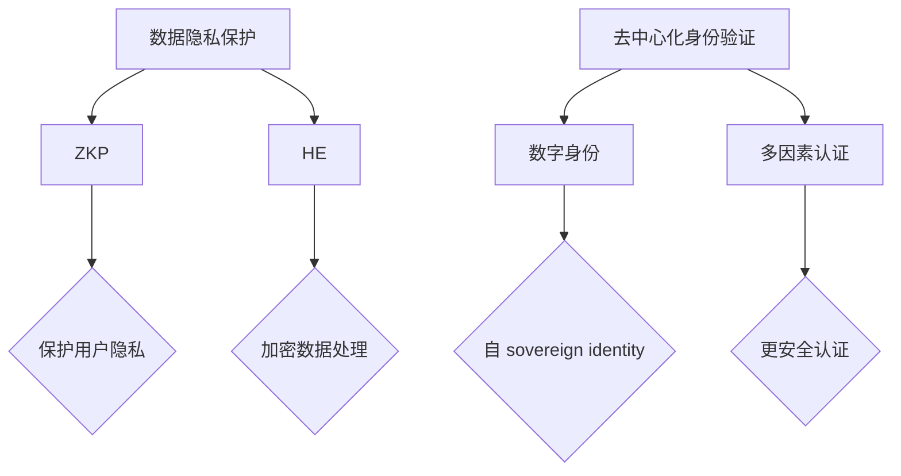

### 4.1 区块链项目开发流程

区块链项目的开发流程涉及多个阶段，从项目需求分析到项目上线和维护。以下是一个典型的区块链项目开发流程：

#### 项目需求分析

项目需求分析是项目开发的第一步，旨在明确项目的目标和需求。在这一阶段，开发团队需要与客户或利益相关者进行沟通，了解项目的背景、目标、需求和约束条件。需求分析的结果通常包括项目范围、功能需求、非功能需求和项目约束。

- **项目范围**：明确项目的范围和边界，包括项目的目标、功能、性能和可靠性等。
- **功能需求**：列出项目需要实现的功能，如交易、存储、权限控制等。
- **非功能需求**：列出项目需要满足的非功能要求，如性能、安全性、可扩展性等。
- **项目约束**：确定项目的约束条件，如时间、预算、资源等。

#### 设计阶段

设计阶段是项目开发的关键阶段，旨在制定项目的架构和技术方案。在这一阶段，开发团队需要根据需求分析的结果，设计项目的系统架构、数据模型和接口规范。设计阶段的结果通常包括项目架构图、数据模型、接口文档和详细设计文档。

- **系统架构**：设计项目的系统架构，包括前端、后端、数据库、区块链节点等。
- **数据模型**：设计项目的数据模型，包括数据库表结构、数据关系和索引等。
- **接口规范**：定义项目的接口规范，包括API接口、数据格式和通信协议等。
- **详细设计文档**：编写项目的详细设计文档，包括每个模块的详细设计、算法实现和测试方案等。

#### 开发与测试

开发阶段是项目实现的具体实施阶段，开发团队根据设计文档进行代码编写和系统实现。测试阶段是项目验证和确认的阶段，旨在确保项目功能正确、性能稳定和安全可靠。开发与测试阶段通常包括以下步骤：

- **代码编写**：根据设计文档进行代码编写，实现项目的功能模块。
- **单元测试**：编写单元测试用例，对每个模块进行功能测试和性能测试。
- **集成测试**：将各个模块集成起来，进行集成测试和系统测试，确保系统整体功能的正确性和稳定性。
- **压力测试**：对系统进行压力测试和负载测试，确保系统在高并发、高负载情况下的性能和稳定性。

#### 上线与维护

上线阶段是将项目部署到生产环境，使项目正式对外提供服务。维护阶段是项目上线后的持续优化和更新。上线与维护阶段通常包括以下步骤：

- **环境搭建**：搭建项目所需的环境，包括服务器、数据库、区块链节点等。
- **部署上线**：将项目部署到生产环境，确保项目能够正常运行。
- **监控与维护**：对项目进行监控和运维，及时发现并解决项目中出现的问题。
- **功能更新与优化**：根据用户反馈和业务需求，对项目进行功能更新和优化，提高系统的性能和用户体验。

#### Mermaid 流�程图

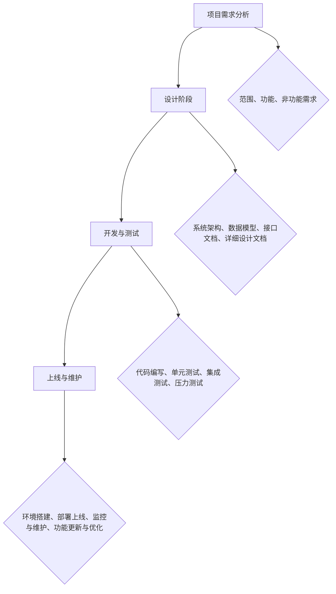

### 4.2 区块链项目案例分析

在区块链技术的实际应用中，有许多成功的项目案例，这些案例展示了区块链技术的潜力和价值。以下是一个区块链项目案例的分析：

#### 案例背景

某知名电商平台为了提高供应链管理的效率，降低成本，决定引入区块链技术。该平台的主要需求包括：

1. **提高透明度**：确保供应链的各个环节数据透明，便于监控和追溯。
2. **降低风险**：通过去中心化技术，降低供应链中信息不对称和欺诈风险。
3. **提高效率**：通过自动化流程，减少人工干预，提高供应链的响应速度。

#### 项目目标

1. **构建透明供应链**：实现供应链中各个环节的数据上链，包括采购、生产、物流等。
2. **确保数据不可篡改**：确保区块链上的数据一旦写入，就不可篡改，提高数据的可信度。
3. **自动化流程**：通过智能合约实现供应链中某些环节的自动化，减少人工干预。

#### 实施过程

1. **需求分析**：与电商平台和供应链各方沟通，明确项目需求和目标。
2. **技术选型**：选择适合该项目的区块链平台和开发工具，如Ethereum和Truffle。
3. **系统设计**：设计项目的技术架构和数据模型，包括前端、后端、数据库和区块链节点等。
4. **代码编写**：根据设计文档进行代码编写，实现供应链管理的功能模块。
5. **单元测试**：编写单元测试用例，对每个模块进行功能测试和性能测试。
6. **集成测试**：将各个模块集成起来，进行集成测试和系统测试，确保系统整体功能的正确性和稳定性。
7. **上线部署**：将项目部署到生产环境，确保项目能够正常运行。
8. **监控与维护**：对项目进行监控和运维，及时发现并解决项目中出现的问题。
9. **功能更新与优化**：根据用户反馈和业务需求，对项目进行功能更新和优化。

#### 成功因素

1. **需求明确**：明确项目需求和目标，确保项目能够满足实际需求。
2. **技术选型**：选择适合的技术平台和工具，确保项目的可行性和性能。
3. **团队协作**：项目团队协作紧密，确保项目能够按时交付。
4. **持续优化**：根据用户反馈和业务需求，持续优化和更新项目。

#### 失败案例分析

尽管区块链项目有许多成功案例，但也存在一些失败案例。以下是一个区块链项目失败案例的分析：

#### 案例背景

某初创公司推出一款基于区块链的社交平台，旨在通过去中心化方式实现社交网络的自由和公平。该项目的主要目标包括：

1. **去中心化**：实现社交网络的去中心化，减少对中心化平台的依赖。
2. **内容激励**：通过区块链技术实现内容激励，鼓励用户生成和分享优质内容。

#### 项目目标

1. **去中心化社交平台**：构建一个完全去中心化的社交平台，所有用户都可以自由参与。
2. **内容激励机制**：通过区块链技术实现内容激励，激励用户生成和分享优质内容。

#### 实施过程

1. **需求分析**：与用户和专家进行沟通，明确项目需求和目标。
2. **技术选型**：选择适合的技术平台和工具，如Ethereum和Ganache。
3. **系统设计**：设计项目的技术架构和数据模型，包括前端、后端、数据库和区块链节点等。
4. **代码编写**：根据设计文档进行代码编写，实现社交平台的功能模块。
5. **单元测试**：编写单元测试用例，对每个模块进行功能测试和性能测试。
6. **集成测试**：将各个模块集成起来，进行集成测试和系统测试，确保系统整体功能的正确性和稳定性。
7. **上线部署**：将项目部署到生产环境，确保项目能够正常运行。
8. **监控与维护**：对项目进行监控和运维，及时发现并解决项目中出现的问题。
9. **功能更新与优化**：根据用户反馈和业务需求，对项目进行功能更新和优化。

#### 失败原因

1. **技术实现难度**：区块链技术复杂，项目团队在技术实现上遇到困难，导致项目进度延误。
2. **市场需求不明确**：项目团队对市场需求分析不足，导致项目功能与用户需求不符。
3. **资金问题**：项目资金不足，导致项目无法持续进行。
4. **团队协作**：项目团队协作不畅，导致项目进度延误和问题解决不及时。

#### 启示

1. **明确项目目标**：在项目启动前，明确项目目标和需求，确保项目与用户需求相符。
2. **技术选型和团队协作**：选择合适的技术平台和工具，并建立高效的团队协作机制。
3. **市场需求分析**：进行充分的市场需求分析，确保项目能够满足用户需求。
4. **持续优化**：根据用户反馈和业务需求，持续优化和更新项目。

### 4.3 区块链项目未来趋势

区块链技术作为一种新兴技术，正逐步应用于各个领域，展现出巨大的潜力。未来，区块链项目有望在以下几个方面实现进一步发展：

#### 技术成熟度

随着区块链技术的不断发展和完善，其技术成熟度将逐渐提高。未来，区块链项目将采用更高效、更安全的共识算法，如权益证明（PoS）、授权权益证明（DPoS）和实用拜占庭容错（PBFT）等。此外，区块链技术的性能和可扩展性也将得到提升，以满足更多应用场景的需求。

#### 应用领域拓展

区块链项目将在更多领域得到应用，包括供应链管理、金融科技、物联网、医疗保健、身份验证等。区块链技术将帮助这些领域实现数据透明性、安全性、去中心化和高效协作。

#### 去中心化金融（DeFi）发展

DeFi是区块链项目的一个重要应用领域，未来将继续快速发展。DeFi平台将提供更多金融服务，如去中心化借贷、交易、保险等，为用户提供更安全、更高效的金融服务。

#### 跨链互操作性

随着区块链项目的增多，跨链互操作性将成为一个重要趋势。通过跨链技术，不同区块链项目之间可以实现数据交换和价值转移，从而形成一个更加紧密的区块链生态系统。

#### 法规与监管

随着区块链项目的普及，相关的法规和监管也将逐步完善。未来，区块链项目将面临更加严格的监管环境，这将在一定程度上促进区块链技术的健康发展。

#### Mermaid 流程图

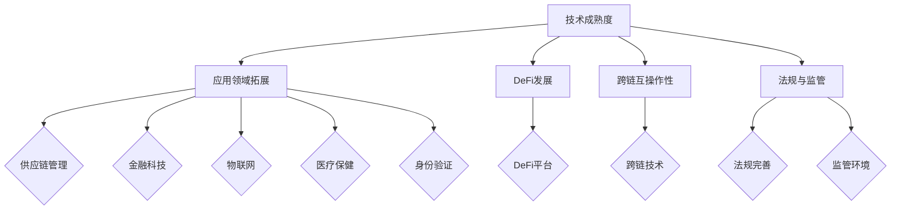

### 总结

区块链技术作为一种革命性的技术，正逐步改变着传统行业，并在供应链管理、金融科技、物联网等领域展现出巨大的潜力。在未来，随着技术的不断成熟和应用领域的拓展，区块链项目将发挥越来越重要的作用。然而，区块链项目在开发过程中也需要注意市场需求分析、技术选型和团队协作等问题，以确保项目的成功实施。通过对区块链项目的深入研究和实践，我们相信区块链技术将在未来带来更多的创新和变革。作者：AI天才研究院/AI Genius Institute & 禅与计算机程序设计艺术 /Zen And The Art of Computer Programming。

---

关键词：区块链、分布式账本、去中心化、共识算法、智能合约、数字货币、供应链管理、金融科技、DeFi、互联网治理、跨链互操作性、法规与监管。

摘要：本文介绍了区块链的基本概念、工作原理、技术架构和核心算法，探讨了区块链在货币系统、供应链管理、金融科技和互联网治理等领域的应用，并通过案例分析总结了区块链项目的成功与失败因素，展望了区块链项目的未来趋势。作者：AI天才研究院/AI Genius Institute & 禅与计算机程序设计艺术 /Zen And The Art of Computer Programming。

