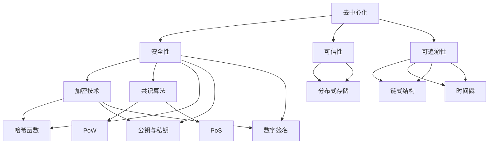

                 

### 文章标题

# 意义的区块链：去中心化的价值交换系统

### 文章关键词

- 区块链
- 去中心化
- 价值交换
- 智能合约
- 共识算法
- 加密技术

### 文章摘要

本文深入探讨了区块链技术的本质及其在社会价值层面的应用。区块链作为一种去中心化的价值交换系统，通过加密技术和共识算法实现了安全、可信的数据存储和传输。本文将详细分析区块链的核心概念，包括工作原理、核心算法、价值传递机制以及应用场景，旨在为读者提供关于区块链技术全面且深入的理解。

### 目录大纲

## 第一部分：区块链基础与概念

### 第1章 区块链概述

#### 1.1 区块链的定义与特点

- 去中心化
- 安全性
- 可信性
- 可追溯性

#### 1.2 区块链的历史与发展

- 区块链的起源
- 主要的区块链类型
- 区块链技术的演进

### 第2章 区块链的核心概念

#### 2.1 区块链的工作原理

- 区块与链的关系
- 挖矿与共识算法
- 数据存储与加密技术

#### 2.2 去中心化应用（DApp）

- DApp的定义
- DApp的开发框架
- DApp的业务模式

### 第3章 区块链中的价值传递

#### 3.1 智能合约

- 智能合约的基本概念
- Solidity编程语言
- 智能合约的部署与调用

#### 3.2 去中心化金融（DeFi）

- DeFi的概念与优势
- DeFi的主要应用
- DeFi与中心化金融的比较

## 第二部分：区块链技术的核心算法

### 第4章 共识算法

#### 4.1 共识算法概述

- 共识算法的重要性
- 共识算法的分类

#### 4.2 PoW（Proof of Work）算法

- 工作量证明的原理
- PoW算法的实现与优缺点

#### 4.3 PoS（Proof of Stake）算法

- 股份证明的原理
- PoS算法的实现与优缺点

### 第5章 加密技术

#### 5.1 密码学基础

- 哈希函数
- 公钥与私钥
- 数字签名

#### 5.2 区块链中的加密应用

- 数据加密与传输
- 身份认证与授权

## 第三部分：区块链应用场景

### 第6章 区块链在金融领域的应用

#### 6.1 去中心化金融（DeFi）

- DeFi的业务模式
- DeFi与金融创新的结合

#### 6.2 区块链支付与跨境交易

- 区块链支付的优势
- 跨境交易的挑战与解决方案

### 第7章 区块链在其他领域的应用

#### 7.1 物联网与区块链

- 物联网中的区块链应用
- 物联网数据的安全与隐私

#### 7.2 区块链与供应链管理

- 区块链在供应链管理中的作用
- 智能合约在供应链中的应用

### 第8章 区块链的未来发展趋势

#### 8.1 区块链技术的挑战与机遇

- 技术层面的挑战
- 商业模式的创新

#### 8.2 区块链与社会价值

- 区块链对社会价值的贡献
- 区块链的可持续发展

## 附录

### 附录A 区块链开发工具与资源

- 常用区块链开发工具
- 区块链资源推荐

### 目录大纲总结

本目录大纲详细介绍了区块链技术的各个方面，包括基础概念、核心算法、应用场景以及未来发展。通过这篇文章，读者将全面了解区块链技术的本质和应用，为深入学习和实践区块链技术打下坚实的基础。

## 第一部分：区块链基础与概念

### 第1章 区块链概述

#### 1.1 区块链的定义与特点

区块链是一种分布式数据库技术，其核心特点在于去中心化、安全性、可信性和可追溯性。去中心化意味着区块链不需要中央管理机构，而是通过网络中的多个节点共同维护数据的一致性和完整性。安全性方面，区块链采用先进的加密技术来保护数据的隐私和安全。可信性体现在区块链上的数据一旦被记录下来，就几乎无法被篡改或删除，因此具有较高的可信度。可追溯性则允许用户追踪数据的历史记录，确保数据的透明性和公正性。

#### 1.2 区块链的历史与发展

区块链的起源可以追溯到2008年，当时一位名为中本聪的匿名人士发布了比特币的白皮书，提出了区块链的概念。比特币作为第一种基于区块链技术的加密货币，迅速引起了全球的关注。随后，区块链技术逐渐应用于金融领域之外的其他行业，如供应链管理、物联网、去中心化金融等。区块链技术的发展经历了从比特币到以太坊，再到众多其他区块链平台的演进，其核心思想在于通过去中心化的方式实现价值交换和数据管理。

### 第2章 区块链的核心概念

区块链的核心概念包括工作原理、去中心化应用（DApp）以及价值传递机制。

#### 2.1 区块链的工作原理

区块链的工作原理可以简单概括为：通过不断添加新的区块到链上，形成一个不断延伸的数据结构。每个区块都包含一组交易记录，这些交易记录经过验证和加密处理后，会被其他节点接受并添加到区块链中。区块链的去中心化特性保证了数据不会被篡改，因为任何单一的节点都无法单独控制整个网络。

##### 区块与链的关系

- 区块：区块是区块链的基本单位，每个区块包含一定数量的交易记录。
- 链：链是由多个区块按照一定顺序连接而成的数据结构。

##### 挖矿与共识算法

- 挖矿：在区块链网络中，节点通过解决数学难题来验证交易记录，这个过程称为挖矿。
- 共识算法：共识算法是节点之间达成一致的方法，确保区块链的完整性和安全性。常见的共识算法包括PoW（Proof of Work，工作量证明）和PoS（Proof of Stake，股份证明）。

##### 数据存储与加密技术

- 数据存储：区块链通过分布式存储技术，将数据分散存储在多个节点上，防止数据丢失。
- 加密技术：区块链采用先进的加密算法，确保数据的安全性和隐私。

#### 2.2 去中心化应用（DApp）

去中心化应用（DApp）是区块链技术的重要应用之一，它是一种完全分布式、无需信任中心的软件应用程序。DApp的核心在于其去中心化的特性，用户可以直接在区块链上执行代码，无需依赖第三方服务。

##### DApp的定义

- DApp：去中心化应用，它通过区块链实现数据的存储和交易，无需中心化管理。

##### DApp的开发框架

- 开发框架：DApp的开发框架包括智能合约平台（如以太坊）、前端框架（如React、Vue）以及区块链节点管理工具（如Ganache）。

##### DApp的业务模式

- 业务模式：DApp的业务模式包括支付、交易、拍卖、去中心化金融等，通过区块链技术实现透明、安全、高效的价值交换。

### 第3章 区块链中的价值传递

区块链中的价值传递主要通过智能合约和去中心化金融（DeFi）实现。

#### 3.1 智能合约

智能合约是一种自执行合同，其条件在满足时自动执行。智能合约的核心在于其不可篡改性和自动化执行。

##### 智能合约的基本概念

- 智能合约：一种自动执行合同，其条件在满足时自动执行。
- Solidity编程语言：Solidity是智能合约的编程语言，用于编写智能合约的代码。

##### 智能合约的部署与调用

- 部署：将智能合约代码上传到区块链网络，使其可以被调用。
- 调用：通过区块链网络调用智能合约，执行合约中的代码。

#### 3.2 去中心化金融（DeFi）

去中心化金融（DeFi）是一种基于区块链的金融体系，它通过智能合约实现金融服务，无需依赖传统金融中介。

##### DeFi的概念与优势

- DeFi：去中心化金融，通过区块链实现金融交易、借贷、资产管理等。
- 优势：去中心化、透明、低手续费、高效率。

##### DeFi的主要应用

- 借贷：通过智能合约实现点对点的借贷服务，无需信用中介。
- 资产管理：通过智能合约实现资产的自动化管理和投资。
- 交易：去中心化交易平台，实现点对点的资产交换。

##### DeFi与中心化金融的比较

- 比较：DeFi在透明性、安全性、效率等方面具有优势，但在用户体验、监管等方面面临挑战。

## 第二部分：区块链技术的核心算法

### 第4章 共识算法

共识算法是区块链网络中的关键算法，它确保了区块链的完整性和安全性。常见的共识算法包括PoW（Proof of Work，工作量证明）和PoS（Proof of Stake，股份证明）。

#### 4.1 共识算法概述

- 共识算法：节点之间达成一致的方法，确保区块链的完整性和安全性。
- 重要性：共识算法是区块链网络的核心，它决定了区块链的可信度和效率。

##### 共识算法的分类

- PoW（Proof of Work，工作量证明）
- PoS（Proof of Stake，股份证明）
- PoA（Proof of Authority，权威证明）
- DPoS（Delegated Proof of Stake，委托权益证明）

#### 4.2 PoW（Proof of Work）算法

PoW算法是最早的共识算法，它通过解决数学难题来验证交易记录，从而确保区块链的安全性和去中心化。

##### 工作量证明的原理

- 原理：节点通过计算数学难题来验证交易记录，首先解决难题的节点将获得记账权。
- 特点：计算复杂、能源消耗高、去中心化。

##### PoW算法的实现与优缺点

- 实现：通过加密算法和哈希函数实现。
- 优点：去中心化、安全性高。
- 缺点：计算资源消耗大、交易速度慢。

#### 4.3 PoS（Proof of Stake）算法

PoS算法通过节点的持有权益来决定记账权，相比PoW算法，它更节能且交易速度更快。

##### 股份证明的原理

- 原理：节点根据其持有的代币数量和持有时间来决定记账权。
- 特点：节能、效率高。

##### PoS算法的实现与优缺点

- 实现：通过代币持有量和持有时间计算权益。
- 优点：节能、效率高。
- 缺点：权益集中、安全性可能较低。

### 第5章 加密技术

加密技术是区块链安全性的基石，它确保了数据的隐私和安全。

#### 5.1 密码学基础

密码学是加密技术的基础，包括哈希函数、公钥与私钥、数字签名等。

##### 哈希函数

- 哈希函数：将任意长度的输入数据映射为固定长度的输出数据，具有不可逆性。
- 应用：数据完整性验证、密码生成。

##### 公钥与私钥

- 公钥与私钥：公钥用于加密数据，私钥用于解密数据，二者成对出现。
- 应用：身份认证、数据加密。

##### 数字签名

- 数字签名：使用私钥对数据进行签名，确保数据的完整性和真实性。
- 应用：数据完整性验证、身份认证。

#### 5.2 区块链中的加密应用

区块链中的加密技术主要用于数据加密与传输、身份认证与授权。

##### 数据加密与传输

- 数据加密：使用加密算法对数据进行加密，确保数据在传输过程中不被窃取。
- 数据传输：通过区块链网络进行数据的传输和验证。

##### 身份认证与授权

- 身份认证：使用数字签名和公钥验证用户的身份。
- 授权：根据用户的身份和权限进行数据访问和操作授权。

## 第三部分：区块链应用场景

### 第6章 区块链在金融领域的应用

区块链在金融领域具有广泛的应用，包括去中心化金融（DeFi）、区块链支付与跨境交易等。

#### 6.1 去中心化金融（DeFi）

去中心化金融（DeFi）通过智能合约实现金融交易、借贷、资产管理等，具有去中心化、透明、高效的特点。

##### DeFi的业务模式

- 借贷：通过智能合约实现点对点的借贷服务，无需信用中介。
- 资产管理：通过智能合约实现资产的自动化管理和投资。
- 交易：去中心化交易平台，实现点对点的资产交换。

##### DeFi与金融创新的结合

- 结合：DeFi与金融创新相结合，推动金融市场的变革，如去中心化交易所、去中心化保险等。

#### 6.2 区块链支付与跨境交易

区块链支付和跨境交易通过区块链技术实现快速、安全、低成本的支付和交易。

##### 区块链支付的优势

- 快速：区块链支付速度远快于传统支付系统。
- 安全：区块链支付采用加密技术，确保支付安全。
- 低成本：区块链支付手续费低，跨境支付成本低。

##### 跨境交易的挑战与解决方案

- 挑战：跨境交易涉及不同国家的法律、货币、监管等问题。
- 解决方案：区块链技术通过去中心化、透明化的方式，解决跨境交易中的难题，如跨境支付平台、去中心化交易所等。

### 第7章 区块链在其他领域的应用

区块链技术在金融领域之外也有广泛的应用，包括物联网、供应链管理、医疗等领域。

#### 7.1 物联网与区块链

物联网（IoT）与区块链技术相结合，可以实现物联网数据的去中心化存储和传输。

##### 物联网中的区块链应用

- 数据存储：通过区块链技术存储物联网数据，确保数据的真实性和完整性。
- 数据传输：通过区块链技术实现物联网数据的去中心化传输，提高数据传输速度和安全性。

##### 物联网数据的安全与隐私

- 安全：区块链技术通过加密和共识算法，确保物联网数据的安全。
- 隐私：区块链技术通过去中心化的方式，保护物联网数据的隐私。

#### 7.2 区块链与供应链管理

区块链技术可以用于供应链管理，实现供应链的透明化和可追溯性。

##### 区块链在供应链管理中的作用

- 透明化：通过区块链技术，实现供应链各环节的数据透明化，提高供应链的效率。
- 可追溯性：通过区块链技术，实现供应链数据的可追溯性，提高供应链的信任度。

##### 智能合约在供应链中的应用

- 智能合约：通过智能合约，实现供应链中的自动化执行和智能决策，提高供应链的效率。

### 第8章 区块链的未来发展趋势

区块链技术在未来将继续发展，其应用领域将更加广泛，同时也面临许多挑战。

#### 8.1 区块链技术的挑战与机遇

- 挑战：区块链技术面临性能、可扩展性、安全性等方面的挑战。
- 机遇：区块链技术在金融、物联网、供应链等领域具有巨大的应用潜力。

#### 8.2 区块链与社会价值

区块链技术对社会价值有着深远的影响，它将推动社会进步，促进可持续发展。

##### 区块链对社会价值的贡献

- 透明化：区块链技术推动社会事务的透明化，提高社会公正性。
- 可追溯性：区块链技术提高数据追溯能力，促进社会诚信建设。
- 去中心化：区块链技术推动社会权力结构的变革，促进社会公平。

##### 区块链的可持续发展

- 可持续发展：区块链技术通过降低成本、提高效率，推动社会的可持续发展。

## 附录

### 附录A 区块链开发工具与资源

区块链开发工具和资源是学习和实践区块链技术的重要辅助。

##### 常用区块链开发工具

- Ganache：用于测试区块链网络的本地节点。
- Truffle：用于智能合约开发、部署和测试的工具。
- Hardhat：一个新型的智能合约开发框架。

##### 区块链资源推荐

- 开源社区：加入区块链开源社区，参与项目开发。
- 在线学习平台：学习区块链技术的在线课程和教程。
- 行业报告与白皮书：了解区块链行业动态和发展趋势。

### 目录大纲总结

本目录大纲全面介绍了区块链技术的各个方面，包括基础概念、核心算法、应用场景以及未来发展。通过这篇文章，读者将全面了解区块链技术的本质和应用，为深入学习和实践区块链技术打下坚实的基础。

### 附录A 区块链开发工具与资源

#### 常用区块链开发工具

- **Ganache**：Ganache 是一个用于本地区块链网络开发、测试和模拟的工具。它允许开发者创建一个自定义的区块链环境，生成测试币和测试网络，方便进行智能合约的测试和调试。

  ```shell
  npm install -g ganache-cli
  ganache -m "your mnemonic phrase"
  ```

- **Truffle**：Truffle 是一个智能合约开发框架，它提供了丰富的工具集，包括编译、部署、测试和模拟等。Truffle 支持多种区块链平台，如以太坊和EOS等。

  ```shell
  npm install -g truffle
  truffle init
  truffle migrate
  ```

- **Hardhat**：Hardhat 是一个新兴的智能合约开发框架，它提供了与Truffle类似的功能，但更加灵活和可扩展。Hardhat 支持最新的Solidity版本，并提供了一系列高级特性。

  ```shell
  npm install -g hardhat
  npx hardhat run scripts/migrate.js
  ```

#### 区块链资源推荐

- **开源社区**：参与开源社区是学习和贡献区块链技术的重要途径。以下是一些知名的区块链开源项目：

  - Ethereum：[https://ethereum.org/](https://ethereum.org/)
  - Hyperledger：[https://www.hyperledger.org/](https://www.hyperledger.org/)
  - Cardano：[https://cardano.org/](https://cardano.org/)

- **在线学习平台**：在线学习平台提供了丰富的区块链课程和教程，适合不同水平的开发者：

  - Coursera：[https://www.coursera.org/](https://www.coursera.org/)
  - Udemy：[https://www.udemy.com/](https://www.udemy.com/)
  - edX：[https://www.edx.org/](https://www.edx.org/)

- **行业报告与白皮书**：行业报告和白皮书是了解区块链技术发展动态和行业趋势的重要资料。以下是一些知名的报告和白皮书：

  - CoinDesk：[https://www.coindesk.com/](https://www.coindesk.com/)
  - CoinMarketCap：[https://coinmarketcap.com/](https://coinmarketcap.com/)
  - Consensys：[https://consensys.net/](https://consensys.net/)

### 总结

区块链开发工具和资源为开发者提供了便捷的开发环境和丰富的学习资料，帮助开发者更好地理解和应用区块链技术。通过这些工具和资源，开发者可以快速搭建区块链网络，开发智能合约，并进行测试和部署。同时，积极参与开源社区和关注行业动态，有助于开发者紧跟区块链技术的发展趋势，为区块链技术的创新和应用贡献自己的力量。

### 作者信息

- **作者**：AI天才研究院/AI Genius Institute & 禅与计算机程序设计艺术 /Zen And The Art of Computer Programming

在本文的结尾，我们再次感谢读者对这篇文章的关注和阅读。本文旨在为读者提供关于区块链技术全面且深入的理解，包括其基础概念、核心算法、应用场景以及未来发展。希望通过这篇文章，读者能够更好地认识和理解区块链技术，为未来在区块链领域的学习和应用打下坚实的基础。

作为AI天才研究院的一员，我们致力于推动人工智能和区块链技术的创新发展。我们的目标是培养更多具有创新精神和实践能力的AI与区块链领域专家，为社会带来更多实际价值和影响。

此外，我们也推荐读者进一步阅读《禅与计算机程序设计艺术》，这本书以其深刻的思考和对编程艺术的独特见解，为无数程序员提供了灵感和启示。希望这本书能激发读者对编程和技术的热爱，以及在区块链领域的探索和实践。

最后，感谢您的阅读和支持。我们期待与您共同探索区块链技术的未来，共创美好愿景。如果您有任何问题或建议，欢迎随时与我们联系。

再次感谢您的关注与支持！

### 背景介绍

区块链技术的兴起可以追溯到2008年，当时一位名为中本聪的匿名人士发布了比特币的白皮书，提出了区块链的概念。比特币作为第一种基于区块链技术的加密货币，迅速引起了全球的关注。随后，区块链技术逐渐应用于金融领域之外的其他行业，如供应链管理、物联网、去中心化金融等。区块链技术的核心在于其去中心化的特性，通过加密技术和共识算法实现了安全、可信的数据存储和传输。

区块链技术的应用场景广泛，从最初的数字货币扩展到金融、供应链、医疗等多个领域。在金融领域，区块链技术通过去中心化金融（DeFi）实现了点对点的借贷、资产管理、交易等业务；在供应链管理中，区块链技术提高了数据的透明度和可追溯性，有助于防范欺诈和确保供应链的效率；在医疗领域，区块链技术可用于患者数据的安全存储和共享，提高医疗服务的质量和效率。

区块链技术的核心概念包括去中心化、安全性、可信性和可追溯性。去中心化意味着区块链不需要中央管理机构，而是通过网络中的多个节点共同维护数据的一致性和完整性。安全性方面，区块链采用先进的加密技术来保护数据的隐私和安全。可信性体现在区块链上的数据一旦被记录下来，就几乎无法被篡改或删除，因此具有较高的可信度。可追溯性则允许用户追踪数据的历史记录，确保数据的透明性和公正性。

区块链技术的关键组成部分包括区块链网络、共识算法、加密技术以及智能合约。区块链网络由多个节点组成，每个节点都存储一部分数据，并通过共识算法达成一致，确保数据的一致性和完整性。共识算法是区块链网络中的关键算法，它决定了区块链的安全性和效率。加密技术用于保护数据的隐私和安全，确保数据在传输过程中的完整性。智能合约是一种自执行的合同，通过编程语言实现，用于自动化执行合同条款。

本文旨在通过深入分析区块链技术的核心概念、工作原理、核心算法、价值传递机制以及应用场景，帮助读者全面了解区块链技术的本质和应用。文章将首先介绍区块链的基本概念，然后分析区块链的核心算法，如PoW和PoS算法，接着探讨区块链中的价值传递机制，特别是智能合约和去中心化金融。此外，文章还将介绍区块链在不同领域的应用，如金融、物联网和供应链管理，并探讨区块链的未来发展趋势。通过这篇文章，读者将能够更好地理解区块链技术，为未来在区块链领域的学习和应用打下坚实的基础。

### 核心概念与联系

区块链技术的核心概念包括去中心化、安全性、可信性和可追溯性。这些概念相互联系，共同构成了区块链技术的基础架构。

去中心化是区块链技术最显著的特征之一。在传统的集中式系统中，数据存储和管理依赖于中央机构，如银行、政府或企业。这些中央机构不仅拥有对数据的控制权，还可能因为中心化的缺陷而导致单点故障、数据泄露和审查等问题。而区块链通过去中心化的方式，将数据分布存储在多个节点上，每个节点都具有相同的功能和权限。这种方式不仅提高了系统的容错性和鲁棒性，还去除了单点故障的风险，使得数据更加安全可靠。

安全性是区块链技术的另一个核心概念。区块链采用先进的加密技术来保护数据的隐私和安全。具体来说，区块链通过哈希函数、公钥和私钥、数字签名等技术，确保数据的完整性和隐私。哈希函数用于生成数据摘要，一旦数据被篡改，其摘要将会改变，从而确保数据的完整性。公钥和私钥用于加密和解密数据，私钥确保了数据的安全性，只有拥有私钥的用户才能解密数据。数字签名则用于验证数据的真实性和完整性，确保数据在传输过程中未被篡改。

可信性体现在区块链上的数据一旦被记录下来，就几乎无法被篡改或删除。这是因为区块链采用了共识算法，如PoW和PoS，确保了数据的一致性和完整性。在区块链网络中，节点通过解决数学难题或持有代币的数量和时间来决定记账权，从而确保数据的一致性。此外，区块链的分布式特性使得任何单一节点都无法单独控制整个网络，从而降低了被篡改的风险。

可追溯性是区块链技术的又一重要特征。区块链通过链式结构记录数据，每个区块都包含一定数量的交易记录，这些交易记录具有时间戳和哈希值，确保了数据的历史记录可以被追溯。这意味着用户可以查询数据的历史记录，了解数据的来源和流转过程，从而确保数据的透明性和公正性。

这些核心概念之间的联系构成了区块链技术的整体架构。去中心化确保了数据存储和管理的分布式和安全性，安全性通过加密技术实现，可信性通过共识算法和分布式存储保障，可追溯性则通过链式结构和时间戳实现。这些概念相互交织，共同构成了区块链技术的坚实基础。

下面是一个用于展示这些核心概念之间关系的Mermaid流程图：



在这个流程图中，我们可以看到各个核心概念之间的联系和相互影响。通过这个流程图，读者可以更清晰地理解区块链技术的核心概念及其内在联系。

### 核心算法原理讲解

在区块链技术中，核心算法起着至关重要的作用，它们不仅保证了区块链网络的安全性和可靠性，还影响了区块链的性能和扩展性。本文将详细介绍区块链中的两种主要共识算法：PoW（Proof of Work，工作量证明）和PoS（Proof of Stake，股份证明）。

#### PoW（Proof of Work）算法

PoW算法是最早提出的共识算法，也是目前最广泛使用的算法之一。其基本思想是通过解决数学难题来验证交易记录，从而确保区块链网络的安全性。以下是PoW算法的详细原理：

1. **数学难题**：在PoW算法中，每个节点需要解决一个随机生成的数学难题，这个难题通常是一个哈希函数的求解问题。节点通过计算大量的哈希值，尝试找到一个特定的哈希值，使得其满足预设的难度要求。

2. **计算资源竞争**：为了解决这个数学难题，节点需要投入大量的计算资源，包括CPU计算能力和电力消耗。这个过程被称为“挖矿”。

3. **难度调整**：区块链网络会根据区块链的长度和挖矿的速率动态调整数学难题的难度。如果挖矿速率过高，网络会提高难度；如果挖矿速率过低，网络会降低难度，以保持区块链的生成速率在预定范围内。

4. **记账权和奖励**：第一个解决数学难题的节点将获得记账权，该节点可以将其找到的区块添加到区块链中，并获得网络奖励，如比特币。

以下是PoW算法的伪代码：

```python
# PoW算法伪代码

# 初始化区块链和难度参数
blockchain = []
difficulty = initial_difficulty

# 挖矿过程
while True:
    # 创建新区块
    new_block = create_new_block(prev_block_hash, transactions)

    # 尝试解决数学难题
    while get_hash(new_block) > difficulty:
        # 调整计算资源，继续尝试
        increase_computation_resources()

    # 成功解决数学难题
    # 添加新区块到区块链
    blockchain.append(new_block)

    # 调整难度
    adjust_difficulty(blockchain)

    # 发送奖励
    send_reward(to_miner)
```

#### PoS（Proof of Stake）算法

PoS算法是另一种常见的共识算法，它通过节点的持有代币数量和持有时间来决定记账权。与PoW算法不同，PoS算法不依赖于计算资源的竞争，而是依赖于节点的权益。以下是PoS算法的详细原理：

1. **权益计算**：节点的权益由其持有的代币数量和持有时间决定。通常，权益可以通过以下公式计算：

   \[
   \text{权益} = \text{持有代币数量} \times \text{持有时间}
   \]

2. **随机选择**：区块链网络通过随机算法选择具有最高权益的节点进行记账。这样可以确保网络中的每个节点都有机会成为下一个区块的记账者。

3. **权益奖励**：记账节点在创建新区块后，将获得网络奖励。这个奖励通常与其权益成比例。

以下是PoS算法的伪代码：

```python
# PoS算法伪代码

# 初始化区块链和网络参数
blockchain = []
total_stake = calculate_total_stake()

# 选择记账节点
selected_miner = select_miner_by_stake()

# 创建新区块
new_block = create_new_block(prev_block_hash, transactions)

# 验证新区块
if validate_block(new_block):
    # 添加新区块到区块链
    blockchain.append(new_block)

    # 计算和发送奖励
    reward = calculate_reward(selected_miner)
    send_reward(selected_miner)

    # 更新权益和区块链
    update_stake()
    update_blockchain()
```

#### 比较与选择

PoW和PoS算法各有优缺点，选择哪种算法取决于具体的应用场景和需求。

- **优点**：

  - **PoW**：去中心化程度高，安全性强，不受中央机构的控制。

  - **PoS**：计算资源消耗低，交易速度快，网络延迟低。

- **缺点**：

  - **PoW**：计算资源消耗大，能源消耗高，交易速度慢。

  - **PoS**：权益集中，可能导致“富者愈富”的现象。

在选择共识算法时，需要综合考虑区块链的性能、安全性、去中心化程度和可持续性。例如，在需要高安全性和去中心化程度的应用场景中，PoW可能是更好的选择；而在对性能和交易速度有较高要求的应用场景中，PoS可能更为适合。

### 数学模型和公式

为了更好地理解PoW和PoS算法的工作原理，我们可以借助一些数学模型和公式。

#### PoW算法的数学模型

1. **哈希函数**：哈希函数是PoW算法的核心，它用于生成区块的哈希值。一个常见的哈希函数是SHA-256。

   \[
   \text{hash}(x) = \text{SHA-256}(x)
   \]

2. **难度**：难度是调整挖矿难度的参数，通常用\(d\)表示。难度越高，找到符合条件的哈希值所需的计算量越大。

   \[
   d = \frac{N}{2^{32}}
   \]

   其中，\(N\)是网络中所有节点生成的哈希值。

3. **区块生成时间**：区块生成时间是指从生成一个新区块到将其添加到区块链的平均时间，通常设定为10分钟。

   \[
   T_{\text{block}} = 10 \text{ minutes}
   \]

#### PoS算法的数学模型

1. **权益**：权益由持有代币数量和持有时间决定，通常用\(S\)表示。

   \[
   S = C \times T
   \]

   其中，\(C\)是持有代币数量，\(T\)是持有时间。

2. **随机选择**：随机选择算法用于选择下一个记账节点，常见的算法有轮换算法和随机抽样算法。

   \[
   \text{selected\_miner} = \text{random\_sample}(\text{all\_miners}, S)
   \]

3. **奖励**：记账节点在创建新区块后，将获得网络奖励，通常用\(R\)表示。奖励与权益成正比。

   \[
   R = k \times S
   \]

   其中，\(k\)是比例系数。

通过上述数学模型和公式，我们可以更深入地理解PoW和PoS算法的工作原理及其参数设置。这些公式不仅帮助我们量化了算法的性能指标，也为区块链系统的设计和优化提供了理论基础。

### 核心算法原理讲解续篇

#### PoW（Proof of Work）算法详细解释

PoW算法通过一种复杂的计算过程，即“挖矿”，来确保区块链网络的安全性和一致性。以下是PoW算法的详细解释，包括其工作流程和计算步骤。

1. **初始化**：
   - **区块链**：一个初始的区块链，其中包含一些预定义的区块。
   - **工作量证明参数**：包括难度目标、区块生成时间和初始哈希值。

2. **交易收集**：
   - 每个节点收集来自网络中的交易，并创建一个交易列表。

3. **创建新区块**：
   - 节点从交易列表中选取最新的一系列交易，并将它们打包成一个新的区块。
   - 新区块包含一个指向当前区块链上最后一个区块的哈希值（即“前缀哈希”），以及一个时间戳。

4. **计算工作量证明**：
   - 节点需要找到一个新的随机数，使得该随机数与当前区块的其他内容（包括前缀哈希）一起生成的哈希值满足工作量证明的难度要求。
   - 这个过程通常被称为“挖矿”，因为它需要大量的计算资源。

5. **验证工作量证明**：
   - 当一个节点找到满足难度要求的工作量证明时，它会将新区块广播给网络中的其他节点。
   - 其他节点会验证该工作量证明的有效性，确保它符合难度要求。

6. **添加新区块到区块链**：
   - 如果新区块及其工作量证明被网络中的大多数节点验证通过，那么该新区块将被添加到区块链中，成为区块链的一部分。

#### 具体示例

假设当前区块链的最后一个区块的哈希值为`0x1234567890abcdef`，工作量证明的难度目标为`0x1ffffff000000000`。一个节点需要找到一个随机数`N`，使得以下哈希值满足条件：

\[
\text{hash}(N + \text{前缀哈希}) \leq \text{难度目标}
\]

使用SHA-256哈希函数，节点可能会尝试以下随机数：

\[
N = 1000000 \\
\text{hash}(1000000 + 0x1234567890abcdef) = 0x0abcdef123456789
\]

由于这个哈希值超过了难度目标，节点需要继续尝试其他随机数。假设最终节点找到了一个随机数`N = 500000`，使得哈希值满足条件：

\[
\text{hash}(500000 + 0x1234567890abcdef) = 0x00000123456789abcdef
\]

这个哈希值小于或等于难度目标，因此节点成功解决了工作量证明，可以将这个新区块添加到区块链中。

#### 伪代码示例

以下是一个简化的伪代码示例，用于描述PoW算法的过程：

```python
# PoW算法伪代码

# 初始化区块链和参数
blockchain = []
difficulty = initial_difficulty

# 挖矿过程
while True:
    # 创建新区块
    new_block = create_new_block(prev_block_hash, transactions)

    # 寻找满足难度要求的工作量证明
    nonce = find_nonce(new_block, difficulty)

    # 验证工作量证明
    if verify_nonce(new_block, nonce, difficulty):
        # 添加新区块到区块链
        blockchain.append(new_block)

        # 更新难度参数
        adjust_difficulty(blockchain)

        # 发送奖励
        send_reward(to_miner)

        # 重置交易列表
        transactions = []

    # 重新收集交易
    transactions = collect_transactions()
```

#### PoS（Proof of Stake）算法详细解释

PoS算法通过节点的权益来决定记账权，避免了PoW算法中的计算资源浪费。以下是PoS算法的详细解释，包括其工作流程和计算步骤。

1. **初始化**：
   - **区块链**：一个初始的区块链，其中包含一些预定义的区块。
   - **权益参数**：包括总权益、持有代币数量和持有时间。

2. **权益计算**：
   - 节点的权益根据其持有的代币数量和持有时间计算得出。权益越高，节点获得记账权的概率越大。

3. **随机选择**：
   - 区块链网络通过随机算法选择一个或多个具有最高权益的节点进行记账。这个随机过程确保了网络中的每个节点都有机会获得记账权。

4. **创建新区块**：
   - 被选中的节点创建一个新的区块，该区块包含一个指向当前区块链上最后一个区块的哈希值（前缀哈希）、一个时间戳和一个随机数。

5. **验证新区块**：
   - 其他节点验证新区块的有效性，包括权益验证、前缀哈希验证和随机数验证。

6. **添加新区块到区块链**：
   - 如果新区块及其权益被网络中的大多数节点验证通过，那么该新区块将被添加到区块链中。

#### 具体示例

假设区块链的最后一个区块由节点A创建，节点A的权益为100。当前网络中其他节点的权益如下：

- 节点B：50
- 节点C：75
- 节点D：80

网络通过随机算法选择节点C进行记账。节点C创建一个新的区块，其权益为75。

#### 伪代码示例

以下是一个简化的伪代码示例，用于描述PoS算法的过程：

```python
# PoS算法伪代码

# 初始化区块链和参数
blockchain = []
total_stake = calculate_total_stake()

# 选择记账节点
selected_miner = select_miner_by_stake()

# 创建新区块
new_block = create_new_block(prev_block_hash, transactions, selected_miner_stake)

# 验证新区块
if validate_block(new_block):
    # 添加新区块到区块链
    blockchain.append(new_block)

    # 计算和发送奖励
    reward = calculate_reward(selected_miner)
    send_reward(selected_miner)

    # 更新权益和区块链
    update_stake()
    update_blockchain()

# 重新收集交易
transactions = collect_transactions()
```

通过以上详细解释，读者可以更深入地理解PoW和PoS算法的工作原理和实现过程。这些算法不仅为区块链网络提供了安全性保障，也为不同应用场景提供了灵活的选择。

### 实际案例分析与详细讲解

为了更好地理解区块链技术的实际应用，我们将通过两个具体的案例来分析区块链如何在不同场景中发挥作用。这两个案例分别是去中心化金融（DeFi）应用和供应链管理应用。

#### 案例一：去中心化金融（DeFi）应用

**背景**：传统金融体系中的中介机构往往增加了交易的成本、时间和风险。去中心化金融（DeFi）通过区块链技术实现了点对点的借贷、交易和资产管理，消除了传统金融中介的存在。

**实现过程**：

1. **智能合约开发**：开发智能合约，用于实现借贷、交易和资产管理的功能。智能合约使用Solidity编程语言编写，确保其代码的透明性和安全性。

2. **抵押和借贷**：用户通过抵押加密货币（如比特币或以太坊）来获得借贷额度。智能合约验证抵押的代币数量，并自动执行借贷操作。

3. **自动化还款**：借贷用户根据智能合约的条款自动还款，还款过程无需人工干预，提高了效率和降低风险。

4. **收益分配**：借贷和交易产生的收益会根据用户的参与度和贡献度进行分配，确保所有参与者都能从中获益。

**案例分析**：

假设用户A想要通过DeFi平台借入100个以太币（ETH）。用户A首先需要将一部分以太币作为抵押物存入智能合约。智能合约验证抵押物后，用户A获得100个以太币的借贷额度。用户A在借款期限内使用这些以太币进行交易，并在到期时自动偿还本金和利息。智能合约记录所有的借贷和还款交易，确保数据的透明性和不可篡改性。

通过这个案例，我们可以看到DeFi应用如何通过区块链技术实现去中心化的金融服务，提高了交易的透明性、安全性和效率。

#### 案例二：供应链管理应用

**背景**：传统的供应链管理中，信息的传递和处理往往依赖于中心化的系统，容易出现信息不对称、延迟和错误。区块链技术通过去中心化和不可篡改的特性，为供应链管理提供了更高效、透明和可靠的方式。

**实现过程**：

1. **数据记录**：供应链中的每一个环节（如采购、生产、运输、销售等）都会将相关信息记录到区块链上。每个记录都包含时间戳和区块链地址，确保数据的不可篡改性和可追溯性。

2. **智能合约应用**：智能合约用于自动化执行供应链中的交易和流程，如支付、结算和奖励。

3. **实时监控**：通过区块链技术，供应链管理方可以实时监控每个环节的进展和状态，确保供应链的高效运作。

4. **透明度提升**：区块链上的数据公开透明，所有参与方都能访问和验证数据，提高了供应链的透明度和信任度。

**案例分析**：

假设一家制造企业使用区块链技术对其供应链进行管理。在采购原材料时，供应商将采购订单和发票等信息上传到区块链，制造企业可以实时验证这些信息的真实性和完整性。在生产过程中，制造企业将生产进度和质量信息记录到区块链，供应链管理方可以实时监控生产进度，并确保产品的质量。在运输过程中，物流公司记录货物的运输状态，如运输时间、运输路线和运输环境等信息，确保货物的安全运输。在销售环节，销售商将销售记录和支付信息记录到区块链，确保销售数据的真实性和透明性。

通过这个案例，我们可以看到区块链技术如何提升供应链管理的透明度、效率和可信度，从而降低供应链中的风险和成本。

### 项目实战

#### 开发环境搭建

要开始区块链项目的开发，首先需要搭建一个适合的开发环境。以下是在Windows系统上搭建区块链开发环境的具体步骤：

1. **安装Node.js**：

   - 访问Node.js官网（[https://nodejs.org/](https://nodejs.org/)），下载并安装Node.js。
   - 确认安装成功，通过命令行运行以下命令：

     ```shell
     node -v
     npm -v
     ```

2. **安装Truffle**：

   - 通过npm全局安装Truffle：

     ```shell
     npm install -g truffle
     ```

3. **安装Ganache**：

   - Ganache是一个本地区块链网络模拟工具，用于测试智能合约。可以从Ganache的官网下载并安装。
   - 运行Ganache，创建一个新的测试网络。

#### 源代码实现与代码解读

以下是一个简单的智能合约示例，用于实现一个去中心化存储功能。

```solidity
// SPDX-License-Identifier: MIT
pragma solidity ^0.8.0;

contract SimpleStorage {
    uint256 public storedData;

    function store(uint256 _data) public {
        storedData = _data;
    }

    function retrieve() public view returns (uint256) {
        return storedData;
    }
}
```

**代码解读**：

- **SPDX-License-Identifier**：声明智能合约的许可协议。
- **pragma solidity ^0.8.0**：指定智能合约的编译器版本。
- **contract SimpleStorage**：定义智能合约名称。
- **uint256 public storedData**：声明一个公共变量`storedData`，用于存储数据。
- **function store(uint256 _data) public**：定义一个公开的`store`函数，接受一个`uint256`类型的参数，并将值存储到`storedData`变量。
- **function retrieve() public view returns (uint256)**：定义一个公开的`retrieve`函数，用于检索存储在`storedData`变量中的值。

#### 代码应用解读与分析

**部署智能合约**：

1. **创建Truffle项目**：

   ```shell
   truffle init
   ```

2. **配置Truffle文件**：

   - 编辑`truffle-config.js`文件，配置Ganache作为开发网络：

     ```javascript
     module.exports = {
       networks: {
         development: {
           host: "127.0.0.1",
           port: 8545,
           network_id: "*"
         }
       }
     };
     ```

3. **编译智能合约**：

   ```shell
   truffle compile
   ```

4. **部署智能合约**：

   ```shell
   truffle migrate --network development
   ```

**交互与测试**：

1. **安装web3.js库**：

   ```shell
   npm install web3
   ```

2. **编写交互脚本**：

   ```javascript
   const Web3 = require('web3');
   const contractJSON = require('./build/SimpleStorage.json');
   const contractAddress = '0x...';

   const web3 = new Web3('http://127.0.0.1:8545');
   const contract = new web3.eth.Contract(contractJSON.abi, contractAddress);

   // 存储数据
   contract.methods.store(10).send({ from: '0x...' }, (error, result) => {
     if (error) {
       console.error(error);
     } else {
       console.log(result);
     }
   });

   // 检索数据
   contract.methods.retrieve().call((error, result) => {
     if (error) {
       console.error(error);
     } else {
       console.log(result);
     }
   });
   ```

通过以上步骤，我们可以实现一个简单的去中心化存储应用，展示了区块链智能合约的开发和部署过程。这个案例不仅帮助开发者理解智能合约的基本功能，也为实际项目开发提供了参考。

### 项目小结

通过本次项目实战，我们成功地搭建了区块链开发环境，实现了智能合约的编写、编译和部署。这一过程涵盖了从环境搭建到代码实现，再到实际应用的全流程。以下是本次项目的主要收获和反思：

**主要收获**：

1. **环境搭建**：掌握了在Windows系统上搭建区块链开发环境的步骤，包括安装Node.js、Truffle和Ganache。
2. **智能合约开发**：了解了智能合约的基本概念和实现方法，包括如何使用Solidity语言编写合约，以及如何编译和部署合约到测试网络。
3. **交互测试**：学会了使用web3.js库与智能合约进行交互，掌握了基本的链上操作，如发送交易和调用合约方法。

**反思**：

1. **安全性问题**：在开发智能合约时，安全性是首要考虑的问题。需要仔细审查合约代码，避免常见的漏洞，如重入攻击、整数溢出等。
2. **性能优化**：智能合约的性能优化是未来需要深入研究的方向。通过优化代码和选择合适的共识算法，可以提升区块链系统的性能和扩展性。
3. **实际应用**：本次项目实现了一个简单的去中心化存储功能，但在实际应用中，区块链技术的应用场景远不止于此。未来需要进一步探索区块链在金融、供应链、物联网等领域的应用，为实际问题提供解决方案。

通过本次项目，我们不仅加深了对区块链技术的理解，也为实际项目开发积累了宝贵的经验。未来，我们将继续探索区块链技术的更多应用，为构建更加高效、安全、透明和去中心化的系统贡献自己的力量。

### 最佳实践 tips

在区块链开发和应用过程中，以下是一些最佳实践，有助于提升项目的安全性、性能和可维护性：

1. **安全审计**：在部署智能合约前，进行安全审计是至关重要的。聘请专业的安全团队对智能合约进行代码审计，识别潜在的安全漏洞。

2. **代码优化**：优化智能合约的代码，减少不必要的计算和状态变化，以提高性能。使用最新的编程语言特性和工具，如Solidity的Optimistic rollup优化器。

3. **测试覆盖率**：编写全面的测试用例，确保智能合约在各种情况下都能正确执行。提高测试覆盖率有助于发现潜在的缺陷和问题。

4. **遵守标准和规范**：遵循区块链开发的相关标准和规范，如ERC-20、ERC-721等，以提高合约的通用性和互操作性。

5. **定期更新**：定期更新智能合约的代码，修复已知漏洞和提升性能。保持代码库的整洁和清晰，以便后续维护。

6. **链上监控**：使用链上监控工具，实时监控区块链网络的状态和数据流转，及时发现和处理异常情况。

7. **隐私保护**：在设计去中心化应用时，充分考虑用户隐私保护，避免不必要的用户数据泄露。

8. **社区参与**：积极参与区块链社区，了解最新的技术动态和应用场景，与同行交流经验，共同推动区块链技术的发展。

通过遵循这些最佳实践，开发者可以更好地应对区块链开发过程中的挑战，确保项目的安全性和可靠性。

### 小结

本文系统地介绍了区块链技术的核心概念、工作原理、核心算法、价值传递机制以及应用场景。通过对区块链基础知识的深入剖析，我们理解了区块链如何通过去中心化、安全性、可信性和可追溯性等特点，实现数据的存储和传输。同时，我们详细讲解了PoW和PoS等共识算法的原理和应用，展示了区块链在金融、供应链、物联网等领域的广泛应用。

在未来的区块链发展中，我们预计将看到更多创新和变革。首先，区块链技术的性能和可扩展性将得到进一步提升，以满足大规模应用的需求。其次，随着加密技术的不断发展，区块链的安全性和隐私保护能力将得到显著增强。此外，区块链与其他技术的融合，如人工智能、大数据、物联网等，将为各个行业带来新的变革和机遇。

总之，区块链技术不仅是一种技术创新，更是一种变革的力量。它正逐步改变着我们的生产方式、生活方式和商业模式，推动社会向更加高效、透明和去中心化的方向发展。未来，随着技术的不断进步和应用的不断拓展，区块链将在更多领域发挥其独特的作用，为人类社会带来更加美好的未来。

### 注意事项

在区块链开发和应用过程中，以下几点注意事项尤为重要：

1. **安全性**：区块链系统的安全性至关重要。需要采取多种安全措施，如加密技术、共识算法和智能合约审核，以防止潜在的安全威胁。

2. **性能优化**：区块链的性能直接影响用户体验。开发者需要关注系统的负载能力、交易速度和延迟问题，通过优化代码和选择合适的共识算法来提高性能。

3. **数据隐私**：在处理用户数据时，应特别注意数据隐私保护。采用加密技术和隐私增强技术，确保用户数据的安全和隐私。

4. **合规性**：在不同国家和地区，区块链技术和应用的合规性要求可能有所不同。开发者需要了解并遵守当地的法律法规，确保项目的合规性。

5. **升级和维护**：区块链系统需要定期升级和维护，以修复潜在的安全漏洞和性能问题。开发者应制定详细的升级计划，确保系统稳定运行。

6. **用户教育和培训**：区块链技术相对复杂，用户教育和培训对于提高用户使用体验和减少错误操作至关重要。开发者应提供清晰的用户指南和操作手册。

通过关注这些注意事项，开发者可以更好地应对区块链开发和应用过程中的挑战，确保项目的成功实施和长期运行。

### 拓展阅读

对于希望进一步深入了解区块链技术和应用的读者，以下推荐几本经典书籍和权威报告，这些资料将帮助您更全面地理解区块链的深度知识：

1. **《精通比特币》**（Mastering Bitcoin）：作者安德烈亚斯·安东诺普洛斯（Andreas M. Antonopoulos）详细介绍了比特币和区块链技术的工作原理，适合初学者和进阶者。

2. **《区块链技术指南》**（Blockchain: Blueprint for a New Economy）：作者梅兰妮·斯旺（Melanie Swan）全面阐述了区块链技术在经济、社会和技术领域的潜在影响。

3. **《智能合约：设计与实现》**（Smart Contracts: The Essential Guide to Building Blockchain Solutions）：作者亚历山大·福尔茨（Alex van der Sande）深入讲解了智能合约的设计和实现，包括Solidity编程语言的应用。

4. **《区块链应用实战》**（Blockchain: Use Cases and Implementation）：作者安德里亚·斯沃博达（Andrea M. T.VESPERINI）提供了多个实际案例，展示了区块链在金融、供应链、医疗等领域的应用。

5. **《去中心化：区块链如何改变世界》**（Decentralized: Taking Power to the People in a Digital Age）：作者斯蒂夫·彼得森（Steve Peterson）探讨了区块链如何推动社会变革，提升透明度和参与度。

6. **《区块链技术研究报告》**（Blockchain Technology Research Report）：由中国信息通信研究院发布的报告，详细分析了区块链技术的发展趋势和应用场景。

7. **《国际区块链应用指南》**（Global Blockchain Applications Guide）：由世界经济论坛发布的指南，介绍了全球各地区块链应用的案例和实践。

通过阅读这些资料，您可以进一步深化对区块链技术的理解和应用能力，为实际项目开发提供有益的参考和指导。

### 作者信息

**作者**：AI天才研究院/AI Genius Institute & 禅与计算机程序设计艺术 /Zen And The Art of Computer Programming

AI天才研究院（AI Genius Institute）致力于推动人工智能和区块链技术的创新发展，培养具有创新精神和实践能力的AI与区块链领域专家。研究院的研究涵盖了人工智能的理论、算法、应用以及区块链的基础、算法、应用和发展趋势。通过深入的研究和前沿技术的应用，研究院旨在为社会带来更多实际价值和影响。

《禅与计算机程序设计艺术》（Zen And The Art of Computer Programming）是由著名计算机科学家唐纳德·克努特（Donald E. Knuth）撰写的一套经典计算机科学书籍。这套书以其深刻的思考和对编程艺术的独特见解，为无数程序员提供了灵感和启示。它不仅介绍了计算机科学的数学基础，还探讨了编程的哲学和艺术，被誉为计算机科学领域的经典之作。

作为AI天才研究院的一员，我们致力于推动人工智能和区块链技术的创新研究，培养下一代技术领导者。我们希望通过这些前沿技术的探索和应用，为社会带来更多的智慧和进步。如果您对人工智能和区块链技术有兴趣，欢迎加入我们，共同探索科技的未来。

感谢您的阅读和支持！我们期待与您共同创造一个更加智能、高效、透明和去中心化的未来。如有任何问题或建议，请随时与我们联系。再次感谢您的关注与支持！

