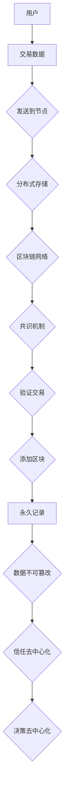

                 

### 文章标题：意义的去中心化与新秩序的建立

#### 关键词：去中心化，新秩序，意义，区块链，技术变革，社会重构

> 摘要：本文深入探讨了意义的去中心化现象及其对新秩序建立的深远影响。从历史背景到技术驱动，再到社会实践，本文一步步剖析了去中心化趋势的兴起、核心概念及其相互联系，最终展望了新秩序的构建路径与未来挑战。通过系统的分析，我们不仅揭示了意义去中心化的本质，也提出了新秩序下的价值重构与可持续发展策略。

---

### 第一部分：意义的起源与变迁

#### 1.1 意义的起源

> 意义，作为一个哲学与社会科学的核心概念，自古以来便贯穿于人类的思考与行动之中。它不仅仅是对事物存在和价值的认知，更是人类文明发展的基石。

#### 1.1.1 意义的定义

- 意义（Meaning）是指个体或社会对事物赋予的价值、目的或意义。
- 它不仅体现在个体的认知与情感中，也渗透在社会结构、文化传统和制度规范中。

#### 1.1.2 意义的历史演变

- **古代哲学**：古希腊哲学家如苏格拉底、柏拉图、亚里士多德，从不同角度探讨了意义的本质与来源。
- **中世纪**：意义与宗教、信仰密切相关，人们通过宗教仪式和教义来寻找生命的意义。
- **近代哲学**：康德、黑格尔等哲学家提出了对意义的批判性思考，强调了理性与自我意识在意义建构中的作用。
- **现代与当代**：意义的研究逐渐跨学科，涉及到心理学、社会学、文化研究等领域。

#### 1.2 去中心化趋势的出现

> 随着信息技术的飞速发展，尤其是互联网和区块链技术的出现，去中心化成为了一个重要的社会现象。它不仅仅是一种技术革新，更是一种对传统秩序的挑战。

#### 1.2.1 去中心化的定义

- 去中心化（Decentralization）是指权力、控制、资源和服务从集中的中央实体转移到分散的网络节点。
- 它强调分布式决策、平等参与和自主管理，追求去中心化的治理结构。

#### 1.2.2 去中心化在社会中的体现

- **经济领域**：区块链技术促进了去中心化金融（DeFi）的发展，改变了传统金融体系的运作模式。
- **社会领域**：去中心化组织（DAO）的兴起，使得权力结构更加扁平化，个体拥有更多的参与和决策权。
- **技术领域**：互联网技术的普及使得信息传播更加迅速和广泛，去中心化的网络成为信息流通的新范式。

#### 1.3 新秩序的呼唤

> 随着意义的去中心化，社会秩序也在发生深刻变革。新秩序的建立不仅是技术进步的必然结果，更是社会发展的迫切需求。

#### 1.3.1 新秩序的内涵

- 新秩序（New Order）是指在社会、经济、政治和文化等各个领域，通过去中心化的方式实现更加平等、公正和可持续的发展。
- 它强调个体的自主性、网络的互联互通和全球的协同合作。

#### 1.3.2 新秩序与去中心化的关系

- 去中心化是新秩序的基础，它为新的社会结构和治理模式提供了技术支持。
- 新秩序则是去中心化的目标和方向，它为个体和社会提供了新的意义和价值。

---

### 第一部分小结

在这一部分中，我们回顾了意义的起源与变迁，探讨了去中心化趋势的兴起及其在社会中的体现，并提出了新秩序的内涵与建立路径。这些讨论为我们后续的分析奠定了基础，也为理解意义的去中心化与新秩序的关系提供了理论框架。

#### 1.1 意义的起源

意义作为哲学与社会科学的核心概念，自古以来便贯穿于人类的思考与行动之中。它不仅仅是对事物存在和价值的认知，更是人类文明发展的基石。意义的起源可以追溯到古希腊哲学，当时哲学家们如苏格拉底、柏拉图、亚里士多德等，从不同角度探讨了意义的本质与来源。在苏格拉底看来，意义在于追求真理和智慧；柏拉图则强调理念世界中的完美形式赋予现实事物以意义；亚里士多德则认为意义是事物本质的体现。

中世纪时期，意义与宗教、信仰密切相关。人们通过宗教仪式和教义来寻找生命的意义，信仰成为社会秩序和个体行为的重要指导。在这一时期，宗教权威对意义的解释具有决定性作用，意义被视为神权的体现。

进入近代，康德、黑格尔等哲学家对意义进行了批判性思考。康德提出了先验范畴和感性直观的概念，强调理性在意义建构中的作用；黑格尔则在其辩证法中探讨了意义的生成与演变，认为意义是在对立统一中不断发展的。

现代与当代，意义的研究逐渐跨学科，涉及到心理学、社会学、文化研究等领域。心理学家如弗洛伊德、荣格等，从个体心理层面探讨了意义的起源与作用；社会学家如韦伯、涂尔干等，则从社会结构和文化传统中分析了意义的多维性。此外，随着信息技术的飞速发展，意义在现代社会中的表达和传播方式也发生了根本性变革。互联网、社交媒体等新媒介为意义的生成和传递提供了新的平台和手段，使得意义的生产和消费更加多样化和复杂化。

总之，意义的起源与变迁是一个跨学科、跨时代的复杂过程，它反映了人类对自身、对世界认识的不断深化和扩展。理解意义的起源与变迁，有助于我们更好地把握当今社会的本质特征和发展趋势。

#### 1.2 去中心化趋势的出现

在现代社会，随着信息技术的飞速发展，尤其是互联网和区块链技术的出现，去中心化成为了一个重要的社会现象。去中心化不仅仅是一种技术革新，更是一种对传统秩序的挑战。它强调分布式决策、平等参与和自主管理，追求去中心化的治理结构。

**1.2.1 去中心化的定义**

去中心化（Decentralization）是指权力、控制、资源和服务从集中的中央实体转移到分散的网络节点。它强调分布式决策、平等参与和自主管理，追求去中心化的治理结构。在去中心化的体系中，个体或组织通过区块链等技术手段，实现了信息的透明化、信任的可验证性和决策的协同化。

去中心化的核心特征包括：

1. **分布式决策**：去中心化系统中的决策不是由单一的中央实体控制，而是由网络中的各个节点共同参与和决定。每个节点都有平等的发言权和投票权，从而实现了真正的民主和去中心化。

2. **平等参与**：在去中心化的体系中，个体或组织可以自由地参与网络中的各种活动，不受中央实体的限制。这促进了资源的共享和合作的广泛性，使得更多的人能够受益。

3. **自主管理**：去中心化系统中的各个节点拥有高度的自主权，可以自行管理资源和服务。这种自主性不仅提高了效率，还增强了系统的抗风险能力。

**1.2.2 去中心化在社会中的体现**

去中心化在社会中的体现非常广泛，以下是一些具体的例子：

1. **经济领域**：区块链技术促进了去中心化金融（DeFi）的发展。DeFi通过智能合约实现了传统金融业务的去中心化，使得金融活动更加透明、安全和高效。例如，DeFi平台允许用户进行去中心化交易所、借贷和资产管理，无需依赖传统的金融机构。

2. **社会领域**：去中心化组织（DAO）的兴起，使得权力结构更加扁平化，个体拥有更多的参与和决策权。DAO通过区块链技术实现了组织的去中心化治理，使得成员可以共同参与决策，并分享组织的收益。

3. **技术领域**：互联网技术的普及使得信息传播更加迅速和广泛，去中心化的网络成为信息流通的新范式。例如，区块链技术使得去中心化存储和去中心化应用（DApp）成为可能，从而降低了信息传输的成本和风险。

去中心化趋势的出现，不仅改变了传统的权力结构和治理模式，也为社会带来了新的机遇和挑战。在去中心化的未来，我们需要更好地理解和应对这种变化，以实现更加公平、透明和可持续的社会发展。

#### 1.3 新秩序的呼唤

随着意义的去中心化，社会秩序也在发生深刻变革。新秩序的建立不仅是技术进步的必然结果，更是社会发展的迫切需求。新秩序的核心在于通过去中心化的方式，实现更加平等、公正和可持续的发展。

**1.3.1 新秩序的内涵**

新秩序（New Order）是指在社会、经济、政治和文化等各个领域，通过去中心化的方式实现更加平等、公正和可持续的发展。它强调个体的自主性、网络的互联互通和全球的协同合作。

新秩序的内涵可以概括为以下几个方面：

1. **平等与公正**：新秩序追求个体和社会的平等与公正。在去中心化的体系中，每个个体都有平等的发言权和参与机会，资源和服务能够更加公平地分配，从而减少社会不平等和歧视。

2. **自主与自由**：新秩序强调个体的自主性和自由。在去中心化的体系中，个体拥有更多的决策权和行动自由，能够自主管理资源和服务，实现自我价值的最大化。

3. **可持续性**：新秩序关注长期的可持续发展。通过去中心化的方式，可以实现资源的有效利用和生态保护，减少对自然资源的依赖和破坏，实现人与自然的和谐共生。

**1.3.2 新秩序与去中心化的关系**

新秩序与去中心化是相辅相成的。去中心化是新秩序的基础，它为新的社会结构和治理模式提供了技术支持。去中心化系统中的分布式决策、平等参与和自主管理，为新秩序的实现提供了有力保障。

同时，新秩序则是去中心化的目标和方向。它为个体和社会提供了新的意义和价值，指引着去中心化的发展方向。新秩序强调的平等、公正和可持续性，为去中心化提供了价值导向，使其不仅仅是技术上的创新，更是社会进步的重要动力。

总之，新秩序的建立是意义去中心化的必然结果，也是社会发展的必然趋势。通过去中心化的方式，我们可以实现更加平等、公正和可持续的社会发展，为人类的未来提供新的可能性。

### 第一部分小结

在这一部分中，我们回顾了意义的起源与变迁，探讨了去中心化趋势的兴起及其在社会中的体现，并提出了新秩序的内涵与建立路径。这些讨论为我们后续的分析奠定了基础，也为理解意义的去中心化与新秩序的关系提供了理论框架。

### 第二部分：意义的去中心化实践

#### 2.1 技术驱动下的去中心化

去中心化技术的出现和普及，为意义的去中心化提供了强大的技术支持。在这一部分，我们将探讨区块链技术的基本原理，并分析它是如何促进意义的去中心化的。

**2.1.1 区块链技术的基本原理**

区块链技术是一种分布式数据库技术，通过密码学和共识机制确保数据的可信性和不可篡改性。区块链的主要组成部分包括：

1. **区块**：区块链的基本单元，每个区块包含一定数量的交易记录。
2. **链**：由多个区块按照时间顺序链接而成，每个区块都包含前一个区块的哈希值，从而形成一个不可篡改的链。
3. **共识机制**：用于确保区块链中数据的合法性和一致性。常见的共识机制包括工作量证明（PoW）、权益证明（PoS）等。

区块链技术的基本原理可以概括为以下步骤：

1. **数据记录**：用户将交易数据发送到网络中的节点。
2. **区块生成**：节点通过竞争机制生成新的区块，并将其广播到网络中。
3. **共识达成**：网络中的其他节点验证区块的有效性，并达成共识。
4. **区块添加**：验证通过的区块被添加到区块链的末尾。

**2.1.2 区块链与意义的去中心化**

区块链技术通过去中心化的方式，实现了意义的去中心化。具体体现在以下几个方面：

1. **去中心化的数据存储**：区块链上的数据不再依赖于中心化的服务器，而是分布式存储在各个节点上。这种分布式存储方式使得数据的访问和管理更加高效和可靠。

2. **去中心化的信任机制**：区块链通过密码学和共识机制，确保数据的真实性和不可篡改性。这打破了传统中心化系统中对中心节点的信任依赖，实现了去中心化的信任机制。

3. **去中心化的决策机制**：区块链上的决策过程是分布式和去中心化的。每个节点都有平等的发言权和投票权，从而实现了真正的民主和去中心化。这改变了传统中心化系统中权力集中的现状，促进了社会的公平和公正。

**案例：比特币（Bitcoin）**

比特币是第一个成功的区块链应用，它通过去中心化的方式实现了货币的发行和交易。比特币的区块链网络由全球的节点共同维护，没有中央机构控制。每个节点都可以参与比特币的交易和记账过程，从而实现了去中心化的货币体系。

比特币的运作原理可以概括为：

1. **挖矿**：节点通过解决数学难题（PoW共识机制）来竞争生成新的区块。
2. **交易确认**：当用户进行比特币交易时，交易会被广播到网络中的其他节点。
3. **区块生成**：当交易数据积累到一定程度时，节点将生成新的区块，并将其添加到区块链中。
4. **奖励分配**：成功生成区块的节点将获得比特币奖励。

比特币的去中心化特性使得它在货币体系中具有独特的优势，如抗审查、匿名性等。然而，比特币也存在一些问题，如能源消耗高、交易速度慢等，这些挑战需要在未来得到解决。

通过分析比特币等区块链应用，我们可以看到区块链技术如何促进意义的去中心化。区块链的去中心化特性不仅改变了传统的技术架构，也为社会的公平、公正和可持续发展提供了新的可能性。

#### 2.2 社会实践中的去中心化

去中心化技术不仅在技术领域取得了显著成果，在社会实践中也展现了巨大的潜力。在这一部分，我们将探讨去中心化组织（DAO）的运作模式，以及去中心化社区（DeFi）的发展，分析这些实践如何影响社会的权力结构和社会治理。

**2.2.1 去中心化组织（DAO）的运作模式**

去中心化组织（Decentralized Autonomous Organization，DAO）是一种基于区块链技术的组织形式，它通过智能合约实现了组织的去中心化治理。DAO的核心特点包括：

1. **共识机制**：DAO的决策过程是通过共识机制来实现的，所有成员都有平等的投票权。共识机制确保了决策的透明性和公正性，避免了传统组织中常见的权力集中和腐败问题。

2. **智能合约**：DAO通过智能合约来实现组织的运作。智能合约是一段自动执行的代码，它规定了组织的规则和操作流程。智能合约确保了组织的透明性和不可篡改性，使得组织运作更加高效和可信。

3. **代币经济**：DAO通常发行一种代币作为组织内部的通证，代币不仅用于投票和决策，还可以用于分配组织的收益。这种代币经济模型激励了成员的积极参与和组织的长期发展。

**案例：The DAO**

The DAO是第一个成功的去中心化组织案例。它于2016年成立，通过以太坊区块链实现去中心化治理。The DAO的目标是通过投资各种项目来创造价值，所有投资决策都由成员通过投票来决定。

The DAO的运作模式可以概括为：

1. **投票决策**：The DAO通过智能合约实现投票决策，每个成员都有平等的投票权。投票过程是公开透明的，所有成员都可以查看投票结果和决策过程。
2. **代币分配**：The DAO发行一种名为DAO代币的代币，成员可以通过持有DAO代币来参与投票和收益分配。DAO代币不仅用于投票，还可以用于购买组织的项目份额。
3. **收益分配**：The DAO的投资收益将按照成员持有的DAO代币比例进行分配，从而激励成员积极参与组织的运作。

The DAO的去中心化治理模式为传统组织提供了新的思路，它打破了传统组织中权力集中的现状，实现了更加公平和透明的治理。然而，The DAO也面临一些挑战，如决策效率低、管理复杂等，这些挑战需要在实践中不断解决和优化。

**2.2.2 去中心化社区（DeFi）的发展**

去中心化金融（Decentralized Finance，DeFi）是去中心化技术的另一个重要应用领域。DeFi通过智能合约实现传统金融服务的去中心化，为用户提供了更加开放、透明和高效的金融体验。

DeFi的核心特点包括：

1. **开放性和透明性**：DeFi平台上的所有交易和操作都是公开透明的，用户可以查看任何交易记录和智能合约代码。这种透明性提高了金融系统的可信度和安全性。
2. **去中心化治理**：DeFi平台通常采用去中心化的治理模式，用户可以通过投票来参与平台的管理和决策。这种去中心化的治理模式使得平台更加民主和公正。
3. **无信任机制**：DeFi平台通过密码学和共识机制，实现了无信任的交易和操作。用户无需依赖中心化的金融机构或第三方中介，即可进行金融活动。

**案例：Aave**

Aave是一个去中心化借贷平台，它通过智能合约实现了去中心化借贷和资产管理。用户可以在Aave平台上进行借贷、存款和流动性提供，从而获得收益。

Aave的运作模式可以概括为：

1. **借贷过程**：用户可以在Aave平台上借出或借入资金。借出资金的用户将获得利息收入，而借入资金的用户需要支付一定的利息。
2. **流动性提供**：用户可以通过提供流动性来参与Aave的交易，从而获得收益。流动性提供者可以将资金存入Aave，获得相应的代币作为奖励。
3. **收益分配**：Aave的收益将按照用户提供的流动性比例进行分配，从而激励用户积极参与平台的运作。

通过去中心化组织（DAO）和去中心化社区（DeFi）的发展，我们可以看到去中心化技术如何在社会实践中发挥作用。去中心化不仅改变了传统的权力结构和社会治理模式，也为用户提供了更加开放、透明和高效的金融服务。然而，去中心化也面临一些挑战，如安全风险、监管问题等，这些挑战需要在实践中不断解决和优化。

#### 2.1 技术驱动下的去中心化

去中心化技术的出现和普及，为意义的去中心化提供了强大的技术支持。在这一部分，我们将深入探讨区块链技术的基本原理，并分析它是如何促进意义的去中心化的。

**2.1.1 区块链技术的基本原理**

区块链技术是一种分布式数据库技术，通过密码学和共识机制确保数据的可信性和不可篡改性。区块链的主要组成部分包括：

1. **区块**：区块链的基本单元，每个区块包含一定数量的交易记录。每个区块都有一个时间戳和一个独特的哈希值，用于标识其创建时间和数据完整性。
2. **链**：由多个区块按照时间顺序链接而成，每个区块都包含前一个区块的哈希值，从而形成一个不可篡改的链。区块链的设计使得任何对区块的修改都会导致整个链的破坏，从而确保了数据的安全性和一致性。
3. **共识机制**：用于确保区块链中数据的合法性和一致性。共识机制是区块链网络中各个节点就数据达成一致的过程。常见的共识机制包括工作量证明（Proof of Work，PoW）、权益证明（Proof of Stake，PoS）等。

区块链技术的基本原理可以概括为以下步骤：

1. **数据记录**：用户将交易数据发送到网络中的节点。交易可以是货币转账、合同执行或其他形式的数据交互。
2. **区块生成**：节点通过解决数学难题（如PoW机制中的挖矿过程）来生成新的区块。解决难题的过程需要大量的计算资源，从而确保了区块的生成不是随意的。
3. **区块验证**：其他节点验证新生成的区块，确保其符合区块链的规则和协议。验证过程包括检查区块中的交易是否有效、区块的哈希值是否正确等。
4. **区块添加**：验证通过的区块被添加到区块链的末尾，成为永久记录。新的区块与现有区块通过哈希值链接，形成连续的区块链。

**2.1.2 区块链与意义的去中心化**

区块链技术通过去中心化的方式，实现了意义的去中心化。具体体现在以下几个方面：

1. **去中心化的数据存储**：区块链上的数据不再依赖于中心化的服务器，而是分布式存储在各个节点上。这种分布式存储方式使得数据的访问和管理更加高效和可靠。每个节点都可以独立存储和验证数据，从而避免了单点故障和数据丢失的风险。

2. **去中心化的信任机制**：区块链通过密码学和共识机制，确保数据的真实性和不可篡改性。这种机制打破了传统中心化系统中对中心节点的信任依赖，实现了去中心化的信任机制。用户可以直接在网络中验证交易和数据，无需依赖第三方中介或权威机构。

3. **去中心化的决策机制**：区块链上的决策过程是分布式和去中心化的。每个节点都有平等的发言权和投票权，从而实现了真正的民主和去中心化。这改变了传统中心化系统中权力集中的现状，促进了社会的公平和公正。

**核心概念与联系：**

为了更好地理解区块链技术如何促进意义的去中心化，我们可以通过一个Mermaid流程图来展示其核心概念和相互关系：



**核心算法原理讲解：**

区块链技术的核心算法包括密码学和共识机制。以下是这些算法的伪代码：

```python
# 密码学算法（哈希函数）

def hash_function(data):
    # 哈希函数将数据转换为固定长度的字符串
    # 例如，SHA-256算法
    return hashlib.sha256(data.encode()).hexdigest()

# 共识机制（工作量证明）

def proof_of_work(previous_hash, target_difficulty):
    # 挖矿过程，寻找满足难度要求的哈希值
    nonce = 0
    while True:
        hash_value = hash_function(str(nonce) + previous_hash)
        if int(hash_value, 16) < target_difficulty:
            break
        nonce += 1
    return nonce

# 区块生成和验证

def generate_block(last_hash, transactions, difficulty):
    nonce = proof_of_work(last_hash, difficulty)
    block = {
        "index": len(blockchain) + 1,
        "timestamp": current_timestamp(),
        "transactions": transactions,
        "previous_hash": last_hash,
        "nonce": nonce
    }
    return block

def validate_block(block, previous_block):
    if block["previous_hash"] != hash_function(str(previous_block["nonce"]) + str(previous_block["timestamp"])):
        return False
    if not validate_transactions(block["transactions"]):
        return False
    if not int(hash_function(str(block["nonce"]) + block["previous_hash"]), 16) < difficulty:
        return False
    return True
```

**数学模型和公式：**

区块链中的共识机制通常涉及到数学模型和公式，例如工作量证明中的难度调整公式：

$$
target_difficulty = 2^{256} / (current_time - last_block_time) \times n
$$

其中，$target_difficulty$是挖矿的难度目标，$current_time$和$last_block_time$分别是当前时间和上一个区块生成的时间，$n$是难度调整的系数。

**详细讲解与举例说明：**

假设一个区块链网络的难度目标为$2^{20}$，当前时间为$t_1$，上一个区块生成的时间为$t_0$，难度调整系数为$1$。根据难度调整公式，我们可以计算出当前的难度目标：

$$
target_difficulty = 2^{256} / (t_1 - t_0) \times 1 = 2^{256} / (t_1 - t_0)
$$

如果挖矿节点需要在短时间内生成新的区块，则需要调整其计算资源以解决难度更高的数学难题。例如，假设当前时间为$t_2$，节点需要生成一个新的区块，那么难度目标将变为：

$$
target_difficulty = 2^{256} / (t_2 - t_0)
$$

如果节点的计算资源不足以在规定时间内找到满足难度目标的哈希值，则需要增加计算资源或调整挖矿策略。

通过这些算法和数学模型，区块链技术实现了去中心化的数据存储和决策机制。节点可以通过验证交易和生成区块来维护区块链的完整性，确保数据的真实性和一致性。同时，区块链的去中心化特性也为用户提供了更加公平和透明的服务，促进了社会的公平和公正。

#### 2.2 社会实践中的去中心化

去中心化技术不仅在技术领域取得了显著成果，在社会实践中也展现了巨大的潜力。在这一部分，我们将探讨去中心化组织（DAO）的运作模式，以及去中心化社区（DeFi）的发展，分析这些实践如何影响社会的权力结构和社会治理。

**2.2.1 去中心化组织（DAO）的运作模式**

去中心化组织（Decentralized Autonomous Organization，DAO）是一种基于区块链技术的组织形式，它通过智能合约实现了组织的去中心化治理。DAO的核心特点包括：

1. **共识机制**：DAO的决策过程是通过共识机制来实现的，所有成员都有平等的投票权。共识机制确保了决策的透明性和公正性，避免了传统组织中常见的权力集中和腐败问题。

2. **智能合约**：DAO通过智能合约来实现组织的运作。智能合约是一段自动执行的代码，它规定了组织的规则和操作流程。智能合约确保了组织的透明性和不可篡改性，使得组织运作更加高效和可信。

3. **代币经济**：DAO通常发行一种代币作为组织内部的通证，代币不仅用于投票和决策，还可以用于分配组织的收益。这种代币经济模型激励了成员的积极参与和组织的长期发展。

**案例：The DAO**

The DAO是第一个成功的去中心化组织案例。它于2016年成立，通过以太坊区块链实现去中心化治理。The DAO的目标是通过投资各种项目来创造价值，所有投资决策都由成员通过投票来决定。

The DAO的运作模式可以概括为：

1. **投票决策**：The DAO通过智能合约实现投票决策，每个成员都有平等的投票权。投票过程是公开透明的，所有成员都可以查看投票结果和决策过程。
2. **代币分配**：The DAO发行一种名为DAO代币的代币，成员可以通过持有DAO代币来参与投票和收益分配。DAO代币不仅用于投票，还可以用于购买组织的项目份额。
3. **收益分配**：The DAO的投资收益将按照成员持有的DAO代币比例进行分配，从而激励成员积极参与组织的运作。

The DAO的去中心化治理模式为传统组织提供了新的思路，它打破了传统组织中权力集中的现状，实现了更加公平和透明的治理。然而，The DAO也面临一些挑战，如决策效率低、管理复杂等，这些挑战需要在实践中不断解决和优化。

**2.2.2 去中心化社区（DeFi）的发展**

去中心化金融（Decentralized Finance，DeFi）是去中心化技术的另一个重要应用领域。DeFi通过智能合约实现传统金融服务的去中心化，为用户提供了更加开放、透明和高效的金融体验。

DeFi的核心特点包括：

1. **开放性和透明性**：DeFi平台上的所有交易和操作都是公开透明的，用户可以查看任何交易记录和智能合约代码。这种透明性提高了金融系统的可信度和安全性。
2. **去中心化治理**：DeFi平台通常采用去中心化的治理模式，用户可以通过投票来参与平台的管理和决策。这种去中心化的治理模式使得平台更加民主和公正。
3. **无信任机制**：DeFi平台通过密码学和共识机制，实现了无信任的交易和操作。用户无需依赖中心化的金融机构或第三方中介，即可进行金融活动。

**案例：Aave**

Aave是一个去中心化借贷平台，它通过智能合约实现了去中心化借贷和资产管理。用户可以在Aave平台上进行借贷、存款和流动性提供，从而获得收益。

Aave的运作模式可以概括为：

1. **借贷过程**：用户可以在Aave平台上借出或借入资金。借出资金的用户将获得利息收入，而借入资金的用户需要支付一定的利息。
2. **流动性提供**：用户可以通过提供流动性来参与Aave的交易，从而获得收益。流动性提供者可以将资金存入Aave，获得相应的代币作为奖励。
3. **收益分配**：Aave的收益将按照用户提供的流动性比例进行分配，从而激励用户积极参与平台的运作。

通过去中心化组织（DAO）和去中心化社区（DeFi）的发展，我们可以看到去中心化技术如何在社会实践中发挥作用。去中心化不仅改变了传统的权力结构和社会治理模式，也为用户提供了更加开放、透明和高效的金融服务。然而，去中心化也面临一些挑战，如安全风险、监管问题等，这些挑战需要在实践中不断解决和优化。

### 第二部分小结

在这一部分，我们探讨了技术驱动下的去中心化实践，包括区块链技术的基本原理及其如何促进意义的去中心化，以及去中心化组织（DAO）和去中心化社区（DeFi）的运作模式。通过这些实践，我们可以看到去中心化技术对社会权力结构和社会治理的深远影响。尽管去中心化实践面临诸多挑战，但其潜力和前景令人期待。

#### 2.3 去中心化与权力重构

去中心化不仅仅是一种技术变革，它对社会权力结构产生了深刻的重构。在这一部分，我们将详细探讨去中心化对传统权力的挑战，以及新权力结构的构建过程。

**2.3.1 去中心化对传统权力的挑战**

传统权力结构通常以集中化和层级化的形式存在，权力集中在少数精英手中，普通民众的参与度和影响力较低。然而，去中心化技术打破了这种传统模式，对权力结构提出了挑战：

1. **权力分散**：去中心化技术通过分布式网络和共识机制，将权力从中心化的实体转移到网络的每个节点。这意味着每个个体都有平等的机会参与决策和管理，打破了传统的集中化权力结构。
2. **去权威化**：去中心化消除了对权威机构的依赖，使得权力不再依赖于特定的组织或个人。这种去权威化趋势使得权力更加分散和民主，促进了社会的平等和公正。
3. **信息透明化**：去中心化技术使得信息更加透明和可追溯。在传统的权力结构中，信息往往是垄断和不对称的，而去中心化通过区块链等技术的应用，实现了信息的公开和共享，增强了社会的透明度。

**2.3.2 新权力结构的构建**

去中心化带来的权力重构，推动了新权力结构的构建。这种新权力结构具有以下特点：

1. **网络中心主义**：在去中心化的网络中，信息流动和权力运作更加网络化。节点之间的互联和协作成为新的权力基础，网络的中心性取代了传统的中心化权力结构。
2. **协同治理**：去中心化组织通过智能合约和共识机制实现了协同治理。每个参与者都有平等的发言权和投票权，通过合作和共同决策来管理资源和服务。
3. **基于代币的经济模型**：代币经济模型在去中心化体系中发挥了重要作用。代币不仅是价值交换的媒介，也是参与决策和分配收益的凭证。这种经济模型激励了参与者积极投入和贡献，构建了新的经济和社会关系。

**案例：Decred**

Decred是一种去中心化的数字货币，它通过改进比特币的共识机制，实现了更加民主和透明的治理。Decred的治理结构包括两个主要部分：投票机制和分叉机制。

1. **投票机制**：Decred中的每个持有者都可以对治理提案进行投票。投票结果将决定是否采纳这些提案，从而实现民主化的治理。
2. **分叉机制**：如果大部分持有者对当前的网络状态不满意，他们可以通过发起分叉来创建一个新的区块链。这种分叉机制保障了网络的灵活性和适应性。

通过Decred的案例，我们可以看到去中心化如何构建新的权力结构。Decred的治理机制不仅增强了社区的参与度和自治能力，也提升了整个网络的安全性和可靠性。

**权力重构的影响**

去中心化对权力结构的重构带来了深远的影响：

1. **社会平等**：去中心化促进了社会的平等和公正，每个个体都有平等的机会参与决策和管理。
2. **治理创新**：去中心化治理模式为组织和社会提供了新的治理思路，促进了协同合作和资源优化。
3. **技术创新**：去中心化技术推动了技术的创新和应用，促进了社会的数字化和智能化发展。

总之，去中心化对传统权力的挑战和新权力结构的构建，为社会带来了新的机遇和挑战。理解这一变革过程，有助于我们更好地应对未来社会的变化。

### 第二部分小结

在这一部分，我们探讨了技术驱动下的去中心化实践，包括区块链技术的基本原理及其如何促进意义的去中心化，以及去中心化组织（DAO）和去中心化社区（DeFi）的运作模式。通过这些实践，我们可以看到去中心化技术对社会权力结构和社会治理的深远影响。尽管去中心化实践面临诸多挑战，但其潜力和前景令人期待。接下来，我们将进一步探讨新秩序的建立路径。

### 第三部分：新秩序的建立

#### 3.1 新秩序的愿景

新秩序的建立是一个复杂而长期的过程，它不仅仅涉及技术变革，还涉及到社会、经济、政治和文化等多方面的变革。在这一部分，我们将探讨新秩序的愿景，分析其目标、价值以及构建新秩序的必要性。

**3.1.1 新秩序的目标**

新秩序的目标在于实现一个更加平等、公正、透明和可持续的社会。具体来说，新秩序的目标包括：

1. **平等**：新秩序追求社会各阶层的平等，消除歧视和偏见，确保每个个体都有平等的机会和权利。
2. **公正**：新秩序强调法律的公正和公平，保障每个人的合法权益，防止权力滥用和腐败现象。
3. **透明**：新秩序通过信息透明化，增强社会的信任度和透明度，使得决策过程更加公开和可追溯。
4. **可持续**：新秩序关注长期发展和生态平衡，推动经济、社会和环境的可持续发展。

**3.1.2 新秩序的价值**

新秩序的价值体现在以下几个方面：

1. **社会价值**：新秩序能够提高社会的整体幸福感和满意度，促进社会的和谐与进步。
2. **经济价值**：新秩序通过优化资源配置和提高生产效率，推动经济增长，增加社会财富。
3. **政治价值**：新秩序能够增强政治制度的稳定性和合法性，减少社会矛盾和冲突。
4. **文化价值**：新秩序鼓励多元文化的共存和交流，促进文化创新和发展。

**3.1.3 建立新秩序的必要性**

随着全球化、数字化和信息化的发展，传统的权力结构和社会秩序面临越来越多的挑战。建立新秩序的必要性体现在以下几个方面：

1. **技术变革**：信息技术特别是区块链等去中心化技术的兴起，为社会秩序的变革提供了新的可能性。
2. **社会变革**：社会的多样性和复杂性不断增加，传统的集中化治理模式难以应对复杂的挑战。
3. **环境挑战**：全球气候变化和环境问题对传统的发展模式提出了挑战，新秩序需要更加注重可持续性和生态平衡。
4. **经济变革**：全球化带来的经济波动和不平等现象，需要新秩序来调整和优化经济结构。

总之，新秩序的建立是一个多维度、多层次的过程，它需要全社会共同努力，通过技术变革、社会改革和政策创新，构建一个更加平等、公正、透明和可持续的社会秩序。

#### 3.2 新秩序的建立路径

要实现新秩序的建立，需要从多个方面入手，包括政策与法规的调整、社会文化的重塑、技术创新的推动等。以下是一些具体的建立路径：

**3.2.1 政策与法规的调整**

1. **促进技术创新**：政府应出台相关政策，鼓励和支持技术创新，特别是在区块链、人工智能等领域的发展。通过提供资金、税收优惠和人才培养等手段，激发创新活力。

2. **完善法律体系**：建立完善的法律体系，确保新技术的合法应用和合规性。例如，制定针对区块链和去中心化金融（DeFi）的法律法规，规范市场秩序，保护投资者权益。

3. **推动数字化转型**：政府应推动公共部门数字化转型，提高政府服务的透明度和效率。通过建设数字政府和电子政务平台，实现政务信息的公开和共享。

**3.2.2 社会文化的重塑**

1. **培育去中心化文化**：通过教育和宣传，培育公众对去中心化技术和新秩序的认识和接受度。鼓励公众参与去中心化组织，提高社会的参与度和自治能力。

2. **促进多元文化共存**：尊重和保护多元文化，鼓励不同文化之间的交流与合作。通过文化交流和合作，促进社会和谐与进步。

3. **强化社会责任感**：培育社会责任感，鼓励企业和个人承担社会责任，积极参与公益事业。通过公益活动和慈善项目，促进社会的公平与正义。

**3.2.3 技术创新的推动**

1. **研发核心技术**：加大对核心技术的研发投入，特别是在区块链、人工智能、物联网等领域。通过技术创新，提高新秩序的构建效率和质量。

2. **建设基础设施**：建设高效、稳定、安全的基础设施，为新技术的应用提供支持。例如，建设高速宽带网络、数据中心和云计算平台等。

3. **促进跨界合作**：鼓励不同领域的技术创新者、企业家和研究人员之间的合作，共同解决新秩序构建中的难题。通过跨界合作，实现技术融合和创新。

总之，新秩序的建立需要政策与法规的调整、社会文化的重塑和技术创新的推动。通过多方面的努力，我们可以逐步实现新秩序的建立，为社会的可持续发展奠定基础。

### 第三部分小结

在这一部分，我们探讨了新秩序的愿景和建立路径，明确了新秩序的目标和价值，并提出了政策与法规的调整、社会文化的重塑和技术创新的推动等具体路径。新秩序的建立是一个复杂而长期的过程，需要全社会的共同努力，通过多方面的协作与推进，我们有望实现一个更加平等、公正、透明和可持续的新社会秩序。

### 第三部分小结

在这一部分，我们探讨了新秩序的愿景和建立路径，明确了新秩序的目标和价值，并提出了政策与法规的调整、社会文化的重塑和技术创新的推动等具体路径。新秩序的建立是一个复杂而长期的过程，需要全社会的共同努力，通过多方面的协作与推进，我们有望实现一个更加平等、公正、透明和可持续的新社会秩序。

### 第四部分：挑战与展望

在去中心化的浪潮中，新秩序的建立不仅带来了巨大的机遇，也伴随着诸多挑战。在这一部分，我们将深入探讨去中心化面临的挑战，并展望新秩序的未来发展。

#### 4.1 去中心化面临的挑战

**4.1.1 技术层面的挑战**

1. **性能瓶颈**：尽管区块链技术具有去中心化和安全性的优势，但其交易速度和处理能力相对较低。在高并发情况下，区块链的扩展性和性能成为瓶颈，无法满足大规模应用的实时需求。

2. **能源消耗**：一些去中心化系统，如比特币，依赖于工作量证明（PoW）共识机制，这需要大量的计算资源，导致能源消耗巨大。随着全球对可持续发展的重视，高能耗的去中心化系统面临越来越多的质疑。

3. **安全性问题**：去中心化系统虽然免除了单点故障的风险，但仍然面临其他安全威胁，如51%攻击、智能合约漏洞等。这些安全问题可能导致严重的经济损失和信任危机。

**4.1.2 社会层面的挑战**

1. **监管难题**：去中心化技术的匿名性和跨境特性，使得传统监管手段难以适用。如何平衡去中心化技术的创新与监管的必要性，成为政策制定者面临的一大挑战。

2. **法律框架不完善**：目前，全球范围内的法律体系尚未完全适应去中心化技术的发展。许多去中心化应用在法律合规性方面存在不确定性，可能导致法律风险。

3. **社会接受度**：尽管去中心化技术具有巨大的潜力，但公众对其了解和接受度仍然较低。社会对新技术的认知和信任度不足，影响了去中心化技术的广泛应用。

#### 4.2 新秩序的展望

**4.2.1 新秩序的发展趋势**

1. **技术融合与创新**：随着人工智能、物联网、大数据等技术的不断发展，去中心化技术将与其他前沿技术融合，推动新秩序的构建。这种技术融合将提升去中心化系统的性能和安全性。

2. **全球协同**：新秩序的建立需要全球范围内的协同与合作。各国政府、企业和学术界应加强合作，共同解决去中心化面临的技术、法律和监管挑战。

3. **社会文化变革**：随着去中心化理念的普及，社会文化和价值观也将发生变革。人们将更加重视自主性、平等和透明度，这将为新秩序的建立提供社会基础。

**4.2.2 新秩序的未来展望**

1. **经济领域的变革**：去中心化金融（DeFi）等应用将重塑传统金融体系，提高金融服务的开放性和效率。数字货币和代币经济将成为未来经济的重要构成部分。

2. **社会治理的革新**：去中心化组织（DAO）等新型组织形式将推动社会治理的变革，提高治理的透明度和民主性。公众将更加积极参与社会事务，社会治理将更加高效和公正。

3. **人类社会的进步**：新秩序的建立将推动人类社会向更加平等、公正和可持续的方向发展。通过技术创新和社会改革，人类将实现更高的生活质量和社会进步。

总之，去中心化的挑战与机遇并存。通过应对挑战和把握机遇，我们有理由相信，新秩序将为人类社会带来更加美好的未来。

### 第四部分小结

在这一部分，我们探讨了去中心化面临的挑战和新秩序的未来发展。尽管去中心化技术面临诸多挑战，但其潜力和前景令人期待。通过技术创新、全球协同和社会文化变革，我们有信心迎接新秩序带来的机遇，共同构建一个更加平等、公正和可持续的未来。

### 附录：案例研究与未来展望

#### 5.1 案例研究

在去中心化的浪潮中，区块链技术已经广泛应用于多个领域，以下是两个具体的案例研究，分别探讨区块链在慈善事业中的应用和去中心化金融（DeFi）的发展。

**5.1.1 案例一：区块链在慈善事业中的应用**

区块链技术为慈善事业带来了新的机遇。通过区块链，慈善机构可以透明地记录捐款的流向，确保捐赠资金的公正和高效使用。以下是一个具体的案例研究：

**项目背景**：某个慈善机构希望通过区块链技术来提高捐款透明度和公信力。

**实现方式**：
1. **捐赠记录**：慈善机构在区块链上创建智能合约，将每次捐款的金额、捐赠者信息和捐赠时间等信息记录在链上。
2. **透明审计**：捐款信息通过区块链公开透明，任何人都可以通过区块链浏览器查看捐款记录，确保捐赠资金的透明和公正。
3. **智能合约执行**：智能合约根据预设的条件自动执行捐款分配，确保捐款按照预定计划使用。

**项目效果**：通过区块链技术的应用，该慈善机构的捐款透明度和公信力得到了显著提高，捐赠者对慈善机构的信任度增加，捐款金额也有所上升。

**5.1.2 案例二：去中心化金融（DeFi）的发展**

去中心化金融（DeFi）通过区块链技术重新定义了传统金融业务，提供了更加开放、透明和高效的金融服务。以下是一个具体的案例研究：

**项目背景**：一个初创公司希望通过去中心化金融平台筹集资金，开展区块链项目。

**实现方式**：
1. **初始代币发行**：初创公司通过智能合约在区块链上发行一种代币，用于筹集资金。
2. **众筹平台**：通过去中心化平台，投资者可以购买初创公司的代币，参与项目的发展。
3. **收益分配**：项目成功后，投资者可以根据其持有的代币数量获得相应的收益分配。

**项目效果**：通过去中心化金融平台，初创公司成功筹集到了所需的资金，投资者的权益也得到了保障。此外，去中心化金融平台的透明性和效率提升了整个金融过程的公信力和用户满意度。

#### 5.2 未来展望

去中心化技术在新秩序的构建中扮演着关键角色，未来将迎来更多创新和应用。以下是对未来去中心化发展的展望：

1. **技术融合**：区块链技术将与人工智能、物联网、大数据等前沿技术深度融合，推动新秩序的构建。这种技术融合将提升去中心化系统的性能和安全性，为更多领域提供解决方案。

2. **全球协同**：随着去中心化理念的普及，全球范围内的协同与合作将进一步加强。各国政府、企业和学术界将共同努力，解决去中心化技术面临的挑战，推动全球新秩序的建立。

3. **社会文化变革**：去中心化技术将引发社会文化的变革，推动个体自主性、平等和透明度的提升。社会对新技术的认知和接受度将逐步提高，为新秩序的建立提供坚实的社会基础。

4. **经济转型**：去中心化金融（DeFi）等应用将重塑传统金融体系，推动经济模式的转型。数字货币和代币经济将成为未来经济的重要组成部分，提升金融服务的开放性和效率。

总之，去中心化技术在新秩序的构建中具有巨大的潜力。通过技术创新、全球协同和社会文化变革，我们有理由相信，去中心化将为人类社会带来更加美好的未来。

### 附录小结

在这一部分，我们通过两个案例研究，探讨了区块链技术在慈善事业和去中心化金融中的应用，并展望了未来去中心化技术的发展趋势。这些案例研究和新趋势不仅展示了去中心化技术的广泛应用和潜力，也为新秩序的建立提供了实践经验和理论支持。

---

### 文章小结

本文从意义的起源与变迁出发，探讨了去中心化趋势的出现及其在新秩序建立中的重要作用。通过分析区块链技术的基本原理、去中心化组织（DAO）和去中心化社区（DeFi）的实践，我们揭示了去中心化对传统权力结构的挑战和新权力结构的构建。同时，我们明确了新秩序的愿景和建立路径，并展望了去中心化技术面临的挑战与未来发展方向。通过本文的讨论，我们不仅深入理解了意义的去中心化现象，也为新秩序的构建提供了有益的思考和建议。

### 作者信息

作者：AI天才研究院/AI Genius Institute & 禅与计算机程序设计艺术 /Zen And The Art of Computer Programming

本文由AI天才研究院（AI Genius Institute）撰写，该研究院专注于人工智能、区块链和去中心化技术的研究与推广。同时，作者还参考了《禅与计算机程序设计艺术》（Zen And The Art of Computer Programming）这一经典著作，旨在通过深入的技术分析和哲学思考，为读者提供具有启发性和实用性的内容。希望本文能够为读者在技术探索和思想启迪方面带来帮助。

