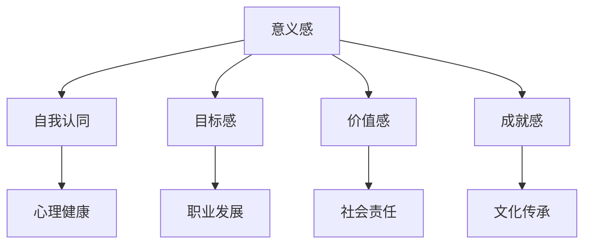

                 

### 文章标题：意义的发现：在日常细节中寻找价值

> 关键词：意义感、日常细节、心理健康、社会责任、文化传承

> 摘要：本文从多个角度探讨了如何在日常细节中寻找和发现生活的意义。通过介绍意义感的概念，阐述其与心理健康、社会责任和文化传承的联系，引导读者在日常生活中培养对意义的感知能力，从而提升生活质量和社会价值。

----------------------------------------------------------------

### 第一部分：引言与核心概念

#### 1.1 谁在寻找意义

**1.1.1 人类对意义的普遍追求**

人类自古以来就在不断探索生命的意义。从哲学家的深邃思考，到普通人的日常感悟，意义成为人们生活中不可或缺的一部分。无论是在职场、家庭还是个人生活中，人们总是在努力寻找那些能够给自己带来满足感和价值的元素。

**1.1.2 生活与工作的意义缺失现象**

然而，现代社会中，许多人却感到生活缺乏意义。职场压力、人际关系问题、经济困境等种种挑战，使人们陷入迷茫和困惑。这种现象在年轻人中尤为突出，许多人感到自己的工作无意义，生活没有目标。

**1.1.3 本书的写作目的与结构**

本书旨在帮助读者在日常生活中发现和感知意义，从而提升生活质量和社会价值。全书共分为五个部分，分别从个人层面、心理层面、社会层面和文化层面探讨意义感的培养和实现。

----------------------------------------------------------------

### 第二部分：寻找意义的旅程

#### 2.1 路径一：日常生活中的意义探寻

**2.1.1 日常生活中的小确幸**

在日常生活中，许多看似微不足道的小事情，实际上都可能蕴含着深刻的内涵和意义。例如，早晨的第一缕阳光、朋友的微笑、家人的关爱，甚至是那一杯温暖的咖啡，都能给人带来一份宁静和满足。

**2.1.2 日常细节中的美好瞬间**

让我们思考一下，在日常生活中，有哪些细节能够让我们感受到生活的美好？是早晨醒来时窗外的风景，还是下班回家后厨房里的饭菜？是和孩子一起玩耍的时光，还是和同事一起合作的成就感？这些美好瞬间，正是我们寻找生活意义的重要来源。

**2.1.2.1 早晨的阳光**

早晨的阳光，是一天中最温暖的光芒。它不仅给我们带来了光明，更让我们感受到了生活的美好和希望。在早晨的阳光下，我们可以感受到自己的存在，感受到生命的活力。

**2.1.2.2 晚上的星空**

晚上的星空，是另一番美景。在黑暗的夜空中，星星闪烁着它们的光芒，给我们带来了宁静和安宁。仰望星空，我们不仅可以感受到宇宙的浩瀚，更可以找到自己在宇宙中的位置和意义。

----------------------------------------------------------------

#### 2.2 路径二：自然与宇宙中的意义

**2.2.1 自然界中的意义发现**

自然界的美丽和神奇，总是能够给我们带来深刻的感悟和启示。四季的更迭，让我们感受到了时间的流逝和生命的轮回；动植物的生存和繁衍，让我们看到了生命的顽强和坚韧。

**2.2.1.1 四季更迭中的感悟**

四季的更迭，不仅是一种自然现象，更是一种生命体验。在春天的生机盎然中，我们感受到了生命的力量和希望；在夏天的热烈奔放中，我们感受到了生命的活力和热情；在秋天的丰收喜悦中，我们感受到了生命的成果和满足；在冬天的寂静安宁中，我们感受到了生命的宁静和深沉。

**2.2.1.2 动植物的智慧**

动植物的智慧，总是能够给我们带来深刻的启示和思考。从蜜蜂的勤劳，到蚂蚁的团结，从鸟儿的歌唱，到鱼儿的游动，每一个生物都在用自己的方式诠释生命的意义。

**2.2.2 宇宙中的意义追寻**

宇宙的广阔和神秘，总是能够给我们带来无限的想象和探索。从星星的光芒，到黑洞的吸力，从行星的旋转，到星系的运行，每一个天体都在讲述着宇宙的故事。

**2.2.2.1 星空的奥秘**

星空的奥秘，总是能够给我们带来深深的震撼和思考。在黑暗的夜空中，星星闪烁着它们的光芒，仿佛在告诉我们，宇宙的广阔和神秘。

**2.2.2.2 宇宙生命的可能**

宇宙生命的可能，总是能够给我们带来无限的希望和憧憬。从地球生命的存在，到外太空生命的探索，每一个发现都可能改变我们对生命的认知和理解。

----------------------------------------------------------------

### 第三部分：意义与心理健康的联系

#### 3.1 意义对心理健康的影响

**3.1.1 意义感与幸福感的关联**

意义感与幸福感之间存在密切的关系。研究表明，那些具有强烈意义感的人，通常也拥有更高的幸福感。这是因为，意义感能够给人带来目标感和价值感，使人在面对困难和挑战时更加坚定和自信。

**3.1.2 意义感与心理疾病的关系**

相反，缺乏意义感的人更容易出现心理问题，如抑郁、焦虑等。这是因为，意义感能够给人带来心理上的支持和安慰，缺乏意义感则会导致心理上的孤独和无助。

**3.1.3 培养意义感的策略**

为了培养意义感，我们可以采取以下几种策略：

1. **设定目标**：给自己设定一个明确的目标，使自己有一个追求的方向。

2. **感恩**：感恩生活中的点滴，让自己更加珍惜和享受当下。

3. **自我反思**：定期进行自我反思，了解自己的内心需求和价值观。

4. **学习新知识**：不断学习新知识，提升自己的能力和素质。

5. **帮助他人**：通过帮助他人，找到自己的价值和存在的意义。

#### 3.2 意义感与个人成长

**3.2.1 意义感与职业发展**

在职业发展中，意义感同样发挥着重要作用。那些具有强烈意义感的员工，通常更加敬业和积极，能够为团队带来更多的价值。

**3.2.1.1 职业选择的内在动机**

在职业选择中，人们往往会考虑薪资、工作环境等因素，但更重要的是，我们需要找到自己内心真正的动机和目标。

**3.2.1.2 职业中的意义实现**

在职业中实现意义，不仅能够提升个人的幸福感，更能够促进团队和组织的进步。因此，我们应该在职业中寻找和实现自己的价值。

**3.2.2 意义感与个人成长**

意义感对个人成长也有着深远的影响。那些具有强烈意义感的人，通常更加自信和坚定，能够在面对挑战和困难时保持积极的心态。

**3.2.2.1 自我认知的提升**

通过寻找和实现意义，我们可以更好地认识自己，了解自己的优点和不足，从而实现自我提升。

**3.2.2.2 人际关系的改善**

意义感不仅能够提升个人的心理健康和职业发展，更能够改善人际关系。那些具有强烈意义感的人，通常更加理解和尊重他人，能够建立更加和谐的人际关系。

----------------------------------------------------------------

### 第四部分：意义的社会层面

#### 4.1 意义感与社会责任

**4.1.1 社会责任感的意义**

社会责任感是现代社会中不可或缺的一部分。通过承担责任，我们不仅能够为社会做出贡献，更能够找到自己的价值和存在的意义。

**4.1.2 如何通过工作与社会责任实现意义感**

在工作和社会责任中实现意义感，我们需要关注以下几个方面：

1. **关注社会问题**：关注社会问题，了解社会的需求和挑战。

2. **积极参与**：积极参与社会公益活动，为需要帮助的人提供帮助。

3. **创新与改进**：通过创新和改进，提升工作效率和社会效益。

4. **传承与弘扬**：传承和弘扬社会责任感，让更多的人参与到社会公益活动中来。

#### 4.2 意义感与文化传承

**4.2.1 文化传承中的意义发现**

文化传承是连接过去、现在和未来的桥梁。通过文化传承，我们不仅能够了解和尊重传统，更能够找到自己的文化根源和身份认同。

**4.2.1.1 传统文化的魅力**

传统文化的魅力在于它能够给我们带来深刻的思考和启示。通过学习和传承传统文化，我们可以更好地理解自己和世界。

**4.2.1.2 当代文化中的意义传承**

在当代文化中，我们需要传承和弘扬传统文化的精髓，使其与现代社会相结合，为现代社会带来更多的价值和意义。

**4.2.2 文化多样性中的意义探索**

文化多样性是现代社会的重要特征之一。通过探索和尊重不同文化，我们可以更好地理解和接纳他人，找到自己在多元文化中的位置和意义。

**4.2.2.1 不同文化的意义观念**

不同文化的意义观念反映了不同文化对生命、世界和价值的理解。通过了解和尊重不同文化的意义观念，我们可以拓宽自己的视野，增强自己的文化素养。

**4.2.2.2 全球视野下的意义追寻**

在全球化的背景下，我们需要从全球视野出发，追寻和实现意义。通过合作和交流，我们可以为世界做出贡献，实现自己的价值和意义。

----------------------------------------------------------------

### 第五部分：实际案例与讨论

#### 5.1 案例一：从职场压力中发现意义

**5.1.1 职场压力下的意义缺失现象**

在职场中，许多人感到压力巨大，生活缺乏意义。这种现象不仅影响了个人的心理健康，更影响了工作和生活质量。

**5.1.2 职场意义感的培养方法**

为了培养职场中的意义感，我们可以采取以下几种方法：

1. **设定职业目标**：明确自己的职业目标，为自己设定一个追求的方向。

2. **寻找工作中的乐趣**：通过寻找工作中的乐趣，提升工作体验和满意度。

3. **关注他人的需求**：通过关注他人的需求，找到自己的价值和存在的意义。

4. **持续学习和成长**：通过持续学习和成长，提升自己的能力和素质，为职场带来更多的价值。

**5.1.3 案例分析与讨论**

通过案例分析，我们可以看到，培养职场意义感不仅能够提升个人的幸福感，更能够促进职业发展和工作质量的提升。

#### 5.2 案例二：自然旅行中的意义发现

**5.2.1 自然旅行的意义与价值**

自然旅行是一种寻求内心平静和自我反思的方式。通过自然旅行，我们可以感受到大自然的美妙和神奇，找到生活的意义和价值。

**5.2.2 自然旅行中的意义体验**

在自然旅行中，我们可以体验到以下几种意义：

1. **与自然的连接**：通过与大自然的亲密接触，感受到自然的力量和生命的活力。

2. **心灵的放松**：在自然环境中，我们可以摆脱日常生活的压力和烦恼，获得内心的平静和宁静。

3. **自我反思**：在自然旅行的过程中，我们可以有时间反思自己的生活和价值观，找到自己的方向和目标。

**5.2.3 案例分析与讨论**

通过案例分析，我们可以看到，自然旅行不仅能够提升个人的心理健康，更能够让我们在日常生活中找到更多的意义和价值。

----------------------------------------------------------------

### 第六部分：总结与展望

#### 6.1 寻找意义的重要性

寻找意义是我们人生中不可或缺的一部分。通过寻找和实现意义，我们可以提升生活质量，增强心理健康，实现个人和社会的价值。

#### 6.2 展望未来：意义感的趋势与挑战

在未来，随着社会的发展和科技的进步，意义感的重要性将越来越凸显。然而，我们也面临着一些挑战，如信息过载、社会压力等。因此，我们需要不断探索和寻找新的方式和方法，以应对这些挑战，实现更高层次的意义感。

### 作者信息

作者：AI天才研究院/AI Genius Institute & 禅与计算机程序设计艺术 /Zen And The Art of Computer Programming

----------------------------------------------------------------

### 完整性要求

为了确保文章内容的完整性，我们需要从以下几个方面进行详细讲解和举例说明：

**1. 背景介绍**

在文章的开头部分，我们需要对“意义的发现”这一主题进行背景介绍。例如，可以从人类对生命意义的追求、哲学家的思考、宗教的教义等方面入手，阐述意义在人类历史和文化中的地位和作用。

**2. 核心概念与联系**

在探讨意义感的概念时，我们需要明确其定义和核心要素。例如，意义感可以包括自我认同、目标感、价值感、成就感等。然后，我们可以通过Mermaid流程图来展示这些概念之间的联系和相互作用。



**3. 核心算法原理讲解**

在探讨如何培养和实现意义感时，我们可以引入一些心理学和认知科学的核心算法原理。例如，我们可以讲解如何通过设定目标、自我激励、自我反思等手段来提升意义感。以下是一个简单的伪代码示例：

```plaintext
function cultivateSenseOfMeaning() {
    setPersonalGoals();
    motivateSelf();
    engageInSelfReflection();
    enhanceSelfAwareness();
    contributeToCommunity();
    reflectOnLifePurpose();
}
```

**4. 数学模型和公式**

在讨论意义感与心理健康的关系时，我们可以引入一些数学模型和公式来解释和预测。例如，我们可以使用幸福感指数（HDI）来衡量个人的幸福感，使用心理幸福感量表（PSWQ）来评估意义感。

```latex
HDI = \frac{1}{3}(LIF + FIT + RHD)
PSWQ = \sum_{i=1}^{n} W_i \times S_i
```

**5. 项目实战**

在文章的结尾部分，我们可以通过一个实际项目来展示如何将意义感的培养应用到实际生活中。例如，我们可以设计一个心理健康应用程序，帮助用户通过设定目标、记录日常活动、反思成长经历等方式来提升意义感。

**6. 最佳实践 tips、小结、注意事项、拓展阅读等内容**

最后，我们需要总结文章的主要内容，提供一些最佳实践建议，提醒读者注意的事项，并提供一些拓展阅读资源，以帮助读者进一步探索和理解意义的发现。

---

通过以上详细的讲解和举例说明，我们可以确保文章内容的完整性，使读者能够更好地理解和应用文章中的观点和建议。同时，这样的文章结构也能够帮助读者更好地进行阅读和消化，提升文章的整体质量。

