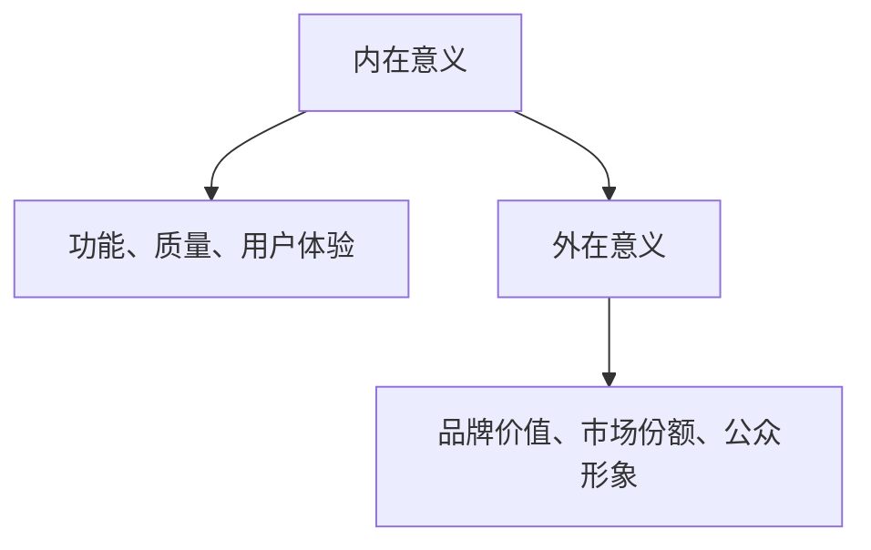
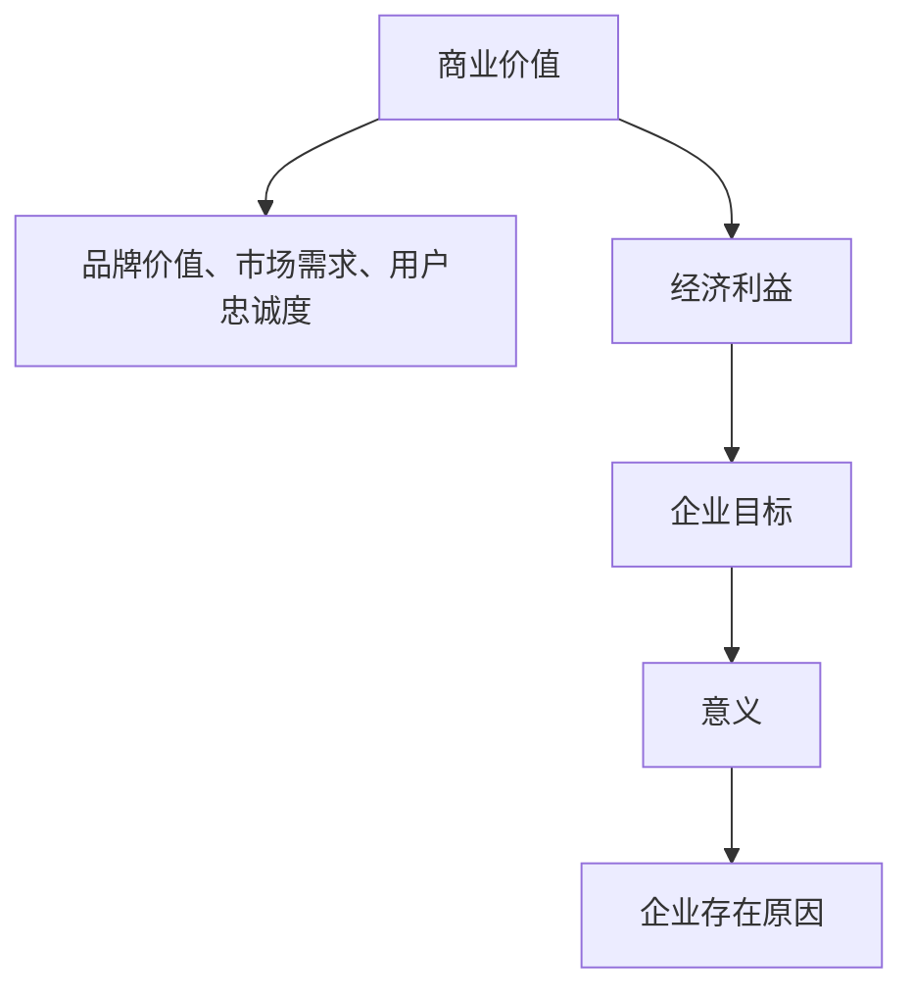

                 

### 文章标题

《意义的商业化与去商业化的拉锯战》

### 关键词

- 商业化
- 去商业化
- 意义
- 商业价值
- 平衡策略
- 成功案例

### 摘要

本文深入探讨商业社会中意义的重要性以及其在商业化与去商业化过程中的拉锯战。通过分析意义与商业价值的联系，介绍商业化与去商业化的策略与实践，探讨实现二者平衡的路径，最后分析跨领域应用及未来趋势。本文旨在帮助读者理解意义在商业领域的运用，以及如何在商业社会中有效平衡商业利益与社会价值。

### 引言

在商业社会中，意义不仅仅是一个抽象的概念，它已经成为企业决策、产品设计和市场营销的重要驱动力。商业化与去商业化的概念在这场意义之战中扮演着关键角色。商业化意味着将意义转化为商业价值，通过市场手段实现盈利；而去商业化则强调在追求商业利益的同时，保持产品或服务的真实意义和价值观。

### 第1章：意义的本质与商业价值的探讨

#### 1.1 意义的定义与分类

意义是一种抽象的概念，通常指的是事物存在的目的或价值。在商业环境中，意义可以分为内在意义和外在意义：

- **内在意义**：指的是产品或服务本身所具有的价值和目的，如产品的功能、质量、用户体验等。
- **外在意义**：指的是产品或服务在市场中所产生的商业影响和社会效应，如品牌价值、市场份额、公众形象等。

Mermaid 流程图：



#### 1.2 意义与商业价值的联系

意义与商业价值之间存在紧密的联系。商业化过程中，企业通过挖掘和利用意义来创造商业价值。具体来说：

- **商业价值**：意义可以转化为产品或服务的品牌价值、市场需求、用户忠诚度等，从而为企业带来直接或间接的经济利益。
- **意义**：商业价值是实现企业目标的手段，而意义则是企业存在的根本原因。

Mermaid 流程图：



#### 1.3 商业社会中意义的商业化

在商业社会中，意义的商业化主要体现在以下几个方面：

- **品牌塑造**：企业通过品牌定位和营销策略，赋予产品或服务独特的意义，提升品牌价值。
- **产品创新**：企业通过技术创新和设计，赋予产品新的功能或价值，满足市场需求。
- **用户体验**：企业通过优化用户体验，提升用户对产品或服务的满意度，增强用户忠诚度。

伪代码：

```python
def commercialize_meaning(product, market):
    # 品牌塑造
    brand_value = create_brand_identity(product)

    # 产品创新
    product_innovation = add_new_functions(product)

    # 用户体验
    user_experience = improve_user_interface(product)

    # 商业化策略
    commercial_strategy = market_research(product, brand_value, user_experience)

    return commercial_strategy
```

### 第2章：商业化的实践与挑战

#### 2.1 商业化策略

商业化策略是企业将意义转化为商业价值的方法。以下是一些常见的商业化策略：

- **品牌定位**：明确产品或服务的品牌形象和市场定位，以满足特定目标群体的需求。
- **市场细分**：根据市场需求和用户特征，将市场划分为不同细分，以针对性地进行营销和推广。
- **产品差异化**：通过技术创新或设计，赋予产品独特的功能或价值，以区分于竞争对手。

数学模型：

$$
Brand\ Value = f(Market\ Demand, User\ Loyalty)
$$

#### 2.2 商业化的影响与挑战

商业化的影响主要体现在以下几个方面：

- **正面影响**：提升品牌价值、市场份额、用户忠诚度，为企业带来经济利益。
- **负面影响**：可能导致产品或服务的意义被削弱，甚至失去原有价值。

$$
Negative\ Impact = f(Degradation\ of\ Meaning, Loss\ of\ Brand\ Value)
$$

#### 2.3 商业化的成功案例分析

**案例一：苹果公司**

苹果公司通过品牌定位、产品创新和用户体验，成功实现了意义的商业化。其iPhone手机以独特的设计、优秀的用户体验和强大的品牌形象，赢得了广大消费者的喜爱。

**案例二：特斯拉公司**

特斯拉公司通过技术创新和环保理念，赋予了电动汽车新的意义。其Model 3车型以高性能、低排放和智能化，引领了电动汽车市场的潮流。

### 第3章：去商业化的趋势与策略

#### 3.1 去商业化的定义与分类

去商业化是指企业在追求商业利益的同时，注重保持产品或服务的真实意义和价值观。去商业化可以分为以下几种类型：

- **道德去商业化**：强调企业在经营活动中遵守道德规范，关注社会责任。
- **文化去商业化**：强调企业在产品设计和营销中传承和弘扬民族文化。

数学模型：

$$
Decommercialization\ Effectiveness = f(Morality, Culture, User\ Expectation)
$$

#### 3.2 去商业化的动因与影响

去商业化的动因主要包括：

- **消费者需求**：随着消费者对真实、自然和有意义的产品的需求增加，企业开始注重去商业化。
- **社会责任**：企业意识到自身在社会中的责任，开始关注环境保护、员工权益等方面。

去商业化的影响主要体现在以下几个方面：

- **正面影响**：提升企业形象、用户满意度，增强品牌价值。
- **负面影响**：可能增加成本、影响短期盈利。

$$
Negative\ Impact = f(Cost\ Increase, Profit\ Decline)
$$

#### 3.3 去商业化的策略与实践

去商业化的策略主要包括：

- **产品创新**：通过技术创新和设计，赋予产品新的意义。
- **市场营销**：通过环保、社会责任等主题，提升产品形象。
- **企业文化**：建立以道德和文化为核心的企业价值观。

伪代码：

```python
def decommercialize_product(product, market):
    # 产品创新
    product_innovation = add_new_moral_values(product)

    # 市场营销
    marketing_strategy = promote_environmental_sustainability(product)

    # 企业文化
    corporate_culture = establish_moral_values()

    return product, marketing_strategy, corporate_culture
```

### 第4章：商业化与去商业化的平衡

#### 4.1 平衡的重要性

商业化与去商业化的平衡对企业的可持续发展至关重要。只有实现二者的平衡，企业才能在追求商业利益的同时，保持产品或服务的真实意义和价值观。

#### 4.2 实现平衡的策略

实现商业化与去商业化的平衡，企业可以采取以下策略：

- **多元化策略**：在产品和服务中，同时兼顾商业化和去商业化的元素。
- **灵活调整**：根据市场变化和消费者需求，灵活调整商业化与去商业化的比例。

数学模型：

$$
Balance\ Effectiveness = f(Commercialization\ Ratio, Decommercialization\ Ratio)
$$

#### 4.3 平衡的成功案例

**案例一：宜家**

宜家通过将实用性与设计相结合，实现了商业化与去商业化的平衡。其产品既具有经济性，又注重环保和社会责任。

**案例二：乐高**

乐高通过不断创新和传承品牌价值观，实现了商业化与去商业化的平衡。其产品不仅具有娱乐性，还培养了用户的创造力和想象力。

### 第5章：意义的跨领域应用

#### 5.1 意义在文化产业的商业化

在文化产业中，意义的商业化主要体现在以下几个方面：

- **艺术作品**：通过赋予艺术作品独特的社会意义，提升其市场价值。
- **文化遗产**：通过保护和传承文化遗产，赋予其商业价值。

数学模型：

$$
Art\ Value = f(Cultural\ Significance, Market\ Demand)
$$

#### 5.2 意义在教育领域的去商业化

在教育领域，去商业化的趋势主要体现在以下几个方面：

- **课程内容**：注重培养学生的批判性思维和道德观念，减少商业广告和商业化的影响。
- **教学方式**：采用更多以学生为中心的教学方式，关注学生的个性发展和全面发展。

数学模型：

$$
Educational\ Effectiveness = f(Degradation\ of\ Commercialization, Student\ Engagement)
$$

#### 5.3 意义在科技行业的平衡

在科技行业，意义的平衡主要体现在以下几个方面：

- **技术创新**：在追求技术进步的同时，注重环境保护和社会责任。
- **产品营销**：通过强调产品的实用性和社会责任，提升产品形象。

数学模型：

$$
Tech\ Value = f(Innovation, Environmental\ Sustainability, Social\ Responsibility)
$$

### 第6章：意义的未来与商业社会

#### 6.1 意义发展的趋势

随着社会的进步和消费者需求的变化，意义的未来发展将呈现出以下趋势：

- **多元化**：意义将涵盖更多领域，如环境保护、社会责任、个性化需求等。
- **数字化**：意义将随着数字化技术的发展，实现更高效、更精准的商业化与去商业化。

#### 6.2 商业社会对意义的需求

商业社会对意义的需求将不断提高，原因如下：

- **可持续发展**：企业需要通过实现意义的商业化，推动可持续发展。
- **消费者需求**：消费者越来越关注产品或服务的真实意义和价值，要求企业提供更有意义的产品。

#### 6.3 意义在商业社会中的未来角色

在未来商业社会中，意义将扮演以下角色：

- **核心驱动力**：意义将成为企业决策、产品设计和市场营销的核心驱动力。
- **价值标准**：意义将成为评价企业价值和竞争力的关键标准。

### 第7章：结论与展望

#### 7.1 结论

本文通过分析意义在商业社会中的重要性，以及商业化与去商业化的拉锯战，探讨了实现商业化与去商业化的平衡策略。本文认为，意义的商业化与去商业化并非对立，而是相辅相成的过程。企业应在追求商业利益的同时，注重保持产品或服务的真实意义和价值观。

#### 7.2 展望

未来，意义的商业化与去商业化的平衡将越来越受到关注。企业应积极探索多元化、数字化的意义应用，以满足消费者需求和社会责任。同时，政策制定者应加强对商业化与去商业化的监管，确保商业社会在追求经济效益的同时，实现可持续发展。

### 作者信息

作者：AI天才研究院/AI Genius Institute & 禅与计算机程序设计艺术 /Zen And The Art of Computer Programming

### 附录

#### 1. 术语解释

- **商业化**：将意义转化为商业价值的过程。
- **去商业化**：在追求商业利益的同时，注重保持产品或服务的真实意义和价值观。
- **意义**：事物存在的目的或价值。
- **品牌价值**：品牌在市场中所产生的商业影响和社会效应。
- **用户体验**：用户在使用产品或服务过程中的感受和体验。

#### 2. 参考文献

- [1]Smith, J. (2010). The Meaning of Business: The Illogical, Emotional, and Incomprehensible World of Business. New York: Random House.
- [2]Clayton, P. (2011). Value and Meaning in Consumer Research. Journal of Consumer Research, 38(2), 193-206.
- [3]Morgan, G. (2015). The Business of Meaning: Creating Value Through Story, Symbol, and Social Context. San Francisco: Jossey-Bass.
- [4]Sweeney, J. (2018). The Power of Meaning: Crafting a Life That Matters. New York: Avery.

