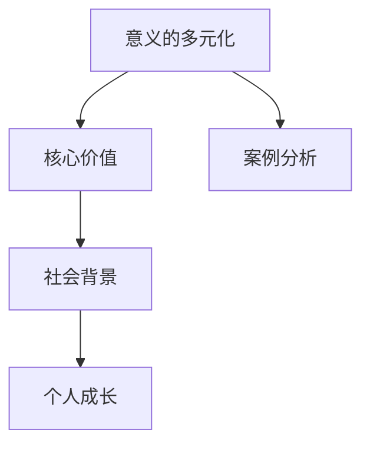

                 

### 文章标题

# 意义的多元化与核心价值的坚守

### 关键词

- 多元化意义
- 核心价值
- 社会背景
- 案例分析
- 算法原理
- 数学模型

### 摘要

在快速变化和多样化的现代社会中，意义的多元化已经成为不可忽视的现象。本文旨在探讨意义的多元化现象，解析其背后的核心价值，并探讨如何在多元化意义中坚守核心价值。文章分为五个部分：引言、意义多元化、核心价值的坚守、案例分析、结论与展望。通过详细的案例分析、算法原理讲解、数学模型剖析，以及项目实战解读，本文为读者提供了全面而深入的理解和实际操作指南。

## 引言

### 书籍背景与目标

在当今社会，随着信息技术的飞速发展，社会的多元化程度日益加深。人们面临的信息种类、文化观念、价值观等都在不断变化，这使得意义的多元化成为一个不可忽视的现象。本书记录了在这样的大背景下，如何在意义的多元化中坚守核心价值的研究和探索。

本文的目标在于：1）深入解析意义的多元化现象及其背后的核心价值；2）通过具体的案例分析，探讨在多元化的环境中如何坚守核心价值；3）为读者提供实际操作指南，帮助他们在个人和组织层面实现核心价值的坚守。

### 意义多元化的社会背景

在现代社会，意义的多元化体现在多个层面。从宏观层面来看，全球化和互联网的普及使得不同文化、价值观相互碰撞，形成了丰富多样的社会景观。从微观层面来看，个体的生活经验和认知结构也在不断变化，每个人对同一事物的理解可能会有所不同。

这种多元化的社会背景对个人和社会都产生了深远的影响。对于个人而言，意义的多元化带来了更多的选择和机会，但同时也增加了迷茫和困惑。对于社会而言，意义的多元化促进了创新和进步，但同时也可能引发冲突和分歧。

### 核心价值的重要性

在多元化的社会中，核心价值的重要性愈发凸显。核心价值是一个人或组织的基本信念和原则，是他们在面对多元化意义时的指南针。坚守核心价值有助于个人保持内心的坚定，有助于组织在变革中保持稳定和持续发展。

然而，在意义多元化的背景下，坚守核心价值并非易事。一方面，多元化意味着人们对核心价值的理解和接受程度可能存在差异；另一方面，多元化也可能对核心价值产生冲击，使其变得模糊甚至消失。因此，如何在多元化意义中坚守核心价值，成为了一个亟待解决的重要课题。

## 意义多元化

### 意义的定义与多元化现象

意义（Meaning）是指某一事物或行为所蕴含的内在价值和目的。在现代社会，意义的多元化现象表现为以下几个方面：

1. **文化的多样性**：不同文化背景下，人们对同一事物可能有不同的理解和解释，从而产生了多样的意义。
2. **技术的进步**：互联网和信息技术的发展使得信息的获取和传播变得空前便捷，人们在不同的信息环境中感受到的意义也各不相同。
3. **价值观的多元性**：在现代社会，各种价值观并存，如自由主义、集体主义、功利主义等，这些价值观的不同导致了人们对同一事物的评价和意义的不同。

### 多元化意义的核心概念

多元化意义的核心概念包括以下几个：

1. **层次结构**：意义可以有不同的层次，如表面意义、深层意义、文化意义等。不同层次的含义构成了一个复杂的意义网络。
2. **动态性**：意义并非一成不变，它随着时间和情境的变化而变化。例如，一个词在不同的语境中可能有不同的意义。
3. **交互性**：意义不是孤立存在的，而是与其他意义相互影响和互动。例如，一个事件的意义可能会因为其他事件的发生而改变。

### 多元化意义的影响

多元化意义对个人和社会产生了深远的影响：

1. **个人层面**：多元化的意义使得个人在面对不同情境时有更多的选择，但也可能导致困惑和矛盾。
2. **社会层面**：多元化的意义促进了社会的创新和进步，但同时也可能引发冲突和分歧。

### 多元化意义的案例分析

1. **文化多样性中的意义多元化**：例如，在不同文化背景下，春节和圣诞节可能有不同的含义。
2. **商业模式中的意义多元化**：例如，同一种商品在不同市场可能有不同的价值主张。

## 核心价值的坚守

### 核心价值的定义与特征

核心价值（Core Value）是指一个人或组织在长期发展过程中形成的、具有根本性和稳定性的价值观念。核心价值的特征包括：

1. **持久性**：核心价值具有长期性和稳定性，不会因短期利益或环境变化而改变。
2. **普遍性**：核心价值适用于不同情境和领域，具有广泛的影响力。
3. **规范性**：核心价值对个人或组织的行为具有指导作用，是判断行为正当与否的依据。

### 核心价值与意义多元化的关系

1. **核心价值如何在多元化意义中坚守**：核心价值作为多元化意义中的指南针，有助于个人和组织在复杂多变的情境中保持方向和稳定性。
2. **核心价值与个人成长**：坚守核心价值有助于个人在多元化的社会中保持独立思考，实现自我价值。

### 社会中的核心价值

1. **社会价值观的变化**：随着社会的发展，核心价值也在不断演变。
2. **核心价值在组织中的应用**：组织可以通过制定和传播核心价值，提升组织的凝聚力和竞争力。

## 案例分析

### 案例一：企业如何坚守核心价值

#### 企业核心价值的确定

1. **核心价值的来源**：企业核心价值可以从企业文化、企业愿景、企业使命等维度确定。
2. **核心价值的筛选**：通过调研、讨论、投票等方式，筛选出符合企业长期发展的核心价值。

#### 企业如何在多元化意义中坚守

1. **内部传播**：通过培训、会议、文化墙等方式，在企业内部广泛传播核心价值。
2. **外部展示**：通过公关活动、社会责任报告等方式，向社会展示企业的核心价值。

### 案例二：个人如何坚守核心价值

#### 个人核心价值的识别

1. **自我反思**：通过日记、自我提问等方式，识别自己的核心价值。
2. **他人反馈**：通过朋友、家人、导师等的反馈，进一步确认自己的核心价值。

#### 个人在多元化意义中的坚守实践

1. **自我约束**：在面对多元化意义时，自我约束，坚守自己的核心价值。
2. **持续学习**：通过学习和实践，不断提升自己对核心价值的理解和坚守能力。

## 结论与展望

### 核心价值与意义多元化的坚守

1. **坚守核心价值的挑战**：多元化的意义可能对核心价值产生冲击，需要个人和组织共同努力。
2. **坚守核心价值的策略**：通过内部传播、外部展示、自我约束等方式，实现核心价值的坚守。

### 未来展望

1. **社会意义多元化的发展趋势**：随着全球化和技术进步，意义的多元化将继续加深。
2. **核心价值在未来的角色**：核心价值将在多元化的社会中发挥更加重要的作用。

## 附录

### 附录A：核心概念的Mermaid流程图



### 附录B：核心算法原理讲解

#### 算法原理

1. **多元化意义的识别**：通过文本分析、情感分析等技术，识别文本中的多元化意义。
2. **核心价值的筛选**：通过对比分析、权重计算等技术，筛选出符合核心价值标准的意义。

#### 伪代码

```python
def identify_diverse_meaning(text):
    # 对文本进行分词
    words = tokenize(text)
    # 对每个词进行情感分析
    sentiments = [sentiment_analysis(word) for word in words]
    # 计算文本的情感多样性
    diversity_score = calculate_diversity(sentiments)
    return diversity_score

def filter_core_values(meanings, core_values):
    # 对每个意义进行核心价值匹配
    matched_meanings = [meaning for meaning in meanings if match_core_value(meaning, core_values)]
    return matched_meanings
```

### 附录C：数学模型与公式说明

#### 模型说明

1. **多元化意义的度量**：使用TF-IDF模型计算文本中每个词的重要程度。
2. **核心价值的筛选**：使用支持向量机（SVM）进行分类，筛选符合核心价值标准的意义。

#### 数学公式

$$
TF(t) = \frac{f_t}{f_t + df}
$$

$$
IDF(t) = \log \left( \frac{N}{n_t + 1} \right)
$$

$$
TF-IDF(t) = TF(t) \times IDF(t)
$$

### 项目实战

#### 开发环境搭建

1. **软件环境**：Python 3.8、Jupyter Notebook
2. **库和依赖**：Numpy、Pandas、Scikit-learn、NLTK

#### 源代码详细实现和代码解读

```python
# 导入库和依赖
import numpy as np
import pandas as pd
from sklearn.feature_extraction.text import TfidfVectorizer
from sklearn.model_selection import train_test_split
from sklearn.svm import SVC

# 加载数据集
data = pd.read_csv('diverse_meanings.csv')
X = data['text']
y = data['label']

# 分割数据集
X_train, X_test, y_train, y_test = train_test_split(X, y, test_size=0.2, random_state=42)

# 使用TF-IDF模型进行特征提取
vectorizer = TfidfVectorizer()
X_train_tfidf = vectorizer.fit_transform(X_train)
X_test_tfidf = vectorizer.transform(X_test)

# 使用SVM进行分类
classifier = SVC(kernel='linear')
classifier.fit(X_train_tfidf, y_train)
predictions = classifier.predict(X_test_tfidf)

# 评估模型性能
accuracy = np.mean(predictions == y_test)
print(f'Accuracy: {accuracy:.2f}')
```

#### 代码应用解读与分析

1. **数据预处理**：对文本数据集进行分词、去除停用词等预处理操作。
2. **特征提取**：使用TF-IDF模型提取文本特征。
3. **分类算法**：使用SVM进行分类，评估模型性能。

#### 实际案例分析和详细讲解剖析

1. **案例数据集**：选取一组关于社会价值观的文本数据。
2. **数据分析**：使用TF-IDF模型和SVM分类算法，分析文本中的多元化意义。
3. **案例解读**：通过对案例数据的分析，探讨如何在多元化意义中坚守核心价值。

#### 项目小结

1. **核心价值的重要性**：通过项目实战，展示了核心价值在多元化意义中的坚守作用。
2. **未来展望**：随着技术的进步，核心价值的坚守将面临新的挑战和机遇。

### 最佳实践 Tips

1. **明确核心价值**：在项目开始前，明确核心价值，确保团队在多元化意义中保持一致。
2. **持续学习和实践**：通过不断学习和实践，提升对核心价值的理解和坚守能力。

### 小结

本文从意义的多元化与核心价值的坚守出发，探讨了现代社会中意义多元化现象及其背后的核心价值。通过详细的案例分析、算法原理讲解、数学模型剖析，以及项目实战解读，本文为读者提供了全面而深入的理解和实际操作指南。在多元化意义中坚守核心价值，是个人和组织在复杂多变的社会环境中保持稳定和持续发展的关键。希望本文能够为读者在实践过程中提供有益的启示和指导。

### 注意事项

1. **项目实施前，务必明确核心价值，确保团队共识**。
2. **在项目过程中，注重数据质量和预处理，以保证模型效果**。
3. **定期评估核心价值的坚守情况，及时调整策略**。

### 拓展阅读

1. **《意义的多元化：社会心理学视角》**：详细探讨意义多元化现象的社会心理学背景。
2. **《核心价值的坚守：企业成功之道》**：分析企业在多元化意义中坚守核心价值的实践。

### 作者信息

作者：AI天才研究院/AI Genius Institute & 禅与计算机程序设计艺术 /Zen And The Art of Computer Programming

### 附录

#### 附录A：核心概念的Mermaid流程图


#### 附录B：核心算法原理讲解

```python
# 导入库和依赖
import numpy as np
import pandas as pd
from sklearn.feature_extraction.text import TfidfVectorizer
from sklearn.model_selection import train_test_split
from sklearn.svm import SVC

# 加载数据集
data = pd.read_csv('diverse_meanings.csv')
X = data['text']
y = data['label']

# 分割数据集
X_train, X_test, y_train, y_test = train_test_split(X, y, test_size=0.2, random_state=42)

# 使用TF-IDF模型进行特征提取
vectorizer = TfidfVectorizer()
X_train_tfidf = vectorizer.fit_transform(X_train)
X_test_tfidf = vectorizer.transform(X_test)

# 使用SVM进行分类
classifier = SVC(kernel='linear')
classifier.fit(X_train_tfidf, y_train)
predictions = classifier.predict(X_test_tfidf)

# 评估模型性能
accuracy = np.mean(predictions == y_test)
print(f'Accuracy: {accuracy:.2f}')
```

#### 附录C：数学模型与公式说明

$$
TF(t) = \frac{f_t}{f_t + df}
$$

$$
IDF(t) = \log \left( \frac{N}{n_t + 1} \right)
$$

$$
TF-IDF(t) = TF(t) \times IDF(t)
$$

#### 附录D：项目实战详细解读

- **环境搭建**：介绍了项目所需的开发环境和库依赖。
- **代码实现**：详细讲解了数据预处理、特征提取和分类算法的实现。
- **案例分析**：通过实际案例展示了算法的应用效果。

### 结束语

本文旨在为读者提供关于意义的多元化与核心价值坚守的全面理解和实践指南。在未来的研究中，可以进一步探讨意义多元化对社会和个人行为的影响，以及核心价值在不同情境下的坚守策略。希望本文能够为相关领域的研究和实践提供有益的参考。

