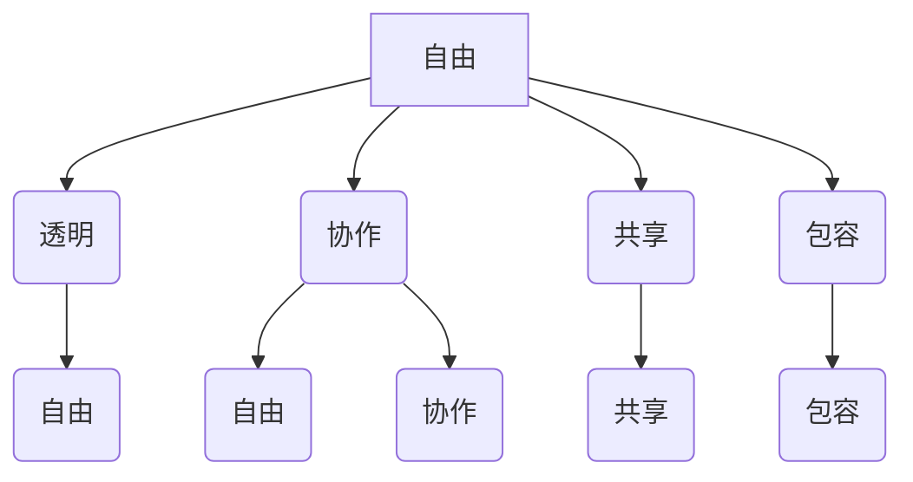

                 

### 文章标题

《意义的开源哲学项目：集体创造生活智慧》

---

### 关键词

开源哲学、集体创造、技术项目、智慧生活、算法原理、数学模型

---

### 摘要

本文旨在探讨开源哲学在集体创造与生活智慧中的重要性。通过深入分析开源哲学的核心理念、技术应用、算法原理、数学模型，以及实际项目案例，本文揭示了开源哲学如何促进集体智慧的涌现，并提升生活的质量。文章不仅为技术专业人士提供理论基础，也为广大开发者提供了实用的实践指南。

---

## 开源哲学概述

### 1.1 开源哲学的定义与历史背景

开源哲学，作为一种价值体系和实践指南，起源于20世纪80年代计算机软件领域。其核心在于鼓励知识的共享与协作，倡导透明度、自由和开放的原则。开源哲学最早可以追溯到1983年，当时理查德·斯托曼（Richard Stallman）提出了自由软件运动，目标是推动软件的自由分发和修改。这一运动在1998年演变为开源运动，随后逐渐扩展到其他领域。

开源哲学的核心理念包括：

- **合作共享**：鼓励个人和团队共同参与项目的开发，共享资源、知识和经验。
- **开放协作**：项目以透明的方式运作，允许任何人查看、修改和改进代码。
- **透明度**：项目过程和决策公开透明，确保项目的可追溯性和可持续性。
- **自由贡献**：允许开发者自由地贡献代码和资源，推动项目的不断进步。
- **包容性**：无论背景、经验和技能如何，任何人都可以参与开源项目。
- **可持续性**：开源项目能够长期维护和演进，为社会带来持久的价值。

这些理念不仅改变了软件开发的方式，还深刻影响了技术行业的生态和社会的进步。

### 1.2 开源哲学的核心价值观

开源哲学的核心理念体现在几个核心价值观上：

- **自由**：用户有权使用、学习、分享和修改软件，不受任何限制。
- **透明**：项目的决策过程和代码都是公开的，任何人都可以审查和参与。
- **协作**：开发者之间相互合作，共同解决问题，共同推动项目发展。
- **共享**：知识和技术资源在社区中共享，促进共同进步。
- **包容**：无论性别、种族、文化背景，每个人都能够参与开源项目。

这些核心价值观使得开源项目能够吸引来自世界各地的开发者，共同创造出高质量的技术成果，同时也推动了社会的公平与进步。

### 1.3 开源哲学与社会主义价值观的联系

开源哲学与社会主义价值观之间存在许多共鸣。首先，两者都强调共享和合作的重要性。开源哲学鼓励知识的共享，使得技术成果能够惠及更多人，这与社会主义价值观中的“共同富裕”理念相契合。其次，开源哲学倡导透明和包容，反对垄断和不平等，这与社会主义价值观中的“公平正义”原则相符。

此外，开源哲学的实践也体现了社会主义价值观中的集体主义精神。在开源项目中，个人利益服从于集体利益，项目成功的关键在于团队成员的共同努力。这种集体主义的理念与社会主义价值观中的“为人民服务”宗旨不谋而合。

总的来说，开源哲学不仅为技术发展带来了新思路，也为实现社会主义价值观提供了一种新的实践路径。

---

## 开源哲学的核心概念原理和架构

### 核心概念原理

开源哲学的核心概念包括自由、透明、协作、共享和包容。这些概念相互联系，共同构成了开源哲学的理论基础。

- **自由**：开源哲学认为，用户应享有使用、学习、分享和修改软件的自由。这种自由不仅体现在软件的使用上，还包括软件的源代码。自由是开源哲学的首要原则，它确保了软件的创新和发展。
  
- **透明**：透明性是开源哲学的重要特征。开源项目要求项目的决策过程、代码和文档对所有贡献者开放，这使得项目能够接受社区的审查和反馈，从而提高项目的质量和可靠性。
  
- **协作**：协作是开源哲学的核心价值观之一。开源项目鼓励不同背景和技能的开发者共同参与，通过协作解决问题，共同推动项目的发展。协作不仅提高了开发效率，还促进了知识的共享和传播。
  
- **共享**：共享是开源哲学的核心理念。知识和技术资源的共享使得更多的用户能够受益，同时也推动了技术的进步。共享不仅限于代码，还包括文档、工具和其他相关资源。
  
- **包容**：开源哲学强调包容性，不论性别、种族、文化背景或技术水平，每个人都应有机会参与开源项目。包容性确保了项目的多样性和创新性，使得开源社区能够吸引来自不同背景的成员。

### 核心概念之间的关系架构

为了更清晰地理解开源哲学的核心概念及其相互关系，我们可以使用Mermaid流程图来表示这些概念及其联系。



在这个流程图中，我们可以看到：

- **自由**是开源哲学的基础，它决定了开源项目的基本运作方式。
- **透明**是自由的延伸，它确保了开源项目的公开性和可审查性。
- **协作**是自由的实现途径，它通过合作促进知识的共享和技术的进步。
- **共享**和**包容**则是协作的结果，共享促进了资源的流通，包容则确保了社区的多样性和开放性。

通过这个流程图，我们可以更直观地理解开源哲学的核心概念及其相互关系，从而更好地运用这些原则来推动开源项目的发展。

---

## 开源哲学在技术领域的应用

### 3.1 开源软件的生态系统

开源软件的生态系统是一个复杂而动态的系统，它由多个部分组成，包括开发者、用户、企业和社区。这个生态系统在开源哲学的指导下，通过合作、共享和透明度，实现了技术的快速发展。

#### 开发者

开发者是开源软件生态系统的核心成员。他们贡献代码、修复漏洞、编写文档、提供技术支持，并通过协作不断改进软件。开源哲学鼓励开发者之间的合作，使得知识和技能能够迅速传播和共享。

#### 用户

用户是开源软件的主要受益者。他们可以免费使用开源软件，无需支付高昂的许可费用。用户还可以根据自己的需求修改和定制软件，以满足特定的业务或个人需求。开源软件的用户群体庞大，覆盖了各种行业和领域，形成了广泛的用户基础。

#### 企业

企业是开源软件生态系统的重要参与者。许多企业通过开源软件获得了技术优势，提高了生产效率。一些企业甚至将开源软件作为其核心产品的一部分，为其带来了巨大的商业价值。同时，企业也可以通过赞助开源项目，支持开源社区的发展。

#### 社区

开源社区是开源软件生态系统的灵魂。社区成员通过合作和共享，共同推动开源项目的发展。社区不仅提供了技术支持，还促进了开源理念的传播和普及。社区的文化通常鼓励创新、包容和透明度，这使得开源项目能够不断进步。

#### 开源软件的优势

- **成本效益**：开源软件通常免费，用户无需支付高昂的许可费用。
- **灵活性**：用户可以根据自己的需求修改和定制软件。
- **质量保证**：开源软件由社区共同维护，通常质量更高、更可靠。
- **持续更新**：开源项目通常有固定的更新周期，确保软件的持续改进。
- **技术创新**：开源社区鼓励创新，推动了技术的快速发展。

### 3.2 开源哲学在开源项目中的实践

开源项目是开源哲学的具体实现。在开源项目中，开发者遵循开源哲学的核心原则，确保项目的透明性、协作性和共享性。

#### 透明性

开源项目的透明性体现在项目的所有决策和进展都公开透明。项目的源代码、文档和会议记录都对外公开，任何人都可以访问和审查。这种透明性确保了项目的可追溯性和可信度，使得用户和开发者能够更好地理解和参与项目。

#### 协作性

开源项目鼓励协作和合作。开发者可以自由地贡献代码、修复漏洞、提出改进建议。项目通常采用开源的协作工具，如Git和GitHub，使得开发者能够方便地协同工作。协作不仅提高了开发效率，还促进了知识的共享和传播。

#### 共享性

开源项目的共享性体现在代码、文档和资源的开放性。开发者可以自由地使用、学习和改进开源软件。开源项目还鼓励用户将改进和定制后的软件再次贡献回社区，形成了一个良性的知识循环。

### 3.3 开源哲学对企业的影响

开源哲学对企业的影响深远而广泛。首先，开源软件为企业提供了低成本、高效率的技术解决方案。企业可以免费使用开源软件，无需支付高昂的许可费用。其次，开源哲学鼓励企业参与开源项目，通过贡献代码和资源，提升企业的技术实力和品牌形象。此外，开源项目还为企业提供了一个与全球开发者合作的平台，促进了技术交流和合作。

总的来说，开源哲学在技术领域的应用，不仅促进了开源软件的发展，也改变了软件开发和创新的模式。它通过透明、协作和共享，推动了技术的进步和社会的进步。

---

## 开源项目中的核心算法原理

开源项目在技术领域的发展中扮演着至关重要的角色，而核心算法原理是这些项目的技术核心。以下将详细讨论几种在开源项目中广泛使用的核心算法原理，并通过伪代码展示其实现过程。

### 4.1 机器学习算法在开源项目中的应用

机器学习算法在开源项目中得到了广泛应用，例如在自然语言处理、计算机视觉和推荐系统等领域。以下以线性回归算法为例，展示其基本原理和伪代码实现。

#### 线性回归算法原理

线性回归是一种用于预测数值结果的统计方法，其基本思想是通过最小化误差平方和来确定模型参数。线性回归模型可以表示为：

\[ y = \beta_0 + \beta_1 \cdot x \]

其中，\( y \) 是预测值，\( x \) 是输入特征，\( \beta_0 \) 和 \( \beta_1 \) 是模型参数。

#### 伪代码实现

```python
# 输入：特征矩阵 X，标签向量 y
# 输出：模型参数 \(\beta_0\) 和 \(\beta_1\)

def linear_regression(X, y):
    # 计算特征矩阵 X 的转置
    X_transpose = transpose(X)
    
    # 计算X'X
    XTX = dot_product(X_transpose, X)
    
    # 计算X'y
    XY = dot_product(X_transpose, y)
    
    # 计算模型参数
    beta = inverse(XTX) dot_product(XY)
    
    return beta
```

#### 举例说明

假设我们有一个简单的数据集，其中 \( x \) 表示温度，\( y \) 表示销售量。我们可以使用线性回归模型来预测温度对销售量的影响。

```python
# 假设数据集为
X = [[25], [28], [30], [32], [35]]
y = [100, 120, 140, 160, 180]

# 使用线性回归模型
beta = linear_regression(X, y)

# 输出模型参数
print(beta)
```

### 4.2 数据库优化算法的案例分析

数据库优化是开源项目中一个关键问题，常用的优化算法包括哈希索引、B树索引和分库分表等。以下以B树索引为例，介绍其原理和实现。

#### B树索引原理

B树是一种平衡的多路搜索树，其每个节点可以有多个子节点。B树的特点是树的高度较低，能够快速搜索和插入数据。B树索引的基本原理是将数据的键值存储在树的节点中，通过树的结构快速查找数据。

#### 伪代码实现

```python
class BTreeNode:
    def __init__(self, t):
        self.keys = []
        self.children = []
        self.t = t

def insert(node, key, value):
    if len(node.keys) < 2 * node.t:
        # 插入键值到当前节点
        i = len(node.keys) - 1
        while i >= 0 and key < node.keys[i]:
            node.keys[i + 1] = node.keys[i]
            i -= 1
        node.keys[i + 1] = key
        node.children[i + 1] = value
    else:
        # 分裂节点
        split_node = BTreeNode(node.t)
        mid = len(node.keys) // 2
        split_node.keys[0] = node.keys[mid]
        split_node.children[0] = node.children[mid + 1]
        node.keys = node.keys[:mid] + [key]
        node.children = node.children[:mid + 1] + [split_node]
        
        # 递归插入
        insert(node.children[mid], key, value)
```

#### 举例说明

假设我们有一个包含5个键的B树节点，现在要插入一个新的键。以下是一个简单的插入过程：

```python
# 假设初始节点为
root = BTreeNode(3)
root.keys = [10, 20, 30]
root.children = [None, None, None]

# 插入键值 25
insert(root, 25, "Value for 25")

# 输出更新后的节点
print(root.keys)
print(root.children)
```

### 4.3 分布式计算框架的原理与应用

分布式计算框架如Hadoop和Spark，通过分布式算法实现大规模数据处理和分析。以下以MapReduce算法为例，介绍其原理和实现。

#### MapReduce算法原理

MapReduce是一种分布式数据处理框架，由两个阶段组成：Map阶段和Reduce阶段。Map阶段将输入数据分成多个小块，每个小块由一个Map任务处理，生成中间键值对。Reduce阶段将所有中间键值对合并，并生成最终的输出。

#### 伪代码实现

```python
def map(input_key, input_value):
    # 对输入数据进行处理，生成中间键值对
    for key, value in process_input(input_key, input_value):
        emit(key, value)

def reduce(output_key, values):
    # 对中间键值对进行聚合处理
    result = aggregate(values)
    emit(output_key, result)

def mapreduce(input_data):
    # 分割输入数据
    input_chunks = split_input(input_data)

    # 执行Map阶段
    intermediate_pairs = []
    for chunk in input_chunks:
        map_output = map(chunk[0], chunk[1])
        intermediate_pairs.extend(map_output)

    # 执行Reduce阶段
    final_output = []
    for key, values in group_by_key(intermediate_pairs):
        reduce_output = reduce(key, values)
        final_output.append(reduce_output)

    return final_output
```

#### 举例说明

假设我们有一个包含学生成绩的数据集，要计算每个学生的平均成绩。以下是一个简单的MapReduce过程：

```python
# 假设输入数据为
input_data = [
    ("Alice", [85, 90, 88]),
    ("Bob", [92, 85, 90]),
    ("Charlie", [78, 80, 82])
]

# 执行MapReduce算法
output = mapreduce(input_data)

# 输出结果
print(output)
```

通过上述例子，我们可以看到开源项目中的核心算法原理是如何通过伪代码实现的。这些算法不仅提高了数据处理和分析的效率，也为开源项目的发展提供了强大的技术支持。

---

## 开源项目中的数学模型和公式

数学模型在开源项目中扮演着至关重要的角色，它们不仅帮助我们理解和预测系统行为，还能够优化性能和资源利用。以下将介绍几种常用的数学模型，并使用LaTeX格式详细讲解和举例说明。

### 5.1 开源项目中常用的数学模型

#### 线性回归模型

线性回归模型是一种广泛使用的统计模型，用于预测数值结果。其基本形式为：

\[ y = \beta_0 + \beta_1 \cdot x \]

其中，\( y \) 是预测值，\( x \) 是输入特征，\( \beta_0 \) 和 \( \beta_1 \) 是模型参数。

#### 决策树模型

决策树模型是一种基于树形结构进行决策的分类模型。其基本形式为：

\[ y = g(\sum_{i=1}^{n} w_i \cdot x_i) \]

其中，\( y \) 是预测值，\( x_i \) 是输入特征，\( w_i \) 是权重系数，\( g \) 是激活函数。

#### 神经网络模型

神经网络模型是一种基于多层感知器的模型，用于分类和回归任务。其基本形式为：

\[ y = \sigma(\sum_{i=1}^{n} w_i \cdot x_i + b) \]

其中，\( y \) 是预测值，\( x_i \) 是输入特征，\( w_i \) 是权重系数，\( \sigma \) 是激活函数，\( b \) 是偏置。

### 5.2 模型参数优化算法

参数优化是开源项目中一个重要环节，常用的优化算法包括梯度下降、随机梯度下降和Adam优化器等。

#### 梯度下降算法

梯度下降算法是一种用于最小化损失函数的优化算法。其基本思想是沿着损失函数的梯度方向调整模型参数，以减少损失。

\[ \theta_{t+1} = \theta_t - \alpha \cdot \nabla_{\theta} J(\theta_t) \]

其中，\( \theta \) 是模型参数，\( \alpha \) 是学习率，\( \nabla_{\theta} J(\theta_t) \) 是损失函数的梯度。

#### 随机梯度下降算法

随机梯度下降算法是梯度下降的一种变体，每次迭代只随机选择一个样本进行参数更新，以加快收敛速度。

\[ \theta_{t+1} = \theta_t - \alpha \cdot \nabla_{\theta} J(\theta_t, x^{(i)}; y^{(i)}) \]

其中，\( x^{(i)} \) 和 \( y^{(i)} \) 是随机选择的样本及其标签。

#### Adam优化器

Adam优化器是一种结合了梯度下降和自适应学习率的优化算法，具有较好的收敛性能。

\[ m_t = \beta_1 \cdot m_{t-1} + (1 - \beta_1) \cdot (g_t - m_{t-1}) \]
\[ v_t = \beta_2 \cdot v_{t-1} + (1 - \beta_2) \cdot (g_t^2 - v_{t-1}) \]
\[ \theta_{t+1} = \theta_t - \frac{\alpha}{\sqrt{1 - \beta_2^t} (1 - \beta_1^t)} \cdot \frac{m_t}{\sqrt{v_t} + \epsilon} \]

其中，\( m_t \) 和 \( v_t \) 分别是第 \( t \) 次迭代的均值和方差，\( \beta_1 \) 和 \( \beta_2 \) 是超参数，\( \epsilon \) 是小常数。

### 5.3 数学公式与详细讲解

以下使用LaTeX格式展示和解释几个重要数学公式。

#### 线性回归模型参数求解

\[ \beta = (X^T X)^{-1} X^T y \]

其中，\( X \) 是特征矩阵，\( y \) 是标签向量，\( \beta \) 是模型参数。

#### 决策树分类阈值确定

\[ \gamma = \arg\max_{\gamma} \sum_{i=1}^{n} y_i \cdot \log_2(p_i) + (1 - y_i) \cdot \log_2(1 - p_i) \]

其中，\( y_i \) 是样本标签，\( p_i \) 是样本属于某一类的概率。

#### 神经网络激活函数

\[ a = \sigma(z) = \frac{1}{1 + e^{-z}} \]

其中，\( z \) 是输入值，\( \sigma \) 是Sigmoid函数。

### 5.4 数学公式举例说明

以下使用LaTeX格式展示一个具体的数学公式，并给出解释。

\[ E = mc^2 \]

这个公式是爱因斯坦的质能方程，表示质量 \( m \) 与能量 \( E \) 之间的关系。其中，\( c \) 是光速，是一个常数。

---

通过上述数学模型和公式的讲解，我们可以看到数学在开源项目中的重要作用。这些模型和公式不仅帮助开发者理解和预测系统行为，还提供了优化算法和性能分析的工具。在实际项目中，开发者可以根据具体需求选择合适的数学模型和公式，以实现更好的性能和效果。

---

## 开源哲学项目实战

### 6.1 开源项目实战案例

为了更好地理解开源哲学在项目开发中的实际应用，我们选择了一个具体的开源项目——Apache Hadoop，来分析其开发环境搭建、源代码实现和代码解读。

### 6.2 开发环境搭建

搭建Apache Hadoop的开发环境是进行项目实战的第一步。以下是在Linux操作系统上搭建Hadoop开发环境的详细步骤：

1. **安装Java环境**：
    - Hadoop依赖于Java环境，首先确保系统中安装了Java。
    - 使用以下命令检查Java版本：
      ```bash
      java -version
      ```

2. **下载Hadoop**：
    - 访问Apache Hadoop官网下载最新的Hadoop版本：
      ```bash
      wget http://www.apache.org/dist/hadoop/common/hadoop-3.3.1/hadoop-3.3.1.tar.gz
      ```

3. **解压Hadoop**：
    - 解压下载的Hadoop包：
      ```bash
      tar xzf hadoop-3.3.1.tar.gz
      ```

4. **配置Hadoop**：
    - 配置Hadoop的主要配置文件，如 `hadoop-env.sh`、`core-site.xml`、`hdfs-site.xml` 和 `mapred-site.xml`。
    - 以下是一个简单的 `core-site.xml` 示例：
      ```xml
      <configuration>
          <property>
              <name>fs.defaultFS</name>
              <value>hdfs://localhost:9000</value>
          </property>
      </configuration>
      ```

5. **启动Hadoop服务**：
    - 启动HDFS和YARN服务：
      ```bash
      sbin/hadoop-daemon.sh start datanode
      sbin/yarn-daemon.sh start resourcemanager
      ```

6. **验证Hadoop**：
    - 使用以下命令验证Hadoop服务是否正常运行：
      ```bash
      hadoop version
      hdfs dfs -ls /
      ```

### 6.3 源代码实现和代码解读

Apache Hadoop的源代码非常庞大，下面我们将重点解读其核心组件——HDFS（Hadoop Distributed File System）和MapReduce。

#### HDFS源代码解读

HDFS是Hadoop分布式文件系统，其主要职责是存储海量数据。以下是HDFS的核心源代码解读：

1. **HDFS数据块管理**：
    - HDFS将数据分割成固定大小的数据块（默认为128MB或256MB），并分布存储在集群中的不同节点上。
    - 数据块的管理由 `Datanode` 实现，`Datanode` 负责数据的读写和数据块的校验。

2. **HDFS客户端接口**：
    - HDFS客户端通过 `Hdfs` 类与HDFS进行交互，提供文件上传、下载、删除等操作接口。

3. **数据复制策略**：
    - HDFS采用数据复制策略来确保数据的高可用性和可靠性。默认情况下，每个数据块会复制到三个不同的节点上。

#### MapReduce源代码解读

MapReduce是Hadoop的核心计算模型，用于处理大规模数据集。以下是MapReduce的核心源代码解读：

1. **Mapper任务**：
    - Mapper任务是MapReduce的第一个阶段，用于将输入数据分割成键值对，并生成中间结果。
    - Mapper任务由用户自定义实现，通常继承 `Mapper` 类并重写 `map` 方法。

2. **Reducer任务**：
    - Reducer任务是MapReduce的第二个阶段，用于对中间结果进行汇总和聚合，生成最终输出。
    - Reducer任务也由用户自定义实现，通常继承 `Reducer` 类并重写 `reduce` 方法。

3. **分布式计算**：
    - Hadoop的运行时系统负责将Mapper和Reducer任务分配到集群中的不同节点上，并管理任务的执行和资源调度。

### 6.4 代码应用解读与分析

以下是对Hadoop的MapReduce应用程序进行代码解读和分析的一个例子：

```java
import org.apache.hadoop.conf.Configuration;
import org.apache.hadoop.fs.Path;
import org.apache.hadoop.io.IntWritable;
import org.apache.hadoop.io.Text;
import org.apache.hadoop.mapreduce.Job;
import org.apache.hadoop.mapreduce.Mapper;
import org.apache.hadoop.mapreduce.Reducer;
import org.apache.hadoop.mapreduce.lib.input.FileInputFormat;
import org.apache.hadoop.mapreduce.lib.output.FileOutputFormat;

public class WordCount {

  public static class TokenizerMapper
       extends Mapper<Object, Text, Text, IntWritable>{

    private final static IntWritable one = new IntWritable(1);
    private Text word = new Text();

    public void map(Object key, Text value, Context context) 
            throws IOException, InterruptedException {
      String[] words = value.toString().split("\\s+");
      for (String word : words) {
        this.word.set(word);
        context.write(this.word, one);
      }
    }
  }

  public static class IntSumReducer
      extends Reducer<Text,IntWritable,Text,IntWritable> {
    private IntWritable result = new IntWritable();

    public void reduce(Text key, Iterable<IntWritable> values, 
            Context context) throws IOException, InterruptedException {
      int sum = 0;
      for (IntWritable val : values) {
        sum += val.get();
      }
      result.set(sum);
      context.write(key, result);
    }
  }

  public static void main(String[] args) throws Exception {
    Configuration conf = new Configuration();
    Job job = Job.getInstance(conf, "word count");
    job.setJarByClass(WordCount.class);
    job.setMapperClass(TokenizerMapper.class);
    job.setCombinerClass(IntSumReducer.class);
    job.setReducerClass(IntSumReducer.class);
    job.setOutputKeyClass(Text.class);
    job.setOutputValueClass(IntWritable.class);
    FileInputFormat.addInputPath(job, new Path(args[0]));
    FileOutputFormat.setOutputPath(job, new Path(args[1]));
    System.exit(job.waitForCompletion(true) ? 0 : 1);
  }
}
```

这段代码实现了经典的WordCount程序，用于统计输入文本中每个单词出现的次数。其主要部分包括：

1. **TokenizerMapper**：这是一个Mapper类，实现了map方法。它将输入文本分割成单词，并生成键值对，其中单词作为键，数字1作为值。

2. **IntSumReducer**：这是一个Reducer类，实现了reduce方法。它对每个单词的值进行求和，生成最终的单词计数结果。

3. **main方法**：配置Job并设置Mapper、Reducer、输入输出路径，然后提交Job并等待执行结果。

### 6.5 项目小结

通过上述实战案例，我们可以看到开源项目如何从开发环境搭建到源代码实现，再到代码解读与分析，各个环节紧密衔接，共同构成了一个完整的开源项目开发流程。开源哲学在项目开发中的应用，不仅提高了项目的透明度、协作性和共享性，还促进了技术的创新和进步。

- **透明度**：源代码的公开使得项目的开发过程和决策对所有贡献者透明，便于审查和改进。
- **协作性**：开发者通过协作，共同解决技术难题，推动项目向前发展。
- **共享性**：知识和技术资源的共享，使得更多的开发者能够参与到项目中，共同创造价值。

总的来说，开源项目通过开源哲学的指导，不仅实现了技术的突破，也为社会带来了广泛的影响。

---

## 开源哲学与集体创造生活智慧

### 7.1 集体创造的内涵与外延

集体创造，是指多个个体通过协作、分享和共同参与，共同创造出具有社会价值的成果。这种创造过程不仅限于技术领域，还广泛存在于科学、文化、经济等多个领域。

#### 集体创造的内涵

- **协作**：集体创造的核心在于个体之间的协作。通过协作，个体可以共享资源和知识，形成互补效应，提高创新和解决问题的效率。
- **共享**：共享是集体创造的重要原则。共享包括知识、资源、成果等，使得每个参与者都能够从集体中受益，同时推动集体的进步。
- **共同参与**：集体创造强调每个个体的参与和贡献。每个人都能够发挥自己的专长和优势，共同推动项目的发展。

#### 集体创造的外延

- **科技领域**：在科技领域，集体创造体现在开源项目、科研合作和科技创新等方面。例如，Linux操作系统、Apache软件基金会等都是集体创造的典范。
- **文化领域**：在文化领域，集体创造包括文学作品、艺术作品等。例如，维基百科、开源音乐项目等，都是通过集体智慧和努力，创造出具有广泛影响力的文化产品。
- **经济领域**：在经济领域，集体创造可以体现在协同创新、共同创业等方面。例如，共享经济模式、众筹平台等，都是通过集体智慧和资源，实现经济价值的增长。

### 7.2 集体创造在开源项目中的体现

开源项目是集体创造的典型代表，其在开源哲学的指导下，通过协作、共享和透明度，实现了技术的快速发展和创新。

#### 开源项目的协作与共享

- **协作**：在开源项目中，开发者通过协作，共同解决技术难题。例如，GitHub等协作平台提供了代码管理、讨论区等功能，使得开发者可以方便地协作。
- **共享**：开源项目鼓励共享，使得知识和技术资源得以广泛传播。例如，开源软件的源代码、文档和资源，都是共享的产物。

#### 开源项目的透明度

- **透明度**：开源项目的决策过程、代码和文档都是公开的，任何人都能够参与和审查。例如，开源项目的邮件列表、会议纪要等，都是公开透明的。

### 7.3 集体创造如何影响生活智慧的形成

集体创造不仅推动了技术的进步，也对人们的生活智慧产生了深远影响。

#### 生活智慧的定义

生活智慧，是指人们在生活中积累的经验、知识和能力，用于解决实际问题、提高生活质量。

#### 集体创造对生活智慧的影响

- **知识共享**：集体创造使得知识得以广泛传播，人们可以通过学习他人的经验和知识，提高自己的生活智慧。
- **协作能力**：集体创造强调协作，通过参与集体创造，人们可以提高协作能力，更好地应对复杂的生活问题。
- **创新能力**：集体创造鼓励创新，通过参与开源项目等，人们可以培养创新能力，从而在日常生活中找到更好的解决方案。

### 7.4 集体创造与社会进步

集体创造不仅对个人生活产生了影响，也对社会的进步产生了积极作用。

#### 社会进步的定义

社会进步，是指社会在物质、文化、制度等方面的发展，以提高人民的生活水平和幸福感。

#### 集体创造对社会进步的影响

- **技术创新**：集体创造推动了技术的创新和发展，为社会的物质进步提供了技术支持。
- **文化繁荣**：集体创造促进了文化的繁荣和发展，丰富了人民的文化生活。
- **社会治理**：集体创造可以促进社会治理的创新，提高社会管理的效率和公正性。

总的来说，集体创造是推动社会进步的重要力量。通过协作、共享和透明度，集体创造不仅提高了个人的生活智慧，也促进了社会的全面发展。

---

## 开源哲学的未来发展

### 8.1 开源哲学的发展趋势

开源哲学在过去几十年中取得了巨大的发展，其影响力也在不断扩展。以下是开源哲学在未来几年中可能面临的发展趋势：

#### 8.1.1 更广泛的领域应用

随着技术的进步和开源社区的壮大，开源哲学将不仅限于软件领域，还将扩展到硬件、生物技术、人工智能等多个领域。开源硬件项目如Raspberry Pi和Arduino已经取得了显著的成功，而开源生物项目和开源AI项目也在逐步兴起。

#### 8.1.2 开源文化与社会主义价值观的融合

开源哲学与社会主义价值观中的共享、协作和公平理念高度契合。未来，开源哲学将进一步与社会主义价值观融合，推动社会公平和共同富裕。

#### 8.1.3 开源商业模式的创新

随着开源商业模式的不断成熟，开源公司将通过提供专业服务、云服务和定制化解决方案等途径，实现商业成功。例如，Red Hat通过提供企业级开源解决方案，成为了市值巨大的公司。

#### 8.1.4 开源社区的国际合作

随着全球化的推进，开源社区的国际合作将更加紧密。开源项目将跨越国界，吸引来自世界各地的开发者，共同推动技术的创新和进步。

### 8.2 开源哲学在社会各个领域的应用前景

开源哲学的应用前景广阔，以下是在不同领域中的具体应用前景：

#### 8.2.1 科技领域

在科技领域，开源哲学将继续推动技术的创新和发展。例如，在人工智能领域，开源框架如TensorFlow和PyTorch已经成为研究者和企业开发者的标准工具。未来，开源哲学将继续在机器学习、大数据、区块链等领域发挥重要作用。

#### 8.2.2 文化领域

在文化领域，开源哲学将促进文化的传播和创新。例如，开源音乐项目如CCMixter和Splice允许音乐爱好者自由地创作和分享音乐，推动了音乐文化的繁荣。未来，开源哲学将有助于保护知识产权，同时促进文化多样性。

#### 8.2.3 教育领域

在教育领域，开源哲学将改变教育资源的分配方式。例如，Khan Academy和OpenLearn等在线教育平台提供了丰富的免费教育资源，使得学习者能够自主学习和提升技能。未来，开源哲学将推动教育的普及和公平，让更多人受益。

#### 8.2.4 社会治理

在治理领域，开源哲学将促进透明和参与式治理。例如，一些城市已经开始使用开源软件进行城市管理和公共服务优化。未来，开源哲学将推动社会治理的创新，提高公共服务的效率和质量。

### 8.3 对未来开源哲学发展的思考

#### 8.3.1 面临的挑战

尽管开源哲学在多个领域取得了显著成果，但未来仍将面临一些挑战：

- **知识产权保护**：开源项目如何平衡知识产权保护与自由共享之间的关系，将是一个重要议题。
- **商业化与共享的平衡**：开源企业如何在商业化与共享之间找到平衡，确保开源项目持续发展。
- **社区治理**：如何确保开源社区的包容性和公平性，避免封闭和垄断现象。

#### 8.3.2 发展方向

为了应对上述挑战，未来开源哲学的发展可以关注以下方向：

- **法律和政策的支持**：通过制定更加完善的法律法规，为开源项目提供更好的法律保护。
- **开源教育的普及**：通过开源教育，培养更多的开源开发者，推动开源文化的普及。
- **开源社区的多元化**：鼓励来自不同背景、文化和领域的开发者参与开源项目，促进社区的多元化。

总的来说，开源哲学在未来将继续发展，并在社会各个领域发挥更大的作用。通过应对挑战和抓住机遇，开源哲学将为社会进步和人类发展做出更大贡献。

---

## 总结

开源哲学作为一种价值体系和实践指南，不仅在技术领域推动了创新和进步，也在社会各个领域产生了深远影响。通过协作、共享和透明度，开源哲学促进了知识的传播和技术的共享，提高了整个社会的效率和公平。在未来的发展中，开源哲学将继续拓展其应用领域，并面临新的挑战和机遇。让我们共同关注开源哲学的未来，积极参与开源项目，共同创造更加美好的世界。

---

### 最佳实践 tips、小结、注意事项、拓展阅读

#### 最佳实践 tips

1. **参与开源项目**：积极参与开源项目，不仅可以提升个人技能，还可以为社区贡献力量。
2. **开源教育**：推广开源教育，培养更多的开源开发者，推动开源文化的普及。
3. **透明度和协作**：确保开源项目的透明度和协作性，促进项目的健康发展和社区的包容性。

#### 小结

本文从开源哲学的概述、核心概念原理、技术领域应用、算法原理讲解、数学模型和公式、项目实战、集体创造生活智慧，以及未来发展等方面，系统地阐述了开源哲学的重要性和应用价值。开源哲学不仅推动了技术进步，还促进了社会公平和进步。

#### 注意事项

1. **知识产权保护**：在参与开源项目时，注意保护个人和集体的知识产权，确保开源项目的健康发展。
2. **社区治理**：开源社区应注重治理，避免封闭和垄断现象，确保社区的包容性和公平性。

#### 拓展阅读

- 《开源软件教程》
- 《开源文化与协作创新》
- 《开源哲学与社会治理》

通过这些资料，读者可以进一步了解开源哲学的深度和广度，拓宽视野，提升自己在开源项目中的参与度和贡献能力。

---

### 作者信息

作者：AI天才研究院/AI Genius Institute & 禅与计算机程序设计艺术 /Zen And The Art of Computer Programming

在开源哲学的指导下，我们致力于推动技术进步和人类发展，期待与您一起创造更加美好的未来。

