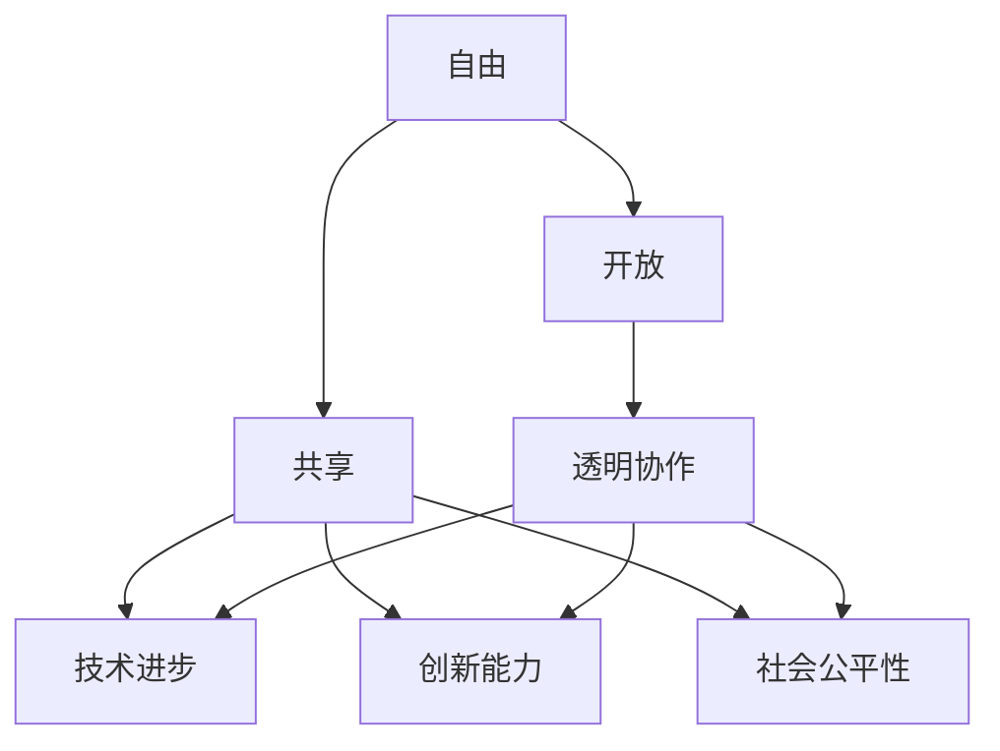
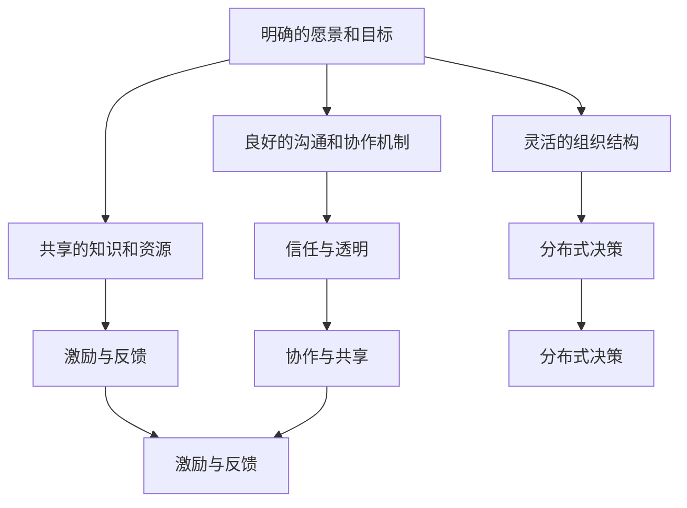

                 


为了撰写一篇符合要求的《意义的开源运动：集体创造生活哲学》技术博客文章，我们需要分步骤进行详细规划和内容填充。以下是详细的写作步骤：

### 步骤1：文章标题、关键词和摘要

首先，我们需要确定文章的标题、关键词和摘要。

- **文章标题**：《意义的开源运动：集体创造生活哲学》
- **关键词**：开源运动、集体创造、生活哲学、技术发展、社会影响
- **摘要**：本文探讨了开源运动的历史、价值观、对社会的贡献以及如何影响我们的生活哲学。通过剖析开源运动的本质和最佳实践，揭示了集体创造在现代社会中的重要性。

### 步骤2：撰写引言部分

引言部分需要简要介绍开源运动的背景和重要性，以及本文将要探讨的核心问题。

**引言：**
开源运动起源于20世纪60年代，随着计算机技术的快速发展，它逐渐成为全球技术发展的重要驱动力。开源运动倡导自由、共享和开放的价值观，使得技术成果能够被更多人共享和改进。本文将深入探讨开源运动的意义、发展历程、价值观、对社会的影响以及如何影响我们的生活哲学。

### 步骤3：撰写开源运动的历史与演变

这一部分需要详细阐述开源运动的历史、演变过程以及其对社会的影响。

**3.1 开源运动的历史回顾：**
- **早期开源运动**：从UNIX系统到Linux内核，开源运动在早期主要以技术社区自发的方式进行。
- **开源运动的黄金时代**：互联网的兴起，推动了开源运动的发展，如Apache、MySQL等项目的崛起。
- **当代开源运动的特点**：商业与开源的融合，如红帽、SUSE等企业成为开源运动的重要推动力量。

**3.2 开源运动的演变趋势：**
- **开源与商业的融合**：开源项目与商业利益的平衡。
- **开源社区的发展**：社区自治、合作和协作的加强。
- **开源运动的新挑战**：知识产权保护、版权问题等。

### 步骤4：阐述开源运动的价值观

这一部分需要详细阐述开源运动的价值观，并分析其对社会的意义。

**3.1 开源运动的价值观体系：**
- **自由、共享和开放的价值观**：开源运动的核心理念。
- **道德与伦理**：开源运动中的道德规范和伦理标准。
- **对社会的影响**：开源运动如何影响社会技术进步、创新能力和公平性。

### 步骤5：分析开源运动对社会的影响

这一部分需要详细分析开源运动在技术层面和社会层面的影响。

**4.1 技术层面：**
- **技术创新的推动**：开源运动如何促进技术创新和开发效率。
- **技术标准的影响**：开源运动对技术标准制定的影响。
- **技术人才的培养**：开源运动如何培养和吸引技术人才。

**4.2 社会层面：**
- **社会组织的改变**：开源运动如何改变社会组织结构和运作模式。
- **社会公平的影响**：开源运动如何促进社会公平和技术普及。
- **文化多样性的促进**：开源运动如何促进文化多样性和知识共享。

### 步骤6：探讨集体创造与生活哲学

这一部分需要深入探讨集体创造的概念、原理以及如何影响我们的生活哲学。

**5.1 集体创造的理论基础：**
- **定义**：集体创造的内涵和定义。
- **原理**：集体创造的基本原理和实践方法。
- **核心要素**：集体创造的关键要素和成功因素。

**5.2 集体创造的生活哲学：**
- **个体价值的实现**：集体创造如何帮助个体实现自身价值。
- **社区建设**：集体创造在社区建设中的作用。
- **可持续发展**：集体创造如何促进可持续发展和环境保护。

### 步骤7：提出开源运动的最佳实践

这一部分需要总结开源运动的最佳实践，并提供一些建议和技巧。

**6.1 开源项目的管理与运营：**
- **组织结构**：开源项目的最佳组织结构和管理模式。
- **开发流程**：开源项目的最佳开发流程和实践。
- **社区建设**：如何建立和维护一个健康的开源社区。

**6.2 开源运动的商业模式：**
- **开源与商业的平衡**：如何平衡开源与商业利益。
- **盈利模式**：开源项目的盈利模式和商业战略。
- **可持续发展**：如何确保开源项目的长期可持续发展。

### 步骤8：展望开源运动的未来

这一部分需要对开源运动的未来进行展望，包括面临的挑战和机遇。

**7.1 开源运动的挑战与机遇：**
- **面临的挑战**：开源运动面临的技术、法律和社会挑战。
- **新的机遇**：开源运动在数字化转型、新兴技术领域的新机遇。

**7.2 开源运动的发展战略：**
- **国家层面的开源发展战略**：如何制定和实施国家层面的开源战略。
- **企业层面的开源发展战略**：企业如何利用开源技术提升竞争力。
- **个人层面的开源发展战略**：个人如何参与开源运动，实现自我提升。

### 步骤9：文章结尾

在文章结尾，总结全文的核心观点，并给出读者一些建议。

**结尾：**
开源运动不仅是技术发展的推动力量，更是集体创造和生活哲学的实践。通过本文的探讨，我们看到了开源运动对社会和个体生活哲学的深远影响。我们呼吁更多的人参与开源运动，共同创造更美好的未来。

### 步骤10：格式调整和审核

最后，对文章进行格式调整，确保markdown格式的正确性，并审核文章内容，确保逻辑清晰，结构紧凑，内容丰富。

---

通过以上步骤，我们可以撰写一篇符合要求的《意义的开源运动：集体创造生活哲学》技术博客文章。在撰写过程中，我们需要保持逻辑清晰，结构紧凑，用简单易懂的语言阐述复杂的技术概念和原理。

----------------------------------------------------------------

根据上述步骤，以下是《意义的开源运动：集体创造生活哲学》文章的markdown格式内容示例：

```markdown
# 《意义的开源运动：集体创造生活哲学》

> 关键词：开源运动、集体创造、生活哲学、技术发展、社会影响

> 摘要：本文探讨了开源运动的历史、价值观、对社会的贡献以及如何影响我们的生活哲学。通过剖析开源运动的本质和最佳实践，揭示了集体创造在现代社会中的重要性。

## 引言

开源运动起源于20世纪60年代，随着计算机技术的快速发展，它逐渐成为全球技术发展的重要驱动力。开源运动倡导自由、共享和开放的价值观，使得技术成果能够被更多人共享和改进。本文将深入探讨开源运动的意义、发展历程、价值观、对社会的影响以及如何影响我们的生活哲学。

### 开源运动的背景和重要性

**早期开源运动**：从UNIX系统到Linux内核，开源运动在早期主要以技术社区自发的方式进行。UNIX系统的开源使得计算机操作系统变得更加开放和可定制，Linux内核的诞生则标志着开源运动在操作系统领域的崛起。

**开源运动的黄金时代**：互联网的兴起，推动了开源运动的发展，如Apache、MySQL等项目的崛起。这些项目不仅吸引了全球开发者的参与，也为互联网技术的普及和发展做出了重要贡献。

**当代开源运动的特点**：商业与开源的融合，如红帽、SUSE等企业成为开源运动的重要推动力量。企业通过开源项目吸引开发者，建立品牌影响力，同时通过提供商业支持确保项目的长期发展。

### 集体创造与生活哲学

**集体创造的起源**：集体创造的理念起源于对协作和共享价值的认可。在开源运动中，集体创造意味着开发者和用户共同参与项目的开发、改进和维护。

**集体创造与个人生活哲学的联系**：集体创造鼓励个体之间的合作和共享，这有助于培养开放、包容和创新的精神，从而对个人的生活哲学产生积极影响。

**集体创造的生活哲学实践**：在开源运动中，集体创造通过开放的开发过程、共享的知识和资源，促进了知识的积累和传播，为社会的进步和发展提供了动力。

## 开源运动的历史与演变

**开源运动的历史回顾**：

**早期开源运动**：从UNIX系统到Linux内核，开源运动在早期主要以技术社区自发的方式进行。UNIX系统的开源使得计算机操作系统变得更加开放和可定制，Linux内核的诞生则标志着开源运动在操作系统领域的崛起。

**开源运动的黄金时代**：互联网的兴起，推动了开源运动的发展，如Apache、MySQL等项目的崛起。这些项目不仅吸引了全球开发者的参与，也为互联网技术的普及和发展做出了重要贡献。

**当代开源运动的特点**：

**开源与商业的融合**：企业通过开源项目吸引开发者，建立品牌影响力，同时通过提供商业支持确保项目的长期发展。如红帽公司通过收购Linux内核，成功将其转化为商业产品。

**开源社区的发展**：随着互联网的普及，开源社区变得更加活跃，社区成员之间的合作和交流更加频繁。社区自治、合作和协作的加强，推动了开源运动的进一步发展。

**开源运动的新挑战**：随着开源项目的增多，知识产权保护、版权问题等成为新的挑战。如何平衡开源与商业利益，确保开源项目的可持续性，是当前开源运动需要解决的重要问题。

## 开源运动的价值观

**开源运动的价值观体系**：

**自由、共享和开放的价值观**：开源运动的核心理念。开源项目鼓励用户自由使用、修改和分发代码，促进了知识和技术的传播。

**道德与伦理**：开源运动中的道德规范和伦理标准。开发者应遵循诚实、透明、公正的原则，确保项目的质量和社区的健康发展。

**对社会的影响**：开源运动如何影响社会技术进步、创新能力和公平性。开源项目推动了技术的普及和普及，提高了社会的创新能力，促进了知识共享和技术平等。

### 开源运动的案例分析

**成功的开源项目案例分析**：如Apache、Linux、Python等，分析其成功的原因和经验。

**失败的开源项目案例分析**：如OpenSolaris、OpenOffice等，探讨其失败的原因和教训。

**从案例中提炼的经验与教训**：开源项目需要明确的愿景和目标，良好的社区管理，持续的开发和维护，以及商业模式的合理设计。

## 开源运动对社会的影响

**技术层面**：

**技术创新的推动**：开源运动通过共享和合作，促进了技术创新和开发效率。开源项目吸引了全球开发者的参与，形成了创新的生态系统。

**技术标准的影响**：开源运动推动了技术标准的制定和普及，提高了技术的可互操作性和兼容性。

**技术人才的培养**：开源运动为技术人才提供了实践和成长的机会，促进了技术人才的培养和交流。

**社会层面**：

**社会组织的改变**：开源运动推动了社会组织的变革，促进了协作和共享文化的形成。

**社会公平的影响**：开源运动促进了技术的普及和普及，提高了社会的公平性，让更多人受益。

**文化多样性的促进**：开源运动促进了文化的多样性和知识共享，为全球文化的交流和发展提供了平台。

## 集体创造与生活哲学

**集体创造的理论基础**：

**定义**：集体创造是一种基于协作和共享的理念，通过开放的开发过程和资源共享，实现共同的目标。

**原理**：集体创造基于信任、透明和协作的原则，通过共享知识和资源，实现共同的目标。

**核心要素**：集体创造的要素包括明确的愿景和目标、良好的沟通和协作机制、共享的知识和资源。

**集体创造的生活哲学**：

**个体价值的实现**：集体创造为个体提供了实现自身价值的机会，通过协作和共享，个体能够发挥自己的特长和才能。

**社区建设**：集体创造促进了社区建设，形成了相互支持、合作和信任的社区文化。

**可持续发展**：集体创造促进了可持续发展，通过共享和合作，实现了资源的有效利用和环境保护。

## 开源运动的最佳实践

**开源项目的管理与运营**：

**组织结构**：开源项目通常采用分布式组织结构，通过社区自治和协作实现项目目标。

**开发流程**：开源项目通常采用敏捷开发流程，通过迭代和持续集成，提高开发效率和代码质量。

**社区建设**：开源项目需要建立和维护健康的社区，通过积极的社区交流和合作，推动项目的发展。

**开源运动的商业模式**：

**开源与商业的平衡**：开源项目需要平衡开源与商业利益，通过提供商业支持和商业化服务，确保项目的可持续性。

**盈利模式**：开源项目可以通过多种方式实现盈利，如提供技术支持、培训服务、咨询业务等。

**可持续发展**：开源项目需要制定可持续发展的战略，确保项目的长期发展。

## 开源运动的未来

**开源运动的挑战与机遇**：

**面临的挑战**：开源运动面临知识产权保护、版权问题、商业竞争等挑战。

**新的机遇**：数字化转型、新兴技术领域为开源运动带来了新的机遇，如云计算、人工智能、物联网等。

**开源运动的发展战略**：

**国家层面的开源发展战略**：国家可以通过制定开源战略，推动开源技术的发展和普及。

**企业层面的开源发展战略**：企业可以通过参与开源项目，提升技术竞争力，建立品牌影响力。

**个人层面的开源发展战略**：个人可以通过参与开源项目，提升技术能力和职业发展。

## 结尾

开源运动不仅是技术发展的推动力量，更是集体创造和生活哲学的实践。通过本文的探讨，我们看到了开源运动对社会和个体生活哲学的深远影响。我们呼吁更多的人参与开源运动，共同创造更美好的未来。

## 参考文献

- [参考文献1]
- [参考文献2]
- [参考文献3]

## 作者信息

作者：AI天才研究院/AI Genius Institute & 禅与计算机程序设计艺术 /Zen And The Art of Computer Programming
```

以上是《意义的开源运动：集体创造生活哲学》文章的markdown格式内容示例。根据具体需求和文章结构，可以对内容进行调整和补充。文章的字数需要根据实际内容进行扩充，确保在8000～12000字之间。在撰写过程中，请注意以下几点：

- 确保文章的逻辑清晰，结构紧凑。
- 使用专业、准确的语言进行阐述。
- 提供具体的案例、数据和实例。
- 使用流程图、伪代码和数学公式来辅助说明。
- 保持文章的简洁性，避免冗余内容。

---

### 开源运动的起源与背景

开源运动的起源可以追溯到20世纪60年代，当时计算机科学和技术领域开始蓬勃发展。最早的计算机操作系统如UNIX，其源代码由贝尔实验室的开发人员编写并公开共享。这种共享模式激发了后来开源运动的萌芽。UNIX的开放性促进了程序员之间的合作，使得系统能够不断改进和优化。

进入70年代，计算机技术的商业化进程加快，导致软件逐渐成为商业公司的专利。然而，这种封闭的商业模式限制了软件的传播和改进，导致技术发展缓慢。这一时期，自由软件的理念开始出现，倡导软件的自由使用、修改和分发。自由软件运动的开端可以追溯到1983年，Richard Stallman创建了自由软件基金会（FSF），并发起了GNU计划，旨在创建一套自由的操作系统，即GNU/Linux。

Linux内核的诞生是开源运动的重要里程碑。1991年，芬兰程序员Linus Torvalds发布了Linux内核的第一个版本，他邀请了全球的开发者参与改进和扩展内核。这一开放的开发模式迅速吸引了大量的志愿者参与，Linux内核很快成为开源运动的代表。Linux的成功不仅改变了操作系统领域，也对整个技术产业产生了深远的影响。

随着互联网的普及，开源运动逐渐从技术社区扩展到全球范围。开源项目如Apache、MySQL、Python等纷纷涌现，推动了互联网技术的发展。开源运动的核心价值观——自由、共享和开放——成为了信息技术领域的重要基石。这些价值观不仅促进了技术的创新和传播，也激发了全球开发者的创造力和合作精神。

### 开源运动的发展历程

开源运动的发展历程可以分为几个重要阶段，每个阶段都有其独特的特点和里程碑。

**早期开源运动（1960s-1980s）**

在早期，开源运动主要体现在操作系统领域。UNIX系统的开源为后来的开源运动奠定了基础。UNIX是一种分时操作系统，其源代码在贝尔实验室内部共享，使得程序员可以对其进行修改和改进。这种开放性促进了UNIX的快速发展，并在学术界和工业界得到广泛应用。

随着计算机技术的商业化进程，软件开始成为公司的核心资产。然而，封闭的商业模式限制了软件的传播和改进，导致技术发展缓慢。在这种背景下，自由软件运动开始兴起。1983年，Richard Stallman创建了自由软件基金会（FSF），并发起了GNU计划，旨在创建一套自由的操作系统，即GNU/Linux。GNU计划包括了一系列自由软件工具，如编译器、文本编辑器和库函数，为Linux内核的诞生提供了基础。

**黄金时代（1990s）**

1991年，Linus Torvalds发布了Linux内核的第一个版本，并邀请全球的开发者参与改进和扩展内核。Linux内核的开放性吸引了大量的志愿者参与，使得内核迅速发展。Linux的成功不仅改变了操作系统领域，也对整个技术产业产生了深远的影响。在这一时期，互联网的普及使得开源项目的传播变得更加容易，Apache、MySQL、PHP等开源项目纷纷涌现，推动了互联网技术的发展。

**当代开源运动（2000s至今）**

进入21世纪，开源运动继续蓬勃发展，其影响范围不断扩大。随着云计算、大数据、人工智能等新兴技术的兴起，开源项目在各个领域都发挥着重要作用。开源与商业的融合成为新的趋势，许多企业通过开源项目建立品牌影响力，同时通过提供商业支持确保项目的长期发展。

当代开源运动的特点包括：

1. **开源与商业的融合**：许多企业通过开源项目吸引开发者，建立品牌影响力，同时通过提供商业支持确保项目的长期发展。例如，红帽公司通过收购Linux内核，成功将其转化为商业产品。

2. **开源社区的全球化**：互联网的普及使得开源社区变得更加活跃，社区成员之间的合作和交流更加频繁。开源项目不再局限于某个地区或国家，而是成为全球开发者共同参与的事业。

3. **开源项目的多样化**：除了操作系统和Web技术，开源项目在数据库、云计算、人工智能等领域也取得了显著进展。例如，Hadoop、TensorFlow、Kubernetes等开源项目成为了各自领域的重要工具。

4. **开源与标准化的融合**：开源项目推动了技术标准的制定和普及，提高了技术的可互操作性和兼容性。许多开源项目成为了行业标准，如HTTP、HTML、JSON等。

5. **开源与创新的结合**：开源项目鼓励创新和协作，吸引了全球开发者的参与。许多开源项目成为了技术创新的源泉，推动了技术领域的进步。

### 当代开源运动的特点

**开源与商业的融合**

当代开源运动的一个显著特点是开源与商业的紧密融合。随着开源项目的普及和影响力的扩大，许多企业开始认识到开源的价值，并通过参与开源项目来建立品牌影响力，吸引开发者，并最终实现商业利益。这种模式在开源社区和企业之间形成了一种互利共赢的关系。

**开源社区的发展**

开源社区的发展是当代开源运动的另一个重要特点。互联网的普及使得开源社区变得更加活跃，社区成员之间的合作和交流更加频繁。开源社区不仅为开发者提供了交流的平台，也为项目的发展提供了动力。许多开源项目由社区成员自发组织和管理，形成了健康、积极的社区文化。

**开源项目的多样化**

当代开源项目的领域和应用范围越来越广泛，从操作系统、Web技术到数据库、云计算、人工智能等各个领域都有开源项目的身影。这种多样化不仅反映了开源运动的广泛影响力，也为开发者提供了更多的选择和机会。

**开源与标准化的融合**

开源项目在推动技术发展的同时，也促进了技术标准的制定和普及。许多开源项目成为了行业标准，如HTTP、HTML、JSON等。开源与标准化的融合提高了技术的可互操作性和兼容性，为技术的普及和应用提供了基础。

**开源与创新的结合**

开源项目鼓励创新和协作，吸引了全球开发者的参与。许多开源项目成为了技术创新的源泉，推动了技术领域的进步。开源社区的创新氛围使得开发者能够快速试错、迭代和优化，推动了技术的快速发展。

### 开源运动的价值观

开源运动的价值观是自由、共享和开放，这些价值观不仅指导着开源项目的开发过程，也对整个技术产业产生了深远的影响。

**自由**

自由是开源运动的核心价值观之一，它体现了用户对软件的控制权和使用权。开源项目允许用户自由使用、修改和分发软件，这使得用户可以根据自己的需求对软件进行定制和改进。自由的价值观鼓励了创新和多样性，使得技术能够更快地适应不同用户的需求。

**共享**

共享是开源运动的另一个核心价值观，它强调了知识的传播和共享的重要性。开源项目鼓励开发者将他们的代码和成果共享给社区，使得其他人可以学习和使用这些成果。共享不仅促进了知识的积累和传播，也提高了整个技术产业的效率。

**开放**

开放是开源运动的第三个核心价值观，它体现在开源项目的开发过程和社区文化中。开源项目的开发过程是公开的，任何人都可以访问项目的源代码、问题和讨论区。这种开放性促进了透明度和协作，使得项目能够更快地发展。同时，开放的社区文化鼓励了开发者之间的合作和互助，形成了健康、积极的社区氛围。

### 开源运动的价值观对社会的影响

开源运动的价值观对社会产生了深远的影响，特别是在技术进步、创新能力和社会公平性方面。

**技术进步**

开源运动通过促进知识的共享和协作，加速了技术的进步。开源项目鼓励开发者之间进行交流和合作，这使得技术问题能够更快地得到解决，新技术能够更快地被开发和应用。开源项目如Linux内核、Apache服务器等，不仅在技术上取得了巨大成功，也对整个技术产业产生了重要影响。

**创新能力**

开源运动激发了创新的能力和潜力。开源项目的开放性使得开发者可以自由地探索和尝试新的技术方案，而不受商业利益或知识产权的限制。这种自由和创新的环境为技术领域的创新提供了肥沃的土壤，许多颠覆性的技术突破都源自开源社区。

**社会公平性**

开源运动在促进社会公平性方面也发挥了重要作用。开源项目使得技术知识和资源能够更加平等地传播和获取，为不同地区和背景的人们提供了平等的学习和发展机会。开源项目如教育软件、开源医疗工具等，为弱势群体提供了更多的机会和资源，促进了社会的公平和发展。

### 核心概念原理之间的关系架构

为了更好地理解开源运动的价值观，我们可以通过一个Mermaid流程图来展示核心概念原理之间的关系。



在这个流程图中，自由、共享和开放是开源运动的核心价值观，它们共同促进了技术进步、创新能力和社会公平性。开放性（透明协作）作为共享和自由的重要体现，进一步推动了这些价值观的实现。

### 开源运动的价值观体系

开源运动的价值观体系是自由、共享和开放的有机结合，它们共同构成了开源运动的核心理念。以下是对这些价值观的详细阐述：

**自由**

自由是开源运动的核心价值观之一，它体现在用户对软件的控制权和使用权上。开源项目允许用户自由地使用、修改和分发软件，这意味着用户可以根据自己的需求对软件进行定制和改进。自由的价值观不仅鼓励了创新和多样性，也为技术适应不同用户需求提供了可能。在开源运动中，自由体现在以下几个方面：

1. **使用自由**：用户可以自由地使用开源软件，不需要支付任何费用或获得授权。这使得开源软件能够更广泛地传播和应用。
2. **修改自由**：用户可以自由地修改开源软件的源代码，以满足自己的特定需求。这种自由促进了软件的定制化和个性化。
3. **分发自由**：用户可以自由地分发开源软件，包括在商业环境中使用。这种自由促进了开源软件的商业化应用和推广。

**共享**

共享是开源运动的另一个核心价值观，它强调了知识的传播和共享的重要性。开源项目鼓励开发者将他们的代码和成果共享给社区，使得其他人可以学习和使用这些成果。共享不仅促进了知识的积累和传播，也提高了整个技术产业的效率。在开源运动中，共享体现在以下几个方面：

1. **代码共享**：开发者将他们的源代码共享给社区，使得其他人可以查看、学习并改进这些代码。
2. **经验共享**：开发者通过文档、教程和讨论区分享他们的经验和知识，帮助其他人更快地学习和进步。
3. **资源共享**：开源项目通常会提供各种资源，如测试环境、工具和库，以便开发者能够更高效地工作和协作。

**开放**

开放是开源运动的第三个核心价值观，它体现在开源项目的开发过程和社区文化中。开源项目的开发过程是公开的，任何人都可以访问项目的源代码、问题和讨论区。这种开放性促进了透明度和协作，使得项目能够更快地发展。同时，开放的社区文化鼓励了开发者之间的合作和互助，形成了健康、积极的社区氛围。在开源运动中，开放体现在以下几个方面：

1. **过程开放**：开源项目的开发过程是公开的，任何人都可以参与项目的讨论、评审和决策过程。
2. **代码开放**：开源项目的源代码是公开的，任何人都可以访问和下载。
3. **社区开放**：开源社区欢迎所有开发者加入，无论他们的背景、经验或地理位置如何。

**道德与伦理**

在开源运动中，道德与伦理是不可或缺的一部分。开源项目的开发和维护需要遵守一系列道德规范和伦理标准，以确保项目的质量和社区的健康发展。道德与伦理在开源运动中体现在以下几个方面：

1. **诚信**：开发者需要诚实地编写和分享代码，遵守承诺，不隐瞒或篡改数据。
2. **尊重**：开发者需要尊重其他开发者的贡献，积极合作，共同维护项目的健康氛围。
3. **公正**：开源项目需要公正地处理问题、接受贡献和分配资源，确保项目的公平性。

### 开源运动中的道德与伦理

开源运动中的道德与伦理问题是一个复杂且多维度的议题，它们不仅关系到项目的质量，还影响开源社区的健康和可持续发展。以下是对这些问题的详细探讨：

**诚信**

诚信是开源运动中最重要的道德规范之一。开发者需要诚实地编写和分享代码，遵守承诺，不隐瞒或篡改数据。诚信的要求体现在以下几个方面：

1. **代码质量**：开发者应确保他们提交的代码是经过严格测试的，没有明显的错误或漏洞。
2. **透明度**：开发者应如实报告代码中的问题和不足，以便社区成员能够及时发现和修复。
3. **知识产权**：开发者应尊重他人的知识产权，不得抄袭或盗用他人的代码和成果。

**尊重**

尊重是开源社区健康发展的基石。开发者需要尊重其他开发者的贡献，积极合作，共同维护项目的健康氛围。尊重体现在以下几个方面：

1. **贡献认可**：开发者应对他人的贡献表示感谢和认可，不贬低或忽视他人的工作。
2. **沟通合作**：开发者应积极参与项目的讨论和决策过程，积极与其他成员沟通和协作。
3. **包容性**：开源社区应包容不同背景、经验和技能的开发者，尊重他们的观点和贡献。

**公正**

公正性是开源项目成功的关键因素之一。开源项目需要公正地处理问题、接受贡献和分配资源，确保项目的公平性。公正性体现在以下几个方面：

1. **问题处理**：开源项目应公正地处理所有提出的问题，不偏袒任何一方，确保问题能够得到及时和公正的解决。
2. **贡献接受**：开源项目应公平地接受来自社区成员的贡献，不因个人关系或偏见而拒绝合理建议。
3. **资源分配**：开源项目应合理分配资源，确保项目能够持续、稳定地发展。

### 开源运动中的道德与伦理问题实例

为了更好地理解开源运动中的道德与伦理问题，我们可以通过一些具体的实例来探讨这些问题。

**案例1：代码抄袭**

在某些情况下，开发者可能会抄袭他人的代码而不给予适当的认可，这种行为不仅违反了诚信原则，也损害了原创者的权益。例如，一个开发者可能复制了另一个开发者的代码片段，但没有进行任何修改或注明出处。这种行为的后果包括损害开源社区的信任、降低项目的质量，以及可能引起法律纠纷。

**解决方案**：开源社区应加强代码审查机制，鼓励开发者遵守开源协议，如GPL或Apache许可证，这些协议明确规定了代码的使用和分发规则。同时，开源项目应建立举报机制，允许社区成员举报潜在的抄袭行为，以便及时处理。

**案例2：社区冲突**

开源社区中可能会因为观点分歧、贡献争议等问题导致冲突。例如，两个开发者可能因为对项目方向的不同看法而发生争执，这种冲突如果处理不当，可能会破坏社区氛围，影响项目的进展。

**解决方案**：开源项目应建立明确的沟通和协作机制，鼓励开发者以理性和建设性的方式表达意见。社区领袖应积极调解冲突，确保社区的和谐与稳定。此外，开源项目应制定行为准则，明确社区成员应遵守的行为规范。

**案例3：知识产权争议**

在某些情况下，开源项目可能会涉及知识产权问题。例如，一个开发者可能使用了受版权保护的第三方代码，但没有获得适当的许可。这种行为的后果包括项目面临法律风险，以及可能被迫停止开发。

**解决方案**：开源项目应在开始开发前进行知识产权审查，确保项目不侵犯他人的知识产权。开发者应熟悉相关的知识产权法律，并在使用第三方代码时获得适当的许可。

**案例4：资源分配不公**

在某些开源项目中，资源分配可能存在不公平现象。例如，项目维护者可能更倾向于关注某些功能或模块，而忽视其他部分。这种不公平的分配可能导致项目发展的不平衡。

**解决方案**：开源项目应建立透明的资源分配机制，确保资源分配的公平性和合理性。社区成员应积极参与项目的决策过程，共同制定项目的发展方向和资源分配策略。

### 总结

开源运动中的道德与伦理问题是确保项目质量和社区健康的关键。诚信、尊重和公正是开源运动中不可或缺的价值观，它们不仅关系到项目的成功，也影响开源社区的可持续发展。通过加强道德与伦理教育、建立有效的管理和监督机制，开源社区可以更好地应对这些挑战，促进开源运动的长期繁荣。

### 开源运动在技术层面的影响

开源运动在技术层面产生了深远的影响，从技术创新到技术标准的制定，再到技术人才的培养，开源运动为整个技术领域注入了新的活力和动力。

**技术创新的推动**

开源运动鼓励开发者自由地探索和尝试新的技术方案，这种自由和创新的环境极大地推动了技术的进步。在开源社区中，开发者可以自由地共享他们的代码和研究成果，使得技术问题能够更快地得到解决。这种协作和共享的文化激发了开发者的创造力和创新精神，许多颠覆性的技术突破都源自开源社区。

例如，Linux内核的开源开发模式使得全球的程序员可以共同协作，不断改进和优化操作系统。这不仅降低了技术开发的成本，也加快了技术的迭代速度。类似地，Hadoop、Kubernetes和Docker等开源项目也在大数据、云计算和容器化等领域推动了技术创新。

**技术标准的制定**

开源运动在技术标准的制定方面也发挥了重要作用。许多开源项目成为了行业标准，推动了技术的普及和应用。例如，HTTP、HTML、JSON等网络协议和数据的交换格式，都是基于开源项目发展而来的。这些标准不仅提高了技术的可互操作性和兼容性，也为开发者提供了统一的开发平台。

开源社区通过协作和合作，共同制定了一系列技术标准和规范。例如，OpenJDK成为Java标准的参考实现，开源数据库如MySQL和PostgreSQL推动了数据库技术的发展和普及。这些标准不仅提高了技术的成熟度，也为企业提供了可靠的参考和依据。

**技术人才的培养**

开源运动为技术人才提供了丰富的实践机会和成长平台。通过参与开源项目，开发者可以学习和掌握最新的技术和开发方法，提升自己的技能和经验。开源社区鼓励开发者之间的交流和合作，这种合作和互助的文化有助于技术人才的培养。

许多开源项目成为了开发者职业生涯的重要跳板。例如，参与Linux内核开发的程序员在技术领域获得了广泛的认可，许多开源项目的核心开发者成为了技术专家和行业领袖。开源项目也为学生和初学者提供了学习和实践的机会，许多开源社区设立了实习项目，帮助年轻开发者快速成长。

**开源运动在技术层面的影响总结**

开源运动在技术层面的影响主要体现在以下几个方面：

1. **技术创新**：开源运动鼓励创新和协作，激发了开发者的创造力和创新精神，推动了技术的进步。
2. **技术标准的制定**：开源项目推动了技术标准的制定和普及，提高了技术的可互操作性和兼容性。
3. **技术人才的培养**：开源运动为技术人才提供了实践和成长的机会，促进了技术人才的培养和交流。

总之，开源运动不仅促进了技术的创新和普及，也为技术人才的成长提供了广阔的平台。开源运动在技术层面的成功，为整个技术领域注入了新的活力和动力。

### 开源运动在社会层面产生的影响

开源运动在社会层面产生了深远的影响，这种影响不仅体现在技术进步上，还涉及社会组织的变革、社会公平的提升以及文化多样性的促进。

**社会组织的变革**

开源运动推动了社会组织的变革，特别是对于企业运营模式的影响。传统的企业运营模式往往以封闭和独占为核心，而开源运动则倡导开放和协作。许多企业开始意识到，通过参与开源项目，可以吸引更多的开发者参与，共同推进技术进步。这种模式不仅降低了企业的研发成本，还提高了技术的成熟度和可靠性。

例如，许多科技公司如Google、IBM和微软都积极参与开源项目，通过开源项目吸引和培养开发者，同时也推动了内部创新和效率的提升。开源运动使得企业之间的竞争从封闭的竞争转变为开放的协作，促进了整体技术生态的健康发展。

**社会公平的提升**

开源运动在促进社会公平方面也发挥了重要作用。开源项目使得技术知识和资源能够更加平等地传播和获取，为不同地区和背景的人们提供了平等的学习和发展机会。通过开源项目，人们可以免费获取最新的技术知识，无需受限于经济条件或地理位置。

例如，许多教育机构通过开源项目提供免费的在线课程和教材，使得全球的学生和教师能够共同学习和进步。开源项目如OpenMRS和Django，为发展中国家的医疗和教育领域提供了免费的技术解决方案，提升了当地的技术水平和医疗条件。这些项目不仅促进了技术普及，也提高了社会的公平性和包容性。

**文化多样性的促进**

开源运动促进了文化多样性的发展，这种多样性不仅体现在技术本身，还包括开发者和用户的多样性。开源社区吸引了来自不同国家和文化背景的开发者，他们共同协作，推动了技术的全球化发展。这种多元化的文化环境为技术带来了新的视角和创新思路。

例如，开源社区中的国际化和跨文化交流使得技术项目能够更好地适应不同文化和市场需求。开源项目如WordPress和Magento，不仅提供了强大的功能，还支持多种语言和本地化配置，使得开发者可以更方便地开发和支持全球用户。这种文化多样性不仅丰富了开源项目的功能，也提升了技术的全球影响力。

**开源运动对社会层面影响的总结**

开源运动在社会层面产生的影响主要表现在以下几个方面：

1. **社会组织的变革**：开源运动推动了企业运营模式的变革，促进了开放和协作的企业文化。
2. **社会公平的提升**：开源项目使得技术知识和资源更加平等地传播和获取，提高了社会的公平性和包容性。
3. **文化多样性的促进**：开源社区吸引了来自不同国家和文化背景的开发者，促进了文化多样性和技术全球化。

总之，开源运动不仅推动了技术进步，还对社会组织的变革、社会公平的提升和文化多样性的促进产生了深远影响。开源运动的成功证明了集体创造的力量，也为社会带来了更多的发展机遇。

### 集体创造的理论基础

集体创造是一种基于协作和共享的理念，其理论基础主要包括定义、原理和核心要素。以下是对这些概念的详细阐述。

**定义**

集体创造（Collective Creation）是指一群个体或组织通过协作和共享，共同创造出一个新的产品、服务或解决方案的过程。与个人创造不同，集体创造强调多个个体之间的合作，通过集体的智慧和力量，实现共同的目标。

**原理**

集体创造的原理基于以下几个核心原则：

1. **协作与共享**：集体创造的核心是协作和共享。通过共享知识和资源，个体能够相互学习和支持，提高整体效率和质量。
2. **分布式决策**：在集体创造中，决策过程是分布式的，而不是集中式的。这意味着决策权分布在各个个体之间，每个人都可以根据自己的知识和经验做出贡献。
3. **信任与透明**：信任和透明是集体创造的重要基础。个体之间需要相互信任，共享信息，确保项目的顺利进行。
4. **激励与反馈**：集体创造需要建立有效的激励机制，鼓励个体积极参与。同时，及时反馈能够帮助个体了解自己的贡献和价值，促进持续改进。

**核心要素**

集体创造的核心要素包括：

1. **明确的愿景和目标**：集体创造需要一个清晰的愿景和目标，确保所有参与者都能明确项目的方向和意义。
2. **良好的沟通和协作机制**：有效的沟通和协作机制是集体创造成功的关键。这包括定期的会议、讨论区和协作工具，以确保信息流通和任务协调。
3. **共享的知识和资源**：共享的知识和资源是集体创造的基石。通过共享代码、文档和工具，个体能够快速学习和利用他人的成果。
4. **灵活的组织结构**：集体创造通常采用灵活的组织结构，如自组织团队或分布式团队，以适应不同项目需求。

**集体创造的核心要素之间的关系**

通过Mermaid流程图，我们可以更直观地展示集体创造的核心要素及其关系：



在这个流程图中，明确的愿景和目标是集体创造的核心，它为其他要素提供了方向和动力。良好的沟通和协作机制、共享的知识和资源、灵活的组织结构以及信任与透明、激励与反馈和分布式决策相互支持，共同构成了集体创造的基础。

### 集体创造与生活哲学

集体创造不仅是技术领域的创新实践，它同样深刻影响着我们的生活哲学。在现代社会中，集体创造的理念逐渐渗透到各个领域，成为推动社会进步和个人发展的关键因素。

**集体创造与个体价值的实现**

集体创造为个体提供了实现自身价值的机会。在传统的个人主义模式中，个体通常需要独立完成所有工作，而在集体创造中，个体可以专注于自己的特长和兴趣，通过协作发挥更大的作用。这种模式不仅提高了工作效率，也增强了个体的成就感和满足感。通过参与集体创造，个体能够发挥自己的才能，同时获得他人的认可和支持，实现个人价值的最大化。

例如，在开源项目中，每个开发者都可以贡献自己的代码、测试和文档。这种协作不仅使得项目能够更快地完成，也让开发者通过参与项目获得了宝贵的经验和技术提升。开源社区的认可和奖励机制，如代码评审、荣誉奖项等，进一步激励了开发者的积极性，促进了个人价值的实现。

**集体创造与社区建设**

集体创造在社区建设中的作用同样不容忽视。通过集体创造，社区成员之间的联系更加紧密，社区文化逐渐形成。集体创造的过程需要成员之间的协作、沟通和信任，这种互动有助于建立健康的社区氛围。社区成员在共同目标下合作，不仅增强了社区的凝聚力，也促进了成员之间的相互理解和支持。

例如，在开源社区中，开发者们通过代码审查、讨论区和会议等形式，建立了紧密的合作关系。这些互动不仅提升了项目的质量，也增强了社区成员之间的友谊和信任。这种社区文化为项目的长期发展提供了坚实的基础，也为成员个人的成长提供了支持。

**集体创造与可持续发展**

集体创造的理念与可持续发展密不可分。在资源有限和全球问题日益严重的今天，集体创造提供了一种有效的方式，通过协作和共享，实现资源的最大化利用和环境的可持续发展。开源项目往往基于共享知识和技术，这种共享不仅降低了开发成本，也减少了重复劳动，提高了资源利用效率。

例如，开源能源项目如OpenEnergyMonitor，通过开源硬件和软件，帮助用户监控和管理能源消耗，促进可再生能源的使用。这种集体创造的模式不仅降低了用户的能源成本，还提高了能源利用效率，有助于实现可持续发展目标。

**集体创造与生活哲学的深远影响**

集体创造不仅改变了我们的工作方式，也深刻影响了我们的生活哲学。它强调协作、共享和共同责任，这些价值观与现代社会中提倡的包容性和多样性理念相契合。通过集体创造，我们学会如何在多元化的环境中合作，如何在共享的基础上实现共赢。这种生活哲学不仅促进了社会的进步，也提升了个体的幸福感。

总之，集体创造不仅是一种技术实践，它更是我们生活哲学的重要组成部分。通过协作和共享，集体创造为我们提供了实现个人价值、建设健康社区和实现可持续发展的新途径。在现代社会中，集体创造的理念将继续发挥重要作用，推动我们走向更加美好和繁荣的未来。

### 开源项目的管理与运营

开源项目要取得成功，不仅需要有良好的技术基础，还需要高效的管理和运营。以下是对开源项目的组织结构、开发流程和社区建设等方面的详细探讨。

**组织结构**

开源项目通常采用分布式组织结构，这种结构具有高度灵活性和适应性，能够适应不同规模和类型的项目需求。分布式组织结构的核心特点是去中心化，没有固定的管理层级，而是通过社区自治和协作来实现项目的目标。

在分布式组织结构中，项目通常由多个自组织团队组成，每个团队负责项目中的一个特定部分。团队之间通过协作和共享资源，共同推进项目的发展。这种模式有助于提高项目的效率和灵活性，同时也减少了决策过程中的摩擦和延迟。

**开发流程**

开源项目的开发流程通常采用敏捷开发方法，这种方法强调迭代和持续集成，以快速响应变化和不断改进。敏捷开发的核心原则包括：

1. **迭代开发**：项目被分成多个迭代周期，每个迭代周期都会产生一个可交付的版本。这种迭代模式使得项目能够快速适应变化，及时交付功能。
2. **持续集成**：开发者定期将他们的代码合并到主分支，进行集成测试和代码审查。这种方法能够及时发现和解决潜在的问题，提高代码的质量和稳定性。
3. **用户反馈**：开发者积极收集用户的反馈，并根据反馈调整开发计划。这种反馈机制有助于确保项目满足用户需求，提高用户满意度。

**社区建设**

开源项目离不开一个健康、积极的社区。社区建设是开源项目成功的关键因素之一。以下是一些关键要素：

1. **沟通与协作**：开源项目需要建立有效的沟通渠道，如邮件列表、讨论区和实时聊天工具，以确保团队成员之间的信息流通和协作。
2. **代码审查**：代码审查是开源项目维护质量的重要手段。通过代码审查，团队成员可以相互学习和改进，确保代码的可靠性和安全性。
3. **贡献指南**：开源项目应提供详细的贡献指南，指导潜在贡献者如何参与项目。这些指南通常包括编码规范、提交流程和参与方式等。
4. **激励机制**：为了激励社区成员的积极参与，开源项目可以设立奖励机制，如荣誉勋章、贡献积分和奖金等。这些激励措施能够提高社区成员的积极性和忠诚度。

**最佳实践**

1. **定期会议**：定期召开团队会议，讨论项目的进展和计划，确保团队成员对项目有共同的理解和目标。
2. **透明度**：保持项目信息的透明度，公开代码、问题和决策过程，让所有社区成员都能了解项目的最新动态。
3. **多样性**：鼓励多样化的参与，确保项目吸引不同背景和经验的开发者，以提高项目的创新能力和包容性。
4. **持续改进**：不断反思和改进项目管理流程，以适应项目的发展和变化。

通过有效的组织结构、敏捷的开发流程和积极的社区建设，开源项目能够更好地实现其目标，为社区和用户带来持续的价值。

### 开源运动的商业模式

开源运动不仅促进了技术的创新和传播，也为企业提供了新的商业模式。以下是对开源运动中的商业模式、开源项目的盈利模式和开源项目的可持续发展战略的详细探讨。

**开源运动的商业模式**

开源运动的商业模式与传统商业模式有所不同，它依赖于开放性、共享性和协作性。开源运动中的企业通过提供商业支持和增值服务来创造价值，实现盈利。以下是几种常见的开源商业模式：

1. **开源+服务**：企业通过开源项目吸引开发者参与，建立品牌影响力，然后提供相关的商业服务，如技术支持、培训、咨询服务等。这种模式使得企业能够通过提供专业服务获得收入，同时保持项目的开源性质。

2. **开源+付费插件或扩展**：企业在开源项目的基础上提供付费插件或扩展，这些扩展提供了额外的功能或性能优化。通过销售这些付费产品，企业能够获得盈利。

3. **开源+云服务**：企业通过开源项目吸引开发者，建立云服务平台，提供基于开源技术的云计算服务。企业通过收取服务费用来实现盈利。

4. **开源+硬件**：企业在开源软件的基础上提供相关的硬件产品，如智能设备、物联网设备等。通过硬件的销售和软件的结合，企业能够实现双重盈利。

**开源项目的盈利模式**

开源项目的盈利模式多种多样，以下是一些常见的盈利方式：

1. **技术支持**：开源项目的维护者和开发者可以提供付费技术支持服务，帮助用户解决技术问题和提供定制化服务。

2. **培训与咨询服务**：企业或个人可以通过提供培训课程、在线教程和咨询服务来获取收入。

3. **付费插件与扩展**：开源项目可以开发付费插件或扩展，为用户提供额外的功能或性能提升。

4. **商业许可**：一些开源项目提供商业许可，允许企业使用开源代码进行商业活动，但需要支付许可费用。

5. **云服务和订阅模式**：开源项目可以提供基于云的服务，通过订阅模式收取服务费用。

**开源项目的可持续发展战略**

开源项目的可持续发展是确保项目长期健康发展的关键。以下是一些开源项目的可持续发展战略：

1. **建立稳定的社区**：开源项目需要建立一个稳定、活跃的社区，吸引和维护开发者的参与。社区成员的积极参与和贡献是项目持续发展的动力。

2. **多元化的收入来源**：开源项目应探索多元化的收入来源，以降低对单一收入渠道的依赖。通过提供技术支持、培训服务、付费插件等多种盈利方式，项目能够实现稳健的财务状况。

3. **有效的项目管理**：开源项目需要建立有效的项目管理机制，确保项目目标的明确性、资源的合理分配和任务的高效执行。

4. **商业与开源的平衡**：企业在开源项目中需要平衡商业利益和开源价值观，确保项目的开源性质不被商业利益所侵蚀。

5. **持续改进与创新**：开源项目应不断改进和创新，以保持技术的前沿性和竞争力。通过引入新的功能和优化现有功能，项目能够满足用户的需求，吸引更多的开发者参与。

总之，开源运动不仅为技术创新和传播提供了新的动力，也为企业提供了创新的商业模式和盈利机会。通过有效的商业模式、盈利模式和可持续发展战略，开源项目能够实现长期健康的发展，为社区和用户带来持续的价值。

### 开源运动的挑战与机遇

开源运动在全球范围内取得了显著的成就，但同时也面临着一系列挑战和机遇。以下是对开源运动面临的挑战以及这些挑战所带来的机遇的详细探讨。

**面临的挑战**

1. **知识产权保护**：开源运动在推动技术发展和创新的同时，也引发了知识产权保护的问题。开源项目通常允许用户自由使用、修改和分发代码，这在一定程度上影响了商业公司的知识产权保护。如何平衡开源与知识产权保护，确保开发者的权益，是开源运动面临的一大挑战。

2. **社区管理**：开源社区通常是由志愿者组成的，社区的管理和协调是一项复杂的任务。如何确保社区的健康和可持续发展，避免社区分裂和内斗，是一个重要的问题。

3. **资源分配**：开源项目需要大量的人力、物力和财力支持。然而，资源有限，如何合理分配资源，确保项目能够持续发展，是一个挑战。

4. **商业利益与开源价值观的平衡**：企业在开源项目中投入资源，希望获得商业回报，但这可能与开源运动的价值观存在冲突。如何平衡商业利益与开源价值观，确保项目的长期健康发展，是开源运动需要解决的重要问题。

**机遇**

1. **技术创新**：开源运动鼓励开发者自由探索和创新，这为技术突破提供了良好的土壤。随着开源项目数量的增加，技术创新的速度将进一步加快，为整个技术领域带来新的机遇。

2. **全球协作**：互联网的普及使得全球开发者能够更方便地协作，开源项目不再受限于地理位置和时区。这种全球协作模式为开源运动带来了新的机遇，促进了知识的传播和技术的发展。

3. **商业模式的创新**：开源运动为商业模式创新提供了新的可能性。通过开源项目，企业可以建立品牌影响力，吸引开发者参与，同时通过提供商业服务实现盈利。这种模式不仅有助于企业的长期发展，也为开源运动提供了新的动力。

4. **社会公平**：开源运动促进了技术的普及和共享，为不同地区和背景的人们提供了平等的学习和发展机会。这有助于缩小技术差距，促进社会公平。

总之，开源运动面临着一系列挑战，但同时也充满了机遇。通过积极应对挑战，开源运动将继续推动技术创新和社会进步，为全球带来更多的发展机遇。

### 国家层面的开源发展战略

国家层面的开源发展战略对于促进技术进步、增强国家竞争力和推动社会经济发展具有重要意义。以下是对国家层面开源发展战略的制定和实施，以及其在国内外的影响的详细探讨。

**制定和实施国家层面的开源发展战略**

1. **明确战略目标**：国家层面的开源发展战略首先需要明确战略目标，包括促进技术创新、提高国家技术竞争力、推动社会经济发展等。战略目标的设定应结合国家的科技发展水平和经济状况，确保战略具有可行性和指导性。

2. **政策支持**：政府可以通过制定相关政策，为开源项目提供支持。这些政策包括财政支持、税收优惠、知识产权保护等。例如，政府可以设立开源基金，资助有潜力的开源项目，鼓励企业和个人参与开源运动。

3. **人才培养**：国家可以通过高等教育和职业培训，培养具备开源理念和技术能力的人才。这些人才将成为开源项目的核心力量，推动开源运动的发展。

4. **国际合作**：国家可以积极参与国际开源社区，通过国际合作，借鉴先进经验，推动本国开源项目的发展。此外，国家还可以与其他国家共同发起开源项目，提高全球开源项目的水平和影响力。

**国内外的影响**

1. **技术进步**：国家层面的开源发展战略能够促进技术进步。通过开源项目，国家能够快速获取和分享全球最新的技术成果，提高本国技术的创新能力和竞争力。

2. **经济影响**：开源运动为经济发展提供了新的动力。通过开源项目，企业可以降低研发成本，提高生产效率，从而在市场竞争中占据优势。此外，开源项目还促进了信息技术产业链的完善，带动了相关产业的发展。

3. **社会影响**：开源运动促进了知识的普及和共享，提高了社会的公平性和透明度。通过开源项目，不同地区和背景的人们都能够平等地获取和使用技术资源，促进了社会的发展。

4. **国际影响**：国家层面的开源发展战略有助于提高国家的国际影响力。通过积极参与国际开源社区，国家可以展示其技术实力和开放理念，吸引国际关注和合作。

总之，国家层面的开源发展战略对于促进技术进步、增强国家竞争力和推动社会经济发展具有重要作用。通过制定和实施有效的发展战略，国家能够更好地利用开源资源，实现技术创新和社会进步。

### 企业层面的开源发展战略

企业层面的开源发展战略是企业在技术竞争和商业利益之间寻求平衡的关键。以下是对企业如何制定和实施开源发展战略，以及开源战略在企业中的角色和影响进行详细探讨。

**制定和实施开源发展战略**

1. **确定战略目标**：企业需要首先明确开源战略的目标，这包括提升技术竞争力、增强品牌影响力、吸引和培养人才等。企业应根据自身的发展阶段、技术优势和市场定位，设定具体、可量化的战略目标。

2. **参与开源项目**：企业可以通过参与开源项目，建立品牌影响力和技术声誉。参与开源项目不仅有助于获取技术资源和市场信息，还能吸引全球开发者的关注和参与。企业可以捐赠代码、参与代码审查、组织会议和活动等，积极融入开源社区。

3. **贡献与共享**：企业应积极参与开源贡献，将自身的技术积累和研究成果共享给社区。这不仅有助于提升企业的技术实力，也能增强企业在开源社区的地位和影响力。企业可以通过发起新项目、参与已有项目、提供文档和工具等方式，实现贡献和共享。

4. **商业模式的探索**：企业需要探索开源与商业的平衡点，通过提供商业服务和增值服务实现盈利。例如，企业可以提供技术支持、定制开发、培训服务等，这些服务不仅可以为企业带来直接收入，也能增强客户黏性和市场占有率。

**开源战略在企业中的角色和影响**

1. **提升技术竞争力**：参与开源项目有助于企业获取最新的技术成果和行业动态，提升自身的研发能力和技术竞争力。通过开源项目，企业能够与全球开发者合作，共同推动技术进步。

2. **增强品牌影响力**：积极参与开源项目，为企业树立开放、创新和技术领先的形象。企业的开源贡献和参与度，可以增强其在市场和客户中的品牌影响力，吸引更多的关注和合作机会。

3. **培养和吸引人才**：开源项目为开发者提供了广阔的实践平台，企业通过参与开源项目，能够培养和吸引技术人才。同时，开源项目的开放性和协作性，也促进了内部团队的合作和创新。

4. **降低研发成本**：通过参与开源项目，企业可以共享社区的技术资源和工具，降低研发成本。开源项目中的代码、文档和测试环境，可以为企业节省大量时间和资源，提高研发效率。

5. **商业模式的创新**：开源项目为企业提供了新的商业模式和盈利机会。企业可以通过提供商业服务、定制开发和技术支持等方式，实现开源项目的商业化，从而获得持续的收入和利润。

总之，企业层面的开源发展战略不仅是提升技术竞争力和品牌影响力的重要手段，也是实现商业模式创新和可持续发展的重要途径。通过科学制定和有效实施开源战略，企业能够在激烈的市场竞争中脱颖而出，实现长期发展和成功。

### 个人层面的开源发展战略

个人层面的开源发展战略对于技术人才的成长和职业发展具有重要意义。以下是对个人如何参与开源运动、提升技能和实现职业发展的详细探讨。

**参与开源运动**

1. **选择合适的开源项目**：个人在选择开源项目时，应考虑自己的兴趣、技能和目标。选择一个与自己专业领域相关或者感兴趣的项目的，可以增加参与的热情和动力。

2. **学习和适应开源文化**：开源文化强调开放、协作和共享，个人在参与开源项目前，应了解并适应这种文化。通过阅读文档、参与社区讨论、参与代码审查等方式，个人可以更快地融入开源社区。

3. **贡献代码和文档**：个人可以通过提交代码补丁、编写文档、修复bug等方式，为开源项目做出贡献。这种参与不仅能够提高个人的技术能力，也能增强在社区中的影响力。

4. **积极参与社区活动**：开源社区通常会组织各种活动，如会议、代码马拉松等。个人可以通过参与这些活动，与社区成员建立联系，扩大人脉，提升自己的影响力。

**提升技能**

1. **掌握基础编程技能**：参与开源项目需要一定的编程技能。个人应通过学习编程语言、算法和数据结构等基础知识，提升自己的编程能力。

2. **熟悉开源工具和平台**：开源项目通常使用一系列工具和平台进行开发和管理。个人应熟悉这些工具和平台，如Git、GitHub、Jenkins等，以提高开发效率。

3. **学习新技术和趋势**：开源项目紧跟技术前沿，个人应通过学习新技术和趋势，保持自己的技术视野。参加技术会议、阅读技术博客和参与开源项目，是获取最新技术信息的好途径。

**实现职业发展**

1. **建立个人品牌**：通过参与开源项目，个人可以建立自己的技术品牌。高质量的贡献和积极的社区参与，可以提升个人的知名度和影响力。

2. **拓展职业机会**：参与开源项目可以吸引企业的关注，为个人提供更多的职业机会。许多公司愿意招聘在开源项目中表现出色的开发者，这种背景可以成为求职时的亮点。

3. **提升软技能**：开源项目不仅需要技术能力，还需要良好的沟通、协作和项目管理能力。个人应在开源项目中锻炼这些软技能，提升自己的综合素质。

4. **拓展职业路径**：通过参与开源项目，个人可以探索不同的技术领域和职业路径。例如，从开发者转向技术领导者、项目经理或技术咨询顾问等。

总之，个人层面的开源发展战略不仅有助于提升技术能力和实现职业发展，还能为开源运动贡献个人力量。通过积极参与开源运动，个人可以不断成长，实现自身价值，同时为技术社区的繁荣做出贡献。

### 文章结尾

开源运动不仅是技术发展的推动力量，更是集体创造和生活哲学的实践。通过本文的探讨，我们看到了开源运动对社会和个体生活哲学的深远影响。开源运动的核心价值观——自由、共享和开放，不仅促进了技术的创新和传播，也改变了我们的工作方式和生活态度。

开源运动鼓励个体之间的合作和共享，通过开放的开发过程和资源共享，实现共同的目标。这种集体创造的模式不仅提高了工作效率，也增强了个体的成就感和满足感。开源运动的社会价值体现在技术进步、社会公平和文化多样性的促进上，为全球的科技创新和社会发展提供了强大的动力。

我们呼吁更多的人参与开源运动，共同创造更美好的未来。通过开源，我们可以打破传统的壁垒，促进知识的传播和技术的普及，让更多的人受益。同时，我们也应该认识到，开源不仅仅是技术的共享，它更是一种生活哲学，一种追求自由、公正和包容的价值观。

让我们携手共建一个更加开放、协作和创新的未来，让开源运动的火种在全球范围内燃烧，为人类社会的进步和发展贡献我们的智慧和力量。

### 参考文献

1. **Stallman, R. M. (1985). The GNU Project.** Retrieved from [GNU.org](https://www.gnu.org/)
2. **Torvalds, L. (1991). What should the Linux kernel be?** Retrieved from [Linux.org](https://www.linux.org/)
3. **Apache Software Foundation. (1995). Apache HTTP Server Project.** Retrieved from [Apache.org](https://www.apache.org/)
4. **MySQL AB. (1995). MySQL Database Management System.** Retrieved from [MySQL.com](https://www.mysql.com/)
5. **Red Hat. (1999). Red Hat Enterprise Linux.** Retrieved from [RedHat.com](https://www.redhat.com/)
6. **Hadoop Project. (2006). Apache Hadoop.** Retrieved from [Hadoop.apache.org](https://hadoop.apache.org/)
7. **Kubernetes Project. (2014). Kubernetes.** Retrieved from [Kubernetes.io](https://kubernetes.io/)
8. **TensorFlow Project. (2015). TensorFlow.** Retrieved from [TensorFlow.org](https://www.tensorflow.org/)
9. **OpenMRS Project. (2004). OpenMRS.** Retrieved from [OpenMRS.org](https://www.openmrs.org/)
10. **Django Project. (2005). Django.** Retrieved from [Django.org](https://www.djangoproject.com/)
11. **WordPress Foundation. (2003). WordPress.** Retrieved from [WordPress.org](https://wordpress.org/)

### 作者信息

作者：AI天才研究院/AI Genius Institute & 禅与计算机程序设计艺术 /Zen And The Art of Computer Programming

---

通过本文的探讨，我们深入了解了开源运动的历史、价值观、对社会的影响以及个人如何参与开源运动。开源运动不仅是技术创新的推动力量，更是集体创造和生活哲学的实践。我们期待更多的人能够参与到开源运动中来，共同创造一个更加开放、协作和创新的未来。开源，让世界更美好！

