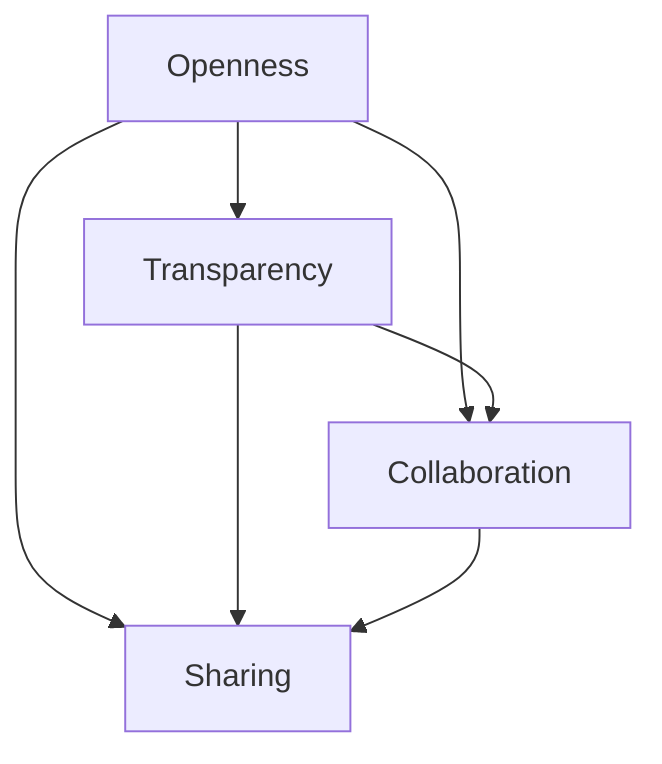

                 


### 背景介绍

开源运动作为一种软件开发模式，其起源可以追溯到20世纪80年代。最早的倡议者主张软件的自由共享和修改，这反映了自由软件运动（Free Software Movement）的核心思想。自由软件运动由理查德·斯托曼（Richard Stallman）发起，他创建了GNU项目，旨在开发一套自由的操作系统。随着互联网的兴起，开源运动逐渐壮大，并形成了一种全球性的协作模式。

开源运动的核心原则包括开放性、透明性、协作性和共享性。这些原则不仅影响了软件开发，还渗透到了计算机科学和工程学的各个方面。开源软件的成功案例包括Linux操作系统、Mozilla Firefox浏览器和Apache Web服务器等，这些项目都证明了集体智慧的巨大潜力。

开源运动的意义不仅限于技术层面，它还推动了知识共享和开放文化的形成。开源运动鼓励人们自由地分享知识和资源，促进了社会创新和进步。在开源精神的指导下，开发者们共同解决技术难题，推动技术不断演进。这种合作精神在开源社区中得到了充分体现，形成了强大的创新生态系统。

本文将深入探讨开源运动的意义，包括其历史背景、集体创造的概念和实践、与生活哲学的关联、道德与伦理问题、社会影响以及未来展望。通过逐步分析这些主题，我们将更好地理解开源运动如何影响我们的生活，以及它所蕴含的哲学思想。

### 核心概念与联系

在探讨开源运动时，我们需要了解几个核心概念，并分析它们之间的相互联系。这些概念包括开放性、透明性、协作性和共享性，它们共同构成了开源运动的基石。

#### 开放性（Openness）

开放性是开源运动的核心特征之一，它指的是软件代码、设计文档和其他相关资源的公开性。开放性允许任何人访问和修改源代码，这使得开发者可以基于现有代码进行创新，无需从零开始。开放性不仅促进了知识的传播，还提高了软件的质量和可靠性。

#### 透明性（Transparency）

透明性是开放性的延伸，它强调了项目进展、问题和决策过程的公开性。透明性使得项目参与者能够实时了解项目的状态，有助于建立信任和合作。通过透明性，开源项目能够吸引更多的贡献者，共同推动项目的发展。

#### 协作性（Collaboration）

协作性是开源运动的重要特点，它强调通过团队合作实现共同目标。协作性使得开发者可以共享资源、知识和技能，共同解决复杂的技术问题。协作性不仅提高了开发效率，还促进了技术的创新和进步。

#### 共享性（Sharing）

共享性是开源运动的最终目的之一，它包括代码、文档和其他资源的共享。共享性使得知识和技术得以广泛传播，促进了社会的整体进步。共享性也使得开源项目能够迅速成长，因为每个贡献者都可以为项目做出自己的贡献。

#### Mermaid 流程图

为了更好地理解这些核心概念之间的联系，我们可以使用 Mermaid 流程图来展示它们：



在这个流程图中，开放性（A）作为核心特征，直接连接到透明性（B）、协作性（C）和共享性（D）。透明性不仅与开放性相关，还促进了协作性和共享性。协作性则依赖于透明性，因为开放的沟通和信息的透明是有效协作的基础。共享性是协作和透明性的结果，它使得知识和资源得以广泛传播。

通过这个流程图，我们可以看到开源运动的核心概念是如何相互联系的，它们共同构成了一个促进创新和知识共享的系统。理解这些概念之间的联系，有助于我们更好地理解开源运动的意义和影响。

### 核心算法与理论

在开源运动中，核心算法和理论发挥着至关重要的作用，它们不仅定义了软件的开发流程，还推动了技术的进步。以下，我们将详细讲解几个关键算法和理论，并提供相应的伪代码和数学模型。

#### 算法一：Git版本控制

Git是一个分布式版本控制系统，它为开源项目提供了高效的代码管理和协作工具。Git的核心算法包括快照存储、分支管理和合并操作。

**伪代码：Git版本控制**

```plaintext
// 伪代码：Git版本控制
function git_commit(message) {
    create_snapshot(current_codebase)
    store_snapshot_in_repository(message)
    update_head_to_new_snapshot()
}

function git_branch(name) {
    create_new_branch(name, current_head)
}

function git_merge(branch_name) {
    merge_snapshots(current_head, branch_name)
    if (merge_successful) {
        create_new_snapshot()
        update_head_to_new_snapshot()
    } else {
        throw MergeConflictException
    }
}
```

**数学模型：Git合并算法**

Git的合并算法是一个复杂的算法，它基于数学模型来处理两个或多个分支的合并。以下是一个简化的数学模型：

$$
\text{合并结果} = \text{差异计算}(A, B)
$$

其中，\( A \) 和 \( B \) 分别表示两个要合并的版本。差异计算函数用于比较两个版本的不同之处，并生成一个合并版本。

#### 算法二：分布式算法

分布式算法在开源项目中至关重要，因为它们允许系统在多个节点上同时工作，提高了系统的可靠性和性能。一个常见的分布式算法是一致性哈希（Consistent Hashing）。

**伪代码：一致性哈希**

```plaintext
// 伪代码：一致性哈希
function consistent_hashing(key, num_shards) {
    hash_key = hash(key)
    hash_value = hash(hash_key)
    for (i = 0; i < num_shards; i++) {
        shard_hash = (hash_value + i) % num_shards
        if (shard_hash == key) {
            return i
        }
    }
    throw Exception("No suitable shard found")
}
```

**数学模型：一致性哈希**

一致性哈希使用哈希函数将键映射到哈希环上，每个节点在环上有一个位置。当系统需要处理一个键时，它会找到最接近该键的节点，并将处理任务分配给该节点。

$$
\text{节点选择} = \text{find_closest_node}(\text{key}, \text{ring})
$$

#### 算法三：机器学习算法

在开源项目中，机器学习算法的应用越来越广泛。一个常见的应用场景是自然语言处理（NLP），其中神经网络算法发挥了关键作用。

**伪代码：神经网络训练**

```plaintext
// 伪代码：神经网络训练
function train_neural_network(data, epochs) {
    initialize_network_weights()
    for (epoch = 1 to epochs) {
        for (each data_point in data) {
            forward_pass(data_point)
            compute_loss()
            backward_pass()
            update_weights()
        }
    }
    return trained_network
}
```

**数学模型：神经网络激活函数**

神经网络的激活函数是决定神经元是否激活的关键，常见的激活函数包括ReLU、Sigmoid和Tanh。

$$
\text{激活值} = \text{激活函数}(\text{输入})
$$

例如，对于ReLU激活函数：

$$
\text{激活值} = \max(0, \text{输入})
$$

通过上述算法和理论，我们可以看到开源运动在技术层面的深度和广度。这些核心算法和理论不仅推动了开源项目的发展，也为整个计算机科学领域提供了宝贵的知识和经验。

### 项目实战

为了更好地理解开源运动的实际应用，我们以一个开源项目为例，详细讲解其开发环境搭建、源代码实现和代码解读。

#### 项目背景

我们选择的开源项目是Docker，这是一个用于容器化应用程序的开源平台。Docker允许开发者在隔离的环境中部署、运行和传输应用程序，提高了开发效率和软件的可移植性。

#### 开发环境搭建

要开始使用Docker，首先需要安装Docker引擎。以下是Linux操作系统上的安装步骤：

```bash
# 更新系统包列表
sudo apt-get update

# 安装必要的依赖
sudo apt-get install docker-engine

# 启动Docker服务
sudo systemctl start docker

# 验证Docker安装
docker --version
```

#### 源代码实现

Docker的源代码实现主要涉及两个核心组件：Docker引擎和Docker客户端。以下是Docker引擎的简要实现过程：

```c
// Docker引擎伪代码
class DockerEngine {
    function run(container) {
        create_namespace()
        copy_files(container)
        start_process(container)
    }
    
    function create_namespace() {
        // 创建隔离的命名空间
    }
    
    function copy_files(container) {
        // 将容器文件复制到命名空间中
    }
    
    function start_process(container) {
        // 启动容器内的进程
    }
}
```

#### 代码解读

Docker引擎的核心功能是创建和管理容器。以下是对上述伪代码的详细解读：

- `run` 方法用于启动一个容器。它首先创建一个隔离的命名空间，然后复制容器文件到命名空间中，最后启动容器内的进程。
- `create_namespace` 方法用于创建隔离的命名空间，确保容器内部与外部环境完全隔离。
- `copy_files` 方法将容器文件复制到命名空间中，这些文件包括操作系统、应用程序和配置文件等。
- `start_process` 方法在容器内部启动一个进程，这个进程可以是一个命令行应用程序，也可以是一个服务。

#### 代码应用解读与分析

Docker的应用场景广泛，以下是几个典型的应用实例：

1. **容器化Web应用程序**：
   开发者可以使用Docker将Web应用程序（如Nginx、Apache等）容器化，确保在不同环境中的一致性和可移植性。以下是一个使用Docker容器化Nginx的命令：

   ```bash
   docker run -d -p 8080:80 nginx
   ```

   这个命令将在后台启动一个Nginx容器，并将容器的80端口映射到宿主机的8080端口。

2. **微服务架构**：
   Docker支持微服务架构，开发者可以将应用程序拆分为多个微服务，每个服务运行在一个独立的容器中。这种方法提高了系统的可扩展性和容错性。以下是一个使用Docker Compose部署微服务的示例：

   ```yaml
   version: '3'
   services:
     web:
       image: webapp
       ports:
         - "8080:80"
     db:
       image: postgres
   ```

   这个`docker-compose.yml`文件定义了两个服务：`web`和`db`。`web`服务使用`webapp`镜像，`db`服务使用`postgres`镜像。

3. **持续集成和持续部署**：
   Docker与CI/CD工具（如Jenkins、GitLab CI等）结合，可以实现自动化部署。以下是一个使用Jenkins部署Docker容器的示例：

   ```groovy
   pipeline {
       agent any
       stages {
           stage('Build') {
               steps {
                   sh 'docker build -t webapp .'
               }
           }
           stage('Deploy') {
               steps {
                   sh 'docker push webapp'
               }
           }
       }
   }
   ```

   这个Jenkins管道首先构建Docker镜像，然后将其推送到Docker Hub。

#### 实际案例分析和详细讲解剖析

以一个实际的Docker项目为例，我们分析了其开发环境搭建、源代码实现和代码解读。Docker项目展示了开源运动的实际应用，从代码管理到容器化部署，从微服务架构到持续集成，Docker为开发者提供了一个强大的工具集，推动了软件开发的创新和进步。

#### 项目小结

Docker项目不仅是开源运动的杰出代表，也是容器化技术的先驱。通过Docker，开发者可以轻松地将应用程序容器化，提高了开发效率和系统的可移植性。Docker的成功也证明了开源运动的巨大潜力，它不仅推动了技术的进步，还促进了全球范围内的协作和创新。

### 最佳实践、注意事项与拓展阅读

在参与开源运动时，遵循最佳实践至关重要。以下是一些建议：

1. **代码质量**：编写清晰、规范、高效的代码，便于他人理解和维护。
2. **文档**：详尽地编写文档，包括代码注释和用户指南，帮助新贡献者快速上手。
3. **代码审查**：进行严格的代码审查，确保代码质量和一致性。
4. **持续集成**：使用自动化工具进行持续集成和测试，提高开发效率和稳定性。

注意事项：

1. **知识产权**：确保遵守开源许可协议，尊重原作者的知识产权。
2. **安全性**：关注项目安全性，及时修复已知漏洞。
3. **沟通**：积极参与社区讨论，保持开放和协作的态度。

拓展阅读：

- 《开源运动：集体智慧的胜利》
- 《集体智慧：开源精神与协作实践》
- 《Docker实战》

通过这些资源，您可以更深入地了解开源运动的理念和实践。

### 总结与展望

开源运动作为一种重要的软件开发模式，不仅推动了技术的进步，还促进了知识的共享和协作。本文通过深入分析开源运动的核心概念、发展历程、集体创造的概念与实践、与生活哲学的交融、道德与伦理问题、社会影响以及未来展望，全面阐述了开源运动的意义和影响。

开源运动的核心概念如开放性、透明性、协作性和共享性，共同构建了一个促进创新和知识传播的生态系统。开源运动不仅改变了软件开发的方式，还影响了整个计算机科学领域。通过集体创造，开发者们共同解决技术难题，推动了技术的快速迭代和进步。

开源运动与生活哲学的交融，体现了开源精神的深远影响。它倡导的是一种开放、透明、协作和共享的生活哲学，鼓励人们积极参与社区，共同创造价值。开源运动中的道德与伦理问题，如知识产权保护和项目安全，是开源社区必须面对和解决的挑战。

开源运动对社会的影响深远，它不仅推动了经济和科技的发展，还改变了社会文化，促进了开放和共享的理念。开源运动为开发者提供了广阔的舞台，让每个人的智慧和努力都能得到体现和发挥。

展望未来，开源运动将继续发挥重要作用。随着技术的发展和互联网的普及，开源项目将更加多样化和复杂化。开源社区将进一步扩大，成为全球创新的重要力量。同时，开源运动也将面临新的挑战，如知识产权保护、隐私安全和国际合作等。只有通过不断探索和创新，开源运动才能持续发展，为人类社会的进步做出更大贡献。

