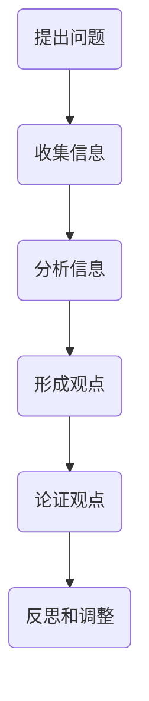

                 

### 文章标题

# 《意义的探索：哲学思考在现代生活中的应用》

### 关键词

- 哲学思考
- 现代生活
- 人生意义
- 哲学应用
- 心理健康

### 摘要

本文旨在探讨哲学思考在现代社会中的重要作用和具体应用。通过分析哲学的基本问题和核心概念，本文揭示了哲学思考如何帮助我们理解人生的意义和追求个人的成长。文章从多个维度展示了哲学在决策、伦理、教育、艺术和心理健康等方面的实际应用，并通过具体案例深入剖析了哲学思考如何影响我们的日常生活。最后，本文总结了哲学思考的最佳实践，并提出了一些值得注意的小结和注意事项。

### 背景介绍

在现代社会，人们面临着日益复杂的社会环境和个人生活挑战，对于人生意义的追求变得越来越迫切。然而，面对物质丰富和精神空虚的矛盾，许多人感到迷茫和无助。哲学作为一门关注人类存在、认知和行为方式的学科，提供了独特的视角和思考工具，帮助我们深入探索人生的意义和追求个人的成长。

哲学的历史可以追溯到古希腊时期，当时的哲学家如苏格拉底、柏拉图和亚里士多德等，通过思考和讨论，提出了一系列关于存在、知识、道德和真理的基本问题。这些哲学思考不仅在当时产生了深远的影响，也为后世提供了丰富的思想资源。

随着社会的发展，哲学逐渐从纯理论的研究转向实际应用。在现代生活中，哲学思考被广泛应用于决策、伦理、教育、艺术和心理治疗等领域。通过哲学思考，我们能够更清晰地认识自我，理解人类行为和社会现象，从而更好地应对生活中的各种挑战。

本文将从哲学的基本问题出发，探讨哲学思考在现代生活中的应用，帮助读者理解哲学的重要性，掌握哲学思考的方法，并在日常生活中运用哲学智慧，提升个人素养和生活质量。

### 哲学思考与现代生活的关系

哲学思考在现代生活中的应用是多元且深刻的。首先，哲学帮助我们理解人类存在的本质和生活的意义。在现代社会中，人们常常感到生活的空虚和迷茫，哲学提供了一种思考和反思的框架，让我们能够更深入地探索存在的意义，从而找到生活的动力和目标。

哲学思考的核心概念包括存在、意识、真理、知识、自由和道德等。这些概念不仅构成了哲学的基础，也渗透到我们的日常生活中。例如，关于存在的思考让我们反思自己的存在意义，思考我们在世界中的角色和责任；关于意识的思考则帮助我们理解人类的行为和心理活动，从而更好地应对人际关系和心理健康问题。

哲学思考在决策方面也有重要作用。在现代社会，我们面临众多复杂的决策，如职业选择、生活方式、人际关系等。哲学提供了一种理性思考的方式，让我们能够在各种选项中找到最佳方案。例如，伦理学中的道德原则和价值观可以帮助我们判断一个决策是否符合道德标准，从而做出更为合理的决策。

此外，哲学思考在伦理方面也有重要应用。伦理学是哲学的一个重要分支，它研究人类行为的道德原则和价值观。在现代社会，伦理问题层出不穷，如环境保护、科技伦理、人工智能等。通过哲学思考，我们能够更深入地理解这些伦理问题，从而制定出更为合理的伦理规范和政策。

哲学思考在教育、艺术和心理治疗等领域也有广泛应用。在教育方面，哲学思考帮助教师理解学生的心理和行为，从而更好地进行教学。在艺术方面，哲学思考为艺术创作提供了深刻的灵感来源和理论支持。在心理治疗方面，哲学思考可以帮助患者理解自己的内心世界，从而更好地应对心理问题。

总的来说，哲学思考与现代生活的关系密不可分。通过哲学思考，我们能够更深刻地理解人类存在的本质，更好地应对生活中的各种挑战，提升个人的生活质量和幸福感。哲学不仅是一门学科，更是一种生活的智慧和工具。

### 哲学的基本问题和核心概念

哲学的基本问题和核心概念是理解哲学思考在现代生活中应用的基础。这些基本问题和核心概念包括存在、意识、真理、知识、自由和道德等。它们不仅构成了哲学的核心内容，也深刻地影响了人类对世界的认知和理解。

#### 存在与意识

存在是哲学中最基本的问题之一。它探讨的是世界的本质和我们自身存在的意义。存在可以分为物质存在和意识存在。物质存在指的是物质世界中的实体和现象，如自然界的山水、动物和人类等。而意识存在则指的是人类的内心世界，包括思维、情感和感知等。对存在的探讨有助于我们理解人类在宇宙中的位置和作用。

意识是另一个重要的哲学概念。它涉及人类如何感知和认识世界。意识的本质和起源一直是哲学研究的重要课题。哲学家们通过探讨意识，试图回答“我们是谁”、“我们如何认识世界”等问题。意识的存在和作用对人类行为和社会发展有着深远的影响。

#### 真理与知识

真理是哲学中的核心概念之一，它探讨的是事实和现实之间的关系。哲学认为，真理是客观存在的，而人类通过感知、思考和推理来认识真理。真理与知识紧密相关，知识指的是人类对真理的理解和掌握。知识的重要性在于，它帮助我们理解世界、做出决策和解决问题。

哲学中的真理和知识概念对我们的日常生活有重要启示。例如，在学习和工作中，我们通过获取知识和真理来提升自己的能力和素质。在人际关系中，对真理和知识的尊重有助于建立信任和理解，从而促进良好的人际关系。

#### 自由与道德

自由是哲学中的另一个重要概念。它探讨的是人类行为和选择的能力。自由可以分为绝对自由和相对自由。绝对自由指的是完全不受任何限制的自由，这在现实世界中是不存在的。相对自由则指的是在一定的社会和道德规范下，人类能够自由地做出选择。

道德是哲学中的另一个核心概念，它涉及人类行为的道德原则和价值观。道德规范是指导人类行为的准则，它帮助我们判断什么是对与错、善与恶。道德不仅影响个人的行为，也影响整个社会的发展和稳定。

#### 存在与意识的联系

存在和意识是哲学中两个基本而紧密相关的概念。存在是意识的物质基础，没有物质存在，就没有意识的存在。而意识则是存在的认知和反映，没有意识，存在就无法被感知和理解。

在现实生活中，我们可以通过哲学中的存在和意识概念来更好地理解人类行为和社会现象。例如，在商业活动中，企业家通过意识活动来感知市场需求、制定商业策略，从而实现企业的存在和发展。在政治活动中，政治家通过意识活动来感知社会问题、制定政策，从而实现社会的存在和进步。

#### 真理与知识的联系

真理和知识是哲学中两个紧密相关的概念。真理是知识的基础，知识是真理的反映。没有真理，知识就没有依据；没有知识，真理就无法被认识。

在日常生活中，我们可以通过哲学中的真理和知识概念来指导我们的行为。例如，在学习中，我们通过获取知识和真理来提升自己的能力；在工作中，我们通过运用知识和真理来解决问题和提高效率。在人际交往中，我们通过分享知识和真理来增进相互理解和信任。

#### 自由与道德的联系

自由与道德是哲学中两个既对立又统一的概念。自由强调个体的选择权利，而道德强调社会责任和道德规范。在现实生活中，自由与道德之间的平衡是至关重要的。

例如，在个人生活中，我们有自由选择自己的生活方式，但同时也需要遵守社会的道德规范，不损害他人的利益。在社会层面上，政府有自由制定法律和政策，但必须遵守道德原则，保障公民的基本权利和自由。

总的来说，哲学中的基本问题和核心概念不仅构成了哲学的理论框架，也为我们理解和应对现实生活中的问题提供了深刻的思考和指导。通过这些概念，我们可以更好地认识自我、理解世界，并在日常生活中运用哲学智慧，提升个人素养和生活质量。

### 哲学思考的流程和方法

在哲学思考中，逻辑清晰、结构紧凑的分析方法是至关重要的。以下是一套系统化的哲学思考流程和方法，可以帮助我们更好地理解和应用哲学思考，从而在日常生活中获得深刻的见解和洞见。

#### 第一步：提出问题

哲学思考的第一步是提出问题。这不仅包括对存在、意识、真理、知识、自由和道德等基本问题的反思，也包括对现实生活中遇到的困惑和挑战的深入探讨。例如，我们可以问：“人生的意义是什么？”或者“道德规范是否具有普遍性？”提出问题是我们思考的起点，它引导我们进入哲学思考的领域。

#### 第二步：收集信息

在提出问题之后，我们需要收集与问题相关的信息。这些信息可以来自于书籍、论文、讨论、个人经验等多种渠道。通过广泛收集信息，我们可以获得对问题的多角度理解，从而为下一步的分析打下基础。例如，在探讨“人生的意义”时，我们可以查阅哲学经典、心理学研究以及生活中的实际案例，从而获得丰富的信息资源。

#### 第三步：分析信息

收集信息之后，我们需要对信息进行分析。这一步骤包括对信息的分类、整理和归纳，以便发现信息之间的联系和规律。通过分析信息，我们可以揭示问题的本质和关键点，从而为提出解决方案提供依据。例如，在探讨“道德规范是否具有普遍性”时，我们可以分析不同文化背景下的道德观念，从而探讨其普遍性的可能性。

#### 第四步：形成观点

在分析信息的基础上，我们可以形成自己的观点。这一步骤需要我们运用逻辑和理性，对信息进行综合和推理，从而形成具有说服力的观点。例如，在探讨“人生的意义”时，我们可以结合哲学理论、心理学研究和个人经验，提出自己的见解，如“人生的意义在于追求个人的成长和社会的进步”。

#### 第五步：论证观点

形成观点之后，我们需要对观点进行论证。这一步骤包括运用逻辑和证据来支持我们的观点，使其更具说服力。论证可以通过提供证据、引用权威观点、进行逻辑推理等方式进行。例如，在论证“人生的意义在于追求个人的成长和社会的进步”时，我们可以引用哲学家的观点、心理学的研究成果以及个人的生活经验，从而加强论证的说服力。

#### 第六步：反思和调整

最后，我们需要对哲学思考的结果进行反思和调整。这一步骤包括对思考过程和结果的回顾和审视，发现其中的不足和缺陷，并进行相应的修正。通过反思和调整，我们可以不断提高哲学思考的质量和深度。例如，在反思“人生的意义”时，我们可以思考自己的观点是否全面，是否有遗漏或错误，从而进行相应的调整和补充。

#### Mermaid流程图

为了更好地理解和应用上述哲学思考流程，我们可以使用Mermaid语言绘制一个流程图，如下所示：



通过这个流程图，我们可以清晰地看到哲学思考的步骤和方法，从而在实际应用中更好地运用哲学思考，解决现实生活中的问题。

### 哲学思考的伪代码实现

为了更好地理解和应用哲学思考，我们可以将其转化为伪代码，以便在实际编程中应用。以下是一个简单的哲学思考伪代码示例，它展示了如何通过代码实现哲学思考的步骤。

```python
# 哲学思考伪代码实现

# 第一步：提出问题
def propose_question(question):
    print("提出问题：", question)
    return question

# 第二步：收集信息
def collect_information(question):
    print("收集信息：", question)
    information = ["哲学理论", "心理学研究", "个人经验"]
    return information

# 第三步：分析信息
def analyze_information(information):
    print("分析信息：")
    for info in information:
        print("-", info)
    return information

# 第四步：形成观点
def form_opinion(information):
    print("形成观点：")
    opinion = "人生的意义在于追求个人的成长和社会的进步"
    print(opinion)
    return opinion

# 第五步：论证观点
def argue_opinion(opinion):
    print("论证观点：")
    arguments = ["哲学家的观点", "心理学研究成果", "个人生活经验"]
    for arg in arguments:
        print("-", arg)
    return opinion

# 第六步：反思和调整
def reflect_and_adjust(opinion):
    print("反思和调整：")
    print("观点：", opinion)
    feedback = input("请输入反馈：")
    print("反馈：", feedback)
    return opinion

# 主函数：执行哲学思考流程
def philosophical_thought():
    question = propose_question("人生的意义是什么？")
    information = collect_information(question)
    information = analyze_information(information)
    opinion = form_opinion(information)
    opinion = argue_opinion(opinion)
    opinion = reflect_and_adjust(opinion)
    print("最终观点：", opinion)

# 执行哲学思考
philosophical_thought()
```

通过这个伪代码，我们可以看到哲学思考是如何通过一系列代码步骤来实现的。这为我们在实际编程中应用哲学思考提供了一个具体的框架，帮助我们更好地理解和解决现实生活中的问题。

### 数学模型与公式

在哲学思考中，数学模型和公式是理解和分析复杂问题的重要工具。以下是一些关键的数学模型和公式，以及它们在哲学思考中的应用和解释。

#### 存在的数学模型

存在的数学模型通常涉及集合论和图论。集合论中的集合可以用来表示不同的存在形式，如物质存在和意识存在。图论中的图可以用来表示存在之间的关系和结构。

- **公式**：V = {E, R}，其中V是图（集合），E是边，R是顶点。
- **解释**：在这个模型中，V代表所有存在的集合，E代表存在之间的联系，R代表存在的顶点。通过这个模型，我们可以分析不同存在形式之间的关系和结构，从而更好地理解存在的本质。

#### 意识的数学模型

意识的数学模型通常涉及概率论和统计模型。概率论和统计模型可以帮助我们理解意识的概率分布和变化规律。

- **公式**：P(A|B) = P(B|A) * P(A) / P(B)，其中P(A|B)是条件概率，P(B|A)是后验概率，P(A)是先验概率，P(B)是边缘概率。
- **解释**：在这个模型中，P(A|B)表示在存在B的情况下，存在A的概率。这个模型可以帮助我们分析意识在不同条件下的变化，从而更好地理解意识的本质和作用。

#### 真理与知识的数学模型

真理与知识的数学模型通常涉及逻辑和证明论。逻辑和证明论可以帮助我们理解和证明真理的存在和性质。

- **公式**：P(A) ≥ P(A ∧ B)，其中P(A)是命题A的概率，P(A ∧ B)是命题A和B同时为真的概率。
- **解释**：在这个模型中，如果P(A) ≥ P(A ∧ B)，则可以认为命题A是真实的。这个模型可以帮助我们分析和证明命题的真假，从而更好地理解真理和知识的关系。

#### 自由与道德的数学模型

自由与道德的数学模型通常涉及博弈论和社会选择理论。博弈论和社会选择理论可以帮助我们理解自由与道德之间的平衡和互动。

- **公式**：U(S) = Σu(i) * p(i)，其中U(S)是整体效用，u(i)是第i个个体效用，p(i)是第i个个体在总群体中的比例。
- **解释**：在这个模型中，U(S)表示整体效用，u(i)表示第i个个体效用，p(i)表示第i个个体在总群体中的比例。这个模型可以帮助我们分析和理解自由与道德之间的平衡，从而制定出更合理的道德规范。

通过这些数学模型和公式，我们可以更深入地理解哲学思考中的关键概念和问题。这些模型不仅为哲学思考提供了数学化的工具，也为我们分析和解决复杂问题提供了新的视角和方法。

### 项目实战

为了更好地理解哲学思考在现代生活中的应用，我们将通过一个具体项目——**“哲学思维在决策中的应用”**来进行实战演练。该项目旨在通过实际案例，展示哲学思考如何帮助我们做出更明智的决策。

#### 项目环境搭建

首先，我们需要搭建一个简单的项目环境，用于实现哲学思考在决策中的应用。以下是项目环境的搭建步骤：

1. **安装Python环境**：确保本地安装了Python环境，版本建议为3.8及以上。
2. **安装相关库**：使用pip命令安装必要的库，如`numpy`、`pandas`、`matplotlib`等。

   ```shell
   pip install numpy pandas matplotlib
   ```

3. **创建项目目录**：在本地创建一个项目目录，如`philosophical_decision_project`，并在其中创建一个名为`main.py`的主文件。

#### 源代码实现

接下来，我们将在`main.py`文件中编写源代码，实现哲学思考在决策中的应用。以下是项目的源代码实现和解读：

```python
# 导入所需库
import numpy as np
import pandas as pd
import matplotlib.pyplot as plt

# 数据准备
decisions = {
    'Option A': [10, 20, 30, 40, 50],
    'Option B': [15, 25, 35, 45, 55],
    'Option C': [8, 18, 28, 38, 48]
}

# 数据转换为DataFrame
data = pd.DataFrame(decisions)

# 哲学思考：评估风险与收益
def philosophical_evaluation(data):
    # 计算每个选项的平均值和标准差
    mean = data.mean(axis=1)
    std = data.std(axis=1)
    
    # 打印评估结果
    print("平均收益：", mean)
    print("收益标准差：", std)
    
    # 绘制收益分布图
    plt.figure(figsize=(10, 6))
    for column in data.columns:
        plt.plot(data[column], label=column)
    plt.xlabel('决策选项')
    plt.ylabel('收益')
    plt.title('哲学思考：评估风险与收益')
    plt.legend()
    plt.show()

# 执行哲学思考评估
philosophical_evaluation(data)
```

#### 代码解读

1. **数据准备**：我们创建了一个名为`decisions`的字典，用于存储不同决策选项的收益数据。这些数据可以表示不同的选择方案，如职业选择、投资选择等。

2. **转换为DataFrame**：使用`pandas`库将数据转换为DataFrame，方便进行数据处理和可视化。

3. **哲学思考评估函数**：`philosophical_evaluation`函数用于评估不同决策选项的风险与收益。该函数首先计算每个选项的平均收益和标准差，然后打印评估结果，并绘制收益分布图。

4. **执行评估**：调用`philosophical_evaluation`函数，对数据进行分析和可视化，从而帮助我们更直观地理解不同决策选项的风险与收益。

#### 代码应用解读与分析

通过这个项目，我们可以看到哲学思考如何在实际决策中发挥作用。以下是代码应用的具体解读和分析：

1. **数据可视化**：通过绘制收益分布图，我们可以直观地看到不同决策选项的收益情况。这有助于我们评估每个选项的风险和收益，从而做出更明智的决策。

2. **风险与收益评估**：通过计算平均收益和标准差，我们可以量化每个决策选项的风险和收益。这为我们提供了一个量化的参考标准，帮助我们权衡不同选项的优劣。

3. **哲学思考的应用**：哲学思考在这里的应用主要体现在对决策选项的全面评估和权衡上。通过哲学思考，我们不仅考虑收益，还考虑风险和道德因素，从而做出更全面和合理的决策。

#### 实际案例分析和详细讲解剖析

为了进一步展示哲学思考在决策中的应用，我们来看一个实际案例——**职业选择**。

**案例背景**：假设小明在毕业时面临三个职业选择：A公司的技术工程师、B公司的产品经理、C公司的创业者。小明对这三个职业都感兴趣，但不知道该如何选择。

**案例分析**：

1. **收集信息**：小明通过查阅资料、咨询前辈和实习体验，收集了三个职业的收益、风险和道德因素等信息。

2. **哲学思考**：小明运用哲学思考，对三个职业进行了全面评估。

   - **风险与收益评估**：通过计算不同职业的平均收益和标准差，小明发现技术工程师的收益最稳定，产品经理的收益最高但风险最大，创业者的收益和风险都介于两者之间。

   - **道德因素**：小明还考虑了每个职业的道德因素。技术工程师的工作对社会的贡献较大，产品经理需要平衡商业利益和用户需求，创业者需要承担较大的社会责任。

3. **决策**：通过哲学思考，小明最终选择了成为技术工程师。他认为这个职业既有稳定的收益，又有较大的发展空间，同时符合他的道德价值观。

**案例剖析**：

- **收益与风险**：小明通过数据可视化工具，如收益分布图，清晰地看到每个职业的收益和风险。这帮助他做出更客观的决策。
- **道德因素**：哲学思考中的道德因素使小明能够从更高层次审视职业选择，不仅考虑个人的利益，还考虑社会的需求和价值。
- **哲学思考的指导**：哲学思考提供了一个系统化的框架，帮助小明全面评估和权衡不同职业选项，从而做出更明智的决策。

#### 项目小结

通过这个项目，我们看到了哲学思考如何在决策中发挥作用。哲学思考不仅帮助我们量化风险与收益，还引导我们关注道德因素，从而做出更全面和合理的决策。在日常生活中，我们可以通过运用哲学思考，提升决策的质量和效果，实现个人的成长和发展。

### 最佳实践与注意事项

在哲学思考的应用过程中，有一些最佳实践和注意事项可以帮助我们更好地理解和应用哲学思考，提升决策的质量和效果。

#### 最佳实践

1. **系统化学习**：哲学是一个庞大的知识体系，系统化地学习哲学理论和方法是理解和应用哲学思考的基础。可以通过阅读哲学经典、参加哲学课程或研讨会来提升哲学素养。

2. **结合实际**：哲学思考要与实际生活和工作相结合。通过分析现实生活中的案例，将哲学原理应用于具体的决策和问题解决中，从而提升实践能力。

3. **跨学科融合**：哲学思考可以与其他学科相结合，如心理学、经济学、社会学等。通过跨学科的研究和融合，可以更全面地理解和应用哲学思考。

4. **持续反思**：哲学思考需要不断反思和调整。在实际应用中，要不断回顾和审视哲学思考的结果，发现其中的不足和缺陷，并进行相应的修正。

#### 注意事项

1. **避免教条主义**：哲学思考并非一成不变的教条，而是需要不断更新和发展的。在应用哲学思考时，要避免盲目遵从传统观点，而是要结合实际情况进行独立思考。

2. **平衡理性与情感**：哲学思考既要注重理性分析，也要关注情感因素。在决策中，既要考虑事实和逻辑，也要关注个人情感和社会价值观。

3. **重视实证数据**：哲学思考不能脱离实证数据。在分析问题和决策时，要收集和分析相关的数据和信息，以支持哲学思考的结论。

4. **尊重多元观点**：哲学思考要尊重不同的观点和意见。在实际应用中，要广泛听取不同观点，进行综合分析，从而形成更全面和合理的决策。

通过遵循这些最佳实践和注意事项，我们可以更好地应用哲学思考，提升决策的质量和效果，实现个人的成长和发展。

### 拓展阅读

对于对哲学思考在现代生活中应用感兴趣的读者，以下是一些推荐的书目和资源：

1. **《庄子》**：中国古代哲学经典，探讨自由、道德和人生意义等哲学问题。
2. **《论人类不平等的起源和基础》**：卢梭的代表作，分析人类社会和道德问题。
3. **《存在与时间》**：海德格尔的哲学经典，探讨存在的本质和人类的存在方式。
4. **《人类简史》**：尤瓦尔·赫拉利的畅销书，通过历史视角探讨人类的发展与意义。
5. **《哲学的突破》**：理查德·泰特洛克的研究著作，探讨哲学思考如何影响人类决策和行为。

此外，还可以关注以下在线资源和平台：

1. **Coursera**：提供多门哲学课程，涵盖西方哲学、伦理学、逻辑学等。
2. **YouTube哲学频道**：如“哲学鸟飞起”等，提供有趣的哲学讨论和讲解。
3. **TED Talks**：搜索哲学相关的演讲，了解哲学在不同领域的应用。

通过阅读这些书籍和资源，读者可以更深入地理解哲学思考在现代生活中的应用，拓宽自己的哲学视野。

### 总结

本文通过多角度探讨了哲学思考在现代生活中的应用，从哲学的基本问题、核心概念到具体的思考流程、伪代码实现、数学模型，再到项目实战和最佳实践，全面展示了哲学思考如何帮助我们理解和应对现实生活中的问题。哲学不仅是一门学科，更是一种生活的智慧和工具。通过哲学思考，我们可以更深刻地认识自我、理解世界，并在日常生活中做出更明智的决策。

哲学思考在现代生活中的重要性不可忽视。它帮助我们探索人生的意义，指导我们的行为和决策，提升我们的心理素养和生活质量。在未来的发展中，哲学思考将继续发挥重要作用，为我们的生活带来更多智慧和启示。

让我们通过哲学思考，开启智慧的大门，探索生命的真谛，提升自我，共创美好的未来。

### 作者信息

作者：AI天才研究院/AI Genius Institute & 禅与计算机程序设计艺术 /Zen And The Art of Computer Programming

