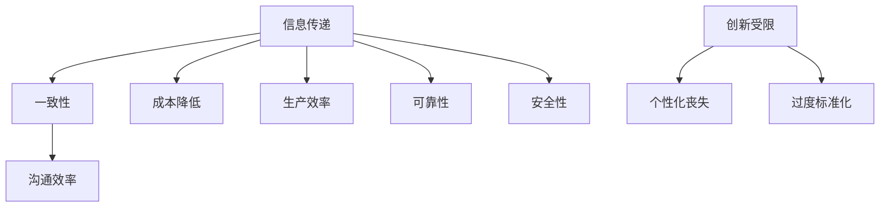
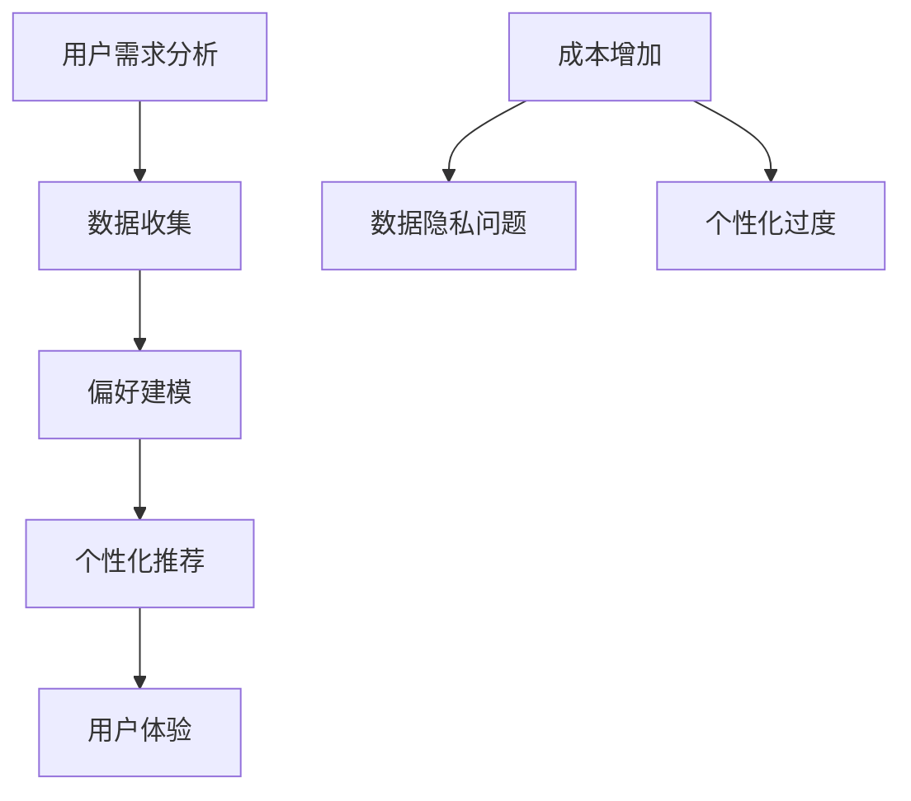

                 


### 《意义的标准化与个性化的平衡》

> 关键词：标准化、个性化、意义、平衡、IT领域

> 摘要：本文旨在探讨在IT领域中，如何平衡标准化与个性化之间的关系，以实现意义的最大化。通过分析标准化与个性化在各个领域的应用，以及它们对意义的影响，本文提出了一套平衡策略，并提供了实际案例进行分析，为未来的发展提供参考。

---

### 第一部分：引言

#### 1.1 书籍背景

在现代社会，信息爆炸和技术进步使得我们面临着一个意义危机。为了解决这一危机，我们需要在标准化与个性化之间寻找一个平衡点。标准化能够带来一致性、效率和安全，而个性化则满足了人们对多样性和独特性的需求。然而，两者之间的冲突常常使得意义难以最大化。

本书旨在探讨如何在IT领域中实现标准化与个性化的平衡，从而提高意义的表达和获取。这不仅有助于提高企业和组织的效率，也能更好地满足用户的需求，提升用户体验。

#### 1.2 标准化与个性化的定义

标准化是指通过制定和实施统一的标准来规范产品、服务或过程的行为。它确保了产品质量的一致性，提高了生产效率，降低了成本，并增强了市场的互操作性。

个性化则是指根据用户的特定需求和偏好来定制产品、服务或体验。它提升了用户体验，增强了用户满意度，但同时也增加了成本和复杂性。

#### 1.3 标准化与个性化之间的关系

标准化与个性化并非相互排斥，而是相互补充的。在许多情况下，标准化为个性化提供了基础。例如，在软件开发中，标准化编程语言和框架为个性化开发提供了工具和平台。同时，个性化也可以推动标准化的发展，因为用户的需求和偏好可以反馈到标准的制定过程中。

### 第二部分：意义的标准化

#### 2.1 标准化对意义的影响

标准化对意义的影响是多方面的。首先，它确保了信息的准确传递和一致理解，从而提高了沟通效率。其次，标准化降低了成本，提高了生产效率，这直接提升了企业的竞争力。此外，标准化还增强了产品的可靠性和安全性，这对于用户来说具有重要意义。

然而，标准化也存在缺点。过于严格的标准化可能导致创新受限，失去个性化优势。此外，标准化也可能导致过度标准化，使得一些本应具有独特性的产品和服务变得同质化。

#### 2.2 标准化的核心概念与联系

标准化的核心概念包括一致性、效率、可靠性和安全性。这些概念相互关联，共同构成了标准化的基础。

- **一致性**：确保产品、服务或过程在不同时间和地点都能保持相同的性能和功能。
- **效率**：通过减少冗余和提高生产速度来降低成本。
- **可靠性**：确保产品或服务能够稳定运行，满足用户需求。
- **安全性**：保护用户数据和隐私，防止安全威胁。

#### 2.2.3 标准化与意义的 Mermaid 流程图



#### 2.3 标准化的核心算法原理讲解

标准化的核心算法主要包括数据清洗、数据标准化和模型训练等步骤。

- **数据清洗**：去除噪声数据和异常值，确保数据质量。
- **数据标准化**：将数据转换为统一格式，以便分析和处理。
- **模型训练**：使用机器学习算法训练模型，以预测和分类数据。

以下是标准化的伪代码示例：

```python
# 数据清洗
def clean_data(data):
    # 删除噪声数据
    clean_data = [d for d in data if is_valid(d)]
    # 填补缺失值
    clean_data = [fill_missing_values(d) for d in clean_data]
    return clean_data

# 数据标准化
def standardize_data(data):
    # 计算均值和标准差
    mean = sum(data) / len(data)
    std = sqrt(sum((d - mean)^2 for d in data) / len(data))
    # 标准化数据
    standardized_data = [(d - mean) / std for d in data]
    return standardized_data

# 模型训练
def train_model(data):
    # 使用机器学习算法训练模型
    model = train(data)
    return model
```

#### 2.4 标准化在各个领域的具体应用

标准化在农业、工业和信息产业中具有广泛的应用。

- **农业**：标准化确保了农产品的质量和安全性，提高了农产品的市场竞争力。
- **工业**：标准化提高了生产效率，降低了生产成本，促进了工业化进程。
- **信息产业**：标准化确保了数据和信息的一致性，提高了信息处理和传输的效率。

### 第三部分：个性化与意义的平衡

#### 3.1 个性化对意义的影响

个性化能够满足用户对独特性和定制化的需求，从而提升用户体验。它使产品和服务更具吸引力，能够更好地满足用户的个性化需求。然而，个性化也带来了一些挑战，如成本增加、数据隐私问题和个性化过度等问题。

#### 3.2 个性化的核心概念与联系

个性化的核心概念包括用户需求分析、数据收集、偏好建模和个性化推荐等。

- **用户需求分析**：了解用户的需求和偏好，是实施个性化服务的基础。
- **数据收集**：收集用户行为数据，用于分析和建模。
- **偏好建模**：使用机器学习算法建立用户偏好模型，预测用户行为。
- **个性化推荐**：根据用户偏好模型推荐符合用户需求的产品或服务。

#### 3.2.3 个性化与意义的 Mermaid 流程图



#### 3.3 个性化的核心算法原理讲解

个性化的核心算法主要包括用户行为分析、协同过滤、矩阵分解和深度学习等。

- **用户行为分析**：通过分析用户行为数据，了解用户兴趣和偏好。
- **协同过滤**：通过分析用户间的相似性，推荐用户可能感兴趣的内容。
- **矩阵分解**：通过分解用户-物品矩阵，预测用户对物品的评分。
- **深度学习**：通过神经网络模型，学习用户偏好和推荐策略。

以下是个性化的伪代码示例：

```python
# 用户行为分析
def analyze_user_behavior(data):
    # 计算用户行为频率
    behavior_frequency = count_frequency(data)
    # 分析用户兴趣
    user_interests = analyze_interests(behavior_frequency)
    return user_interests

# 协同过滤
def collaborative_filtering(data, similarity_matrix):
    # 计算用户相似性
    user_similarity = compute_similarity(similarity_matrix)
    # 推荐物品
    recommendations = recommend_items(data, user_similarity)
    return recommendations

# 矩阵分解
def matrix_factorization(data, num_factors):
    # 分解用户-物品矩阵
    user_factors, item_factors = factorize_matrix(data, num_factors)
    # 预测用户评分
    predicted_ratings = predict_ratings(user_factors, item_factors)
    return predicted_ratings

# 深度学习
def deep_learning(data):
    # 定义神经网络模型
    model = define_model()
    # 训练模型
    model.fit(data)
    # 预测用户偏好
    predictions = model.predict(data)
    return predictions
```

#### 3.4 个性化在各个领域的具体应用

个性化在农业、商业、媒体与传播等领域具有广泛的应用。

- **农业**：个性化推荐农作物种植方案，提高农业生产效率。
- **商业**：根据用户行为和偏好，个性化推荐商品和服务，提升用户满意度。
- **媒体与传播**：个性化推荐新闻、视频和广告，提高用户粘性和广告效果。

### 第四部分：意义的标准化与个性化的平衡策略

#### 4.1 平衡策略的构建

平衡策略的构建包括以下步骤：

1. **确定目标和原则**：明确平衡策略的目标和原则，如提高用户体验、降低成本、保护数据隐私等。
2. **设计流程**：设计一个包含标准化和个性化流程的统一流程，确保两者能够协同工作。
3. **建立核心算法**：选择合适的算法，实现标准化和个性化的融合。
4. **应用实践**：在不同领域进行应用实践，验证平衡策略的有效性。

#### 4.2 平衡策略的核心算法原理讲解

平衡策略的核心算法主要包括混合算法、多目标优化和动态调整等。

- **混合算法**：将标准化和个性化算法相结合，实现两者的优势互补。
- **多目标优化**：通过优化多个目标，找到标准化和个性化的最优平衡点。
- **动态调整**：根据用户反馈和环境变化，动态调整标准化和个性化的权重和参数。

以下是平衡策略的伪代码示例：

```python
# 混合算法
def hybrid_algorithm(standardized_data, personalized_data):
    # 混合数据
    hybrid_data = merge_data(standardized_data, personalized_data)
    # 训练混合模型
    model = train_model(hybrid_data)
    # 预测结果
    predictions = model.predict(hybrid_data)
    return predictions

# 多目标优化
def multi_objective_optimization(objectives):
    # 优化目标
    optimal_solution = optimize(objectives)
    return optimal_solution

# 动态调整
def dynamic_adjustment(parameters, user_feedback):
    # 根据用户反馈调整参数
    adjusted_parameters = adjust_parameters(parameters, user_feedback)
    return adjusted_parameters
```

#### 4.3 平衡策略在不同领域的实践

平衡策略在农业、工业和信息产业等领域具有广泛的应用。

- **农业**：通过平衡标准化种植方案和个性化种植需求，提高农业生产效率。
- **工业**：通过平衡标准化生产流程和个性化定制需求，提升产品竞争力。
- **信息产业**：通过平衡标准化数据传输和个性化推荐，提高用户体验和满意度。

### 第五部分：案例分析

#### 5.1 案例一：教育领域的标准化与个性化平衡

**案例背景**：某在线教育平台希望通过平衡标准化课程内容和个性化学习体验，提高用户满意度。

**案例实施过程**：

1. **确定目标和原则**：明确提高用户体验和降低成本为目标，保护用户隐私为原则。
2. **设计流程**：设计一个包含标准化课程内容和个性化学习推荐的统一流程。
3. **建立核心算法**：使用协同过滤算法推荐个性化学习内容，使用混合算法调整标准化和个性化权重。
4. **应用实践**：在平台上实施平衡策略，收集用户反馈，进行动态调整。

**案例效果分析**：通过平衡策略的实施，平台用户满意度显著提高，课程完成率也明显上升。

#### 5.2 案例二：商业领域的标准化与个性化平衡

**案例背景**：某电商企业希望通过平衡标准化产品推荐和个性化促销策略，提高销售额。

**案例实施过程**：

1. **确定目标和原则**：明确提高销售额和用户满意度为目标，降低运营成本为原则。
2. **设计流程**：设计一个包含标准化产品推荐和个性化促销策略的统一流程。
3. **建立核心算法**：使用矩阵分解算法推荐标准化产品，使用深度学习算法调整个性化促销策略。
4. **应用实践**：在电商平台上实施平衡策略，通过A/B测试验证效果，进行动态调整。

**案例效果分析**：通过平衡策略的实施，电商企业销售额显著提高，用户粘性也得到增强。

#### 5.3 案例三：媒体与传播领域的标准化与个性化平衡

**案例背景**：某媒体公司希望通过平衡标准化内容生产和个性化推荐，提升用户粘性和广告效果。

**案例实施过程**：

1. **确定目标和原则**：明确提高用户粘性和广告效果为目标，降低内容生产成本为原则。
2. **设计流程**：设计一个包含标准化内容生产和个性化推荐系统的统一流程。
3. **建立核心算法**：使用协同过滤算法推荐标准化内容，使用深度学习算法调整个性化推荐策略。
4. **应用实践**：在媒体平台上实施平衡策略，通过用户反馈进行动态调整。

**案例效果分析**：通过平衡策略的实施，媒体公司用户粘性显著提高，广告效果也得到显著改善。

### 第六部分：未来展望

#### 6.1 标准化与个性化的发展趋势

标准化与个性化在未来的发展趋势包括：

1. **智能化**：随着人工智能技术的发展，标准化与个性化将进一步融合，实现智能化推荐和服务。
2. **分布式**：区块链等新兴技术将促进标准化与个性化在分布式环境下的应用。
3. **个性化定制**：个性化定制将成为主流，用户将能够更加灵活地定制产品和服务。

#### 6.2 意义标准化与个性化平衡的重要性和意义

意义标准化与个性化平衡的重要性和意义包括：

1. **社会意义**：提升社会生产效率，满足个性化需求，促进社会进步。
2. **经济意义**：降低成本，提高企业竞争力，推动经济发展。
3. **科技意义**：推动人工智能、大数据等前沿技术的发展，实现科技与社会的深度融合。

#### 6.3 对未来的建议和展望

对未来的建议和展望包括：

1. **政策制定**：政府应制定相关政策，鼓励标准化与个性化平衡的发展。
2. **企业实践**：企业应积极探索标准化与个性化平衡的应用，提升竞争力。
3. **用户参与**：用户应积极参与标准化与个性化平衡的实践，提升用户体验。

### 总结

在现代社会，标准化与个性化之间的平衡是实现意义最大化的关键。通过分析标准化与个性化在各个领域的应用，本文提出了一套平衡策略，并通过实际案例进行了验证。未来，随着技术的发展，标准化与个性化将实现更深入的融合，为社会的进步和个人的满足提供更多的可能性。

---

### 作者信息

作者：AI天才研究院/AI Genius Institute & 禅与计算机程序设计艺术 /Zen And The Art of Computer Programming

