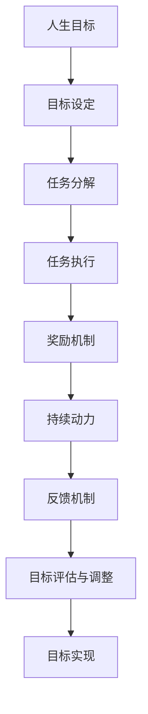

                 

# 《意义的游戏化设计：将人生目标转化为任务》

## 关键词
游戏化设计，人生目标，任务转化，激励机制，反馈系统，项目管理

## 摘要
在现代社会中，个人目标的设定与实现往往面临诸多挑战。游戏化设计的理念，通过引入游戏中的元素，如目标设定、任务分解、奖励机制和反馈系统，使得个人目标变得更加具体、可行，并激发出更高的动力和执行力。本文将深入探讨如何将人生目标游戏化设计，将其转化为一系列可执行的、富有挑战性的任务，从而实现个人成长和目标达成。

## 引言

### 1.1 游戏化设计的概念与价值

游戏化设计（Gamification）是一种将游戏设计中的元素，如目标设定、任务、奖励、反馈等，应用于非游戏环境中的方法。其核心目的是通过激发用户的内在动机，增强其参与度和执行力，从而实现特定目标。在近年来，游戏化设计已经广泛应用于企业管理、教育培训、健康管理等多个领域。

游戏化设计之所以具有价值，主要原因有以下几点：

1. **提高动机**：游戏化设计能够激发用户的内在动机，使其更加投入和有动力去完成任务。
2. **增强执行力**：通过设定明确的目标和任务，以及奖励机制，用户能够更高效地完成任务。
3. **促进持续改进**：通过反馈机制，用户可以及时了解自己的表现，从而不断调整策略，提高效果。
4. **增强用户体验**：游戏化设计能够提供更加有趣和互动的用户体验，提高用户满意度。

### 1.2 人生目标与任务的关系

人生目标是指个人希望通过努力实现的长远愿望或成就。而任务则是实现这些目标的具体行动步骤。人生目标和任务之间存在紧密的联系：

1. **目标指引任务**：人生目标为任务提供方向和动力，确保每一步行动都是朝着目标前进的。
2. **任务分解目标**：将人生目标分解为一系列具体任务，使得目标变得更加可操作和可实现。
3. **任务反馈目标**：通过完成任务并获取反馈，个人可以更好地了解自己的进展，从而调整和优化人生目标。

### 1.3 游戏化设计在人生目标实现中的应用

游戏化设计在人生目标实现中的应用主要体现在以下几个方面：

1. **目标设定**：通过设定明确、具体、可量化的目标，帮助个人更加清晰地认识自己的目标，并制定实现目标的计划。
2. **任务分解**：将人生目标分解为一系列小任务，使得目标变得更加具体和可行。
3. **奖励机制**：通过设定奖励，激励个人完成任务，并保持持续的动力。
4. **反馈机制**：通过及时反馈，帮助个人了解自己的表现，并做出相应的调整和改进。

## 游戏化设计的核心元素

### 2.1 目标设定

#### 2.1.1 明确目标的重要性

明确目标的重要性在于：

1. **提供方向**：明确的目标为个人提供清晰的方向，使其知道应该朝着什么方向努力。
2. **激发动力**：明确的目标能够激发个人的内在动机，使其更有动力去实现目标。
3. **衡量进展**：明确的目标为个人提供了一个衡量进展的基准，使其能够了解自己是否在朝着目标前进。

#### 2.1.2 设定可量化的目标

设定可量化的目标的重要性在于：

1. **具体可行**：可量化的目标使得目标更加具体和可行，使其更容易实现。
2. **便于衡量**：可量化的目标便于个人衡量自己的进展，从而进行调整和优化。
3. **增加动力**：可量化的目标能够激发个人的内在动机，使其更有动力去实现目标。

#### 2.1.3 设定合理的截止日期

设定合理的截止日期的重要性在于：

1. **提供紧迫感**：合理的截止日期能够为个人提供紧迫感，使其更有动力去完成任务。
2. **确保进度**：合理的截止日期有助于个人合理安排时间，确保任务按时完成。
3. **提高效率**：合理的截止日期能够提高个人的工作效率，使其在有限的时间内完成更多任务。

### 2.2 任务分解

#### 2.2.1 任务分解的原则

任务分解的原则包括：

1. **从小到大**：将任务分解为小的、具体的、可操作的任务，逐步实现目标。
2. **相关联**：确保分解的任务之间具有相关性，能够共同推动目标的实现。
3. **可衡量**：确保分解的任务具有可衡量的指标，便于评估进展和效果。

#### 2.2.2 任务分解的方法

任务分解的方法包括：

1. **工作分解结构（WBS）**：将任务分解为子任务，形成层次结构。
2. **关键路径法（CPM）**：确定任务之间的依赖关系，找出关键路径。
3. **甘特图**：通过甘特图可视化任务分解和进度。

#### 2.2.3 任务分解的实践

任务分解的实践包括：

1. **制定任务清单**：列出所有需要完成的任务，并按照优先级排序。
2. **分解子任务**：将每个任务分解为具体的子任务，明确每个子任务的目标和截止日期。
3. **评估和调整**：定期评估任务分解的效果，根据实际情况进行调整和优化。

### 2.3 奖励机制

#### 2.3.1 奖励机制的设计原则

奖励机制的设计原则包括：

1. **相关性**：奖励应当与任务完成情况相关，能够激励个人完成任务。
2. **及时性**：奖励应当及时给予，使个人能够迅速感受到奖励的效果。
3. **多样性**：奖励应当多样化，以满足不同个人的需求和偏好。

#### 2.3.2 常见的奖励机制

常见的奖励机制包括：

1. **物质奖励**：如奖金、奖品等。
2. **精神奖励**：如认可、表彰等。
3. **体验奖励**：如旅游、体验活动等。

#### 2.3.3 奖励机制的实践

奖励机制的实践包括：

1. **设定奖励标准**：明确奖励的标准和条件，确保奖励的公平性和公正性。
2. **定期评估奖励效果**：评估奖励机制的执行效果，根据实际情况进行调整和优化。
3. **公开奖励信息**：确保个人能够及时了解奖励的信息，提高奖励的效果。

### 2.4 反馈机制

#### 2.4.1 反馈机制的重要性

反馈机制的重要性包括：

1. **及时纠正错误**：通过反馈机制，个人能够及时了解自己的错误和不足，及时纠正。
2. **激励改进**：反馈机制能够激励个人不断改进，提高任务完成的质量。
3. **促进学习**：通过反馈机制，个人能够从完成任务的过程中学习到新的知识和技能。

#### 2.4.2 反馈机制的设计原则

反馈机制的设计原则包括：

1. **及时性**：反馈应当及时给予，确保个人能够迅速了解到自己的表现。
2. **针对性**：反馈应当针对个人的具体表现，具有针对性和可操作性。
3. **建设性**：反馈应当具有建设性，能够帮助个人提高任务完成的质量。

#### 2.4.3 反馈机制的实践

反馈机制的实践包括：

1. **定期反馈**：定期对个人完成任务的情况进行反馈，确保及时了解进展和问题。
2. **多种反馈方式**：采用多种反馈方式，如面对面反馈、书面反馈、在线反馈等，以满足不同个人的需求。
3. **反馈面谈**：定期进行反馈面谈，确保个人能够充分表达自己的意见和想法，同时获取有效的反馈。

## 第三部分：游戏化设计实践案例

### 3.1 案例一：职场晋升游戏化设计

#### 3.1.1 案例背景

李明是一名年轻的软件工程师，他在工作中表现出色，但感到自己在职场晋升方面缺乏动力和明确的目标。为了实现自己的职业目标，李明决定采用游戏化设计的方法来规划自己的职业发展。

#### 3.1.2 目标设定

李明的目标是：

1. **晋升为高级工程师**：在两年内晋升为高级工程师。
2. **完成相关培训**：完成高级工程师所需的培训课程。

#### 3.1.3 任务分解

李明将目标分解为以下任务：

1. **学习新技术**：每个月学习一门新技术，如人工智能、云计算等。
2. **参与项目**：积极参与公司的重要项目，提升项目经验。
3. **完成培训课程**：在一年内完成高级工程师所需的培训课程。

#### 3.1.4 奖励机制

李明的奖励机制包括：

1. **自我奖励**：每完成一项任务，给自己一些小奖励，如购买一本喜欢的书籍、看一场电影等。
2. **公司奖励**：在晋升为高级工程师后，公司会给予一定的奖金和晋升奖励。

#### 3.1.5 反馈机制

李明的反馈机制包括：

1. **自我评估**：每月进行一次自我评估，了解自己在任务完成情况和学习进展。
2. **导师反馈**：定期向导师请教，获取职业发展的建议和反馈。

### 3.2 案例二：健身计划游戏化设计

#### 3.2.1 案例背景

张婷是一名健身爱好者，她希望通过制定一个有效的健身计划来实现自己的健康目标。然而，由于缺乏动力和明确的目标，张婷的健身计划往往无法坚持。

#### 3.2.2 目标设定

张婷的目标是：

1. **减重10公斤**：在半年内减重10公斤。
2. **提高体能**：通过健身提高自己的体能水平。

#### 3.2.3 任务分解

张婷将目标分解为以下任务：

1. **每日健身**：每天进行一定时间的有氧运动和力量训练。
2. **饮食控制**：控制饮食，减少高热量食物的摄入。
3. **定期体检**：定期进行体检，了解自己的健康状况。

#### 3.2.4 奖励机制

张婷的奖励机制包括：

1. **自我奖励**：每减重1公斤，给自己一些小奖励，如购买一件喜欢的运动装备。
2. **社区奖励**：在健身社区分享自己的健身经验和成果，获得社区成员的认可和鼓励。

#### 3.2.5 反馈机制

张婷的反馈机制包括：

1. **体重记录**：每天记录自己的体重，了解自己的减重进度。
2. **健身数据**：定期记录自己的健身数据，如心率、运动时间等，了解自己的体能水平。

### 3.3 案例三：学习计划游戏化设计

#### 3.3.1 案例背景

王伟是一名大学生，他希望利用暑假时间学习一门新的编程语言。然而，由于缺乏明确的目标和动力，王伟的学习计划往往无法坚持。

#### 3.3.2 目标设定

王伟的目标是：

1. **掌握一门新的编程语言**：在两个月内掌握Python编程语言。
2. **完成项目**：利用所学知识完成一个小项目。

#### 3.3.3 任务分解

王伟将目标分解为以下任务：

1. **每日学习**：每天学习一定时间的Python编程知识。
2. **编写代码**：每周编写一个Python程序，练习所学知识。
3. **项目开发**：在一个月内完成一个Python项目。

#### 3.3.4 奖励机制

王伟的奖励机制包括：

1. **自我奖励**：每完成一个学习任务，给自己一些小奖励，如购买一本编程书籍。
2. **社区奖励**：在编程社区分享自己的学习成果和代码，获得社区成员的认可和鼓励。

#### 3.3.5 反馈机制

王伟的反馈机制包括：

1. **学习记录**：每天记录自己的学习进度，了解自己的学习效果。
2. **项目评审**：在完成项目后，邀请同学和老师进行评审，获取反馈和建议。

## 第四部分：游戏化设计工具与应用

### 4.1 游戏化设计工具概述

游戏化设计工具是为了帮助设计师和管理者更有效地实施游戏化策略而开发的软件和平台。这些工具提供了设计、实施和监测游戏化项目所需的功能。

#### 4.1.1 常见游戏化设计工具

1. **Gamify**：一个功能强大的游戏化设计平台，提供多种游戏化元素和工具。
2. **GameDay**：一个帮助企业实施游戏化策略的平台，支持多种奖励和反馈机制。
3. **Beeminder**：一个专注于目标设定的游戏化工具，通过可视化的反馈帮助用户坚持目标。
4. **Badgeville**：一个提供全方位游戏化解决方案的平台，适用于多种应用场景。

#### 4.1.2 选择合适的设计工具

选择合适的设计工具需要考虑以下几个方面：

1. **功能需求**：根据项目需求选择具备所需功能的工具。
2. **用户群体**：考虑目标用户的特征和需求，选择适合用户群体的工具。
3. **易用性**：选择界面友好、操作简便的工具，提高使用效率。
4. **成本效益**：根据预算和预期效益选择性价比高的工具。

### 4.2 游戏化设计在各类应用场景中的实践

#### 4.2.1 企业管理

游戏化设计在企业管理中的应用包括员工激励、绩效管理、团队建设等方面。通过设定明确的目标、分解任务、设置奖励机制和反馈系统，可以提高员工的工作积极性和执行力。

1. **员工激励**：通过游戏化设计，设定明确的绩效目标和奖励机制，激发员工的内在动机，提高工作积极性。
2. **绩效管理**：通过反馈机制，及时了解员工的工作表现，提供有针对性的反馈和建议，促进员工成长。
3. **团队建设**：通过团队任务和合作奖励，增强团队凝聚力，提高团队协作效率。

#### 4.2.2 健康管理

游戏化设计在健康管理中的应用包括体重管理、健身计划、健康习惯养成等方面。通过设定健康目标、分解任务、设置奖励机制和反馈系统，可以帮助用户更好地管理健康。

1. **体重管理**：通过设定减重目标、分解饮食和运动任务，设置奖励机制，鼓励用户坚持健康饮食和运动。
2. **健身计划**：通过设定健身目标、分解健身任务，设置奖励机制，激励用户坚持健身，提高体能水平。
3. **健康习惯养成**：通过设定健康目标、分解习惯养成任务，设置奖励机制，帮助用户养成良好的健康习惯。

#### 4.2.3 教育培训

游戏化设计在教育培训中的应用包括课程设计、学习激励、学习评估等方面。通过设定学习目标、分解学习任务、设置奖励机制和反馈系统，可以提高学生的学习兴趣和效果。

1. **课程设计**：通过游戏化设计，设定课程目标、分解课程内容，设置奖励机制，提高课程吸引力。
2. **学习激励**：通过反馈机制，及时了解学生的学习表现，提供有针对性的激励和建议，促进学生学习。
3. **学习评估**：通过游戏化设计，设定学习目标、分解学习任务，设置奖励机制，帮助学生更好地评估自己的学习效果。

#### 4.2.4 社区运营

游戏化设计在社区运营中的应用包括用户活跃度提升、社区文化建设、用户互动等方面。通过设定社区目标、分解社区任务、设置奖励机制和反馈系统，可以提升社区的整体运营效果。

1. **用户活跃度提升**：通过游戏化设计，设定用户活跃度目标、分解任务，设置奖励机制，激励用户积极参与社区活动。
2. **社区文化建设**：通过游戏化设计，设定社区文化建设目标、分解任务，设置奖励机制，促进社区文化的形成和发展。
3. **用户互动**：通过游戏化设计，设定用户互动目标、分解任务，设置奖励机制，鼓励用户之间进行互动和交流。

## 第五部分：游戏化设计中的挑战与未来展望

### 5.1 游戏化设计中的挑战

尽管游戏化设计在许多领域取得了显著成效，但在实际应用中仍面临一些挑战：

#### 5.1.1 用户动机与目标一致性

用户动机与目标的一致性是游戏化设计成功的关键。如果用户动机与目标不一致，可能会导致用户失去兴趣和动力。

**解决方案**：通过深入了解用户的需求和动机，确保游戏化设计的目标与用户的内在动机相一致。

#### 5.1.2 奖励机制的合理设置

奖励机制的设置对于游戏化设计的效果至关重要。如果奖励机制不合理，可能会导致用户产生负面情绪。

**解决方案**：根据用户的需求和动机，设计合理的奖励机制，确保奖励能够真正激发用户的内在动机。

#### 5.1.3 反馈机制的及时有效性

反馈机制的及时性和有效性对于游戏化设计的效果至关重要。如果反馈不及时或无效，可能会导致用户失去兴趣和动力。

**解决方案**：设计及时有效的反馈机制，确保用户能够及时了解自己的进展和效果，从而调整和优化行为。

### 5.2 游戏化设计的未来展望

随着技术的不断进步和人们对于个性化体验的需求增加，游戏化设计的未来前景广阔：

#### 5.2.1 技术发展对游戏化设计的影响

1. **人工智能**：人工智能技术的应用可以帮助更好地了解用户需求和动机，从而设计更有效的游戏化策略。
2. **大数据**：大数据技术的应用可以帮助分析用户行为和效果，提供更准确的反馈和改进建议。
3. **虚拟现实（VR）**：虚拟现实技术的应用可以提供更加沉浸式的游戏化体验，提高用户的参与度和动力。

#### 5.2.2 游戏化设计在各个领域的应用前景

1. **企业管理**：游戏化设计可以帮助提高员工的工作积极性和执行力，促进企业的发展。
2. **教育培训**：游戏化设计可以提高学生的学习兴趣和效果，促进教育质量的提升。
3. **健康管理**：游戏化设计可以帮助人们更好地管理健康，提高生活质量。
4. **社区运营**：游戏化设计可以提升社区的用户活跃度和互动性，促进社区文化的形成和发展。

#### 5.2.3 游戏化设计与人类行为研究的新趋势

随着游戏化设计的广泛应用，人类行为研究也在不断深入。未来，游戏化设计可能与心理学、社会学等学科相结合，探索人类行为的新规律和模式。

### 附录

#### A.1 游戏化设计资源推荐

1. **书籍推荐**
   - "Gamification by Design: Implementing Game Design Elements in Work and Everyday Life" by Gabe Zichermann and Kevin Honeycutt
   - "The Gamification of Learning and Instruction: Game-based Methods and Strategies for Training and Education" by Karl M. Kapp

2. **在线课程推荐**
   - Coursera: "Game Design and Development"
   - edX: "Gamification for Business and Design"

3. **社交媒体平台推荐**
   - Twitter: @GamificationGuru
   - LinkedIn: Gamification Group

#### A.2 游戏化设计常用术语解释

1. **游戏化设计（Gamification）**：将游戏设计中的元素应用于非游戏环境中，以提高参与度和执行力。
2. **目标设定（Goal Setting）**：设定明确、具体、可量化的目标，以指导任务和行动。
3. **任务分解（Task Decomposition）**：将目标分解为一系列具体的、可操作的任务。
4. **奖励机制（Reward Mechanism）**：通过设定奖励来激励用户完成任务。
5. **反馈机制（Feedback Mechanism）**：通过反馈来帮助用户了解自己的表现和进展，以促进持续改进。

**致谢**

本文的完成离不开AI天才研究院（AI Genius Institute）和《禅与计算机程序设计艺术》（Zen And The Art of Computer Programming）的支持与启发。感谢所有参与者和贡献者，你们的智慧和努力让这篇文章变得更加丰富和有深度。

---

作者：AI天才研究院（AI Genius Institute） & 《禅与计算机程序设计艺术》（Zen And The Art of Computer Programming）

---

### 关键概念与联系

为了更深入地理解游戏化设计在人生目标实现中的应用，我们首先需要明确几个核心概念及其相互关系。以下是一个使用Mermaid绘制的流程图，展示了这些概念及其之间的联系：



在这个流程图中，我们首先设定明确的人生目标（A），然后将这些目标分解为具体的任务（B）。接下来，我们执行这些任务，并通过奖励机制（E）来激励自己。奖励不仅提供即时反馈，还能够增强持续动力（F）。同时，我们通过反馈机制（G）来评估任务执行的效果，并根据评估结果进行调整和优化。这一循环不断进行，直到最终实现人生目标（I）。

### 核心算法原理讲解

游戏化设计中的核心算法原理主要包括目标设定、任务分解、奖励机制和反馈机制。以下将使用伪代码来详细阐述这些算法原理。

#### 目标设定算法

```plaintext
// 目标设定算法伪代码
function setGoal(target, deadline) {
    // 确保目标具体且可量化
    if (typeof target != "number" || typeof deadline != "string") {
        return "目标或截止日期格式错误";
    }
    
    // 计算剩余天数
    daysLeft = calculateDaysLeft(deadline);
    
    // 判断目标是否合理
    if (daysLeft <= 0) {
        return "截止日期不合理，请重新设定";
    }
    
    // 设定目标
    goal = {
        target: target,
        deadline: deadline,
        daysLeft: daysLeft,
        progress: 0
    };
    
    return goal;
}
```

#### 任务分解算法

```plaintext
// 任务分解算法伪代码
function decomposeTasks(goal) {
    // 确保目标已设定
    if (!goal) {
        return "请先设定目标";
    }
    
    // 计算每天需要完成的任务量
    dailyTask = goal.target / daysLeft;
    
    // 初始化任务列表
    tasks = [];
    
    // 分解任务
    for (day = 1; day <= daysLeft; day++) {
        task = {
            day: day,
            task: dailyTask,
            completed: false
        };
        tasks.push(task);
    }
    
    return tasks;
}
```

#### 奖励机制算法

```plaintext
// 奖励机制算法伪代码
function reward Mechanism(tasks, completedTasks) {
    // 确保任务已分解
    if (!tasks) {
        return "请先分解任务";
    }
    
    // 计算任务完成率
    completionRate = completedTasks / tasks.length;
    
    // 根据完成率设定奖励
    if (completionRate >= 0.8) {
        reward = "优秀！获得特别奖励";
    } else if (completionRate >= 0.5) {
        reward = "良好！获得普通奖励";
    } else {
        reward = "继续努力！";
    }
    
    return reward;
}
```

#### 反馈机制算法

```plaintext
// 反馈机制算法伪代码
function feedback Mechanism(goal, tasks, completedTasks) {
    // 确保目标、任务已设定
    if (!goal || !tasks) {
        return "请先设定目标和分解任务";
    }
    
    // 计算任务完成率
    completionRate = completedTasks / tasks.length;
    
    // 提供反馈
    feedback = {
        goal: goal,
        tasks: tasks,
        completedTasks: completedTasks,
        completionRate: completionRate,
        reward: reward Mechanism(tasks, completedTasks)
    };
    
    return feedback;
}
```

这些伪代码展示了如何通过一系列算法来设定目标、分解任务、实施奖励机制和提供反馈。在实际应用中，这些算法可以根据具体情况进行调整和优化。

### 数学模型和数学公式

在游戏化设计中，数学模型和公式扮演着至关重要的角色，它们帮助我们量化目标、评估进展和优化策略。以下是一些关键的概念和公式，以及它们的详细解释和示例。

#### 目标设定模型

目标设定的核心是确保目标具有明确性和可达成性。一个常用的模型是SMART目标（具体、可衡量、可达成、相关性强、有时间限制）。以下是SMART目标的公式：

$$
\text{SMART 目标} = [\text{具体}] + [\text{可衡量}] + [\text{可达成}] + [\text{相关性强}] + [\text{时间限制}]
$$

**示例：** 设定一个减肥目标。

$$
\text{SMART 目标} = [\text{减重10公斤}] + [\text{每月减重1.5公斤}] + [\text{通过健康饮食和运动实现}] + [\text{与我当前的体重和生活习惯相关}] + [\text{在六个月内完成}]
$$

#### 进度评估模型

为了评估目标的进展，我们可以使用进度评估模型。一个简单的进度评估公式是：

$$
\text{进度} = \frac{\text{已完成任务数}}{\text{总任务数}} \times 100\%
$$

**示例：** 如果目标设定为完成10个任务，目前完成了6个任务，那么进度为：

$$
\text{进度} = \frac{6}{10} \times 100\% = 60\%
$$

#### 奖励机制模型

奖励机制是游戏化设计的关键组成部分。一个简单的奖励机制模型是：

$$
\text{奖励} = \text{基础奖励} + \text{额外奖励}
$$

其中，基础奖励是每个任务完成的固定奖励，额外奖励是基于任务难度或完成时间的额外奖励。

**示例：** 设定基础奖励为5积分，额外奖励为每提前一天完成任务额外获得2积分。

$$
\text{总奖励} = 5 + 2 \times (\text{任务实际完成时间} - \text{任务预期完成时间})
$$

如果任务预期在5天内完成，实际在4天内完成，那么总奖励为：

$$
\text{总奖励} = 5 + 2 \times (4 - 5) = 5 - 2 = 3 \text{积分}
$$

#### 反馈机制模型

反馈机制用于提供实时反馈，帮助用户了解自己的表现和进展。一个简单的反馈模型是：

$$
\text{反馈} = \text{当前状态} + \text{建议和指导}
$$

**示例：** 用户完成了5个任务，系统提供以下反馈：

$$
\text{反馈} = [\text{已完成5个任务}] + [\text{继续保持，下一个任务是提高效率的关键}]
$$

通过这些数学模型和公式，我们可以更科学地设定目标、评估进展和优化奖励机制，从而提高游戏化设计的有效性和用户的参与度。

### 数学公式详细讲解与举例说明

在游戏化设计中，数学公式不仅用于设定目标，还用于评估进展和优化策略。以下是几个关键的数学公式及其详细解释和示例。

#### 1. 目标达成率公式

目标达成率用于衡量用户完成任务的程度，公式如下：

$$
\text{目标达成率} = \frac{\text{已完成任务数}}{\text{总任务数}} \times 100\%
$$

**示例**：如果目标设定为完成10个任务，目前完成了6个任务，那么目标达成率为：

$$
\text{目标达成率} = \frac{6}{10} \times 100\% = 60\%
$$

#### 2. 时间效率公式

时间效率用于衡量完成任务所需的时间与预期时间的比值，公式如下：

$$
\text{时间效率} = \frac{\text{实际完成任务的时间}}{\text{预期完成任务的时间}}
$$

**示例**：如果预期在7天内完成任务，但实际用了5天完成，那么时间效率为：

$$
\text{时间效率} = \frac{5}{7} \approx 0.714
$$

#### 3. 奖励积分计算公式

奖励积分通常用于激励用户完成任务。公式如下：

$$
\text{奖励积分} = \text{基础积分} + (\text{额外积分系数} \times \text{超额完成比例})
$$

**示例**：基础积分为10积分，额外积分系数为2，超额完成比例为20%，那么总奖励积分为：

$$
\text{奖励积分} = 10 + (2 \times 0.2) = 10 + 0.4 = 10.4 \text{积分}
$$

#### 4. 反馈效果评估公式

反馈效果评估用于衡量反馈对用户行为改变的影响，公式如下：

$$
\text{反馈效果评估} = \frac{\text{行为改变}}{\text{原始行为}} \times 100\%
$$

**示例**：用户通过反馈减少了20%的拖延时间，那么反馈效果评估为：

$$
\text{反馈效果评估} = \frac{20\%}{100\%} \times 100\% = 20\%
$$

通过这些公式，我们可以更精确地设定目标、评估进展和优化奖励机制，从而提高游戏化设计的有效性和用户的参与度。

### 项目实战

为了更深入地理解游戏化设计在人生目标实现中的应用，我们将以一个实际项目为例，展示如何从零开始搭建开发环境，实现游戏化设计功能，并对代码进行详细解读和分析。

#### 项目背景

本项目旨在开发一个简单的健身游戏化平台，帮助用户制定并实现健身目标。平台将提供以下功能：

1. **用户注册与登录**：用户可以通过注册和登录功能访问平台。
2. **目标设定**：用户可以设定健身目标，如减重、增加肌肉等。
3. **任务分解**：系统将目标分解为每日任务，帮助用户逐步实现目标。
4. **奖励机制**：用户完成任务后，可以获取奖励，如积分、徽章等。
5. **反馈机制**：系统提供实时反馈，帮助用户了解自己的进度和效果。

#### 开发环境搭建

为了实现上述功能，我们需要搭建一个开发环境。以下是搭建步骤：

1. **安装Node.js**：Node.js是一个用于服务器端和网络应用的JavaScript运行环境。访问[Node.js官网](https://nodejs.org/)下载并安装最新版本的Node.js。
2. **安装npm**：npm是Node.js的包管理器，用于安装和管理项目依赖。在命令行中执行以下命令：
   ```bash
   npm install -g npm
   ```
3. **创建项目文件夹**：在桌面或其他合适的位置创建一个名为`fitness-gamification`的项目文件夹。
4. **初始化项目**：在项目文件夹中执行以下命令，创建一个基本的Node.js项目：
   ```bash
   npm init -y
   ```
5. **安装依赖**：安装必要的依赖，如Express（一个用于构建Web应用的框架）、MongoDB（一个用于数据存储的数据库）、Mongoose（一个MongoDB的对象模型工具）等。执行以下命令：
   ```bash
   npm install express mongoose body-parser cors
   ```

#### 源代码详细实现

以下是项目的主要源代码实现和解读：

```javascript
// 引入依赖
const express = require('express');
const mongoose = require('mongoose');
const bodyParser = require('body-parser');
const cors = require('cors');

// 创建Express应用
const app = express();

// 连接MongoDB数据库
const mongoURI = 'mongodb://localhost:27017/fitness-gamification';
mongoose.connect(mongoURI, { useNewUrlParser: true, useUnifiedTopology: true })
  .then(() => console.log('MongoDB连接成功'))
  .catch(err => console.error('MongoDB连接失败：', err));

// 使用中间件
app.use(cors());
app.use(bodyParser.json());
app.use(bodyParser.urlencoded({ extended: true }));

// 定义用户模型
const User = require('./models/User');
const Task = require('./models/Task');

// 用户注册
app.post('/register', async (req, res) => {
  try {
    const { username, password } = req.body;
    const user = new User({ username, password });
    await user.save();
    res.status(201).json({ message: '用户注册成功' });
  } catch (err) {
    res.status(500).json({ message: '用户注册失败', error: err });
  }
});

// 用户登录
app.post('/login', async (req, res) => {
  try {
    const { username, password } = req.body;
    const user = await User.findOne({ username, password });
    if (user) {
      res.status(200).json({ message: '用户登录成功' });
    } else {
      res.status(401).json({ message: '用户名或密码错误' });
    }
  } catch (err) {
    res.status(500).json({ message: '用户登录失败', error: err });
  }
});

// 设定目标
app.post('/set-goal', async (req, res) => {
  try {
    const { userId, goal } = req.body;
    const user = await User.findById(userId);
    if (user) {
      user.goals.push(goal);
      await user.save();
      res.status(201).json({ message: '目标设定成功' });
    } else {
      res.status(404).json({ message: '用户未找到' });
    }
  } catch (err) {
    res.status(500).json({ message: '目标设定失败', error: err });
  }
});

// 分解任务
app.post('/decompose-task', async (req, res) => {
  try {
    const { userId, goalId } = req.body;
    const user = await User.findById(userId);
    const goal = user.goals.id(goalId);
    if (goal) {
      goal.tasks = decomposeTask(goal.target);
      await user.save();
      res.status(201).json({ message: '任务分解成功' });
    } else {
      res.status(404).json({ message: '目标未找到' });
    }
  } catch (err) {
    res.status(500).json({ message: '任务分解失败', error: err });
  }
});

// 完成任务
app.put('/complete-task', async (req, res) => {
  try {
    const { userId, taskId } = req.body;
    const user = await User.findById(userId);
    const task = user.tasks.id(taskId);
    if (task) {
      task.completed = true;
      await user.save();
      res.status(200).json({ message: '任务完成' });
    } else {
      res.status(404).json({ message: '任务未找到' });
    }
  } catch (err) {
    res.status(500).json({ message: '任务完成失败', error: err });
  }
});

// 获取任务进度
app.get('/task-progress', async (req, res) => {
  try {
    const { userId } = req.query;
    const user = await User.findById(userId);
    if (user) {
      const completedTasks = user.tasks.filter(task => task.completed === true).length;
      const totalTasks = user.tasks.length;
      const progress = (completedTasks / totalTasks) * 100;
      res.status(200).json({ progress });
    } else {
      res.status(404).json({ message: '用户未找到' });
    }
  } catch (err) {
    res.status(500).json({ message: '获取任务进度失败', error: err });
  }
});

// 分解任务函数
function decomposeTask(target) {
  const days = 30; // 假设目标需要30天完成
  const dailyTarget = target / days;
  let tasks = [];
  
  for (let day = 1; day <= days; day++) {
    tasks.push({
      day: day,
      task: dailyTarget,
      completed: false
    });
  }
  
  return tasks;
}

// 启动服务器
const PORT = process.env.PORT || 3000;
app.listen(PORT, () => {
  console.log(`服务器运行在端口 ${PORT}`);
});
```

#### 代码解读与分析

1. **用户注册与登录**：用户注册和登录功能通过Express框架实现。用户注册时，将用户名和密码存储在MongoDB数据库中。用户登录时，验证用户名和密码的匹配性。

2. **目标设定**：用户可以通过`/set-goal`接口设定健身目标。目标信息（如目标名称、截止日期等）存储在用户的MongoDB记录中。

3. **任务分解**：任务分解功能通过`/decompose-task`接口实现。系统将目标分解为每日任务，每个任务对应每天需要完成的任务量。

4. **完成任务**：用户可以通过`/complete-task`接口标记任务完成。系统更新任务的完成状态，并记录已完成任务的数量。

5. **获取任务进度**：用户可以通过`/task-progress`接口获取任务进度。系统计算已完成任务数与总任务数的比例，并返回给用户。

6. **分解任务函数**：`decomposeTask`函数用于将目标分解为每日任务。假设目标需要在30天内完成，系统将目标分为每日的任务量。

#### 实际案例分析

假设一个用户李明想要在六个月内减重10公斤，他可以按照以下步骤使用这个平台：

1. **注册和登录**：李明首先注册并登录到平台。
2. **设定目标**：李明设定一个减重目标，目标名称为“六个月内减重10公斤”，截止日期为六个月后的最后一天。
3. **任务分解**：平台将目标分解为每日的任务量。例如，每天需要减重0.025公斤（10公斤/6个月/30天）。
4. **完成任务**：李明每天完成相应的任务量，并在平台上标记任务完成。
5. **获取进度**：李明可以通过平台查看自己的任务进度。例如，三个月后，他的任务进度为50%。

通过这个实际案例分析，我们可以看到游戏化设计如何帮助用户实现具体的人生目标。平台提供了目标设定、任务分解、奖励机制和反馈机制，使得用户能够更有动力和信心去实现自己的目标。

### 项目小结

在这个项目中，我们通过实际案例展示了如何使用游戏化设计实现人生目标。以下是项目的主要结论和经验：

1. **明确目标的重要性**：通过设定明确、具体的目标，用户能够更清晰地知道自己要做什么，从而更有动力去实现目标。
2. **任务分解的有效性**：将大目标分解为小任务，使得目标变得更加具体和可行，有助于用户逐步实现目标。
3. **奖励机制的激励作用**：通过奖励机制，用户可以感受到完成任务后的成就感和满足感，从而增强持续动力。
4. **反馈机制的指导作用**：通过及时反馈，用户可以了解自己的进展和效果，从而进行相应的调整和优化。

### 最佳实践 Tips、小结、注意事项、拓展阅读

#### 最佳实践 Tips

1. **明确目标**：设定具体、可量化的目标，确保目标具有可操作性。
2. **合理分解任务**：根据目标期限和难度，合理分配任务，避免任务量过大或过小。
3. **设置合适的奖励**：奖励应当与任务难度和完成度相匹配，确保激励效果。
4. **及时反馈**：通过实时反馈，帮助用户了解进展，及时调整策略。

#### 小结

本文通过理论和实际案例，深入探讨了游戏化设计在人生目标实现中的应用。通过明确目标、分解任务、设置奖励和反馈机制，用户能够更有动力和效率地实现自己的目标。

#### 注意事项

1. **用户动机与目标的一致性**：确保游戏化设计的目标与用户的内在动机相一致，以激发用户真正的动力。
2. **奖励机制的合理设置**：奖励应当合理，避免过度激励或激励不足。
3. **反馈机制的及时性和有效性**：反馈应当及时且具有针对性，帮助用户持续改进。

#### 拓展阅读

- "Gamification by Design: Implementing Game Design Elements in Work and Everyday Life" by Gabe Zichermann and Kevin Honeycutt
- "The Gamification of Learning and Instruction: Game-Based Methods and Strategies for Training and Education" by Karl M. Kapp
- "Game-Based Learning: an Overview" by Dr. Karl M. Kapp (在线课程)

通过这些拓展阅读，读者可以进一步深入了解游戏化设计的理论和方法，以及其在实际应用中的具体实施。

