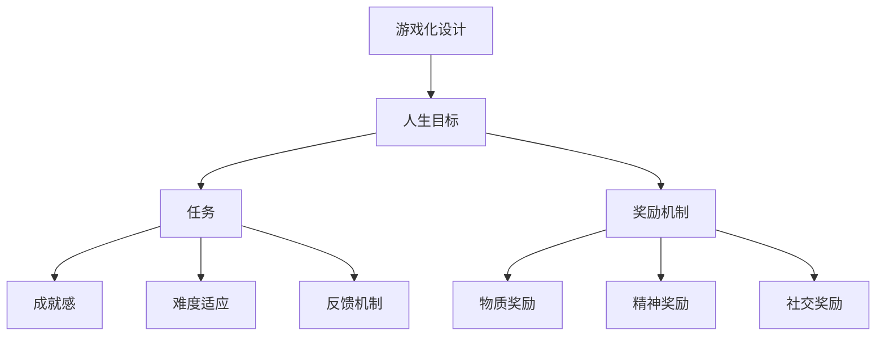

                 

### 文章标题

# 《意义的游戏化设计：将人生目标转化为任务与奖励》

### 关键词

- 游戏化设计
- 人生目标
- 任务
- 奖励机制
- 动机

### 摘要

本文将探讨如何通过游戏化设计，将人生目标转化为具体的任务和奖励机制。我们将首先介绍游戏化设计的基本概念，然后分析其核心原则，并探讨如何将这些原则应用于人生目标的设计中。接着，我们将深入探讨任务设计和奖励机制的具体方法，并通过实际案例展示如何实施这些方法。最后，我们将讨论在实施过程中可能遇到的问题及解决方案，并对未来的发展趋势进行展望。

## 引言

在现代社会中，人们对于实现人生目标的追求愈发强烈。然而，很多人往往在面对复杂的任务和漫长的时间线时感到迷茫和无从下手。游戏化设计作为一种新兴的设计理念，通过引入游戏的元素，如任务、奖励、成就等，为人们提供了一个更加有趣、激励和可管理的实现途径。本文旨在探讨如何将人生目标通过游戏化设计转化为具体的任务和奖励机制，以帮助人们更加有效地实现他们的目标。

### 1. 游戏化设计的基本概念

游戏化设计是指将游戏的元素和原理应用于非游戏情境中，以提高参与者的动机和效率。这种设计方法不仅仅局限于商业领域，教育、健康、项目管理等众多领域都已经开始采用游戏化设计来提升效果。

#### 1.1 游戏化设计的历史与发展

游戏化设计的概念最早可以追溯到1970年代，当时游戏设计师开始将游戏的激励机制应用于非游戏环境。到了2000年代，随着互联网和移动设备的普及，游戏化设计得到了广泛的应用。特别是近年来，随着人们对健康生活方式和自我成长的关注增加，游戏化设计在健康管理和个人发展领域的应用也日益增多。

#### 1.2 游戏化设计的核心原则

游戏化设计成功的关键在于其核心原则的应用。以下是游戏化设计的一些核心原则：

- **成就感**：成就感是游戏化设计中最重要的一部分。通过设定小目标和逐步实现，参与者能够感受到自己的进步和成就，从而提高动机。
- **竞争与合作**：竞争和合作是人类天性的一部分。通过引入竞争和合作机制，游戏化设计能够激发参与者的积极性。
- **进步追踪**：进步追踪让参与者能够清晰地看到自己的进步和成绩，从而保持动机和兴趣。
- **难度适应**：难度适应确保参与者始终面临适当的挑战，既能保持兴趣，又不至于感到挫败。

#### 1.3 游戏化设计与人生目标的关系

人生目标往往具有长期性和复杂性，这使得许多人感到难以实现。游戏化设计通过将其分解为具体的任务和奖励机制，可以帮助人们更好地管理这些目标。

- **人生目标的定义**：人生目标是指个人希望在未来实现的重要目标，如职业发展、健康、家庭、学习等。
- **游戏化设计如何帮助实现人生目标**：游戏化设计通过提供激励机制和结构化的任务，帮助人们更清晰地了解和实现他们的目标。
- **游戏化设计的优势与挑战**：游戏化设计在实现人生目标方面具有显著的优势，但也面临一些挑战，如参与者的动机变化和维持长期持续性。

### 2. 游戏化设计的原理与实践

游戏化设计不仅仅是一种理念，它还需要一系列具体的原理和实践方法来确保其有效性。以下我们将详细探讨这些原理和实践方法。

#### 2.1 游戏化设计的原理

游戏化设计的原理是游戏成功的关键因素在非游戏环境中的应用。以下是游戏化设计的一些关键原理：

- **任务分解**：将大目标分解为小任务，使参与者能够逐步实现目标，并感受到成就感。
- **反馈机制**：及时给予参与者反馈，让他们了解自己的进展和成就，从而保持动机。
- **奖励机制**：通过奖励机制激励参与者，使他们在实现目标后得到正面的反馈。
- **社群互动**：通过社群互动增强参与者的归属感和支持感，从而提高参与度。

#### 2.2 如何将游戏化设计应用于人生目标

将游戏化设计应用于人生目标需要考虑以下几个方面：

- **人生目标的游戏化框架**：首先需要为人生目标设计一个游戏化的框架，包括任务、奖励和进度追踪等。
- **人生目标的分解与组合**：将人生目标分解为具体的任务，并根据实际情况进行组合。
- **游戏化设计在个人成长中的应用**：通过游戏化设计，个人可以更好地规划和管理自己的成长路径。

#### 2.3 游戏化设计的实践案例

以下是几个游戏化设计的实践案例：

- **健康类应用**：如Fitbit等健康类应用通过记录用户的活动数据和奖励机制，鼓励用户保持健康的生活方式。
- **教育类应用**：如Duolingo等语言学习应用通过游戏化的学习方式，提高用户的学习效果和兴趣。
- **职业发展类应用**：如LinkedIn等职业发展类应用通过游戏化的任务和奖励机制，帮助用户更好地管理自己的职业发展。

### 3. 任务设计

任务设计是游戏化设计中的核心环节，它决定了参与者如何实现目标。以下是任务设计的一些关键原则和方法：

#### 3.1 如何将人生目标转化为任务

- **定义具体任务**：将抽象的人生目标转化为具体的、可操作的任务。
- **设定优先级**：根据任务的重要性和紧急性设定任务的优先级。
- **任务具体化**：为每个任务设定明确的目标和衡量标准。

#### 3.2 任务设计的原则与技巧

- **挑战性原则**：确保任务既有挑战性，又不至于过于困难。
- **趣味性原则**：设计有趣的任务，提高参与者的积极性。
- **持续性原则**：确保任务能够长期持续，避免短期行为。

#### 3.3 任务设计的实践案例

以下是几个任务设计的实践案例：

- **健康类任务**：如每天走10000步、每周至少锻炼三次等。
- **职业类任务**：如每天阅读一篇行业文章、每周与一个行业专家交流等。
- **学习类任务**：如每天学习一小时、每周完成一个小项目等。

### 4. 奖励机制

奖励机制是游戏化设计中的重要组成部分，它能够激励参与者持续地完成任务。以下是奖励机制设计的一些关键原则和方法：

#### 4.1 奖励机制的设计原则

- **及时性原则**：及时给予奖励，使参与者感受到自己的进步。
- **多样性原则**：设计多种类型的奖励，以满足不同参与者的需求。
- **公平性原则**：确保奖励机制的公平性，避免引起不公平感。

#### 4.2 奖励机制的多样性

- **物质奖励**：如金钱、物品等。
- **精神奖励**：如荣誉、称号等。
- **社交奖励**：如社群认可、朋友支持等。

#### 4.3 奖励机制的实践案例

以下是几个奖励机制的实践案例：

- **健康类应用**：如Fitbit通过积分奖励用户，鼓励他们保持健康的生活方式。
- **教育类应用**：如Duolingo通过奖励勋章，激励用户持续学习语言。
- **职业发展类应用**：如LinkedIn通过奖励虚拟货币，鼓励用户积极分享和建立人脉。

### 5. 项目实践

游戏化设计需要通过实际项目来验证其效果。以下是项目实践的一些关键步骤和方法：

#### 5.1 项目实践的准备工作

- **目标设定**：明确项目目标，确保游戏化设计能够帮助实现这些目标。
- **需求分析**：分析参与者的需求和目标，确保游戏化设计能够满足这些需求。
- **设计原型**：设计游戏化设计原型，进行初步测试和优化。

#### 5.2 项目实践的执行与监督

- **任务分配**：明确每个参与者的任务和责任，确保任务能够高效完成。
- **进度追踪**：建立进度追踪机制，确保项目按计划进行。
- **反馈机制**：建立反馈机制，及时收集参与者的反馈，并进行调整。

#### 5.3 项目实践的效果评估

- **效果评估**：通过数据分析和用户反馈，评估项目效果，并进行总结和反思。
- **持续改进**：根据评估结果，对游戏化设计进行优化和改进，以提高效果。

### 6. 挑战与解决方案

在实施游戏化设计过程中，可能会遇到一些挑战。以下是几个常见的挑战及相应的解决方案：

#### 6.1 挑战

- **动机变化**：参与者的动机可能会随时间变化，导致游戏化设计效果下降。
- **难度适应**：随着任务的完成，参与者可能需要适应更高难度的任务。
- **社群互动**：维持社群互动的活跃度可能是一项挑战。

#### 6.2 解决方案

- **动态调整**：根据参与者的动机变化，动态调整游戏化设计，以保持其吸引力。
- **难度适应机制**：设计难度适应机制，确保任务难度与参与者的能力相匹配。
- **社群维护**：通过定期活动和激励，维持社群的活跃度。

### 7. 结论与展望

游戏化设计为人们实现人生目标提供了一种新的途径。通过将游戏元素引入人生目标的设计中，游戏化设计不仅提高了参与者的动机和效率，还使目标实现过程更加有趣和有意义。未来，随着技术的不断进步，游戏化设计在人生目标实现中的应用将更加广泛和深入。我们期待看到更多创新的游戏化设计方法，帮助人们更好地实现他们的目标。

### 附录

以下是本文中提到的核心概念原理之间的关系架构 Mermaid 流程图：

通过这个流程图，我们可以清晰地看到游戏化设计如何将人生目标转化为任务和奖励机制，以及这些元素之间的关系。

### 作者信息

作者：AI天才研究院/AI Genius Institute & 禅与计算机程序设计艺术 /Zen And The Art of Computer Programming

### 参考文献

[1] Deterding, S., Khaled, R. & Nacke, L. (2011). What makes gaming fun? Analyzing fun mechanisms in games. In Proceedings of the 6th International Conference on Advances in Computer Entertainment Technology (ACE '10), 13:1-13:8.

[2] media, M. (2017). Gamification: The Gameful World. Medium. Retrieved from <https://medium.com/gamification-gurus/gamification-the-gameful-world-354b3a267c52>

[3] Gagne, M. (2013). Gamification in Education: What Educators Need to Know. Retrieved from <https://www.educationnews.org/gamification-education/>

[4] MIT Sloan School of Management. (2017). Gamification: From Fun to Engagement. MIT Sloan Management Review. Retrieved from <https://sloanreview.mit.edu/article/gamification-from-fun-to-engagement/>

[5] Reinhard, M. & Serenko, A. (2016). The Gamification of Health and Physical Activity: A Systematic Review. Journal of Medical Internet Research, 18(5), e131.

[6] Deterding, S., Schmidt, J., Danneels, E. & Sicart, M. (2017). From Game Design Elements to Gamefulness: Defining "Gamification" and Mapping Its Value. In Proceedings of the 15th International Academic MindTrek Conference: Envisioning Future Media Environments (MindTrek '17), 40-48.

