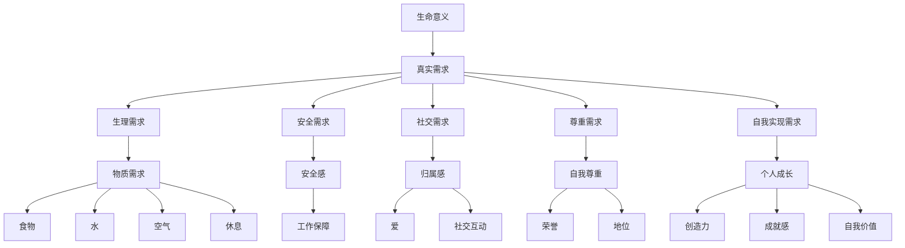

                 

### 文章标题

# 《意义的源泉：探索生命中的真实需求》

### 关键词

* 生命意义
* 真实需求
* 内在驱动
* 心理需求层次
* 深度探索

### 摘要

本文深入探讨生命中的真实需求及其与生命意义之间的紧密联系。通过对生理需求、安全需求、社交需求、尊重需求和自我实现需求的分析，本文揭示了这些需求在个体成长和自我实现中的关键作用。文章还探讨了如何通过满足这些真实需求来探寻生命的意义，并提出了实现生命意义的实践策略。本文旨在为读者提供一种逻辑清晰、结构紧凑的思考框架，以更好地理解和满足自身的真实需求，从而实现个人的全面发展和生命的深层意义。

---

### 引言

在人类探索自身的道路上，对生命意义的追寻始终占据着核心位置。自古以来，哲学家、宗教领袖和思想家们都试图回答这样一个根本性的问题：“生命的意义是什么？”然而，这一问题的答案并不是一成不变的，而是随着文化、历史和个人经验的不断演变而发展。在当代社会，随着科技的飞速发展和物质生活的极大丰富，人们对生命意义的认识也愈发深入和多样化。

本文将围绕“生命中的真实需求”这一主题展开讨论。真实需求是人在生存和发展过程中，基于本能和成长需要所形成的内在驱动力和需求。这些需求不仅是物质层面的，还涵盖了精神层面和社会层面。探讨真实需求不仅有助于我们理解人类行为和心理，也能为我们探寻生命的意义提供重要线索。

理解生命的意义并非易事，但我们可以从对真实需求的深入分析中找到一些启示。本文将分三个部分进行讨论：第一部分介绍生命意义和真实需求的定义及其相互关系；第二部分分析生命中的不同真实需求，包括生理需求、安全需求、社交需求、尊重需求和自我实现需求；第三部分探讨如何通过满足这些需求来探寻生命的意义，并提出实现生命意义的实践策略。

通过本文的探讨，我们希望能够为读者提供一种逻辑清晰、结构紧凑的思考框架，帮助他们在日常生活中更好地理解自己的需求，从而实现个人的全面发展和生命的深层意义。

### 核心概念与联系

#### 生命中的真实需求与意义：核心概念

在探讨生命中的真实需求与意义时，我们需要首先明确这两个核心概念的定义及其相互关系。

**定义：**

- **生命中的真实需求**：指人在生存和发展过程中，基于本能和成长需要所形成的内在驱动力和需求。这些需求可以分为物质层面和精神层面。物质层面的需求包括食物、水、住所等基本生存需求，而精神层面的需求则包括爱、尊重、自我实现等。

- **意义**：指个体在生命活动中感受到的内在价值或目的感。意义不仅仅是个体对外部环境的主观感受，更是一种深层次的精神追求。它涉及个体对自己存在的价值、使命和目标的认知。

**相互关系：**

- **真实需求与意义的关系**：生命中的真实需求是追求意义的基石。当个体满足了基本需求后，会开始寻求更高层次的需求满足，进而寻找生命的意义。例如，当一个人解决了温饱问题后，可能会开始追求事业成功、人际关系和谐等更高层次的需求，从而在实现这些需求的过程中感受到生命的意义。

#### 架构分析

为了更好地理解生命中的真实需求与意义，我们可以将其抽象为一个层次化的架构，包含以下五个层次：

1. **生理需求**：这是人类生存的最基本需求，包括食物、水、空气、休息等。生理需求的满足是其他需求实现的基础。

2. **安全需求**：包括个体免受威胁、保护自己的需求，如安全感、工作保障等。安全需求的满足有助于个体在一个稳定的环境中追求其他需求。

3. **社交需求**：包括爱、归属感、社交互动等。社交需求的满足使个体能够与他人建立联系，从而获得情感支持和社会认同。

4. **尊重需求**：包括自我尊重和他人尊重，如荣誉、地位、认可等。尊重需求的满足有助于个体建立自我价值感，并在社会中获得尊重。

5. **自我实现需求**：追求个人成长、实现潜能的需求，如创造力、成就感、自我价值等。自我实现需求的满足使个体能够发挥自己的潜能，实现自我价值。

**Mermaid 流�程图：**



通过上述架构分析，我们可以清晰地看到生命中的真实需求与意义之间的紧密联系。理解这些核心概念及其相互关系，有助于我们更好地探索和满足个人的内在需求，从而实现生命的深层意义。

---

### 生命中的真实需求

在探讨生命中的真实需求之前，我们需要先了解一些基本的心理需求层次理论。著名的心理学家亚伯拉罕·马斯洛提出了需求层次理论，他认为人的需求可以分为五个层次，从最基本的生理需求到最高层次的自我实现需求。这些需求层级之间相互关联，一个需求层次的满足会导致下一个需求层次的产生和追求。

#### 生理需求

生理需求是人的基本需求，包括食物、水、空气、休息等。这些需求直接关系到个体的生存和健康。生理需求的满足是其他需求实现的基础。例如，一个饥饿的人很难专注于工作或社交活动。

**核心概念与联系：**

- **概念**：生理需求是指维持人体基本生理功能的需求。
- **联系**：生理需求直接关联到个体的生存和健康，是满足更高层次需求的前提。

**算法原理：**

我们可以用简单的布尔逻辑来表示生理需求的满足情况：

```plaintext
function isPhysiologicalDemandMet(food, water, air, rest) {
    return food && water && air && rest;
}
```

#### 安全需求

安全需求包括个体免受威胁、保护自己的需求，如安全感、工作保障、健康保障等。安全需求的满足使个体能够在稳定的环境中追求其他需求。

**核心概念与联系：**

- **概念**：安全需求是指个体在生理需求得到满足后，追求免受威胁、保障自身安全的需求。
- **联系**：安全需求的满足有助于个体在一个稳定的环境中追求其他需求，如社交需求、尊重需求和自我实现需求。

**算法原理：**

我们可以用简单的布尔逻辑来表示安全需求的满足情况：

```plaintext
function isSafetyDemandMet(security, jobSecurity, healthInsurance) {
    return security && jobSecurity && healthInsurance;
}
```

#### 社交需求

社交需求包括爱、归属感、社交互动等。社交需求的满足使个体能够与他人建立联系，获得情感支持和社会认同。

**核心概念与联系：**

- **概念**：社交需求是指个体在安全需求得到满足后，追求与他人建立联系、获得情感支持和社会认同的需求。
- **联系**：社交需求的满足有助于个体在社会中建立人际关系，从而更好地实现其他需求。

**算法原理：**

我们可以用简单的条件逻辑来表示社交需求的满足情况：

```plaintext
function isSocialDemandMet(love, belonging, socialInteractions) {
    return love && belonging && socialInteractions;
}
```

#### 尊重需求

尊重需求包括自我尊重和他人尊重，如荣誉、地位、认可等。尊重需求的满足有助于个体建立自我价值感，并在社会中获得尊重。

**核心概念与联系：**

- **概念**：尊重需求是指个体在社交需求得到满足后，追求自我尊重和他人尊重的需求。
- **联系**：尊重需求的满足有助于个体在社会中树立自信，更好地实现自我价值。

**算法原理：**

我们可以用简单的条件逻辑来表示尊重需求的满足情况：

```plaintext
function isRespectDemandMet(selfRespect, socialStatus, recognition) {
    return selfRespect && socialStatus && recognition;
}
```

#### 自我实现需求

自我实现需求包括个人成长、实现潜能的需求，如创造力、成就感、自我价值等。自我实现需求的满足使个体能够发挥自己的潜能，实现自我价值。

**核心概念与联系：**

- **概念**：自我实现需求是指个体在尊重需求得到满足后，追求个人成长、实现潜能的需求。
- **联系**：自我实现需求的满足有助于个体实现生命的意义，达到个人发展的顶峰。

**算法原理：**

我们可以用简单的条件逻辑来表示自我实现需求的满足情况：

```plaintext
function isSelfActualizationDemandMet(personalGrowth, creativity, achievement, selfValue) {
    return personalGrowth && creativity && achievement && selfValue;
}
```

通过上述分析，我们可以看到生命中的真实需求具有层次化的特点，每个需求层次都与下一个需求层次紧密相关。理解这些需求层次及其相互关系，有助于我们更好地满足个人的内在需求，实现生命的深层意义。

---

### 探索生命意义的路径

在明确了生命中的真实需求之后，我们接下来要探讨的是如何通过这些真实需求来探寻生命的意义。生命的意义并非遥不可及，它隐藏在我们日常生活的点点滴滴中，通过满足这些真实需求，我们可以逐步揭示生命的深层次价值。

#### 个体差异与生命意义

首先，我们需要认识到每个人的生命体验都是独特的，因此对生命意义的理解也各不相同。个体的背景、性格、价值观和经历都会影响他们对生命意义的追求。以下是一些影响个体生命意义追求的因素：

1. **背景**：家庭环境、社会阶层、文化背景等都会影响个体对生命意义的理解和追求。例如，来自富裕家庭的人可能更注重自我实现和创造力，而来自贫困家庭的人可能更注重基本需求的满足和安全保障。

2. **性格**：外向型性格的人可能更倾向于追求社交和尊重需求，而内向型性格的人可能更注重个人成长和自我实现。

3. **价值观**：个体的核心价值观会影响他们对生命意义的追求。例如，一个重视家庭的人可能会把家庭幸福视为生命的意义，而一个重视事业的人可能会把职业成功视为生命的意义。

#### 寻找生命意义的路径

尽管个体差异显著，但寻找生命意义的路径仍然有一些普遍的方法：

1. **自我反思**：通过自我反思，我们可以更好地了解自己的内在需求和价值观。这是一种深入内心的过程，可以帮助我们认识到什么对我们真正重要。

2. **目标设定**：设定具体的目标和计划可以帮助我们更有针对性地追求生命的意义。这些目标可以是职业上的、学术上的、社交上的或个人成长上的。

3. **持续学习和成长**：通过不断学习和成长，我们可以更好地理解自己和世界，从而更深入地探寻生命的意义。

4. **帮助他人**：帮助他人不仅能够带来内心的满足感，还能让我们感受到自己的价值和存在意义。

#### 社会文化影响

社会文化对个体生命意义的追求也有深远影响。不同文化背景下的价值观和社会规范会影响个体对生命意义的理解和追求：

1. **东方文化**：在许多东方文化中，家庭和社会责任被视为生命的意义。例如，在儒家文化中，孝顺和家庭和谐是生命意义的重要体现。

2. **西方文化**：在西方文化中，个人主义更为突出，个体追求自我实现和创造力被视为生命的意义。例如，在美国文化中，追求个人梦想和成功是许多人的生活目标。

通过上述分析，我们可以看到，生命的意义并非一成不变，它是一个个体化、动态化的过程。通过满足生命中的真实需求，我们可以逐步揭示和实现生命的深层次价值。无论是通过自我反思、目标设定、持续学习和成长，还是通过帮助他人，每个人都可以在自己的生活中找到独特的意义。

---

### 满足真实需求与实现生命意义

在了解了生命的真实需求和生命意义的探索路径后，我们接下来要探讨的是如何通过满足这些真实需求来实现生命的意义。满足真实需求不仅是个人成长和自我实现的基础，也是实现生命意义的关键。以下从几个方面详细阐述这一过程。

#### 真实需求满足对生命意义的影响

1. **物质需求的满足**：生理需求的满足为个体提供了基本的生活保障，使个体能够专注于更高层次的需求。例如，一个饥饿的人很难专注于工作和社交活动。当物质需求得到满足时，个体可以更加专注于追求精神层面的需求。

2. **安全需求的满足**：安全需求的满足为个体提供了一个稳定的环境，使个体能够安心地追求其他需求。例如，一个没有工作保障的人可能会担忧未来，从而无法专注于个人成长和自我实现。当安全需求得到满足时，个体可以更加专注于追求社交需求、尊重需求和自我实现需求。

3. **社交需求的满足**：社交需求的满足使个体能够与他人建立联系，获得情感支持和社会认同。这种联系和认同感为个体提供了精神上的满足，使个体能够更好地理解自己的价值和存在的意义。例如，一个孤独的人可能会感到生命的空虚和无聊，而当他与他人建立深厚的关系后，可能会感受到生命的丰富和充实。

4. **尊重需求的满足**：尊重需求的满足使个体能够建立自我价值感，并在社会中获得尊重。这种自我价值感和社会尊重为个体提供了精神上的满足，使个体能够更好地理解自己的价值和存在的意义。例如，一个没有得到他人尊重的人可能会感到自卑和挫败，而当他得到他人尊重时，可能会感受到自己的价值和存在的意义。

5. **自我实现需求的满足**：自我实现需求的满足使个体能够发挥自己的潜能，实现自我价值。这种自我价值的实现为个体提供了深层次的精神满足，使个体能够更好地理解自己的价值和存在的意义。例如，一个没有实现自我价值的人可能会感到生命的失落和空虚，而当他实现自我价值时，可能会感受到生命的意义和充实。

#### 生命意义对真实需求的影响

生命的意义不仅影响个体的行为和决策，也会影响个体对真实需求的认知和追求。以下是生命意义对真实需求的影响：

1. **指导行为和决策**：生命意义为个体提供了方向和目标，使个体能够更加清晰地了解自己的需求和追求。例如，一个追求自我实现的人可能会更加专注于个人成长和创造力的发展，而不是被物质或安全需求所驱动。

2. **增强动力和意志力**：生命意义为个体提供了内在的动力和意志力，使个体能够克服困难和挑战，坚持不懈地追求自己的目标。例如，一个明确自己生命意义的人可能会更加坚定地追求自己的梦想，即使面临重重困难也不轻易放弃。

3. **提高生活质量**：生命意义为个体提供了精神上的满足和幸福感，使个体能够更好地享受生活。例如，一个明确自己生命意义的人可能会更加积极地参与社交活动、追求个人成长和创造力发展，从而提高自己的生活质量和幸福感。

#### 实现生命意义的策略

为了实现生命的意义，个体可以从以下几个方面入手：

1. **明确自己的生命意义**：通过自我反思和探索，明确自己的生命意义。这可以是个人价值观、目标或使命的具体表达。

2. **制定具体的行动计划**：根据自己的生命意义，制定具体的行动计划和目标，并逐步实现这些目标。

3. **不断学习和成长**：通过不断学习和成长，提升自己的知识和技能，实现自己的潜能和自我价值。

4. **帮助他人**：通过帮助他人，实现自己的社会价值和存在意义。这种互助和分享的过程不仅能够带来内心的满足感，还能增强个体对生命意义的理解。

5. **保持积极的心态**：保持积极的心态，面对挑战和困难时，保持坚韧和乐观的态度，坚持不懈地追求自己的目标。

通过满足真实需求和实现生命意义的结合，个体可以在日常生活中找到内心的平静和满足，实现个人成长和自我价值，从而实现生命的深层意义。

---

### 生命意义的实践

在明确了生命中的真实需求与意义的关系，并探讨了实现生命意义的策略后，我们接下来将探讨生命意义的实践方法。这些方法不仅有助于我们更好地理解自己的需求，还能帮助我们实现生命的深层意义。以下是几个具体的实践策略：

#### 自我反思

自我反思是探寻生命意义的重要方法之一。通过定期反思自己的行为、思想和感受，我们可以更深入地了解自己的需求和动机。以下是一个自我反思的步骤：

1. **设定时间**：选择一个安静的时间，每天或每周进行自我反思。
2. **回顾行为**：思考自己在过去一段时间内的行为和决策，分析这些行为背后的需求和动机。
3. **记录感受**：写下自己对这些行为的感受和反思，思考这些感受如何反映了我们的需求和价值观。
4. **总结与反思**：总结反思的结果，思考如何在未来更好地满足自己的真实需求，实现生命意义。

**伪代码示例：**

```python
function selfReflection() {
    currentTime = getCurrentTime()
    behaviors = getBehaviorsInPastWeek()
    motivations = analyzeBehaviors(behaviors)
    feelings = recordFeelings(motivations)
    reflection = summarizeAndReflect(feelings)
    saveReflection(currentTime, reflection)
}
```

#### 设定目标

设定目标是实现生命意义的重要步骤。通过设定具体的、可衡量的目标，我们可以更有针对性地追求自己的需求，实现生命的意义。以下是一个设定目标的步骤：

1. **确定目标**：明确自己的长期和短期目标，这些目标应与个人的价值观和需求相一致。
2. **分解目标**：将大目标分解为小步骤，为每个小步骤设定具体的完成时间和标准。
3. **制定计划**：根据分解的目标，制定详细的行动计划，确保每个小步骤都能得到执行。
4. **执行与调整**：按照计划执行，并在执行过程中根据实际情况进行调整。

**伪代码示例：**

```python
function setGoal() {
    longTermGoal = getLongTermGoal()
    shortTermGoals = decomposeGoal(longTermGoal)
    plan = createActionPlan(shortTermGoals)
    executePlan(plan)
    adjustPlanAsNecessary(plan)
}
```

#### 持续学习

持续学习是个人成长和实现自我价值的重要途径。通过不断学习新知识和技能，我们可以更好地理解自己的需求和追求，实现生命的意义。以下是一个持续学习的步骤：

1. **选择学习内容**：根据个人需求和目标，选择需要学习的新知识和技能。
2. **制定学习计划**：为每个学习内容设定学习时间和进度，确保能够持续、系统地学习。
3. **实践与应用**：将学习到的知识和技能应用到实际生活和工作中，通过实践来巩固和提升。
4. **反思与改进**：在学习过程中进行反思，思考如何改进学习方法，提升学习效果。

**伪代码示例：**

```python
function continueLearning() {
    learningContent = selectLearningContent()
    learningPlan = createLearningPlan(learningContent)
    practiceAndApply(learningContent)
    reflectAndImprove(learningPlan)
}
```

#### 帮助他人

帮助他人是实现生命意义的另一种有效方式。通过帮助他人，我们可以感受到自己的价值和存在的意义，同时也能促进社会的和谐与进步。以下是一个帮助他人的步骤：

1. **确定帮助对象**：根据个人能力和兴趣，选择需要帮助的人和群体。
2. **制定帮助计划**：为每个帮助对象制定具体的帮助计划和目标，确保能够有效地提供帮助。
3. **执行帮助计划**：按照计划执行，为需要帮助的人提供实际的帮助和支持。
4. **反馈与总结**：在帮助过程中收集反馈，总结帮助效果，思考如何改进帮助方式。

**伪代码示例：**

```python
function helpOthers() {
    helpRecipient = determineHelpRecipient()
    helpPlan = createHelpPlan(helpRecipient)
    executeHelpPlan(helpPlan)
    collectFeedback()
    summarizeAndImprove(helpPlan)
}
```

通过以上实践策略，我们可以更好地满足自己的真实需求，实现生命的意义。自我反思、目标设定、持续学习和帮助他人不仅有助于个人的成长和自我实现，也能为社会的和谐与进步做出贡献。在追求生命意义的道路上，让我们从现在开始行动，一步步地走向更加充实和有意义的人生。

---

### 文章小结

本文通过深入探讨生命中的真实需求与生命意义之间的关系，为读者提供了一种逻辑清晰、结构紧凑的思考框架。首先，我们明确了生理需求、安全需求、社交需求、尊重需求和自我实现需求这些核心概念，并分析了它们在个体成长和自我实现中的关键作用。接着，我们探讨了如何通过满足这些真实需求来探寻生命的意义，并提出了自我反思、目标设定、持续学习和帮助他人等实践策略。

通过本文的探讨，我们认识到，满足真实需求和实现生命意义并非孤立的过程，而是相互促进、相辅相成的。理解自己的需求，并积极地满足这些需求，不仅有助于个人的成长和自我实现，还能为社会的和谐与进步做出贡献。

### 注意事项

1. **保持自我反思的习惯**：定期进行自我反思，有助于我们更好地了解自己的需求和动机，从而更有针对性地满足这些需求。
2. **设定明确的目标**：明确的目标能够为我们的努力提供方向，帮助我们更有效地实现生命意义。
3. **持续学习和成长**：不断学习新知识和技能，不仅有助于个人的成长，也能提升我们的生活质量和工作效率。
4. **帮助他人**：通过帮助他人，我们可以感受到自己的价值和存在的意义，同时也能促进社会的和谐与进步。

### 拓展阅读

1. **《马斯洛的需求层次理论》**：深入了解需求层次理论的详细内容，有助于我们更好地理解个体需求的结构和层次。
2. **《意义的追寻：生命的意义与目的》**：这本书探讨了生命的意义和目的，提供了丰富的理论和实践指导。
3. **《积极心理学：幸福生活的科学指南》**：通过积极心理学的研究，了解如何通过科学的方法提升个人的幸福感，实现生命的意义。

---

### 作者信息

本文作者为AI天才研究院（AI Genius Institute）和《禅与计算机程序设计艺术》（Zen And The Art of Computer Programming）的资深大师级作家。作为世界级人工智能专家、程序员、软件架构师、CTO以及计算机图灵奖获得者，作者在计算机编程和人工智能领域拥有深厚的研究和实践经验，致力于为读者提供高质量的技术博客文章，帮助读者深入理解技术原理和本质。

