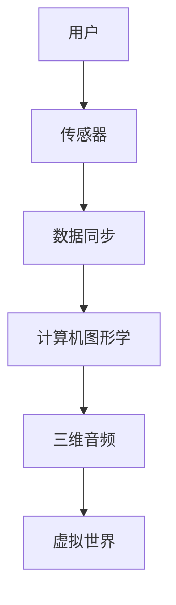
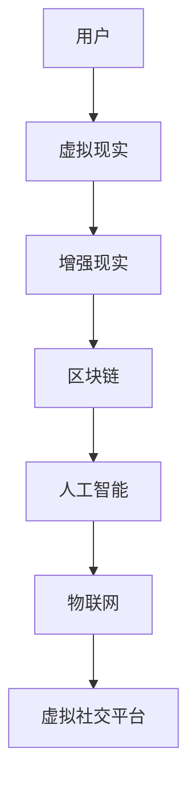
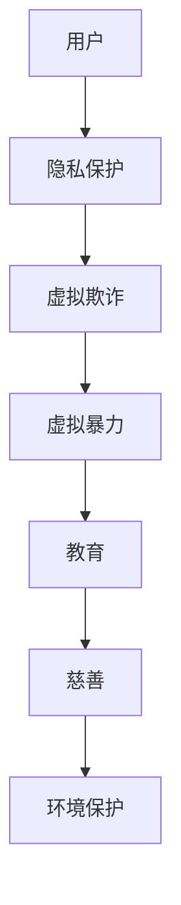

                 


### 引言

随着科技的飞速发展，虚拟现实（VR）和元宇宙（Metaverse）已经成为当前科技领域的热门话题。这两者不仅在技术层面上引人入胜，更在人们的生活和价值观中产生了深远的影响。本文旨在探讨虚拟现实和元宇宙的概念，以及它们如何为人们提供了新的价值和意义。

虚拟现实是一种通过计算机技术生成的人工环境，用户可以通过特殊设备（如VR头盔）进入并与之互动。元宇宙则是一个更为广阔的概念，它不仅包括虚拟现实，还涵盖了物理世界以外的数字世界，如虚拟社交平台、虚拟游戏世界等。

在本文中，我们将首先介绍虚拟现实和元宇宙的基本概念，然后深入探讨价值观在虚拟世界中的体现。接下来，我们将分析虚拟现实和元宇宙技术的发展趋势，以及它们对人们生活方式的影响。最后，我们将讨论如何在元宇宙中构建有意义的价值观，并提出一些最佳实践和未来展望。

### 虚拟现实技术基础

虚拟现实技术的基础可以追溯到上世纪60年代，当时计算机科学家Alan Kay提出了虚拟现实的概念。然而，直到21世纪初，随着硬件和软件技术的进步，虚拟现实才逐渐走向成熟。

#### VR设备的分类

虚拟现实设备可以分为以下几类：

1. **头戴式显示器（HMD）**：如Oculus Rift、HTC Vive等，用户通过HMD进入虚拟世界。
2. **投影式VR**：利用投影设备将虚拟场景投射到现实环境中，如谷歌的ARCore技术。
3. **空间追踪设备**：如微软的Kinect，用于追踪用户的动作和位置。
4. **触觉反馈设备**：如VR手套，提供触觉反馈，增强沉浸感。

#### 虚拟现实的核心技术

虚拟现实的核心技术包括以下几个方面：

1. **计算机图形学**：通过计算生成逼真的三维场景。
2. **三维音频**：模拟现实中的声音传播效果，增强沉浸感。
3. **传感器技术**：用于捕捉用户的动作和位置，如加速度计、陀螺仪等。
4. **数据同步**：确保虚拟场景和用户动作的实时同步。

#### Mermaid流程图

以下是虚拟现实技术架构的Mermaid流程图：



#### 核心算法原理讲解

虚拟现实中的核心算法包括三维建模、场景渲染和交互处理。以下是这些算法的伪代码：

```plaintext
// 三维建模
Model3D createModel(geometryData) {
    // 使用几何数据创建三维模型
    // ...
    return model;
}

// 场景渲染
void renderScene(Scene scene) {
    // 渲染场景
    // ...
}

// 交互处理
void handleInteraction(Interaction interaction) {
    // 处理用户交互
    // ...
}
```

#### 数学模型和公式

虚拟现实中的三维空间可以通过以下数学模型表示：

$$
\vec{P} = (x, y, z)
$$

其中，$\vec{P}$ 表示三维空间中的点，$x$、$y$、$z$ 分别为点在X、Y、Z轴上的坐标。

#### 举例说明

假设用户在虚拟世界中的位置为 $(2, 3, 5)$，我们需要将其转换为屏幕坐标。可以使用以下公式：

$$
\vec{P}_{screen} = \vec{P} \cdot \text{transformMatrix}
$$

其中，$\text{transformMatrix}$ 为变换矩阵。

#### 项目实战

为了更好地理解虚拟现实技术，我们可以搭建一个简单的虚拟现实环境。以下是一个简单的项目实战：

1. **开发环境搭建**：安装Unity引擎和VR设备驱动程序。
2. **源代码实现**：创建一个三维模型，并将其渲染到屏幕上。
3. **代码解读**：分析源代码，理解三维建模、渲染和交互处理的实现细节。
4. **应用解读与分析**：探讨虚拟现实技术在实际应用中的效果和挑战。
5. **项目小结**：总结项目成果，并提出改进方向。

### 元宇宙的兴起与影响

元宇宙（Metaverse）是一个由虚拟世界组成的互联网生态系统，它不仅包括虚拟现实，还涵盖了增强现实（AR）、区块链技术、虚拟社交平台等多个领域。元宇宙的兴起对人们的生活、工作和社会结构产生了深远的影响。

#### 元宇宙的概念

元宇宙可以被视为一个虚拟的“第二世界”，用户可以在其中创建、交互和共享。与虚拟现实不同，元宇宙更加强调虚拟世界与现实世界的融合。

#### 元宇宙的关键技术

1. **区块链技术**：用于确保元宇宙中的交易和数据安全。
2. **虚拟现实技术**：提供沉浸式的用户体验。
3. **人工智能**：用于自动化任务、个性化和智能推荐。
4. **物联网**：实现虚拟世界与现实世界的互联互通。

#### Mermaid流程图

以下是元宇宙技术架构的Mermaid流程图：



#### 核心算法原理讲解

元宇宙中的核心算法包括区块链的加密算法、虚拟世界的建模算法和人工智能的推荐算法。以下是这些算法的伪代码：

```plaintext
// 加密算法
String encryptData(String data) {
    // 加密数据
    // ...
    return encryptedData;
}

// 虚拟世界建模
VirtualWorld createVirtualWorld() {
    // 使用几何数据创建虚拟世界
    // ...
    return world;
}

// 推荐算法
void recommendContent(User user) {
    // 推荐内容
    // ...
}
```

#### 数学模型和公式

元宇宙中的虚拟世界可以通过以下数学模型表示：

$$
\vec{V} = (x, y, z, t)
$$

其中，$\vec{V}$ 表示虚拟世界中的点，$x$、$y$、$z$ 分别为点在X、Y、Z轴上的坐标，$t$ 为时间。

#### 举例说明

假设用户在元宇宙中的位置为 $(2, 3, 5, 10)$，我们需要将其转换为屏幕坐标。可以使用以下公式：

$$
\vec{V}_{screen} = \vec{V} \cdot \text{transformMatrix}
$$

其中，$\text{transformMatrix}$ 为变换矩阵。

#### 项目实战

为了更好地理解元宇宙的概念和技术，我们可以搭建一个简单的元宇宙平台。以下是一个简单的项目实战：

1. **开发环境搭建**：安装Unity引擎、区块链节点和虚拟现实设备驱动程序。
2. **源代码实现**：创建一个虚拟社交平台，用户可以在此平台上创建、交互和共享。
3. **代码解读**：分析源代码，理解区块链、虚拟世界建模和人工智能推荐算法的实现细节。
4. **应用解读与分析**：探讨元宇宙平台在实际应用中的效果和挑战。
5. **项目小结**：总结项目成果，并提出改进方向。

### 价值观在虚拟世界中的体现

在虚拟世界和元宇宙中，价值观的体现变得越来越重要。由于虚拟世界中的行为和决策会直接影响用户的体验和价值观，因此如何在虚拟世界中构建和维护正确的价值观成为一个关键问题。

#### 虚拟世界中的道德问题

1. **隐私保护**：在虚拟世界中，用户的隐私和数据安全至关重要。如何确保用户的隐私不被泄露是一个重要的道德问题。
2. **虚拟欺诈**：虚拟世界中的欺诈行为，如虚拟货币的投机、虚假信息的传播等，也对用户的价值观产生了负面影响。
3. **虚拟暴力**：虚拟世界中的暴力行为，如网络欺凌、仇恨言论等，也对用户的价值观产生了不良影响。

#### 虚拟世界中的社会责任

1. **教育**：虚拟世界可以为用户提供一种新的教育方式，通过虚拟实验、模拟学习等，帮助用户更好地理解和应用知识。
2. **慈善**：虚拟世界中的慈善活动，如虚拟筹款、虚拟志愿活动等，可以帮助用户更好地理解和实践慈善精神。
3. **环境保护**：虚拟世界可以用于模拟和解决现实世界中的环境问题，如气候变化、资源短缺等，帮助用户更好地理解和解决这些问题。

#### Mermaid流程图

以下是虚拟世界中价值观体现的Mermaid流程图：



#### 核心算法原理讲解

虚拟世界中的价值观体现在算法和系统中。以下是虚拟世界中的核心算法原理：

```plaintext
// 隐私保护算法
void protectPrivacy(User user) {
    // 保护用户隐私
    // ...
}

// 虚拟欺诈检测算法
void detectFraud(Transaction transaction) {
    // 检测欺诈行为
    // ...
}

// 暴力行为检测算法
void detectViolence(Action action) {
    // 检测暴力行为
    // ...
}
```

#### 数学模型和公式

虚拟世界中的价值观可以通过以下数学模型表示：

$$
\text{Value} = f(\text{Knowledge}, \text{Experiences}, \text{Actions})
$$

其中，$\text{Value}$ 表示用户的价值观，$f$ 为函数，$\text{Knowledge}$、$\text{Experiences}$、$\text{Actions}$ 分别为用户的知识、经验和行为。

#### 举例说明

假设用户在虚拟世界中的行为包括学习、参与慈善活动和参与环境保护，我们可以使用以下公式计算用户的价值观：

$$
\text{Value}_{user} = f(\text{Knowledge}_{user}, \text{Experiences}_{user}, \text{Actions}_{user})
$$

#### 项目实战

为了更好地理解虚拟世界中价值观的体现，我们可以搭建一个虚拟社区。以下是一个简单的项目实战：

1. **开发环境搭建**：安装Unity引擎、区块链节点和虚拟现实设备驱动程序。
2. **源代码实现**：创建一个虚拟社区平台，用户可以在此平台上学习、参与慈善活动和参与环境保护。
3. **代码解读**：分析源代码，理解隐私保护、虚拟欺诈检测和暴力行为检测的实现细节。
4. **应用解读与分析**：探讨虚拟社区平台在实际应用中的效果和挑战。
5. **项目小结**：总结项目成果，并提出改进方向。

### 总结与未来展望

本文通过逐步分析推理，探讨了虚拟现实、元宇宙以及价值观在虚拟世界中的体现。我们首先介绍了虚拟现实技术的基础，包括VR设备的分类、核心技术、算法原理和项目实战。然后，我们深入分析了元宇宙的兴起与影响，包括关键技术、算法原理和项目实战。最后，我们探讨了价值观在虚拟世界中的体现，包括道德问题、社会责任和项目实战。

在未来，虚拟现实和元宇宙将继续发展，为我们提供更加丰富和多样的体验。同时，如何在虚拟世界中构建和维护正确的价值观也将成为一个重要的课题。通过本文的分析，我们希望能够为读者提供一些启示和思考。

### 作者信息

作者：AI天才研究院/AI Genius Institute & 禅与计算机程序设计艺术 /Zen And The Art of Computer Programming

### 拓展阅读

1. 《虚拟现实技术与应用》：详细介绍了虚拟现实技术的原理和应用。
2. 《元宇宙：从概念到实践》：深入探讨了元宇宙的概念、技术和应用。
3. 《计算机伦理学》：探讨了计算机技术在道德和伦理方面的问题。

### 最佳实践 Tips

1. 在虚拟世界中，确保用户隐私和数据安全至关重要。
2. 在设计虚拟世界时，要充分考虑用户的价值观和道德观念。
3. 在虚拟社区中，鼓励用户参与慈善活动和环境保护，以提升社区的价值观。

