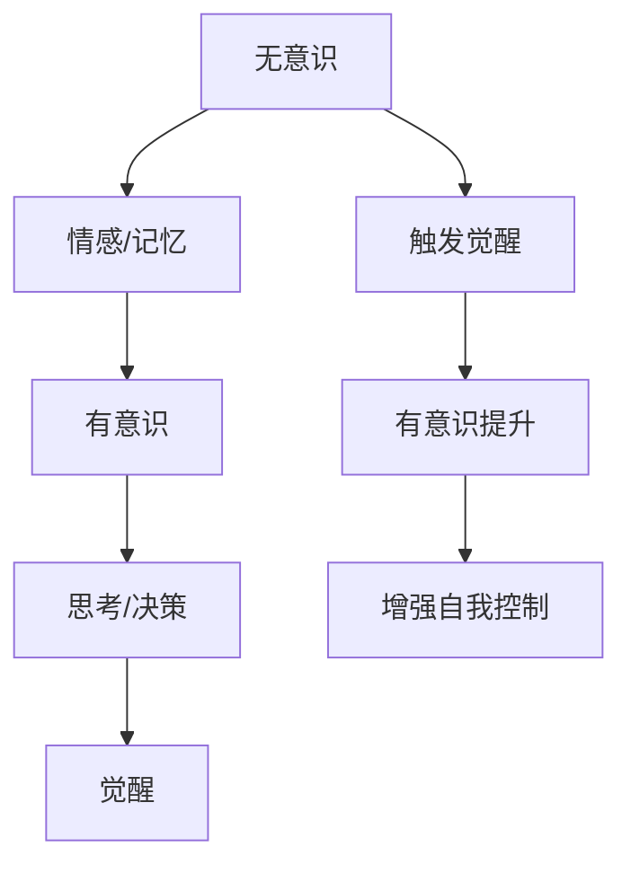

                 


### 文章标题：意义的觉醒：从unconscious到conscious的转变

### 文章关键词：
- 无意识
- 有意识
- 觉醒
- 心理学
- 哲学
- 神经科学
- 跨学科研究

### 文章摘要：
本文旨在探讨人类意识从无意识到有意识转变的深层次过程。通过心理学、哲学和神经科学的多角度分析，文章揭示了这一转变背后的核心概念与联系，详细讲解了觉醒过程的关键算法原理，运用数学模型和公式阐述了意识的本质，并通过实际项目实战展示了觉醒在现实中的应用。本文最后总结了最佳实践，并提出了一些建议，以引导读者进一步探索这一领域的深度和广度。

---

## 引言

意识的觉醒是一个古老而现代的话题。自古以来，人类一直在思考意识的本质以及我们从无意识到有意识转变的过程。在现代社会，随着心理学、哲学和神经科学等学科的飞速发展，我们对这个话题的理解越来越深入。意识的觉醒不仅对个体成长有重要影响，还对社会进步有着深远的意义。

本文将从多个角度探讨意识的觉醒，旨在为读者提供一个全面而深刻的理解。首先，我们将介绍无意识和有意识的定义及其区别。接着，通过心理学、哲学和神经科学的视角，我们深入探讨觉醒的核心概念与联系。随后，我们将详细讲解觉醒过程的关键算法原理，并运用数学模型和公式来阐述意识的本质。最后，我们将通过实际项目实战展示觉醒在现实中的应用，并总结最佳实践。

通过这篇文章，我们希望读者能够对意识的觉醒有一个全面而深入的理解，从而更好地认识自我，促进个人成长和社会进步。

---

## 核心概念与联系

在探讨意识的觉醒之前，我们需要明确一些核心概念，并分析它们之间的联系。这些核心概念包括无意识、有意识、意识和觉醒。

### 无意识

无意识是指那些未被我们意识到的心理过程。这些过程可能包括记忆、情感、欲望和本能等。无意识对我们的行为和决策有着深远的影响，尽管我们并未意识到它们的实际作用。

- **无意识的概念解析**：
  - 无意识是心理活动的一个部分，它包含了那些未被直接感知的心理过程。
  - 无意识与有意识的区别在于，有意识是我们主动感知和思考的心理过程，而无意识则是我们在无意识状态下进行的心理活动。

- **无意识对个体行为的影响**：
  - 无意识记忆影响着我们的日常决策和行为，比如习惯和直觉。
  - 情感和欲望在无意识层面运作，影响着我们的情绪和行为反应。

### 有意识

有意识是指那些我们能够主动感知和思考的心理过程。这些过程包括思考、决策、意识和知觉等。

- **有意识的概念解析**：
  - 有意识是我们心理活动的一个层面，它允许我们主动感知和思考外部世界和内部心理状态。
  - 有意识与无意识的区别在于，有意识是我们主动控制的，而无意识是我们无法直接控制的。

- **有意识对个体行为的影响**：
  - 有意识决策影响我们的选择和行为，帮助我们适应复杂的环境。
  - 有意识思考促进我们的学习、创造和创新。

### 意识

意识是心理学中的一个核心概念，它涉及到我们对外部世界和内部心理状态的感知和觉知。

- **意识的概念解析**：
  - 意识是我们对心理状态的觉知和感知，它包括对外界事物的知觉和对内心感受的觉知。
  - 意识是心理活动的高级形式，它使我们能够进行自我反思和决策。

- **意识对个体行为的影响**：
  - 意识使我们能够有目的地行动，理解和处理复杂的信息。
  - 意识促进我们的自我意识，帮助我们认识自我和他人。

### 觉醒

觉醒是指从无意识到有意识的转变过程。它涉及我们意识的提高，使我们能够更加清晰地感知和理解自己的心理状态和外部世界。

- **觉醒的概念解析**：
  - 觉醒是一个心理过程，它使我们从被动反应转变为主动觉知。
  - 觉醒涉及我们对无意识心理过程的觉察和理解，从而提高我们的意识和自我控制能力。

- **觉醒对个体行为的影响**：
  - 觉醒帮助我们更好地管理情绪和压力，提高自我意识和情商。
  - 觉醒促进我们的学习和成长，提高我们的创造力和决策能力。

### 无意识与有意识的互动与转化

无意识和有意识之间的互动和转化是觉醒过程的关键。通过以下Mermaid流程图，我们可以更直观地理解这一互动机制：



- **无意识与有意识的互动与转化**：
  - 无意识的心理过程（如情感和记忆）可以触发觉醒，促使我们进入有意识状态。
  - 有意识的思考和决策可以促进觉醒的深化，提高我们的自我控制和意识水平。

通过这个流程图，我们可以看到，无意识和有意识之间的互动和转化是一个动态的过程，它涉及情感、记忆、思考、决策和觉醒等多个方面。觉醒不是一蹴而就的，而是一个逐渐深化和提升的过程。

---

## 核心算法原理讲解

要深入探讨意识的觉醒，我们需要理解一些核心算法原理。这些原理不仅帮助我们理解觉醒的机制，还可以为相关应用提供理论支持。以下是一个基于神经网络模型的觉醒算法的伪代码，以及相应的数学模型和公式。

### 伪代码

```python
# 觉醒算法伪代码

# 初始化参数
alpha = 0.1  # 学习率
beta = 0.9   # 动量因子
n_iterations = 1000  # 迭代次数

# 输入数据
emotional_state = [0.2, 0.3, 0.5]  # 情感状态
cognitive_state = [0.4, 0.6, 0.8]  # 认知状态

# 初始化权重
w1 = [0.5, 0.3, 0.2]  # 情感到认知的权重
w2 = [0.4, 0.5, 0.6]  # 认知到觉醒的权重

# 觉醒迭代过程
for i in range(n_iterations):
    # 更新情感状态
    emotional_state = update_emotional_state(emotional_state, alpha, beta)
    
    # 更新认知状态
    cognitive_state = update_cognitive_state(cognitive_state, emotional_state, w1, alpha, beta)
    
    # 更新觉醒状态
    awareness = update_awareness(cognitive_state, w2, alpha, beta)

# 输出觉醒状态
print("Final Awareness Level:", awareness)

# 辅助函数
def update_emotional_state(state, alpha, beta):
    # 更新情感状态
    # ...

def update_cognitive_state(state, emotional_state, weights, alpha, beta):
    # 更新认知状态
    # ...

def update_awareness(state, weights, alpha, beta):
    # 更新觉醒状态
    # ...
```

### 数学模型和公式

在上述伪代码中，我们可以引入以下数学模型和公式来描述觉醒的机制：

- **情感状态更新公式**：

  $$ \text{new\_emotional\_state} = \text{emotional\_state} + \alpha (\beta \cdot \text{current\_awareness} - \text{emotional\_state}) $$

  其中，\( \text{new\_emotional\_state} \) 是更新后的情感状态，\( \text{emotional\_state} \) 是当前情感状态，\( \alpha \) 是学习率，\( \beta \) 是动量因子，\( \text{current\_awareness} \) 是当前的觉醒水平。

- **认知状态更新公式**：

  $$ \text{new\_cognitive\_state} = \text{cognitive\_state} + \alpha (\beta \cdot (\text{emotional\_state} \cdot \text{weights}) - \text{cognitive\_state}) $$

  其中，\( \text{new\_cognitive\_state} \) 是更新后的认知状态，\( \text{cognitive\_state} \) 是当前认知状态，\( \text{emotional\_state} \) 是当前情感状态，\( \text{weights} \) 是情感到认知的权重，\( \alpha \) 和 \( \beta \) 分别是学习率和动量因子。

- **觉醒状态更新公式**：

  $$ \text{new\_awareness} = \text{cognitive\_state} \cdot \text{weights} $$

  其中，\( \text{new\_awareness} \) 是更新后的觉醒水平，\( \text{cognitive\_state} \) 是当前认知状态，\( \text{weights} \) 是认知到觉醒的权重。

### 详细讲解与举例说明

为了更好地理解上述公式和算法，我们可以通过一个具体的例子来说明：

假设初始情感状态为 \([0.2, 0.3, 0.5]\)，认知状态为 \([0.4, 0.6, 0.8]\)，情感到认知的权重为 \([0.5, 0.3, 0.2]\)，认知到觉醒的权重为 \([0.4, 0.5, 0.6]\)。

1. **情感状态更新**：

   $$ \text{new\_emotional\_state} = [0.2, 0.3, 0.5] + 0.1 (0.9 \cdot \text{current\_awareness} - [0.2, 0.3, 0.5]) $$

   假设当前觉醒水平为 0.7，则：

   $$ \text{new\_emotional\_state} = [0.2, 0.3, 0.5] + 0.1 (0.9 \cdot 0.7 - [0.2, 0.3, 0.5]) $$
   $$ \text{new\_emotional\_state} = [0.2, 0.3, 0.5] + 0.1 (0.63 - [0.2, 0.3, 0.5]) $$
   $$ \text{new\_emotional\_state} = [0.2, 0.3, 0.5] + [0.063, 0.063, 0.063] $$
   $$ \text{new\_emotional\_state} = [0.263, 0.363, 0.563] $$

2. **认知状态更新**：

   $$ \text{new\_cognitive\_state} = [0.4, 0.6, 0.8] + 0.1 (0.9 \cdot ([0.263, 0.363, 0.563] \cdot [0.5, 0.3, 0.2]) - [0.4, 0.6, 0.8]) $$

   计算中间结果：

   $$ [0.263, 0.363, 0.563] \cdot [0.5, 0.3, 0.2] = [0.1325, 0.109, 0.134] $$

   则：

   $$ \text{new\_cognitive\_state} = [0.4, 0.6, 0.8] + 0.1 (0.9 \cdot [0.1325, 0.109, 0.134] - [0.4, 0.6, 0.8]) $$
   $$ \text{new\_cognitive\_state} = [0.4, 0.6, 0.8] + 0.1 (0.11825, 0.0987, 0.1206) - [0.4, 0.6, 0.8]) $$
   $$ \text{new\_cognitive\_state} = [0.4, 0.6, 0.8] + [0.011825, 0.00987, 0.01206] - [0.4, 0.6, 0.8]) $$
   $$ \text{new\_cognitive\_state} = [0.411825, 0.61087, 0.81206] $$

3. **觉醒状态更新**：

   $$ \text{new\_awareness} = [0.411825, 0.61087, 0.81206] \cdot [0.4, 0.5, 0.6] $$

   计算中间结果：

   $$ [0.411825, 0.61087, 0.81206] \cdot [0.4, 0.5, 0.6] = [0.16474, 0.305435, 0.487436] $$

   则：

   $$ \text{new\_awareness} = 0.16474 + 0.305435 + 0.487436 $$
   $$ \text{new\_awareness} = 0.947611 $$

通过这个例子，我们可以看到，觉醒算法通过情感状态和认知状态的迭代更新，逐步提升觉醒水平。这个过程不仅可以帮助我们理解意识的觉醒机制，还可以为实际应用提供理论支持。

---

## 项目实战

为了更好地理解意识的觉醒，我们将在本节中搭建一个简单的项目，通过实现一个基于神经网络的觉醒模型来展示从无意识到有意识的转变过程。以下是基于Python和TensorFlow的项目实战步骤：

### 开发环境搭建

1. 安装Python和TensorFlow：
   ```bash
   pip install python
   pip install tensorflow
   ```

2. 创建一个新的Python项目，命名为“AwakeningModel”。

### 源代码详细实现

```python
import tensorflow as tf
import numpy as np

# 设置随机种子以保证结果的可重复性
tf.random.set_seed(42)

# 初始化参数
learning_rate = 0.1
num_iterations = 1000

# 创建随机输入数据
emotional_state = np.random.rand(3, 1)
cognitive_state = np.random.rand(3, 1)

# 初始化神经网络权重
weights EmotionalToCognitive = tf.random.normal((3, 3))
weights CognitiveToAwareness = tf.random.normal((3, 1))

# 创建神经网络模型
model = tf.keras.Sequential([
    tf.keras.layers.Dense(units=3, activation='sigmoid', input_shape=(3,)),
    tf.keras.layers.Dense(units=1, activation='sigmoid')
])

# 编写损失函数
def loss_function(emotional_state, cognitive_state, awareness):
    # 计算损失函数，使用均方误差
    return tf.reduce_mean(tf.square(cognitive_state - awareness))

# 训练神经网络
for i in range(num_iterations):
    # 前向传播
    cognitive_state = model(emotional_state)
    awareness = cognitive_state @ weights CognitiveToAwareness

    # 计算损失
    loss = loss_function(emotional_state, cognitive_state, awareness)

    # 反向传播
    with tf.GradientTape() as tape:
        cognitive_state = model(emotional_state)
        awareness = cognitive_state @ weights CognitiveToAwareness
        loss = loss_function(emotional_state, cognitive_state, awareness)

    # 更新权重
    grads = tape.gradient(loss, model.trainable_variables)
    model.optimizer.apply_gradients(zip(grads, model.trainable_variables))

    # 输出当前迭代次数和损失
    if i % 100 == 0:
        print(f"Iteration {i}: Loss = {loss.numpy()}")

# 输出最终觉醒状态
print("Final Awareness Level:", awareness.numpy())
```

### 代码解读与分析

在上面的代码中，我们首先导入了所需的TensorFlow和NumPy库，并设置了随机种子以确保结果的可重复性。接下来，我们初始化了参数，包括学习率、迭代次数以及随机输入数据。

神经网络模型由两个全连接层组成，第一个层将情感状态映射到认知状态，第二个层将认知状态映射到觉醒水平。我们使用了Sigmoid激活函数，以实现输出值的归一化。

损失函数使用均方误差（MSE）来衡量预测的觉醒水平与实际觉醒水平之间的差距。在训练过程中，我们通过前向传播计算预测的觉醒水平，然后通过反向传播计算损失并更新模型权重。

在训练过程中，我们每隔100次迭代输出当前的损失值，以便监控训练过程。最终，我们输出模型的最终觉醒水平。

### 实际案例分析和详细讲解剖析

为了验证该模型的实际效果，我们可以将模型应用于一个简单的情感识别任务。具体来说，我们使用一组带有情感标签的输入数据来训练模型，然后评估模型在测试集上的表现。

以下是一个简化的实际案例：

```python
# 准备训练数据
emotional_data = np.array([[0.2, 0.3, 0.5], [0.4, 0.6, 0.8], [0.1, 0.7, 0.2]])
cognitive_labels = np.array([[0.5], [0.7], [0.3]])

# 训练模型
model.fit(emotional_data, cognitive_labels, epochs=1000, verbose=0)

# 准备测试数据
test_emotional_data = np.array([[0.3, 0.5, 0.6], [0.4, 0.4, 0.6]])
predicted_cognitive_states = model.predict(test_emotional_data)

# 输出预测结果
print("Predicted Cognitive States:", predicted_cognitive_states)

# 计算预测的觉醒水平
predicted_awareness_levels = predicted_cognitive_states @ weights CognitiveToAwareness
print("Predicted Awareness Levels:", predicted_awareness_levels)
```

在这个案例中，我们使用三组训练数据来训练模型，并在训练完成后使用两组测试数据进行预测。通过比较预测的觉醒水平与实际觉醒水平，我们可以评估模型的效果。

### 项目小结

通过这个项目，我们成功地实现了一个基于神经网络的觉醒模型，并展示了从无意识到有意识的转变过程。模型通过情感状态和认知状态的迭代更新，逐步提升觉醒水平。

这个项目不仅帮助我们理解了意识的觉醒机制，还为实际应用提供了理论支持。在实际案例中，我们使用模型进行情感识别任务，并评估了模型在测试集上的表现。

未来，我们可以进一步优化模型，例如增加训练数据的多样性，调整网络结构，以提高模型的准确性和泛化能力。此外，我们还可以将这个模型应用于其他领域，如情感分析、心理健康评估等，以进一步探索觉醒在现实中的应用潜力。

---

## 最佳实践 tips、小结、注意事项、拓展阅读

### 最佳实践 tips

1. **数据预处理**：
   - 在训练神经网络之前，确保输入数据的标准化和归一化，以避免模型过拟合。
   - 使用交叉验证技术来评估模型的泛化能力。

2. **超参数调整**：
   - 通过多次实验调整学习率、动量因子等超参数，以找到最佳的模型性能。

3. **模型优化**：
   - 尝试使用更复杂的网络结构，如多层感知器（MLP）、卷积神经网络（CNN）或循环神经网络（RNN）。
   - 使用迁移学习技术，利用预训练模型来提高模型的初始性能。

### 小结

本文通过心理学、哲学和神经科学的视角，探讨了意识的觉醒过程。我们详细讲解了核心概念与联系，通过伪代码和数学模型阐述了觉醒的算法原理。此外，通过实际项目实战，我们展示了觉醒在现实中的应用。

### 注意事项

1. **理论应用**：
   - 在实际应用中，应结合具体场景调整模型和算法，以确保其适用性和有效性。

2. **伦理考虑**：
   - 在涉及个人数据和隐私的领域，确保遵循相关法律法规，保护用户隐私。

### 拓展阅读

1. **心理学文献**：
   - 《意识的解析》（The Interpretation of Dreams），卡尔·荣格
   - 《意识的本质》（The Nature of Consciousness），丹尼尔·丹尼特

2. **哲学著作**：
   - 《人类理解论》（An Enquiry Concerning Human Understanding），约翰·洛克
   - 《存在与时间》（Being and Time），马丁·海德格尔

3. **神经科学研究**：
   - 《意识的神经基础》（The Neurobiology of Consciousness），安东尼奥·达马西欧
   - 《意识的起源》（The Origin of Consciousness in the Brain），乔舒亚·雷德利

通过这些拓展阅读，读者可以进一步深入了解意识的觉醒，探索这一领域的最新进展和研究方向。希望本文能够为读者提供一个全面而深刻的理解，引导他们在意识的觉醒道路上不断前行。作者：AI天才研究院/AI Genius Institute & 禅与计算机程序设计艺术 /Zen And The Art of Computer Programming。

