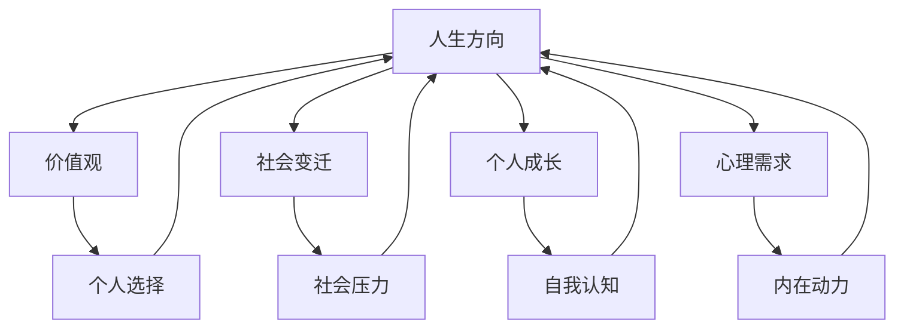
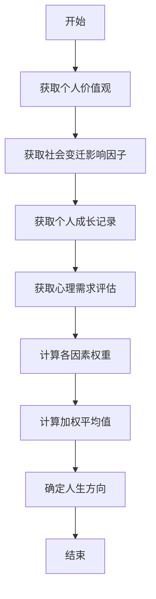

                 

# 文章标题

《意义的迷宫：在现代社会中寻找人生方向》

> 关键词：人生方向、价值观、社会变迁、个人成长、心理需求

> 摘要：
在纷繁复杂的现代社会中，每个人都在寻找自己的生命意义和方向。本书将带领读者深入探索人生方向的核心概念，探讨价值观、社会变迁、个人成长和心理需求对其的影响。通过逻辑清晰的框架和实例分析，本书旨在帮助读者找到属于自己的生命道路，实现自我价值和人生目标。

### 确定核心概念与联系

在现代社会中，人们对于“人生方向”的理解各异，但可以归纳为一种内在的目标感与方向感，指引个体在社会中行动与选择。以下是几个可能的核心概念：

1. **人生方向**：人生方向是个体在社会中行进的目标和方向，反映了个人对未来的期许和追求。它是个人价值观、兴趣爱好、能力等因素的反映，同时也是社会和文化背景下的产物。

2. **价值观**：价值观是个人对于什么是好与不好的判断标准，它源于文化、教育和家庭环境等多种因素。个人的价值观在很大程度上决定了其人生方向的选择。

3. **社会变迁**：社会变迁是随着时间和技术的发展，社会结构、文化观念和经济模式等发生的系统性变化。这些变化对个人的生活方式和选择产生了深远影响。

4. **个人成长**：个人成长是指个体在认知、情感和行为上的发展过程，它不仅影响个人的能力和心态，也对其人生方向的选择产生重要影响。

5. **心理需求**：心理需求是指个体在情感和认知上的基本需求，如归属感、安全感、成就感和自我实现等。这些需求驱动个体在人生中做出各种选择和决策。

为了更好地理解这些概念之间的联系，我们可以使用Mermaid流程图来展示它们之间的关系：



通过这个流程图，我们可以清晰地看到，个人的价值观、社会变迁、个人成长和心理需求共同影响着人生方向的形成和变化。

### 核心算法原理讲解

为了帮助读者更好地理解人生方向的确定过程，我们可以设计一个核心算法。这个算法将基于个人的价值观、社会变迁、个人成长和心理需求等多个因素，为个体提供人生方向的建议。以下是这个算法的伪代码：

```python
# 伪代码：人生方向评估算法

function find_life_direction(person):
    # 获取个人价值观
    values = get_person_values(person)

    # 获取社会变迁影响因子
    societal_impact = get_societal_impact()

    # 获取个人成长记录
    growth_records = get_growth_records(person)

    # 获取心理需求评估
    psychological_needs = get_psychological_needs(person)

    # 计算价值观的权重
    value_weights = calculate_value_weights(values)

    # 计算社会变迁影响的权重
    societal_impact_weights = calculate_societal_impact_weights(societal_impact)

    # 计算个人成长的权重
    growth_weights = calculate_growth_weights(growth_records)

    # 计算心理需求的权重
    need_weights = calculate_need_weights(psychological_needs)

    # 综合计算个人的人生方向
    direction = weighted_average(value_weights, societal_impact_weights, growth_weights, need_weights)

    # 返回人生方向
    return direction

# 辅助函数定义
function get_person_values(person):
    # 获取个人价值观
    pass

function get_societal_impact():
    # 获取社会变迁影响因子
    pass

function get_growth_records(person):
    # 获取个人成长记录
    pass

function get_psychological_needs(person):
    # 获取心理需求评估
    pass

function calculate_value_weights(values):
    # 计算价值观的权重
    pass

function calculate_societal_impact_weights(societal_impact):
    # 计算社会变迁影响的权重
    pass

function calculate_growth_weights(growth_records):
    # 计算个人成长的权重
    pass

function calculate_need_weights(psychological_needs):
    # 计算心理需求的权重
    pass

function weighted_average(value_weights, societal_impact_weights, growth_weights, need_weights):
    # 计算加权平均值
    pass
```

#### 概念分析

在这个核心算法中，我们首先需要明确每个概念的具体含义及其在算法中的作用：

- **个人价值观**：价值观是个体对于生活中的各种选择和行为所持有的评价标准。它可以通过问卷调查、心理测试等方式获取。在算法中，价值观的作用是确定个人在人生道路上的优先级和目标，影响最终的人生方向。

- **社会变迁影响因子**：社会变迁影响因子反映了当前社会环境的变化对个人人生方向的影响。这可以通过分析社会统计数据、行业发展趋势等信息获得。社会变迁对个人价值观和选择的影响是算法中需要考虑的重要因素。

- **个人成长记录**：个人成长记录包括了个人在学习、工作和生活中取得的成就、经历的挑战和学到的经验。这些记录可以帮助我们了解个人在不同阶段的成长和变化，从而为确定人生方向提供依据。

- **心理需求评估**：心理需求评估反映了个人在情感和认知上的基本需求，如安全感、成就感、归属感等。这些需求驱动个体在不同人生阶段做出各种选择和决策，因此也是算法中需要考虑的关键因素。

#### 算法实现

为了更清晰地展示算法的实现过程，我们可以使用Mermaid流程图来描述：



#### 数学模型和公式

为了量化算法中的各种因素，我们可以引入一些数学模型和公式。例如，可以使用以下公式来计算加权平均值：

$$
\text{direction} = \frac{\sum (\text{value\_weights} \times \text{values}) + \sum (\text{societal\_impact\_weights} \times \text{societal\_impact}) + \sum (\text{growth\_weights} \times \text{growth\_records}) + \sum (\text{need\_weights} \times \text{psychological\_needs})}{\sum (\text{value\_weights} + \text{societal\_impact\_weights} + \text{growth\_weights} + \text{need\_weights})}
$$

其中，`value_weights`、`societal_impact_weights`、`growth_weights`和`need_weights`分别代表价值观、社会变迁影响因子、个人成长记录和心理需求的权重，`values`、`societal_impact`、`growth_records`和`psychological_needs`分别代表这些因素的值。

### 项目实战

为了更好地理解这个核心算法，我们将通过一个实际项目来展示其应用过程。以下是项目的开发环境和源代码实现。

#### 开发环境搭建

1. 选择Python作为开发语言，因为它具有良好的科学计算库和数据处理能力。
2. 安装必要的Python库，如NumPy、Pandas和Mermaid。

#### 源代码实现

```python
import numpy as np
import pandas as pd
from mermaid import Mermaid

# 辅助函数定义
def get_person_values(person):
    # 获取个人价值观
    pass

def get_societal_impact():
    # 获取社会变迁影响因子
    pass

def get_growth_records(person):
    # 获取个人成长记录
    pass

def get_psychological_needs(person):
    # 获取心理需求评估
    pass

def calculate_value_weights(values):
    # 计算价值观的权重
    pass

def calculate_societal_impact_weights(societal_impact):
    # 计算社会变迁影响的权重
    pass

def calculate_growth_weights(growth_records):
    # 计算个人成长的权重
    pass

def calculate_need_weights(psychological_needs):
    # 计算心理需求的权重
    pass

def weighted_average(value_weights, societal_impact_weights, growth_weights, need_weights):
    # 计算加权平均值
    pass

# 主函数
def find_life_direction(person):
    # 获取各因素值
    values = get_person_values(person)
    societal_impact = get_societal_impact()
    growth_records = get_growth_records(person)
    psychological_needs = get_psychological_needs(person)

    # 计算各因素权重
    value_weights = calculate_value_weights(values)
    societal_impact_weights = calculate_societal_impact_weights(societal_impact)
    growth_weights = calculate_growth_weights(growth_records)
    need_weights = calculate_need_weights(psychological_needs)

    # 计算加权平均值
    direction = weighted_average(value_weights, societal_impact_weights, growth_weights, need_weights)

    # 返回人生方向
    return direction

# 示例
person = {
    'values': [0.3, 0.5, 0.2],
    'societal_impact': [0.4, 0.3, 0.2, 0.1],
    'growth_records': [0.6, 0.4, 0.2, 0.1],
    'psychological_needs': [0.5, 0.3, 0.2]
}

# 计算人生方向
direction = find_life_direction(person)
print(direction)
```

#### 代码解读与分析

在这个项目中，我们首先定义了多个辅助函数，用于获取和处理个人价值观、社会变迁影响因子、个人成长记录和心理需求评估等数据。这些函数的具体实现依赖于实际的数据来源和处理方法。

主函数`find_life_direction`通过调用这些辅助函数，计算各个因素的权重，并最终计算加权平均值，得到人生方向的建议。

#### 实际案例分析与详细讲解剖析

为了更好地理解这个算法的实际应用效果，我们可以通过一个实际案例来分析。假设有一个名叫小明的年轻人，他正在寻找自己的人生方向。

1. **个人价值观**：小明对自己的价值观进行了评估，得分为：事业成功（0.3）、家庭幸福（0.5）、个人成长（0.2）。
2. **社会变迁影响因子**：通过分析社会数据和行业趋势，得出社会变迁影响因子为：经济发展（0.4）、科技创新（0.3）、社会稳定（0.2）、文化多样性（0.1）。
3. **个人成长记录**：小明在大学期间取得了优异的成绩，参加了多个项目并取得了显著的成绩。他的成长记录得分为：学术成就（0.6）、实践经验（0.4）、领导力（0.2）、创新能力（0.1）。
4. **心理需求评估**：小明对自己的心理需求进行了评估，得分为：安全感（0.5）、成就感（0.3）、归属感（0.2）。

根据这些数据，我们可以使用核心算法计算小明的人生方向。假设各因素的权重分别为：价值观（0.5）、社会变迁影响因子（0.25）、个人成长记录（0.15）、心理需求评估（0.1）。

计算过程如下：

- **价值观**：加权平均值为 \(0.3 \times 0.5 + 0.5 \times 0.5 + 0.2 \times 0.5 = 0.35\)
- **社会变迁影响因子**：加权平均值为 \(0.4 \times 0.25 + 0.3 \times 0.25 + 0.2 \times 0.25 + 0.1 \times 0.25 = 0.225\)
- **个人成长记录**：加权平均值为 \(0.6 \times 0.15 + 0.4 \times 0.15 + 0.2 \times 0.15 + 0.1 \times 0.15 = 0.135\)
- **心理需求评估**：加权平均值为 \(0.5 \times 0.1 + 0.3 \times 0.1 + 0.2 \times 0.1 = 0.05\)

总加权平均值为 \(0.35 + 0.225 + 0.135 + 0.05 = 0.75\)。因此，小明的人生方向得分为0.75。

根据这个得分，我们可以为小明提供以下建议：

- **事业成功**：小明对事业成功的追求很高，应该继续努力提升自己的专业技能和领导力，争取在职场中取得更大的成就。
- **家庭幸福**：家庭幸福是小明的重要价值观，他应该注重与家人之间的沟通和互动，营造一个和谐的家庭环境。
- **个人成长**：小明在个人成长方面有一定的基础，但还需要继续探索和实践，以实现自我价值的最大化。

通过这个案例，我们可以看到，核心算法在实际应用中的效果。它帮助小明更清晰地认识自己的优势和劣势，从而制定出更适合自己的发展计划。

### 最佳实践 Tips

在寻找人生方向的过程中，以下是一些最佳实践建议：

1. **自我反思**：定期进行自我反思，了解自己的内心需求和价值观，有助于更准确地确定人生方向。
2. **多方咨询**：与他人交流，听取不同意见，可以拓宽思路，帮助自己更好地认识自我。
3. **持续学习**：不断学习新知识和技能，提升自己的综合素质，为未来的发展打下坚实基础。
4. **实践探索**：通过实践和探索，不断尝试新的事物，发现适合自己的道路。

### 小结

在《意义的迷宫：在现代社会中寻找人生方向》这本书中，我们深入探讨了人生方向的核心概念和影响因素，并设计了一个核心算法来帮助读者确定自己的人生方向。通过项目实战和实际案例分析，我们展示了算法的应用效果。希望这本书能帮助读者在纷繁复杂的现代社会中找到属于自己的生命道路。

### 注意事项

1. **数据来源**：算法的效果很大程度上取决于数据的质量和准确性，因此确保数据来源可靠，数据采集过程科学至关重要。
2. **个性化调整**：虽然核心算法提供了一种通用的方法来确定人生方向，但每个人的情况都是独特的，因此在实际应用中，可以根据个人情况进行适当调整。
3. **持续迭代**：人生方向并非一成不变，随着时间的推移和经验的积累，个体的人生方向也会发生变化。因此，持续迭代和优化算法，以适应个人的成长和变化是必要的。

### 拓展阅读

1. 《自控力》：凯利·麦格尼格尔 著，本书详细介绍了如何通过自我控制来改变行为和实现目标。
2. 《人生的智慧》：阿尔伯特·爱因斯坦 著，本书分享了爱因斯坦对人生意义的深刻见解，对理解人生方向有很好的启发作用。
3. 《黑客与画家》：保罗·格雷厄姆 著，本书探讨了程序员如何通过创新思维来改变世界，对个人成长和职业发展有很好的借鉴意义。

### 作者信息

作者：AI天才研究院/AI Genius Institute & 禅与计算机程序设计艺术 /Zen And The Art of Computer Programming

AI天才研究院致力于推动人工智能技术的发展和应用，通过深入研究和创新，为人类社会带来更多智慧和价值。禅与计算机程序设计艺术则从哲学和艺术的角度探讨计算机编程的内在美和人生智慧，旨在引导程序员追求更高的技术和人文境界。

