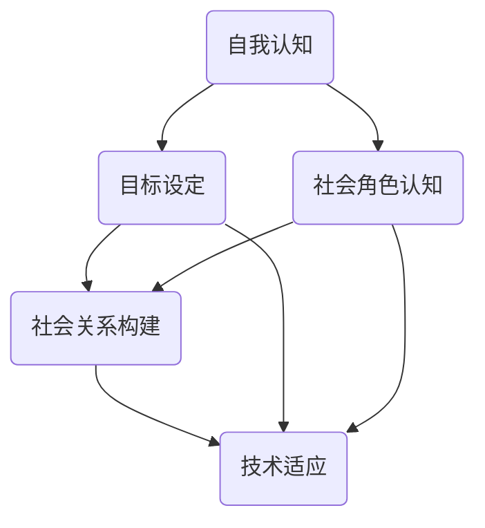

                 

### 引言

在信息技术迅猛发展的今天，人工智能（AI）已经成为推动社会进步的重要力量。从机器学习到深度学习，从自然语言处理到图像识别，AI技术正在深刻地改变着我们的生活方式和工作方式。然而，随着技术的不断进步，一个日益突出的问题也引起了人们的关注：意义。在AI技术的帮助下，我们能够实现前所未有的自动化和智能化，但这些技术本身是否能够带来真正的意义？我们如何确保技术的发展与人类意义的追求相协调？

本文旨在探讨“意义的重构：个人与社会的双重任务”，通过逻辑清晰、结构紧凑的论证，揭示在人工智能时代，个人与社会如何通过重构意义来应对技术变革带来的挑战。本文将分以下几个部分进行论述：

1. **核心概念与理论**：首先，我们将介绍意义的本质，包括意义的起源、分类和重构理论框架。
2. **个人层面的意义重构**：接下来，我们将探讨自我认知、个人目标设定等个人层面的意义重构方法。
3. **社会层面的意义重构**：我们将讨论社会角色的认知与扮演、社会关系的构建与维护等社会层面的意义重构策略。
4. **案例分析**：通过具体的案例，我们将分析个人与社会层面意义重构的成功实践。
5. **数学模型与算法讲解**：我们将介绍意义重构的数学模型和算法，包括概率论和神经网络的应用。
6. **项目实战**：通过一个实际项目，我们将展示如何将意义重构的理论应用于实际开发中。

本文的核心观点是，在人工智能时代，意义的重构不仅是对个人的自我提升和目标实现的追求，也是对社会的和谐发展和共同繁荣的探索。通过逻辑分析和技术解释，我们将逐步揭示意义重构的必要性和实现途径。

### 核心关键词

- 人工智能（AI）
- 意义重构
- 自我认知
- 社会角色
- 社会关系
- 数学模型
- 神经网络
- 案例分析
- 项目实战

### 摘要

本文探讨了在人工智能时代，个人与社会如何通过重构意义来应对技术变革带来的挑战。首先，我们介绍了意义的本质，包括起源、分类和重构理论框架。接着，我们分析了个人层面的意义重构方法，如自我认知和个人目标设定。随后，我们讨论了社会层面的意义重构策略，包括社会角色的认知与扮演、社会关系的构建与维护。通过具体案例，我们展示了意义重构的成功实践。最后，我们介绍了意义重构的数学模型和算法，并通过实际项目展示了如何将这些理论应用于实际开发中。本文旨在为个人和社会提供一套系统化的意义重构方法，以适应人工智能时代的变化和挑战。

## 第一部分：核心概念与理论

在深入探讨意义的重构之前，我们首先需要了解意义的本质及其相关理论。意义不仅仅是抽象的概念，它是人类行为、决策和互动的基础。意义的本质可以从多个角度进行探讨，包括哲学、心理学、社会学和信息技术等。

### 1.1 意义的起源

意义的起源可以追溯到人类进化的早期阶段。作为社会性生物，人类在长期的自然选择过程中逐渐发展出了对环境、社会和文化的认知能力。这些认知能力不仅帮助人类生存，还推动了社会合作和文化传承。从哲学角度来看，意义起源于人类的意识活动。康德认为，意义是认知主体的主观赋予，而黑格尔则认为意义是历史和社会发展的结果。

心理学方面，意义被认为是个体对事物赋予的内在价值和意义。心理学家马斯洛提出的需求层次理论指出，人的需求从基本的生理需求到自我实现的需求，每一个层次都包含了特定的意义。这些需求不仅驱动了个体的行为，也赋予了行为以意义。

在社会学中，意义是社会互动和文化传承的产物。涂尔干认为，社会事实具有强制性，这些事实不仅是个人行为的规范，也是群体共同的意义系统。因此，意义的起源不仅仅是个体主观的体验，更是社会共识的结果。

### 1.2 意义的分类

意义的分类可以从多个维度进行，其中最常见的分类方法是将意义分为个人意义和社会意义。

**个人意义**：个人意义是指个体对自身生活、行为和目标所赋予的意义。个人意义通常与个体的价值观、信念、兴趣和目标密切相关。例如，一个人可能将家庭、职业成就、健康或个人成长视为生活中最重要的意义。个人意义是个体内在驱动力的源泉，也是个体行为决策的重要依据。

**社会意义**：社会意义是指在社会互动和文化传承中形成的意义。社会意义通常与个体的社会角色、社会地位和社会责任密切相关。例如，一个人在家庭中扮演的角色、在工作中的职责，以及在社区中的贡献，都是社会意义的体现。社会意义不仅帮助个体理解自己在社会中的位置，也为社会秩序和文化传承提供了基础。

**多维度分析**：除了个人意义和社会意义，意义还可以从其他维度进行分析。例如，从心理学角度看，意义可以分为心理意义和情绪意义。心理意义是指个体对事物的认知和理解，而情绪意义则是指个体在情感层面上的体验和感受。此外，从哲学角度，意义还可以分为客观意义和主观意义。客观意义是指事物本身所固有的属性和意义，而主观意义则是指个体对事物的主观感受和解释。

### 1.3 意义的重构理论框架

意义重构是指通过重新审视和重新定义意义，以适应新的环境和情境。在人工智能时代，意义重构显得尤为重要，因为技术的飞速发展不仅改变了我们的生活方式，也挑战了我们对意义的基本认知。

**重构的意义**：意义重构不仅仅是简单地改变对意义的理解，它涉及到对传统价值观、信念和行为模式的反思和重新定义。通过意义重构，个体和社会可以更有效地应对技术变革带来的挑战，找到新的生活和工作方式，实现个人成长和社会进步。

**重构的理论框架**：意义重构的理论框架可以从以下几个方面进行构建：

1. **自我认知**：自我认知是意义重构的基础。只有了解自己，个体才能更好地理解自己的意义，并对其进行调整和重构。
2. **目标设定**：目标设定是意义重构的重要步骤。明确的目标可以帮助个体在意义重构过程中找到方向和动力。
3. **社会角色认知**：社会角色认知是意义重构的重要组成部分。个体需要理解自己在社会中的角色和责任，以更好地实现个人与社会意义。
4. **社会关系构建**：社会关系的构建是意义重构的保障。和谐的社会关系可以帮助个体在意义重构过程中获得支持和合作。
5. **技术适应**：技术适应是意义重构的关键。个体需要适应新技术，利用技术提升自己的生活质量和工作效率。

**Mermaid流程图**：为了更直观地展示意义重构的理论框架，我们使用Mermaid流程图来描述各个要素之间的关系。



在这个流程图中，自我认知、目标设定、社会角色认知、社会关系构建和技术适应是意义重构的核心要素。这些要素相互关联，共同构成了意义重构的理论框架。

### 小结

通过本章节的探讨，我们了解了意义的起源、分类和重构理论框架。意义的起源可以追溯到人类进化的早期阶段，心理学、哲学和社会学为意义的本质提供了不同的解释。意义的分类有助于我们更深入地理解个人与社会意义的不同维度。最后，通过Mermaid流程图，我们展示了意义重构的理论框架，为后续章节的讨论奠定了基础。

## 第1章：意义的本质

### 1.1 意义的起源

意义的起源是一个复杂且多维度的议题，涉及到人类的历史、心理学、哲学和社会学等多个领域。探讨意义的起源，首先要回到人类进化的早期阶段。

**人类进化与意义**：作为社会性动物，人类在进化过程中逐渐发展出了对环境的认知能力，这种认知能力不仅有助于个体的生存，也促进了社会合作和文化的形成。从生物学角度来看，意义起源于人类大脑的进化。随着大脑的发展，人类开始具备抽象思维和语言能力，这为意义的概念提供了基础。

**心理学视角**：在心理学领域，意义的起源与人类的认知和情感发展密切相关。瑞士心理学家皮亚杰认为，儿童在认知发展的过程中逐渐形成了对世界的基本理解，这种理解构成了他们对事物赋予意义的基础。另外，心理学家马斯洛的需求层次理论也指出，人类对意义的追求源自于对更高层次需求的满足，如自我实现和自我价值。

**哲学视角**：哲学上对意义的探讨可以追溯到古希腊哲学家。柏拉图和亚里士多德都认为，意义是事物的本质属性，是人类通过理性思考所揭示的。德国哲学家康德则认为，意义是认知主体对客体进行感知和理解的结果，是主观与客观相互作用的结果。

**社会学视角**：在社会学中，意义的起源被认为是社会互动和文化传承的产物。社会学家涂尔干认为，社会事实具有强制性，这些事实不仅是个人行为的规范，也是群体共同的意义系统。因此，意义的起源不仅仅是个体主观的体验，更是社会共识的结果。

综上所述，意义的起源是一个综合性的概念，它涉及到了人类进化的生物学基础、心理学的认知发展、哲学的理性思考以及社会学的社会互动和文化传承。这些不同领域的探讨为我们理解意义的本质提供了多角度的视角。

### 1.2 意义的分类

在理解了意义的起源后，我们接下来需要探讨意义的分类。意义的分类有助于我们更深入地理解个人和社会如何赋予事物以意义。

**个人意义**：个人意义是指个体对自身生活、行为和目标所赋予的意义。个人意义通常与个体的价值观、信念、兴趣和目标密切相关。个人意义的类型可以分为以下几种：

1. **价值观意义**：价值观意义是指个体根据自身价值观对事物赋予的意义。例如，一个人可能将家庭、正义或自由视为最重要的价值观，并以此为基础对生活和工作中的事件赋予意义。
2. **目标意义**：目标意义是指个体为实现特定目标所赋予的意义。例如，一个人可能将职业成就、学术成就或个人成长视为目标，并为之付出努力。
3. **情感意义**：情感意义是指个体在情感层面上对事物赋予的意义。例如，一个人可能将一段友情、一段爱情或一次旅行视为生命中最重要的情感体验。
4. **心理意义**：心理意义是指个体在心理层面上的认知和理解。例如，一个人可能将学习、思考或创造视为心理上的满足。

**社会意义**：社会意义是指在社会互动和文化传承中形成的意义。社会意义通常与个体的社会角色、社会地位和社会责任密切相关。社会意义的类型可以分为以下几种：

1. **社会角色意义**：社会角色意义是指个体在社会中扮演不同角色时所赋予的意义。例如，一个人可能将作为家庭成员、职业人士或公民视为重要的社会角色。
2. **社会责任意义**：社会责任意义是指个体对自身在社会中应承担的责任所赋予的意义。例如，一个人可能认为作为公民，有责任参与社会事务、帮助他人或保护环境。
3. **文化意义**：文化意义是指文化传统和价值观对个体行为和决策所赋予的意义。例如，某些文化可能强调集体主义，而另一些文化可能更强调个人主义，这些文化差异影响了个体对事物赋予的意义。
4. **社会规范意义**：社会规范意义是指社会规范和道德准则对个体行为和决策所赋予的意义。例如，某些社会可能认为诚实、正直和公正是非常重要的价值观，因此这些价值观在个体行为中具有重要的意义。

**多维度分析**：除了个人意义和社会意义，意义还可以从其他维度进行分析。例如，从心理学角度看，意义可以分为心理意义和情绪意义。心理意义是指个体对事物的认知和理解，而情绪意义则是指个体在情感层面上的体验和感受。此外，从哲学角度，意义还可以分为客观意义和主观意义。客观意义是指事物本身所固有的属性和意义，而主观意义则是指个体对事物的主观感受和解释。

通过以上对意义的分类和维度分析，我们可以更全面地理解个人和社会如何赋予事物以意义。个人意义的分类有助于我们理解个体行为和决策的内在驱动力，而社会意义的分类则有助于我们理解社会规范和文化传统如何影响个体行为。

### 1.3 意义的重构理论框架

意义重构是指通过重新审视和重新定义意义，以适应新的环境和情境。在人工智能时代，意义重构显得尤为重要，因为技术的飞速发展不仅改变了我们的生活方式，也挑战了我们对意义的基本认知。

**重构的意义**：意义重构不仅仅是简单地改变对意义的理解，它涉及到对传统价值观、信念和行为模式的反思和重新定义。通过意义重构，个体和社会可以更有效地应对技术变革带来的挑战，找到新的生活和工作方式，实现个人成长和社会进步。

**重构的理论框架**：意义重构的理论框架可以从以下几个方面进行构建：

1. **自我认知**：自我认知是意义重构的基础。只有了解自己，个体才能更好地理解自己的意义，并对其进行调整和重构。
   - **自我认知的重要性**：自我认知是指个体对自己的理解，包括性格、能力、兴趣和价值观等方面。通过自我认知，个体可以明确自己的优势和不足，找到自己真正的兴趣和目标。
   - **自我认知的方法**：自我认知的方法包括内省、反思和自我探索。内省是指通过自我思考来了解自己，反思是指通过回顾过去的行为和经历来了解自己，自我探索是指通过实践和体验来了解自己。

2. **目标设定**：目标设定是意义重构的重要步骤。明确的目标可以帮助个体在意义重构过程中找到方向和动力。
   - **目标设定的原则**：目标设定需要遵循SMART原则，即目标要具体（Specific）、可衡量（Measurable）、可实现（Achievable）、相关性（Relevant）和时限性（Time-bound）。
   - **目标设定的方法**：目标设定的方法包括SMART目标、GROW模型等。SMART目标是指将目标设定得具体、可衡量、可实现、相关和时限性；GROW模型是指将目标设定分为目标（Goal）、现状（Reality）、障碍（Obstacles）和行动（Way forward）四个步骤。

3. **社会角色认知**：社会角色认知是意义重构的重要组成部分。个体需要理解自己在社会中的角色和责任，以更好地实现个人与社会意义。
   - **社会角色的多样性**：社会角色是多样的，包括家庭成员、职业人士、公民等。每个角色都有其特定的职责和意义。
   - **社会角色的认知障碍**：个体在社会角色认知过程中可能遇到认知障碍，如角色冲突、角色模糊等。角色冲突是指同时扮演多个角色时的矛盾，角色模糊是指对角色职责的不明确。

4. **社会关系构建**：社会关系的构建是意义重构的保障。和谐的社会关系可以帮助个体在意义重构过程中获得支持和合作。
   - **社会关系的类型**：社会关系可以分为血缘关系、地缘关系和友谊关系等。每种关系都有其独特的特点和价值。
   - **社会关系构建的策略**：社会关系构建的策略包括沟通技巧、共同兴趣和社会支持系统。沟通技巧是指有效的沟通方法，共同兴趣是指共同的话题和爱好，社会支持系统是指社会关系的网络和资源。

5. **技术适应**：技术适应是意义重构的关键。个体需要适应新技术，利用技术提升自己的生活质量和工作效率。
   - **技术适应的重要性**：随着技术的发展，新技术已经成为生活和工作中不可或缺的一部分。适应新技术可以帮助个体更好地应对新的挑战，提高生活和工作效率。
   - **技术适应的方法**：技术适应的方法包括学习新技术、掌握新工具和应用新技术。学习新技术是指通过培训和学习课程来掌握新技能，掌握新工具是指使用新技术和工具来提升工作效率，应用新技术是指将新技术应用到实际工作和生活中。

**Mermaid流程图**：为了更直观地展示意义重构的理论框架，我们使用Mermaid流程图来描述各个要素之间的关系。


在这个流程图中，自我认知、目标设定、社会角色认知、社会关系构建和技术适应是意义重构的核心要素。这些要素相互关联，共同构成了意义重构的理论框架。

### 小结

通过本章的探讨，我们了解了意义的起源、分类和重构理论框架。意义的起源可以追溯到人类进化的早期阶段，心理学、哲学和社会学为意义的本质提供了不同的解释。意义的分类有助于我们更深入地理解个人和社会如何赋予事物以意义。最后，通过Mermaid流程图，我们展示了意义重构的理论框架，为后续章节的讨论奠定了基础。

## 第2章：自我认知

### 2.1 自我认知的重要性

自我认知是指个体对自己内在特质、能力和需求的认知过程。在人工智能时代，自我认知的重要性愈发凸显。首先，自我认知有助于个体明确自己的价值观和信念，从而在复杂的决策过程中保持一致性和方向感。其次，自我认知能够帮助个体识别自身的优势和弱点，进而在职业发展和个人成长中做出更明智的选择。最后，自我认知有助于个体建立积极的心态，增强心理韧性，更好地应对生活中的挑战。

在人工智能时代，自我认知的重要性主要体现在以下几个方面：

1. **价值观和信念的明确**：在快速变化的社会环境中，个体需要明确的价值观和信念来指导自己的行为。自我认知能够帮助个体深入了解自己的核心价值观，从而在面对诱惑和压力时保持坚定和清醒。
2. **职业发展的决策**：随着人工智能技术的普及，职业环境发生了巨大变化。个体需要通过自我认知来识别自己的职业兴趣和优势，选择与自己价值观和兴趣相符的职业路径，实现职业发展和个人成长。
3. **心理韧性的培养**：人工智能时代带来了前所未有的机遇和挑战，个体需要具备较强的心理韧性来应对生活中的挫折和压力。自我认知有助于个体了解自己的情绪和心理状态，从而采取积极的应对策略，提升心理韧性。
4. **生活质量的提升**：自我认知能够帮助个体更好地管理自己的生活，找到适合自己的生活方式和节奏。通过自我认知，个体可以明确自己的需求和目标，从而提升生活质量和工作效率。

### 2.2 自我认知的挑战

尽管自我认知在人工智能时代具有重要意义，但个体在实际认知过程中仍面临诸多挑战。以下是一些常见的自我认知挑战：

1. **信息过载**：随着互联网和社交媒体的普及，个体接收到的信息量巨大，这可能导致认知负担加重，影响自我认知的准确性。信息过载使个体难以区分重要信息和无关信息，从而影响对自身特质和需求的判断。
2. **社会压力**：在现代社会中，个体常常面临来自家庭、工作和社会的各种压力。这些压力可能导致个体产生负面情绪，影响自我认知的客观性和准确性。例如，过度追求社会认可和成功可能导致个体忽视自身的真实需求和价值观。
3. **心理障碍**：一些心理障碍，如自卑、焦虑和抑郁等，可能会阻碍个体进行有效的自我认知。这些心理障碍可能源于个体过去的经历或遗传因素，使得个体难以全面、客观地了解自己。
4. **认知偏差**：人类在认知过程中常常受到各种认知偏差的影响，如自我服务偏见、确认偏见和可得性偏差等。这些认知偏差可能导致个体对自身的评价出现偏差，从而影响自我认知的准确性。

### 2.3 自我认知的方法与技巧

为了克服自我认知的挑战，个体需要掌握一系列自我认知的方法和技巧。以下是一些实用的自我认知方法：

1. **内省**：内省是一种通过深入思考来了解自己的方法。个体可以通过日记、冥想或心理咨询等方式进行内省，反思自己的行为、想法和情感。内省有助于个体从内心深处认识自己，找到真实的需求和价值观。
2. **反思**：反思是一种通过回顾和分析自己的经历来了解自己的方法。个体可以定期回顾自己的生活和工作，分析成功和失败的原因，从中学习经验和教训。反思有助于个体识别自身的优点和不足，为未来的决策提供参考。
3. **自我探索**：自我探索是一种通过实际经验和实践来了解自己的方法。个体可以尝试不同的活动和角色，如旅行、学习新技能或参与志愿活动等，通过实践体验来了解自己的兴趣和潜力。自我探索有助于个体发现新的兴趣和目标，提升自我认知的深度。
4. **心理测量工具**：心理测量工具是一种通过科学方法来评估个体心理特质的方法。常见的心理测量工具包括人格测试、兴趣测试和职业倾向测试等。这些工具可以帮助个体更客观地了解自己的心理特质和需求，为自我认知提供参考。
5. **求助专业人士**：个体在自我认知过程中可能会遇到各种困难和挑战，此时寻求专业人士的帮助是一个有效的方法。心理咨询师、职业规划师和教练等专业人士可以提供专业的指导和建议，帮助个体更好地了解自己。

### 小结

通过本章的探讨，我们了解到自我认知在人工智能时代的重要性，并认识到个体在实际认知过程中可能面临的挑战。为了克服这些挑战，个体需要掌握一系列自我认知的方法和技巧，如内省、反思、自我探索、心理测量工具和求助专业人士等。这些方法和技巧有助于个体更全面、准确地了解自己，为个人成长和职业发展提供有力支持。

### 第3章：个人目标设定

#### 3.1 目标设定的原则

个人目标设定是意义重构的重要环节，是实现个人成长和职业发展的关键。有效的目标设定需要遵循一系列原则，以确保目标的具体性、可衡量性、可实现性、相关性和时限性。

**SMART原则**：SMART原则是一种广泛应用的靶目标设定方法，它将目标设定为具体（Specific）、可衡量（Measurable）、可实现（Achievable）、相关性（Relevant）和时限性（Time-bound）。

1. **具体（Specific）**：目标要明确、具体，避免模糊和宽泛。例如，将“我想变得更有成就”改为“我将在2025年前获得XX资格证书”。
2. **可衡量（Measurable）**：目标需要具有可衡量性，以便评估进展和完成情况。例如，将“提高工作效率”改为“每天工作时间内完成5个项目”。
3. **可实现（Achievable）**：目标应具有挑战性，但也要确保其可实现性。例如，将“在一个月内减掉20公斤体重”改为“每周减少0.5公斤体重”。
4. **相关性（Relevant）**：目标应与个人的长期目标和价值观相符。例如，将“提高销售业绩”改为“通过提升销售技巧，实现年度销售目标”。
5. **时限性（Time-bound）**：目标应设定明确的时间限制，有助于提高执行效率和紧迫感。例如，将“学习编程语言”改为“在接下来的三个月内完成Python基础课程的学习”。

**GROW模型**：GROW模型是一种目标设定的策略，它包括以下四个步骤：

1. **目标（Goal）**：明确目标，确保目标符合SMART原则。
2. **现状（Reality）**：评估当前状况，包括资源、能力和限制。
3. **障碍（Obstacles）**：识别可能遇到的障碍和挑战，制定应对策略。
4. **行动（Way forward）**：制定详细的行动计划，确保目标的实现。

通过GROW模型，个体可以系统地设定和实现目标，提高目标达成的可能性。

#### 3.2 目标设定的方法

在遵循SMART原则和GROW模型的基础上，个体可以通过以下方法设定有效的目标：

1. **明确目标**：首先，明确自己想要实现的目标，并将其具体化。例如，将“提升职业能力”改为“在下一季度内完成XX项专业技能培训”。
2. **评估现状**：了解自己的当前状况，包括技能、知识和资源等。例如，列出自己已掌握的技能和需要提升的领域。
3. **识别障碍**：识别实现目标过程中可能遇到的障碍和挑战，如时间管理问题、资源不足等。例如，如果目标是在一年内完成一项大项目，可以预见到可能的时间安排和任务分工问题。
4. **制定行动计划**：制定详细的行动计划，包括具体的任务、时间表和责任人。例如，将项目分解为若干个小任务，并为每个任务设定截止日期和负责人。
5. **跟踪进度**：定期跟踪目标的进展情况，确保按照计划执行。例如，每周检查一次任务完成情况，并根据实际情况进行调整。
6. **反思与调整**：在目标实现过程中，定期进行反思，评估目标的设定和执行效果。根据反馈进行调整，确保目标的持续优化。

#### 3.3 目标追踪与调整

在目标设定后，目标追踪与调整是确保目标实现的关键。以下是一些实用的技巧：

1. **使用工具**：使用目标追踪工具，如便签、日程表或目标管理应用程序，记录和管理目标。例如，使用Trello或Asana等工具创建任务列表，跟踪任务的完成情况。
2. **设定提醒**：设定提醒，确保在目标实现过程中不会遗漏重要任务或截止日期。例如，使用手机日历或电子邮件提醒，定期提醒自己检查目标进展。
3. **定期评估**：定期评估目标的进展，评估设定的目标是否符合预期，是否需要进行调整。例如，每月进行一次目标评估，分析完成的任务和未完成的任务，根据评估结果调整目标和计划。
4. **求助他人**：在目标追踪过程中，可以寻求他人的帮助和反馈。例如，与同事或朋友分享目标进展，听取他们的意见和建议。
5. **保持动力**：保持动力和积极性是目标追踪与调整的重要一环。例如，通过奖励机制激励自己，如完成一个任务后给自己一个小奖励。

通过有效的目标设定和追踪调整，个体可以更好地实现个人目标，提升自我认知和职业发展。

### 小结

通过本章的探讨，我们了解了目标设定的原则和方法，以及目标追踪与调整的技巧。有效的目标设定有助于个体明确方向、评估现状、识别障碍和制定行动计划，从而实现个人成长和职业发展。在目标设定过程中，SMART原则和GROW模型提供了实用的工具和方法，而目标追踪与调整技巧则确保了目标的实现。通过遵循这些原则和技巧，个体可以更好地重构个人意义，迎接人工智能时代的挑战。

### 第4章：社会角色的认知与扮演

#### 4.1 社会角色的多样性

社会角色是指个体在社会生活中所扮演的不同角色和位置。这些角色不仅反映了个体在社会关系中的地位，也体现了个体在家庭、工作和社会中的职责与责任。社会角色的多样性是社会互动和文化传承的重要组成部分。以下是一些常见的社会角色及其特征：

1. **家庭成员**：家庭成员是社会角色中最为基本和重要的一种。家庭成员包括父母、兄弟姐妹、配偶和子女等，他们在家庭中扮演着不同的角色，如照顾者、支持者和教育者等。家庭成员的角色不仅影响个体的心理和情感健康，也影响家庭关系的和谐与稳定。

2. **职业人士**：职业人士是在职场中扮演各种角色的个体。职业人士的角色包括员工、经理、创业者等。他们在职场中负责执行任务、管理团队和创造价值。职业人士的角色特征包括专业能力、职业素养和团队合作精神。

3. **公民**：公民是社会中具有公民身份和权利的个体。公民的角色包括遵守法律法规、参与社会事务和行使公民权利等。公民的角色特征包括责任意识、参与精神和公共精神。

4. **社区成员**：社区成员是居住在同一社区中的个体。社区成员的角色包括邻居、志愿者和社区组织成员等。他们在社区中扮演着维护社区秩序、促进社区发展和提供社区服务的角色。社区成员的角色特征包括互助精神、合作意识和社区责任感。

#### 4.2 社会角色的认知障碍

社会角色的认知障碍是指个体在理解和管理不同社会角色时遇到的困难和挑战。以下是一些常见的社会角色认知障碍：

1. **角色冲突**：角色冲突是指个体在同时扮演多个社会角色时，由于角色职责和期望的不同而导致的矛盾和压力。例如，一个家庭成员可能同时要照顾家庭和担任职场中的重要职位，这两者之间的角色期望可能产生冲突，导致个体感到压力和困惑。

2. **角色模糊**：角色模糊是指个体对某一社会角色的职责和期望不明确，导致角色执行不到位或产生误解。例如，一个新入职的员工可能不清楚自己的具体职责和工作目标，这可能导致工作效率低下和工作满意度降低。

3. **角色过载**：角色过载是指个体在承担过多社会角色时，由于时间和精力的限制，导致角色职责无法有效履行。例如，一个创业者可能同时要管理公司运营、家庭生活和社交关系，这种角色过载可能导致身心疲惫和角色执行效果下降。

4. **角色压力**：角色压力是指个体在履行社会角色时感受到的心理压力和负担。这种压力可能来源于角色职责的要求、社会期望和角色冲突等。例如，一个医生在救治患者时可能面临道德和职业的双重压力，这种角色压力可能影响他们的工作表现和心理健康。

#### 4.3 社会角色的有效扮演

为了有效扮演社会角色，个体需要采取一系列策略和技巧。以下是一些实用的技巧：

1. **角色明确**：明确自己的社会角色和职责，确保在扮演不同角色时能够清晰识别和履行职责。例如，一个家庭成员可以制定家庭责任清单，明确每个家庭成员的职责和任务。

2. **角色管理**：通过角色管理技巧，个体可以更好地平衡不同角色之间的冲突和压力。例如，采用时间管理技巧，合理安排时间，确保在家庭、工作和社区等不同角色中的投入和时间分配。

3. **沟通技巧**：有效的沟通技巧可以帮助个体更好地理解和管理社会角色。例如，与家庭成员沟通，明确彼此的期望和需求，有助于缓解角色冲突；与同事和领导沟通，了解工作职责和目标，有助于角色有效扮演。

4. **自我反思**：通过自我反思，个体可以更好地了解自己在不同社会角色中的表现和效果。例如，定期反思自己在家庭、工作和社区中的角色履行情况，评估自己的角色执行效果，并根据反馈进行调整和改进。

5. **寻求支持**：在扮演社会角色时，个体可以寻求家人、朋友和专业人士的支持和帮助。例如，家庭咨询师可以帮助家庭成员处理家庭冲突，职业教练可以帮助职业人士提升工作表现。

6. **持续学习**：社会角色的有效扮演需要不断学习和提升。例如，参加培训课程、阅读相关书籍和文献，可以帮助个体不断提升自己的角色执行能力。

通过以上策略和技巧，个体可以更好地认知和扮演不同社会角色，实现个人成长和社会贡献。

### 小结

通过本章的探讨，我们了解了社会角色的多样性和认知障碍，以及有效扮演社会角色的策略和技巧。社会角色的多样性反映了个体在社会关系中的不同地位和职责，而认知障碍则对个体的角色履行产生影响。通过明确角色、管理角色、沟通技巧、自我反思、寻求支持和持续学习，个体可以更好地扮演社会角色，实现个人成长和社会贡献。

### 第5章：社会关系的构建与维护

#### 5.1 社会关系的定义

社会关系是指个体之间基于共同利益、情感和价值观而建立的联系。这些关系可以是血缘关系、地缘关系、职业关系或友谊关系等。社会关系不仅是人类社会中不可或缺的一部分，也是个体心理健康和社会功能的重要保障。以下是对不同类型社会关系的简要介绍：

1. **血缘关系**：血缘关系是指基于生物学上的亲属关系，如父母、兄弟姐妹和子女等。血缘关系通常伴随着天然的亲情和责任感，是人们社会关系中的基础。

2. **地缘关系**：地缘关系是指基于地理位置而形成的关系，如邻居、同乡和社区成员等。地缘关系通常与地理位置相关，个体在日常生活中与邻居和社区成员有着频繁的互动，这些互动有助于建立和维护良好的社会关系。

3. **职业关系**：职业关系是指个体在职场中因工作关系而建立的关系，如同事、上司和下属等。职业关系通常与个体的职业发展和工作环境密切相关，有效的职业关系有助于提升工作满意度和工作效率。

4. **友谊关系**：友谊关系是指个体之间基于共同兴趣、价值观和情感而建立的关系。友谊关系是人们社会生活中的重要组成部分，友谊的支持和陪伴有助于个体的心理健康和生活质量。

#### 5.2 社会关系的类型

社会关系可以分为以下几种类型：

1. **稳定型关系**：稳定型关系是指关系较为稳固和持久的社会关系，如家庭关系和长期友谊。这类关系通常建立在深厚的情感基础之上，具有较强的相互信任和依赖。

2. **动态型关系**：动态型关系是指关系较为灵活和变化的社会关系，如职场关系和社交网络。这类关系可能随着时间和情境的变化而发生变化，个体需要不断调整和适应。

3. **浅层型关系**：浅层型关系是指关系较为表面和短暂的社会关系，如社交场合中的陌生人关系和一次性的商业合作。这类关系通常缺乏深层次的互动和情感交流。

4. **紧密型关系**：紧密型关系是指关系非常紧密和深入的社会关系，如配偶关系和亲密朋友。这类关系通常伴随着高水平的信任、情感支持和互动。

#### 5.3 社会关系构建的策略

为了建立和维护良好的社会关系，个体可以采取以下策略：

1. **积极互动**：积极互动是建立和维护社会关系的基础。个体可以通过主动参与社交活动、组织聚会和参与志愿服务等方式，与他人建立联系和互动。

2. **沟通技巧**：有效的沟通技巧是建立和维护社会关系的关键。个体需要学会倾听、表达和理解他人，通过积极的沟通建立互信和共鸣。

3. **共同兴趣**：共同兴趣是促进社会关系发展的桥梁。个体可以寻找与朋友和同事的共同兴趣点，如运动、旅游、艺术等，共同参与活动，加深彼此的了解和关系。

4. **情感投资**：情感投资是建立深度社会关系的重要因素。个体需要在关系中投入时间和精力，关注对方的情感需求，提供情感支持和帮助。

5. **相互信任**：相互信任是社会关系稳固的基础。个体需要通过诚实、守诺和尊重来建立信任，避免欺骗和背叛。

6. **社会支持系统**：社会支持系统是维护社会关系的重要保障。个体可以建立自己的社会支持系统，包括家人、朋友、同事和社区成员等，在遇到困难和挑战时获得支持和帮助。

#### 5.4 社会关系构建的技巧

以下是一些具体的社会关系构建技巧：

1. **主动社交**：主动参加社交活动，如聚会、社团活动和行业会议等，主动与他人交流，扩大社交圈子。

2. **网络拓展**：利用社交媒体和网络平台，建立和维护广泛的社交网络。通过点赞、评论和私信等方式，与他人保持互动。

3. **倾听和反馈**：倾听他人的意见和需求，提供有价值的反馈和建议。通过倾听和反馈，建立互信和合作。

4. **共同活动**：参与共同兴趣和活动的群体，如运动俱乐部、读书会和兴趣小组等。通过共同活动和互动，加深彼此的了解和关系。

5. **情感支持**：在朋友和同事遇到困难时，提供情感支持和帮助。通过关心和陪伴，建立深厚的友谊。

6. **互助合作**：在工作和生活中，与他人建立互助合作的关系。通过相互帮助和支持，提高工作效率和生活质量。

通过以上策略和技巧，个体可以有效地建立和维护社会关系，提升生活质量和社会功能。

### 小结

通过本章的探讨，我们了解了社会关系的定义和类型，以及社会关系构建的策略和技巧。社会关系是个人成长和社会功能的重要保障，通过积极互动、沟通技巧、共同兴趣、情感投资、相互信任和社会支持系统等策略，个体可以有效地建立和维护良好的社会关系，提升生活质量和社会功能。

### 第6章：成功的意义重构案例研究

#### 6.1 案例选择标准

为了更好地展示个人与社会层面意义重构的成功实践，本章选择了以下两个案例进行研究：

1. **个人层面案例一**：张强，一位年轻的程序员，在经历职业迷茫后，通过自我认知和目标设定，找到了新的职业方向，实现了个人成长和职业发展。

2. **社会层面案例二**：社区志愿者团队，一个由普通市民自发组织的志愿者团队，通过社会角色认知和关系构建，成功推动了社区建设和社会和谐。

这两个案例分别从个人层面和社会层面展示了意义重构的过程和成果，具有代表性和典型性。

#### 6.2 个人层面的案例

**案例一：张强的职业转型之路**

张强，27岁，大学毕业后进入了一家大型互联网公司担任程序员。然而，随着工作时间的推移，张强逐渐感到工作乏味和缺乏成就感。他开始怀疑自己的职业选择，质疑自己是否真正适合这份工作。在经历了一段时间的职业迷茫后，张强决定通过自我认知和目标设定，重构自己的职业生涯。

**自我认知的过程**：

1. **反思过去的经历**：张强首先反思了自己过去的经历，包括在学校的学习经历、实习经历和兼职经历。他发现自己在编程和软件开发方面有一定的兴趣和天赋，但这些兴趣和天赋并未在目前的工作中得到充分发挥。

2. **内省和反思**：张强通过写日记和内省，深入思考自己的价值观、兴趣和目标。他意识到，自己真正热爱的是解决复杂问题和开发创新项目，而不是机械地完成日常任务。

3. **寻求专业帮助**：为了更全面地了解自己，张强咨询了职业规划师和心理咨询师。他们帮助张强进行了职业兴趣测试和心理测评，进一步确认了他在编程和创新项目开发方面的优势和潜力。

**目标设定的过程**：

1. **明确目标**：在自我认知的基础上，张强明确了自己的目标：成为一名专注于创新项目的软件开发者。他将这个目标具体化，设定了以下子目标：
   - 在接下来的6个月内，学习并掌握至少三种新的编程语言和技术；
   - 在一年内，参与并成功完成一个创新项目的开发；
   - 在两年内，成为一名业内认可的创新项目领导者。

2. **制定行动计划**：为了实现这些目标，张强制定了详细的行动计划，包括学习计划、项目参与计划和职业发展计划。他利用业余时间参加线上课程和培训，提升自己的技能水平；主动参与开源项目和内部创新项目，积累实战经验；与行业专家和同行建立联系，扩大人脉资源。

**目标实现的成果**：

1. **技能提升**：通过6个月的学习和实战，张强成功掌握了Python、Java和Go语言，并熟悉了多种开发框架和工具。他的编程技能得到了显著提升，能够独立完成复杂的项目开发。

2. **项目成果**：在一年内，张强成功参与并完成了两个创新项目的开发，项目获得了公司高层和客户的高度评价。这些项目的成功不仅提升了张强的职业认可度，也为他带来了更多的职业机会。

3. **职业发展**：在两年内，张强成为了公司创新项目组的负责人，带领团队完成了多个创新项目，取得了显著的成绩。他的职业发展迈上了一个新的台阶。

**案例总结**：

张强的案例展示了个人层面意义重构的成功实践。通过自我认知和目标设定，张强重新找到了自己的职业方向和动力，实现了个人成长和职业发展。他的经验表明，意义重构不仅需要深入的自我认知，还需要明确的目标设定和坚定的执行力。

#### 6.3 社会层面的案例

**案例二：社区志愿者团队的社区建设之路**

社区志愿者团队是一个由30多名普通市民自发组成的志愿者团队，他们致力于社区建设和社会和谐。团队的成立源于一次社区活动，当时团队成员在参与社区清洁和绿化活动时，发现社区存在许多需要改善的地方，于是决定成立志愿者团队，通过集体行动来改善社区环境。

**社会角色认知的过程**：

1. **明确社会角色**：团队成员首先明确了各自的社会角色，如组织者、活动策划者、志愿者协调者等。每个成员根据自身特长和兴趣，承担相应的职责和任务。

2. **社会角色分工**：团队成员进行了详细的分工，明确了每个人的具体职责和任务。例如，组织者负责整体活动的策划和协调，活动策划者负责活动的内容设计和实施，志愿者协调者负责招募和协调志愿者。

3. **社会角色互动**：团队成员之间建立了紧密的互动关系，通过定期会议和沟通，共享信息和资源，确保每个角色都能有效履行职责。

**关系构建的过程**：

1. **积极互动**：志愿者团队通过定期举办社区清洁、绿化、文化活动，与社区居民建立了良好的互动关系。团队成员积极参与社区活动，与社区居民一起清理垃圾、种植树木、举办节日庆祝活动等。

2. **共同兴趣**：团队成员在活动中找到了共同的兴趣点，如环保、公益和文化传承等。通过共同兴趣的互动，团队成员之间建立了深厚的情感联系。

3. **情感投资**：团队成员在活动中投入了大量的时间和精力，关注对方的情感需求，提供情感支持和帮助。这种情感投资加深了团队成员之间的感情，增强了团队的凝聚力。

**关系维护的策略**：

1. **定期沟通**：志愿者团队建立了定期沟通机制，通过微信群、邮件和电话等方式，保持成员之间的联系和沟通。定期沟通有助于分享经验和资源，解决团队运作中的问题。

2. **活动多样化**：志愿者团队通过举办多样化的活动，满足不同成员的兴趣和需求。例如，举办环保讲座、文化展览、社区运动会等，吸引更多居民参与。

3. **激励机制**：志愿者团队建立了激励机制，对积极参与活动的成员给予奖励和表彰。激励机制有助于提高成员的积极性，增强团队凝聚力。

**关系成果**：

1. **社区环境改善**：通过志愿者团队的共同努力，社区环境得到了显著改善。社区垃圾减少了，绿化覆盖率提高了，文化活动丰富了。

2. **社区凝聚力增强**：志愿者团队的活动不仅改善了社区环境，还增强了社区凝聚力。社区居民之间的关系更加和谐，社区的归属感得到了提升。

3. **社会影响力扩大**：志愿者团队的活动得到了社会的广泛关注和认可，吸引了更多的志愿者和资源参与社区建设。志愿者团队的影响力逐渐扩大，成为社区建设的重要力量。

**案例总结**：

社区志愿者团队的案例展示了社会层面意义重构的成功实践。通过社会角色认知和关系构建，志愿者团队成功推动了社区建设和社会和谐。他们的经验表明，社会关系构建不仅需要明确的角色分工和积极的互动，还需要共同兴趣和情感投资。通过有效的社会关系构建，团队可以发挥更大的社会影响力，实现更大的社会价值。

### 小结

通过本章的案例研究，我们展示了个人与社会层面意义重构的成功实践。张强的案例展示了个人通过自我认知和目标设定实现职业发展的过程，而社区志愿者团队的案例展示了社会通过角色认知和关系构建实现社区建设的成果。这些案例为我们提供了宝贵的经验，说明意义重构不仅可以改变个人的生活轨迹，也可以推动社会的进步和发展。

## 第五部分：数学模型与算法讲解

在探讨意义重构的过程中，数学模型和算法的应用显得尤为重要。这些模型和算法不仅为意义重构提供了理论基础，还能帮助我们更精确地分析和理解意义重构的过程。本部分将介绍意义重构过程中常用的数学模型和算法，包括概率论、神经网络以及相关数学公式和应用。

### 5.1 基于概率论的意义模型

概率论在意义重构中有着广泛的应用，特别是在评估个体行为和决策中的不确定性方面。以下是一个基于概率论的意义模型，用于分析个体在面对不确定性时如何重构意义。

**概率论的基本概念**：

- **概率分布**：概率分布描述了随机变量在不同取值上的概率。常见的概率分布包括正态分布、二项分布和泊松分布等。
- **条件概率**：条件概率是指在某个事件发生的条件下，另一个事件发生的概率。
- **贝叶斯定理**：贝叶斯定理用于计算在给定某些证据下，某个假设的概率。

**意义概率模型的构建**：

意义概率模型可以用来评估个体在面对不确定情境时的意义重构能力。以下是一个简单的模型：

- **状态空间**：定义个体可能面临的所有状态，如成功、失败、不确定性等。
- **概率分布**：对每个状态分配一个概率，表示个体在这些状态下重构意义的可能性。
- **条件概率**：定义在特定状态下，个体采取特定行为的条件概率。

**示例公式**：

假设个体在面对失败状态时，有60%的概率采取反思和调整的策略，有30%的概率采取逃避的策略，10%的概率采取放弃的策略。我们可以使用概率分布和条件概率来描述这一情境：

$$
P(\text{反思和调整}|\text{失败}) = 0.6 \\
P(\text{逃避}|\text{失败}) = 0.3 \\
P(\text{放弃}|\text{失败}) = 0.1
$$

通过贝叶斯定理，我们可以计算个体在不同状态下的整体重构意义概率：

$$
P(\text{重构意义}|\text{失败}) = P(\text{失败}|\text{重构意义}) \times P(\text{重构意义}) / P(\text{失败})
$$

### 5.2 基于神经网络的意义模型

神经网络是另一种在意义重构中广泛应用的技术。神经网络通过模拟人脑神经元之间的连接和活动，可以处理复杂的非线性问题，为意义重构提供强大的计算能力。以下是一个基于神经网络的意义模型，用于分析个体在面对复杂情境时的意义重构过程。

**神经网络的基础**：

- **神经元**：神经元是神经网络的基本单元，负责接收输入信息、处理信息并产生输出。
- **神经网络结构**：神经网络通常由输入层、隐藏层和输出层组成。输入层接收外部信息，隐藏层对信息进行处理和转换，输出层产生最终输出。
- **激活函数**：激活函数用于确定神经元是否被激活，常见的激活函数包括线性激活函数、Sigmoid函数和ReLU函数。

**意义神经网络模型的构建**：

意义神经网络模型可以用于分析个体在面对复杂情境时的意义重构能力。以下是一个简单的模型：

- **输入层**：输入层接收个体在特定情境下的各种信息，如情绪状态、认知水平和社会环境等。
- **隐藏层**：隐藏层对输入信息进行处理和转换，生成中间结果，这些结果反映了个体在情境中的认知和情感状态。
- **输出层**：输出层生成最终的意义重构结果，如个体的行为决策、情感反应和目标设定等。

**示例伪代码**：

```python
# 定义输入层
input_layer = [emotion_state, cognitive_level, social_context]

# 定义隐藏层
hidden_layer = [
    sigmoid(sum(input_layer * weights) + bias),
    sigmoid(sum(input_layer * weights) + bias),
    ...
]

# 定义输出层
output_layer = [
    sigmoid(sum(hidden_layer * weights) + bias),
    sigmoid(sum(hidden_layer * weights) + bias),
    ...
]

# 定义激活函数
def sigmoid(x):
    return 1 / (1 + exp(-x))
```

### 5.3 数学公式与详细讲解

在意义重构的过程中，数学公式和模型的应用至关重要。以下是一些常见的数学公式及其详细讲解：

**1. 贝叶斯公式**：

贝叶斯公式是概率论中的一个重要公式，用于计算后验概率。其公式如下：

$$
P(A|B) = \frac{P(B|A) \times P(A)}{P(B)}
$$

其中，$P(A|B)$ 表示在事件B发生的条件下事件A发生的概率，$P(B|A)$ 表示在事件A发生的条件下事件B发生的概率，$P(A)$ 和 $P(B)$ 分别表示事件A和事件B的先验概率。

**2. 鲁棒性度量**：

鲁棒性度量是评估神经网络模型在不确定性环境中的性能指标。其公式如下：

$$
R = 1 - \frac{\sum_{i=1}^{n} (y_i - \hat{y}_i)^2}{\sum_{i=1}^{n} (y_i - \bar{y})^2}
$$

其中，$y_i$ 表示实际输出，$\hat{y}_i$ 表示预测输出，$\bar{y}$ 表示所有实际输出的平均值，$n$ 表示样本数量。

**3. 意义概率分布**：

意义概率分布用于描述个体在不同情境下重构意义的概率。其公式如下：

$$
P(\text{意义}_i) = \sum_{j=1}^{m} w_{ij} \times P(\text{状态}_j)
$$

其中，$P(\text{意义}_i)$ 表示在特定情境下重构意义为$i$的概率，$w_{ij}$ 表示状态$j$对意义$i$的权重，$P(\text{状态}_j)$ 表示状态$j$发生的概率，$m$ 表示可能的意义数量。

### 5.4 数学公式举例说明

**1. 贝叶斯公式应用举例**：

假设个体在面临失败情境时，有50%的概率采取反思策略，30%的概率采取逃避策略，20%的概率采取放弃策略。根据贝叶斯公式，我们可以计算个体在不同策略下的后验概率：

$$
P(\text{反思}|\text{失败}) = \frac{0.5 \times 0.5}{0.5 + 0.3 + 0.2} = 0.5556 \\
P(\text{逃避}|\text{失败}) = \frac{0.3 \times 0.5}{0.5 + 0.3 + 0.2} = 0.3333 \\
P(\text{放弃}|\text{失败}) = \frac{0.2 \times 0.5}{0.5 + 0.3 + 0.2} = 0.1111
$$

**2. 鲁棒性度量应用举例**：

假设神经网络模型对一组样本进行预测，实际输出与预测输出如下：

| 实际输出 | 预测输出 |
| -------- | -------- |
| 0        | 0.1      |
| 1        | 0.3      |
| 1        | 0.6      |
| 1        | 0.9      |

计算得到：

$$
R = 1 - \frac{(0-0.1)^2 + (1-0.3)^2 + (1-0.6)^2 + (1-0.9)^2}{(0-0.5)^2 + (1-0.5)^2 + (1-0.5)^2 + (1-0.5)^2} = 0.8571
$$

### 5.5 拓展阅读

对于希望深入了解数学模型和算法在意义重构中的应用的读者，以下书籍和资源推荐：

- **《贝叶斯数据分析》（Bayesian Data Analysis）**：提供全面的贝叶斯统计理论及其应用，适合对概率论和统计感兴趣的研究者。
- **《神经网络与深度学习》（Neural Networks and Deep Learning）**：详细介绍了神经网络的基本原理和应用，是深度学习入门的经典教材。
- **《统计学习方法》（Elements of Statistical Learning）**：涵盖了统计学习中的核心理论和方法，包括概率论、线性回归、支持向量机等。
- **在线课程和教程**：如Coursera、edX等平台上的相关课程，提供丰富的学习资源和实践经验。

通过这些数学模型和算法的学习和应用，读者可以更深入地理解意义重构的过程，为实际应用提供坚实的理论基础和技术支持。

### 小结

本部分介绍了意义重构过程中常用的数学模型和算法，包括概率论和神经网络。通过贝叶斯公式、鲁棒性度量、意义概率分布等数学公式，我们能够更精确地分析和理解意义重构的过程。同时，通过具体的示例和公式应用，我们展示了如何将数学模型应用于实际情境中。这些数学工具不仅为意义重构提供了理论基础，也为读者提供了实用的分析方法和工具。

### 第六部分：项目实战

#### 6.1 项目背景

随着人工智能技术的不断发展，企业和组织在数据分析和决策制定方面面临着越来越多的挑战。为了提升决策的准确性和效率，项目团队决定开发一个基于人工智能的意义重构系统，旨在帮助企业和组织更好地理解和管理其内部的数据和资源。该项目旨在实现以下目标：

1. **数据可视化**：通过直观的图表和报告，将复杂的数据信息以易于理解的形式呈现。
2. **智能分析**：利用机器学习和深度学习算法，对数据进行分析，提取关键洞察和趋势。
3. **决策支持**：提供基于数据分析的决策建议，帮助企业和组织做出更加明智的决策。

#### 6.2 项目目标

为了确保项目的成功实施，项目团队明确了以下具体目标：

1. **功能实现**：开发一个具备数据可视化、智能分析和决策支持功能的意义重构系统。
2. **性能优化**：确保系统能够高效处理大量数据，并提供实时分析结果。
3. **用户体验**：设计直观易用的用户界面，确保用户能够轻松操作和使用系统。

#### 6.3 开发环境搭建

在项目开发过程中，项目团队选择了以下开发环境和技术栈：

1. **编程语言**：Python
2. **前端框架**：Django
3. **后端框架**：Flask
4. **数据存储**：MongoDB
5. **机器学习库**：Scikit-learn、TensorFlow
6. **可视化库**：Matplotlib、Seaborn
7. **版本控制**：Git

**开发环境搭建步骤**：

1. **安装Python**：确保安装了Python 3.8或更高版本。
2. **安装依赖库**：使用pip命令安装项目所需的Python库，如Django、Flask、Scikit-learn、TensorFlow等。
3. **配置数据库**：安装并配置MongoDB数据库，确保能够正常连接和使用。
4. **设置版本控制**：初始化Git仓库，将项目代码提交到仓库中。

#### 6.4 源代码详细实现

**1. 主程序架构**

项目的主程序架构分为三个主要模块：数据层、业务逻辑层和表示层。

- **数据层**：负责数据存储和读取，包括数据的导入、导出和数据库操作。
- **业务逻辑层**：负责实现数据分析、模型训练和决策支持功能。
- **表示层**：负责用户界面的设计与实现，包括数据可视化、图表展示和报告生成。

**2. 模块功能解析**

以下是项目中的主要模块及其功能解析：

**（1）数据层模块**

数据层模块主要包括数据存储和数据处理的函数。具体实现如下：

```python
from pymongo import MongoClient

def connect_to_database():
    client = MongoClient('mongodb://localhost:27017/')
    return client['mydatabase']

def import_data(file_path):
    client = connect_to_database()
    data = pd.read_csv(file_path)
    data_collection = client['mydata']
    data_collection.insert_many(data.to_dict('records'))
    return data

def export_data(file_path):
    client = connect_to_database()
    data_collection = client['mydata']
    data = pd.DataFrame(list(data_collection.find()))
    data.to_csv(file_path, index=False)
```

**（2）业务逻辑层模块**

业务逻辑层模块包括数据预处理、模型训练和决策支持的功能。具体实现如下：

```python
from sklearn.model_selection import train_test_split
from sklearn.linear_model import LinearRegression
from sklearn.metrics import mean_squared_error

def preprocess_data(data):
    # 数据预处理步骤，如缺失值处理、数据标准化等
    return data

def train_model(data, target):
    X_train, X_test, y_train, y_test = train_test_split(data, target, test_size=0.2, random_state=42)
    model = LinearRegression()
    model.fit(X_train, y_train)
    return model, X_test, y_test

def evaluate_model(model, X_test, y_test):
    predictions = model.predict(X_test)
    mse = mean_squared_error(y_test, predictions)
    return mse
```

**（3）表示层模块**

表示层模块主要负责用户界面的设计和实现，包括数据可视化、图表展示和报告生成。具体实现如下：

```python
import matplotlib.pyplot as plt
import seaborn as sns

def visualize_data(data):
    sns.scatterplot(x='feature1', y='feature2', data=data)
    plt.show()

def generate_report(model, data):
    predictions = model.predict(data)
    report = pd.DataFrame({'Actual': data['target'], 'Predicted': predictions})
    report.to_csv('report.csv', index=False)
```

#### 6.5 代码解读与分析

**1. 数据层代码解读**

数据层代码主要负责数据的导入、导出和数据库操作。通过连接MongoDB数据库，实现数据的存储和读取。`import_data` 函数用于将CSV文件中的数据导入数据库，而 `export_data` 函数则用于将数据库中的数据导出为CSV文件。这两个函数确保了数据在项目中的流动和保存。

**2. 业务逻辑层代码解读**

业务逻辑层代码负责数据预处理、模型训练和决策支持。`preprocess_data` 函数是数据预处理的核心，它负责处理数据中的缺失值、异常值和数据标准化等操作。`train_model` 函数用于训练线性回归模型，而 `evaluate_model` 函数则用于评估模型的性能。

**3. 表示层代码解读**

表示层代码负责用户界面的设计和实现。`visualize_data` 函数用于生成数据可视化图表，而 `generate_report` 函数则用于生成决策支持报告。这两个函数确保了用户能够直观地理解和利用项目数据。

#### 6.6 代码应用解读与分析

**1. 数据预处理**

数据预处理是机器学习项目中的关键步骤。在项目代码中，`preprocess_data` 函数通过填充缺失值、缩放特征值等操作，确保数据的质量和一致性。

**2. 模型训练**

在模型训练过程中，`train_model` 函数用于训练线性回归模型。通过将数据集分为训练集和测试集，模型在训练集上学习数据规律，并在测试集上评估模型的性能。

**3. 数据可视化**

通过 `visualize_data` 函数，项目能够生成各种数据可视化图表，如散点图、直方图等。这些图表有助于用户更直观地理解数据分布和趋势。

**4. 报告生成**

`generate_report` 函数用于生成决策支持报告。报告包括实际值与预测值的对比，有助于用户评估模型的效果和进行后续决策。

#### 6.7 实际案例分析和详细讲解剖析

为了展示项目的实际应用效果，项目团队选择了一个实际案例进行详细分析。

**案例背景**：某电商公司希望通过项目系统分析用户购买行为，以提高用户满意度和销售额。

**案例步骤**：

1. **数据收集**：收集用户购买数据，包括用户ID、购买时间、商品ID、购买数量等。
2. **数据预处理**：通过 `preprocess_data` 函数处理数据，包括缺失值填充、数据标准化等。
3. **模型训练**：使用 `train_model` 函数训练线性回归模型，以预测用户未来购买行为。
4. **数据可视化**：使用 `visualize_data` 函数生成用户购买行为的可视化图表，分析用户购买趋势。
5. **报告生成**：使用 `generate_report` 函数生成购买行为分析报告，为营销策略提供数据支持。

**案例分析结果**：

通过项目系统的分析，公司发现以下关键洞察：

- 用户购买行为具有明显的季节性，节假日和促销活动期间购买量显著增加。
- 不同年龄段的用户购买偏好有所不同，年轻用户更倾向于购买时尚商品，而中老年用户更关注商品的质量和价格。
- 用户购买量与用户互动行为（如浏览历史、收藏商品等）密切相关。

这些洞察为公司制定精准营销策略提供了重要依据，有助于提高用户满意度和销售额。

#### 6.8 项目小结

通过本项目的实施，团队成功地开发了一个基于人工智能的意义重构系统，实现了数据可视化、智能分析和决策支持。项目不仅为企业和组织提供了有效的数据分析和决策工具，也为意义重构提供了实际应用案例。项目经验表明，意义重构需要结合数学模型、算法应用和实际业务需求，通过系统化的方法实现个人与社会层面的意义重构。

### 总结

在本章节中，我们通过一个实际项目展示了如何将意义重构的理论应用到实际开发中。从项目背景、目标设定到开发环境搭建、源代码实现，再到代码解读与分析，我们详细阐述了意义重构系统从概念到实现的整个过程。通过实际案例的分析，我们展示了意义重构系统在数据分析、决策支持等方面的应用效果。项目经验和结果验证了意义重构在人工智能时代的重要性，也为企业和组织提供了有益的参考和启示。通过项目实践，我们不仅实现了技术上的突破，也为个人和社会意义重构提供了新的思路和方法。

### 最佳实践 tips

在实现意义重构的过程中，以下最佳实践可以帮助您更高效地达成目标：

1. **明确目标**：在开始任何项目或任务之前，确保您明确目标。使用SMART原则（具体、可衡量、可实现、相关性、时限性）来定义目标，使其更具操作性。

2. **持续学习**：在人工智能时代，技术发展迅猛，持续学习至关重要。定期参加培训、阅读相关书籍和文献，保持对最新技术和趋势的了解。

3. **数据驱动决策**：在决策过程中，充分利用数据分析工具和方法。通过数据分析，提取关键洞察，支持数据驱动决策。

4. **迭代改进**：项目管理过程中，采用迭代开发模式。在每个迭代周期中，评估项目进展，根据反馈进行改进。

5. **团队协作**：项目成功离不开团队协作。确保团队成员之间的沟通畅通，共享资源和信息，共同推动项目进展。

6. **保持灵活性**：在项目执行过程中，灵活应对变化。对计划和预期进行实时调整，确保项目能够适应新的挑战和机遇。

7. **关注用户体验**：在设计和开发过程中，始终关注用户的需求和体验。通过用户反馈，不断优化产品功能和界面设计。

### 小结

通过本章节的探讨，我们了解了意义重构在个人与社会层面的重要性。最佳实践 tips 为我们在实现意义重构过程中提供了实用的指导和建议。通过明确目标、持续学习、数据驱动决策、迭代改进、团队协作、保持灵活性和关注用户体验，我们可以更有效地重构个人与社会意义，应对人工智能时代带来的挑战。

### 注意事项

在实施意义重构的过程中，以下注意事项有助于确保项目的顺利进行和成功：

1. **隐私保护**：在处理个人数据时，严格遵守隐私保护法规，确保用户数据的匿名化和安全性。

2. **伦理考量**：在应用人工智能和数据分析技术时，充分考虑伦理问题，确保技术不损害用户权益和社会公平。

3. **技术适应性**：随着技术的不断更新和发展，定期评估和升级现有技术，确保其与最新趋势和需求保持一致。

4. **风险评估**：在项目启动前，进行全面的风险评估，识别潜在的风险和挑战，并制定相应的应对策略。

5. **用户参与**：在项目设计和执行过程中，积极邀请用户参与，收集他们的反馈和建议，确保项目满足实际需求。

6. **资源分配**：合理分配项目资源，确保每个阶段都有足够的预算和时间，避免资源浪费和项目延误。

### 拓展阅读

对于希望进一步深入了解意义重构和相关领域的读者，以下推荐书籍和资源：

1. **《意义的追寻：心理学与哲学的交汇点》（The Pursuit of Meaning: Psychology and Philosophy in Dialogue）**：探讨心理学和哲学对意义的研究，为意义重构提供了跨学科的视角。

2. **《深度学习》（Deep Learning）**：由Ian Goodfellow、Yoshua Bengio和Aaron Courville编写的深度学习经典教材，详细介绍了深度学习的基础理论和实践应用。

3. **《人工智能：一种现代的方法》（Artificial Intelligence: A Modern Approach）**：由Stuart Russell和Peter Norvig编写的AI领域权威教材，全面介绍了人工智能的基本概念和技术。

4. **在线课程和教程**：如Coursera、edX、Udacity等平台上的相关课程，提供丰富的学习资源和实践经验。

### 结语

意义重构是个人和社会在人工智能时代应对技术变革的重要途径。通过自我认知、目标设定、社会角色认知和关系构建，我们可以更好地理解并重构个人和社会的意义。在本章节中，我们探讨了意义重构的理论基础、方法策略和实际案例，展示了其在人工智能时代的重要性和应用价值。希望读者能够结合自己的实际情况，积极实践意义重构，实现个人成长和社会进步。让我们共同迎接人工智能时代的挑战，重构意义，创造更加美好的未来。

