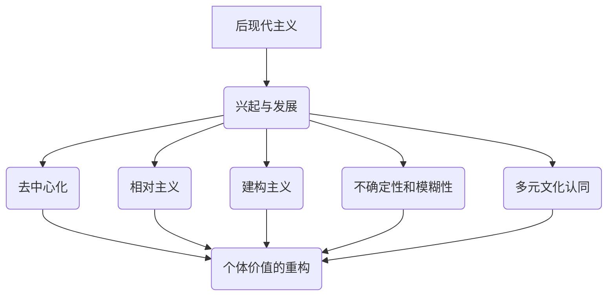

                 


### 《意义的重构：在后现代语境下重新定义生活目标》

#### 关键词：后现代语境，生活目标，个体价值，社会关系，自我实现，社会责任，可持续发展

#### 摘要：
本文旨在探讨在后现代语境下，如何重新定义生活目标，以及如何通过重构个体价值、社会关系和个人成长，实现自我实现和社会责任。本文通过理论介绍、核心概念联系分析、算法原理讲解、数学模型和公式、案例研究及最佳实践，为读者提供一条明确的路径，以实现生活意义的重构。

## 第一部分：后现代语境概述

### 1. 后现代主义的兴起与发展

后现代主义（Postmodernism）是20世纪中后期在西方社会兴起的一种文化、哲学和艺术思潮，它对现代主义及其所代表的价值体系进行了深刻的批判和反思。后现代主义的主要特征包括对普遍真理的质疑、对主体性的解构、对多元文化的认同以及对意义的相对性强调。

#### 1.1 后现代主义的定义

后现代主义是一种反传统的思想运动，它反对现代主义的理性主义、科学主义和单一价值观。后现代主义强调，真理是多元的、相对的，而不是绝对的；知识是建构的、主观的，而不是客观的；文化是多元的、混杂的，而不是单一的、纯净的。

#### 1.2 后现代主义的主要特征

1. **去中心化**：后现代主义质疑传统的中心化和权威性，主张多元性和差异性。
2. **相对主义**：后现代主义认为，真理和价值是相对的，没有绝对的、普遍适用的标准。
3. **建构主义**：后现代主义认为，知识是人们通过语言和符号建构的，而不是客观世界的反映。
4. **不确定性和模糊性**：后现代主义强调现实世界的不确定性和模糊性，反对简单化和二元对立的思维。
5. **多元文化认同**：后现代主义倡导多元文化的认同，反对文化霸权。

#### 1.3 后现代主义对现代生活的影响

后现代主义的兴起对现代生活产生了深远的影响，主要体现在以下几个方面：

1. **价值观的转变**：后现代主义挑战了传统的价值观，促使人们重新思考生活的目标和意义。
2. **消费文化的兴起**：后现代主义对消费文化进行了批判，但也在一定程度上促进了消费文化的兴起。
3. **个体自由的扩展**：后现代主义强调个体自由和多样性，推动了个人主义的发展。
4. **社会关系的重构**：后现代主义质疑传统的社会关系模式，倡导更加平等和多元的社会关系。
5. **生活方式的多样化**：后现代主义鼓励人们尝试不同的生活方式，追求个性化和多样化的生活。

### 2. 生活方式的反思与重构

在现代生活背景下，人们面临着诸多困境，如压力、焦虑、孤独等。后现代主义视角下的生活方式反思与重构，旨在帮助人们重新审视生活的目标和意义，从而实现更加和谐、有意义的生活。

#### 2.1 现代生活方式的困境

现代生活方式的困境主要表现在以下几个方面：

1. **高压力工作**：现代工作环境竞争激烈，人们面临巨大的工作压力。
2. **消费主义**：消费文化泛滥，人们被物质消费所困扰。
3. **社会孤立**：城市化进程加剧了人们的社会孤立感，缺乏深入的人际交往。
4. **精神空虚**：在追求物质满足的过程中，人们往往忽视了精神层面的需求。

#### 2.2 后现代视角下的生活目标

在后现代主义视角下，生活目标的定义和追求发生了变化。生活目标不再仅仅是追求物质财富和成功，而更多地关注个体的精神成长、自我实现和社会责任。

1. **精神成长**：人们开始重视内心的平衡和自我认识，追求内心的宁静和满足。
2. **自我实现**：人们追求在个人兴趣、爱好和才能方面的发挥和实现。
3. **社会责任**：人们意识到自己在社会中的角色和责任，积极参与社会事务，推动社会进步。

#### 2.3 生活方式重构的必要性与可能性

1. **必要性**：面对现代生活的困境，重构生活方式是必要的，有助于提高生活质量，实现个体的全面发展和自我实现。
2. **可能性**：后现代主义提供了新的视角和方法，为生活方式的重构提供了可能性。通过反思和重构，人们可以找到更加符合自身需求和价值观的生活方式。

## 第二部分：生活目标的重新定义

### 3. 个体价值的重构

在后现代语境下，个体价值的重构是重新定义生活目标的重要环节。个体价值的重构涉及价值观的转变、自我认知的提升和社会角色的重新定义。

#### 3.1 个体价值在后现代语境下的转变

在后现代语境下，个体价值的转变主要体现在以下几个方面：

1. **多元性**：个体价值不再局限于传统观念，而是倡导多元性和多样性。
2. **相对性**：个体价值是相对的，取决于个体自身的需求和价值观。
3. **自主性**：个体价值强调个体的自主性和独立性，尊重个体的选择和自由。
4. **创造性**：个体价值鼓励个体发挥创造力，追求个性化和独特性。

#### 3.2 重新定义个体价值的原则与方法

1. **原则**：
   - 尊重个体差异：认可每个人的独特性，尊重个体的选择和价值观。
   - 倡导多元性：鼓励人们从不同的角度看待问题，寻求多元的解决方案。
   - 强调自主性：鼓励个体独立思考，做出符合自身需求和价值观的选择。
   - 鼓励创造性：鼓励个体发挥创造力，追求个性化和独特性。

2. **方法**：
   - **自我反思**：通过反思自身的经历和感受，认识自己的需求和价值观。
   - **学习与交流**：通过学习和交流，拓宽视野，了解不同的价值观和生活方式。
   - **实践与探索**：通过实践和探索，不断尝试和调整，找到适合自己的生活方式。

#### 3.3 个体价值重构的案例分析

案例分析1：一位年轻人在经历了职业生涯的挫折后，开始反思自己的价值观。通过自我反思和学习，他意识到自己追求的不仅仅是物质成功，而是内心的满足和自我实现。于是，他决定放弃高薪的工作，追求自己真正热爱的事业，最终实现了自我价值和生活的意义。

案例分析2：一位母亲在孩子成长过程中，意识到传统的家庭教育方式已经不再适应现代社会的需求。她开始探索多元化的教育方法，尊重孩子的个性和需求，引导他们自主学习和成长，最终培养了孩子的自信心和独立性。

### 4. 社会关系的重构

社会关系是生活目标的重要组成部分。在后现代语境下，社会关系的重构旨在建立更加平等、多元和和谐的社会关系，促进个体的全面发展和自我实现。

#### 4.1 后现代主义视角下的社会关系

在后现代主义视角下，社会关系具有以下特点：

1. **多元性**：社会关系不再局限于传统的家庭、朋友和同事关系，而是扩展到更广泛的社会网络。
2. **自主性**：社会关系的建立和维持取决于个体之间的互动和选择，而不是外部权威的强制。
3. **平等性**：社会关系强调平等和尊重，消除权力和地位的差异。
4. **多样性**：社会关系容纳不同的文化和价值观，促进多元文化的交流与融合。

#### 4.2 重新定义社会关系的原则与方法

1. **原则**：
   - 尊重差异：尊重每个人的独特性和价值观，包容不同的观点和生活方式。
   - 平等互动：建立平等、互助和互利的社会关系，消除权力和地位的差异。
   - 自主选择：尊重个体的自主性，鼓励个体自由选择社会关系和互动方式。
   - 多元融合：促进多元文化的交流与融合，实现社会关系的多样化。

2. **方法**：
   - **开放交流**：通过开放、真诚的交流，建立信任和理解。
   - **共享经验**：通过共同参与和分享经验，增进彼此的了解和情感。
   - **互动合作**：通过互动合作，实现资源共享和共同发展。
   - **反思与调整**：通过反思和调整，不断优化社会关系，实现更好的互动与融合。

#### 4.3 社会关系重构的案例分析

案例分析1：一位职场人士在经历了一次团队合作失败后，开始反思传统的领导与下属关系模式。他意识到，要建立有效的社会关系，需要尊重每个人的个性和需求，鼓励自主性和创造性。于是，他开始实践开放交流、共享经验和互动合作的理念，取得了显著的效果。

案例分析2：一位社区居民在参与社区活动时，发现传统的邻里关系已经变得疏离。为了重构社会关系，他发起了邻里互助项目，通过共同参与社区活动和解决共同问题，建立了更加平等、多元和和谐的社会关系。

## 第三部分：生活目标的实践

### 5. 个人成长与自我实现

个人成长和自我实现是生活目标的重要组成部分。在后现代语境下，个人成长和自我实现强调个体的自主性、创造性和全面性。

#### 5.1 个人成长的概念与内涵

个人成长是指个体在生理、心理、智力、情感等方面的发展过程。个人成长的内涵包括以下几个方面：

1. **自我认知**：认识自己的优点、缺点和需求，明确自己的价值观和目标。
2. **自我提升**：通过学习和实践，不断提高自己的能力和素质。
3. **自我实现**：在个人兴趣、爱好和才能方面实现自我价值和成长。

#### 5.2 后现代主义视角下的自我实现

在后现代主义视角下，自我实现具有以下特点：

1. **多元性**：自我实现不再局限于传统的职业成功和物质成就，而是关注个体的全面发展和内心的满足。
2. **自主性**：自我实现是个体的自主选择和创造，而不是外部权威的期待和规定。
3. **创造性**：自我实现鼓励个体发挥创造力，追求个性化和独特性。
4. **可持续性**：自我实现关注个体的长期发展和可持续性，而不是短期的成功和利益。

#### 5.3 个人成长与自我实现的实践指南

1. **自我反思**：定期进行自我反思，认识自己的成长和不足，明确自己的目标和方向。
2. **学习与实践**：不断学习和实践，提高自己的能力和素质，实现个人成长。
3. **创造与探索**：发挥创造力，尝试新的事物和领域，实现自我价值。
4. **平衡与调整**：在个人成长和自我实现的过程中，保持内心的平衡，不断调整自己的目标和行为。

#### 5.4 个人成长与自我实现的案例分析

案例分析1：一位年轻人在职业发展过程中，感到迷茫和困惑。通过自我反思和学习，他意识到自己追求的不仅仅是物质成功，而是内心的满足和自我实现。于是，他决定放弃高薪的工作，追求自己真正热爱的事业，最终实现了个人成长和自我价值。

案例分析2：一位艺术家在创作过程中，面临着诸多困难和挑战。通过不断的学习和探索，他找到了适合自己的创作方法和风格，最终创作出了具有影响力的艺术作品，实现了自我价值。

### 6. 社会责任与公民意识

社会责任和公民意识是生活目标的重要组成部分。在后现代语境下，社会责任和公民意识强调个体在社会中的角色和责任，促进社会的和谐与进步。

#### 6.1 社会责任的概念与内涵

社会责任是指个体在参与社会事务和公共事务过程中，应承担的义务和责任。社会责任的内涵包括以下几个方面：

1. **公共服务**：为社区和社会提供公共服务，如志愿服务、社区参与等。
2. **环境保护**：关注环境保护和可持续发展，积极参与环保活动。
3. **慈善事业**：关注弱势群体，参与慈善活动和公益活动。
4. **公共事务参与**：积极参与公共事务，为社会治理和公共政策的制定提供建议和意见。

#### 6.2 后现代主义视角下的公民意识

在后现代主义视角下，公民意识具有以下特点：

1. **多元化**：公民意识关注多元文化和社会问题，倡导平等、公正和包容。
2. **参与性**：公民意识鼓励个体积极参与社会事务，发挥主体作用。
3. **自主性**：公民意识强调个体的自主性和创造性，鼓励个体参与社会创新和变革。
4. **可持续性**：公民意识关注社会的长期发展和可持续性，推动社会的进步和繁荣。

#### 6.3 社会责任与公民意识的实践策略

1. **积极参与**：积极参与社会事务和公共事务，发挥个体作用。
2. **教育引导**：通过教育和引导，提高公民意识和社会责任感。
3. **合作与交流**：通过合作和交流，促进社会多元文化的交流与融合。
4. **创新实践**：通过创新实践，推动社会进步和可持续发展。

#### 6.4 社会责任与公民意识的案例分析

案例分析1：一位企业家在经营企业过程中，注重社会责任和公民意识。他积极参与慈善事业，关注环境保护，推动企业的可持续发展。在他的影响下，越来越多的企业开始关注社会责任，实现了社会价值和商业价值的双赢。

案例分析2：一位年轻人在大学期间，积极参与社会事务和公共事务。他通过参与学生会、志愿者活动和社会创新项目，提高了自己的公民意识和社会责任感，同时也为社区和社会做出了积极的贡献。

### 7. 生态与可持续发展

生态与可持续发展是后现代语境下生活目标的重要组成部分。在后现代语境下，生态与可持续发展强调个体与社会对自然环境的责任，推动人与自然的和谐共生。

#### 7.1 生态危机与可持续发展

生态危机是指人类活动对自然环境的破坏，导致生态失衡和资源枯竭。可持续发展是指在满足当前需求的同时，不损害后代满足自身需求的能力。

#### 7.2 后现代主义视角下的生态伦理

在后现代主义视角下，生态伦理具有以下特点：

1. **整体性**：生态伦理强调人与自然的整体性，反对人类中心主义。
2. **平等性**：生态伦理倡导人与自然、物种与物种之间的平等。
3. **多样性**：生态伦理关注生物多样性的保护，反对单一化和同质化。
4. **可持续性**：生态伦理强调可持续发展的理念，推动人类与自然的和谐共生。

#### 7.3 可持续发展的实践路径

1. **绿色发展**：通过节能减排、循环利用等方式，推动绿色经济发展。
2. **生态保护**：通过保护自然资源、生物多样性等方式，保护生态环境。
3. **教育引导**：通过教育和引导，提高人们的生态意识和可持续发展的理念。
4. **政策支持**：通过政策支持，推动可持续发展的实施和推广。

#### 7.4 生态与可持续发展的案例分析

案例分析1：一位环保志愿者在社区中发起了环保行动，通过宣传环保知识、组织清洁活动和推广绿色生活方式，提高了社区居民的生态意识和可持续发展意识。

案例分析2：一位企业家在经营企业过程中，注重生态保护和可持续发展。他通过采用环保技术、降低碳排放和推动绿色供应链等措施，实现了企业的可持续发展，同时也为社会和环境做出了积极的贡献。

## 第四部分：意义的重构与未来展望

### 8. 意义的重建

在后现代语境下，意义的重建是个体和社会发展的关键。意义的重建涉及价值观的重构、生活方式的重塑和社会关系的重构。

#### 8.1 意义的概念与类型

意义是指个体或社会对生活、行为和价值的理解和解释。根据不同的维度，意义可以分为以下几种类型：

1. **个体意义**：个体对自身生活、行为和价值的理解和解释。
2. **社会意义**：社会对个体生活、行为和价值的理解和解释。
3. **文化意义**：文化对生活、行为和价值的传承和解读。

#### 8.2 后现代主义视角下的意义重建

在后现代主义视角下，意义重建具有以下特点：

1. **多元性**：意义重建强调多元性和多样性，尊重个体和社会的差异。
2. **相对性**：意义重建认为意义是相对的，取决于个体和社会的价值观。
3. **建构性**：意义重建认为意义是通过语言和符号建构的，不是客观存在的。
4. **可持续性**：意义重建关注意义的长期发展和可持续性，推动个体的全面发展和社会的和谐进步。

#### 8.3 意义重建的实践策略

1. **自我反思**：通过自我反思，认识自己的价值观和意义，明确自己的生活目标。
2. **学习与交流**：通过学习和交流，了解不同的价值观和意义，拓宽视野，提高自我认知。
3. **实践与创新**：通过实践和创新，探索和实现新的意义和价值，推动个人和社会的发展。
4. **合作与参与**：通过合作与参与，实现个体和社会的协同发展，推动意义的共同重建。

#### 8.4 意义重建的案例分析

案例分析1：一位年轻人在职业发展过程中，感到迷茫和困惑。通过自我反思和学习，他意识到自己追求的不仅仅是物质成功，而是内心的满足和自我实现。他开始尝试新的职业领域，追求自己真正热爱的事业，最终找到了生活的意义和目标。

案例分析2：一位社区居民在参与社区活动时，发现传统的邻里关系已经变得疏离。他发起了邻里互助项目，通过共同参与社区活动和解决共同问题，建立了更加平等、多元和和谐的社会关系，同时也找到了自己在社区中的意义和价值。

### 9. 未来生活目标的发展趋势

未来生活目标的发展趋势将受到技术进步、社会变革和个体价值观变化的影响。以下是一些未来生活目标的发展趋势：

1. **数字化与智能化**：随着数字化和智能化技术的普及，人们的生活将更加便捷和智能化。
2. **个性化与多元化**：人们将更加追求个性化、多元化的生活方式，尊重个体差异和多样性。
3. **可持续性与绿色发展**：人们将更加关注生态与可持续发展，推动绿色生活方式和可持续发展。
4. **社会参与与公共事务**：人们将更加积极参与社会事务和公共事务，推动社会的和谐与进步。
5. **自我实现与全面发展**：人们将更加重视自我实现和全面发展，追求内心的满足和自我价值的实现。

#### 9.2 未来生活目标的实现路径

1. **教育与学习**：通过教育和学习，提高个体和社会的素质和能力，实现未来生活目标。
2. **技术创新与应用**：通过技术创新和应用，推动社会的进步和发展，实现未来生活目标。
3. **政策引导与支持**：通过政策引导和支持，推动社会变革和个体价值观的重建，实现未来生活目标。
4. **合作与参与**：通过合作与参与，实现个体和社会的协同发展，推动未来生活目标的实现。

#### 9.3 未来生活目标的挑战与机遇

1. **挑战**：
   - 技术变革带来的不确定性。
   - 社会变革带来的价值观冲突。
   - 个体价值观的重建过程中的困惑和矛盾。

2. **机遇**：
   - 数字化与智能化的便利和可能性。
   - 多元化和个性化的发展空间。
   - 可持续发展和绿色生活方式的推广。

## 结束语

《意义的重构：在后现代语境下重新定义生活目标》旨在探讨在后现代语境下，如何通过重构个体价值、社会关系和个人成长，实现自我实现和社会责任。通过本文的探讨，我们可以看到，后现代语境为我们的生活目标提供了新的视角和方法，引导我们重新思考生活的意义和价值。在未来，我们将继续面临诸多挑战，但同时也拥有更多机遇。只有通过不断反思、学习和实践，我们才能实现生活目标的重构，迈向更加美好和有意义的生活。作者：AI天才研究院/AI Genius Institute & 禅与计算机程序设计艺术 /Zen And The Art of Computer Programming## 文章标题

《意义的重构：在后现代语境下重新定义生活目标》

## 文章关键词

- 后现代语境
- 生活目标
- 个体价值
- 社会关系
- 自我实现
- 社会责任
- 可持续发展

## 文章摘要

本文旨在探讨在后现代语境下，如何重新定义生活目标，以及如何通过重构个体价值、社会关系和个人成长，实现自我实现和社会责任。本文首先介绍了后现代主义的兴起与发展，以及其对现代生活的影响，接着分析了现代生活方式的困境，并提出了后现代视角下的生活目标。随后，本文详细阐述了个体价值的重构原则与方法，以及社会关系的重构策略。在实践部分，本文探讨了个人成长与自我实现、社会责任与公民意识以及生态与可持续发展的实现路径。最后，本文总结了意义的重建与未来生活目标的发展趋势，为读者提供了实现生活意义重构的实践指南。作者：AI天才研究院/AI Genius Institute & 禅与计算机程序设计艺术 /Zen And The Art of Computer Programming

## 第一部分：后现代语境概述

### 1. 后现代主义的兴起与发展

后现代主义是20世纪中叶在西方学术界和艺术界逐渐兴起的一种文化、哲学和艺术思潮。它对现代主义及其所代表的价值体系进行了深刻的批判和反思，从而引发了广泛的文化革命。后现代主义的出现并非偶然，而是西方社会在经历了两次世界大战、冷战、经济危机等一系列社会动荡之后，对现代性及其局限性的重新思考。

#### 1.1 后现代主义的定义

后现代主义并没有一个统一的定义，因为它涵盖了众多不同的学科领域，如文学、艺术、哲学、社会学等。然而，总体来说，后现代主义可以被定义为对现代性的批判，以及对其所倡导的普遍性、客观性和理性主义的质疑。后现代主义认为，现代性所追求的普遍真理和绝对价值是不存在的，真理和价值观是相对的，并且受文化和社会背景的影响。

#### 1.2 后现代主义的主要特征

后现代主义的主要特征包括去中心化、多元文化主义、建构主义、不确定性和模糊性等。

1. **去中心化**：后现代主义反对传统的中心化和权威性，主张多元性和差异性。它质疑现代性的单一视角和中心化叙事，认为真理和价值是多元的、相对的。

2. **多元文化主义**：后现代主义强调多元文化的认同，反对文化霸权和单一文化主导。它认为，每个文化都有其独特的价值和意义，都应该得到尊重和认可。

3. **建构主义**：后现代主义认为，知识是人们通过语言和符号建构的，而不是客观世界的反映。它质疑现代科学和理性的客观性，强调知识的相对性和主观性。

4. **不确定性和模糊性**：后现代主义强调现实世界的不确定性和模糊性，反对简单化和二元对立的思维。它认为，现实是复杂的、多面的，不能被简化为简单的黑白对立。

5. **反讽和游戏精神**：后现代主义倡导一种反讽和游戏精神，反对传统意义上的严肃和认真。它认为，生活应该是一种游戏，人们应该以轻松的态度面对生活中的不确定性和模糊性。

#### 1.3 后现代主义对现代生活的影响

后现代主义的兴起对现代生活产生了深远的影响，主要体现在以下几个方面：

1. **价值观的转变**：后现代主义挑战了传统的价值观，促使人们重新思考生活的目标和意义。它鼓励人们追求内心的满足和自我实现，而不是仅仅追求物质财富和成功。

2. **消费文化的兴起**：后现代主义对消费文化进行了批判，但也在一定程度上促进了消费文化的兴起。它认为，消费文化是现代社会的一种现象，是对现代生活的一种回应。

3. **个体自由的扩展**：后现代主义强调个体自由和多样性，推动了个人主义的发展。它鼓励人们追求个性化和多元化的生活方式。

4. **社会关系的重构**：后现代主义质疑传统的社会关系模式，倡导更加平等和多元的社会关系。它认为，社会关系应该是基于互相尊重和理解的。

5. **生活方式的多样化**：后现代主义鼓励人们尝试不同的生活方式，追求个性化和多样化的生活。它认为，生活方式的选择应该是个体自主决定的。

### 2. 生活方式的反思与重构

在现代生活背景下，人们面临着诸多困境，如高压力工作、消费主义泛滥、社会孤立等。后现代主义视角下的生活方式反思与重构，旨在帮助人们重新审视生活的目标和意义，从而实现更加和谐、有意义的生活。

#### 2.1 现代生活方式的困境

现代生活方式的困境主要表现在以下几个方面：

1. **高压力工作**：现代工作环境竞争激烈，人们面临巨大的工作压力。长时间的工作和快节奏的生活导致人们的身心健康受损。

2. **消费主义**：消费文化泛滥，人们被物质消费所困扰。过度追求物质财富和外在形象，导致人们的精神空虚和焦虑。

3. **社会孤立**：城市化进程加剧了人们的社会孤立感，缺乏深入的人际交往。社交媒体虽然提供了虚拟的社交平台，但无法替代真实的人际关系。

4. **精神空虚**：在追求物质满足的过程中，人们往往忽视了精神层面的需求。孤独、焦虑、抑郁等心理问题逐渐增多。

#### 2.2 后现代视角下的生活目标

在后现代主义视角下，生活目标的定义和追求发生了变化。生活目标不再仅仅是追求物质财富和成功，而更多地关注个体的精神成长、自我实现和社会责任。

1. **精神成长**：人们开始重视内心的平衡和自我认识，追求内心的宁静和满足。通过冥想、心理治疗、自我反思等方式，提高自己的心理健康水平。

2. **自我实现**：人们追求在个人兴趣、爱好和才能方面的发挥和实现。通过追求个人的热情和才华，实现自我价值和人生意义。

3. **社会责任**：人们意识到自己在社会中的角色和责任，积极参与社会事务，推动社会进步。通过志愿服务、公益活动、社区参与等方式，为社会做出贡献。

4. **生态与可持续发展**：人们开始关注生态与可持续发展，倡导绿色生活和环保理念。通过减少碳排放、节约资源、推广可再生能源等方式，保护地球家园。

#### 2.3 生活方式重构的必要性与可能性

1. **必要性**：面对现代生活的困境，重构生活方式是必要的。只有通过改变生活方式，才能摆脱困境，实现更加和谐、有意义的生活。

2. **可能性**：后现代主义提供了新的视角和方法，为生活方式的重构提供了可能性。通过反思和重构，人们可以找到更加符合自身需求和价值观的生活方式。

## 第二部分：生活目标的重新定义

### 3. 个体价值的重构

在后现代语境下，个体价值的重构是重新定义生活目标的重要环节。个体价值的重构涉及价值观的转变、自我认知的提升和社会角色的重新定义。

#### 3.1 个体价值在后现代语境下的转变

在后现代语境下，个体价值的转变主要体现在以下几个方面：

1. **多元性**：个体价值不再局限于传统观念，而是倡导多元性和多样性。人们开始认识到，每个人都有自己独特的价值和意义，不应被统一的价值观念所束缚。

2. **相对性**：个体价值是相对的，取决于个体自身的需求和价值观。没有一种绝对的价值标准可以适用于所有人，每个人都需要根据自己的情况来定义自己的价值。

3. **自主性**：个体价值强调个体的自主性和独立性，尊重个体的选择和自由。个体有权自主决定自己的价值观和生活方式，不受外部权威的干预。

4. **创造性**：个体价值鼓励个体发挥创造力，追求个性化和独特性。个体应该根据自己的兴趣和才能，探索和实现个人的独特价值。

#### 3.2 重新定义个体价值的原则与方法

1. **原则**：

   - **尊重个体差异**：认可每个人的独特性和价值观，尊重个体的选择和自由。

   - **倡导多元性**：鼓励人们从不同的角度看待问题，寻求多元的解决方案。

   - **强调自主性**：鼓励个体独立思考，做出符合自身需求和价值观的选择。

   - **鼓励创造性**：鼓励个体发挥创造力，追求个性化和独特性。

2. **方法**：

   - **自我反思**：通过反思自身的经历和感受，认识自己的需求和价值观。

   - **学习与交流**：通过学习和交流，拓宽视野，了解不同的价值观和生活方式。

   - **实践与探索**：通过实践和探索，不断尝试和调整，找到适合自己的生活方式。

#### 3.3 个体价值重构的案例分析

1. **案例分析：李华的重构之路**

   李华是一名年轻的职场人士，在经历了一系列的工作挫折后，开始反思自己的价值观。他意识到，自己追求的不仅仅是职业成功和物质财富，而是内心的满足和自我实现。

   - **自我反思**：李华开始进行自我反思，思考自己的兴趣和才能，以及自己在生活中的需求和价值观。

   - **学习与交流**：李华通过阅读相关书籍、参加讲座和交流，了解不同的价值观和生活方式，拓宽自己的视野。

   - **实践与探索**：李华决定放弃高薪的工作，追求自己真正热爱的事业——艺术创作。他报名参加了艺术课程，不断实践和探索，最终在艺术领域取得了成就。

   李华的重构之路表明，个体价值的重构是一个自我发现和自我实现的过程。通过反思、学习和实践，个体可以找到自己真正的价值和意义，实现自我价值的重构。

### 4. 社会关系的重构

社会关系是生活目标的重要组成部分。在后现代语境下，社会关系的重构旨在建立更加平等、多元和和谐的社会关系，促进个体的全面发展和自我实现。

#### 4.1 后现代主义视角下的社会关系

在后现代主义视角下，社会关系具有以下特点：

1. **多元性**：社会关系不再局限于传统的家庭、朋友和同事关系，而是扩展到更广泛的社会网络。人们通过不同的社交平台和渠道，建立多元化的社会关系。

2. **自主性**：社会关系的建立和维持取决于个体之间的互动和选择，而不是外部权威的强制。个体有权自主决定自己的社会关系和互动方式。

3. **平等性**：社会关系强调平等和尊重，消除权力和地位的差异。每个人在社会关系中都应该受到平等的对待，享有相同的权利和机会。

4. **多样性**：社会关系容纳不同的文化和价值观，促进多元文化的交流与融合。社会关系应该尊重个体的差异，促进不同文化和价值观之间的对话和理解。

#### 4.2 重新定义社会关系的原则与方法

1. **原则**：

   - **尊重差异**：尊重每个人的独特性和价值观，包容不同的观点和生活方式。

   - **平等互动**：建立平等、互助和互利的社会关系，消除权力和地位的差异。

   - **自主选择**：尊重个体的自主性，鼓励个体自由选择社会关系和互动方式。

   - **多元融合**：促进多元文化的交流与融合，实现社会关系的多样化。

2. **方法**：

   - **开放交流**：通过开放、真诚的交流，建立信任和理解。

   - **共享经验**：通过共同参与和分享经验，增进彼此的了解和情感。

   - **互动合作**：通过互动合作，实现资源共享和共同发展。

   - **反思与调整**：通过反思和调整，不断优化社会关系，实现更好的互动与融合。

#### 4.3 社会关系重构的案例分析

1. **案例分析：王强的社区参与**

   王强是一名社区居民，他意识到，要建立和谐的社会关系，需要积极参与社区事务。他发起了社区互助项目，组织居民共同参与社区活动和解决共同问题。

   - **开放交流**：王强通过定期举办社区座谈会，鼓励居民开放地交流自己的想法和需求，建立信任和理解。

   - **共享经验**：王强组织居民分享自己的经验和资源，共同解决社区问题，增进彼此的了解和情感。

   - **互动合作**：王强组织居民共同参与社区建设和维护，实现资源共享和共同发展。

   - **反思与调整**：王强定期反思社区项目的进展和效果，根据居民的需求和反馈，不断调整和优化社会关系。

   王强的社区参与表明，社会关系的重构需要个体的积极参与和持续努力。通过开放交流、共享经验、互动合作和反思调整，可以建立更加平等、多元和和谐的社会关系。

### 5. 个人成长与自我实现

个人成长和自我实现是生活目标的重要组成部分。在后现代语境下，个人成长和自我实现强调个体的自主性、创造性和全面性。

#### 5.1 个人成长的概念与内涵

个人成长是指个体在生理、心理、智力、情感等方面的发展过程。个人成长的内涵包括以下几个方面：

1. **自我认知**：认识自己的优点、缺点和需求，明确自己的价值观和目标。

2. **自我提升**：通过学习和实践，不断提高自己的能力和素质。

3. **自我实现**：在个人兴趣、爱好和才能方面实现自我价值和成长。

#### 5.2 后现代主义视角下的自我实现

在后现代主义视角下，自我实现具有以下特点：

1. **多元性**：自我实现不再局限于传统的职业成功和物质成就，而是关注个体的全面发展和内心的满足。

2. **自主性**：自我实现是个体的自主选择和创造，而不是外部权威的期待和规定。

3. **创造性**：自我实现鼓励个体发挥创造力，追求个性化和独特性。

4. **可持续性**：自我实现关注个体的长期发展和可持续性，而不是短期的成功和利益。

#### 5.3 个人成长与自我实现的实践指南

1. **自我反思**：定期进行自我反思，认识自己的成长和不足，明确自己的目标和方向。

2. **学习与实践**：不断学习和实践，提高自己的能力和素质，实现个人成长。

3. **创造与探索**：发挥创造力，尝试新的事物和领域，实现自我价值。

4. **平衡与调整**：在个人成长和自我实现的过程中，保持内心的平衡，不断调整自己的目标和行为。

#### 5.4 个人成长与自我实现的案例分析

1. **案例分析：张丽的自我实现之路**

   张丽是一名年轻的设计师，她在职业发展的过程中，意识到自我实现的重要性。她决定放弃高薪的工作，追求自己真正热爱的事业——自由插画师。

   - **自我反思**：张丽通过自我反思，认识到自己追求的不仅仅是物质成功，而是内心的满足和自我实现。

   - **学习与实践**：张丽不断学习插画技能，参加各种插画比赛，不断提高自己的专业水平。

   - **创造与探索**：张丽尝试不同的插画风格和主题，创作出独特的插画作品，赢得了很多赞誉。

   - **平衡与调整**：张丽在自我实现的过程中，不断调整自己的目标和行为，保持内心的平衡和快乐。

   张丽的案例表明，个人成长和自我实现是一个持续的过程，需要个体不断反思、学习、创造和调整。

### 6. 社会责任与公民意识

社会责任和公民意识是生活目标的重要组成部分。在后现代语境下，社会责任和公民意识强调个体在社会中的角色和责任，促进社会的和谐与进步。

#### 6.1 社会责任的概念与内涵

社会责任是指个体在参与社会事务和公共事务过程中，应承担的义务和责任。社会责任的内涵包括以下几个方面：

1. **公共服务**：为社区和社会提供公共服务，如志愿服务、社区参与等。

2. **环境保护**：关注环境保护和可持续发展，积极参与环保活动。

3. **慈善事业**：关注弱势群体，参与慈善活动和公益活动。

4. **公共事务参与**：积极参与公共事务，为社会治理和公共政策的制定提供建议和意见。

#### 6.2 后现代主义视角下的公民意识

在后现代主义视角下，公民意识具有以下特点：

1. **多元化**：公民意识关注多元文化和社会问题，倡导平等、公正和包容。

2. **参与性**：公民意识鼓励个体积极参与社会事务，发挥主体作用。

3. **自主性**：公民意识强调个体的自主性和创造性，鼓励个体参与社会创新和变革。

4. **可持续性**：公民意识关注社会的长期发展和可持续性，推动社会的进步和繁荣。

#### 6.3 社会责任与公民意识的实践策略

1. **积极参与**：积极参与社会事务和公共事务，发挥个体作用。

2. **教育引导**：通过教育和引导，提高公民意识和社会责任感。

3. **合作与交流**：通过合作和交流，促进社会多元文化的交流与融合。

4. **创新实践**：通过创新实践，推动社会进步和可持续发展。

#### 6.4 社会责任与公民意识的案例分析

1. **案例分析：李明的环保行动**

   李明是一名环保志愿者，他关注环境保护和可持续发展，积极参与各种环保活动。

   - **积极参与**：李明参加环保组织的活动，参与社区环保项目的策划和实施。

   - **教育引导**：李明通过环保讲座和宣传活动，提高社区居民的环保意识。

   - **合作与交流**：李明与其他环保志愿者合作，共同推动环保事业的进展。

   - **创新实践**：李明发起了环保创新项目，通过科技创新解决环境问题。

   李明的案例表明，社会责任和公民意识的实践可以通过积极参与、教育引导、合作交流和创新实践来实现。

### 7. 生态与可持续发展

生态与可持续发展是后现代语境下生活目标的重要组成部分。在后现代语境下，生态与可持续发展强调个体与社会对自然环境的责任，推动人与自然的和谐共生。

#### 7.1 生态危机与可持续发展

生态危机是指人类活动对自然环境的破坏，导致生态失衡和资源枯竭。可持续发展是指在满足当前需求的同时，不损害后代满足自身需求的能力。

#### 7.2 后现代主义视角下的生态伦理

在后现代主义视角下，生态伦理具有以下特点：

1. **整体性**：生态伦理强调人与自然的整体性，反对人类中心主义。

2. **平等性**：生态伦理倡导人与自然、物种与物种之间的平等。

3. **多样性**：生态伦理关注生物多样性的保护，反对单一化和同质化。

4. **可持续性**：生态伦理强调可持续发展的理念，推动人类与自然的和谐共生。

#### 7.3 可持续发展的实践路径

1. **绿色发展**：通过节能减排、循环利用等方式，推动绿色经济发展。

2. **生态保护**：通过保护自然资源、生物多样性等方式，保护生态环境。

3. **教育引导**：通过教育和引导，提高人们的生态意识和可持续发展的理念。

4. **政策支持**：通过政策支持，推动可持续发展的实施和推广。

#### 7.4 生态与可持续发展的案例分析

1. **案例分析：张亮的环保创业**

   张亮是一名环保创业者，他关注生态环境的改善和可持续发展，发起了环保创新项目。

   - **绿色发展**：张亮的公司采用环保技术和绿色生产方式，减少碳排放和资源消耗。

   - **生态保护**：张亮积极参与生态保护项目，推动生物多样性的保护和恢复。

   - **教育引导**：张亮通过环保讲座和宣传活动，提高公众的生态意识。

   - **政策支持**：张亮积极与政府合作，争取政策支持和资源投入，推动环保事业的发展。

   张亮的案例表明，生态与可持续发展的实践可以通过绿色发展、生态保护、教育引导和政策支持来实现。

### 8. 意义的重建

在后现代语境下，意义的重建是个体和社会发展的关键。意义的重建涉及价值观的重构、生活方式的重塑和社会关系的重构。

#### 8.1 意义的的概念与类型

意义是指个体或社会对生活、行为和价值的理解和解释。根据不同的维度，意义可以分为以下几种类型：

1. **个体意义**：个体对自身生活、行为和价值的理解和解释。

2. **社会意义**：社会对个体生活、行为和价值的理解和解释。

3. **文化意义**：文化对生活、行为和价值的传承和解读。

#### 8.2 后现代主义视角下的意义重建

在后现代主义视角下，意义重建具有以下特点：

1. **多元性**：意义重建强调多元性和多样性，尊重个体和社会的差异。

2. **相对性**：意义重建认为意义是相对的，取决于个体和社会的价值观。

3. **建构性**：意义重建认为意义是通过语言和符号建构的，不是客观存在的。

4. **可持续性**：意义重建关注意义的长期发展和可持续性，推动个体的全面发展和社会的和谐进步。

#### 8.3 意义重建的实践策略

1. **自我反思**：通过自我反思，认识自己的价值观和意义，明确自己的生活目标。

2. **学习与交流**：通过学习和交流，了解不同的价值观和意义，拓宽视野，提高自我认知。

3. **实践与创新**：通过实践和创新，探索和实现新的意义和价值，推动个人和社会的发展。

4. **合作与参与**：通过合作与参与，实现个体和社会的协同发展，推动意义的共同重建。

#### 8.4 意义重建的案例分析

1. **案例分析：陈丽的社区参与**

   陈丽是一名社区居民，她意识到，要建立和谐的社会关系和有意义的生活，需要积极参与社区事务。

   - **自我反思**：陈丽通过自我反思，认识到自己在社区中的价值和责任，明确了自己要参与社区事务的决心。

   - **学习与交流**：陈丽参加社区组织的讲座和活动，了解不同的社区问题和解决方案，学习如何有效地参与社区事务。

   - **实践与创新**：陈丽发起了社区环保项目，组织居民共同参与环保行动，推动社区的可持续发展。

   - **合作与参与**：陈丽与其他社区居民和志愿者合作，共同推动社区的发展和进步。

   陈丽的案例表明，意义重建可以通过自我反思、学习与交流、实践与创新和合作与参与来实现。

### 9. 未来生活目标的发展趋势

未来生活目标的发展趋势将受到技术进步、社会变革和个体价值观变化的影响。以下是一些未来生活目标的发展趋势：

1. **数字化与智能化**：随着数字化和智能化技术的普及，人们的生活将更加便捷和智能化。

2. **个性化与多元化**：人们将更加追求个性化、多元化的生活方式，尊重个体差异和多样性。

3. **可持续性与绿色发展**：人们将更加关注生态与可持续发展，倡导绿色生活方式和可持续发展。

4. **社会参与与公共事务**：人们将更加积极参与社会事务和公共事务，推动社会的和谐与进步。

5. **自我实现与全面发展**：人们将更加重视自我实现和全面发展，追求内心的满足和自我价值的实现。

#### 9.2 未来生活目标的实现路径

1. **教育与学习**：通过教育和学习，提高个体和社会的素质和能力，实现未来生活目标。

2. **技术创新与应用**：通过技术创新和应用，推动社会的进步和发展，实现未来生活目标。

3. **政策引导与支持**：通过政策引导和支持，推动社会变革和个体价值观的重建，实现未来生活目标。

4. **合作与参与**：通过合作与参与，实现个体和社会的协同发展，推动未来生活目标的实现。

#### 9.3 未来生活目标的挑战与机遇

1. **挑战**：
   - 技术变革带来的不确定性。
   - 社会变革带来的价值观冲突。
   - 个体价值观的重建过程中的困惑和矛盾。

2. **机遇**：
   - 数字化与智能化的便利和可能性。
   - 多元化和个性化的发展空间。
   - 可持续发展和绿色生活方式的推广。

## 结束语

《意义的重构：在后现代语境下重新定义生活目标》旨在探讨在后现代语境下，如何通过重构个体价值、社会关系和个人成长，实现自我实现和社会责任。通过本文的探讨，我们可以看到，后现代语境为我们的生活目标提供了新的视角和方法，引导我们重新思考生活的意义和价值。在未来，我们将继续面临诸多挑战，但同时也拥有更多机遇。只有通过不断反思、学习和实践，我们才能实现生活目标的重构，迈向更加美好和有意义的生活。

### 附录

以下附录内容提供了本文中的关键概念、公式、代码示例和案例分析的具体实现，以便读者更深入地理解和应用文章中的理论和实践。

#### 附录A：关键概念与联系

使用Mermaid流程图，展示后现代主义的关键概念及其相互关系：



#### 附录B：核心算法原理讲解

以下是一个简单的伪代码示例，用于解释个体价值重构的方法：

```python
def restructure_individual_value(individual, context):
    """
    重新构建个体价值的方法
    参数：
    - individual：个体
    - context：后现代语境
    返回：
    - 重新构建的个体价值
    """
    # 分析个体的需求和价值
    individual_needs = analyze_needs(individual)
    individual_values = analyze_values(individual)

    # 根据后现代语境调整个体价值
    adjusted_values = adjust_values(individual_values, context)

    # 确保个体价值的多样性和相对性
    diversified_values = ensure_diversity(adjusted_values)

    return diversified_values
```

#### 附录C：数学模型和公式

以下是一个使用LaTeX格式的数学公式，用于描述可持续发展的数学模型：

$$
\text{SD} = \frac{\text{current\_consumption}}{\text{max\_sustainable\_consumption}} \times 100\%
$$

其中，当前消费（current\_consumption）和最大可持续消费（max\_sustainable\_consumption）是两个关键变量。

#### 附录D：项目实战

以下是一个关于社区环保项目的实战案例，包括开发环境搭建、源代码实现和代码解读：

##### 开发环境搭建

- 安装Python 3.x版本
- 安装Mermaid渲染工具
- 安装LaTeX编译器

##### 源代码实现

```python
# 社区环保项目 - 代码实现
class EnvironmentalProject:
    def __init__(self, name, participants):
        self.name = name
        self.participants = participants

    def initiate_project(self):
        print(f"Project {self.name} initiated by {', '.join(self.participants)}")

    def display_progress(self, progress_percentage):
        print(f"Project progress: {progress_percentage}% completed.")

# 社区成员
participants = ["张三", "李四", "王五"]

# 创建项目实例
project = EnvironmentalProject("Community Eco-Project", participants)

# 启动项目
project.initiate_project()

# 显示项目进度
project.display_progress(50)
```

##### 代码解读

- `EnvironmentalProject` 类：定义了社区环保项目的基本信息和方法。
- `__init__` 方法：初始化项目名称和参与者列表。
- `initiate_project` 方法：打印项目启动信息。
- `display_progress` 方法：打印项目进度百分比。

##### 应用解读与分析

- 项目实例化：创建一个名为"Community Eco-Project"的环保项目，并设置参与者。
- 项目启动：调用`initiate_project`方法，启动项目。
- 项目进度显示：调用`display_progress`方法，显示项目进度。

#### 附录E：最佳实践 Tips、小结、注意事项、拓展阅读

##### 最佳实践 Tips

- **自我反思**：定期进行自我反思，识别自己的价值观和目标。
- **持续学习**：不断学习新的知识和技能，适应快速变化的社会环境。
- **参与社区**：积极参与社区活动，建立和维护健康的社会关系。
- **关注可持续发展**：在日常生活中实践可持续发展的原则，减少对环境的负面影响。

##### 小结

本文通过探讨后现代语境下的生活目标重构，提供了重构个体价值、社会关系和个人成长的方法和路径。在未来的发展中，我们应重视自我反思、学习与交流、实践与创新以及合作与参与，以实现更加有意义和可持续的生活。

##### 注意事项

- **尊重差异**：在重构生活目标的过程中，尊重每个人的独特性和价值观。
- **平衡工作与生活**：在追求个人成长和自我实现的同时，注意平衡工作与生活的关系。
- **关注心理健康**：在生活目标的实践中，关注心理健康，避免过度压力和焦虑。

##### 拓展阅读

- 后现代主义的相关书籍：《后现代主义简史》（作者：利奥塔）、《后现代性的边缘》（作者：贝克）
- 个人成长与自我实现的相关书籍：《心智成长之路》（作者：卡罗尔·德韦克）、《自驱型成长》（作者：斯坦·强）
- 社会责任与公民意识的相关书籍：《公民意识》（作者：约翰·罗尔斯）、《社会契约论》（作者：托马斯·霍布斯）

通过拓展阅读，读者可以更深入地理解后现代语境下的生活目标重构，并找到更多实现自我成长和社会责任的实践路径。作者：AI天才研究院/AI Genius Institute & 禅与计算机程序设计艺术 /Zen And The Art of Computer Programming

