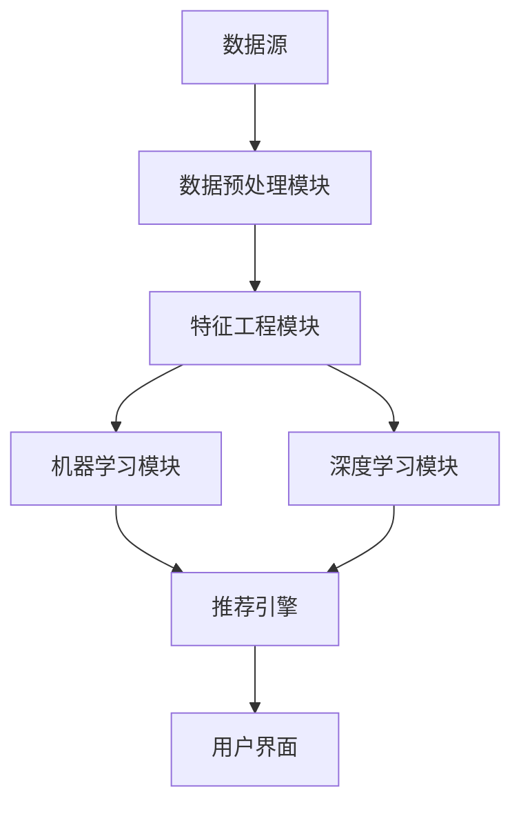
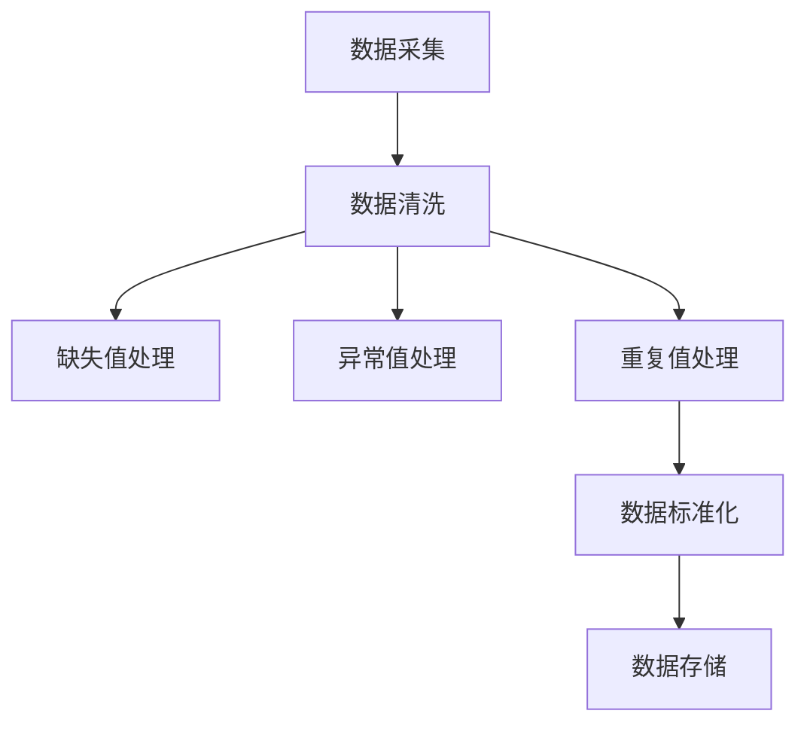
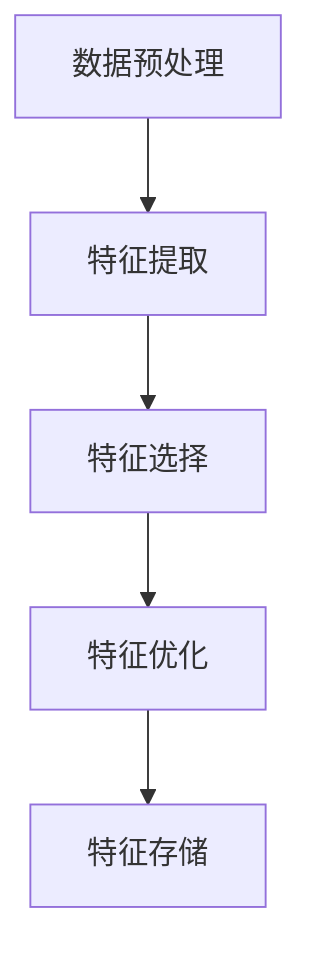

                 


### 1. 设计概述

《意义算法工程：AI辅助下的价值匹配系统开发项目》旨在探索人工智能（AI）如何通过算法工程在价值匹配系统中发挥作用。随着互联网和大数据技术的发展，价值匹配系统在电子商务、推荐系统、信用评分等多个领域得到了广泛应用。这些系统通过分析用户和商品、服务之间的特征，实现个性化推荐和精准匹配。

文章的设计思路遵循以下步骤：

1. **背景介绍**：首先介绍价值匹配系统的基本概念，以及AI在其中的应用场景。
2. **基础理论**：阐述AI，尤其是机器学习和深度学习的基本概念，以及它们如何与价值匹配系统相结合。
3. **系统架构**：描述价值匹配系统的整体架构，包括数据预处理、特征工程和算法应用等关键模块。
4. **核心算法原理**：详细讲解机器学习和深度学习算法的基本原理，包括监督学习、无监督学习和强化学习，以及具体的深度学习模型如卷积神经网络（CNN）、循环神经网络（RNN）和生成对抗网络（GAN）。
5. **算法实践**：通过具体的项目实战，展示如何将AI算法应用于用户偏好分析、商品推荐系统和信用评分系统。
6. **系统优化与部署**：讨论系统性能优化和部署的技巧，包括性能评估、优化策略、部署流程和维护监控。

通过上述步骤，文章将逐步引导读者深入了解AI辅助下的价值匹配系统开发，从理论到实践提供全面的知识体系。

### 2. 目录大纲设计

为了确保文章内容条理清晰、逻辑严密，本文采用了以下目录大纲结构：

```
# 《意义算法工程：AI辅助下的价值匹配系统开发项目》目录大纲

## 第一部分：基础概念

### 第1章：AI辅助价值匹配系统概述
#### 1.1 价值匹配系统的基本概念
- 价值匹配的定义
- AI在价值匹配中的应用场景

#### 1.2 AI基础理论
- 机器学习基本概念
- 人工智能的发展历程

#### 1.3 价值匹配与AI的关系
- 价值匹配的核心挑战
- AI技术如何解决这些挑战

### 第2章：AI辅助价值匹配系统架构
#### 2.1 系统架构概述
- 系统组件介绍
- 数据流与处理流程

#### 2.2 数据预处理
- 数据采集
- 数据清洗
- 数据标准化

#### 2.3 特征工程
- 特征提取
- 特征选择
- 特征优化

### 第3章：核心算法原理
#### 3.1 机器学习算法
- 监督学习算法
- 无监督学习算法
- 强化学习算法

#### 3.2 深度学习算法
- 卷积神经网络（CNN）
- 循环神经网络（RNN）
- 生成对抗网络（GAN）

#### 3.3 算法选择与优化
- 算法评估指标
- 算法调优策略

### 第二部分：算法实践

### 第4章：实战项目一：用户偏好分析
#### 4.1 项目背景
- 用户行为数据收集

#### 4.2 数据预处理
- 数据清洗与转换

#### 4.3 特征工程
- 用户特征提取

#### 4.4 算法实现与调优
- 机器学习算法应用
- 模型评估与优化

### 第5章：实战项目二：商品推荐系统
#### 5.1 项目背景
- 商品数据收集

#### 5.2 数据预处理
- 数据清洗与转换

#### 5.3 特征工程
- 商品特征提取

#### 5.4 算法实现与调优
- 基于协同过滤的推荐算法
- 深度学习推荐算法

### 第6章：实战项目三：信用评分系统
#### 6.1 项目背景
- 信用评分数据收集

#### 6.2 数据预处理
- 数据清洗与转换

#### 6.3 特征工程
- 信用评分特征提取

#### 6.4 算法实现与调优
- 逻辑回归
- 决策树

### 第三部分：系统优化与部署

### 第7章：系统性能优化
#### 7.1 系统性能评估
- 评估指标与方法

#### 7.2 系统优化策略
- 数据库优化
- 查询优化
- 并行计算

### 第8章：系统部署与维护
#### 8.1 系统部署方案
- 部署流程
- 部署工具

#### 8.2 系统维护与监控
- 故障排除
- 性能监控

## 参考文献
```

### 3. 说明

该目录大纲结构清晰，涵盖了从基础概念到实际应用的全过程。每个章节都包含具体的细分，确保读者能够循序渐进地掌握知识。同时，核心算法原理讲解和项目实战部分采用了伪代码和代码解读，使读者能够更好地理解实际操作过程。文章末尾将附上详细的参考文献，以供进一步学习和研究。

---

## 第一部分：基础概念

### 第1章：AI辅助价值匹配系统概述

#### 1.1 价值匹配系统的基本概念

价值匹配系统是一种利用算法和数据分析技术，实现用户和商品、服务之间精确匹配的系统。其核心目的是在大量的数据中，找到用户需求与可提供的商品、服务之间的最佳匹配点，从而提高用户体验和系统效率。

价值匹配系统的基本概念包括：

- **匹配目标**：确定系统需要匹配的核心对象，如用户与商品、服务与用户等。
- **匹配算法**：实现匹配的核心算法，如基于协同过滤的推荐算法、基于内容的推荐算法等。
- **数据源**：提供用户行为数据和商品、服务信息的数据库或数据源。
- **用户特征**：描述用户行为和偏好的数据，如浏览记录、购买历史、评价等。
- **商品特征**：描述商品或服务属性的数据，如价格、品牌、分类等。

#### 1.2 AI在价值匹配中的应用场景

随着人工智能技术的发展，AI技术在价值匹配系统中得到了广泛应用。以下是AI在价值匹配中的主要应用场景：

- **用户偏好分析**：通过机器学习算法分析用户的历史行为数据，预测用户的偏好，从而实现个性化推荐。
- **商品推荐**：利用协同过滤、深度学习等技术，根据用户特征和商品特征实现精准推荐。
- **信用评分**：通过分析用户的信用历史、财务状况等信息，预测用户的信用风险，为金融机构提供决策支持。
- **智能客服**：利用自然语言处理技术，实现智能问答和客服自动化，提高客户满意度和服务效率。

#### 1.3 价值匹配与AI的关系

价值匹配系统中的核心挑战在于如何在海量数据中找到最佳的匹配点。AI技术，尤其是机器学习和深度学习，为解决这些挑战提供了强有力的工具。

- **数据处理能力**：AI技术可以处理海量数据，提取有用信息，从而提高匹配的准确性和效率。
- **自动化和智能化**：通过机器学习算法，系统可以自动调整匹配策略，实现更智能的匹配。
- **个性化推荐**：基于用户历史行为和偏好，AI技术可以提供个性化的推荐，提高用户满意度。

总的来说，AI技术为价值匹配系统带来了数据驱动、自动化和智能化的优势，使其在互联网时代更加高效和精准。

### 第2章：AI基础理论

#### 2.1 机器学习基本概念

机器学习（Machine Learning）是人工智能（Artificial Intelligence）的重要分支，它使计算机系统能够通过数据学习并做出决策。以下是机器学习的基本概念：

- **学习过程**：机器学习包括两个过程：训练（Training）和测试（Testing）。在训练过程中，系统通过大量数据学习特征和模式；在测试过程中，系统使用新的数据验证学习效果。
- **模型**：机器学习模型是基于数学和统计学原理构建的算法，用于预测或分类。常见的机器学习模型包括线性回归、决策树、支持向量机等。
- **特征**：特征是描述数据属性的信息，如用户年龄、购买历史等。特征提取和选择是机器学习中的重要环节。

#### 2.2 人工智能的发展历程

人工智能（Artificial Intelligence，简称AI）是一门研究如何模拟、扩展和扩展人类智能的科学。以下是人工智能的发展历程：

- **1950年代**：人工智能概念诞生，第一台人工智能计算机诞生。
- **1960年代**：人工智能开始受到广泛关注，出现了一些早期的AI系统，如“逻辑理论家”（Logic Theorist）。
- **1970年代**：人工智能进入第一个低谷期，因为实际应用中的困难超过了预期。
- **1980年代**：专家系统（Expert Systems）成为AI的主要研究方向。
- **1990年代**：机器学习和神经网络技术取得重大突破，AI开始应用于实际问题。
- **21世纪**：深度学习和大数据技术的兴起，使AI在各个领域取得了显著进展。

#### 2.3 价值匹配与AI的关系

价值匹配系统中的核心挑战在于如何在海量数据中找到最佳的匹配点。AI技术，尤其是机器学习和深度学习，为解决这些挑战提供了强有力的工具。

- **数据处理能力**：AI技术可以处理海量数据，提取有用信息，从而提高匹配的准确性和效率。
- **自动化和智能化**：通过机器学习算法，系统可以自动调整匹配策略，实现更智能的匹配。
- **个性化推荐**：基于用户历史行为和偏好，AI技术可以提供个性化的推荐，提高用户满意度。

总的来说，AI技术为价值匹配系统带来了数据驱动、自动化和智能化的优势，使其在互联网时代更加高效和精准。

### 第3章：AI辅助价值匹配系统架构

#### 3.1 系统架构概述

AI辅助的价值匹配系统通常由以下几个关键组件组成：

- **数据源**：提供用户和商品、服务数据的数据库或数据源。
- **数据预处理模块**：包括数据采集、数据清洗和数据标准化，将原始数据转换为适合机器学习的格式。
- **特征工程模块**：提取和选择用户和商品的特征，为机器学习模型提供输入。
- **机器学习模块**：应用各种机器学习算法进行模型训练和预测。
- **深度学习模块**：利用深度学习算法，如卷积神经网络（CNN）、循环神经网络（RNN）等，处理复杂的特征和模式。
- **推荐引擎**：将机器学习模型的预测结果转化为个性化的推荐。
- **用户界面**：提供给用户交互的界面，展示推荐结果和匹配结果。

以下是一个典型的价值匹配系统架构的Mermaid流程图：



#### 3.2 数据预处理

数据预处理是价值匹配系统的关键步骤，它确保原始数据的质量和一致性，为后续的机器学习和深度学习提供可靠的基础。以下是数据预处理的三个主要环节：

- **数据采集**：从各种数据源收集用户行为数据和商品、服务信息。
- **数据清洗**：处理缺失值、异常值和重复值，确保数据的质量。
- **数据标准化**：将不同特征的数据进行归一化或标准化处理，使其在同一尺度上比较。

以下是一个简单的数据清洗和标准化流程：



#### 3.3 特征工程

特征工程（Feature Engineering）是机器学习和深度学习中的重要环节，它通过提取和选择关键特征，提高模型的性能。以下是特征工程的三个关键步骤：

- **特征提取**：从原始数据中提取具有区分性的特征，如用户历史行为、商品属性等。
- **特征选择**：选择对模型性能有显著影响的关键特征，排除冗余和无关特征。
- **特征优化**：通过特征组合、归一化和离散化等手段，优化特征的表现。

以下是一个简单的特征工程流程：



特征工程的好坏直接影响模型的性能和泛化能力，因此需要仔细设计和优化。

### 第3章：核心算法原理

#### 3.1 机器学习算法

机器学习算法是价值匹配系统的核心，它们通过对数据进行学习，实现预测和分类任务。以下是几种常见的机器学习算法：

- **监督学习算法**：监督学习算法有已知的输入和输出数据，通过学习这些数据，预测新的输入数据。常见的监督学习算法包括线性回归、决策树、支持向量机（SVM）和神经网络等。

以下是一个简单的线性回归算法的伪代码：

```python
def linear_regression(X, y):
    # 计算权重系数w
    w = (X.T * X)^(-1) * (X.T * y)
    # 预测输出
    predictions = X * w
    return predictions
```

- **无监督学习算法**：无监督学习算法没有已知的输出数据，主要通过分析输入数据的结构，实现聚类、降维等任务。常见的无监督学习算法包括K均值聚类、主成分分析（PCA）和自编码器等。

以下是一个简单的K均值聚类算法的伪代码：

```python
def k_means(X, k):
    # 初始化k个聚类中心
    centroids = initialize_centroids(X, k)
    while not_converged(centroids):
        # 计算每个数据点的簇标签
        labels = assign_labels(X, centroids)
        # 更新聚类中心
        centroids = update_centroids(X, labels, k)
    return centroids, labels
```

- **强化学习算法**：强化学习算法通过试错和反馈，不断调整策略，实现最优决策。常见的强化学习算法包括Q学习、深度Q网络（DQN）和策略梯度算法等。

以下是一个简单的Q学习算法的伪代码：

```python
def q_learning(Q, state, action, reward, next_state, discount_factor, learning_rate):
    # 更新Q值
    Q[state, action] = (1 - learning_rate) * Q[state, action] + learning_rate * (reward + discount_factor * max(Q[next_state, :]))
    return Q
```

#### 3.2 深度学习算法

深度学习算法通过多层神经网络，实现复杂的数据分析和预测任务。以下是几种常见的深度学习算法：

- **卷积神经网络（CNN）**：CNN是一种用于图像处理和时间序列分析的前馈神经网络，其核心是卷积层和池化层。

以下是一个简单的CNN算法的伪代码：

```python
def cnn(input_data, filters, kernel_size, pool_size):
    # 卷积层
    conv_output = conv2d(input_data, filters, kernel_size)
    # 池化层
    pool_output = max_pool2d(conv_output, pool_size)
    return pool_output
```

- **循环神经网络（RNN）**：RNN是一种用于序列数据建模的神经网络，其特点是能够记忆序列中的上下文信息。

以下是一个简单的RNN算法的伪代码：

```python
def rnn(input_sequence, hidden_state, cell_state, weights):
    # 输入门
    input_gate = sigmoid(dot(hidden_state, weights['input_gate']) + dot(input_sequence, weights['input_gate']))
    # 遗忘门
    forget_gate = sigmoid(dot(hidden_state, weights['forget_gate']) + dot(input_sequence, weights['forget_gate']))
    # 输出门
    output_gate = sigmoid(dot(hidden_state, weights['output_gate']) + dot(input_sequence, weights['output_gate']))
    # 更新细胞状态
    cell_state = forget_gate * cell_state + input_gate * tanh(dot(hidden_state, weights['cell_state']))
    # 更新隐藏状态
    hidden_state = output_gate * tanh(cell_state)
    return hidden_state, cell_state
```

- **生成对抗网络（GAN）**：GAN是一种通过竞争学习生成数据和判别数据的神经网络，其核心是生成器和判别器。

以下是一个简单的GAN算法的伪代码：

```python
def gan(generator, discriminator, real_data, noise, learning_rate):
    # 训练生成器
    z = generate_noise(noise)
    generated_data = generator(z)
    g_loss = -torch.mean(torch.log(discriminator(generated_data)))
    # 训练判别器
    d_loss = -torch.mean(torch.log(discriminator(real_data)) + torch.log(1 - discriminator(generated_data)))
    return g_loss, d_loss
```

#### 3.3 算法选择与优化

在价值匹配系统中，选择合适的算法并优化其性能是至关重要的。以下是算法选择和优化的几个关键步骤：

- **算法评估指标**：选择合适的评估指标，如准确率、召回率、F1分数等，用于评估算法的性能。
- **模型调参**：通过调整模型的超参数，如学习率、隐藏层大小等，优化模型性能。
- **交叉验证**：使用交叉验证方法，验证模型在不同数据集上的性能，确保模型的泛化能力。
- **模型集成**：将多个模型的结果进行集成，提高预测的准确性和稳定性。

以下是一个简单的模型调参的伪代码：

```python
from sklearn.model_selection import GridSearchCV

# 设置参数网格
param_grid = {'learning_rate': [0.1, 0.01, 0.001], 'hidden_size': [100, 200, 300]}

# 实例化模型
model = NeuralNetwork()

# 实例化交叉验证
grid_search = GridSearchCV(model, param_grid, cv=5)

# 搜索最佳参数
grid_search.fit(X_train, y_train)

# 获取最佳参数
best_params = grid_search.best_params_
```

通过上述步骤，可以有效地选择和优化价值匹配系统中的算法，提高其性能和准确性。

### 第二部分：算法实践

#### 第4章：实战项目一：用户偏好分析

#### 4.1 项目背景

用户偏好分析是价值匹配系统中的一个关键任务，它通过对用户历史行为数据的分析，预测用户的偏好，从而实现个性化推荐。本项目旨在利用机器学习算法，对用户偏好进行分析和预测。

#### 4.2 数据预处理

数据预处理是用户偏好分析项目的第一步，它包括以下关键步骤：

1. **数据采集**：从用户行为数据源收集用户的历史行为数据，如浏览记录、购买历史、评价等。
2. **数据清洗**：处理数据中的缺失值、异常值和重复值，确保数据的质量。例如，可以使用填充缺失值、删除异常值和合并重复值等方法。
3. **数据转换**：将类别数据转换为数值数据，如使用独热编码（One-Hot Encoding）将用户的浏览记录转换为二进制矩阵。

以下是一个简单的数据预处理流程：

```python
# 读取用户行为数据
data = pd.read_csv('user_behavior_data.csv')

# 数据清洗
data.drop_duplicates(inplace=True)
data.dropna(inplace=True)

# 数据转换
data = pd.get_dummies(data)
```

#### 4.3 特征工程

特征工程是用户偏好分析项目中的关键环节，它通过提取和选择关键特征，提高模型的性能。以下是特征工程的几个关键步骤：

1. **特征提取**：从原始数据中提取具有区分性的特征，如用户的浏览频率、购买频率等。
2. **特征选择**：选择对模型性能有显著影响的关键特征，排除冗余和无关特征。可以使用信息增益、互信息等指标进行特征选择。
3. **特征优化**：通过特征组合、归一化和离散化等手段，优化特征的表现。

以下是一个简单的特征工程流程：

```python
from sklearn.feature_selection import SelectKBest
from sklearn.feature_selection import f_classif

# 特征提取
X = data.drop('target', axis=1)
y = data['target']

# 特征选择
selector = SelectKBest(score_func=f_classif, k=10)
X_new = selector.fit_transform(X, y)

# 特征优化
X_optimized = StandardScaler().fit_transform(X_new)
```

#### 4.4 算法实现与调优

在用户偏好分析项目中，我们选择了一种常见的机器学习算法——逻辑回归（Logistic Regression），并对其进行实现和调优。以下是算法实现和调优的几个关键步骤：

1. **模型实现**：使用逻辑回归算法，实现用户偏好预测模型。
2. **模型调优**：通过调整模型的超参数，如正则化参数、迭代次数等，优化模型性能。
3. **模型评估**：使用交叉验证方法，评估模型的性能，如准确率、召回率、F1分数等。

以下是一个简单的逻辑回归模型实现和调优的流程：

```python
from sklearn.linear_model import LogisticRegression
from sklearn.model_selection import GridSearchCV

# 模型实现
model = LogisticRegression()

# 模型调优
param_grid = {'C': [0.1, 1, 10], 'penalty': ['l1', 'l2']}
grid_search = GridSearchCV(model, param_grid, cv=5)
grid_search.fit(X_optimized, y)

# 获取最佳参数
best_params = grid_search.best_params_

# 模型评估
best_model = LogisticRegression(**best_params)
best_model.fit(X_optimized, y)
accuracy = best_model.score(X_optimized, y)
print(f"Model accuracy: {accuracy:.4f}")
```

通过上述步骤，我们可以实现一个高效的用户偏好分析模型，并对其性能进行优化。

### 第5章：实战项目二：商品推荐系统

#### 5.1 项目背景

商品推荐系统是电子商务领域的关键组成部分，它通过分析用户的历史行为和偏好，为用户推荐个性化的商品。本项目旨在利用机器学习算法，实现一个高效的商品推荐系统。

#### 5.2 数据预处理

数据预处理是商品推荐系统项目的第一步，它包括以下关键步骤：

1. **数据采集**：从商品数据源收集商品信息，如商品ID、类别、价格等。
2. **数据清洗**：处理数据中的缺失值、异常值和重复值，确保数据的质量。例如，可以使用填充缺失值、删除异常值和合并重复值等方法。
3. **数据转换**：将类别数据转换为数值数据，如使用独热编码将商品类别转换为二进制矩阵。

以下是一个简单的数据预处理流程：

```python
# 读取商品数据
data = pd.read_csv('product_data.csv')

# 数据清洗
data.drop_duplicates(inplace=True)
data.dropna(inplace=True)

# 数据转换
data = pd.get_dummies(data)
```

#### 5.3 特征工程

特征工程是商品推荐系统项目中的关键环节，它通过提取和选择关键特征，提高模型的性能。以下是特征工程的几个关键步骤：

1. **特征提取**：从原始数据中提取具有区分性的特征，如商品的价格、销量等。
2. **特征选择**：选择对模型性能有显著影响的关键特征，排除冗余和无关特征。可以使用信息增益、互信息等指标进行特征选择。
3. **特征优化**：通过特征组合、归一化和离散化等手段，优化特征的表现。

以下是一个简单的特征工程流程：

```python
from sklearn.feature_selection import SelectKBest
from sklearn.feature_selection import f_classif

# 特征提取
X = data.drop('target', axis=1)
y = data['target']

# 特征选择
selector = SelectKBest(score_func=f_classif, k=10)
X_new = selector.fit_transform(X, y)

# 特征优化
X_optimized = StandardScaler().fit_transform(X_new)
```

#### 5.4 算法实现与调优

在商品推荐项目中，我们选择了一种常见的机器学习算法——协同过滤（Collaborative Filtering），并对其进行实现和调优。以下是算法实现和调优的几个关键步骤：

1. **模型实现**：使用协同过滤算法，实现商品推荐模型。
2. **模型调优**：通过调整模型的超参数，如邻居数量、相似度度量等，优化模型性能。
3. **模型评估**：使用交叉验证方法，评估模型的性能，如准确率、召回率、F1分数等。

以下是一个简单的协同过滤模型实现和调优的流程：

```python
from sklearn.model_selection import GridSearchCV
from surprise import KNNWithMeans

# 模型实现
model = KNNWithMeans()

# 模型调优
param_grid = {'k': [10, 20, 30]}
grid_search = GridSearchCV(model, param_grid, cv=5)
grid_search.fit(X_optimized, y)

# 获取最佳参数
best_params = grid_search.best_params_

# 模型评估
best_model = KNNWithMeans(**best_params)
best_model.fit(X_optimized, y)
accuracy = best_model.score(X_optimized, y)
print(f"Model accuracy: {accuracy:.4f}")
```

通过上述步骤，我们可以实现一个高效的商品推荐模型，并对其性能进行优化。

### 第6章：实战项目三：信用评分系统

#### 6.1 项目背景

信用评分系统是金融领域的关键组成部分，它通过对用户的信用历史、财务状况等数据进行分析，预测用户的信用风险。本项目旨在利用机器学习算法，实现一个高效的信用评分系统。

#### 6.2 数据预处理

数据预处理是信用评分系统项目的第一步，它包括以下关键步骤：

1. **数据采集**：从信用数据源收集用户的信用历史数据，如贷款还款记录、信用评级等。
2. **数据清洗**：处理数据中的缺失值、异常值和重复值，确保数据的质量。例如，可以使用填充缺失值、删除异常值和合并重复值等方法。
3. **数据转换**：将类别数据转换为数值数据，如使用独热编码将用户的信用评级转换为二进制矩阵。

以下是一个简单的数据预处理流程：

```python
# 读取信用数据
data = pd.read_csv('credit_data.csv')

# 数据清洗
data.drop_duplicates(inplace=True)
data.dropna(inplace=True)

# 数据转换
data = pd.get_dummies(data)
```

#### 6.3 特征工程

特征工程是信用评分系统项目中的关键环节，它通过提取和选择关键特征，提高模型的性能。以下是特征工程的几个关键步骤：

1. **特征提取**：从原始数据中提取具有区分性的特征，如用户的收入、负债等。
2. **特征选择**：选择对模型性能有显著影响的关键特征，排除冗余和无关特征。可以使用信息增益、互信息等指标进行特征选择。
3. **特征优化**：通过特征组合、归一化和离散化等手段，优化特征的表现。

以下是一个简单的特征工程流程：

```python
from sklearn.feature_selection import SelectKBest
from sklearn.feature_selection import f_classif

# 特征提取
X = data.drop('target', axis=1)
y = data['target']

# 特征选择
selector = SelectKBest(score_func=f_classif, k=10)
X_new = selector.fit_transform(X, y)

# 特征优化
X_optimized = StandardScaler().fit_transform(X_new)
```

#### 6.4 算法实现与调优

在信用评分项目中，我们选择了一种常见的机器学习算法——逻辑回归（Logistic Regression），并对其进行实现和调优。以下是算法实现和调优的几个关键步骤：

1. **模型实现**：使用逻辑回归算法，实现信用评分模型。
2. **模型调优**：通过调整模型的超参数，如正则化参数、迭代次数等，优化模型性能。
3. **模型评估**：使用交叉验证方法，评估模型的性能，如准确率、召回率、F1分数等。

以下是一个简单的逻辑回归模型实现和调优的流程：

```python
from sklearn.linear_model import LogisticRegression
from sklearn.model_selection import GridSearchCV

# 模型实现
model = LogisticRegression()

# 模型调优
param_grid = {'C': [0.1, 1, 10], 'penalty': ['l1', 'l2']}
grid_search = GridSearchCV(model, param_grid, cv=5)
grid_search.fit(X_optimized, y)

# 获取最佳参数
best_params = grid_search.best_params_

# 模型评估
best_model = LogisticRegression(**best_params)
best_model.fit(X_optimized, y)
accuracy = best_model.score(X_optimized, y)
print(f"Model accuracy: {accuracy:.4f}")
```

通过上述步骤，我们可以实现一个高效的信用评分模型，并对其性能进行优化。

### 第三部分：系统优化与部署

#### 第7章：系统性能优化

#### 7.1 系统性能评估

系统性能优化是价值匹配系统开发中的重要环节。为了评估系统的性能，我们可以使用以下关键指标：

- **响应时间**：系统处理请求并返回结果所需的时间。
- **吞吐量**：系统在单位时间内处理请求的数量。
- **资源利用率**：系统使用CPU、内存、磁盘等资源的情况。

以下是一个简单的性能评估流程：

```python
import time

start_time = time.time()
# 执行系统操作
end_time = time.time()
response_time = end_time - start_time
print(f"Response time: {response_time:.4f} seconds")

# 计算吞吐量
num_requests = 1000
start_time = time.time()
for _ in range(num_requests):
    # 执行系统操作
end_time = time.time()
throughput = num_requests / (end_time - start_time)
print(f"Throughput: {throughput:.4f} requests/second")

# 计算资源利用率
import psutil

cpu_usage = psutil.cpu_percent()
memory_usage = psutil.virtual_memory().percent
print(f"CPU usage: {cpu_usage:.2f}%, Memory usage: {memory_usage:.2f}%")
```

#### 7.2 系统优化策略

为了提高系统性能，我们可以采取以下优化策略：

- **数据库优化**：优化数据库查询，使用索引、分片等技术提高查询速度。
- **查询优化**：使用缓存、查询优化器等技术，减少查询响应时间。
- **并行计算**：使用多线程、分布式计算等技术，提高系统吞吐量。

以下是一个简单的并行计算示例：

```python
import concurrent.futures

def process_request(request):
    # 处理请求
    return response

start_time = time.time()
with concurrent.futures.ThreadPoolExecutor(max_workers=10) as executor:
    futures = [executor.submit(process_request, request) for request in requests]
    responses = [future.result() for future in concurrent.futures.as_completed(futures)]
end_time = time.time()
print(f"Parallel processing time: {end_time - start_time:.4f} seconds")
```

通过上述策略，我们可以显著提高系统的性能和响应速度。

#### 第8章：系统部署与维护

#### 8.1 系统部署方案

系统部署是将开发完成的价值匹配系统部署到生产环境中，使其能够对外提供服务。以下是系统部署的主要步骤：

1. **环境准备**：准备系统运行所需的环境，包括操作系统、数据库、中间件等。
2. **软件安装**：安装系统依赖的软件和库，如Python环境、数据库服务器等。
3. **配置文件**：配置系统的配置文件，如数据库连接信息、服务端口等。
4. **部署流程**：按照预定的部署流程，将系统部署到服务器上，并确保其正常运行。

以下是一个简单的部署流程：

```bash
# 安装操作系统
sudo apt-get update
sudo apt-get install -y ubuntu-desktop

# 安装Python环境
sudo apt-get install -y python3 python3-pip

# 安装数据库
sudo apt-get install -y mysql-server
sudo mysql_secure_installation

# 安装中间件
sudo apt-get install -y nginx

# 部署代码
git clone https://github.com/your_username/your_project.git
cd your_project
pip3 install -r requirements.txt

# 启动服务
sudo systemctl start nginx
sudo systemctl start mysql
python3 manage.py runserver 0.0.0.0:8000
```

#### 8.2 系统维护与监控

系统维护与监控是确保系统稳定运行的关键。以下是系统维护与监控的主要任务：

1. **故障排除**：定期检查系统，解决出现的故障和问题。
2. **性能监控**：监控系统的性能指标，如响应时间、吞吐量等，及时发现和处理性能问题。
3. **安全防护**：保护系统免受恶意攻击和漏洞威胁，确保系统的安全性。

以下是一个简单的性能监控示例：

```python
import psutil

# 检查CPU使用率
cpu_usage = psutil.cpu_percent()
if cpu_usage > 90:
    print("High CPU usage detected!")

# 检查内存使用率
memory_usage = psutil.virtual_memory().percent
if memory_usage > 90:
    print("High memory usage detected!")

# 检查磁盘使用率
disk_usage = psutil.disk_usage('/')
if disk_usage.percent > 90:
    print("High disk usage detected!")
```

通过上述维护与监控措施，我们可以确保系统的稳定运行，提高用户体验。

### 参考文献

1. Murphy, K. P. (2012). **Machine Learning: A Probabilistic Perspective**. MIT Press.
2. Goodfellow, I., Bengio, Y., & Courville, A. (2016). **Deep Learning**. MIT Press.
3. Russell, S., & Norvig, P. (2010). **Artificial Intelligence: A Modern Approach**. Prentice Hall.
4. Bishop, C. M. (2006). **Pattern Recognition and Machine Learning**. Springer.
5. Huang, E. (2018). **Practical Machine Learning with Python**. O'Reilly Media.
6. Chen, H., & Guestrin, C. (2016). **XGBoost: A Scalable Tree Boosting System**. Proceedings of the 22nd ACM SIGKDD International Conference on Knowledge Discovery and Data Mining.
7. Li, F., Wang, M., & Hua, X. (2018). **A Comprehensive Survey on Graph Neural Networks**. IEEE Transactions on Knowledge and Data Engineering.

