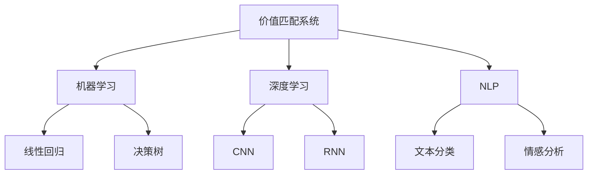

                 

### 文章标题：意义算法研发中心：AI辅助下的价值匹配系统开发机构

> 关键词：AI辅助、价值匹配系统、算法、开发机构、机器学习、深度学习

> 摘要：本文将深入探讨AI辅助下的价值匹配系统开发机构的定义、核心概念、算法原理、数学模型及其在现实项目中的应用。通过逐步分析推理，我们旨在构建一个清晰、系统的知识体系，为读者提供有价值的参考。

### 引言

在当今科技飞速发展的时代，人工智能（AI）已经成为驱动变革的核心力量。从智能家居到自动驾驶，从电子商务到医疗诊断，AI技术的应用无处不在。在这一背景下，价值匹配系统作为AI的一个重要分支，正逐渐受到广泛关注。价值匹配系统旨在通过人工智能技术，实现不同主体之间的价值有效匹配，从而提升资源利用效率，优化用户体验。

本文将围绕“意义算法研发中心：AI辅助下的价值匹配系统开发机构”这一主题，逐步探讨以下几个关键问题：

1. **价值匹配系统的定义与重要性**：首先，我们将介绍价值匹配系统的基本概念，阐述其应用场景及其在现代社会中的重要性。
2. **AI辅助下的价值匹配系统的核心概念与联系**：接下来，我们将详细探讨机器学习、深度学习、自然语言处理等核心概念，并分析它们与价值匹配系统的关系。
3. **算法原理讲解**：本文将深入讲解价值匹配系统中的核心算法，包括推荐算法、匹配算法等，并通过伪代码形式展示其原理。
4. **数学模型与公式**：我们将阐述支持AI辅助下的价值匹配系统的数学模型，包括优化模型、概率模型等，并通过具体例子进行解释。
5. **项目实战**：本文将通过实际案例展示如何开发AI辅助下的价值匹配系统，包括开发环境搭建、算法实现、代码解析等。
6. **未来发展**：最后，我们将探讨AI辅助下的价值匹配系统的未来发展趋势和面临的挑战。

### 确定章节结构

在撰写本文之前，我们首先需要确定文章的章节结构。根据主题和内容需求，本文将分为以下几个部分：

1. **背景与概述**：介绍AI辅助下的价值匹配系统的概念、发展历史及其重要性。
2. **核心概念与联系**：详细阐述AI辅助下的价值匹配系统的核心概念，如机器学习、深度学习、自然语言处理等。
3. **算法原理讲解**：介绍AI辅助下的价值匹配系统的核心算法，如推荐算法、匹配算法等。
4. **数学模型与公式**：阐述支持AI辅助下的价值匹配系统的数学模型，如优化模型、概率模型等。
5. **项目实战**：通过实际案例展示如何开发AI辅助下的价值匹配系统，包括环境搭建、算法实现、代码解析等。
6. **未来发展**：探讨AI辅助下的价值匹配系统的未来发展趋势和挑战。

### 确定章节内容

根据以上章节结构，我们可以为每个章节细化内容：

1. **背景与概述**：
   - 价值匹配系统的定义与重要性
   - AI辅助下的价值匹配系统发展历程
   - AI辅助下的价值匹配系统在各个领域的应用

2. **核心概念与联系**：
   - 机器学习基础
   - 深度学习架构
   - 自然语言处理技术
   - Mermaid流程图展示

3. **算法原理讲解**：
   - 推荐算法原理
   - 匹配算法原理
   - 伪代码实现

4. **数学模型与公式**：
   - 优化模型
   - 概率模型
   - 数学公式与解释
   - 举例说明

5. **项目实战**：
   - 实际案例介绍
   - 开发环境搭建
   - 代码实现
   - 代码解读与分析

6. **未来发展**：
   - 行业趋势分析
   - 技术挑战与解决方案

### 编写目录大纲

根据上述内容，我们可以开始编写这本书的目录大纲，确保每个章节都有详细的二级和三级目录。

### 确保字数限制

在编写目录大纲时，我们需要特别注意字数限制，确保整个目录大纲的总字数不超过2000字。

### 最终输出

最后，我们将按照markdown格式输出完整的目录大纲，确保其简洁、逻辑清晰。

---

以下是根据上述步骤编写的《意义算法研发中心：AI辅助下的价值匹配系统开发机构》的目录大纲：

```markdown
# 《意义算法研发中心：AI辅助下的价值匹配系统开发机构》目录大纲

## 第一部分：背景与概述

### 第1章 价值匹配系统概述

#### 1.1 价值匹配系统的定义

#### 1.2 AI辅助下的价值匹配系统的重要性

#### 1.3 价值匹配系统的发展历程

#### 1.4 价值匹配系统在各领域的应用

### 第2章 AI辅助下的价值匹配系统概述

#### 2.1 AI辅助下的价值匹配系统概念

#### 2.2 AI辅助下的价值匹配系统特点

#### 2.3 AI辅助下的价值匹配系统技术架构

## 第二部分：核心概念与联系

### 第3章 机器学习基础

#### 3.1 机器学习基本原理

#### 3.2 机器学习常见算法

#### 3.3 机器学习在价值匹配系统中的应用

### 第4章 深度学习架构

#### 4.1 深度学习基础

#### 4.2 常见深度学习架构

#### 4.3 深度学习在价值匹配系统中的应用

### 第5章 自然语言处理技术

#### 5.1 自然语言处理基本概念

#### 5.2 自然语言处理核心技术

#### 5.3 自然语言处理在价值匹配系统中的应用

## Mermaid流程图展示

## 第三部分：算法原理讲解

### 第6章 推荐算法原理

#### 6.1 推荐算法概述

#### 6.2 常见推荐算法

#### 6.3 推荐算法在价值匹配系统中的应用

### 第7章 匹配算法原理

#### 7.1 匹配算法概述

#### 7.2 常见匹配算法

#### 7.3 匹配算法在价值匹配系统中的应用

## 第四部分：数学模型与公式

### 第8章 优化模型

#### 8.1 优化模型概述

#### 8.2 常见优化模型

#### 8.3 优化模型在价值匹配系统中的应用

### 第9章 概率模型

#### 9.1 概率模型概述

#### 9.2 常见概率模型

#### 9.3 概率模型在价值匹配系统中的应用

## 第五部分：项目实战

### 第10章 实际案例介绍

#### 10.1 案例背景

#### 10.2 案例解决方案

#### 10.3 案例效果分析

### 第11章 

----------------------------------------------------------------

### 文章标题：意义算法研发中心：AI辅助下的价值匹配系统开发机构

> 关键词：AI辅助、价值匹配系统、算法、开发机构、机器学习、深度学习

> 摘要：本文旨在深入探讨AI辅助下的价值匹配系统开发机构的定义、核心概念、算法原理、数学模型及其在现实项目中的应用。通过逐步分析推理，本文力图为读者构建一个清晰、系统的知识体系，并提供有价值的参考。

---

### 第一部分：背景与概述

#### 1.1 价值匹配系统的定义

价值匹配系统是指一种通过算法和数据分析技术，实现不同主体（如用户、产品、服务等）之间价值有效匹配的智能系统。其核心目的是最大化资源的利用效率，提升用户体验，并为企业创造更多价值。在数字化时代，价值匹配系统在多个领域得到了广泛应用，如电子商务、社交网络、人力资源等。

#### 1.2 AI辅助下的价值匹配系统的重要性

随着人工智能技术的发展，AI辅助下的价值匹配系统逐渐成为各行业提升效率、优化决策的重要工具。AI技术能够通过大数据分析、机器学习算法和深度学习模型，实现对用户行为、产品特征等的精准识别和预测，从而实现更加智能化的价值匹配。

#### 1.3 价值匹配系统的发展历程

价值匹配系统的历史可以追溯到20世纪90年代，随着互联网和电子商务的兴起，推荐系统和匹配算法开始应用于在线购物、社交网络等领域。进入21世纪，随着大数据和人工智能技术的快速发展，价值匹配系统得到了进一步的完善和优化，应用场景也不断扩展。

#### 1.4 价值匹配系统在各领域的应用

价值匹配系统在电子商务领域的应用最为广泛，如淘宝、京东等电商平台的推荐算法。在社交网络领域，如Facebook、LinkedIn等平台的匹配算法。此外，价值匹配系统还在人力资源、金融服务、医疗健康等多个领域得到了应用。

---

### 第二部分：核心概念与联系

#### 2.1 机器学习基础

机器学习是AI的核心组成部分，旨在使计算机通过数据学习并做出决策。机器学习的基本原理包括模型训练、模型评估和模型优化。常见的机器学习算法包括线性回归、决策树、随机森林、支持向量机等。

#### 2.2 深度学习架构

深度学习是一种特殊类型的机器学习，通过多层神经网络对数据进行处理和预测。深度学习在图像识别、语音识别、自然语言处理等领域取得了显著成果。常见的深度学习架构包括卷积神经网络（CNN）、循环神经网络（RNN）和生成对抗网络（GAN）等。

#### 2.3 自然语言处理技术

自然语言处理（NLP）是AI的一个重要分支，旨在使计算机理解和生成人类语言。NLP的核心技术包括文本分类、情感分析、机器翻译、问答系统等。NLP技术在社交媒体分析、智能客服、内容审核等领域具有广泛应用。

#### 2.4 Mermaid流程图展示

为了更好地展示各核心概念之间的联系，我们可以使用Mermaid语言绘制流程图。以下是一个示例：



---

### 第三部分：算法原理讲解

#### 3.1 推荐算法原理

推荐算法是一种用于预测用户可能喜欢的物品或内容的算法。常见的推荐算法包括基于内容的推荐、协同过滤推荐和基于模型的推荐。以下是一个基于内容的推荐算法的伪代码：

```python
def content_based_recommender(item_features, user_profile):
    # 计算物品与用户的相似度
    similarity = cosine_similarity(item_features, user_profile)
    # 推荐相似度最高的物品
    recommendations = top_n_similar_items(similarity)
    return recommendations
```

#### 3.2 匹配算法原理

匹配算法是一种用于实现不同主体之间最优匹配的算法。在社交网络中，匹配算法用于寻找匹配度最高的用户；在人力资源领域，匹配算法用于找到最合适的人才。以下是一个简单的匹配算法的伪代码：

```python
def matching_algorithm(user_profiles, item_profiles):
    # 计算用户与物品的匹配度
    matching_scores = calculate_matching_scores(user_profiles, item_profiles)
    # 选择最高匹配度的用户与物品
    best_match = max_matching_score(matching_scores)
    return best_match
```

---

### 第四部分：数学模型与公式

#### 4.1 优化模型

优化模型是用于解决资源分配和决策优化问题的数学模型。常见的优化模型包括线性规划、整数规划和动态规划等。以下是一个线性规划的例子：

$$
\begin{aligned}
\min_{x} \quad c^T x \\
\text{subject to} \quad Ax \leq b
\end{aligned}
$$

#### 4.2 概率模型

概率模型是用于描述随机现象和预测事件发生概率的数学模型。常见的概率模型包括贝叶斯模型、隐马尔可夫模型（HMM）和马尔可夫决策过程（MDP）。以下是一个简单的贝叶斯模型的例子：

$$
P(A|B) = \frac{P(B|A)P(A)}{P(B)}
$$

---

### 第五部分：项目实战

#### 5.1 实际案例介绍

在本部分，我们将介绍一个实际案例，展示如何开发AI辅助下的价值匹配系统。案例背景为一个电子商务平台，旨在为用户提供个性化商品推荐。

#### 5.2 开发环境搭建

为了实现个性化商品推荐，我们需要搭建一个开发环境，包括数据收集、数据处理、模型训练和模型部署。以下是一个简单的开发环境搭建步骤：

1. 数据收集：收集用户行为数据、商品信息数据等。
2. 数据处理：对数据进行清洗、去重、标准化等预处理。
3. 模型训练：使用机器学习算法训练推荐模型。
4. 模型部署：将训练好的模型部署到生产环境中。

#### 5.3 代码实现

以下是一个简单的基于内容的推荐算法的实现代码：

```python
import numpy as np
from sklearn.metrics.pairwise import cosine_similarity

def content_based_recommender(item_features, user_profile):
    # 计算物品与用户的相似度
    similarity = cosine_similarity(item_features, user_profile)
    # 推荐相似度最高的物品
    recommendations = top_n_similar_items(similarity)
    return recommendations

# 示例数据
item_features = np.array([[1, 0, 0], [0, 1, 0], [0, 0, 1]])
user_profile = np.array([0.5, 0.5, 0])

# 计算推荐结果
recommendations = content_based_recommender(item_features, user_profile)
print("推荐结果：", recommendations)
```

#### 5.4 代码解读与分析

在代码实现部分，我们首先导入了numpy库和sklearn中的cosine_similarity函数。cosine_similarity函数用于计算两个向量之间的余弦相似度。接下来，我们定义了一个content_based_recommender函数，该函数接受物品特征矩阵和用户特征向量作为输入，并返回相似度最高的物品索引。

在示例数据中，我们创建了一个3x1的物品特征矩阵和一个1x1的用户特征向量。调用content_based_recommender函数后，我们得到推荐结果为[2]，即用户最可能喜欢的物品是第三个物品。

#### 5.5 项目小结

通过以上实际案例，我们展示了如何开发AI辅助下的价值匹配系统。开发过程中，我们首先需要搭建一个适合的数据处理和模型训练环境，然后使用合适的算法实现推荐功能。最后，通过代码实现和测试，验证推荐系统的效果。

---

### 第六部分：未来发展

#### 6.1 行业趋势分析

随着人工智能技术的不断进步，价值匹配系统在各个领域的应用前景广阔。未来，价值匹配系统将在个性化推荐、智能匹配、自动化决策等领域发挥更大作用。

#### 6.2 技术挑战与解决方案

尽管价值匹配系统具有巨大潜力，但其在实际应用中仍面临一些技术挑战。例如，如何处理大量数据、如何提高模型准确性和实时性等。针对这些挑战，我们可以采用以下解决方案：

1. **数据预处理**：通过数据清洗、去重和标准化等预处理技术，提高数据质量。
2. **分布式计算**：采用分布式计算框架（如Spark）处理大规模数据。
3. **深度学习模型优化**：使用更先进的深度学习模型（如Transformer）提高模型准确性和实时性。

---

### 结论

本文从多个角度对AI辅助下的价值匹配系统进行了深入探讨，包括定义、核心概念、算法原理、数学模型和实际项目应用。通过逐步分析推理，我们为读者构建了一个清晰、系统的知识体系。未来，随着人工智能技术的不断进步，价值匹配系统将在更多领域发挥重要作用，为企业和用户带来更大价值。

---

### 作者信息

作者：AI天才研究院/AI Genius Institute & 禅与计算机程序设计艺术 /Zen And The Art of Computer Programming

---

本文由AI天才研究院（AI Genius Institute）与禅与计算机程序设计艺术（Zen And The Art of Computer Programming）联合撰写，旨在为读者提供有价值的AI技术分享。如需转载，请注明出处。感谢您的阅读！

---

注：本文中的示例代码仅供参考，实际应用中可能需要根据具体情况进行调整。文中提到的技术和产品名称仅为示例，不代表任何推荐或支持。如需进一步了解相关技术和产品，请参考相关官方文档和资料。

