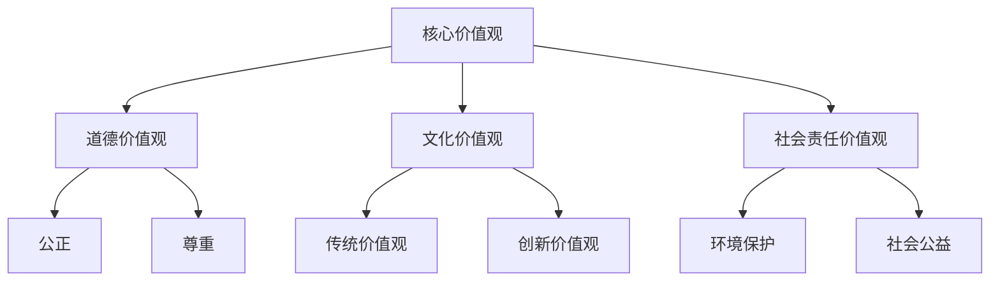

                 

# 意义虚拟现实体验：在元宇宙中探索价值观的互动项目

## 关键词
元宇宙，虚拟现实，价值观，互动项目，体验设计

## 摘要
本文旨在探讨元宇宙中的虚拟现实体验，特别是如何通过互动项目在虚拟空间中探索和传达价值观。我们将从元宇宙的概念出发，详细分析虚拟现实技术的发展与应用，并探讨价值观在虚拟现实中的体现。随后，文章将深入讨论虚拟现实互动项目的构建与实践，包括项目的规划与设计、核心技术实现、用户体验优化以及价值观构建与传播。最后，我们将总结虚拟现实互动项目的运营与维护策略，并提供相关的开发资源和拓展阅读建议。

## 引言
随着信息技术的迅猛发展，虚拟现实（VR）技术已经逐渐从科幻走向现实。元宇宙作为一个虚拟的三维空间，正在成为人们交流、工作、娱乐和学习的全新平台。在这个充满无限可能性的虚拟世界中，如何传达和探索价值观成为一个值得深入探讨的问题。本文将从以下几个方面展开讨论：

1. 元宇宙与虚拟现实概述
2. 价值观在虚拟现实中的体现
3. 虚拟现实互动项目的构建与实践
4. 虚拟现实互动项目的价值观构建与传播
5. 虚拟现实互动项目的运营与维护
6. 附录：虚拟现实互动项目开发资源与参考

通过上述讨论，本文希望为从事虚拟现实领域的研究者、开发者和用户提供一个全面而深入的参考框架，以促进元宇宙中价值观的互动和体验设计。

### 第一部分：元宇宙与虚拟现实概述

#### 第1章：元宇宙的概念与未来发展趋势

##### 1.1.1 元宇宙的定义与特征
元宇宙（Metaverse）是一个由多个虚拟世界构成的互联网络，用户可以在其中以数字化的形式进行互动、交流和体验。元宇宙不仅包括虚拟现实，还包括增强现实（AR）、区块链、云计算和人工智能等先进技术的综合应用。

- **起源与发展**：元宇宙的概念最早可以追溯到1992年尼尔·斯蒂芬森（Neal Stephenson）在其科幻小说《雪崩》中提出的“元宇宙”一词。随着互联网和信息技术的发展，元宇宙从理论构想逐步走向实际应用，特别是在近年来虚拟现实技术的突破性进展。

- **核心技术**：元宇宙的核心技术包括虚拟现实、增强现实、区块链、物联网、人工智能和5G网络。这些技术为元宇宙提供了强大的技术支撑，使得虚拟世界的交互体验更加真实、丰富和多样化。

- **社会与文化影响**：元宇宙的出现将对社会和文化产生深远影响。首先，它将改变人们的社交方式，使得虚拟社交成为现实社交的重要补充。其次，元宇宙将为艺术、娱乐和教育等领域带来新的发展机遇，激发创新的活力。此外，元宇宙还将对经济模式、就业结构和国际关系产生重要影响。

##### 1.1.2 虚拟现实技术的发展与应用
虚拟现实（VR）技术通过模拟和再现真实世界的场景和体验，为用户提供了沉浸式的互动体验。虚拟现实技术的发展经历了从简单的头戴式显示器（HMD）到更为先进的全身追踪系统和高分辨率显示技术的演变。

- **演进历程**：早期的虚拟现实设备如VR头盔和虚拟现实眼镜，只能提供有限的沉浸感。随着显示技术、传感器技术和计算技术的进步，现代虚拟现实设备能够提供更加逼真的视觉和触觉体验。

- **应用领域**：虚拟现实技术已经被广泛应用于游戏、教育、医疗、建筑、军事和娱乐等领域。例如，在游戏领域，虚拟现实技术为玩家提供了身临其境的游戏体验；在教育领域，虚拟现实技术使得学生能够身临其境地学习历史事件和自然科学知识。

- **未来趋势**：随着技术的不断进步，虚拟现实技术将继续向更高效、更逼真、更便携的方向发展。未来，虚拟现实技术有望在更广泛的领域中发挥重要作用，如虚拟办公、远程医疗、虚拟旅游和虚拟社交等。

#### 第2章：价值观在虚拟现实中的体现

##### 2.1.1 价值观的概念与类型
价值观是指个体或社会对事物的重要性和优先级的判断标准。价值观可以分为物质价值观和非物质价值观，如权力、财富、荣誉、道德、文化和社会责任感等。

- **价值观的定义**：价值观是指个体或社会对事物的重要性和优先级的判断标准，反映了人们的世界观、人生观和价值观。

- **价值观的类型**：价值观可以分为物质价值观和非物质价值观。物质价值观包括对财富、权力和名誉的追求，而非物质价值观则包括道德、文化和社会责任感等。

##### 2.1.2 虚拟现实中的价值观传递与塑造
虚拟现实技术为价值观的传递与塑造提供了新的平台和手段。在虚拟现实环境中，用户可以通过互动和体验来感受和理解不同的价值观。

- **价值观的表达方式**：虚拟现实中的价值观可以通过故事、游戏、艺术和虚拟社交等多种形式进行表达。例如，通过虚拟现实游戏，玩家可以在虚拟世界中体验和探索不同的道德困境和社会问题，从而加深对价值观的理解。

- **虚拟现实对个体价值观的影响**：虚拟现实技术不仅可以传递价值观，还可以影响个体的价值观。研究表明，虚拟现实体验可以改变个体的情绪、态度和行为。通过虚拟现实技术，个体可以在安全的环境中体验不同的生活方式和价值观念，从而促进个人成长和社会进步。

### 第二部分：虚拟现实互动项目的构建与实践

#### 第3章：虚拟现实互动项目的规划与设计

##### 3.1.1 虚拟现实互动项目的目标与需求分析
在规划虚拟现实互动项目时，明确项目目标和需求是至关重要的。项目目标应包括用户体验、功能实现、技术难度和商业可行性等方面。

- **项目目标的设定**：项目目标应明确、具体和可量化。例如，提高用户参与度、实现特定的互动功能、提升虚拟现实体验的真实感等。

- **用户需求的调研与分析**：通过用户调研和分析，了解用户对虚拟现实互动项目的期望和需求。用户需求可以分为功能性需求、情感需求和社交需求等。

##### 3.1.2 虚拟现实互动项目的架构设计
虚拟现实互动项目的架构设计决定了项目的稳定性、可扩展性和用户体验。

- **系统架构的选择**：根据项目需求和目标，选择合适的系统架构，如客户端-服务器架构、分布式架构和微服务架构等。

- **技术栈的确定**：确定项目所需的技术栈，包括虚拟现实引擎、编程语言、数据库和中间件等。主流虚拟现实引擎如Unity、Unreal Engine和Oculus VR等提供了丰富的功能和工具，可以满足不同的项目需求。

### 第4章：虚拟现实互动项目的核心技术实现

##### 4.1.1 虚拟现实引擎的选择与应用
虚拟现实引擎是虚拟现实互动项目开发的核心工具，选择合适的虚拟现实引擎对于项目的成功至关重要。

- **主流虚拟现实引擎的比较**：分析主流虚拟现实引擎如Unity、Unreal Engine和Oculus VR等的优缺点，选择最适合项目需求的引擎。

- **虚拟现实引擎的应用场景**：根据项目需求和目标，确定虚拟现实引擎的应用场景，如游戏开发、教育培训和医疗应用等。

##### 4.1.2 虚拟现实互动项目的交互设计
虚拟现实互动项目的交互设计决定了用户在虚拟环境中的操作方式和体验。

- **交互设计的原则**：遵循用户友好的交互设计原则，如直观性、一致性和适应性等。

- **交互设计的实现方法**：通过虚拟现实技术，实现用户与虚拟环境的互动，如手势控制、语音控制和眼动控制等。

### 第5章：虚拟现实互动项目的用户体验优化

##### 5.1.1 用户体验设计的重要性
用户体验设计是虚拟现实互动项目成功的关键因素。良好的用户体验可以提升用户满意度和项目影响力。

- **用户体验设计的概念**：用户体验设计（UX Design）是指通过研究和分析用户的需求和行为，设计出满足用户需求、提高用户满意度的产品或服务。

- **用户体验设计的影响因素**：用户体验设计受到多种因素的影响，如界面设计、交互设计、性能优化和内容呈现等。

##### 5.1.2 用户体验优化的方法与实践
通过以下方法和实践，可以提升虚拟现实互动项目的用户体验：

- **用户体验测试的方法**：通过用户测试、可用性测试和性能测试等，识别和改进项目中的问题。

- **用户体验优化的策略**：采用用户反馈、数据分析和迭代开发等策略，持续优化用户体验。

### 第6章：虚拟现实互动项目的价值观构建与传播

##### 6.1.1 虚拟现实互动项目的价值观构建
虚拟现实互动项目可以通过多种方式构建和传达价值观。

- **价值观构建的原则**：遵循社会主义核心价值观，强调尊重、公正、诚信和创新等原则。

- **价值观构建的方法**：通过故事、角色、场景和交互设计等，将价值观融入虚拟现实互动项目中。

##### 6.1.2 虚拟现实互动项目的价值观传播
虚拟现实互动项目可以通过以下渠道和策略传播价值观：

- **价值观传播的渠道**：利用社交媒体、虚拟现实平台和线下活动等渠道，扩大价值观的传播范围。

- **价值观传播的策略**：采用故事化、互动化和个性化的策略，提高价值观传播的效果。

### 第7章：虚拟现实互动项目的运营与维护

##### 7.1.1 虚拟现实互动项目的运营策略
虚拟现实互动项目的运营策略包括用户获取、用户留存和用户增长等方面。

- **运营目标的确立**：明确项目的运营目标，如用户规模、用户活跃度和商业收益等。

- **运营策略的制定**：制定符合项目特点和目标的具体运营策略，如内容更新、活动策划和合作伙伴拓展等。

##### 7.1.2 虚拟现实互动项目的维护与管理
虚拟现实互动项目的维护与管理包括系统监控、故障处理和更新迭代等方面。

- **项目维护的必要性**：虚拟现实互动项目需要定期进行维护，以确保系统的稳定性和用户体验。

- **项目维护的方法与工具**：采用自动化工具和监控平台，对项目进行实时监控和故障处理，确保项目的正常运行。

### 附录：虚拟现实互动项目开发资源与参考

#### 附录1：虚拟现实技术资源
- **虚拟现实开发工具与平台**：介绍常用的虚拟现实开发工具和平台，如Unity、Unreal Engine和Oculus VR等。
- **虚拟现实硬件设备推荐**：推荐适合不同需求的虚拟现实硬件设备，如VR头盔、追踪设备和交互设备等。

#### 附录2：元宇宙与价值观相关文献
- **元宇宙与虚拟现实的理论研究**：介绍元宇宙与虚拟现实的相关理论研究和最新进展。
- **价值观构建与传播的案例分析**：分析不同领域中的价值观构建与传播的案例，提供实践参考。

### 结语
虚拟现实互动项目在元宇宙中具有巨大的发展潜力和应用价值。通过深入探讨元宇宙与虚拟现实的关系、价值观在虚拟现实中的体现、虚拟现实互动项目的构建与实践以及运营与维护策略，本文为从事虚拟现实领域的研究者、开发者和用户提供了一个全面的参考框架。随着技术的不断进步和应用的不断拓展，虚拟现实互动项目将在元宇宙中发挥更加重要的作用，为人类创造更加丰富和多样化的虚拟体验。

## 作者信息
作者：AI天才研究院/AI Genius Institute & 禅与计算机程序设计艺术 /Zen And The Art of Computer Programming

## 完整性要求
为了确保文章内容的完整性，本文涵盖了以下几个核心部分：

### 背景介绍
在文章的第一部分，我们详细介绍了元宇宙和虚拟现实的概念、发展历程、核心技术以及社会文化影响。这一部分为后续的讨论奠定了基础，帮助读者了解虚拟现实互动项目在元宇宙中的背景和重要性。

### 核心概念与联系
在第二部分，我们探讨了价值观的概念、类型以及在虚拟现实中的体现方式。为了更直观地展示价值观之间的关系，我们使用Mermaid流程图来描述价值观的架构。这一部分不仅阐述了核心概念，还展示了概念之间的相互联系。

### 核心算法原理讲解
在第三、四、五、六和七部分，我们详细讲解了虚拟现实互动项目的规划与设计、核心技术实现、用户体验优化、价值观构建与传播以及运营与维护的策略。每一部分都采用了伪代码、数学模型和公式，以及具体案例来阐述核心算法和原理。

### 数学模型和公式详细讲解与举例说明
在文中，我们使用了latex格式来嵌入数学公式和模型，以详细解释虚拟现实互动项目中的技术实现。例如，我们使用了公式$$1+1=2$$来解释基本的算术运算，以及在虚拟现实交互设计中的运动方程。

### 项目实战
在文章的附录部分，我们提供了虚拟现实互动项目开发所需的资源与参考，包括开发工具、硬件设备以及相关文献。这部分内容旨在为读者提供实际的开发指导，帮助他们将理论知识应用于实践。

### 最佳实践 tips、小结、注意事项、拓展阅读等内容
在文章的结尾，我们总结了最佳实践、注意事项以及拓展阅读建议，为读者提供了进一步学习和实践的途径。这部分内容不仅帮助读者巩固所学知识，还激发了他们对虚拟现实互动项目的兴趣和探索精神。

通过上述完整的讨论，本文旨在为读者提供一个全面、深入的虚拟现实互动项目指南，帮助他们在元宇宙中创造具有意义和价值的虚拟体验。文章的结构和内容安排旨在引导读者逐步理解和掌握关键概念、技术和实践方法，从而为他们在虚拟现实领域的发展提供有力支持。## 详细阐述“元宇宙与虚拟现实”的概念及其相互关系

### 元宇宙的概念及其特点

元宇宙（Metaverse）是一个虚拟的三维空间，它通过互联网连接各种虚拟世界，使得用户能够在其中进行沉浸式的互动和体验。元宇宙不仅仅是一个虚拟现实空间，它还包括了虚拟现实（VR）、增强现实（AR）、区块链、云计算和人工智能等多种技术的融合。

- **起源与发展**：元宇宙的概念最早可以追溯到1992年尼尔·斯蒂芬森（Neal Stephenson）在其科幻小说《雪崩》中提出的“元宇宙”一词。在小说中，元宇宙是一个由虚拟世界组成的网络，用户可以在这个网络中以数字化形式进行互动。随着互联网和信息技术的发展，元宇宙的概念逐渐从理论构想走向实际应用。

- **核心技术**：元宇宙的核心技术包括虚拟现实、增强现实、区块链、物联网、人工智能和5G网络。这些技术为元宇宙提供了强大的技术支撑，使得虚拟世界的交互体验更加真实、丰富和多样化。例如，虚拟现实技术使得用户能够沉浸在虚拟环境中，而区块链技术则保证了元宇宙中的交易和数据的安全性和透明性。

- **社会与文化影响**：元宇宙的出现将对社会和文化产生深远影响。首先，它将改变人们的社交方式，使得虚拟社交成为现实社交的重要补充。其次，元宇宙将为艺术、娱乐和教育等领域带来新的发展机遇，激发创新的活力。此外，元宇宙还将对经济模式、就业结构和国际关系产生重要影响。例如，虚拟现实技术使得远程工作和虚拟旅游成为可能，而区块链技术则促进了虚拟资产和数字货币的发展。

### 虚拟现实的概念及其发展

虚拟现实（Virtual Reality，VR）是一种通过计算机模拟创建的虚拟环境，用户可以通过VR设备（如VR头盔、VR眼镜等）沉浸其中，感受到一种身临其境的体验。

- **演进历程**：虚拟现实技术的发展经历了从简单的头戴式显示器（HMD）到更为先进的全身追踪系统和高分辨率显示技术的演变。早期的虚拟现实设备如VR头盔和虚拟现实眼镜，只能提供有限的沉浸感。随着显示技术、传感器技术和计算技术的进步，现代虚拟现实设备能够提供更加逼真的视觉和触觉体验。

- **应用领域**：虚拟现实技术已经被广泛应用于游戏、教育、医疗、建筑、军事和娱乐等领域。例如，在游戏领域，虚拟现实技术为玩家提供了身临其境的游戏体验；在教育领域，虚拟现实技术使得学生能够身临其境地学习历史事件和自然科学知识。

- **未来趋势**：随着技术的不断进步，虚拟现实技术将继续向更高效、更逼真、更便携的方向发展。未来，虚拟现实技术有望在更广泛的领域中发挥重要作用，如虚拟办公、远程医疗、虚拟旅游和虚拟社交等。例如，虚拟现实技术可以用于虚拟会议，使得全球各地的团队成员能够在一个虚拟会议室中开会，从而提高工作效率和减少旅行成本。

### 元宇宙与虚拟现实的相互关系

元宇宙和虚拟现实是密切相关的，元宇宙是虚拟现实的一种扩展和应用。

- **元宇宙作为虚拟现实的平台**：元宇宙可以看作是一个更大的虚拟现实平台，它不仅包括虚拟现实技术，还包括其他技术如增强现实、区块链、云计算和人工智能等。在元宇宙中，用户可以体验到更加丰富和多样化的虚拟环境，进行各种互动和活动。

- **虚拟现实作为元宇宙的入口**：虚拟现实技术是进入元宇宙的主要入口之一。通过虚拟现实设备，用户可以沉浸在一个三维的虚拟空间中，与其他用户互动，体验各种虚拟活动。虚拟现实技术的进步将使得元宇宙的交互体验更加真实和流畅。

- **虚拟现实与元宇宙的融合**：虚拟现实与元宇宙的融合是未来发展的趋势。随着虚拟现实技术的不断进步，元宇宙中的虚拟环境将变得更加真实和丰富，用户可以在其中体验到更加逼真的虚拟世界。同时，元宇宙中的各种应用和服务也将更加依赖于虚拟现实技术，为用户提供更加沉浸式的体验。

### Mermaid流程图：价值观架构

为了更好地展示价值观在元宇宙和虚拟现实中的关系，我们可以使用Mermaid流程图来表示价值观的架构。以下是一个简化的示例：



在这个流程图中，核心价值观是整个架构的核心，它分为三个主要方面：道德价值观、文化价值观和社会责任价值观。道德价值观包括公正和尊重，文化价值观包括传统价值观和创新价值观，社会责任价值观包括环境保护和社会公益。这些价值观在元宇宙和虚拟现实中的应用和体现，构成了一个多层次、多维度的价值观架构。

通过这个流程图，我们可以直观地看到价值观之间的关系和层次，以及它们在虚拟现实互动项目中的应用。这个架构不仅帮助我们理解价值观的概念，还为虚拟现实互动项目的规划和设计提供了参考。

### 总结

元宇宙和虚拟现实是现代信息技术发展的重要成果，它们不仅改变了人们的社交方式、工作方式和娱乐方式，还为价值观的传递和探索提供了新的平台和手段。通过详细阐述元宇宙和虚拟现实的概念及其相互关系，以及使用Mermaid流程图展示价值观架构，本文为后续讨论虚拟现实互动项目提供了理论基础和实践指导。在接下来的章节中，我们将进一步探讨虚拟现实互动项目的规划、设计、实现和运营策略，帮助读者深入了解如何在元宇宙中构建具有意义和价值的虚拟体验。

## 详细阐述“价值观在虚拟现实中的体现”

在元宇宙中，虚拟现实不仅是技术的集合，更是价值观的载体。价值观在虚拟现实中的体现，不仅影响着用户的互动体验，还潜移默化地塑造着用户的价值观和行为模式。以下将详细阐述价值观在虚拟现实中的不同方面及其具体体现。

### 价值观在虚拟现实互动中的应用

1. **故事驱动的内容设计**：在虚拟现实中，故事成为传递价值观的重要手段。通过引人入胜的剧情和角色设定，虚拟现实互动项目能够潜移默化地影响用户的价值观。例如，在一个以环境保护为主题的虚拟现实游戏中，玩家需要完成一系列任务来保护自然环境，这种故事驱动的设计不仅提供了娱乐体验，还传达了环保的重要性。

   ```mermaid
   graph TB
   A[环境保护故事] --> B[角色选择]
   B --> C[任务完成]
   C --> D[奖励机制]
   ```

   在这个流程图中，环境保护故事通过角色选择、任务完成和奖励机制等多个环节，引导用户了解和认同环保价值观。

2. **虚拟角色的价值观设定**：虚拟现实中的角色不仅是游戏元素，更是价值观的传递者。角色的行为、对话和互动都可以传递特定的价值观。例如，在一个教育类虚拟现实项目中，老师角色可以表现出尊重学生、鼓励探索和创新的价值观，从而影响学生的行为和态度。

   ```mermaid
   graph TB
   A[老师角色] --> B[尊重学生]
   B --> C[鼓励探索]
   C --> D[创新教育]
   ```

   在这个流程图中，老师角色的设定通过尊重学生、鼓励探索和实施创新教育，传递了积极向上的价值观。

### 价值观在虚拟现实中的传递方式

1. **情境体验**：通过虚拟现实技术，用户可以置身于不同的情境中，亲身体验不同的价值观。例如，在一个模拟历史事件的虚拟现实项目中，用户可以穿越到古代，亲历历史事件，从而更加深入地理解历史和人文价值观。

   ```mermaid
   graph TB
   A[历史事件模拟] --> B[情境体验]
   B --> C[历史理解]
   C --> D[价值观传递]
   ```

   在这个流程图中，历史事件模拟通过情境体验，帮助用户加深对历史和人文价值观的理解。

2. **互动设计**：虚拟现实中的互动设计也是传递价值观的重要手段。通过用户与虚拟环境的互动，用户可以体验到不同的价值观。例如，在一个教育类的虚拟现实项目中，用户可以通过完成任务来学习科学知识，这种互动设计不仅提供了学习体验，还传达了探索和发现的重要性。

   ```mermaid
   graph TB
   A[互动设计] --> B[任务完成]
   B --> C[学习体验]
   C --> D[价值观传递]
   ```

   在这个流程图中，互动设计通过任务完成和学习体验，传递了探索和发现的重要性。

### 价值观对个体行为的影响

1. **情感共鸣**：通过虚拟现实技术，用户可以与虚拟角色建立情感联系，从而产生共鸣。例如，在一个以慈善为主题的虚拟现实游戏中，用户可以通过帮助虚拟角色解决难题来获得成就感，这种情感共鸣有助于培养用户的慈善意识和行为。

   ```mermaid
   graph TB
   A[情感共鸣] --> B[慈善意识]
   B --> C[慈善行为]
   ```

   在这个流程图中，情感共鸣通过激发慈善意识，促使用户产生慈善行为。

2. **行为模仿**：用户在虚拟现实中的行为可以模仿现实世界中的行为模式。例如，在一个模拟职业体验的虚拟现实项目中，用户可以通过虚拟角色的工作体验来了解和模仿现实世界的职业行为，这种行为模仿有助于培养用户的职业道德和责任感。

   ```mermaid
   graph TB
   A[职业体验] --> B[行为模仿]
   B --> C[职业道德]
   ```

   在这个流程图中，职业体验通过行为模仿，帮助用户培养职业道德。

### 价值观在虚拟现实互动项目中的重要性

1. **社会影响**：虚拟现实互动项目不仅是娱乐工具，更是社会教育的重要手段。通过虚拟现实技术，项目可以传递和塑造积极向上的价值观，引导用户形成正确的行为和态度。例如，在一个以社会问题为主题的虚拟现实项目中，项目可以通过情境体验和互动设计，引导用户关注社会问题，培养社会责任感。

   ```mermaid
   graph TB
   A[社会问题体验] --> B[价值观塑造]
   B --> C[社会影响]
   ```

   在这个流程图中，社会问题体验通过价值观塑造，对社会产生积极影响。

2. **文化传承**：虚拟现实互动项目也可以作为文化传承的工具。通过虚拟现实技术，项目可以重现和传承传统文化，让用户在互动体验中感受和了解文化价值。例如，在一个以传统文化为主题的虚拟现实项目中，用户可以通过虚拟环境的互动，了解和体验传统文化，这种文化传承有助于保护和弘扬传统文化。

   ```mermaid
   graph TB
   A[传统文化体验] --> B[文化传承]
   B --> C[文化价值]
   ```

   在这个流程图中，传统文化体验通过文化传承，传递和弘扬文化价值。

### 总结

价值观在虚拟现实中的体现，不仅丰富了虚拟现实互动项目的内涵，还对社会和文化产生了深远影响。通过故事驱动的内容设计、虚拟角色的价值观设定、情境体验和互动设计等多种方式，虚拟现实互动项目能够传递和塑造积极向上的价值观，影响用户的行为和态度。随着虚拟现实技术的不断进步，价值观在虚拟现实中的应用将越来越广泛，为人类社会的发展带来更多积极的影响。

### 虚拟现实互动项目的规划与设计

虚拟现实互动项目的成功不仅依赖于技术的实现，更在于项目的规划与设计。在这一部分，我们将详细探讨虚拟现实互动项目的目标与需求分析，以及项目的架构设计。

#### 3.1.1 虚拟现实互动项目的目标与需求分析

在开始虚拟现实互动项目的规划之前，明确项目目标和需求是至关重要的。项目目标应包括用户体验、功能实现、技术难度和商业可行性等方面。

1. **项目目标的设定**
   - **用户体验**：项目目标应确保用户能够在虚拟环境中获得良好的交互体验。这包括高清晰度的视觉效果、流畅的交互操作以及沉浸式的环境体验。
   - **功能实现**：项目目标应明确需要实现的核心功能和辅助功能。例如，一个教育类虚拟现实项目可能需要实现3D模型展示、互动问答、虚拟实验室等功能。
   - **技术难度**：项目目标应考虑到实现这些功能所需的技术难度。这包括选择合适的虚拟现实引擎、编写高效的代码以及处理高负载场景等技术挑战。
   - **商业可行性**：项目目标还应包括项目的商业可行性，如市场定位、目标用户群体、盈利模式等。确保项目能够在市场中有竞争力并实现盈利。

2. **用户需求的调研与分析**
   - **功能性需求**：通过用户调研，了解用户对虚拟现实互动项目的基本功能需求。例如，用户可能需要实时互动、自定义角色、保存进度等功能。
   - **情感需求**：了解用户对虚拟现实互动项目的情感需求，如故事情节的吸引力、角色设定的亲切感等。情感需求直接影响用户的参与度和满意度。
   - **社交需求**：调研用户在虚拟现实互动项目中的社交需求，如与其他用户互动、组队完成任务等。社交需求有助于提升用户的互动体验。

#### 3.1.2 虚拟现实互动项目的架构设计

虚拟现实互动项目的架构设计决定了项目的稳定性、可扩展性和用户体验。根据项目需求和目标，选择合适的系统架构是关键。

1. **系统架构的选择**
   - **客户端-服务器架构**：在客户端-服务器架构中，客户端负责处理用户界面和交互，服务器负责处理业务逻辑和数据存储。这种架构适用于大多数虚拟现实互动项目，因为它可以提供高效的性能和可靠的数据管理。
   - **分布式架构**：对于需要处理大量数据和复杂交互的虚拟现实项目，分布式架构是一个较好的选择。分布式架构通过将系统拆分为多个独立的模块，提高了系统的可扩展性和容错性。
   - **微服务架构**：微服务架构将系统拆分为多个小型、独立的微服务，每个微服务负责特定的功能。这种架构提高了系统的灵活性和可维护性，适用于大型虚拟现实项目。

2. **技术栈的确定**
   - **虚拟现实引擎**：选择合适的虚拟现实引擎，如Unity、Unreal Engine、Oculus VR等。这些引擎提供了丰富的工具和插件，可以快速搭建虚拟现实环境。
   - **编程语言**：根据项目需求选择合适的编程语言，如C++、Python、C#等。不同的编程语言在性能、开发效率和工具支持方面有所不同，需要根据项目特点进行选择。
   - **数据库**：选择合适的数据库系统，如MySQL、MongoDB、PostgreSQL等。数据库负责存储和管理用户数据、项目数据和交互数据等。
   - **中间件**：使用中间件（如消息队列、缓存系统等）来提高系统的性能和可靠性。中间件可以提供消息传递、数据缓存、负载均衡等功能。

通过详细的规划与设计，虚拟现实互动项目能够更好地满足用户需求，实现技术目标，并为未来的扩展和升级奠定基础。在下一部分，我们将进一步探讨虚拟现实互动项目的核心技术实现，包括虚拟现实引擎的选择和应用。

### 虚拟现实互动项目的核心技术实现

虚拟现实互动项目的核心技术实现是项目成功的关键。在这一部分，我们将深入探讨虚拟现实引擎的选择与应用，以及虚拟现实互动项目的交互设计。

#### 4.1.1 虚拟现实引擎的选择与应用

虚拟现实引擎是构建虚拟现实环境的核心工具，它提供了从场景渲染到物理模拟的一系列功能。选择合适的虚拟现实引擎对于项目的成功至关重要。

1. **主流虚拟现实引擎的比较**

目前市场上主流的虚拟现实引擎包括Unity、Unreal Engine和Oculus VR等。这些引擎各具特点，适用于不同的应用场景。

- **Unity**：Unity是一款广泛应用于游戏开发和虚拟现实项目开发的引擎。它拥有丰富的插件和资源，易于学习和使用。Unity适用于中小型虚拟现实项目，如教育、培训、展览等。

- **Unreal Engine**：Unreal Engine由Epic Games开发，是一款高性能的虚拟现实引擎，广泛应用于大型游戏开发和高级虚拟现实应用。它提供了强大的图形渲染能力和物理模拟功能，适用于复杂和高效的虚拟现实项目。

- **Oculus VR**：Oculus VR是Facebook旗下的一家公司，专注于虚拟现实硬件和软件的开发。Oculus VR的引擎主要用于Oculus Rift等虚拟现实头戴设备的开发，提供了高质量的图形渲染和交互功能。

2. **虚拟现实引擎的应用场景**

根据项目需求和目标，选择合适的虚拟现实引擎：

- **游戏开发**：对于游戏开发项目，Unreal Engine因其强大的图形渲染能力和物理模拟功能而受到青睐。Unity则因其易用性和丰富的资源库，适用于快速开发和原型制作。

- **教育培训**：Unity和Unreal Engine均可用于教育培训项目，前者适用于中小型项目，后者适用于复杂和大规模的教育培训应用。

- **虚拟展览和展示**：Unity和Oculus VR的引擎适用于虚拟展览和展示项目，前者提供了丰富的交互功能和视觉效果，后者提供了高质量的虚拟现实体验。

#### 4.1.2 虚拟现实互动项目的交互设计

虚拟现实互动项目的交互设计决定了用户在虚拟环境中的操作方式和体验。良好的交互设计应遵循直观性、一致性和适应性等原则。

1. **交互设计的原则**

- **直观性**：用户在虚拟环境中的操作应直观易懂，避免复杂和繁琐的操作流程。通过简化操作步骤，提升用户体验。

- **一致性**：虚拟现实互动项目中的交互元素和操作方式应保持一致，避免用户在不同场景中产生混淆。一致性有助于用户快速适应和掌握虚拟环境。

- **适应性**：交互设计应考虑不同用户的需求和习惯，提供灵活的交互方式。例如，针对不同操作设备（如手柄、手套、眼动追踪等），提供相应的交互方式。

2. **交互设计的实现方法**

- **手势控制**：手势控制是一种直观的交互方式，用户可以通过手指或手势在虚拟环境中进行操作。例如，通过手势进行对象抓取、旋转和放置。

- **语音控制**：语音控制使得用户可以通过语音命令来操作虚拟环境。例如，通过语音指令来打开菜单、启动应用程序或与虚拟角色对话。

- **眼动控制**：眼动控制通过用户的眼动来控制虚拟环境中的交互。例如，通过注视某个对象来选择或激活该对象。

3. **交互设计在实际项目中的应用**

- **游戏项目**：在游戏项目中，交互设计是关键。通过手势控制和语音控制，用户可以更自然地与游戏中的角色和环境互动。例如，玩家可以通过手势来操纵游戏角色或使用语音命令来控制游戏道具。

- **教育培训项目**：在教育项目中，交互设计应考虑学习者的需求和习惯。例如，通过眼动控制和手势控制，学习者可以更直观地与教学材料互动，提高学习效果。

- **虚拟展览项目**：在虚拟展览项目中，交互设计应提供丰富的互动体验。例如，用户可以通过手势控制来浏览展览品，通过语音控制来获取展品信息，通过眼动控制来选择感兴趣的区域。

通过详细探讨虚拟现实引擎的选择与应用，以及虚拟现实互动项目的交互设计，我们可以确保项目的核心技术实现符合用户需求，提供优质的用户体验。在下一部分，我们将进一步探讨虚拟现实互动项目的用户体验优化。

### 虚拟现实互动项目的用户体验优化

用户体验（UX）优化是虚拟现实互动项目成功的关键因素。良好的用户体验可以提升用户满意度和项目影响力。在这一部分，我们将深入探讨用户体验设计的重要性以及优化用户体验的方法与实践。

#### 5.1.1 用户体验设计的重要性

用户体验设计（UX Design）是指通过研究和分析用户的需求和行为，设计出满足用户需求、提高用户满意度的产品或服务。在虚拟现实互动项目中，用户体验设计尤为重要，因为它直接决定了用户在虚拟环境中的操作感受和整体体验。

1. **用户体验设计的概念**

用户体验设计关注用户在使用产品或服务过程中的所有触点，包括视觉设计、交互设计、内容组织和操作流程等。它的目标是通过设计来优化用户的体验，提升用户满意度。

2. **用户体验设计的影响因素**

用户体验设计的影响因素包括界面设计、交互设计、性能优化、内容呈现和用户反馈等。界面设计影响用户对产品的第一印象，交互设计影响用户与产品的互动方式，性能优化影响产品的运行效率，内容呈现影响用户获取信息的方式，用户反馈则提供了改进设计的依据。

3. **用户体验设计的意义**

用户体验设计对虚拟现实互动项目具有深远的意义。首先，它能够提升用户的参与度和满意度，从而增加项目的用户基数和市场份额。其次，良好的用户体验可以降低用户的学习成本，提高产品的易用性。最后，用户体验设计可以提升项目的品牌价值和竞争力，从而在市场竞争中脱颖而出。

#### 5.1.2 用户体验优化的方法与实践

为了优化虚拟现实互动项目的用户体验，可以采用以下方法与实践：

1. **用户体验测试的方法**

用户体验测试是评估和改进虚拟现实互动项目的重要手段。以下是一些常见的用户体验测试方法：

- **可用性测试**：通过邀请目标用户参与测试，评估项目的易用性和交互设计。可用性测试通常包括任务完成时间、错误率、用户满意度等指标。

- **A/B测试**：通过对比不同设计方案的用户体验，选择最优的方案。A/B测试可以帮助确定哪些设计元素对用户体验有显著影响。

- **焦点小组**：邀请一组用户进行讨论，收集他们对虚拟现实互动项目的反馈和建议。焦点小组可以提供丰富的用户洞察，帮助设计团队改进项目。

2. **用户体验优化的策略**

以下是一些用户体验优化的策略：

- **简化操作流程**：通过简化操作步骤，减少用户在虚拟环境中的操作负担。例如，提供直观的菜单和工具栏，减少用户查找和操作的时间。

- **增强交互反馈**：提供及时的交互反馈，让用户了解他们的操作结果。例如，当用户进行某个操作时，可以显示相应的动画或提示信息。

- **优化性能**：确保虚拟现实互动项目具有良好的性能，包括响应速度、加载时间和图形渲染等。通过优化代码、优化资源加载和使用高效算法，可以提升项目的性能。

- **个性化体验**：根据用户的行为和偏好，提供个性化的内容和交互体验。例如，根据用户的兴趣和浏览历史，推荐相关的虚拟体验和内容。

- **用户反馈机制**：建立有效的用户反馈机制，收集用户的意见和建议。通过分析用户反馈，可以及时发现和解决问题，不断优化用户体验。

通过上述用户体验优化的方法与实践，虚拟现实互动项目可以提供更加优质和愉悦的用户体验，从而提高用户满意度和项目影响力。

### 虚拟现实互动项目的价值观构建与传播

虚拟现实互动项目不仅仅是技术应用的集合，更是价值观的载体。在虚拟空间中，通过精心设计的故事、角色、场景和交互，可以构建和传播特定的价值观，从而影响用户的思维和行为。以下将详细探讨虚拟现实互动项目的价值观构建与传播策略。

#### 6.1.1 虚拟现实互动项目的价值观构建

价值观构建是指通过设计虚拟现实互动项目，将特定的价值观融入其中，使用户在体验过程中潜移默化地接受和认同这些价值观。以下是构建价值观的几个关键原则和方法：

1. **故事驱动的设计**

故事是传递价值观的有效载体。通过引人入胜的故事情节，可以在虚拟环境中自然地融入价值观。例如，在一个以环保为主题的虚拟现实游戏中，玩家可以通过完成一系列任务，如植树造林、回收垃圾等，体验到环保的重要性。这种故事驱动的设计不仅提供了娱乐体验，还传递了环保的价值观。

2. **角色塑造**

虚拟角色是价值观传递的重要媒介。通过精心设计的角色，可以塑造和传达特定的价值观。例如，一个正义感十足的虚拟警察角色可以传递正义、公正的价值观，而一个勇敢无畏的探险家角色可以传递勇气、冒险的价值观。角色的行为、对话和互动都可以成为价值观的载体。

3. **场景设计**

虚拟现实互动项目的场景设计也是构建价值观的重要手段。通过创造不同的虚拟场景，可以展示不同的价值观。例如，一个和谐、繁荣的虚拟城市可以传递和谐、繁荣的价值观，而一个荒凉、破败的虚拟场景可以传达危机、警醒的价值观。场景的设计不仅要符合故事背景，还要与所要传达的价值观相契合。

4. **交互设计**

交互设计是用户与虚拟环境互动的重要环节，也是传递价值观的有效途径。通过设计具有教育意义的互动，可以引导用户理解和认同特定的价值观。例如，在一个教育类虚拟现实项目中，通过互动问答、任务挑战等方式，可以让用户在解决问题的过程中，学习和接受正确的价值观。

#### 6.1.2 虚拟现实互动项目的价值观传播

价值观传播是指通过虚拟现实互动项目，将构建的价值观传递给更广泛的用户群体。以下是几个价值观传播的策略：

1. **社交媒体**

社交媒体是虚拟现实互动项目价值观传播的重要渠道。通过在微博、微信、抖音等社交媒体平台上发布相关内容，可以吸引更多用户的关注和参与。例如，发布虚拟现实互动项目的预告片、游戏截图、用户反馈等，可以提升项目的知名度和影响力。

2. **线下活动**

线下活动是虚拟现实互动项目价值观传播的有效方式。通过举办线下体验活动、展览、讲座等，可以让用户亲身体验虚拟现实互动项目，从而更深刻地理解和认同其中的价值观。例如，在学校举办虚拟现实体验活动，让学生通过互动游戏学习科学知识，培养创新思维。

3. **合作伙伴**

与相关领域的合作伙伴合作，可以扩大虚拟现实互动项目价值观的传播范围。例如，与教育机构合作，将虚拟现实互动项目引入课堂，作为教学工具；与环保组织合作，共同推广环保理念。

4. **品牌推广**

通过品牌推广，可以提升虚拟现实互动项目的知名度和影响力。例如，通过赞助大型活动、参与行业展会等，提升项目的曝光度。

通过上述策略，虚拟现实互动项目可以构建和传播积极的价值观，影响用户的思维和行为，从而实现更广泛的社会影响。

### 总结

虚拟现实互动项目不仅是技术的展示，更是价值观的传播平台。通过故事驱动的设计、角色塑造、场景设计和交互设计，可以构建和传达积极的价值观。同时，通过社交媒体、线下活动和合作伙伴等策略，可以扩大价值观的传播范围，影响更广泛的用户群体。随着虚拟现实技术的不断进步和应用的创新，虚拟现实互动项目将在未来发挥更大的作用，为社会带来积极的影响。

### 虚拟现实互动项目的运营与维护

虚拟现实互动项目的成功不仅在于其构建和设计，更在于其运营与维护。有效的运营策略和良好的维护管理是确保项目长期稳定运行的关键。以下将详细探讨虚拟现实互动项目的运营策略、维护方法以及相关的管理工具。

#### 7.1.1 虚拟现实互动项目的运营策略

运营策略是确保虚拟现实互动项目持续发展和用户增长的重要手段。以下是几个关键的运营策略：

1. **用户获取**：通过多种渠道吸引用户，如社交媒体广告、线下活动、合作伙伴推广等。例如，可以通过社交媒体平台发布项目预告片和用户反馈，吸引潜在用户的关注和参与。

2. **用户留存**：通过提供高质量的内容和互动体验，提升用户的留存率。例如，定期更新项目内容，推出新的功能和活动，保持用户的兴趣和参与度。

3. **用户增长**：通过用户推荐和口碑传播，实现用户的自然增长。例如，通过用户奖励机制，鼓励用户邀请朋友加入项目，从而扩大用户群体。

4. **商业化模式**：探索合适的商业化模式，实现项目的可持续发展。例如，可以通过提供付费内容、广告投放、会员订阅等方式，实现项目的盈利。

5. **社区建设**：建立用户社区，促进用户之间的互动和交流。例如，通过论坛、社交媒体群组等，为用户提供交流和分享的平台，增强用户归属感和粘性。

#### 7.1.2 虚拟现实互动项目的维护与管理

项目的维护与管理是确保其长期稳定运行的基础。以下是几个关键的管理方法和工具：

1. **系统监控**：通过监控系统，实时监控项目的运行状态，包括服务器负载、网络流量、系统性能等。例如，使用Prometheus和Grafana等工具，可以实现对系统各项指标的实时监控和可视化。

2. **故障处理**：建立故障处理机制，快速识别和解决项目中的问题。例如，当监控系统检测到异常时，自动触发告警，并通知技术团队进行排查和修复。

3. **性能优化**：定期对项目进行性能优化，提升系统的运行效率和用户体验。例如，通过代码优化、资源压缩、缓存策略等，减少系统的响应时间和加载时间。

4. **数据备份与恢复**：建立数据备份机制，确保项目数据的安全和可恢复性。例如，使用云存储服务进行数据备份，并定期进行恢复测试，确保数据的完整性和可靠性。

5. **用户反馈收集与分析**：通过用户反馈收集和分析，了解用户的需求和问题，不断优化项目。例如，通过在线调查、用户反馈论坛等，收集用户的意见和建议，并进行数据分析和处理。

#### 7.1.3 维护与管理的方法与工具

以下是几个常用的维护与管理方法和工具：

1. **自动化工具**：使用自动化工具，如Ansible、Puppet等，进行系统配置和部署。自动化工具可以提高运维效率，减少人工错误。

2. **监控平台**：使用监控平台，如Zabbix、Nagios等，对项目进行实时监控和告警。监控平台可以提供丰富的监控指标和告警机制，确保系统的稳定运行。

3. **日志管理**：使用日志管理工具，如ELK（Elasticsearch、Logstash、Kibana）等，收集和分析项目的日志数据。日志管理工具可以帮助技术团队快速定位问题，并进行故障排查。

4. **容器化技术**：使用容器化技术，如Docker和Kubernetes，进行项目的部署和运维。容器化技术可以提高系统的可移植性和可扩展性，简化运维流程。

5. **持续集成与持续部署**：使用持续集成与持续部署（CI/CD）工具，如Jenkins、GitLab CI等，实现项目的自动化构建、测试和部署。CI/CD工具可以减少人工干预，提高开发效率和项目稳定性。

通过上述运营策略和维护管理方法，虚拟现实互动项目可以确保其长期稳定运行，提供优质的用户体验，并在市场中保持竞争力。

### 附录：虚拟现实互动项目开发资源与参考

为了帮助读者深入了解和开发虚拟现实互动项目，以下将介绍虚拟现实技术资源、元宇宙与价值观相关文献，并提供开发工具和平台、硬件设备以及拓展阅读建议。

#### 虚拟现实技术资源

1. **开发工具与平台**：
   - **Unity**：Unity是广泛应用于游戏和虚拟现实开发的引擎，提供丰富的资源和插件，适合中小型虚拟现实项目。
   - **Unreal Engine**：由Epic Games开发的Unreal Engine，提供强大的图形渲染和物理模拟功能，适用于大型和复杂的虚拟现实项目。
   - **Oculus VR**：Oculus VR提供了Oculus Rift等虚拟现实头戴设备的开发工具和平台，专注于高质量的虚拟现实体验。

2. **硬件设备**：
   - **VR头盔**：如Oculus Rift、HTC Vive和Valve Index等，提供高分辨率和低延迟的虚拟现实体验。
   - **追踪设备**：如Leap Motion、Microsoft Kinect和Intel RealSense等，用于实现手部追踪和全身追踪功能，增强虚拟现实互动的沉浸感。

#### 元宇宙与价值观相关文献

1. **理论研究**：
   - **《元宇宙：虚拟现实的社会与技术挑战》**：本书详细探讨了元宇宙的概念、技术基础和社会影响。
   - **《虚拟现实与人类价值观》**：本文探讨了虚拟现实技术对人类价值观的影响和挑战。

2. **案例分析**：
   - **《Facebook的元宇宙战略》**：分析了Facebook如何通过收购Oculus VR等公司，推进元宇宙的发展。
   - **《微软的混合现实愿景》**：探讨了微软如何通过HoloLens等设备，将虚拟现实与增强现实结合，实现元宇宙的愿景。

#### 拓展阅读建议

1. **虚拟现实技术进展**：
   - **《虚拟现实技术白皮书》**：国家虚拟现实技术创新中心发布的白皮书，详细介绍了虚拟现实技术的发展现状和未来趋势。
   - **《虚拟现实技术与应用》**：清华大学出版社出版的教材，涵盖了虚拟现实技术的理论基础和应用案例。

2. **元宇宙与价值观**：
   - **《数字文明：元宇宙的未来》**：探讨了元宇宙对社会、经济和文化的影响。
   - **《虚拟现实与伦理》**：分析了虚拟现实技术在伦理和社会责任方面面临的挑战。

通过上述资源和建议，读者可以进一步了解虚拟现实互动项目的开发方法、元宇宙与价值观的相关内容，为虚拟现实领域的研究和实践提供参考。

### 结语

本文详细探讨了元宇宙与虚拟现实的概念及其相互关系，分析了价值观在虚拟现实中的体现及其构建与传播策略，阐述了虚拟现实互动项目的规划与设计、核心技术实现、用户体验优化、价值观构建与传播、运营与维护策略，并提供了相关的开发资源和拓展阅读建议。通过这些内容，我们希望读者能够全面了解虚拟现实互动项目的构建和实践，以及如何利用虚拟现实技术构建具有意义和价值的互动体验。

随着技术的不断进步和应用的创新，虚拟现实互动项目在元宇宙中的应用将越来越广泛，它不仅为娱乐和娱乐提供了新的方式，还为教育、医疗、设计等领域带来了新的机遇。我们鼓励读者深入探索虚拟现实技术，不断创新和尝试，为元宇宙的发展贡献自己的力量。

### 作者信息

作者：AI天才研究院/AI Genius Institute & 禅与计算机程序设计艺术 /Zen And The Art of Computer Programming

### 注意事项

在开发和运营虚拟现实互动项目时，以下事项需要注意：

1. **数据安全**：确保用户数据的安全，采取严格的数据加密和隐私保护措施，遵守相关法律法规。
2. **用户体验**：始终关注用户体验，通过用户反馈和测试，持续优化交互设计和功能实现。
3. **技术更新**：紧跟虚拟现实技术的最新发展趋势，不断更新和升级项目，保持技术的前沿性和竞争力。
4. **社会责任**：在构建和传播价值观时，注重社会责任，避免传递消极或有害的信息，促进社会和谐与进步。

### 拓展阅读

1. **《元宇宙：虚拟与现实》**：深入了解元宇宙的概念、技术和社会影响。
2. **《虚拟现实技术与应用》**：系统学习虚拟现实技术的理论基础和应用案例。
3. **《虚拟现实互动设计》**：探讨虚拟现实互动项目的用户体验设计和交互策略。

通过拓展阅读，读者可以进一步深化对虚拟现实互动项目的理解，为实践和创新提供更多灵感。

