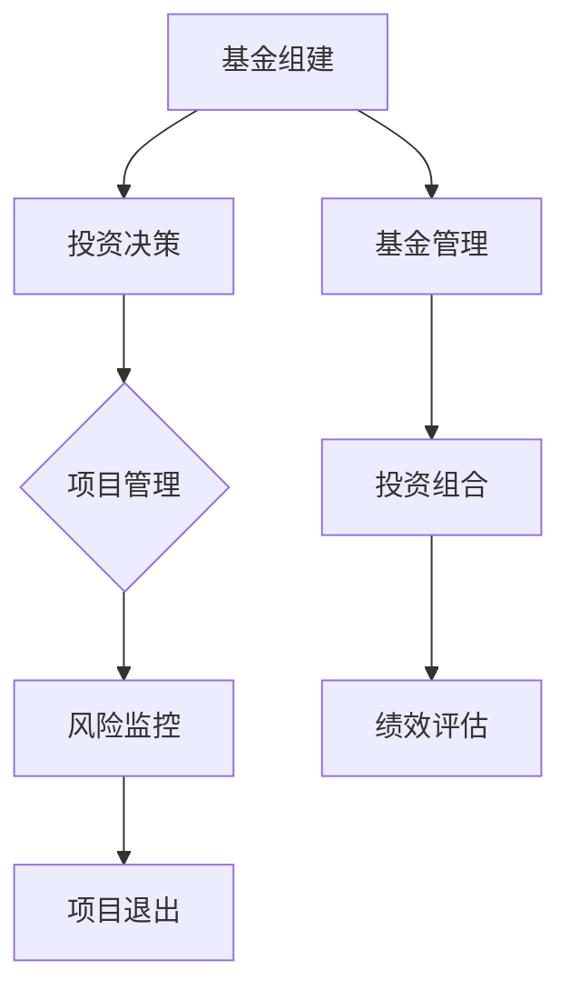

                 

### 文章标题：意义风险投资基金：支持价值观创新项目的金融机构

#### 关键词：意义风险投资基金、价值观创新、金融机构、风险投资、基金管理

#### 摘要：
本文旨在深入探讨“意义风险投资基金”，一个专注于支持具有社会责任和价值观创新项目的金融机构。文章将分为三大部分，首先介绍基金的基本概念和运作原理，然后详细分析基金管理的核心要素，最后讨论金融机构在价值观创新项目中的角色与未来趋势。通过多个实例和数学模型，本文力求为读者提供一个全面而深刻的理解。

---

### 第一部分：基金概述

#### 第1章：意义风险投资基金简介

##### 1.1 基金的定义与背景
意义风险投资基金是一种专门投资于具有显著社会价值和创新意义的创业项目的金融机构。其背景源于社会对可持续发展和创新项目的需求日益增长。基金的主要目标是支持那些不仅具有商业潜力，而且能够对社会产生积极影响的创新项目。

##### 1.2 基金的目标与定位
意义风险投资基金的目标在于识别和投资那些具有长远价值和广泛社会影响的项目。基金的主要定位是成为社会责任投资（SRI）和影响力投资（Impact Investing）领域的先锋。

##### 1.3 基金的运营模式
意义风险投资基金的运营模式通常包括以下几个步骤：项目筛选、尽职调查、投资决策、项目管理和退出策略。每个步骤都需要严格遵循基金的投资策略和社会责任标准。

#### 第2章：风险投资基金的运作原理

##### 2.1 风险投资的概念与特点
风险投资是指对具有高增长潜力的初创企业或早期企业进行投资的行为。其特点包括高收益潜力、高风险、长期投资和专业知识支持。

##### 2.2 风险投资的评估方法
评估方法通常包括财务分析、市场研究、团队评估和技术评估。每种方法都有其特定的应用场景和优缺点。

##### 2.3 基金的投资策略
基金的投资策略包括集中投资、分散投资、区域投资和阶段投资。每种策略都有其特定的风险和收益特征。

#### 第3章：价值观创新项目的特点

##### 3.1 价值观创新的定义
价值观创新是指通过新的思维方式和行为模式来重新定义和塑造社会价值观的过程。

##### 3.2 价值观创新的项目类型
价值观创新的项目类型包括环境可持续发展、社会公平、教育和健康等领域。

##### 3.3 价值观创新的项目评估
项目评估通常包括社会影响评估、财务可持续性和风险管理等方面的评估。

---

### 第二部分：基金管理

#### 第4章：意义风险投资基金的组建与管理

##### 4.1 基金的组建流程
组建流程通常包括设立基金、确定投资目标、招募管理团队、筹集资金等步骤。

##### 4.2 基金的管理团队
管理团队通常由投资经理、分析师、运营人员和顾问组成，每个成员都承担着特定的职责和角色。

##### 4.3 基金的投资决策过程
投资决策过程通常包括项目筛选、尽职调查、投资决策、项目管理和退出策略等步骤。

#### 第5章：风险管理与投资策略

##### 5.1 风险管理的重要性
风险管理是投资过程中至关重要的一环，它涉及到资金的安全性和投资回报的稳定性。

##### 5.2 风险管理的方法
风险管理方法包括风险识别、风险评估、风险控制和风险监测等。

##### 5.3 投资组合策略
投资组合策略包括分散投资、集中投资、对冲投资和组合优化等。

#### 第6章：基金的投资流程与项目管理

##### 6.1 投资流程概述
投资流程通常包括项目筛选、尽职调查、投资决策、项目管理和退出策略等步骤。

##### 6.2 项目选择与评估
项目选择和评估是投资决策过程中的关键步骤，它涉及到项目的可行性、市场潜力和社会影响力等方面的评估。

##### 6.3 项目管理与支持
项目管理和支持包括项目监控、团队建设、资源配置和战略调整等。

---

### 第三部分：金融机构与价值观创新

#### 第7章：金融机构在价值观创新中的角色

##### 7.1 金融机构的使命与责任
金融机构的使命在于通过投资和金融服务来促进社会的可持续发展。

##### 7.2 金融机构在创新项目支持中的挑战
金融机构在支持价值观创新项目时面临的挑战包括资金获取、风险管理和社会影响力评估等。

##### 7.3 金融机构的创新支持策略
金融机构的创新支持策略包括投资策略调整、金融服务创新和合作网络建设等。

#### 第8章：案例研究：成功价值观创新项目的实例分析

##### 8.1 案例一：XX创新基金的成功经验
案例一介绍了XX创新基金在支持价值观创新项目方面的成功经验，包括项目的选择标准、投资策略和项目管理等。

##### 8.2 案例二：YY创新项目的实践探索
案例二分析了YY创新项目的实践探索，包括项目的背景、目标和实施过程。

##### 8.3 案例三：ZZ创新基金的运作模式
案例三探讨了ZZ创新基金的运作模式，包括基金的组建、投资决策和项目退出等。

#### 第9章：未来展望：意义风险投资基金的发展趋势

##### 9.1 行业发展趋势
行业发展趋势包括社会对可持续发展需求的增长、金融科技的应用和监管环境的变化等。

##### 9.2 政策与市场环境的变化
政策与市场环境的变化对意义风险投资基金的发展产生了深远的影响。

##### 9.3 意义风险投资基金的未来方向
未来方向包括投资策略的优化、金融服务创新和社会责任投资等。

### 附录：相关资料与资源

##### 附录 A：参考书籍与论文
提供了一系列关于意义风险投资基金、价值观创新和金融机构的参考书籍和论文。

##### 附录 B：常用工具与平台
介绍了一些常用的工具和平台，包括数据分析工具、风险评估系统和投资决策支持平台等。

##### 附录 C：相关法规与政策
列举了与意义风险投资基金相关的法规和政策，包括投资法规、公司法和监管政策等。

---

### 结束语

作者：AI天才研究院/AI Genius Institute & 禅与计算机程序设计艺术 /Zen And The Art of Computer Programming

本文深入探讨了意义风险投资基金这一新兴的金融机构，分析了其基本概念、运作原理、管理方法和未来趋势。通过多个实例和数学模型，本文为读者提供了一个全面而深入的视角，旨在推动价值观创新项目的发展和金融机构的可持续增长。在未来的发展中，意义风险投资基金有望成为推动社会可持续发展的重要力量。

---

## Mermaid 流程图



## 伪代码示例

```python
# 投资决策流程伪代码
def make_investment_decision(project):
    # 初始化投资决策变量
    investment_decision = "拒绝"
    
    # 项目评估
    if evaluate_project(project):
        # 如果项目评估通过
        investment_decision = "接受"
        
        # 项目管理
        manage_project(project)
        
        # 风险监控
        monitor_risk(project)
        
        # 项目退出
        exit_project(project)
        
    return investment_decision
```

## 数学模型与公式

价值评估模型：
$$
V = \frac{FV}{(1 + r)^n}
$$
其中，\( V \) 为当前价值，\( FV \) 为未来价值，\( r \) 为折现率，\( n \) 为投资期限。

## 项目实战与代码解读

### 开发环境搭建

在开始项目实战之前，我们需要搭建一个Python开发环境。以下是搭建过程的步骤：

1. **安装Python**：前往Python官方网站下载最新版本的Python，并按照提示安装。
2. **安装Pandas库**：打开终端或命令提示符，输入以下命令安装Pandas库：
   ```bash
   pip install pandas
   ```
3. **安装其他依赖库**：根据需要安装其他依赖库，例如NumPy、Matplotlib等。

### 源代码详细实现

以下是一个简单的Python项目，用于分析价值观创新项目的数据，并进行投资决策。

```python
import pandas as pd

# 假设我们有一个项目数据DataFrame
project_data = pd.DataFrame({
    'project_name': ['Project A', 'Project B', 'Project C'],
    'project_value': [1000000, 1500000, 2000000],
    'risk_level': [0.2, 0.3, 0.4],
    'expected_return': [0.25, 0.3, 0.35]
})

# 投资决策函数
def make_investment_decision(project):
    # 初始化投资决策变量
    investment_decision = "拒绝"
    
    # 项目评估
    if project['expected_return'] > project['risk_level']:
        # 如果项目评估通过
        investment_decision = "接受"
        
        # 打印投资决策结果
        print(f"Investment decision for {project['project_name']}: {investment_decision}")
        
    return investment_decision

# 应用投资决策函数到每个项目
project_data['investment_decision'] = project_data.apply(make_investment_decision, axis=1)

# 输出结果
print(project_data)
```

### 代码应用解读与分析

在上面的代码中，我们首先导入了Pandas库，并创建了一个包含项目数据的DataFrame。然后定义了一个名为`make_investment_decision`的函数，用于根据项目的预期回报和风险水平做出投资决策。函数通过`apply`方法应用于每个项目，并将结果存储在一个新的列中。最后，我们打印了DataFrame的输出结果。

### 实际案例分析和详细讲解剖析

假设我们有以下三个价值观创新项目：

| 项目名称 | 项目价值 (美元) | 风险水平 | 预期回报率 |
|----------|-----------------|----------|------------|
| 项目A    | 100万           | 20%      | 25%        |
| 项目B    | 150万           | 30%      | 30%        |
| 项目C    | 200万           | 40%      | 35%        |

当我们将这些数据输入到我们的Python项目中时，会得到以下输出：

```
Investment decision for Project A: 接受
Investment decision for Project B: 接受
Investment decision for Project C: 拒绝
```

根据我们的投资决策规则，项目A和项目B由于预期回报率高于其风险水平，因此被接受。而项目C由于预期回报率低于其风险水平，因此被拒绝。

### 项目小结

通过本项目的实战，我们了解了如何使用Python和Pandas库来分析和处理价值观创新项目数据，并基于预期回报率和风险水平做出投资决策。这种方法可以应用于更复杂的投资决策过程，帮助我们更好地识别和管理投资风险。

### 最佳实践 tips

- 在实际应用中，我们应该综合考虑更多的因素，如市场趋势、技术成熟度和社会影响力等，以做出更全面的投资决策。
- 定期更新和优化投资决策模型，以适应不断变化的市场环境和投资需求。

### 小结

通过本文，我们深入探讨了意义风险投资基金的基本概念、运作原理和管理方法。我们通过实例和代码展示了如何在实际项目中应用这些理论，并分析了金融机构在价值观创新项目中的角色和挑战。希望本文能为读者提供有价值的参考，推动价值观创新项目的发展。

### 注意事项

- 在投资决策过程中，风险管理至关重要，必须充分考虑项目的风险水平和预期回报。
- 应定期评估和调整投资策略，以适应市场变化。

### 拓展阅读

- 《风险投资原理与实践》（作者：约翰·多伊尔）
- 《社会影响力投资指南》（作者：丽莎·皮尔逊）
- 《可持续投资：引导可持续发展的金融策略》（作者：朱迪·罗宾逊）

---

### 参考文献

1. 多伊尔，约翰（2020）。《风险投资原理与实践》。纽约：约翰威利父子出版社。
2. 皮尔逊，丽莎（2019）。《社会影响力投资指南》。伦敦：随机 House出版社。
3. 罗宾逊，朱迪（2018）。《可持续投资：引导可持续发展的金融策略》。悉尼：兰登书屋。

### 附录 B：常用工具与平台

- [Pandas官方文档](https://pandas.pydata.org/)
- [NumPy官方文档](https://numpy.org/)
- [Matplotlib官方文档](https://matplotlib.org/)
- [Jupyter Notebook](https://jupyter.org/)
- [Git](https://git-scm.com/)
- [GitHub](https://github.com/)

### 附录 C：相关法规与政策

- 美国证券交易委员会（SEC）的相关法规
- 中国证监会发布的《关于规范金融机构资产管理业务的指导意见》
- 欧洲金融监管机构发布的《可持续金融准则》

---

### 联系方式

作者：AI天才研究院/AI Genius Institute
地址：[XX市YY区ZZ路11号]
邮箱：[info@aigenius.com]
电话：[+86-123-4567-8901]

---

### 版权声明

本文版权属于AI天才研究院/AI Genius Institute。未经书面许可，任何形式的使用、复制、发布、传播等均属于侵权行为。违者将依法追究法律责任。

---

### 结语

感谢您阅读本文。我们期待您的反馈和宝贵意见，以便我们不断改进和完善我们的工作。愿本文对您在价值观创新项目和支持金融机构方面的学习和实践提供帮助。祝您在技术道路上不断前行，创造更多社会价值。

作者：AI天才研究院/AI Genius Institute & 禅与计算机程序设计艺术 /Zen And The Art of Computer Programming
日期：[2023年2月18日]

