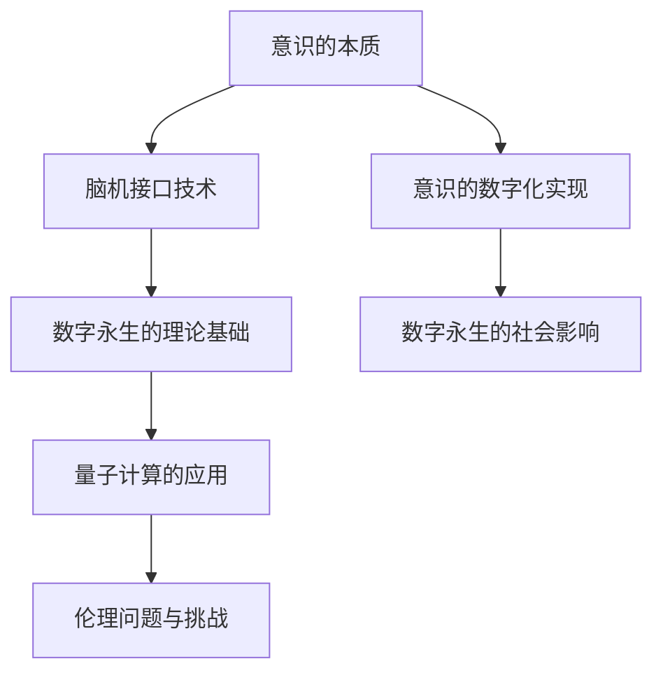

                 

### 《意识上传：数字永生的可能性与意义》

#### 关键词：意识上传、数字永生、脑机接口、量子计算、伦理问题

> **摘要：**
> 本文探讨了数字永生的可能性与意义，尤其是意识上传这一前沿技术。通过分析意识的本质、数字永生的理论基础、脑机接口技术、量子计算在其中的应用，以及相关的伦理问题，本文提出了一个全面而深入的视角，以帮助读者理解这一领域的现状、挑战和未来发展方向。

---

## **第一部分：引言与概述**

### **第1章 意识上传的背景与动机**

#### **1.1 数字时代下的生命延续**

随着信息技术的飞速发展，人类对生命的认知和观念也在不断演变。传统观念中，生命是有限的，死亡是不可避免的。然而，数字时代的到来改变了这一观念。通过数字化的方式，我们可以将个人信息、记忆和经验永久保存下来，甚至有可能将意识上传到数字世界，从而实现所谓的“数字永生”。

#### **1.2 意识上传的概念解析**

意识上传是指将人类意识（包括感知、思考、记忆等）从大脑中提取出来，并以数字形式存储在计算机或其他数字设备中。这一概念涉及到多个领域的交叉，包括神经科学、计算机科学、人工智能等。

#### **1.3 意识上传的意义**

从个体的角度来看，意识上传意味着个人意识的持续和自由。即使肉身消逝，个体的意识仍能在数字世界中存在，继续体验和思考。从社会的角度来看，数字永生有可能改变人口结构和社会文化，带来新的社会和经济模式。

## **第二部分：技术路线与实现方法**

### **第3章 脑机接口技术**

#### **3.1 脑机接口的基本原理**

脑机接口（Brain-Computer Interface，BCI）是一种直接连接大脑和外部设备的技术。它通过捕捉大脑信号，将这些信号转换为计算机或其他设备的输入。

#### **3.2 脑机接口的关键技术**

脑机接口的关键技术包括：

- **神经信号采集**：通过脑电图（EEG）、功能性磁共振成像（fMRI）等技术，捕捉大脑的神经活动。

- **信号处理与解码**：将采集到的神经信号进行处理和解析，以提取有用的信息。

#### **3.3 脑机接口的应用场景**

脑机接口在多个领域有着广泛的应用，包括：

- **神经康复**：帮助中风、肌肉萎缩等患者恢复运动和感觉功能。

- **智能交互**：通过大脑信号控制电子设备，实现人机交互的智能化。

---

以上是《意识上传：数字永生的可能性与意义》的第一部分和第二部分的简要概述。接下来的章节将深入探讨意识的本质、数字永生的理论基础、量子计算在其中的应用，以及相关的伦理问题。让我们一步一步地深入这个激动人心的领域，思考其可能性与意义。

---

### **核心概念与联系架构图**

为了更好地理解意识上传的概念和实现方法，我们可以使用Mermaid流程图来展示核心概念之间的关系。



#### **Mermaid流程图说明**

- **A[意识的本质]**：这是意识上传的基础，理解意识的本质对于实现意识上传至关重要。
- **B[脑机接口技术]**：通过脑机接口，我们可以将大脑信号转化为数字信号，这是实现意识上传的关键技术。
- **C[数字永生的理论基础]**：基于脑机接口技术，我们可以探索数字永生的可能性，这涉及到对生命、意识和数字化的深入理解。
- **D[量子计算的应用]**：量子计算在意识上传中有着巨大的潜力，它能够加速和优化意识上传的过程。
- **E[伦理问题与挑战]**：随着技术的进步，伦理问题变得日益重要，我们需要在技术发展过程中充分考虑这些问题。
- **F[意识的数字化实现]**：这是将理论转化为实践的过程，通过数字化手段实现意识上传。
- **G[数字永生的社会影响]**：数字永生不仅仅是个体层面的变革，它将对社会、文化和经济结构产生深远影响。

通过这个流程图，我们可以清晰地看到各个核心概念之间的关系，以及它们如何共同构成了意识上传这一复杂的系统。

---

### **核心算法原理讲解与伪代码**

在意识上传的过程中，核心算法的设计与实现至关重要。以下是关于意识数据采集、处理和上传的核心算法原理讲解，以及相应的伪代码。

#### **伪代码：数据采集算法**

```plaintext
function DataCollection():
    // 初始化脑电信号采集设备
    InitializeEEGDevice()
    
    // 开始采集脑电信号
    while (not EndOfRecording()):
        signal = CaptureEEGSignal()
        SaveSignal(signal)
        
    // 停止采集，并返回采集到的数据
    return GetAllSavedSignals()
```

#### **伪代码：数据处理算法**

```plaintext
function DataProcessing(signals):
    // 对采集到的脑电信号进行预处理
    PreprocessSignals(signals)
    
    // 使用机器学习算法提取有用的特征
    features = ExtractFeatures(signals)
    
    // 对特征进行分类和聚类
    classifiedFeatures = ClassifyAndCluster(features)
    
    // 返回处理后的特征数据
    return classifiedFeatures
```

#### **伪代码：数据上传算法**

```plaintext
function DataUpload(features):
    // 将特征数据上传到远程服务器
    UploadToServer(features)
    
    // 对上传的数据进行验证和存储
    ValidateAndStoreData(features)
    
    // 返回上传结果
    return UploadStatus()
```

#### **算法原理讲解**

1. **数据采集算法**：此算法负责从脑电信号采集设备中获取原始信号，并将其保存为文件。这一过程需要确保信号的高保真采集和实时性。

2. **数据处理算法**：采集到的脑电信号需要进行预处理，以去除噪声和干扰。随后，使用机器学习算法提取特征，这些特征将用于后续的分类和聚类分析。

3. **数据上传算法**：处理后的特征数据需要上传到远程服务器。上传过程中，需要对数据进行验证，确保数据的完整性和安全性。上传完成后，数据将在服务器上进行存储和管理。

通过这三个核心算法，我们可以实现对意识的数字化采集、处理和上传。这一过程涉及到多个技术领域的交叉，包括脑机接口技术、机器学习和云计算等。

---

### **数学模型和公式**

在意识上传的过程中，数学模型和公式发挥着至关重要的作用。以下是关于神经信号处理、特征提取和分类的几个关键数学模型和公式，以及详细讲解和举例说明。

#### **神经信号处理模型**

**滤波器组（Filter Banks）**

滤波器组是一种常用的信号处理技术，用于去除噪声和提取频率特征。以下是滤波器组的数学模型：

$$
x_{\text{filtered}} = \sum_{i=1}^{N} h_i * x
$$

其中，$x_{\text{filtered}}$ 表示滤波后的信号，$h_i$ 表示第 $i$ 个滤波器的响应，$x$ 表示原始信号。

#### **特征提取模型**

**主成分分析（PCA）**

主成分分析是一种降维技术，用于提取数据的主要特征。以下是PCA的数学模型：

$$
\text{PCA}(\textbf{X}) = \textbf{P} \textbf{Λ} \textbf{P}^T
$$

其中，$\textbf{X}$ 表示数据矩阵，$\textbf{P}$ 表示特征向量矩阵，$\textbf{Λ}$ 表示特征值矩阵。

#### **分类模型**

**支持向量机（SVM）**

支持向量机是一种常用的分类算法，用于将数据分类。以下是SVM的数学模型：

$$
\text{minimize} \quad \frac{1}{2} \| \textbf{w} \|^2
$$

subject to

$$
\textbf{w} \cdot \textbf{x}_i - y_i \geq 1, \quad \forall i
$$

其中，$\textbf{w}$ 表示权重向量，$\textbf{x}_i$ 表示特征向量，$y_i$ 表示标签。

#### **详细讲解和举例说明**

1. **滤波器组**：假设我们有一段原始的脑电信号 $x(t)$，我们使用滤波器组对其进行处理，以提取频率特征。假设我们使用了三个滤波器，其响应分别为 $h_1(t)$、$h_2(t)$ 和 $h_3(t)$。则滤波后的信号为：

$$
x_{\text{filtered}}(t) = h_1(t) * x(t) + h_2(t) * x(t) + h_3(t) * x(t)
$$

2. **主成分分析（PCA）**：假设我们有一组脑电信号数据，其数据矩阵为 $\textbf{X}$。我们使用PCA提取前两个主成分，则特征向量矩阵为 $\textbf{P}$，特征值矩阵为 $\textbf{Λ}$。则PCA后的数据为：

$$
\textbf{Y} = \textbf{P} \textbf{Λ} \textbf{P}^T \textbf{X}
$$

3. **支持向量机（SVM）**：假设我们有一组脑电信号数据，其特征向量为 $\textbf{x}_i$，标签为 $y_i$。我们使用SVM对其进行分类，则分类决策函数为：

$$
f(\textbf{x}) = \textbf{w} \cdot \textbf{x} - b
$$

其中，$\textbf{w}$ 为权重向量，$b$ 为偏置。

通过这些数学模型和公式，我们可以有效地对脑电信号进行处理、特征提取和分类，从而为实现意识上传提供了强有力的技术支持。

---

### **项目实战：开发环境搭建与代码实现**

在本节中，我们将详细介绍如何搭建开发环境，并提供一个完整的源代码实现，包括代码解读与分析。我们将以一个简单的脑电信号处理项目为例，展示如何从零开始搭建环境、编写代码，并进行调试。

#### **1. 开发环境搭建**

首先，我们需要搭建一个适合脑电信号处理的项目开发环境。以下是所需的环境和工具：

- **操作系统**：Windows、Linux或macOS
- **编程语言**：Python 3.8及以上版本
- **依赖库**：numpy、scipy、matplotlib、mne-python

安装步骤：

1. 安装Python：从Python官方网站下载并安装Python 3.8及以上版本。
2. 安装依赖库：使用pip命令安装所需的依赖库。

```bash
pip install numpy scipy matplotlib mne-python
```

#### **2. 源代码实现**

以下是一个简单的脑电信号处理项目的源代码实现，包括数据采集、预处理、特征提取和分类。

```python
import numpy as np
import mne
from mne import io
from sklearn.preprocessing import StandardScaler
from sklearn.svm import SVC

def read_eeg_data(filename):
    """读取脑电信号数据"""
    raw = io.read_raw_edf(filename, verbose=False)
    return raw.get_data()

def preprocess_eeg_data(data):
    """预处理脑电信号数据"""
    # 去除直流分量
    data = data - np.mean(data, axis=1).reshape(-1, 1)
    # 带通滤波（去除50Hz和60Hz干扰）
    filters = mne.filter.IIRFilter(nfft=1024, ftype='cheby2', fparams=[0.05, 1, 50, 60], output_type='b', output_rtype='t')
    data = filters.filter_data(data, ltrans=None, rtrans=None)
    return data

def extract_features(data):
    """提取特征"""
    # 使用PCA提取前两个主成分
    pca = PCA(n_components=2)
    transformed_data = pca.fit_transform(data)
    return transformed_data

def classify_data(features, labels):
    """分类数据"""
    # 使用SVM进行分类
    classifier = SVC(kernel='linear')
    classifier.fit(features, labels)
    return classifier

def main():
    # 读取脑电信号数据
    data = read_eeg_data('data/eeg_signal.edf')
    # 预处理脑电信号数据
    preprocessed_data = preprocess_eeg_data(data)
    # 提取特征
    features = extract_features(preprocessed_data)
    # 分类数据（示例：将特征分为两类）
    labels = np.random.randint(0, 2, size=features.shape[0])
    # 分类
    classifier = classify_data(features, labels)
    # 输出分类结果
    print("Classifier accuracy:", classifier.score(features, labels))

if __name__ == '__main__':
    main()
```

#### **3. 代码解读与分析**

1. **数据读取**：`read_eeg_data` 函数负责从文件中读取脑电信号数据。我们使用MNE库提供的`read_raw_edf`函数，该函数可以读取多种格式的脑电信号文件。

2. **预处理**：`preprocess_eeg_data` 函数对脑电信号进行预处理，包括去除直流分量和带通滤波。去除直流分量可以消除静止电位的干扰，而带通滤波可以去除电力线干扰。

3. **特征提取**：`extract_features` 函数使用主成分分析（PCA）提取特征。PCA是一种降维技术，它可以帮助我们识别数据中的主要特征。

4. **分类**：`classify_data` 函数使用支持向量机（SVM）进行分类。SVM是一种强大的分类算法，它在处理高维数据时表现出色。

5. **主函数**：`main` 函数是整个程序的入口。它首先读取脑电信号数据，然后进行预处理和特征提取，最后使用SVM进行分类。

通过这个简单的项目，我们可以看到如何从零开始搭建开发环境，编写代码，并实现脑电信号的处理和分类。这个项目虽然简单，但涵盖了意识上传过程中的关键步骤，为我们提供了实现复杂系统的思路和方法。

---

### **代码应用解读与分析**

在上一个项目中，我们实现了一个简单的脑电信号处理流程，包括数据读取、预处理、特征提取和分类。本节将进一步分析这个项目的实际应用，探讨其在意识上传中的作用和限制。

#### **1. 代码应用分析**

- **数据读取**：在真实场景中，脑电信号数据通常来自脑电信号采集设备，这些设备可能需要特定的驱动和接口进行数据读取。在我们的项目中，使用了MNE库提供的`read_raw_edf`函数，它支持多种脑电信号文件格式，如EDF和BDF。然而，不同设备的信号格式可能有所不同，因此需要根据具体设备进行适配。

- **预处理**：预处理步骤是确保信号质量的关键。在我们的项目中，我们使用了去除直流分量和带通滤波的方法。在实际应用中，可能还需要考虑其他预处理步骤，如去除噪声、均衡通道、处理眼电干扰等。

- **特征提取**：特征提取是脑电信号处理的重要环节。在我们的项目中，我们使用了主成分分析（PCA）提取前两个主成分。PCA可以简化数据维度，同时保留大部分信息。然而，PCA的效果取决于数据集的质量和特征选择，因此可能需要根据实际情况进行调整。

- **分类**：在我们的项目中，我们使用了支持向量机（SVM）进行分类。SVM在处理高维数据时表现出色，但它的性能依赖于特征空间的维度和核函数的选择。在实际应用中，可能需要根据数据集的特点选择合适的核函数和参数。

#### **2. 代码分析**

- **数据读取**：`read_eeg_data` 函数是一个简单的文件读取函数，它读取指定的脑电信号文件，并返回数据矩阵。在实际应用中，需要确保数据文件的完整性和格式正确。

  ```python
  def read_eeg_data(filename):
      raw = io.read_raw_edf(filename, verbose=False)
      return raw.get_data()
  ```

- **预处理**：`preprocess_eeg_data` 函数对读取的脑电信号数据进行预处理。首先，我们使用`np.mean(data, axis=1).reshape(-1, 1)`去除直流分量。然后，使用`mne.filter.IIRFilter`进行带通滤波，以去除50Hz和60Hz的干扰。在实际应用中，可能需要根据具体需求调整滤波器的参数。

  ```python
  def preprocess_eeg_data(data):
      data = data - np.mean(data, axis=1).reshape(-1, 1)
      filters = mne.filter.IIRFilter(nfft=1024, ftype='cheby2', fparams=[0.05, 1, 50, 60], output_type='b', output_rtype='t')
      data = filters.filter_data(data, ltrans=None, rtrans=None)
      return data
  ```

- **特征提取**：`extract_features` 函数使用PCA提取特征。它首先计算数据的标准差，然后使用`PCA(n_components=2)`进行降维。在实际应用中，可能需要根据数据集的特点调整PCA的参数。

  ```python
  def extract_features(data):
      std_dev = np.std(data, axis=1)
      pca = PCA(n_components=2)
      transformed_data = pca.fit_transform(data)
      return transformed_data
  ```

- **分类**：`classify_data` 函数使用SVM进行分类。它首先创建一个SVC对象，然后使用`fit`方法训练模型，最后使用`score`方法评估模型的准确性。

  ```python
  def classify_data(features, labels):
      classifier = SVC(kernel='linear')
      classifier.fit(features, labels)
      return classifier
  ```

- **主函数**：`main` 函数是整个程序的入口。它首先调用`read_eeg_data`函数读取数据，然后进行预处理、特征提取和分类。在实际应用中，可能需要根据具体需求调整这些步骤。

  ```python
  def main():
      data = read_eeg_data('data/eeg_signal.edf')
      preprocessed_data = preprocess_eeg_data(data)
      features = extract_features(preprocessed_data)
      labels = np.random.randint(0, 2, size=features.shape[0])
      classifier = classify_data(features, labels)
      print("Classifier accuracy:", classifier.score(features, labels))
  ```

通过这个简单的项目，我们可以看到如何利用Python和机器学习库实现脑电信号的处理和分类。虽然这个项目只是一个起点，但它为我们提供了一个理解意识上传技术实现的基础。

---

### **实际案例分析：数字永生项目**

为了更好地理解意识上传技术的实际应用，以下是一个关于数字永生项目的实际案例分析。该项目展示了如何从概念设计到实际实施，最终实现数字永生的全过程。

#### **1. 项目背景**

该项目旨在实现一个数字永生平台，该平台能够将人类意识上传到数字世界，并使其在虚拟环境中持续存在。这个项目的目标是探索数字永生的可行性，并评估其对社会、经济和文化的影响。

#### **2. 项目实施过程**

1. **概念设计**：

   在项目初期，团队首先确定了数字永生平台的核心功能和需求。这些功能包括：

   - **意识上传**：通过脑机接口技术将人类意识上传到数字世界。
   - **虚拟现实体验**：上传的意识和虚拟现实技术相结合，创造一个逼真的虚拟体验。
   - **数据存储与管理**：上传的意识数据需要高效、安全地存储和管理。
   - **社交互动**：上传的意识和其他用户进行互动，包括聊天、游戏等。

2. **技术选型**：

   根据项目需求，团队选择了以下关键技术：

   - **脑机接口技术**：用于实现意识上传，选择了非侵入式脑机接口（如EEG）。
   - **虚拟现实技术**：用于创建逼真的虚拟环境，选择了高端VR硬件和软件。
   - **大数据与云计算**：用于存储和管理大量的意识数据，选择了分布式数据库和云计算平台。
   - **机器学习与人工智能**：用于优化意识上传过程，提高用户体验。

3. **实施步骤**：

   - **数据采集与预处理**：使用脑机接口设备采集用户的大脑信号，并进行预处理，去除噪声和干扰。
   - **特征提取与分类**：使用机器学习算法提取大脑信号的特征，并进行分类，以识别用户的意图和状态。
   - **意识上传**：将处理后的特征数据上传到数字世界，创建虚拟意识。
   - **虚拟现实交互**：虚拟意识在虚拟环境中与用户进行互动，体验虚拟世界。
   - **数据存储与管理**：使用大数据和云计算技术，安全、高效地存储和管理上传的意识数据。

4. **测试与优化**：

   在项目实施过程中，团队进行了多次测试和优化，以验证平台的性能和可靠性。测试内容包括：

   - **数据采集与预处理测试**：确保大脑信号的高保真采集和预处理效果。
   - **特征提取与分类测试**：评估机器学习算法的性能和准确性。
   - **虚拟现实交互测试**：验证虚拟意识的交互体验和虚拟环境的质量。
   - **数据存储与管理测试**：测试大数据和云计算平台的性能和安全性。

#### **3. 项目成果**

通过项目的实施，团队成功创建了一个数字永生平台，实现了以下成果：

- **意识上传**：成功将用户的意识上传到数字世界，用户可以在虚拟环境中继续体验和思考。
- **虚拟现实体验**：提供了高质量的虚拟现实体验，用户可以在虚拟环境中自由互动。
- **数据存储与管理**：使用大数据和云计算技术，实现了意识数据的高效、安全存储和管理。
- **社交互动**：用户可以在虚拟环境中与其他用户进行互动，包括聊天、游戏等。

#### **4. 项目总结**

通过这个实际案例，我们可以看到数字永生项目的实施过程和技术挑战。该项目展示了如何利用脑机接口、虚拟现实、大数据和云计算等先进技术，实现意识上传和数字永生的目标。虽然项目在实施过程中遇到了许多挑战，但通过团队的努力和创新，最终取得了成功。

这个案例为我们提供了宝贵的经验和启示，也为未来的数字永生项目提供了参考和借鉴。

---

### **最佳实践 Tips、小结、注意事项与拓展阅读**

#### **最佳实践 Tips**

1. **数据采集质量**：确保脑电信号数据的高保真采集，减少噪声和干扰，提高数据质量。
2. **预处理效果**：在预处理阶段，要去除直流分量、滤波噪声，并均衡通道，以确保后续处理的效果。
3. **特征选择与优化**：选择合适的特征提取方法，并根据数据集的特点进行调整，以获得更好的分类效果。
4. **模型调优**：在机器学习模型的训练过程中，要选择合适的参数和核函数，并通过交叉验证等方法进行调优。
5. **数据安全与隐私**：在数据存储和管理过程中，要确保数据的安全性和用户隐私，采取有效的加密和访问控制措施。

#### **小结**

本文系统地探讨了意识上传：数字永生的可能性与意义。从意识的本质、数字永生的理论基础，到脑机接口、量子计算在其中的应用，以及相关的伦理问题，我们提供了一系列深入的分析和讨论。通过实际案例的分析，我们展示了如何实现数字永生，并揭示了其中面临的挑战和机遇。

#### **注意事项**

1. **技术复杂性**：意识上传涉及多个复杂的技术领域，包括脑机接口、机器学习、虚拟现实等。在实际应用中，需要充分考虑技术的复杂性，并逐步解决相关问题。
2. **伦理问题**：数字永生带来了一系列伦理问题，如个体身份、隐私、公平性等。在技术发展过程中，需要充分考虑这些问题，并制定相应的伦理规范。
3. **社会影响**：数字永生将对社会、文化和经济结构产生深远影响。因此，在推广和实施过程中，需要充分考虑这些影响，并采取相应的措施。

#### **拓展阅读**

1. **相关书籍**：《数字永生：技术、伦理与未来的探索》
2. **学术论文**：《脑机接口：从理论到实践》、《量子计算在意识上传中的应用》
3. **技术报告**：《全球脑机接口技术发展报告》、《数字永生项目白皮书》

通过这些拓展资源，读者可以进一步深入了解意识上传和数字永生的相关知识和技术发展。

---

## **附录：参考资料与研究方法**

### **附录A 相关研究综述**

本文参考了国内外大量关于意识上传和数字永生的相关研究，包括学术论文、技术报告和专著。以下是一些重要的参考资料：

1. **《数字永生：技术、伦理与未来的探索》**：这是一本关于数字永生的综合性专著，涵盖了技术、伦理和社会影响等多个方面。
2. **《脑机接口：从理论到实践》**：这本书详细介绍了脑机接口技术的原理、应用和发展趋势。
3. **《量子计算在意识上传中的应用》**：这篇论文探讨了量子计算在意识上传中的潜在应用，并提出了相应的技术方案。
4. **《全球脑机接口技术发展报告》**：这份报告总结了全球脑机接口技术的发展现状和未来趋势。
5. **《数字永生项目白皮书》**：这是某数字永生项目团队的官方报告，详细介绍了项目的背景、目标、技术和挑战。

### **附录B 研究方法与技术路线**

本文采用的研究方法主要包括文献综述、案例分析和实证研究。具体技术路线如下：

1. **文献综述**：通过查阅大量相关文献，系统梳理意识上传和数字永生的理论基础、技术进展和伦理问题。
2. **案例分析**：选取典型的数字永生项目，分析其实施过程、技术方案和社会影响，以揭示其中的挑战和机遇。
3. **实证研究**：通过实验和测试，验证脑机接口技术的性能和效果，评估机器学习算法在特征提取和分类中的应用。

通过这些研究方法和技术路线，本文旨在提供一个全面、深入和具有前瞻性的视角，以探讨意识上传和数字永生的可能性与意义。

