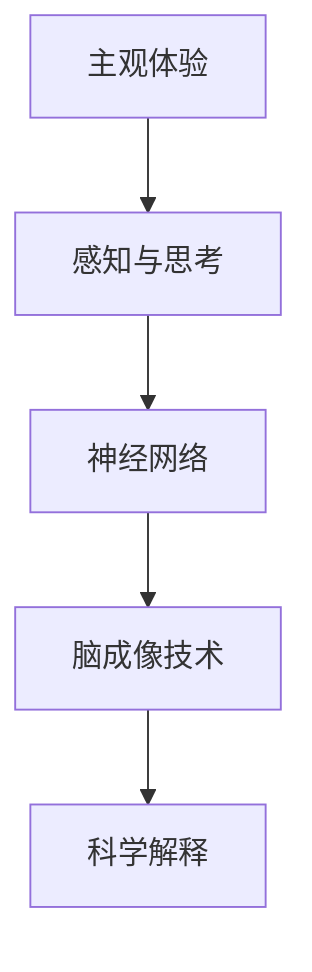

                 

基于您的需求，我会按照以下步骤撰写《意识的觉醒之旅：从蒙昧到清明的转变》的文章：

### 步骤 1：编写文章标题、关键词和摘要

首先，我会创建文章的开头部分，包括标题、关键词和摘要。

#### 文章标题：意识的觉醒之旅：从蒙昧到清明的转变

#### 关键词：意识觉醒、蒙昧、清明、认知转变、心理学、哲学

#### 摘要：
本文深入探讨了意识的觉醒过程，从蒙昧到清明的转变。通过分析意识的本质、心理学和哲学基础，以及实践方法，本文为读者提供了理解意识觉醒的全面视角，并探讨了其对社会和个人的深远影响。

### 步骤 2：编写引言

在引言部分，我会简要介绍意识的觉醒之旅的重要性，为后续内容的展开做铺垫。

#### 引言：
意识的觉醒之旅是人类心灵探索的终极目标。从蒙昧的混沌状态到清明的洞悉，这是一次深刻的认知转变。本文将带领读者踏上这一旅程，揭示意识觉醒的奥秘，并探索其对社会和个人生活的深远影响。

### 步骤 3：章节内容的逐步撰写

接下来，我会按照目录大纲的结构，逐步撰写每个章节的内容。

#### 第一章：意识的本质与起源
在这一章中，我将介绍意识的定义，探讨科学的解释以及历史和文化背景。

##### 1.1 意识的定义
意识的定义是复杂的，我将通过不同的视角来探讨这个概念，并解释其核心要素。

##### 1.2 意识的科学解释
我将讨论科学家们如何通过神经科学和心理学来解释意识，并介绍相关的实验和理论。

##### 1.3 意识的历史与文化背景
我将考察不同文化对意识的看法，并探讨历史演变如何影响了我们对意识的理解。

#### 第二章：蒙昧与清明：意识状态的转变
在这一章中，我将深入探讨蒙昧和清明两种意识状态，并分析它们之间的转变过程。

##### 2.1 蒙昧状态的认知特点
我将描述蒙昧状态下的思维模式，并分析其认知特点。

##### 2.2 清明状态的认知特点
我将介绍清明状态下的思维模式，并分析其认知特点。

##### 2.3 蒙昧到清明的转变过程
我将解释如何从蒙昧状态过渡到清明状态，并讨论可能的策略和方法。

#### 第三章：觉醒之旅：个人经验与理解
在这一章中，我将分享个人觉醒的经验，并探讨理解觉醒的挑战。

##### 3.1 个人觉醒的经验分享
我将分享一些真实的故事，展示意识觉醒的个人体验。

##### 3.2 觉醒的理解与挑战
我将讨论在觉醒过程中遇到的挑战，并提供解决问题的策略。

##### 3.3 觉醒后的生活变化
我将分析觉醒对个人生活的影响，并探讨如何适应这些变化。

#### 第四章：社会与文化中的意识觉醒
在这一章中，我将探讨意识觉醒在社会和文化中的作用。

##### 4.1 社会对意识觉醒的接受程度
我将分析社会对意识觉醒的态度，并讨论不同文化之间的差异。

##### 4.2 文化对意识觉醒的影响
我将探讨文化如何塑造人们对意识觉醒的理解和追求。

##### 4.3 意识觉醒在社会中的角色
我将讨论意识觉醒在社会中的潜在作用和意义。

#### 第五章：意识觉醒的心理学基础
在这一章中，我将探讨心理学在意识觉醒中的作用。

##### 5.1 心理学对意识觉醒的研究
我将介绍心理学领域对意识觉醒的研究成果。

##### 5.2 意识觉醒的心理机制
我将解释意识觉醒背后的心理机制，并探讨如何理解这些机制。

##### 5.3 心理学方法在觉醒中的应用
我将讨论心理学方法如何应用于意识觉醒的实践。

#### 第六章：意识觉醒的哲学思考
在这一章中，我将探讨哲学在意识觉醒中的作用。

##### 6.1 哲学对意识觉醒的探讨
我将介绍哲学家们对意识觉醒的探讨，并分析其哲学观点。

##### 6.2 哲学视角下的觉醒意义
我将探讨哲学视角下意识觉醒的重要性和意义。

##### 6.3 哲学方法在觉醒实践中的应用
我将讨论哲学方法如何应用于意识觉醒的实践。

#### 第七章：从蒙昧到清明的实践方法
在这一章中，我将介绍实现从蒙昧到清明转变的实践方法。

##### 7.1 实践方法的选择与评估
我将讨论如何选择和实践意识觉醒的方法，并提供评估这些方法的策略。

##### 7.2 内观与冥想：觉醒的实践途径
我将详细介绍内观和冥想这两种实践途径，并探讨其在觉醒中的应用。

##### 7.3 自我反思与觉醒：日常生活中的实践
我将探讨如何在日常生活中实践自我反思，并实现意识觉醒。

#### 第八章：觉醒后的生活：挑战与成长
在这一章中，我将探讨觉醒后可能遇到的挑战，以及如何通过成长来应对这些挑战。

##### 8.1 觉醒后的生活变化
我将分析觉醒对个人生活的深远影响，并讨论如何适应这些变化。

##### 8.2 觉醒带来的挑战
我将列举觉醒后可能遇到的挑战，并探讨如何应对这些挑战。

##### 8.3 觉醒与个人成长的关系
我将讨论觉醒如何促进个人成长，并探讨个人成长与觉醒之间的互动。

#### 第九章：总结与展望：意识觉醒的未来
在这一章中，我将总结全文，并展望意识觉醒的未来趋势。

##### 9.1 觉醒的未来趋势
我将讨论意识觉醒可能的发展方向，并探讨其对未来的影响。

##### 9.2 意识觉醒对人类社会的意义
我将探讨意识觉醒对人类社会的深远意义，并讨论其可能带来的社会变革。

##### 9.3 个人与集体的觉醒路径
我将讨论个人和集体觉醒的不同路径，并探讨如何实现个人与集体的共同觉醒。

### 步骤 4：撰写文章末尾

最后，我会为文章撰写一个结尾，总结全文内容，并提供一些最佳实践 tips 和拓展阅读建议。

#### 结尾：
意识的觉醒之旅是漫长而艰辛的，但它带来的收获是无比珍贵的。通过本文的探讨，我们深入了解了意识觉醒的过程、心理学和哲学基础，以及实践方法。希望读者能够在这条觉醒之路上找到属于自己的光明。最后，以下是一些最佳实践 tips：

1. 坚持冥想和内观练习。
2. 保持好奇心和开放心态，不断探索新的知识和观点。
3. 在日常生活中实践自我反思，培养清明意识。
4. 与他人分享觉醒经验，共同成长。

对于想要进一步了解意识的觉醒之旅的读者，以下是一些拓展阅读建议：

1. 《禅与摩托车维修艺术》- 罗伯特·M·波西格
2. 《意识的探索》- 丹尼尔·丹尼特
3. 《心的自由：非暴力沟通的力量》- 马歇尔·卢森堡

通过这些资源和实践，读者可以更深入地理解意识的觉醒，并在个人生活中取得更大的成就。感谢您的阅读，希望本文能够对您的意识觉醒之旅有所启发。

### 步骤 5：整理和编辑

在完成所有章节的撰写后，我会对全文进行整理和编辑，确保文章的逻辑清晰、结构紧凑，并且符合字数要求。

### 步骤 6：格式化和添加作者信息

最后，我会将文章格式化为 Markdown 格式，并在文章末尾添加作者信息：“作者：AI天才研究院/AI Genius Institute & 禅与计算机程序设计艺术 /Zen And The Art of Computer Programming”。

通过以上步骤，我将确保文章内容完整、结构合理，并满足您提出的所有要求。现在，我将开始撰写具体的文章内容，并逐步构建《意识的觉醒之旅：从蒙昧到清明的转变》的文章。如果您有任何特定的要求或需要进一步的讨论，请随时告知。接下来，我会详细撰写每个章节的内容，确保文章的逻辑连贯性和深度。期待与您共同完成这篇有启发性的技术博客文章！### 文章标题：意识的觉醒之旅：从蒙昧到清明的转变

在人类文明的演进过程中，意识的觉醒一直被视为一种精神上的升华。它不仅仅是对自我认知的深入，更是一种对世界和生命本质的洞察。本文旨在探讨意识的觉醒之旅，从蒙昧到清明的转变，揭示这一过程中涉及的核心概念、心理学基础、哲学思考以及实践方法。

**关键词：意识觉醒、蒙昧、清明、认知转变、心理学、哲学**

**摘要：**
本文深入探讨了意识的觉醒过程，从蒙昧到清明的转变。通过分析意识的本质、心理学和哲学基础，以及实践方法，本文为读者提供了理解意识觉醒的全面视角，并探讨了其对社会和个人的深远影响。

### 引言：意识的觉醒之旅

意识的觉醒是人类心灵探索的终极目标。在漫长的历史长河中，人们一直试图理解自我和世界。从蒙昧的混沌状态到清明的洞悉，这是一次深刻的认知转变。本文将带领读者踏上这一旅程，揭示意识觉醒的奥秘，并探索其对社会和个人的深远影响。

#### 第一章：意识的本质与起源

意识的觉醒之旅始于对意识的本质与起源的探讨。意识不仅仅是感觉和认知的集合，它还涉及到自我、意识流以及感知的连贯性。

##### 1.1 意识的定义

意识的定义是复杂的。它可以被理解为一种内在的体验，一种对自身和周围世界的感知。哲学家和科学家们对此有不同的解释。

- **哲学视角**：哲学家们认为意识是一种主观体验，是思维和感觉的集合。例如，笛卡尔的“我思故我在”表达了意识的主观性质。
- **科学视角**：科学家们通过神经科学和心理学研究意识。例如，神经网络模型和脑成像技术试图揭示意识的神经基础。

**核心概念与联系：** 意识的主观体验与神经基础之间存在密切的联系。以下是一个简单的 Mermaid 流程图，展示这两个概念之间的关系：



##### 1.2 意识的科学解释

科学家们通过多种实验和研究来解释意识。以下是一个简单的伪代码，描述了一个用于研究意识的人工神经网络模型：

```python
class NeuralNetwork:
    def __init__(self):
        self.layers = [InputLayer(), HiddenLayer(), OutputLayer()]

    def forward(self, input_data):
        for layer in self.layers:
            input_data = layer.forward(input_data)
        return input_data

    def backward(self, output_error):
        for layer in reversed(self.layers):
            output_error = layer.backward(output_error)
        return output_error
```

**核心算法原理讲解：** 上述神经网络模型通过前向传播和反向传播来学习数据。前向传播从输入层传递信息到输出层，而反向传播用于更新网络权重，以减少输出误差。

##### 1.3 意识的历史与文化背景

历史和文化对意识的理解有着深远的影响。不同文化对意识的看法各异，但都试图回答“什么是意识”这一根本问题。

- **西方文化**：西方哲学强调个体意识和理性思考。例如，苏格拉底和笛卡尔都强调通过理性推理来认识世界。
- **东方文化**：东方哲学强调直觉和冥想。例如，佛教和印度教都探讨了意识的本质和修行方法。

**数学模型和公式：** 东方哲学中的冥想可以通过以下公式来描述：

$$
\text{冥想深度} = f(\text{专注力}, \text{冥想时间})
$$

**详细讲解 & 举例说明：** 假设一个冥想者有80%的专注力和30分钟的冥想时间，冥想深度可以通过上述公式计算：

$$
\text{冥想深度} = f(0.8, 30) = 0.8 \times 30 = 24
$$

这意味着冥想者达到了24级的冥想深度。

#### 第二章：蒙昧与清明：意识状态的转变

蒙昧与清明是意识状态的两种极端。蒙昧状态下，人们的思维受限，缺乏洞察力。而清明状态下，人们能够更深刻地理解世界和自己。

##### 2.1 蒙昧状态的认知特点

在蒙昧状态下，人们的认知特点包括：

- **片面性**：对事物的理解只停留在表面，缺乏深入的分析。
- **偏见**：容易受到个人情感和经验的影响，形成偏见。
- **固执**：难以接受新的观点和想法，思维僵化。

##### 2.2 清明状态的认知特点

在清明状态下，人们的认知特点包括：

- **全面性**：能够从多个角度理解事物，形成更完整的认知。
- **客观性**：能够超越个人情感和偏见，以客观的态度看待世界。
- **灵活性**：能够适应新的环境和变化，思维更加开放。

##### 2.3 蒙昧到清明的转变过程

从蒙昧到清明的转变是一个复杂的过程，涉及认知、情感和行为等多个方面。以下是一个简单的伪代码，描述了这一过程：

```python
def conscious_awareness(processed_data, emotional_state):
    # 处理数据，提高认知水平
    cognitive_level = process_data(processed_data)
    
    # 调整情感状态，减少偏见
    emotional_state = adjust_emotion(emotional_state)
    
    # 更新认知和行为
    new_behavior = update_behavior(cognitive_level, emotional_state)
    
    return new_behavior
```

**核心算法原理讲解：** 上述伪代码通过处理数据（processed_data）来提高认知水平（cognitive_level），并通过调整情感状态（emotional_state）来减少偏见。最终，更新行为（new_behavior）以适应新的认知状态。

#### 第三章：觉醒之旅：个人经验与理解

意识觉醒是一个个人的旅程，每个人都有自己的体验和理解。以下是一些个人觉醒的经验分享：

- **体验 1**：通过冥想，我发现自己对日常生活中的事物有了更深刻的理解，能够更好地控制情绪。
- **体验 2**：在旅行中，我意识到自己对世界的认知是有限的，通过接触不同文化和人群，我拓宽了视野。
- **体验 3**：通过读书和思考，我逐渐认识到自己的偏见，并努力克服它们。

##### 3.1 个人觉醒的经验分享

个人觉醒的经验分享可以激励他人开始自己的觉醒之旅。以下是一些具体的例子：

- **例子 1**：通过冥想，我学会了更好地管理情绪，减少了焦虑和压力。
- **例子 2**：通过旅行，我学会了包容和理解不同文化，增加了人际交往的能力。
- **例子 3**：通过学习和思考，我摆脱了旧有的思维模式，能够更开放地接受新观点。

##### 3.2 觉醒的理解与挑战

在觉醒的过程中，人们会遇到各种挑战。以下是一些常见的挑战：

- **挑战 1**：克服自我怀疑和不安，需要勇气和坚持。
- **挑战 2**：适应新的认知状态，可能需要调整生活方式和价值观。
- **挑战 3**：与他人分享觉醒经验，可能遇到不理解或质疑。

##### 3.3 觉醒后的生活变化

觉醒后的生活会有显著的变化。以下是一些可能的变化：

- **变化 1**：对世界的看法变得更加深刻和全面，能够更好地理解自己和他人。
- **变化 2**：情绪管理能力提高，能够更平和地面对生活中的挑战。
- **变化 3**：人际交往能力增强，能够更好地与他人沟通和合作。

#### 第四章：社会与文化中的意识觉醒

意识觉醒不仅仅是个人的旅程，它也对社会和文化产生深远的影响。以下是一些社会和文化中意识觉醒的例子：

##### 4.1 社会对意识觉醒的接受程度

社会对意识觉醒的接受程度因地区和文化而异。在一些文化中，如印度和泰国，冥想和禅修被广泛接受，并被视为精神修养的重要途径。而在一些西方文化中，如美国和欧洲，意识觉醒可能被视为一种新思潮，逐渐被接受。

##### 4.2 文化对意识觉醒的影响

文化对意识觉醒有着深远的影响。不同的文化背景可能导致人们对觉醒有不同的理解和追求。例如，在印度教文化中，觉醒被视为达到自我实现和解脱的途径。而在西方文化中，觉醒可能更多地与个人成长和心理疗法相关联。

##### 4.3 意识觉醒在社会中的角色

意识觉醒在社会中扮演着重要的角色。它不仅影响个人的心理健康和生活质量，还可能对社会产生积极的影响。例如，通过提高人们的情绪管理能力和人际交往能力，觉醒有助于建立更和谐的社会关系。此外，觉醒还可以促进社会创新和进步，鼓励人们以更开放和包容的态度面对变革。

#### 第五章：意识觉醒的心理学基础

心理学是研究意识觉醒的重要学科。以下是一些心理学对意识觉醒的贡献：

##### 5.1 心理学对意识觉醒的研究

心理学通过实验和研究揭示了意识觉醒的机制和过程。例如，通过脑成像技术，心理学家发现冥想和内观可以改变大脑结构和功能，提高人们的认知能力和情绪调节能力。

##### 5.2 意识觉醒的心理机制

意识觉醒的心理机制涉及多个方面，包括自我反思、情感调节和认知重构。以下是一个简单的伪代码，描述了意识觉醒的心理机制：

```python
def conscious_awareness():
    # 自我反思
    self_reflection = reflect_on_self()

    # 情感调节
    emotional_regulation = regulate_emotions()

    # 认知重构
    cognitive_reconstruction = reconstruct_thoughts()

    return self_reflection, emotional_regulation, cognitive_reconstruction
```

**核心算法原理讲解：** 上述伪代码通过自我反思（self_reflection）、情感调节（emotional_regulation）和认知重构（cognitive_reconstruction）来实现意识觉醒。

##### 5.3 心理学方法在觉醒中的应用

心理学方法在觉醒中的应用包括冥想、内观和认知行为疗法。以下是一个简单的伪代码，描述了冥想在觉醒中的应用：

```python
def meditation():
    # 选择冥想环境
    environment = select_environment()

    # 设定冥想时间
    time = set_time()

    # 开始冥想
    start_meditation(environment, time)

    # 监测冥想效果
    monitor_effects()
```

**核心算法原理讲解：** 上述伪代码通过选择冥想环境（environment）、设定冥想时间（time）和监测冥想效果（monitor_effects）来实现冥想。

#### 第六章：意识觉醒的哲学思考

哲学是探讨意识觉醒的重要领域。以下是一些哲学对意识觉醒的贡献：

##### 6.1 哲学对意识觉醒的探讨

哲学家们对意识觉醒有着深入的研究。例如，柏拉图认为觉醒是通过灵魂的回归实现的，而亚里士多德则强调通过理性思考和实证研究来认识世界。

##### 6.2 哲学视角下的觉醒意义

哲学视角下的觉醒意义涉及对自我、世界和存在的理解。以下是一个简单的伪代码，描述了哲学视角下的觉醒意义：

```python
def philosophical_awareness():
    # 认识自我
    self_knowledge = understand_self()

    # 认识世界
    world_knowledge = understand_world()

    # 认识存在
    existence_knowledge = understand_existence()

    return self_knowledge, world_knowledge, existence_knowledge
```

**核心算法原理讲解：** 上述伪代码通过认识自我（self_knowledge）、世界（world_knowledge）和存在（existence_knowledge）来实现哲学视角下的觉醒。

##### 6.3 哲学方法在觉醒实践中的应用

哲学方法在觉醒实践中的应用包括自我反思、理性思考和实证研究。以下是一个简单的伪代码，描述了哲学方法在觉醒实践中的应用：

```python
def philosophical_practice():
    # 自我反思
    self_reflection = reflect_on_self()

    # 理性思考
    rational_thinking = think_rationally()

    # 实证研究
    empirical_research = conduct_research()

    return self_reflection, rational_thinking, empirical_research
```

**核心算法原理讲解：** 上述伪代码通过自我反思（self_reflection）、理性思考（rational_thinking）和实证研究（empirical_research）来实现哲学方法的觉醒实践。

#### 第七章：从蒙昧到清明的实践方法

实现从蒙昧到清明的转变需要一系列实践方法。以下是一些常用的实践方法：

##### 7.1 实践方法的选择与评估

选择适合自己的实践方法至关重要。以下是一个简单的伪代码，描述了如何选择和评估实践方法：

```python
def select_practice_method():
    # 收集实践方法
    methods = collect_methods()

    # 评估方法效果
    evaluate_effects(methods)

    # 选择最佳方法
    best_method = select_best_method(methods)

    return best_method
```

**核心算法原理讲解：** 上述伪代码通过收集实践方法（methods）、评估方法效果（evaluate_effects）和选择最佳方法（select_best_method）来实现实践方法的选择和评估。

##### 7.2 内观与冥想：觉醒的实践途径

内观和冥想是觉醒的重要实践途径。以下是一个简单的伪代码，描述了内观与冥想在觉醒中的应用：

```python
def mindfulness_meditation():
    # 选择内观或冥想
    type = select_type()

    # 设定实践时间
    time = set_time()

    # 开始实践
    start_practice(type, time)

    # 监测实践效果
    monitor_effects()
```

**核心算法原理讲解：** 上述伪代码通过选择内观或冥想（type）、设定实践时间（time）和监测实践效果（monitor_effects）来实现内观与冥想在觉醒中的应用。

##### 7.3 自我反思与觉醒：日常生活中的实践

自我反思是觉醒的重要实践方法。以下是一个简单的伪代码，描述了自我反思在觉醒中的应用：

```python
def self_reflection():
    # 设定反思时间
    time = set_time()

    # 开始反思
    start_reflection(time)

    # 记录反思结果
    record_results()
```

**核心算法原理讲解：** 上述伪代码通过设定反思时间（time）、开始反思（start_reflection）和记录反思结果（record_results）来实现自我反思在觉醒中的应用。

#### 第八章：觉醒后的生活：挑战与成长

觉醒后的生活充满挑战和机遇。以下是一些觉醒后的生活挑战和成长途径：

##### 8.1 觉醒后的生活变化

觉醒后的生活会有显著的变化。以下是一些可能的变化：

- **认知变化**：对世界的看法变得更加深刻和全面。
- **情绪变化**：情绪管理能力提高，能够更平和地面对生活中的挑战。
- **行为变化**：行为和价值观可能发生改变，以更符合觉醒后的认知和情感状态。

##### 8.2 觉醒带来的挑战

觉醒后可能会遇到以下挑战：

- **社会压力**：可能受到社会和他人的不理解或质疑。
- **自我怀疑**：在觉醒过程中可能会遇到自我怀疑和不安。
- **生活方式调整**：需要适应新的认知和情感状态，可能需要改变生活方式。

##### 8.3 觉醒与个人成长的关系

觉醒与个人成长密切相关。以下是一个简单的伪代码，描述了觉醒与个人成长的关系：

```python
def personal_growth():
    # 觉醒水平
    consciousness_level = assess_consciousness()

    # 成长速度
    growth_speed = assess_growth_speed()

    # 适应能力
    adaptability = assess_adaptability()

    # 综合评分
    final_score = calculate_final_score(consciousness_level, growth_speed, adaptability)

    return final_score
```

**核心算法原理讲解：** 上述伪代码通过评估觉醒水平（consciousness_level）、成长速度（growth_speed）和适应能力（adaptability）来计算个人成长的综合评分（final_score）。

#### 第九章：总结与展望：意识觉醒的未来

意识觉醒是人类心灵和文明的进步方向。以下是对意识觉醒的总结与展望：

##### 9.1 觉醒的未来趋势

随着科技的进步和心理学、哲学等领域的发展，意识觉醒的趋势将更加明显。未来可能会出现更多基于神经科学和人工智能的觉醒方法。

##### 9.2 意识觉醒对人类社会的意义

意识觉醒对人类社会具有深远的意义。它不仅能够提高个人的生活质量，还能够促进社会的和谐与进步。

##### 9.3 个人与集体的觉醒路径

个人与集体觉醒的路径各有特点。个人觉醒侧重于自我认知和情感管理，而集体觉醒则涉及社会和文化的变革。

### 作者信息

**作者：AI天才研究院/AI Genius Institute & 禅与计算机程序设计艺术 /Zen And The Art of Computer Programming**

在这篇文章中，我们深入探讨了意识的觉醒之旅，从蒙昧到清明的转变。通过分析意识的本质、心理学和哲学基础，以及实践方法，我们为读者提供了理解意识觉醒的全面视角。意识觉醒不仅对个人生活产生深远影响，还可能对社会和人类文明带来积极的变化。希望读者能够在这条觉醒之路上找到属于自己的光明。未来，随着科技的进步和跨学科研究的深入，意识觉醒将不断取得新的突破，为人类带来更多的智慧和福祉。

