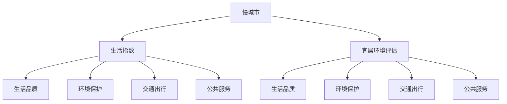

                 

### 引言

随着全球城市化进程的不断加快，人们对于生活质量和环境舒适度的要求也越来越高。传统的宜居环境评估方法往往侧重于经济发展和基础设施，而忽视了居民的实际生活感受和城市环境的可持续性。在这样的背景下，慢城市生活指数作为一种全新的宜居环境评估标准，逐渐引起了广泛关注。

**慢城市生活指数**是衡量一个城市生活质量的重要指标，它不仅仅关注城市的经济发展速度和基础设施完备程度，更侧重于居民的生活质量、环境舒适度以及社会的和谐发展。这一指数从多个维度综合评估城市的宜居性，旨在为城市规划和居民生活提供科学、客观的参考。

本文旨在探讨慢城市生活指数作为宜居环境评估的新标准，分析其核心概念、研究方法、评价指标体系以及具体案例。文章结构如下：

1. **第1章 引言**：介绍慢城市生活指数的概念及其重要性。
2. **第2章 核心概念与联系**：详细阐述慢城市、生活指数和宜居环境评估之间的关系，并使用Mermaid流程图展示核心概念之间的关系架构。
3. **第3章 研究方法与工具**：介绍评估宜居环境的方法和工具，包括数据分析技术、问卷调查和实地考察。
4. **第4章 评价指标体系**：建立宜居环境的评价指标体系，包括生活品质、环境保护、交通出行、公共服务等方面。
5. **第5章 案例分析**：分析不同城市的慢城市生活指数，探讨成功经验和挑战。
6. **第6章 政策建议**：提出促进慢城市发展的政策建议，包括城市规划、政策设计和公众参与。
7. **第7章 未来趋势与展望**：探讨慢城市发展面临的挑战和未来趋势。

通过以上结构，本文将逐步深入分析慢城市生活指数的各个方面，以期为城市规划和居民生活提供有益的参考。

### 文章关键词

- 慢城市生活指数
- 宜居环境评估
- 生活质量
- 环境保护
- 交通出行
- 公共服务
- 数据分析
- 问卷调查
- 实地考察
- 评价指标体系
- 政策建议
- 未来趋势

### 摘要

本文以慢城市生活指数为研究对象，探讨了其在宜居环境评估中的应用。首先，文章介绍了慢城市生活指数的概念及其重要性，并阐述了慢城市与宜居环境评估之间的关系。接着，通过Mermaid流程图展示了核心概念之间的关系架构。随后，文章详细介绍了研究方法与工具，包括数据分析技术、问卷调查和实地考察。在此基础上，文章建立了宜居环境的评价指标体系，涵盖了生活品质、环境保护、交通出行和公共服务等多个方面。随后，通过具体案例分析了不同城市的慢城市生活指数，探讨了成功经验和面临的挑战。最后，文章提出了促进慢城市发展的政策建议，并展望了其未来趋势。本文旨在为城市规划和居民生活提供科学、客观的参考，推动慢城市的可持续发展。

### 第1章 引言

#### 1.1 慢城市运动与慢城市生活指数的概念

慢城市运动起源于20世纪80年代的意大利，是一种以人为中心的城市发展理念，强调放缓城市的节奏，减少城市化进程带来的负面影响，提升居民的生活质量。其核心理念包括可持续性、社区参与、文化多样性和环境保护等。随着全球城市化进程的加速，慢城市运动逐渐在全球范围内得到推广和认可，成为应对现代城市化问题的一种有效策略。

慢城市生活指数则是衡量一个城市在慢城市理念下生活质量的重要指标。它不仅关注城市的经济发展速度和基础设施，还侧重于居民的实际生活感受和城市环境的可持续性。慢城市生活指数从多个维度综合评估城市的宜居性，包括生活品质、环境保护、交通出行、公共服务等方面。这一指数的提出，旨在为城市规划和居民生活提供科学、客观的参考，推动城市向更加宜居、可持续的方向发展。

#### 1.2 慢城市生活指数的意义

慢城市生活指数在宜居环境评估中具有重要的意义。首先，它为城市管理者提供了一个全面的评估工具，帮助其了解城市的实际情况，发现存在的问题，并制定针对性的改进措施。其次，它帮助居民更好地理解自己的生活环境，提升其对城市发展的参与度和满意度。此外，慢城市生活指数还可以作为城市间的比较标准，促进城市之间的交流与合作，推动全球城市发展的共同进步。

#### 1.3 本书结构安排

本书共分为七个章节，结构安排如下：

- **第1章 引言**：介绍慢城市生活指数的概念、意义和本文的结构安排。
- **第2章 核心概念与联系**：详细阐述慢城市、生活指数和宜居环境评估之间的关系，并展示核心概念之间的关系架构。
- **第3章 研究方法与工具**：介绍评估宜居环境的方法和工具，包括数据分析技术、问卷调查和实地考察。
- **第4章 评价指标体系**：建立宜居环境的评价指标体系，包括生活品质、环境保护、交通出行、公共服务等方面。
- **第5章 案例分析**：分析不同城市的慢城市生活指数，探讨成功经验和挑战。
- **第6章 政策建议**：提出促进慢城市发展的政策建议，包括城市规划、政策设计和公众参与。
- **第7章 未来趋势与展望**：探讨慢城市发展面临的挑战和未来趋势。

通过以上章节的逐步深入，本文将全面探讨慢城市生活指数在宜居环境评估中的应用，为城市规划和居民生活提供有益的参考。

### 第2章 核心概念与联系

在本章中，我们将详细探讨慢城市、生活指数以及宜居环境评估这三个核心概念，并展示它们之间的关系架构。

#### 2.1 慢城市的概念

慢城市（Slow City）是一种以人为本的城市发展理念，主张城市发展的速度应该放缓，以减少城市化进程带来的负面影响，提升居民的生活质量。慢城市运动起源于20世纪80年代的意大利，最初是为了应对城市化进程中出现的交通拥堵、环境恶化和社会压力等问题。慢城市的核心理念包括可持续性、社区参与、文化多样性和环境保护等。其目标是通过放缓城市的节奏，实现经济发展与居民生活质量、环境保护的协调发展。

#### 2.2 生活指数的概念

生活指数（Quality of Life Index，QLI）是衡量一个地区或城市居民生活质量的重要指标。生活指数通常包括多个维度，如经济发展、社会安全、教育水平、医疗保健、环境质量等。生活指数的目的是为政府和居民提供一种量化评估城市或地区生活质量的标准，以便制定改善政策的依据。慢城市生活指数则是基于慢城市理念，从多个角度综合评估城市的宜居性，重点关注居民的实际生活感受和城市环境的可持续性。

#### 2.3 宜居环境评估的概念

宜居环境评估（Liveability Assessment）是指对一个地区或城市的宜居性进行系统评估，以确定其是否适合居住和发展。宜居环境评估通常包括多个方面，如生活品质、环境保护、交通出行、公共服务等。评估方法可以采用定量和定性相结合的方式，通过收集和分析相关数据，对城市的宜居程度进行综合评价。慢城市生活指数作为宜居环境评估的一种新标准，不仅关注城市的经济发展和基础设施，还重视居民的生活质量、环境舒适度和社会的和谐发展。

#### 2.4 核心概念之间的关系架构

为了更清晰地理解慢城市、生活指数和宜居环境评估之间的关系，我们可以使用Mermaid流程图来展示它们的核心概念架构。以下是相关的流程图：

在上面的流程图中，A表示慢城市，B表示生活指数，C表示宜居环境评估。生活指数B与宜居环境评估C之间存在关联，B包括了多个维度，如生活品质（D）、环境保护（E）、交通出行（F）和公共服务（G），而宜居环境评估C则从多个方面对城市的宜居性进行评估，包括生活品质（H）、环境保护（I）、交通出行（J）和公共服务（K）。

通过上述流程图，我们可以看出慢城市、生活指数和宜居环境评估之间的紧密联系。慢城市运动旨在提升居民的生活质量，而生活指数则是衡量这一目标的重要指标。宜居环境评估则是基于慢城市理念和生活指数，对城市的宜居性进行全面评估，从而为城市规划和居民生活提供科学依据。

### 2.5 核心概念与联系的进一步探讨

在进一步探讨慢城市、生活指数和宜居环境评估的关系时，我们可以从以下几个方面进行分析：

1. **慢城市的核心理念与生活指数的关系**：
   慢城市强调的是一种以人为中心的发展模式，注重提升居民的生活质量。因此，慢城市的核心理念与生活指数密切相关。生活指数通过定量和定性方法，综合评估城市在慢城市理念下的表现，包括经济发展、社会安全、教育水平、医疗保健、环境质量等方面。慢城市生活指数则更加关注居民的实际生活感受和城市环境的可持续性，使得评估结果更加贴近居民需求。

2. **宜居环境评估的维度与生活指数的关系**：
   宜居环境评估通常包括多个维度，如生活品质、环境保护、交通出行、公共服务等。这些维度正是生活指数的重要组成部分。生活指数通过这些维度的评估，可以全面反映城市的宜居程度。而宜居环境评估则利用生活指数的结果，进一步分析各个维度之间的关系，找出城市发展中存在的问题，为政策制定提供依据。

3. **慢城市、生活指数与宜居环境评估的互动关系**：
   慢城市理念的提出，旨在通过放缓城市发展节奏，实现可持续发展。生活指数则是衡量这一目标的重要工具。宜居环境评估则是对慢城市理念和生活指数的综合检验。通过三者之间的互动关系，可以不断优化城市发展规划，提升居民生活质量。

综上所述，慢城市、生活指数和宜居环境评估之间存在着紧密的联系。慢城市运动为提升居民生活质量提供了理念指导，生活指数通过定量和定性方法对其进行评估，而宜居环境评估则进一步验证了慢城市理念和生活指数的实际效果。这种互动关系使得慢城市生活指数成为宜居环境评估的一种新标准，为城市规划和居民生活提供了科学依据。

### 第3章 研究方法与工具

在评估宜居环境时，采用科学、系统的方法和工具至关重要。本章将介绍评估宜居环境的方法和工具，包括数据分析技术、问卷调查和实地考察。

#### 3.1 数据分析方法

数据分析技术在宜居环境评估中发挥着至关重要的作用。通过数据分析，可以从大量的数据中提取有用信息，为评估提供科学依据。以下是一些常见的数据分析方法：

1. **数据收集与预处理**：
   数据收集是数据分析的第一步，常用的数据来源包括政府统计数据、问卷调查、实地考察等。数据收集后，需要进行预处理，包括数据清洗、数据转换和数据归一化等。数据清洗的目的是去除无效数据和错误数据，确保数据质量。数据转换和数据归一化则有助于将不同来源的数据进行统一处理。

2. **数据可视化**：
   数据可视化是将数据分析结果以图表、图像等形式展示的过程，有助于直观理解数据。常用的数据可视化工具包括Excel、Tableau、Matplotlib等。通过数据可视化，可以更清楚地展示数据分布、趋势和关系。

3. **统计方法**：
   统计方法用于分析数据的分布、相关性、差异性和趋势等。常用的统计方法包括均值、中位数、方差、标准差等描述性统计方法，以及回归分析、聚类分析、因子分析等推断性统计方法。这些方法可以帮助我们深入理解数据，为宜居环境评估提供依据。

4. **机器学习方法**：
   机器学习方法在宜居环境评估中也有广泛应用。通过机器学习算法，可以从大量数据中自动识别模式和规律，预测未来趋势。常用的机器学习方法包括线性回归、逻辑回归、决策树、随机森林、支持向量机、神经网络等。这些方法可以用于预测居民生活质量、评估城市宜居程度等。

#### 3.2 问卷调查方法

问卷调查是收集居民对城市宜居性主观感受的重要方法。以下是一些关于问卷调查的方法：

1. **问卷设计原则**：
   问卷设计应遵循科学性、针对性、简洁性和可操作性等原则。问卷应涵盖生活品质、环境保护、交通出行、公共服务等方面，确保全面反映居民的生活体验。

2. **问卷发放与收集**：
   问卷可以通过线上和线下两种方式进行发放。线上问卷可以通过邮件、社交媒体等渠道发送，线下问卷则可以通过社区活动、公共场所等发放。在发放问卷时，应注意问卷的覆盖范围和代表性，确保收集到的数据具有参考价值。

3. **数据分析**：
   收集到问卷后，需要对问卷数据进行分析，通常采用描述性统计和推断性统计方法。描述性统计方法用于总结问卷结果，如计算平均分、标准差等；推断性统计方法则用于分析数据之间的关系和差异。

#### 3.3 实地考察方法

实地考察是了解城市宜居环境实际情况的重要手段。以下是一些关于实地考察的方法：

1. **考察目的与内容**：
   实地考察的目的是了解城市的实际生活状况和环境条件，发现问题并提出改进建议。考察内容通常包括居民生活条件、环境质量、交通状况、公共服务设施等。

2. **考察实施与记录**：
   实地考察应由专业的考察团队进行，考察过程中应注意记录观察到的现象和问题，如使用摄像机、录音笔等记录设备。考察记录应详细、真实，确保数据准确性。

3. **数据整理与分析**：
   实地考察数据收集后，需要对数据进行分析，通常采用定性分析和定量分析相结合的方法。定性分析包括对观察到的现象进行归纳和总结；定量分析则通过统计方法对数据进行分析，如计算指标、绘制图表等。

通过上述方法和工具，我们可以全面、系统地评估城市的宜居环境，为城市规划和居民生活提供科学依据。

### 第4章 评价指标体系

在评估宜居环境时，建立一套科学、全面的评价指标体系至关重要。本章将详细阐述评价指标的选取标准、权重分配方法，并分别介绍生活品质、环境保护、交通出行、公共服务等方面的具体评价指标。

#### 4.1 评价指标的选取标准

评价指标的选取标准直接影响评估结果的科学性和准确性。以下是一些评价指标选取的基本原则：

1. **代表性**：评价指标应能全面反映城市宜居环境的各个方面，确保评估结果具有代表性。
2. **可量化**：评价指标应尽可能量化，以便于进行量化分析和比较。
3. **可靠性**：评价指标的数据来源应可靠，确保评估结果的真实性。
4. **敏感性**：评价指标应能够敏感地反映城市宜居环境的变化，及时发现问题和挑战。
5. **相关性**：评价指标应与城市宜居性有较强的相关性，以确保评估结果的有效性。

#### 4.2 生活品质评价指标

生活品质是评估城市宜居性的重要维度，包括以下几个方面：

1. **经济发展水平**：
   - 人均GDP
   - 就业率
   - 工资水平

2. **社会保障**：
   - 医疗保健水平
   - 住房条件
   - 子女教育质量

3. **社区环境**：
   - 社区服务设施
   - 社区活动丰富度
   - 社区治安状况

4. **文化娱乐**：
   - 文化设施覆盖率
   - 娱乐设施丰富度
   - 体育活动设施

5. **社会安全**：
   - 犯罪率
   - 交通事故率
   - 火灾发生率

#### 4.3 环境保护评价指标

环境保护是衡量城市宜居性的关键因素，包括以下几个方面：

1. **空气质量**：
   - PM2.5浓度
   - PM10浓度
   - 二氧化硫浓度

2. **水质**：
   - 水质达标率
   - 污染物排放量
   - 河流水质状况

3. **绿化率**：
   - 城市绿化覆盖率
   - 公园和绿地数量
   - 绿道网络建设

4. **废弃物管理**：
   - 垃圾处理能力
   - 垃圾分类率
   - 垃圾填埋场和焚烧厂的运营状况

5. **噪声污染**：
   - 噪声监测点数量
   - 交通噪声指数
   - 工业噪声指数

#### 4.4 交通出行评价指标

交通出行是影响城市宜居性的重要因素，包括以下几个方面：

1. **公共交通**：
   - 公交线路数量
   - 公交站点覆盖率
   - 轨道交通运营效率

2. **道路设施**：
   - 道路长度
   - 道路密度
   - 道路通行能力

3. **停车设施**：
   - 公共停车位数量
   - 停车设施利用率
   - 停车费用

4. **交通拥堵**：
   - 每日高峰时段的交通拥堵指数
   - 交通流量
   - 交通事故发生率

5. **交通管理**：
   - 交通信号灯的覆盖率和智能化水平
   - 交通违章处理效率
   - 非机动交通设施建设

#### 4.5 公共服务评价指标

公共服务是城市宜居性的基础，包括以下几个方面：

1. **医疗卫生**：
   - 医疗机构的数量和分布
   - 医疗设施设备水平
   - 医疗服务覆盖率

2. **教育**：
   - 学校的数量和分布
   - 教学设施设备水平
   - 教育资源公平性

3. **文化设施**：
   - 文化馆、图书馆等文化设施的数量和分布
   - 文化活动丰富度
   - 文化设施利用率

4. **社会保障**：
   - 社保覆盖面
   - 社保基金收支情况
   - 社保服务便捷度

5. **公共安全**：
   - 消防站、警务站等公共安全设施的数量和分布
   - 突发事件应急处理能力
   - 公共安全教育普及率

通过上述评价指标体系，我们可以全面、系统地评估城市的宜居环境，为城市规划和居民生活提供科学依据。在具体的评估过程中，可以根据实际情况对指标进行调整和优化，确保评估结果的准确性和实用性。

### 第5章 案例分析

在本章中，我们将通过具体案例来分析不同城市的慢城市生活指数，探讨这些城市的成功经验和面临的挑战。案例的选择依据城市的发展水平、慢城市理念的执行程度以及居民的生活质量，以确保案例的代表性。

#### 5.1 案例选取标准与描述

1. **意大利博洛尼亚**：
   博洛尼亚是慢城市运动的发源地，被认为是全球慢城市的典范。该城市注重社区参与、环境保护和文化遗产的保护，通过放缓城市节奏，提升了居民的生活质量。博洛尼亚的成功经验包括：

   - **社区参与**：居民广泛参与城市规划和社区活动，增强了社区的凝聚力和居民的幸福感。
   - **环境保护**：实施严格的环保政策，提高废物回收率，降低空气污染。
   - **文化遗产保护**：重视文化遗产的保护和传承，丰富了城市的文化内涵。

2. **中国南京**：
   南京作为中国的慢城市试点，近年来在慢城市发展方面取得了一定的成效。南京的成功经验包括：

   - **城市规划**：注重历史文化保护，合理规划城市空间，提升城市宜居性。
   - **交通出行**：推进公共交通建设，鼓励非机动车出行，降低交通拥堵。
   - **公共服务**：提升公共服务的质量和覆盖面，确保居民享受到便利的公共服务。

3. **美国波特兰**：
   波特兰是美国的慢城市代表，以其可持续发展和良好的环境质量而闻名。波特兰面临的挑战包括：

   - **人口增长**：快速的人口增长给城市基础设施和服务带来了压力，如何平衡发展与环境是波特兰面临的主要挑战。
   - **经济压力**：部分居民由于经济负担加重而难以享受慢城市带来的美好生活。

#### 5.2 案例分析结果

1. **博洛尼亚**：

   - **生活品质**：博洛尼亚的生活品质指数较高，尤其在社区环境和文化遗产保护方面表现出色。居民的生活满意度较高，社区凝聚力强。
   - **环境保护**：空气质量、绿化率和废物回收率等环境指标均达到较高水平，城市环境质量优异。
   - **交通出行**：公共交通系统和非机动车交通网络发达，交通拥堵问题较少。
   - **公共服务**：公共服务设施完善，医疗、教育和文化等资源丰富。

2. **南京**：

   - **生活品质**：南京的生活品质在经济发展和社会安全方面表现良好，但社区环境和文化活动方面仍有提升空间。
   - **环境保护**：尽管在环境保护方面取得了一定成效，但空气质量和废弃物管理仍需进一步改进。
   - **交通出行**：公共交通系统较为完善，但非机动车交通设施仍有待加强，以缓解交通拥堵问题。
   - **公共服务**：公共服务质量较高，但部分居民对医疗和教育的满意度有待提高。

3. **波特兰**：

   - **生活品质**：波特兰的生活品质指数较高，尤其是在环境保护和公共服务方面。但部分居民由于经济压力，生活质量受到一定影响。
   - **环境保护**：波特兰的环境质量优秀，但人口增长带来的环境压力不可忽视。
   - **交通出行**：公共交通系统发达，但停车难题和非机动车交通设施不足。
   - **公共服务**：公共服务质量高，但应对人口增长带来的服务需求压力较大。

#### 5.3 案例成功经验与挑战

1. **成功经验**：

   - **博洛尼亚**：博洛尼亚的成功经验在于强调社区参与、环境保护和文化保护。通过广泛动员居民参与城市规划和社区活动，增强了社区的凝聚力和居民的幸福感。同时，严格的环保政策和有效的废物管理措施，使得城市环境质量得到了显著提升。

   - **南京**：南京的成功经验在于城市规划的合理性和公共交通的建设。通过合理规划城市空间，保护和传承历史文化，提升了城市的宜居性。公共交通系统的完善和鼓励非机动车出行，有效缓解了交通拥堵问题。

   - **波特兰**：波特兰的成功经验在于其可持续发展和良好的环境质量。通过一系列环保政策，如减少碳排放、提高能源利用效率等，实现了经济发展与环境保护的协调。公共服务的高质量为居民提供了便利，提升了生活品质。

2. **面临的挑战**：

   - **博洛尼亚**：尽管博洛尼亚在慢城市发展方面取得了显著成效，但如何应对人口老龄化、维持社区活力和持续改善环境质量仍然是面临的挑战。

   - **南京**：南京在慢城市发展过程中，需要解决经济发展与环境保护之间的矛盾。如何在提升经济增长的同时，确保环境质量不下降，是一个重要的课题。

   - **波特兰**：波特兰面临的主要挑战是人口增长带来的基础设施压力和服务需求压力。如何平衡人口增长与资源分配，确保每个居民都能享受到慢城市带来的好处，是波特兰需要解决的重要问题。

通过上述案例分析，我们可以看到不同城市在慢城市发展中面临的共同挑战和独特经验。这些案例为其他城市提供了宝贵的参考，有助于推动全球慢城市的可持续发展。

### 第6章 政策建议

在促进慢城市发展的过程中，政策制定与实施起着关键作用。本章将提出一系列政策建议，包括城市规划、政策设计以及公众参与等方面，以推动慢城市的可持续发展。

#### 6.1 城市规划政策

城市规划是慢城市发展的基础，合理的城市规划可以有效提升城市的宜居性。以下是一些具体的规划政策建议：

1. **历史文化保护**：在城市建设过程中，应注重历史文化保护，避免盲目拆建。可以设立历史文化保护区，确保历史建筑和文化遗址得到有效保护。同时，鼓励通过修复和历史再利用的方式，让历史遗产融入现代城市生活。

2. **社区规划**：社区是城市的基本单元，应注重社区规划，提高社区的宜居性。可以通过增加社区绿地、公园和公共活动空间，提升社区的生活品质。同时，应合理规划社区的服务设施，如学校、医院、文化中心等，确保居民能够便捷地享受到公共服务。

3. **交通规划**：交通是影响城市宜居性的重要因素。应优先发展公共交通，提高公共交通的覆盖率和便捷性，减少居民的交通出行负担。同时，应鼓励非机动车出行，建设完善的自行车道和人行道网络，降低交通拥堵和空气污染。

4. **绿色建筑**：推广绿色建筑理念，提高建筑能效和环保水平。可以通过制定相关标准和规范，鼓励建筑开发商采用节能材料和环保技术，降低建筑能耗和碳排放。

#### 6.2 政策设计

政策设计是慢城市发展的关键环节，以下是一些具体的政策设计建议：

1. **环保政策**：加强环保政策的制定和实施，提高环境治理水平。可以设立环境保护基金，用于支持环保项目的实施。同时，应加强环境监测和执法力度，确保环保政策的有效执行。

2. **税收政策**：通过税收政策鼓励企业和社会参与慢城市建设。可以设立环保税收优惠、低碳经济奖励等政策，激励企业采取环保措施，推动城市可持续发展。

3. **城市规划与土地利用政策**：合理规划土地利用，避免过度开发。可以通过制定土地利用规划，确保城市建设与自然环境相协调。同时，应鼓励城市向高密度、多功能、混合使用的方向发展，提高土地使用效率。

4. **社区参与政策**：鼓励居民参与城市规划和社区管理。可以设立社区参与机制，通过社区会议、居民代表等方式，让居民参与到城市规划和决策过程中，提升居民的参与度和满意度。

#### 6.3 公众参与

公众参与是慢城市发展的动力源泉，以下是一些具体的公众参与建议：

1. **信息公开**：政府应主动公开城市规划、环境监测、公共资源分配等信息，提高决策的透明度，接受公众监督。

2. **公众咨询**：在制定重大政策或项目时，应开展公众咨询活动，听取公众意见和建议。可以通过问卷调查、公开听证会等方式，让公众参与到政策制定过程中。

3. **社区活动**：鼓励社区组织举办各种活动，提升居民的社区参与度和凝聚力。可以通过社区论坛、文化沙龙、体育赛事等活动，增强居民的互动和合作。

4. **教育宣传**：加强环保和慢城市理念的教育宣传，提高公众的环保意识和参与意愿。可以通过学校教育、媒体宣传、公益活动等方式，普及慢城市知识，培养公众的可持续发展意识。

通过上述政策建议，可以有效推动慢城市的发展，提升城市的宜居性，实现经济、社会和环境的可持续发展。

### 第7章 未来趋势与展望

在全球化与城市化进程不断加速的背景下，慢城市生活指数作为评估宜居环境的新标准，面临着一系列新的挑战和机遇。本章将探讨慢城市生活指数在未来发展中所面临的挑战，以及其可能的发展趋势。

#### 7.1 慢城市发展面临的挑战

1. **全球化与地方化的矛盾**：
   随着全球化的深入，城市间的联系日益紧密，但同时也带来了地方化问题的挑战。全球化带来了经济繁荣和技术进步，但同时也加剧了资源分配不均、文化同质化等问题。如何在全球化的背景下保持地方特色和社区活力，是慢城市发展面临的重要挑战。

2. **城市化与可持续发展的挑战**：
   城市化进程的加快带来了城市扩张和人口增长，但同时也带来了交通拥堵、环境污染、资源紧张等问题。如何在城市化的进程中实现可持续发展，确保城市环境的健康和居民的生活质量，是慢城市发展需要面对的长期挑战。

3. **技术变革的影响**：
   科技的快速发展，尤其是人工智能、大数据和物联网等技术的应用，为慢城市的发展带来了机遇，但同时也提出了新的挑战。如何充分利用技术进步的优势，同时避免技术滥用带来的负面影响，如隐私侵犯、数据安全等，是慢城市发展需要重视的问题。

4. **政策执行与公众参与**：
   政策的有效执行和公众的广泛参与是慢城市发展的关键。然而，现实情况是政策执行过程中存在执行不力、监督不到位等问题，同时公众参与度不高，居民对城市发展的认同感和参与意愿有待提升。如何提高政策执行效率和公众参与度，是慢城市发展的重要课题。

#### 7.2 慢城市发展的趋势

1. **可持续发展理念的普及**：
   随着全球对环境保护和可持续发展的重视，慢城市理念将得到更广泛的认同和应用。越来越多的城市将把可持续发展作为城市发展的核心目标，通过制定相关政策和措施，推动经济、社会和环境的协调发展。

2. **技术创新的推动**：
   人工智能、大数据、物联网等技术的创新应用，将进一步提升慢城市的治理水平和居民生活质量。通过智能交通系统、智慧社区建设等，可以有效缓解城市拥堵、提升公共服务效率，增强城市的宜居性。

3. **社区参与与共治**：
   随着公众环保意识和参与意愿的提升，社区参与和共治将成为慢城市发展的重要趋势。通过建立多样化的社区参与机制，鼓励居民参与城市规划和社区管理，提高居民的参与度和满意度，增强社区的凝聚力和活力。

4. **政策创新与多元化**：
   慢城市发展需要多元化的政策支持，包括环保政策、交通政策、公共服务政策等。政策设计将更加注重科学性和灵活性，根据不同城市的实际情况，制定差异化的政策方案，确保政策的有效性和可操作性。

5. **国际化与合作**：
   慢城市发展的国际化趋势将不断加强，全球范围内的城市将共享经验、互相学习，推动全球城市发展的共同进步。通过国际合作，可以引进先进的技术和管理经验，促进全球城市可持续发展。

#### 7.3 未来展望

展望未来，慢城市生活指数将在以下几个方面发挥重要作用：

1. **提升城市治理水平**：
   慢城市生活指数作为评估城市宜居性的重要工具，将帮助城市管理者更好地了解城市的实际情况，发现问题和挑战，制定和调整城市发展规划，提升城市治理水平。

2. **改善居民生活质量**：
   通过慢城市生活指数的评估，可以针对性地改善居民的生活环境和生活质量，提升居民的满意度，增强社区的凝聚力和居民的幸福感。

3. **推动可持续发展**：
   慢城市生活指数强调经济、社会和环境的协调发展，有助于推动城市可持续发展，实现经济效益、社会效益和环境效益的统一。

4. **促进国际合作**：
   慢城市生活指数将为全球城市提供共同的评估标准，促进国际间的交流与合作，推动全球城市发展的共同进步。

总之，随着全球城市化进程的不断推进，慢城市生活指数作为评估宜居环境的新标准，将在未来发挥越来越重要的作用，为城市发展和居民生活提供科学、客观的参考。通过不断优化和发展，慢城市生活指数将推动城市向更加宜居、可持续的方向发展。

### 总结与未来展望

通过本文的深入探讨，我们全面了解了慢城市生活指数作为宜居环境评估的新标准的重要性。慢城市生活指数不仅关注经济发展和基础设施，更侧重于居民的生活质量、环境舒适度和社会的和谐发展。在研究方法与工具方面，我们介绍了数据分析技术、问卷调查和实地考察等评估方法，并建立了系统的评价指标体系。案例分析部分，通过具体城市案例展示了慢城市生活指数在不同环境下的应用与效果。政策建议部分，提出了城市规划、政策设计和公众参与等方面的策略，以推动慢城市的可持续发展。

展望未来，慢城市生活指数将在提升城市治理水平、改善居民生活质量、推动可持续发展以及促进国际合作等方面发挥重要作用。面对全球化与城市化的挑战，慢城市生活指数将为城市规划和居民生活提供科学、客观的参考，推动全球城市发展的共同进步。

**注意事项**：在实施慢城市生活指数评估过程中，应注重数据的真实性和完整性，确保评估结果的准确性。同时，政策建议的执行需要结合实际情况，不断调整和优化。

**拓展阅读**：

1. **《慢城市：如何打造宜居城市》**，作者：（意大利）卡尔洛·皮格利亚
2. **《城市可持续发展：理论与实践》**，作者：王广宇
3. **《全球城市生活指数报告》**，发布机构：经济学人智库

通过阅读这些文献，可以进一步深入了解慢城市和宜居环境评估的相关理论和实践。

