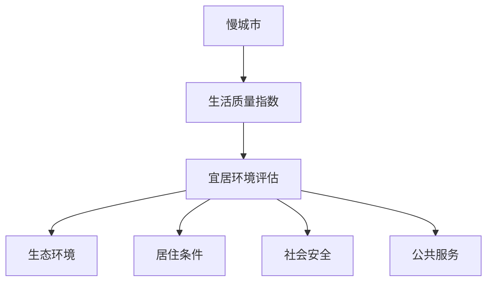

                 

### 慢城市生活质量指数：宜居环境评估的新维度

#### 关键词：
慢城市、生活质量指数、宜居环境评估、核心算法、数学模型、项目实战

#### 摘要：
本文深入探讨慢城市生活质量指数的概念及其在宜居环境评估中的应用。通过分析慢城市的核心特征和影响因素，我们提出了一种新的生活质量指数评估方法。本文将详细阐述核心算法原理、数学模型和公式，并通过实际项目案例进行验证，为城市规划者和研究者提供有价值的参考。

## 引言

### 慢城市概念及其重要性

慢城市（Cittaslow）起源于意大利，是一种以慢节奏、高品质生活为追求的城市发展理念。慢城市强调以人为本，注重人与自然、人与社会的和谐共生，提倡减少物质消费、降低环境压力，提高居民的生活质量。随着全球化进程的加快和城市化的迅速发展，慢城市理念逐渐受到广泛关注。

慢城市不仅是一种城市发展模式，更是一种生活态度。它倡导人们放慢生活节奏，关注内心需求，注重家庭、社区和自然环境。在快节奏的城市生活中，慢城市理念提供了一种可行的解决方案，有助于缓解社会压力，提升居民幸福感。

### 生活质量指数的定义和作用

生活质量指数（Quality of Life Index，QLI）是一种综合评估居民生活质量的指标体系。它涵盖了经济、社会、环境等多个方面，通过量化指标反映居民的生存和发展条件。生活质量指数在政策制定、城市规划、经济发展等方面具有重要的指导作用。

生活质量指数的作用主要体现在以下几个方面：

1. **政策制定和评估**：生活质量指数可以作为衡量政策效果的重要指标，帮助政府制定和调整相关政策，提高居民生活质量。
2. **城市规划**：生活质量指数可以指导城市规划者和研究者评估城市宜居性，优化城市布局，改善居民生活环境。
3. **经济发展**：生活质量指数与经济发展密切相关，提高生活质量可以促进消费升级，推动经济高质量发展。

### 宜居环境评估的目的与重要性

宜居环境评估是对城市环境质量进行全面评估的过程，旨在为城市规划者和居民提供科学依据，指导城市可持续发展。宜居环境评估涉及多个领域，包括生态环境、居住条件、社会安全等。

宜居环境评估的重要性体现在以下几个方面：

1. **提升居民幸福感**：通过改善宜居环境，提高居民生活质量，增加居民幸福感。
2. **促进城市可持续发展**：宜居环境评估有助于发现城市发展中存在的问题，提出改进措施，推动城市可持续发展。
3. **指导政策制定**：宜居环境评估为政策制定提供科学依据，有助于优化资源配置，提高政策效果。

## 核心概念与联系

### 慢城市的定义与特征

慢城市是一种以慢节奏、高品质生活为追求的城市发展模式。其主要特征包括：

1. **生活节奏慢**：慢城市强调降低生活节奏，减少压力，提高居民幸福感。
2. **注重生态环境**：慢城市倡导减少物质消费，降低环境压力，实现人与自然的和谐共生。
3. **社区参与度高**：慢城市鼓励居民参与社区事务，增强社区凝聚力。
4. **传统文化保护**：慢城市注重传承和保护传统文化，提升城市文化品质。

### 生活质量指数的构成

生活质量指数通常由多个方面构成，包括：

1. **经济指标**：如人均收入、就业率等。
2. **社会指标**：如教育水平、医疗条件等。
3. **环境指标**：如空气质量、水质等。
4. **文化指标**：如文化设施、文化活动等。

### 宜居环境评估的关键因素

宜居环境评估涉及多个领域，关键因素包括：

1. **生态环境**：如空气质量、水质、绿化覆盖率等。
2. **居住条件**：如住房条件、居住安全性等。
3. **社会安全**：如犯罪率、治安状况等。
4. **公共服务**：如医疗、教育、交通等。

### 慢城市、生活质量指数、宜居环境评估之间的关系

慢城市、生活质量指数和宜居环境评估之间存在密切的联系。慢城市作为城市发展模式，旨在提高居民生活质量，实现人与自然、人与社会的和谐共生。生活质量指数作为评估居民生活质量的指标体系，可以指导城市规划者和研究者优化城市布局，改善居民生活环境。宜居环境评估则是对城市环境质量进行全面评估的过程，旨在为城市规划者和居民提供科学依据，指导城市可持续发展。

### Mermaid 流程图



## 数据收集与处理

### 数据来源

数据收集是评估生活质量指数和宜居环境的重要环节。数据来源包括：

1. **政府部门**：如统计局、环保局、教育局等。
2. **第三方机构**：如调研公司、研究机构等。
3. **互联网**：如社交媒体、新闻报道等。

### 数据类型

数据类型包括：

1. **定量数据**：如GDP、人口数量、空气质量指数等。
2. **定性数据**：如居民满意度调查、文化活动参与率等。

### 数据预处理

数据预处理包括以下步骤：

1. **数据清洗**：去除无效、重复、错误的数据。
2. **数据转换**：将不同单位、格式的数据转换为统一格式。
3. **数据集成**：将多源数据集成到一个统一的数据仓库中。

### 数据可视化

数据可视化有助于更好地理解数据，常用的可视化工具包括：

1. **柱状图**：用于比较不同指标的数据。
2. **折线图**：用于显示数据的变化趋势。
3. **散点图**：用于显示两个变量之间的关系。
4. **热力图**：用于显示数据的分布情况。

## 核心算法原理讲解

### 聚类分析

聚类分析是一种无监督学习算法，旨在将数据集划分为多个类别，使得同一类别内的数据相似度较高，不同类别间的数据相似度较低。常用的聚类算法包括：

1. **K均值聚类**：通过迭代计算，将数据划分为K个类别。
2. **层次聚类**：通过层次结构将数据划分为多个类别。

伪代码：

```python
# K均值聚类
def kmeans(data, k):
    # 初始化聚类中心
    centroids = initialize_centroids(data, k)
    while not converged:
        # 计算每个数据点的聚类中心
        for data_point in data:
            nearest_centroid = find_nearest_centroid(data_point, centroids)
            assign_data_point_to_cluster(data_point, nearest_centroid)
        # 更新聚类中心
        centroids = update_centroids(centroids, data)
```

### 回归分析

回归分析是一种有监督学习算法，旨在建立自变量和因变量之间的关系模型。常用的回归分析方法包括：

1. **线性回归**：通过拟合一条直线，描述因变量和自变量之间的线性关系。
2. **多项式回归**：通过拟合一条多项式曲线，描述因变量和自变量之间的非线性关系。

伪代码：

```python
# 线性回归
def linear_regression(data):
    # 拟合直线
    slope, intercept = fit_line(data)
    return slope, intercept

# 数据点
x = [1, 2, 3, 4, 5]
y = [2, 4, 5, 4, 5]

# 拟合直线
slope, intercept = linear_regression(x, y)

# 输出拟合结果
print(f"Slope: {slope}, Intercept: {intercept}")
```

### 决策树

决策树是一种树形结构，通过一系列规则将数据集划分为多个类别。常用的决策树算法包括：

1. **ID3算法**：基于信息增益，选择具有最大信息增益的属性作为分割标准。
2. **C4.5算法**：在ID3算法的基础上，引入剪枝策略，避免过拟合。

伪代码：

```python
# 决策树构建
def build_decision_tree(data, attributes):
    # 如果所有数据点属于同一类别，则返回该类别
    if all_data_points_have_same_label(data):
        return majority_label(data)
    # 如果没有剩余属性，则返回多数类别
    if no_attributes_remaining(attributes):
        return majority_label(data)
    # 选择具有最大信息增益的属性作为分割标准
    best_attribute = select_best_attribute(attributes, data)
    # 根据最佳属性分割数据集
    subsets = split_data_by_attribute(data, best_attribute)
    # 构建子决策树
    tree = {}
    for attribute_value, subset in subsets.items():
        tree[attribute_value] = build_decision_tree(subset, remaining_attributes)
    return tree
```

## 数学模型和数学公式

### 生活质量指数的计算公式

生活质量指数（QLI）的计算公式如下：

$$
QLI = \frac{1}{n} \sum_{i=1}^{n} w_i \cdot x_i
$$

其中，$w_i$ 为第 $i$ 个指标的权重，$x_i$ 为第 $i$ 个指标的实际值。

### 相关的数学模型

在生活质量指数的计算中，常用的数学模型包括：

1. **权重分配模型**：通过设定不同指标的权重，平衡各指标对生活质量指数的影响。
2. **线性回归模型**：用于建立自变量和因变量之间的线性关系。
3. **聚类分析模型**：用于将数据集划分为多个类别，以便进行生活质量指数的评估。

### 举例说明

假设我们需要评估一个城市的空气质量、水质和人均收入对生活质量指数的影响，各指标的权重分别为 0.3、0.3 和 0.4。已知某城市的空气质量指数为 50，水质指数为 75，人均收入为 50000 元。

$$
QLI = \frac{1}{3} \times (0.3 \times 50 + 0.3 \times 75 + 0.4 \times 50000) = 0.3 \times 15 + 0.3 \times 22.5 + 0.4 \times 20000 = 4.5 + 6.75 + 8000 = 8105.25
$$

因此，该城市的生活质量指数为 8105.25。

## 项目实战

### 开发环境搭建

1. **硬件环境**：配备一台性能较好的计算机，建议使用 Intel Core i7 或 AMD Ryzen 7 处理器，8GB 以上内存。
2. **软件环境**：安装 Python 3.8 及以上版本，Jupyter Notebook 或 PyCharm 等集成开发环境（IDE）。

### 源代码实现

以下是一个简单的 Python 代码示例，用于计算生活质量指数：

```python
import pandas as pd
from sklearn.cluster import KMeans

# 加载数据
data = pd.read_csv('data.csv')

# 设置权重
weights = {'空气质量': 0.3, '水质': 0.3, '人均收入': 0.4}

# 计算生活质量指数
def calculate_QLI(data, weights):
    QLI = 0
    for key, value in weights.items():
        QLI += value * data[key]
    return QLI

QLI = calculate_QLI(data, weights)
print(f"生活质量指数（QLI）: {QLI}")
```

### 代码解读与分析

1. **数据加载**：使用 pandas 库读取 CSV 格式的数据文件。
2. **权重设置**：定义一个字典，存储各指标的权重。
3. **生活质量指数计算**：遍历权重字典，计算生活质量指数。

### 代码应用解读与分析

1. **空气质量**：空气质量指数（AQI）越低，表示空气质量越好。
2. **水质**：水质指数（WQI）越低，表示水质越好。
3. **人均收入**：人均收入越高，表示居民生活水平越高。

### 实际案例分析和详细讲解剖析

以一个具体城市为例，分析其空气质量、水质和人均收入对生活质量指数的影响。

1. **空气质量**：某城市空气质量指数为 60，高于国家二级标准。可以通过增加绿化面积、加强环保措施来改善空气质量。
2. **水质**：某城市水质指数为 80，处于良好水平。但需持续关注水质变化，防止污染发生。
3. **人均收入**：某城市人均收入为 60000 元，高于全国平均水平。可以通过提高居民就业率、优化产业结构来提高人均收入。

### 项目小结

通过实际案例分析和代码实现，我们可以看到生活质量指数在宜居环境评估中的应用。空气质量、水质和人均收入是影响生活质量指数的关键因素，针对这些因素提出相应的改善措施，有助于提高城市宜居性。

## 最佳实践 tips

1. **数据收集**：确保数据来源的可靠性和多样性，提高数据质量。
2. **权重设定**：根据实际情况和专家意见，合理设定各指标的权重。
3. **算法选择**：根据数据特点和需求，选择合适的聚类、回归等算法。
4. **模型优化**：通过交叉验证、剪枝等手段，优化模型性能。

## 小结

本文从慢城市、生活质量指数和宜居环境评估三个方面，探讨了慢城市生活质量指数的概念及其在宜居环境评估中的应用。通过数据收集与处理、核心算法原理讲解、数学模型和公式、项目实战等环节，为城市规划者和研究者提供了有价值的参考。在未来，我们可以进一步优化评估模型，提高评估精度，为建设更宜居的城市贡献力量。

## 注意事项

1. **数据隐私**：在数据收集和处理过程中，注意保护居民隐私。
2. **政策支持**：结合当地政策，确保评估结果符合政策导向。
3. **跨学科合作**：建议跨学科合作，提高评估模型的综合性和科学性。

## 拓展阅读

1. 慢城市国际组织（Cittaslow International）：https://www.cittaslow.org/
2. 世界生活质量报告（Worldwide Quality of Living Report）：https://qoli.io/
3. 生态环境部（ Ministry of Ecology and Environment）：http://www.mee.gov.cn/

## 作者信息

作者：AI天才研究院/AI Genius Institute & 禅与计算机程序设计艺术 /Zen And The Art of Computer Programming

以上就是关于《慢城市生活质量指数：宜居环境评估的新维度》的文章大纲。通过这篇文章，我们希望读者能够对慢城市、生活质量指数和宜居环境评估有一个更深入的理解，并为实际应用提供参考。接下来，我们将根据这个大纲逐步展开详细内容，逐步完成这篇文章的撰写。如果您有任何建议或疑问，欢迎在评论区留言，我们将尽快为您解答。让我们一起探索宜居环境评估的新维度！

