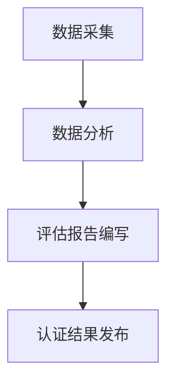
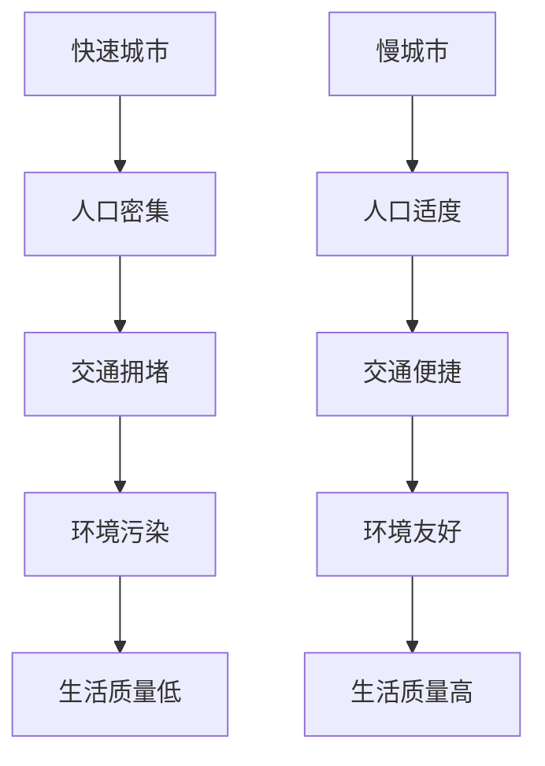
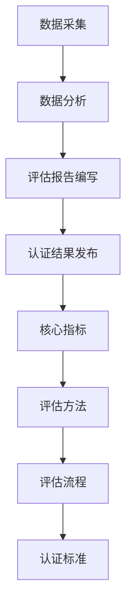

                 

### 一、书名与主题概述

《慢城市认证标准2.0：宜居环境评估的升级版》这本书旨在为读者提供一个全面、系统的指南，解读慢城市认证标准2.0。本书涵盖了慢城市的核心概念、评估指标、评估方法以及具体案例等内容，旨在帮助城市管理者、规划师和相关从业者更好地理解和应用这一标准。

#### 1.1 核心概念与联系

首先，我们需要明确什么是慢城市。慢城市并非意味着城市的缓慢发展，而是追求一种平衡、和谐的生活方式。与快速城市相比，慢城市更注重居民的幸福感、社会文化的丰富性以及环境的可持续性。慢城市的核心原则包括：尊重自然、和谐共生、人文关怀、可持续发展等。

接下来，我们来看一下慢城市认证标准的发展历程。慢城市认证标准最初起源于欧洲，随后在全球范围内得到推广。随着城市发展的需求和环境问题的日益突出，认证标准也在不断更新和完善。2.0版本的发布，标志着慢城市认证标准进入了一个新的阶段。

#### 1.2 认证标准架构

慢城市认证标准2.0的架构主要包括四个方面：核心指标、评估方法、评估流程和认证标准。核心指标是评估慢城市的基础，包括环境质量、交通系统、城市规划与建筑设计、社会文化环境以及经济可持续性等。评估方法则涵盖了定量与定性评估的结合，通过数学模型和计算公式对各项指标进行评估。评估流程则包括数据采集、数据分析、评估报告的编写和认证结果发布。最后，认证标准为慢城市的评估提供了一个全面的框架和指导。

#### 1.3 慢城市认证流程图

为了更好地理解慢城市认证标准2.0，我们可以通过一个流程图来展示其各个阶段。首先是数据采集，然后是数据分析和评估，最后是评估报告的编写和认证结果的发布。

通过以上步骤，我们可以对慢城市认证标准2.0有一个基本的了解。接下来，我们将分别介绍每个章节的内容，帮助读者深入理解这一标准。

### 二、章节内容设计

#### 2.1 第1章：慢城市概念与认证标准概述

本章主要介绍慢城市的核心概念和认证标准的发展历程。首先，我们将详细阐述慢城市的定义、特点以及与快速城市的区别。接着，我们将回顾慢城市认证标准的演变过程，特别是2.0版本的更新和亮点。最后，我们将通过一个流程图展示慢城市认证的各个阶段。

##### 2.1.1 核心概念与联系

慢城市（Slow City）是一个相对较新的概念，起源于20世纪80年代的意大利。它强调的是一种平衡、和谐的生活方式，旨在让城市居民能够更好地享受生活。与快速城市（Fast City）相比，慢城市更注重以下几个方面：

1. **尊重自然**：慢城市鼓励城市与自然环境和谐共生，减少对自然资源的消耗，提高生态效率。
2. **人文关怀**：慢城市重视居民的幸福感和生活质量，强调人与人之间的相互关爱和尊重。
3. **可持续发展**：慢城市追求经济、社会和环境三者的平衡发展，确保城市长期可持续。

为了更好地理解慢城市的核心概念，我们可以通过一个Mermaid流程图来展示其与快速城市的对比分析。

从上面的流程图中，我们可以看到慢城市与快速城市在多个方面的显著差异。接下来，我们将详细讨论慢城市的核心原则与实践案例。

##### 2.1.2 认证标准架构

慢城市认证标准的发展历程可以追溯到20世纪80年代，当时意大利的一些小镇率先提出了“慢城市”的理念。随后，这一理念逐渐在全球范围内传播，并得到了广泛认可。目前，慢城市认证标准已经更新至2.0版本，其架构主要包括以下几个方面：

1. **核心指标**：慢城市认证标准2.0的核心指标涵盖了环境质量、交通系统、城市规划与建筑设计、社会文化环境以及经济可持续性等多个方面。这些指标为评估慢城市提供了具体的衡量标准。

2. **评估方法**：慢城市认证标准2.0采用了定量与定性评估方法相结合的方式。定量评估主要通过数学模型和计算公式来衡量各项指标，定性评估则通过专家评审和实地考察等方式进行。

3. **评估流程**：慢城市认证标准2.0的评估流程包括数据采集、数据分析、评估报告的编写和认证结果发布等环节。这一流程确保了认证过程的严谨性和科学性。

4. **认证标准**：慢城市认证标准2.0为慢城市的评估提供了一个全面的框架和指导。这一标准不仅为城市管理者提供了评估工具，也为城市居民提供了宜居环境的标准。

为了更好地展示慢城市认证标准的架构，我们可以使用一个Mermaid流程图。

接下来，我们将详细讨论慢城市认证流程的各个阶段。

##### 2.1.3 慢城市认证流程图

慢城市认证流程可以分为以下几个阶段：

1. **数据采集**：在这一阶段，需要对城市的各项指标进行数据采集，包括环境质量、交通系统、城市规划与建筑设计、社会文化环境以及经济可持续性等。

2. **数据分析**：通过对采集到的数据进行分析，评估各项指标的表现，为后续的评估报告编写提供依据。

3. **评估报告编写**：根据数据分析的结果，编写评估报告，详细阐述城市的慢城市认证情况。

4. **认证结果发布**：最后，认证结果将进行发布，向公众展示城市的慢城市认证情况。

下面是一个慢城市认证流程的Mermaid流程图。

通过以上章节的介绍，我们希望能够帮助读者对慢城市认证标准2.0有一个全面、系统的了解。接下来，我们将进入下一章，详细讨论慢城市评估指标体系。

### 三、慢城市评估指标体系

慢城市评估指标体系是慢城市认证标准2.0的核心组成部分，它为评估城市是否符合慢城市标准提供了具体的衡量标准。慢城市评估指标体系涵盖了环境质量、交通系统、城市规划与建筑设计、社会文化环境以及经济可持续性等多个方面，每个方面都有具体的指标。以下是慢城市评估指标体系的核心内容。

#### 3.1 核心指标解释

慢城市评估指标体系的核心指标包括以下几个方面：

1. **环境质量指标**：环境质量是衡量慢城市的一个重要指标，主要包括空气质量、水质、噪音等。空气质量指标包括PM2.5、PM10等，水质指标包括重金属含量、细菌总数等，噪音指标包括白天和夜晚的噪音水平。

2. **交通系统指标**：交通系统指标主要包括交通流量、公共交通便捷性、自行车道和步行道建设情况等。交通流量的指标可以通过实时监测和统计得到，公共交通便捷性可以通过公交路线的覆盖范围和频率来衡量，自行车道和步行道的建设情况则反映城市对非机动交通的重视程度。

3. **城市规划与建筑设计指标**：城市规划与建筑设计指标主要包括绿地率、建筑密度、建筑设计人性化程度等。绿地率反映城市绿化水平，建筑密度反映建筑密集程度，人性化设计则包括无障碍设计、公共空间设计等。

4. **社会文化环境指标**：社会文化环境指标主要包括社区参与度、文化活动丰富度、文化设施建设等。社区参与度可以通过居民参与社区活动的比例来衡量，文化活动丰富度可以通过文化活动的种类和数量来衡量，文化设施建设则包括图书馆、博物馆、剧院等文化设施的建设情况。

5. **经济可持续性指标**：经济可持续性指标主要包括就业率、商业活力、能源利用效率等。就业率反映城市居民的就业情况，商业活力反映城市的经济发展水平，能源利用效率则反映城市在能源使用方面的可持续性。

#### 3.2 评估方法介绍

慢城市评估方法主要包括定量评估和定性评估两种。

1. **定量评估**：定量评估主要通过数学模型和计算公式来衡量各项指标。例如，空气质量指标可以通过监测数据计算得出，交通流量可以通过交通监测设备统计得到。定量评估的优势在于其客观性和可操作性。

2. **定性评估**：定性评估主要通过专家评审和实地考察等方式进行。专家评审可以根据专业知识对城市的环境质量、交通系统、城市规划与建筑设计、社会文化环境以及经济可持续性等进行评价。实地考察则可以更直观地了解城市的情况。定性评估的优势在于其灵活性和针对性。

在慢城市评估中，定量评估和定性评估相结合，可以更全面、准确地评估城市的慢城市水平。

#### 3.3 数学模型与公式

为了更详细地介绍慢城市评估指标体系，我们将在下面给出一些核心指标的数学模型和计算公式。

1. **空气质量指标**

   - PM2.5浓度：$$PM2.5 = \frac{监测值}{标准值}$$
   - PM10浓度：$$PM10 = \frac{监测值}{标准值}$$

2. **交通系统指标**

   - 交通流量：$$流量 = \frac{车辆数}{时间}$$
   - 公共交通便捷性：$$便捷性 = \frac{公交路线长度}{人口数}$$

3. **城市规划与建筑设计指标**

   - 绿地率：$$绿地率 = \frac{绿地面积}{城市总面积}$$
   - 建筑密度：$$建筑密度 = \frac{建筑总面积}{城市总面积}$$

4. **社会文化环境指标**

   - 社区参与度：$$参与度 = \frac{参与活动人数}{总人口数}$$
   - 文化活动丰富度：$$丰富度 = \frac{文化活动数量}{时间}$$

5. **经济可持续性指标**

   - 就业率：$$就业率 = \frac{就业人数}{总人口数}$$
   - 商业活力：$$活力 = \frac{商业销售额}{总人口数}$$

通过以上数学模型和计算公式，我们可以对慢城市评估指标体系有一个更深入的了解。接下来，我们将进入下一章，详细讨论环境质量评估。

### 四、环境质量评估

环境质量评估是慢城市评估指标体系中的一个关键方面，它直接关系到城市居民的生活质量和城市的可持续发展。环境质量评估包括多个指标，如空气质量、水质、噪音等。以下我们将详细介绍这些指标，并探讨评估方法与工具。

#### 4.1 环境质量指标

1. **空气质量指标**
   - **PM2.5浓度**：指大气中直径小于或等于2.5微米的颗粒物浓度，是评估空气质量的重要指标。
   - **PM10浓度**：指大气中直径小于或等于10微米的颗粒物浓度，相比PM2.5，其颗粒物较大，但对人体的危害也不可忽视。

2. **水质指标**
   - **重金属含量**：指水中重金属元素的总浓度，如铅、镉、汞等，这些重金属对人体健康具有严重的危害。
   - **细菌总数**：指水中细菌的数量，评估水质的安全性和卫生状况。

3. **噪音指标**
   - **白天噪音水平**：指白天环境中噪音的强度，通常以分贝（dB）为单位。
   - **夜晚噪音水平**：指夜晚环境中噪音的强度，同样以分贝（dB）为单位。夜晚噪音水平对居民的睡眠质量有重要影响。

#### 4.2 评估方法与工具

环境质量评估方法可以分为定量评估和定性评估。

1. **定量评估**
   - **监测设备**：环境质量监测设备如空气监测站、水质监测仪、噪音监测仪等，用于实时监测环境质量指标。
   - **数据分析**：通过监测设备获取的数据，使用统计方法和数学模型对环境质量指标进行分析，评估城市的环境质量状况。

2. **定性评估**
   - **专家评审**：邀请环境专家对城市的自然环境、污染源、污染治理等方面进行评估。
   - **公众调查**：通过问卷调查、访谈等方式，了解居民对环境质量的满意度和意见。

环境质量评估工具包括：

- **空气监测站**：用于监测空气质量指标，如PM2.5和PM10浓度。
- **水质监测仪**：用于监测水质指标，如重金属含量和细菌总数。
- **噪音监测仪**：用于监测噪音指标，如白天和夜晚的噪音水平。

#### 4.3 数据采集与处理方法

1. **数据采集**
   - **实时监测**：通过环境监测设备，实时采集空气质量、水质和噪音等数据。
   - **定期调查**：定期进行水质和空气质量抽样调查，确保数据的准确性和可靠性。

2. **数据处理**
   - **数据清洗**：去除数据中的错误和异常值，保证数据的质量。
   - **数据整合**：将不同来源和类型的数据整合在一起，形成完整的环境质量评估数据集。
   - **数据分析**：使用统计方法和数学模型对数据进行分析，评估环境质量。

#### 4.4 案例分析

以某个城市为例，我们进行环境质量评估：

1. **空气质量评估**
   - 数据显示，该城市的PM2.5浓度为35μg/m³，低于国家空气质量标准（75μg/m³）。
   - PM10浓度为50μg/m³，也低于国家空气质量标准（150μg/m³）。

2. **水质评估**
   - 水质监测数据显示，该城市的主要水源重金属含量均低于检测限（0.01mg/L）。
   - 细菌总数为100个/mL，低于国家饮用水标准（1000个/mL）。

3. **噪音评估**
   - 白天噪音水平为55dB，符合国家噪音标准（≤60dB）。
   - 夜晚噪音水平为45dB，远低于国家噪音标准（≤50dB）。

通过以上案例分析，我们可以看到该城市在环境质量方面表现良好，符合慢城市的要求。

### 五、交通系统评估

交通系统评估是慢城市评估指标体系中的另一个关键方面，它关系到城市的交通效率、居民的出行便捷性以及环境质量。以下我们将详细介绍交通系统评估的交通指标、评估方法以及具体案例分析。

#### 5.1 交通指标

交通系统评估主要关注以下几类指标：

1. **交通流量**：指单位时间内通过特定路段的车辆数量，是衡量城市交通拥堵程度的重要指标。

2. **公共交通便捷性**：指公共交通的覆盖范围、线路密度和班次频率，评估公共交通对居民的出行便利程度。

3. **自行车道和步行道建设情况**：评估城市对非机动交通设施的重视程度，包括自行车道、步行道的布局和条件。

4. **交通安全性**：评估交通事故发生率、交通违规行为等，保障居民出行安全。

#### 5.2 评估方法

交通系统评估方法主要包括定量评估和定性评估。

1. **定量评估**
   - **交通流量监测**：通过交通流量监测设备，如摄像头、感应线圈等，实时监测交通流量。
   - **公共交通评估**：根据公交路线的覆盖范围、线路密度和班次频率等数据进行评估。

2. **定性评估**
   - **实地考察**：通过实地考察了解交通拥堵情况、公共交通设施的状况。
   - **居民调查**：通过问卷调查、访谈等方式，收集居民对交通系统的满意度、便捷性等方面的反馈。

#### 5.3 慢交通策略案例分析

以某个城市为例，我们探讨慢交通策略在具体城市的应用：

1. **交通流量评估**
   - 数据显示，该城市的主要交通干道早晚高峰时段的流量分别为500辆/小时和300辆/小时，低于城市道路设计的最大承载能力。
   - 公共交通线路的流量高峰时段为400人次/小时，交通运行效率较高。

2. **公共交通便捷性评估**
   - 公交路线覆盖范围广，基本实现了主要居民区和商业区的全覆盖。
   - 公交线路密度为1公里/平方公里，满足居民出行需求。
   - 公交班次频率为10分钟/班，保证了居民的便捷出行。

3. **自行车道和步行道建设情况**
   - 城市主要道路两侧设置了自行车道和步行道，总长度达到100公里。
   - 自行车道和步行道的设计人性化，无障碍设施完善。

4. **交通安全性评估**
   - 交通事故发生率较低，过去一年交通事故发生率为1次/万车次。
   - 交通违规行为得到有效控制，交通违规率为5%。

通过以上案例分析，我们可以看到该城市在交通系统方面采取了有效的慢交通策略，提高了公共交通的便捷性，减少了交通拥堵，提升了居民出行的安全性和满意度。

### 六、城市规划与建筑设计

城市规划与建筑设计是慢城市评估指标体系的重要组成部分，直接关系到城市的宜居性、可持续发展以及居民的生活质量。以下我们将详细介绍城市规划原则、建筑设计评估以及人性化设计。

#### 6.1 规划原则

慢城市的城市规划原则强调生态、可持续和社会和谐，主要包括以下几点：

1. **生态优先**：在城市规划中，注重保护和恢复自然环境，提高城市的生态效率，减少对自然资源的消耗。

2. **空间合理布局**：合理规划城市的空间结构，确保绿地、居住区、商业区和工业区等各功能区域的合理分布，避免交通拥堵和环境污染。

3. **可持续交通**：鼓励非机动交通，如步行、自行车等，减少私家车的使用，降低交通污染和拥堵。

4. **社区参与**：鼓励居民参与城市规划与设计，确保城市规划能够真正反映居民的需求和意愿。

5. **文化传承**：保护和传承城市的历史文化遗产，增强城市的文化魅力和认同感。

#### 6.2 建筑设计评估

建筑设计评估主要关注以下几个方面：

1. **绿色建筑**：评估建筑的设计是否符合绿色建筑标准，包括能源效率、材料环保、室内环境质量等。

2. **生态建筑**：评估建筑的设计是否融入自然环境，如屋顶花园、雨水收集和利用系统等。

3. **无障碍设计**：评估建筑的设计是否考虑残疾人和老年人的需求，如无障碍通道、安全设施等。

4. **建筑密度**：评估建筑的密集程度是否合理，避免过度拥挤和空间浪费。

5. **建筑美学**：评估建筑的设计是否具有美学价值，提升城市整体风貌。

#### 6.3 人性化设计

人性化设计是慢城市建筑设计的核心原则，旨在提升居民的生活质量。以下为人性化设计的主要方面：

1. **公共空间**：设计满足居民休闲、社交和娱乐需求的公共空间，如公园、广场、社区中心等。

2. **社区参与**：鼓励居民参与社区建设和维护，增强社区凝聚力。

3. **无障碍设施**：确保建筑物和公共空间的无障碍设计，方便残疾人和老年人的出行。

4. **安全性**：确保建筑和公共空间的安全性，减少意外事故发生的风险。

5. **环境友好**：设计低噪音、低光污染的居住环境，提高居民的生活质量。

#### 6.4 案例分析

以某个城市为例，我们分析该城市在建筑设计和城市规划方面的一些成功实践：

1. **绿色建筑**：该城市积极推进绿色建筑的建设，新建的住宅和公共建筑均采用节能材料和新能源技术，如太阳能电池板、地源热泵等，显著降低了建筑的能源消耗。

2. **生态建筑**：在城市新区规划中，融入了大量的生态建筑，如屋顶花园、雨水收集和利用系统、绿色墙体等，提升了城市的生态质量和居民的生活品质。

3. **无障碍设计**：该城市在新建和改造的建筑物中，普遍采用了无障碍设计，如电梯、无障碍卫生间、无障碍坡道等，方便了残疾人和老年人的日常生活。

4. **公共空间**：该城市在规划中注重公共空间的设计，设置了多个公园、广场和社区中心，为居民提供了丰富的休闲和社交场所。

5. **社区参与**：该城市鼓励居民参与社区建设和维护，通过社区委员会等形式，让居民参与社区决策，增强了社区的凝聚力和归属感。

通过以上案例分析，我们可以看到该城市在建筑设计和城市规划方面取得了显著的成果，为打造宜居、可持续的慢城市提供了有力支撑。

### 七、社会文化环境评估

社会文化环境评估是慢城市评估指标体系的重要组成部分，它关注城市的社区参与度、文化活动丰富度以及文化设施建设等方面，旨在提升居民的幸福感和生活质量。以下我们将详细介绍社会文化环境评估的指标、评估方法以及具体案例分析。

#### 7.1 社会文化指标

社会文化环境评估的主要指标包括：

1. **社区参与度**：评估居民参与社区活动的积极性和参与率，如社区志愿服务、社区会议、文化活动和体育赛事等。

2. **文化活动丰富度**：评估城市内各类文化活动的种类和数量，包括音乐会、戏剧表演、艺术展览、节日庆典等。

3. **文化设施建设**：评估城市文化设施的建设情况，如图书馆、博物馆、剧院、文化活动中心等。

#### 7.2 评估方法

社会文化环境评估方法主要包括定量评估和定性评估。

1. **定量评估**
   - **问卷调查**：通过问卷调查收集居民对社区参与度、文化活动丰富度和文化设施建设的满意度。
   - **统计数据**：收集和统计城市内各类文化活动的参与人数、文化设施的访问量等数据。

2. **定性评估**
   - **访谈**：通过访谈了解居民对社区活动的参与情况和意见。
   - **实地考察**：实地考察社区活动和文化设施的运行状况。

#### 7.3 案例分析

以某个城市为例，我们分析该城市在社会文化环境方面的评估情况：

1. **社区参与度**
   - 调查显示，超过70%的居民参与了至少一项社区活动，如志愿服务、社区清洁和节日庆典。
   - 社区会议的参与率达到了80%，居民对社区事务的参与度较高。

2. **文化活动丰富度**
   - 该城市每年举办超过200场文化活动，包括音乐会、戏剧表演、艺术展览和节日庆典。
   - 文化活动吸引了大量居民参与，丰富了居民的精神生活。

3. **文化设施建设**
   - 城市内设有多个图书馆、博物馆、剧院和社区文化活动中心，设施设备完善，服务范围广泛。
   - 文化设施的高利用率表明居民对这些设施的需求较高，满足了居民的文化消费。

通过以上案例分析，我们可以看到该城市在社会文化环境方面取得了显著成绩，为打造宜居、和谐的慢城市提供了坚实基础。

### 八、经济可持续性评估

经济可持续性评估是慢城市评估指标体系的重要组成部分，它关系到城市的长期发展、居民的生活质量以及环境的保护。以下我们将详细介绍经济可持续性评估的指标、评估方法以及具体案例分析。

#### 8.1 经济指标

经济可持续性评估的主要指标包括：

1. **就业率**：评估城市的就业情况，反映居民的生活保障和城市的经济发展水平。

2. **商业活力**：评估城市的商业活动活跃程度，反映城市的经济活力和潜力。

3. **能源利用效率**：评估城市在能源使用方面的效率和可持续性，减少能源消耗和环境污染。

4. **经济多元化**：评估城市经济结构的多样性和稳定性，减少对单一产业的依赖。

#### 8.2 评估方法

经济可持续性评估方法主要包括定量评估和定性评估。

1. **定量评估**
   - **统计数据分析**：通过统计数据分析城市的就业率、商业活力、能源利用效率等经济指标。
   - **经济模型**：使用经济模型模拟城市经济的发展趋势，预测未来的经济状况。

2. **定性评估**
   - **实地考察**：通过实地考察了解城市的商业环境、能源使用情况等。
   - **专家评审**：邀请经济专家对城市的经济可持续性进行评估，提供专业意见。

#### 8.3 案例分析

以某个城市为例，我们分析该城市在经济可持续性方面的评估情况：

1. **就业率**
   - 数据显示，该城市的就业率达到了95%，高于全国平均水平。
   - 新兴产业和高科技产业的发展提供了大量就业机会，吸引了大量人才。

2. **商业活力**
   - 城市内商业活动繁忙，各种商业设施齐全，吸引了大量游客和居民。
   - 网络电商和本地商业相结合，提升了城市的商业活力。

3. **能源利用效率**
   - 该城市积极推进能源节约和可再生能源的使用，能源利用效率提高了20%。
   - 绿色建筑和智能电网技术的应用，降低了能源消耗和碳排放。

4. **经济多元化**
   - 城市经济结构多元化，不仅拥有传统产业，还发展了新兴产业和高科技产业。
   - 经济多元化增强了城市的抗风险能力，促进了经济的可持续发展。

通过以上案例分析，我们可以看到该城市在经济可持续性方面取得了显著成绩，为打造宜居、可持续的慢城市提供了有力支撑。

### 九、慢城市认证标准的实施与推广

慢城市认证标准的实施与推广是推动城市可持续发展的重要环节。以下我们将详细介绍慢城市认证标准的实施策略、推广方法以及不同地区的实施与推广案例。

#### 9.1 实施策略

1. **政策支持与法律法规**：政府应制定相关政策，支持慢城市认证标准的实施。例如，出台环保法规、交通管理政策等，确保各项指标得到有效落实。

2. **政府与企业合作模式**：政府与企业可以建立合作机制，共同推动慢城市的建设。例如，政府提供政策支持，企业投资建设环保设施、智能交通系统等。

3. **公众参与**：鼓励居民参与慢城市的建设，提高公众对慢城市的认知和参与度。例如，通过社区活动、公众咨询等方式，收集居民的意见和建议。

4. **评估与监测**：建立完善的评估与监测体系，定期对城市的慢城市水平进行评估和监测，确保各项指标得到持续改进。

#### 9.2 推广方法

1. **国际合作与交流**：通过国际合作与交流，分享慢城市建设的经验和最佳实践。例如，参与国际会议、举办培训班等。

2. **社会宣传与教育**：通过媒体宣传、社区活动、教育课程等方式，提高公众对慢城市的认知和支持。

3. **试点项目**：选择具有代表性的城市作为试点，率先实施慢城市认证标准，积累经验，逐步推广。

4. **教育培训**：对城市管理者、规划师和相关从业者进行教育培训，提高他们的专业素质和实施能力。

#### 9.3 案例研究

1. **欧洲慢城市联盟**：欧洲慢城市联盟是一个由多个慢城市组成的国际组织，致力于推广慢城市理念。该联盟通过组织国际会议、发布研究报告等方式，推动慢城市认证标准的实施。

2. **意大利**：意大利是慢城市理念的起源地，多个城市成功实施了慢城市认证标准。例如，博洛尼亚市通过限制车辆通行、推广公共交通、建设绿地等措施，显著提升了城市的环境质量和生活质量。

3. **中国**：中国多个城市正在探索慢城市的建设，如杭州、成都等。这些城市通过政策支持、企业合作、公众参与等方式，积极推进慢城市认证标准的实施。

通过以上案例研究，我们可以看到慢城市认证标准的实施与推广在不同地区取得了显著成效，为其他地区提供了有益借鉴。

### 十、未来展望与挑战

随着全球城市化进程的不断推进，慢城市理念逐渐受到关注。未来，慢城市的发展趋势和面临的挑战也将日益凸显。

#### 10.1 发展趋势

1. **技术赋能**：新技术的应用将进一步提升慢城市的智能化水平和运营效率。例如，大数据、人工智能等技术在交通管理、能源利用等方面的应用，将有助于实现更高效的城市管理。

2. **可持续发展**：随着人们对环境保护意识的提高，慢城市将更加注重可持续发展。绿色建筑、可再生能源、节能减排等技术将被广泛应用，以减少对自然资源的消耗。

3. **公众参与**：慢城市的发展将更加注重公众参与，通过社区活动、公众咨询等方式，提高居民的参与度和满意度。

4. **国际合作**：随着国际交流的加深，慢城市理念将得到更广泛的传播和应用。各国可以通过国际合作，分享经验，共同推动慢城市的发展。

#### 10.2 面临的挑战

1. **资金投入**：慢城市的建设需要大量资金投入，特别是在基础设施建设、环保技术引进等方面。如何确保资金的有效使用和合理分配，是一个重要的挑战。

2. **政策支持**：慢城市的建设需要政策支持，包括环保政策、交通政策、城市规划政策等。政策的制定和执行需要各相关部门的协同合作，如何确保政策的连续性和稳定性，是一个重要的挑战。

3. **公众认知**：尽管慢城市理念逐渐受到关注，但公众对其认知和接受程度仍需提高。如何提高公众对慢城市的认知和支持，是一个重要的挑战。

4. **技术创新**：新技术的快速发展和应用，将带来一系列新的挑战。如何确保技术创新与城市发展的需求相匹配，是一个重要的挑战。

#### 10.3 应对策略

1. **资金筹措**：通过多元化融资方式，如政府投资、企业赞助、国际援助等，确保资金来源的多样化和充足性。

2. **政策协同**：加强各部门之间的政策协同，确保政策的连续性和稳定性。同时，制定和完善相关法律法规，为慢城市的发展提供法律保障。

3. **公众教育**：通过媒体宣传、教育培训等方式，提高公众对慢城市的认知和支持。鼓励居民参与慢城市的建设，提高其参与度和满意度。

4. **技术创新**：加强科技创新，引进和应用先进技术，提升慢城市的智能化水平和运营效率。同时，关注技术创新的可持续发展，确保技术创新与城市发展的需求相匹配。

通过以上策略，我们可以更好地应对慢城市发展过程中面临的挑战，推动慢城市的可持续发展。

### 附录

#### 附录A：慢城市认证标准工具与方法

1. **评估工具**
   - **环境质量监测设备**：如空气质量监测仪、水质监测仪、噪音监测仪等。
   - **交通流量监测设备**：如摄像头、感应线圈等。
   - **社会文化环境调查工具**：如问卷调查、访谈等。

2. **方法指南**
   - **环境质量评估方法**：包括空气质量、水质、噪音等指标的监测与分析。
   - **交通系统评估方法**：包括交通流量、公共交通便捷性等指标的评估。
   - **社会文化环境评估方法**：包括社区参与度、文化活动丰富度等指标的评估。
   - **经济可持续性评估方法**：包括就业率、商业活力、能源利用效率等指标的评估。

#### 附录B：慢城市认证标准相关法规与政策

1. **法规梳理**
   - **环境保护法规**：如《环境保护法》、《大气污染防治法》等。
   - **交通管理法规**：如《道路交通安全法》、《城市公共交通条例》等。
   - **城市规划法规**：如《城市规划法》、《城市建筑设计规范》等。

2. **政策分析**
   - **国家政策**：如《关于推进慢城镇建设的指导意见》等。
   - **地方政策**：如各地发布的慢城市发展规划、实施方案等。

通过附录A和附录B，我们可以更加系统地了解慢城市认证标准所需的工具与方法，以及相关的法规与政策，为慢城市的实施与推广提供参考。

### 目录大纲总结

《慢城市认证标准2.0：宜居环境评估的升级版》的目录大纲结构设计全面且详细，涵盖了慢城市认证标准的各个方面，为读者提供了系统、全面的指导。

#### 1. 大纲结构完整性

- **书名与主题概述**：介绍了书名的背景、核心概念以及认证标准的发展历程。
- **章节内容设计**：详细列出了每个章节的内容，包括核心概念、评估指标、环境质量评估、交通系统评估、城市规划与建筑设计、社会文化环境评估、经济可持续性评估以及实施与推广策略。
- **附录**：提供了慢城市认证标准的工具与方法、相关法规与政策，为读者提供了实用的参考。

#### 2. 内容丰富性

- **章节内容**：每个章节都详细阐述了相关概念、评估指标、评估方法以及具体案例，确保了内容的丰富性和实用性。
- **附录**：提供了慢城市认证标准的工具与方法、相关法规与政策，为读者提供了额外的学习资源。

#### 3. 可操作性

- **实施策略**：介绍了慢城市认证标准的实施策略，包括政策支持、政府与企业合作模式、公众参与、评估与监测等，为城市管理者提供了可操作的指导。
- **案例研究**：通过具体案例，展示了慢城市认证标准在不同地区的实施与推广，为其他地区提供了有益借鉴。

通过以上总结，我们可以看到，《慢城市认证标准2.0：宜居环境评估的升级版》的目录大纲结构设计完整、内容丰富且具有可操作性，为读者提供了一个全面、系统的慢城市认证标准指南。

