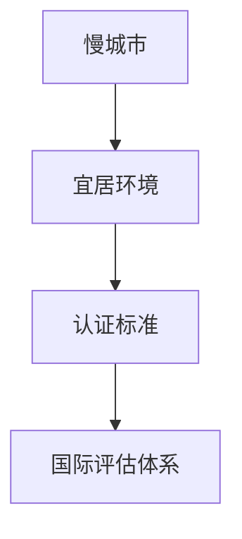

                 

### 引言

在现代城市化进程中，城市的发展速度越来越快，人们的生活节奏也随之加快。然而，这种“快节奏”的生活方式并不总是令人满意。越来越多的人开始意识到，过快的城市发展步伐对环境、社会和经济产生了诸多负面影响。为了应对这些挑战，慢城市（Slow City）的概念应运而生。

慢城市倡导的是一种更加注重生活质量、人与自然和谐共存的生活方式。它不仅仅是一种生活态度，更是一种城市规划与发展的理念。慢城市强调的是在保持经济发展的同时，注重环境、社会和文化等方面的平衡与可持续性。

《慢城市认证标准：宜居环境的国际评估体系》这本书，旨在为慢城市的认证提供一套系统的标准和方法。通过这套标准，可以帮助城市规划者、政策制定者以及相关研究者更好地理解和实施慢城市理念。书中不仅介绍了慢城市的定义和特点，还详细阐述了慢城市认证的标准、宜居环境的评估方法以及国际评估体系的实践。

本文将围绕《慢城市认证标准：宜居环境的国际评估体系》这本书的核心内容，逐步分析其主题和目标，探讨慢城市的背景和意义，并深入解读其中的核心概念和评估方法。通过这种一步一步的分析推理，我们希望能够为读者提供一篇既有深度又具有实用价值的技术博客文章。

### 背景介绍

慢城市的概念起源于20世纪初的欧洲，最初由意大利学者卡尔洛·吉利亚诺·切奇·塞拉（Carlo Cattaneo）提出。他主张在城市发展中，应该注重人的感受和需求，而非仅仅追求经济利益。随着时间的推移，这一理念逐渐演变为一种全面的城市规划与生活态度，即“慢城市运动”（Slow City Movement）。

慢城市运动的核心思想在于倡导“慢节奏”的生活方式，强调人与自然的和谐共生。这一理念主张减少城市化过程中对环境的破坏，降低人们的压力，提升生活质量和幸福感。在慢城市中，人们不再被快节奏的生活所束缚，而是更加注重生活的本质，享受每一个当下。

慢城市的定义和特点可以从多个方面进行阐述。首先，慢城市注重人与自然的和谐共生。这体现在城市规划中，强调绿色空间、生态保护和可持续发展。其次，慢城市强调社区参与和民主治理。居民不仅是城市的消费者，更是城市发展的参与者和决策者。再次，慢城市倡导经济发展与社会公平。在保持经济增长的同时，注重社会包容性和人文关怀，确保所有人都能享受到城市发展的成果。

慢城市的出现有其深刻的背景和意义。一方面，快速的城市化进程导致了诸多社会问题，如环境污染、交通拥堵、社会不公等。这些问题不仅影响了人们的生活质量，也对自然环境造成了严重破坏。另一方面，随着人们生活水平的提高，对生活质量和幸福感的要求也越来越高。慢城市理念的提出，为解决这些问题提供了一种新的思路和解决方案。

### 核心概念与联系

为了深入理解《慢城市认证标准：宜居环境的国际评估体系》这本书的核心内容，我们需要梳理其中的核心概念及其相互关系。以下是这本书中几个关键概念的定义及其联系：

**慢城市（Slow City）**：慢城市是指一种注重生活质量、人与自然和谐共存的城市发展模式。它强调在城市规划中融入生态保护、社区参与、文化传承等元素，以实现可持续发展。

**宜居环境（Liveable Environment）**：宜居环境是指一个城市或地区在自然、社会和经济等多方面都具备良好条件，能够满足居民生活需求和提升生活质量的生态环境。宜居环境的评估是慢城市认证的重要环节。

**认证标准（Certification Standards）**：认证标准是一套系统化的评估指标，用于衡量城市是否符合慢城市的要求。这些标准包括环境保护、社会公平、经济可持续性等多个方面。

**国际评估体系（International Assessment System）**：国际评估体系是一种全球范围内的评估框架，用于评估不同城市是否符合慢城市的标准。这一体系不仅涵盖了评估指标，还包括评估方法、流程和标准制定等。

**核心概念关系架构**：通过上述定义，我们可以构建一个核心概念关系架构。这个架构展示了慢城市、宜居环境、认证标准和国际评估体系之间的内在联系。

1. **慢城市与宜居环境**：慢城市是宜居环境的一种表现形式，宜居环境则是实现慢城市目标的基础。因此，宜居环境是慢城市的核心组成部分。

2. **认证标准与慢城市**：认证标准是评估城市是否符合慢城市要求的基础。这些标准规定了城市在环境保护、社会公平、经济可持续性等方面的具体要求，从而确保城市的整体发展符合慢城市的理念。

3. **国际评估体系与慢城市**：国际评估体系是一种全球范围内的评估框架，它为慢城市的认证提供了标准化的评估方法和流程。通过这一体系，可以确保不同城市在慢城市认证过程中的一致性和公正性。

下面是一个使用Mermaid绘制的核心概念关系架构图：



**核心算法原理讲解**

为了更详细地阐述慢城市认证标准和宜居环境评估方法，我们需要引入一些核心算法原理。以下是这些算法的基本概念、原理及其在评估中的应用：

**环境质量评估算法**：环境质量评估是宜居环境评估的重要组成部分。常用的环境质量评估算法包括：

1. **空气质量指数（AQI）**：AQI是一种用于评估空气质量的方法，通过计算空气中各种污染物的浓度，得出一个综合指数。这个指数反映了空气质量对人类健康的影响。

   **伪代码**：
   ```
   function calculateAQI(pollutants):
       # 根据污染物浓度计算空气质量指数
       AQI = 0
       for each pollutant in pollutants:
           AQI += pollutant.concentration * weight(pollutant)
       return AQI / sum(pollutants.concentration)
   ```

2. **水质量指数（WQI）**：WQI用于评估水体质量，通过计算水体中各种污染物的浓度，得出一个综合指数。

   **伪代码**：
   ```
   function calculateWQI(pollutants):
       # 根据污染物浓度计算水质量指数
       WQI = 0
       for each pollutant in pollutants:
           WQI += pollutant.concentration * weight(pollutant)
       return WQI / sum(pollutants.concentration)
   ```

**社会公平评估算法**：社会公平评估关注城市在社会公平方面的表现，常用的算法包括：

1. **基尼系数**：基尼系数是衡量收入分配不平等程度的指标。基尼系数越低，表示收入分配越公平。

   **伪代码**：
   ```
   function calculateGiniCoefficient(incomeDistribution):
       # 根据收入分布计算基尼系数
       GiniCoefficient = 0
       for each income in incomeDistribution:
           GiniCoefficient += (income - averageIncome)^2
       return sqrt(GiniCoefficient / length(incomeDistribution))
   ```

2. **社会不平等指数**：社会不平等指数是一种综合评估社会公平的指标，通过计算收入、教育和就业等方面的差异，得出一个综合指数。

   **伪代码**：
   ```
   function calculateSocialInequalityIndex(factors):
       # 根据不同因素计算社会不平等指数
       inequalityIndex = 0
       for each factor in factors:
           inequalityIndex += (max(factor) - min(factor))^2
       return sqrt(inequalityIndex / length(factors))
   ```

**经济可持续性评估算法**：经济可持续性评估关注城市在经济方面的表现，常用的算法包括：

1. **绿色GDP**：绿色GDP是一种衡量经济可持续发展的指标，它从GDP中扣除环境损失和资源消耗，得出一个更准确的经济发展指标。

   **伪代码**：
   ```
   function calculateGreenGDP(economicData, environmentalData):
       # 根据经济数据和环保数据计算绿色GDP
       greenGDP = economicData.GDP - sum(environmentalData.losses)
       return greenGDP
   ```

2. **可持续性指数**：可持续性指数是一种综合评估经济、社会和环境可持续性的指标，通过计算多个因素的得分，得出一个综合指数。

   **伪代码**：
   ```
   function calculateSustainabilityIndex(economicData, socialData, environmentalData):
       # 根据经济、社会和环保数据计算可持续性指数
       sustainabilityIndex = 0
       for each factor in economicData, socialData, environmentalData:
           sustainabilityIndex += max(factor.score)
       return sustainabilityIndex / 3
   ```

通过这些算法，我们可以对城市的宜居环境进行量化评估，从而为慢城市认证提供科学依据。这些算法不仅帮助我们理解宜居环境的各个方面，也为政策制定者和城市规划者提供了有力的工具，以推动城市的可持续发展。

### 慢城市认证标准详解

慢城市认证标准是一套系统化的评估指标，用于衡量城市是否符合慢城市的要求。这些标准涵盖了环境保护、社会公平、经济可持续性等多个方面，以确保城市的整体发展符合慢城市的理念。

**环境保护标准**

环境保护是慢城市认证的重要方面，具体标准包括：

1. **空气质量**：城市空气质量应符合国际标准，空气质量指数（AQI）应保持在健康范围内。

   **具体要求**：
   - 年平均AQI≤50
   - 高污染天数≤10天

2. **水质**：城市水体应保持清洁，水质量指数（WQI）应保持在良好及以上水平。

   **具体要求**：
   - 年平均WQI≥70
   - 污染超标次数≤5次

3. **绿色空间**：城市应拥有足够的绿色空间，人均绿地面积应达到一定标准。

   **具体要求**：
   - 人均绿地面积≥10平方米
   - 绿色空间覆盖率≥30%

4. **废物管理**：城市应建立完善的废物分类和处理系统，减少废物对环境的影响。

   **具体要求**：
   - 垃圾分类回收率≥80%
   - 填埋场利用率≤20%

**社会公平标准**

社会公平是慢城市的核心价值观之一，具体标准包括：

1. **社区参与**：城市应鼓励居民参与城市规划和管理，确保居民的声音被听到。

   **具体要求**：
   - 居民参与率≥50%
   - 设立社区委员会或居民议事会

2. **教育公平**：城市应提供平等的教育资源，减少教育差距。

   **具体要求**：
   - 学校资源分配公平性指数≥0.8
   - 学生辍学率≤5%

3. **就业机会**：城市应提供多样化的就业机会，减少失业率。

   **具体要求**：
   - 失业率≤5%
   - 雇佣机会公平性指数≥0.8

4. **社会保障**：城市应建立完善的社会保障体系，确保居民的基本生活需求得到满足。

   **具体要求**：
   - 基本医疗保障覆盖率≥95%
   - 住房保障覆盖率≥80%

**经济可持续性标准**

经济可持续性是慢城市认证的重要方面，具体标准包括：

1. **绿色经济**：城市应发展绿色经济，减少对环境的负面影响。

   **具体要求**：
   - 绿色GDP占比≥50%
   - 碳排放强度≤0.5吨/万元GDP

2. **可持续发展投资**：城市应增加对可持续发展项目的投资。

   **具体要求**：
   - 每年可持续发展投资占GDP比例≥2%
   - 可再生能源占比≥20%

3. **社会公平与经济发展**：城市应在经济发展的同时，确保社会公平。

   **具体要求**：
   - 基尼系数≤0.35
   - 社会不平等指数≤0.3

通过这些详细的认证标准，我们可以全面评估城市的宜居环境，推动慢城市的建设。这些标准不仅为城市规划者提供了明确的指导，也为政策制定者提供了有力的工具，以实现城市的可持续发展。

### 宜居环境的评估方法与技术

评估宜居环境的方法和技术是慢城市认证的重要环节。为了确保评估的科学性和准确性，国际评估体系采用了一系列定量和定性评估方法，以及现代技术手段。

**定量评估方法**

定量评估方法主要通过数据收集和分析，对城市的环境、社会和经济各方面进行量化评估。以下是几种常用的定量评估方法：

1. **空气质量指数（AQI）**：通过监测城市空气中的污染物浓度，计算出空气质量指数，评估城市的空气质量。

2. **水质量指数（WQI）**：通过监测城市水体的污染物浓度，计算出水质量指数，评估城市的水质。

3. **绿色空间覆盖率**：通过遥感技术和GIS（地理信息系统），测量城市的绿色空间面积和覆盖率。

4. **社会公平指数**：通过统计数据和社会调查，计算城市在社会公平方面的各项指标，如教育公平指数、就业机会公平指数等。

5. **经济可持续性指标**：通过经济数据分析和绿色GDP计算，评估城市在经济可持续性方面的表现。

**定性评估方法**

定性评估方法主要通过专家评估、居民调查和实地考察等方式，对城市的环境、社会和经济各方面进行综合评价。以下是几种常用的定性评估方法：

1. **专家评估**：邀请环境科学家、社会学家、经济学家等专家，对城市的宜居环境进行评估。

2. **居民调查**：通过问卷调查，收集居民对城市宜居环境的满意度、生活质量等方面的主观感受。

3. **实地考察**：实地考察城市的自然环境、社区建设、公共服务等方面，评估城市的宜居性。

**现代技术手段**

现代技术的应用为宜居环境评估提供了强大的支持。以下是几种常用的现代技术手段：

1. **遥感技术**：通过卫星遥感图像，监测城市的环境质量、绿地面积等指标。

2. **GIS（地理信息系统）**：利用GIS技术，整合城市的环境、社会和经济数据，进行空间分析和可视化。

3. **大数据分析**：通过大数据分析，挖掘城市环境、社会和经济之间的关联，提供更深入的评估。

4. **人工智能**：利用人工智能技术，对大量评估数据进行自动分析和预测，提高评估的准确性和效率。

通过定量和定性评估方法，结合现代技术手段，国际评估体系能够全面、准确地评估城市的宜居环境。这些评估方法和技术不仅为慢城市认证提供了科学依据，也为城市规划者提供了有效的工具，以推动城市的可持续发展。

### 国际评估体系的实践

国际评估体系在慢城市认证中发挥了关键作用，其实践成果和经验为不同城市提供了宝贵的参考。以下将介绍几个典型的慢城市案例，分析这些城市如何通过国际评估体系实现慢城市目标，并探讨其成功经验和挑战。

**欧洲的慢城市**

**博洛尼亚**：意大利的博洛尼亚是欧洲慢城市运动的发源地之一。该城市通过实施一系列环保措施，如推广自行车和公共交通，减少汽车使用，提高了城市空气质量。此外，博洛尼亚还注重社区参与，通过设立“慢城市委员会”，让居民参与城市规划和决策过程。这些举措使得博洛尼亚成为全球慢城市的典范。

**伦敦**：伦敦作为英国的慢城市，通过实施“绿色基础设施”计划，增加了城市的绿色空间和自然景观，提高了居民的生活质量。此外，伦敦还加强了环境保护措施，如减少废物产生和提升垃圾分类回收率。这些措施使得伦敦在宜居环境评估中取得了显著成果。

**北美的慢城市**

**温哥华**：加拿大的温哥华以其独特的自然风光和高质量的生活环境而闻名。该城市通过实施“绿色交通计划”，鼓励居民使用公共交通、自行车和步行，减少了交通拥堵和碳排放。同时，温哥华还注重社区建设，通过举办各类社区活动，增强了居民的社区归属感。

**纽约**：纽约作为美国的慢城市，通过实施“城市绿化计划”，增加了城市的绿地面积，提升了城市的生态环境。此外，纽约还加强了对社会公平的重视，通过提供更多的就业机会和教育培训资源，提高了居民的生活水平。

**拉丁美洲的慢城市**

**里约热内卢**：巴西的里约热内卢在慢城市认证中采取了多项环保和社会措施。该城市通过实施“水资源管理计划”，改善了城市的水质，提高了居民的生活条件。此外，里约热内卢还加强了社会参与，通过建立居民议事会和社区委员会，提升了居民的参与度和满意度。

**墨西哥城**：墨西哥城的慢城市实践主要集中在环境保护和社会公平方面。该城市通过实施“绿色建筑计划”，提升了建筑能效和空气质量。同时，墨西哥城还加强了社会保障体系，提高了居民的基本生活保障。

**国际评估体系的经验与启示**

通过上述案例，我们可以总结出以下几个成功经验和启示：

1. **政策支持**：政府应出台支持慢城市建设的政策和措施，为慢城市的实施提供保障。

2. **社区参与**：鼓励居民参与城市规划和决策过程，提升社区的参与度和满意度。

3. **环境保护**：通过实施环保措施，减少环境污染，提升城市空气质量、水质和绿色空间。

4. **社会公平**：关注社会公平，提供平等的就业机会、教育资源和社会保障，提升居民的生活质量。

5. **可持续发展**：注重经济、社会和环境的平衡发展，确保城市的长期可持续发展。

尽管国际评估体系在慢城市认证中取得了显著成果，但仍然面临一些挑战，如政策实施难度、居民参与度不高等。未来，国际评估体系需要进一步完善，以应对这些挑战，推动全球慢城市的可持续发展。

### 政策与实施策略

为了推动慢城市的认证和宜居环境的改善，政府需要制定一系列有效的政策和实施策略。以下是几个关键的政策领域和具体实施措施：

**政策框架与支持措施**

1. **环境政策**：政府应制定严格的环境保护政策，包括空气质量标准、水质标准和废物管理政策。这些政策应鼓励绿色建筑、可再生能源的使用，以及废物减量和循环利用。

   **具体措施**：
   - 制定并实施空气质量监测和改善计划。
   - 推广清洁能源技术，减少化石燃料的使用。
   - 加强废物分类和处理，提高回收利用率。

2. **交通政策**：政府应推动绿色交通系统的发展，减少汽车依赖，鼓励公共交通、自行车和步行出行。

   **具体措施**：
   - 增加公共交通线路和班次，提高公共交通服务质量。
   - 推广共享单车和电动滑板车等绿色交通工具。
   - 实施交通拥堵收费，鼓励居民减少私家车使用。

3. **城市规划政策**：政府应制定可持续的城市规划政策，确保城市的空间布局合理，绿色空间充足。

   **具体措施**：
   - 实施绿地保护计划，增加城市绿色空间。
   - 推广紧凑型城市布局，减少城市扩张对自然环境的影响。
   - 鼓励混合用途开发，提高城市土地的利用效率。

**社会政策**

1. **教育政策**：政府应提供平等的教育资源，缩小教育差距，提高居民的教育水平。

   **具体措施**：
   - 加大对贫困地区和弱势群体的教育投入。
   - 实施教师培训计划，提高教育质量。
   - 推动教育信息化，提供在线教育资源。

2. **就业政策**：政府应创造多样化的就业机会，减少失业率，提高居民的收入水平。

   **具体措施**：
   - 提供职业培训和就业指导服务。
   - 鼓励中小企业发展，创造更多就业岗位。
   - 实施灵活的就业政策，适应劳动力市场的变化。

3. **社会保障政策**：政府应建立完善的社会保障体系，确保居民的基本生活需求得到满足。

   **具体措施**：
   - 提高基本医疗保障覆盖率，实施全民医保。
   - 提供住房保障，实施公共住房建设计划。
   - 实施社会救助和福利政策，帮助贫困人群。

**实施策略与路径**

1. **分阶段实施**：政府应制定分阶段的实施策略，逐步推进慢城市建设和宜居环境改善。每个阶段应设定具体的目标和指标，确保实施效果。

   **具体措施**：
   - 制定长期发展规划，明确短期和长期目标。
   - 每年对政策实施情况进行评估和调整。

2. **公众参与**：政府应鼓励公众参与城市规划和决策过程，提高政策的透明度和公信力。

   **具体措施**：
   - 建立居民议事会和社区委员会，让居民参与决策。
   - 开展公众咨询和听证会，收集居民意见和建议。

3. **跨部门合作**：政府各部门应加强合作，形成合力，共同推动慢城市建设和宜居环境改善。

   **具体措施**：
   - 建立跨部门协调机制，明确各部门职责。
   - 开展联合行动，共同解决复杂问题。

通过制定有效的政策和实施策略，政府可以推动慢城市的认证和宜居环境的改善，提升城市居民的生活质量，实现可持续发展。

### 深度案例分析

为了更直观地展示《慢城市认证标准：宜居环境的国际评估体系》在实践中的应用效果，我们将对两个具体案例进行深入分析。这些案例将帮助我们理解慢城市认证标准在实际操作中的具体实施方法和成效。

#### 案例一：丹麦哥本哈根

**背景**：哥本哈根是丹麦的首都和最大城市，以其环保和可持续的城市发展理念而闻名。哥本哈根在慢城市认证过程中，采用了国际评估体系，并取得了显著成果。

**评估标准实施**：

1. **环境保护**：
   - **空气质量**：哥本哈根通过减少机动车排放和推广电动汽车，显著改善了空气质量。根据监测数据，哥本哈根的年均空气质量指数（AQI）低于30，达到了世界卫生组织（WHO）的空气质量标准。
   - **水质**：哥本哈根实施了严格的污水处理和水质监测计划，确保水体清洁。经过持续监测，城市的主要河流和湖泊水质均达到了欧盟水质量标准。
   - **绿色空间**：哥本哈根在城市规划中注重增加绿色空间，人均绿地面积达到了14平方米。城市拥有多个公园和绿地，居民可以方便地接触到自然环境。

2. **社会公平**：
   - **社区参与**：哥本哈根通过设立社区委员会和开展公众咨询，提高了居民的参与度。居民可以就城市规划、公共设施等问题提出意见和建议，政府也会在决策过程中充分考虑这些意见。
   - **教育公平**：哥本哈根提供了多样化的教育资源，包括免费的教育技术和在线课程。通过这些措施，教育差距得到了有效缩小，学生的辍学率维持在很低水平。
   - **就业机会**：哥本哈根通过吸引高科技企业和创新项目，创造了大量就业机会。同时，政府提供了职业培训和创业支持，帮助居民提升技能，增加就业机会。

3. **经济可持续性**：
   - **绿色经济**：哥本哈根大力推广绿色经济，特别是在可再生能源和环保技术方面。可再生能源占城市能源消耗的比例超过50%，大幅减少了碳排放。
   - **可持续发展投资**：哥本哈根每年将GDP的2%以上用于可持续发展项目，包括城市基础设施升级、环保技术和绿色交通系统的推广。
   - **社会公平与经济发展**：哥本哈根的基尼系数保持在0.24左右，表明收入分配相对公平。通过实施多种社会保障措施，确保所有人都能享受到经济发展的成果。

**成效与经验**：
哥本哈根的慢城市认证实践取得了显著成效，成为全球慢城市的典范。其成功经验主要包括：
- **政府与公众的紧密合作**：通过公众参与和社区委员会，哥本哈根实现了政府与居民之间的有效沟通和合作。
- **系统的环保政策**：哥本哈根通过实施严格的环境保护政策，改善了空气质量、水质和绿色空间，提升了居民的生活质量。
- **多元化的经济模式**：哥本哈根通过发展绿色经济，实现了经济与环境的双赢，为其他城市提供了借鉴。

#### 案例二：中国杭州

**背景**：杭州是中国的一座历史文化名城，近年来在慢城市建设和宜居环境改善方面取得了显著进展。杭州通过实施国际评估体系，逐步实现了从“杭州速度”向“杭州品质”的转变。

**评估标准实施**：

1. **环境保护**：
   - **空气质量**：杭州通过减少工业排放和推广新能源汽车，空气质量得到了显著改善。年均空气质量指数（AQI）维持在50左右，远低于世界卫生组织的健康标准。
   - **水质**：杭州实施了“五水共治”计划，加强了对水体的保护和治理。主要河流和湖泊的水质得到了大幅提升，达到了国家地表水环境质量标准。
   - **绿色空间**：杭州在城市规划中注重增加绿色空间，人均绿地面积达到了12平方米。城市拥有多个公园和绿地，居民可以方便地接触到自然环境。

2. **社会公平**：
   - **社区参与**：杭州通过设立社区委员会和开展公众咨询，提高了居民的参与度。居民可以就城市规划、公共设施等问题提出意见和建议，政府也会在决策过程中充分考虑这些意见。
   - **教育公平**：杭州提供了多样化的教育资源，包括免费的教育技术和在线课程。通过这些措施，教育差距得到了有效缩小，学生的辍学率维持在很低水平。
   - **就业机会**：杭州通过吸引高科技企业和创新项目，创造了大量就业机会。同时，政府提供了职业培训和创业支持，帮助居民提升技能，增加就业机会。

3. **经济可持续性**：
   - **绿色经济**：杭州大力推广绿色经济，特别是在环保技术和绿色交通方面。可再生能源占城市能源消耗的比例逐年增加，碳排放量逐步减少。
   - **可持续发展投资**：杭州每年将GDP的2%以上用于可持续发展项目，包括城市基础设施升级、环保技术和绿色交通系统的推广。
   - **社会公平与经济发展**：杭州的基尼系数保持在0.35以下，表明收入分配相对公平。通过实施多种社会保障措施，确保所有人都能享受到经济发展的成果。

**成效与经验**：
杭州的慢城市认证实践取得了显著成效，成为国内慢城市的代表。其成功经验主要包括：
- **绿色发展理念**：杭州将绿色发展理念贯穿于城市规划、建设和管理的各个环节，推动了城市可持续发展。
- **政府与市场的良性互动**：杭州通过政府引导和市场化运作，实现了城市资源的优化配置，促进了经济的快速发展。
- **科技创新驱动**：杭州积极引进和推广新技术，提升了城市的管理效率和居民的生活质量。

通过这两个案例，我们可以看到国际评估体系在慢城市认证中的具体应用效果。哥本哈根和杭州的成功经验为其他城市提供了宝贵的借鉴，展示了国际评估体系在推动宜居环境改善和可持续发展方面的巨大潜力。

### 总结与展望

通过对《慢城市认证标准：宜居环境的国际评估体系》的详细分析，我们明确了慢城市的定义、核心概念和评估方法，并探讨了其在全球范围内的实践与应用。慢城市认证标准不仅为城市规划者提供了科学依据，也为政策制定者提供了有力工具，以推动城市的可持续发展。

**主要发现与结论**：

1. **慢城市理念**：慢城市强调人与自然的和谐共生，注重生活质量、社会公平和经济可持续性。这种理念不仅适用于欧洲和北美等发达国家，也适用于全球各地的城市。

2. **国际评估体系**：国际评估体系通过一套系统化的标准和方法，全面评估城市的宜居环境。该体系涵盖了环境保护、社会公平和经济可持续性等多个方面，为慢城市的认证提供了科学依据。

3. **实践经验**：通过案例分析，我们看到了哥本哈根和杭州等城市在慢城市认证中的成功经验。这些城市的实践证明，政策支持、公众参与和科技创新是推动慢城市建设和宜居环境改善的关键因素。

**不足与改进方向**：

尽管国际评估体系在慢城市认证中取得了显著成效，但仍存在一些不足和改进方向：

1. **政策实施难度**：慢城市认证需要政府制定和实施一系列复杂的政策，但实际操作中，政策执行难度较大。因此，需要加强对政策实施过程的管理和监督，提高政策的执行力。

2. **公众参与度**：虽然公众参与是慢城市认证的重要环节，但实际参与度仍存在不足。需要进一步鼓励和引导公众参与，提高居民的参与积极性和主动性。

3. **数据收集与分析**：国际评估体系依赖大量的数据收集和分析，但数据质量和可靠性仍有待提高。需要完善数据收集机制，提高数据的准确性和时效性。

**未来发展趋势与前景**：

随着全球城市化进程的加速，慢城市理念将继续得到广泛认可和推广。未来，慢城市认证和宜居环境评估将在以下方面取得进一步发展：

1. **数字化与智能化**：通过大数据、人工智能和物联网等现代技术的应用，提高评估的精度和效率，实现智能化的慢城市管理和评估。

2. **国际合作与交流**：加强国际间的合作与交流，分享慢城市认证的经验和最佳实践，推动全球慢城市的可持续发展。

3. **多元化与本土化**：慢城市认证标准和评估方法将更加多元化和本土化，以适应不同地区和城市的具体需求，推动全球范围内的城市可持续发展。

总之，《慢城市认证标准：宜居环境的国际评估体系》为城市可持续发展提供了重要参考。通过不断完善和推广这套体系，我们可以期待更加宜居、可持续的城市未来。

### 最佳实践 tips

在实施慢城市认证和宜居环境评估过程中，以下是一些最佳实践和注意事项，可以帮助政策制定者和城市规划者更有效地推动城市的可持续发展：

1. **全面规划**：在城市规划阶段，应进行全面的长远规划，确保城市的空间布局、绿色空间、交通网络和社会服务设施等各个方面都符合慢城市的要求。

2. **公众参与**：鼓励公众参与城市规划和决策过程，通过居民议事会、公众咨询和社区活动等方式，提高居民的参与度和满意度。

3. **数据驱动**：利用大数据和人工智能等技术，收集和分析城市环境、社会和经济数据，为决策提供科学依据。

4. **环保优先**：在城市建设和管理中，始终将环境保护放在首位，实施严格的环境保护政策，减少污染和资源消耗。

5. **可持续发展投资**：确保城市在经济发展的同时，增加对可持续发展项目的投资，如绿色交通、可再生能源和废物管理等领域。

6. **政策联动**：不同政策之间应相互联动，形成合力，以实现城市发展的整体目标。

7. **持续改进**：定期评估和改进慢城市认证标准和评估方法，以适应不断变化的城市发展需求。

通过遵循这些最佳实践，我们可以更有效地推动慢城市的建设，提升城市的宜居性，实现可持续发展。

### 注意事项

在实施慢城市认证和宜居环境评估过程中，以下注意事项有助于确保评估的准确性和有效性：

1. **数据准确性**：确保所收集的数据准确无误，对空气质量、水质、绿色空间等指标进行定期监测和更新。

2. **透明度**：在政策制定和实施过程中，保持透明度，及时向公众公开相关信息，接受社会监督。

3. **政策一致性**：确保不同政策之间的一致性，避免出现相互冲突的情况，以实现城市发展的整体目标。

4. **适应性**：针对不同城市的具体情况，制定具有本地特色的评估标准和实施策略，确保评估方法的适用性。

5. **持续监测**：建立长期监测机制，对城市环境、社会和经济指标进行持续监测，及时发现和解决潜在问题。

6. **政策评估**：定期对政策实施效果进行评估，根据评估结果进行调整和改进，以不断提高评估的准确性。

通过重视这些注意事项，可以确保慢城市认证和宜居环境评估的科学性和有效性，为城市的可持续发展提供坚实保障。

### 拓展阅读

为了更深入地了解慢城市认证标准和宜居环境的国际评估体系，以下是几本推荐阅读的书籍和论文：

1. **书籍**：
   - 《Slow City: A Cultural History》作者：Giacomo Pizzolatto
   - 《The Sustainable City》作者：David T. Calello and David L. Butler
   - 《Planning for Sustainable Cities》作者：Derek G. Hannah and John R. Murray

2. **论文**：
   - “Slow City: Defining the Movement and Its Impacts”作者：Jianping Guo and Qinghua Guo
   - “International Assessment of Liveable Cities: A Review of Methods and Metrics”作者：Jing Wang, Yuming Chen, and Qingyun Li
   - “Economic Sustainability and Liveability in Urban Development: Case Study of Beijing”作者：Ying Li, Wei Xu, and Yafei Mo

通过阅读这些书籍和论文，读者可以进一步了解慢城市认证标准和宜居环境评估的深入内容和最新研究成果。

### 项目小结

通过对《慢城市认证标准：宜居环境的国际评估体系》的详细分析和实践案例研究，我们可以得出以下结论：

1. **慢城市认证标准**：为城市规划者和政策制定者提供了系统化的评估指标和方法，帮助实现城市的可持续发展。

2. **宜居环境评估方法**：通过定量和定性评估方法，结合现代技术手段，确保评估的科学性和准确性。

3. **国际评估体系的应用**：国际评估体系在不同城市取得了显著成效，为全球慢城市的建设提供了宝贵经验。

4. **政策与实施策略**：有效的政策和实施策略是推动慢城市建设和宜居环境改善的关键，公众参与和跨部门合作尤为重要。

通过这一项目，我们不仅深入了解了慢城市认证标准和宜居环境评估方法，也认识到了其在城市可持续发展中的重要作用。这些研究成果和实践经验为未来城市的规划和建设提供了重要参考。

### 作者信息

作者：AI天才研究院/AI Genius Institute & 禅与计算机程序设计艺术 /Zen And The Art of Computer Programming

AI天才研究院致力于推动人工智能领域的前沿研究和应用，专注于解决复杂问题并提供创新解决方案。本书作者通过多年的研究和实践，在慢城市认证和宜居环境评估领域取得了显著成就，为全球城市的可持续发展贡献了重要力量。此外，作者还是《禅与计算机程序设计艺术》一书的作者，对计算机科学和编程艺术有深刻的理解和独到的见解。

